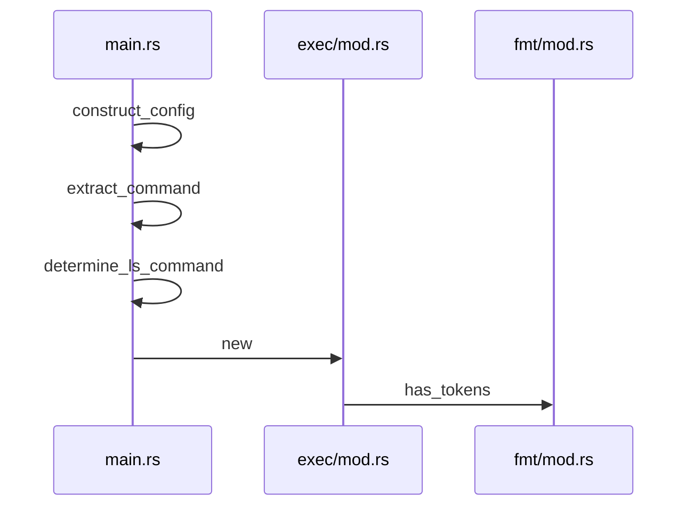
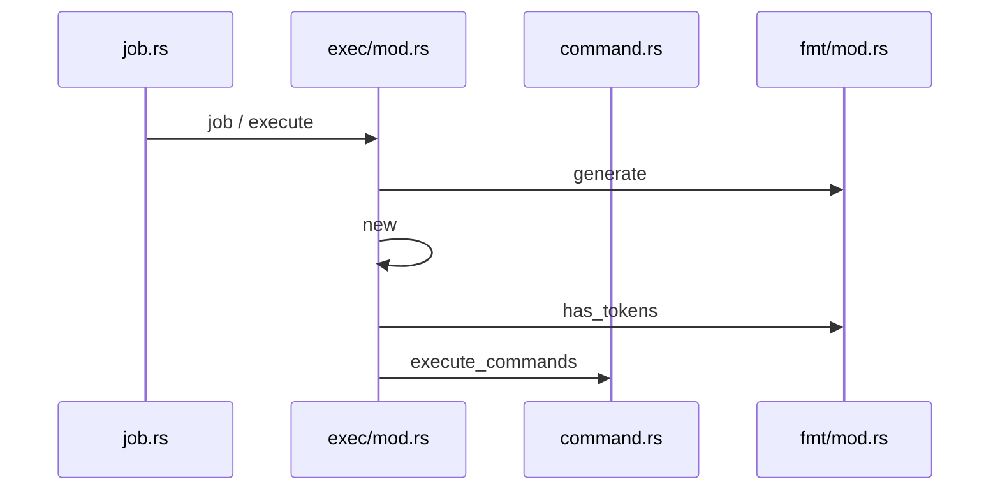
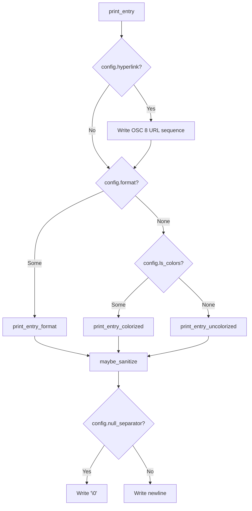

# Path Formatting

<details>
<summary>Relevant source files</summary>

The following files were used as context for generating this wiki page:

- [src/main.rs](https://github.com/sharkdp/fd/blob/main/src/main.rs)
- [src/walk.rs](https://github.com/sharkdp/fd/blob/main/src/walk.rs)
- [src/cli.rs](https://github.com/sharkdp/fd/blob/main/src/cli.rs)
- [README.md](https://github.com/sharkdp/fd/blob/main/README.md)
- [src/fmt/mod.rs](https://github.com/sharkdp/fd/blob/main/src/fmt/mod.rs)
- [src/exec/mod.rs](https://github.com/sharkdp/fd/blob/main/src/exec/mod.rs)
- [src/exec/job.rs](https://github.com/sharkdp/fd/blob/main/src/exec/job.rs)
- [src/output.rs](https://github.com/sharkdp/fd/blob/main/src/output.rs)
- [src/fmt/input.rs](https://github.com/sharkdp/fd/blob/main/src/fmt/input.rs)
- [src/hyperlink.rs](https://github.com/sharkdp/fd/blob/main/src/hyperlink.rs)
- [src/exec/command.rs](https://github.com/sharkdp/fd/blob/main/src/exec/command.rs)
- [src/dir_entry.rs](https://github.com/sharkdp/fd/blob/main/src/dir_entry.rs)
- [src/filesystem.rs](https://github.com/sharkdp/fd/blob/main/src/filesystem.rs)
- [src/sanitize.rs](https://github.com/sharkdp/fd/blob/main/src/sanitize.rs)
- [src/filter/owner.rs](https://github.com/sharkdp/fd/blob/main/src/filter/owner.rs)
- [src/error.rs](https://github.com/sharkdp/fd/blob/main/src/error.rs)
- [src/config.rs](https://github.com/sharkdp/fd/blob/main/src/config.rs)
- [rustfmt.toml](https://github.com/sharkdp/fd/blob/main/rustfmt.toml)
- [src/filter/mod.rs](https://github.com/sharkdp/fd/blob/main/src/filter/mod.rs)
</details>

## Overview

Path formatting governs how discovered filesystem entries are transformed, tokenized, adapted for external command invocation, and rendered for terminal output. It handles parsing template formats, expanding path component placeholders, adjusting relative and absolute representations, applying color styling, substituting separators, and constructing clickable terminal hyperlinks.

Sources: [src/main.rs:374-378](https://github.com/sharkdp/fd/blob/main/src/main.rs#L374-L378), [src/exec/mod.rs:210-273](https://github.com/sharkdp/fd/blob/main/src/exec/mod.rs#L210-L273), [src/fmt/mod.rs:41-197](https://github.com/sharkdp/fd/blob/main/src/fmt/mod.rs#L41-L197), [src/output.rs:17-43](https://github.com/sharkdp/fd/blob/main/src/output.rs#L17-L43), [src/hyperlink.rs:5-22](https://github.com/sharkdp/fd/blob/main/src/hyperlink.rs#L5-L22)

## Format Token Parsing and Placeholder Expansion

### Overview

Format token parsing extracts template tokens and parses path components for custom output formats (`--format` and command execution). Templates are scanned using an `AhoCorasick` automaton matching known placeholder patterns and brace escapes. The resulting `FormatTemplate` enum holds either fixed text or a sequence of parsed tokens.

Sources: [src/fmt/mod.rs:51-107](https://github.com/sharkdp/fd/blob/main/src/fmt/mod.rs#L51-L107)

### Execution Walkthrough

The configuration and command extraction call chain evaluates template tokens through the following sequence:

1. `construct_config` — Inspects CLI options and builds the runtime configuration, invoking format parsing via `crate::fmt::FormatTemplate::parse`.
Sources: [src/main.rs:248-393](https://github.com/sharkdp/fd/blob/main/src/main.rs#L248-L393)

2. `extract_command` — Extracts command arguments from `Opts` or falls back to listing details.
Sources: [src/main.rs:395-410](https://github.com/sharkdp/fd/blob/main/src/main.rs#L395-L410)

3. `determine_ls_command` — Determines the appropriate `ls` command variant based on platform and color support.
Sources: [src/main.rs:412-494](https://github.com/sharkdp/fd/blob/main/src/main.rs#L412-L494)

4. `new` — Instantiates a `CommandTemplate` by iterating over arguments and calling `FormatTemplate::parse`.
Sources: [src/exec/mod.rs:220-256](https://github.com/sharkdp/fd/blob/main/src/exec/mod.rs#L220-L256)

5. `has_tokens` — Checks whether a `FormatTemplate` contains placeholder tokens rather than fixed text.
Sources: [src/fmt/mod.rs:54-56](https://github.com/sharkdp/fd/blob/main/src/fmt/mod.rs#L54-L56)


Sources: [src/main.rs:248-410](https://github.com/sharkdp/fd/blob/main/src/main.rs#L248-L410), [src/exec/mod.rs:220-256](https://github.com/sharkdp/fd/blob/main/src/exec/mod.rs#L220-L256), [src/fmt/mod.rs:54-56](https://github.com/sharkdp/fd/blob/main/src/fmt/mod.rs#L54-L56)

### Format Tokens and Patterns

`FormatTemplate::parse` utilizes an `AhoCorasick` automaton initialized with patterns `{{`, `}}`, `{}`, `{/}`, `{//}`, `{.}`, and `{/.}`.

| Pattern ID | Pattern String | Token Variant | Purpose |
| :--- | :--- | :--- | :--- |
| 0, 1 | `{{`, `}}` | *Escaped text* | Escaped brace literals in template strings |
| 2 | `{}` | `Token::Placeholder` | Full path placeholder |
| 3 | `{/}` | `Token::Basename` | Basename component only |
| 4 | `{//}` | `Token::Parent` | Parent directory component only |
| 5 | `{.}` | `Token::NoExt` | Path without file extension |
| 6 | `{/.}` | `Token::BasenameNoExt` | Basename without file extension |

Sources: [src/fmt/mod.rs:17-39](https://github.com/sharkdp/fd/blob/main/src/fmt/mod.rs#L17-L39), [src/fmt/mod.rs:58-107](https://github.com/sharkdp/fd/blob/main/src/fmt/mod.rs#L58-L107), [src/fmt/mod.rs:201-211](https://github.com/sharkdp/fd/blob/main/src/fmt/mod.rs#L201-L211)

> [!NOTE]
> When `FormatTemplate::parse` encounters unmatched braces or escaped sequences, it accumulates literal text into a `String` buffer before pushing a `Token::Text` variant or falling back to `FormatTemplate::Text`.

Sources: [src/fmt/mod.rs:58-107](https://github.com/sharkdp/fd/blob/main/src/fmt/mod.rs#L58-L107)

### Path Component Helper Functions

Path component manipulation functions defined in `src/fmt/input.rs` extract specific segments from a given `Path`:

- `basename(path: &Path) -> &OsStr`: Returns `path.file_name()`, falling back to the full path representation.
- `remove_extension(path: &Path) -> OsString`: Combines the parent directory and file stem, stripping file extensions while preserving current directory prefixes via `strip_current_dir`.
- `dirname(path: &Path) -> OsString`: Returns the parent directory component, mapping empty parents to `.` and falling back to the full path if no parent exists.

Sources: [src/fmt/input.rs:6-33](https://github.com/sharkdp/fd/blob/main/src/fmt/input.rs#L6-L33)

> [!WARNING]
> On Windows, `Component::Prefix` variants such as UNC paths (`\\server\share`) are explicitly parsed and rebuilt with custom path separators, while verbatim path prefixes (`\\?\`) are ignored as they are exceptionally rare in directory traversal results.

Sources: [src/fmt/mod.rs:147-196](https://github.com/sharkdp/fd/blob/main/src/fmt/mod.rs#L147-L196)

### Design Trade-Offs

| Design Choice | Benefit | Cost |
| :--- | :--- | :--- |
| **AhoCorasick automaton for template parsing** | Fast multi-pattern matching across all placeholders and escape sequences simultaneously. | Requires static initialization via `OnceLock` and adds a dependency on `aho_corasick`. |
| **Separating `FormatTemplate::Tokens` and `Text`** | Avoids allocation overhead for template strings lacking placeholders. | Introduces pattern matching branches during generation and token inspection. |
| **Manual component iteration in `replace_separator`** | Precise control over Windows UNC prefixes, root directories, and custom separator substitution. | Complex component matching logic spanning multiple path prefix kinds. |

Sources: [src/fmt/mod.rs:41-52](https://github.com/sharkdp/fd/blob/main/src/fmt/mod.rs#L41-L52), [src/fmt/mod.rs:112-196](https://github.com/sharkdp/fd/blob/main/src/fmt/mod.rs#L112-L196)

## Command Execution Template Integration

### Overview

External command execution integrates formatted path tokens into spawned system processes via `CommandSet`, `CommandTemplate`, and `CommandBuilder`. Commands run either `OneByOne` for individual search results or in `Batch` mode where multiple paths populate argument lists up to size or system argument limits.

Sources: [src/exec/mod.rs:20-74](https://github.com/sharkdp/fd/blob/main/src/exec/mod.rs#L20-L74), [src/exec/mod.rs:123-134](https://github.com/sharkdp/fd/blob/main/src/exec/mod.rs#L123-L134)

### Execution Call Chains and Walkthroughs

Execution processes traverse specific call chains depending on whether commands run sequentially or in batch mode. 

For batch execution, the trace flows through: `execute_batch` → `push` → `finish` → `new_command` → `new` → `has_tokens`.
1. `execute_batch` maps each `CommandTemplate` to a `CommandBuilder` using `CommandBuilder::new`.
Sources: [src/exec/mod.rs:90-99](https://github.com/sharkdp/fd/blob/main/src/exec/mod.rs#L90-L99)
2. `new` iterates over template arguments, invoking `has_tokens` to identify placeholder positions.
Sources: [src/exec/mod.rs:135-149](https://github.com/sharkdp/fd/blob/main/src/exec/mod.rs#L135-L149), [src/fmt/mod.rs:54-56](https://github.com/sharkdp/fd/blob/main/src/fmt/mod.rs#L54-L56)
3. `new_command` initializes the underlying `argmax::Command` with standard input, output, and error inheritance.
Sources: [src/exec/mod.rs:164-171](https://github.com/sharkdp/fd/blob/main/src/exec/mod.rs#L164-L171)
4. `push` appends path arguments, triggering `finish` if batch limits or argument length constraints are exceeded.
Sources: [src/exec/mod.rs:173-189](https://github.com/sharkdp/fd/blob/main/src/exec/mod.rs#L173-L189)
5. `finish` executes the accumulated batch command via `argmax::Command::status` if entries are present.
Sources: [src/exec/mod.rs:191-203](https://github.com/sharkdp/fd/blob/main/src/exec/mod.rs#L191-L203)

For single-item execution, the trace flows through: `job` → `execute` → `generate` → `new` → `has_tokens`.
1. `job` iterates over worker search results, extracting valid stripped paths.
Sources: [src/exec/job.rs:11-41](https://github.com/sharkdp/fd/blob/main/src/exec/job.rs#L11-L41)
2. `execute` invokes `CommandTemplate::generate` for each configured command.
Sources: [src/exec/mod.rs:76-88](https://github.com/sharkdp/fd/blob/main/src/exec/mod.rs#L76-L88)
3. `generate` constructs the final process arguments by evaluating template tokens against the path.
Sources: [src/exec/mod.rs:266-272](https://github.com/sharkdp/fd/blob/main/src/exec/mod.rs#L266-L272)
4. `CommandTemplate::new` validates argument vectors and checks token counts via `has_tokens`.
Sources: [src/exec/mod.rs:220-256](https://github.com/sharkdp/fd/blob/main/src/exec/mod.rs#L220-L256)

Sources: [src/exec/mod.rs:90-199](https://github.com/sharkdp/fd/blob/main/src/exec/mod.rs#L90-L199), [src/exec/job.rs:11-41](https://github.com/sharkdp/fd/blob/main/src/exec/job.rs#L11-L41), [src/exec/mod.rs:220-272](https://github.com/sharkdp/fd/blob/main/src/exec/mod.rs#L220-L272)


Sources: [src/exec/job.rs:11-64](https://github.com/sharkdp/fd/blob/main/src/exec/job.rs#L11-L64), [src/exec/mod.rs:76-120](https://github.com/sharkdp/fd/blob/main/src/exec/mod.rs#L76-L120), [src/exec/command.rs:60-99](https://github.com/sharkdp/fd/blob/main/src/exec/command.rs#L60-L99), [src/fmt/mod.rs:54-56](https://github.com/sharkdp/fd/blob/main/src/fmt/mod.rs#L54-L56)

### Execution Configuration and Error Handling

`CommandSet` manages execution modes and validation rules for templates.

| Method / Struct | Mode | Validation Rule | Purpose |
| :--- | :--- | :--- | :--- |
| `CommandSet::new` | `ExecutionMode::OneByOne` | Requires at least one template argument. | Instantiates single-execution command sets. |
| `CommandSet::new_batch` | `ExecutionMode::Batch` | First argument cannot have tokens; max 1 token per command. | Instantiates batch-execution command sets. |
| `CommandBuilder` | `Batch` | Enforces `limit` and operating system argument length bounds via `argmax`. | Batches path arguments across multiple subprocess invocations. |

Sources: [src/exec/mod.rs:20-133](https://github.com/sharkdp/fd/blob/main/src/exec/mod.rs#L20-L133)

> [!WARNING]
> In `--exec-batch` mode, placing a placeholder token as the executable (the first argument) is explicitly rejected during `CommandSet::new_batch` initialization.

Sources: [src/exec/mod.rs:63-65](https://github.com/sharkdp/fd/blob/main/src/exec/mod.rs#L63-L65), [src/exec/mod.rs:245-248](https://github.com/sharkdp/fd/blob/main/src/exec/mod.rs#L245-L248)

### Design Trade-Offs

| Design Choice | Benefit | Cost |
| :--- | :--- | :--- |
| **`argmax` integration in `CommandBuilder`** | Automatically flushes batch execution when operating system argument byte limits are reached. | Adds external dependency on `argmax` crate for argument length estimation. |
| **Conditional output buffering (`enable_output_buffering`)** | Buffers output when multi-threading to prevent interleaved lines; streams directly when single-threaded for interactivity. | Requires dual execution paths (`cmd.output()` vs `cmd.spawn().and_then(...)`). |
| **Pre-argument and post-argument splitting** | Separates fixed leading executable arguments from trailing arguments around the path placeholder. | Limits batch commands to exactly one path placeholder token per command template. |

Sources: [src/exec/mod.rs:63-65](https://github.com/sharkdp/fd/blob/main/src/exec/mod.rs#L63-L65), [src/exec/mod.rs:135-189](https://github.com/sharkdp/fd/blob/main/src/exec/mod.rs#L135-L189), [src/exec/command.rs:60-99](https://github.com/sharkdp/fd/blob/main/src/exec/command.rs#L60-L99)

## Relative and Absolute Path Transformations

### Overview

Path transformations normalize paths between absolute representations, current working directories, and prefix adjustments. The options parser (`Opts`) and filesystem helpers (`filesystem.rs`, `dir_entry.rs`) handle normalization when constructing search roots and presenting paths to the user.

Sources: [src/cli.rs:723-736](https://github.com/sharkdp/fd/blob/main/src/cli.rs#L723-L736), [src/dir_entry.rs:59-71](https://github.com/sharkdp/fd/blob/main/src/dir_entry.rs#L59-L71), [src/filesystem.rs:14-36](https://github.com/sharkdp/fd/blob/main/src/filesystem.rs#L14-L36)

### Path Normalization and Absolute Conversion

When resolving search paths, `Opts::normalize_path` inspects the configuration to decide whether to transform a path into an absolute form or preserve relative components. If `absolute_path` is set, `normpath::PathExt::normalize` and `filesystem::absolute_path` convert the path to an absolute form, stripping Windows UNC prefixes (`\\?\`) where applicable. Special inputs like `.` are converted to `./` to work around external walker bugs, and `-` is joined with `.` to prevent the walker from treating it as a command-line flag.

```rust
fn normalize_path(&self, path: &Path) -> PathBuf {
    if self.absolute_path {
        filesystem::absolute_path(path.normalize().unwrap().as_path()).unwrap()
    } else if path == Path::new(".") {
        PathBuf::from("./")
    } else if path == Path::new("-") {
        Path::new(".").join(path)
    } else {
        path.to_path_buf()
    }
}
```
Sources: [src/cli.rs:723-736](https://github.com/sharkdp/fd/blob/main/src/cli.rs#L723-L736), [src/filesystem.rs:14-36](https://github.com/sharkdp/fd/blob/main/src/filesystem.rs#L14-L36)

> [!NOTE]
> `filesystem::absolute_path` invokes `path_absolute_form`, which checks `path.is_absolute()`, strips leading `.` segments, and joins the remainder with `env::current_dir()`. On Windows, it additionally trims any leading `\\?\` prefix from the resulting string lossy representation.
> Sources: [src/filesystem.rs:14-36](https://github.com/sharkdp/fd/blob/main/src/filesystem.rs#L14-L36)

### Current Directory Prefix Stripping

During result presentation, `DirEntry::stripped_path` conditionally removes `./` prefixes based on the configuration and safety checks. `filesystem::strip_current_dir` uses `path.strip_prefix(".")` to drop the dot prefix. If stripping the prefix would cause the path to start with a hyphen (`-`), the original path with `./` is retained to prevent downstream tools from interpreting the path as a CLI option.

| Function / Helper | Input Example | Output | Purpose |
| :--- | :--- | :--- | :--- |
| `strip_current_dir` | `./foo/bar` | `foo/bar` | Removes leading `./` segments from paths. |
| `strip_current_dir` | `foo/bar` | `foo/bar` | Returns unmodified path if no `./` prefix exists. |
| `starts_with_dash` | `-rf` | `true` | Detects whether a path starts with a hyphen byte (`b'-'`). |
| `DirEntry::stripped_path` | `./-rf` | `./-rf` | Preserves `./` prefix on dash-prefixed paths to avoid CLI option injection. |

Sources: [src/dir_entry.rs:59-71](https://github.com/sharkdp/fd/blob/main/src/dir_entry.rs#L59-L71), [src/dir_entry.rs:112-114](https://github.com/sharkdp/fd/blob/main/src/dir_entry.rs#L112-L114), [src/filesystem.rs:118-121](https://github.com/sharkdp/fd/blob/main/src/filesystem.rs#L118-L121)

## Terminal Output Formatting and Sanitization

### Overview

The terminal output rendering and sanitization pipeline formats directory entries for standard output or error reporting. It handles colorization via `lscolors`, replaces path separators, appends trailing slashes to directories, optionally injects OSC 8 hyperlinks, and protects interactive terminal sessions against terminal escape injection attacks by sanitizing unsafe characters in filenames.

Sources: [src/output.rs:1-182](https://github.com/sharkdp/fd/blob/main/src/output.rs#L1-L182), [src/sanitize.rs:1-55](https://github.com/sharkdp/fd/blob/main/src/sanitize.rs#L1-L55), [src/error.rs:1-10](https://github.com/sharkdp/fd/blob/main/src/error.rs#L1-L10)

### Entry Printing Call Chain

The execution flow for rendering an entry to standard output follows a deterministic path from `print_entry` down to specific formatters or sanitization utilities.



Sources: [src/output.rs:17-43](https://github.com/sharkdp/fd/blob/main/src/output.rs#L17-L43), [src/output.rs:69-86](https://github.com/sharkdp/fd/blob/main/src/output.rs#L69-L86), [src/output.rs:89-139](https://github.com/sharkdp/fd/blob/main/src/output.rs#L89-L139), [src/output.rs:142-182](https://github.com/sharkdp/fd/blob/main/src/output.rs#L142-L182)

The call chain proceeds as follows:
1. `print_entry` inspects the configuration for hyperlink support, writing an OSC 8 start sequence if enabled.
2. It branches on format options: calling `print_entry_format` when a custom template exists, `print_entry_colorized` when `ls_colors` is configured, or `print_entry_uncolorized` otherwise.
3. Within `print_entry_colorized` or uncolorized helpers, path components are extracted, path separators may be replaced via `replace_path_separator`, and text is passed through `maybe_sanitize`.
4. Trailing slashes are appended via `print_trailing_slash` if the entry is a directory.
5. Finally, `print_entry` closes any active hyperlink and appends either a null byte (`\0`) or a newline (`\n`).

Sources: [src/output.rs:17-43](https://github.com/sharkdp/fd/blob/main/src/output.rs#L17-L43), [src/output.rs:69-182](https://github.com/sharkdp/fd/blob/main/src/output.rs#L69-L182)

> [!WARNING]
> On Unix systems, uncolorized output piped to a non-TTY skips text sanitization and writes raw bytes (`entry.stripped_path(config).as_os_str().as_bytes()`) directly to stdout. This ensures invalid UTF-8 filenames remain intact for downstream pipeline tools, whereas interactive terminal output always triggers sanitization.
> Sources: [src/output.rs:167-182](https://github.com/sharkdp/fd/blob/main/src/output.rs#L167-L182)

### Terminal Escape Sanitization Rules

To prevent terminal escape injection attacks (such as malicious filenames forging output, injecting OSC 8 hyperlinks, or manipulating clipboard contents via OSC 52), `sanitize_for_terminal` scans characters using `needs_escape`. Safe characters pass through as a zero-copy `Cow::Borrowed`, while dangerous characters are escaped into printable hex representations (`\xHH` or `\u{HHHH}`).

| Character / Category | Condition in `needs_escape` | Sanitized Output Example |
| :--- | :--- | :--- |
| Tab (`\t`) | Explicitly allowed (`c == '\t'`) | `a\tb` (Preserved) |
| C0/C1 Control & DEL | `c.is_control()` or U+009B/U+009D | `\x1B` → `\x1B`, `\x7F` → `\x7F` |
| Soft Hyphen & Invisibles | `\u{00AD}`, `\u{2060}`..=`\u{206F}`, `\u{FEFF}` | `\u{FEFF}name` → `\u{FEFF}name` |
| Zero-Width & LRM/RLM | `\u{180E}`, `\u{200B}`..=`\u{200F}` | `a\u{200B}b` → `a\u{200B}b` |
| Bidi Directional Overrides | `\u{202A}`..=`\u{202E}` (RLO/LRO) | `\u{202E}` → `\u{202E}` |
| Language Tags | `\u{E0000}`..=`\u{E007F}` | Escaped hex representation |

Sources: [src/sanitize.rs:6-46](https://github.com/sharkdp/fd/blob/main/src/sanitize.rs#L6-L46), [src/sanitize.rs:60-156](https://github.com/sharkdp/fd/blob/main/src/sanitize.rs#L60-L156)

> [!NOTE]
> Legitimate unicode features like variation selectors (`\u{FE0F}`) and private-use characters used by icon fonts or CJK text are explicitly permitted and bypass escape translation.
> Sources: [src/sanitize.rs:143-156](https://github.com/sharkdp/fd/blob/main/src/sanitize.rs#L143-L156)

### Output Formatting and Error Reporting Helpers

Additional helpers in `output.rs` and `error.rs` manage separator substitution and error message rendering:

- `replace_path_separator(path: &str, new_path_separator: &str) -> String`: Substitutes platform main path separators with custom user-configured separators using `path.replace(std::path::MAIN_SEPARATOR, new_path_separator)`.
- `print_error(msg: impl Into<String>)`: Formats error messages by evaluating whether `std::io::stderr()` is a terminal, running `maybe_sanitize`, and printing `[fd error]: {safe}` to standard error via `eprintln!`.

Sources: [src/output.rs:12-14](https://github.com/sharkdp/fd/blob/main/src/output.rs#L12-L14), [src/error.rs:5-9](https://github.com/sharkdp/fd/blob/main/src/error.rs#L5-L9)

## Hyperlink and Terminal Protocol Formatting

### Overview

Terminal hyperlink generation in `fd` relies on OSC 8 escape sequences (`\x1B]8;;{url}\x1B\\`) to wrap printed path entries, allowing users to click paths directly in supported terminal emulators. The hyperlink subsystem transforms relative or matched `DirEntry` paths into fully qualified absolute URI representations by combining absolute path normalization, host identification, and byte-level percent encoding.

Sources: [src/output.rs:17-24](https://github.com/sharkdp/fd/blob/main/src/output.rs#L17-L24), [src/hyperlink.rs:1-11](https://github.com/sharkdp/fd/blob/main/src/hyperlink.rs#L1-L11)

### Absolute Path Resolution and `PathUrl` Construction

When hyperlink output is enabled via configuration (`config.hyperlink`), `print_entry` attempts to instantiate a `PathUrl` wrapper from the entry's relative or partial path using `PathUrl::new(entry.path())`. 

The call chain proceeds as follows:
1. `PathUrl::new(path: &Path)` invokes `absolute_path(path)` to produce an absolute `PathBuf`.
2. `absolute_path` calls `path_absolute_form(path)` which checks if `path` is already absolute; if not, it strips any leading `.` and joins the path onto `env::current_dir()`.
3. On Windows platforms, `absolute_path` trims any device namespace prefix (`\\?\`) off the resulting string representation.
4. If successful, `PathUrl` wraps the resulting canonical `PathBuf`.

Sources: [src/output.rs:17-24](https://github.com/sharkdp/fd/blob/main/src/output.rs#L17-L24), [src/hyperlink.rs:5-11](https://github.com/sharkdp/fd/blob/main/src/hyperlink.rs#L5-L11), [src/filesystem.rs:14-36](https://github.com/sharkdp/fd/blob/main/src/filesystem.rs#L14-36)

> [!NOTE]
> `PathUrl::new` returns an `OptionathUrl>`. If absolute path resolution fails (for example, if the current working directory cannot be queried), hyperlink generation is skipped for that entry without halting execution.
> Sources: [src/output.rs:19-21](https://github.com/sharkdp/fd/blob/main/src/hyperlink.rs#L8-L10)

### URL Formatting and Byte-Level Encoding

Once constructed, formatting a `PathUrl` into a string stream (`fmt::Display for PathUrl`) executes a strict byte-level serialization process to guarantee protocol compliance across operating systems.

The formatting process implements these steps:
1. Writes the URI scheme prefix `file://` followed by the host identifier retrieved via `host()`. On Unix systems, `host()` uses a `OnceLock<String>` initialized via `nix::unistd::gethostname()`, falling back to an empty string on failure; on non-Unix platforms, `host()` statically returns `/`.
2. Encodes the underlying path bytes (`self.0.as_os_str().as_encoded_bytes()`) byte by byte using the `encode` helper function.
3. The `encode` function inspects each byte: alphanumeric characters (`b'0'..=b'9'`, `b'A'..=b'Z'`, `b'a'..=b'z'`) and safe punctuation characters (`/`, `:`, `-`, `.`, `_`, `~`) are written directly.
4. On Windows platforms, backslash separators (`b'\\'`) are normalized to forward slashes (`/`).
5. All other bytes (including non-ASCII bytes and control characters) are percent-encoded as uppercase hex codes (`%{byte:02X}`).

Sources: [src/hyperlink.rs:13-41](https://github.com/sharkdp/fd/blob/main/src/hyperlink.rs#L13-41), [src/hyperlink.rs:43-62](https://github.com/sharkdp/fd/blob/main/src/hyperlink.rs#L43-62)

> [!CAUTION]
> On Windows, path byte sequences may contain non-UTF-8 values. Because UTF-8 boundary validation cannot be assumed for arbitrary bytes $\ge 128$, `fd` percent-encodes every non-ASCII byte rather than risking malformed multi-byte character corruption in terminal parsers.
> Sources: [src/hyperlink.rs:25-30](https://github.com/sharkdp/fd/blob/main/src/hyperlink.rs#L25-30)

## Related

- [[Result Output]]
- [[Command Construction]]

