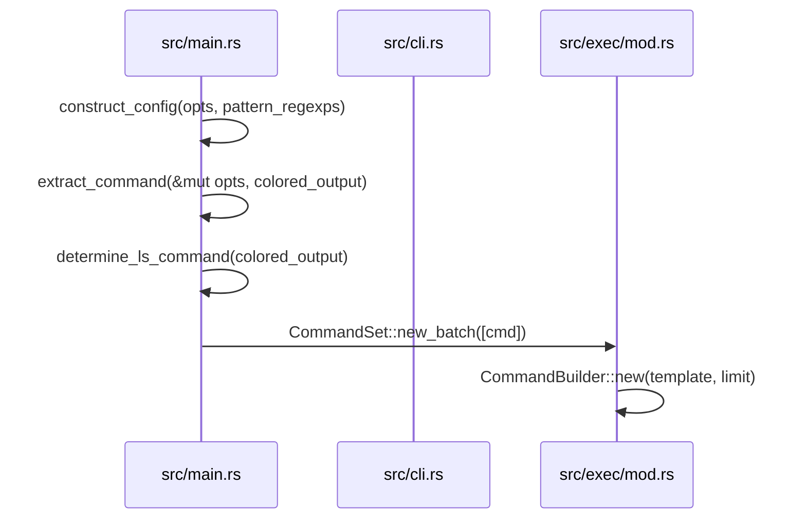
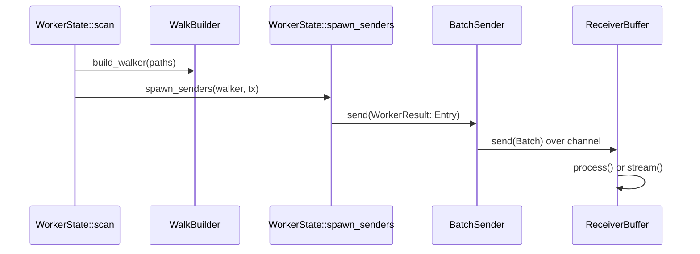
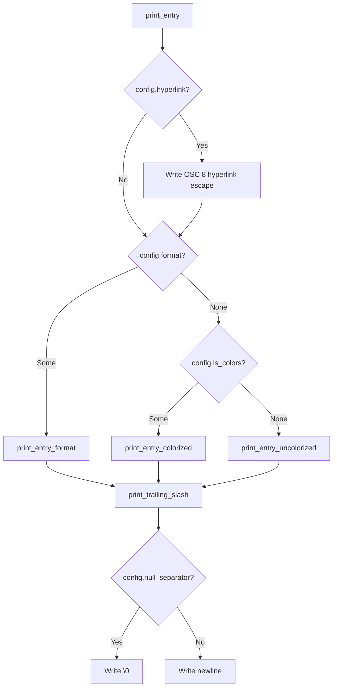

# Project Structure

<details>
<summary>Relevant source files</summary>

The following files were used as context for generating this wiki page:

- [src/main.rs](https://github.com/sharkdp/fd/blob/main/src/main.rs)
- [src/cli.rs](https://github.com/sharkdp/fd/blob/main/src/cli.rs)
- [README.md](https://github.com/sharkdp/fd/blob/main/README.md)
- [src/walk.rs](https://github.com/sharkdp/fd/blob/main/src/walk.rs)
- [src/exec/job.rs](https://github.com/sharkdp/fd/blob/main/src/exec/job.rs)
- [src/fmt/mod.rs](https://github.com/sharkdp/fd/blob/main/src/fmt/mod.rs)
- [src/exec/mod.rs](https://github.com/sharkdp/fd/blob/main/src/exec/mod.rs)
- [Cargo.toml](https://github.com/sharkdp/fd/blob/main/Cargo.toml)
- [src/output.rs](https://github.com/sharkdp/fd/blob/main/src/output.rs)
- [src/fmt/input.rs](https://github.com/sharkdp/fd/blob/main/src/fmt/input.rs)
- [src/config.rs](https://github.com/sharkdp/fd/blob/main/src/config.rs)
- [src/filter/mod.rs](https://github.com/sharkdp/fd/blob/main/src/filter/mod.rs)
- [doc/sponsors.md](https://github.com/sharkdp/fd/blob/main/doc/sponsors.md)
- [CONTRIBUTING.md](https://github.com/sharkdp/fd/blob/main/CONTRIBUTING.md)
- [doc/screencast.sh](https://github.com/sharkdp/fd/blob/main/doc/screencast.sh)
- [src/filetypes.rs](https://github.com/sharkdp/fd/blob/main/src/filetypes.rs)
</details>

## Overview

The *fd* codebase is organized into a modular crate architecture designed for high-performance, concurrent filesystem traversal and command execution. At its core, the project translates command-line flags into a structured runtime configuration, drives parallel directory walks using worker pools, evaluates multi-faceted search constraints, and serializes formatted output or invokes external processes. This design separates concerns between CLI parsing, directory traversal, filtering logic, and output serialization, enabling efficient parallelization while maintaining clean abstractions across platform-specific implementations.

Sources: [src/main.rs:1-15](https://github.com/sharkdp/fd/blob/main/src/main.rs#L1-L15), [src/cli.rs:1-693](https://github.com/sharkdp/fd/blob/main/src/cli.rs#L1-L693), [src/config.rs:1-136](https://github.com/sharkdp/fd/blob/main/src/config.rs#L1-L136), [src/walk.rs:1-654](https://github.com/sharkdp/fd/blob/main/src/walk.rs#L1-L654), [src/exec/mod.rs:1-121](https://github.com/sharkdp/fd/blob/main/src/exec/mod.rs#L1-L121), [src/fmt/mod.rs:1-197](https://github.com/sharkdp/fd/blob/main/src/fmt/mod.rs#L1-L197)

## Subsystem Architecture and Module Hierarchy

### Overview

The *fd* binary crate is structured around a central entry point in `src/main.rs` that governs execution flow, error interception, and global allocator configuration. Across the source tree, functionality is partitioned into specialized modules declared in `src/main.rs`—ranging from command-line interface definitions and configuration parsing to filesystem traversal, filtering, and external process execution. 

Sources: [src/main.rs:1-16](https://github.com/sharkdp/fd/blob/main/src/main.rs#L1-L16)

### Crate Organization and Entry Points

The execution pipeline starts at `main()`, which invokes `run()` and maps resulting `ExitCode` variants or traps unhandled errors via `crate::error::print_error`. 

```
main() → run() → Opts::parse()
             → set_working_dir()
             → opts.search_paths()
             → construct_config()
             → walk::scan()
```

Sources: [src/main.rs:62-112](https://github.com/sharkdp/fd/blob/main/src/main.rs#L62-L112)

The main initialization sequence proceeds through several discrete steps:
1. `Opts::parse()` parses command-line arguments via `clap`.
2. `set_working_dir()` alters the working directory if `--base-directory` is provided.
3. `opts.search_paths()` resolves root search directories.
4. `construct_config()` builds the core runtime configuration (`Config`).
5. `walk::scan()` initiates concurrent filesystem traversal with compiled regular expressions.

Sources: [src/main.rs:75-112](https://github.com/sharkdp/fd/blob/main/src/main.rs#L75-L112)

### Module Hierarchy

The crate modules divide responsibilities across distinct operational domains of filesystem searching:

| Module Name | Source File | Primary Responsibility |
| :--- | :--- | :--- |
| `cli` | `src/cli.rs` | Defines command-line arguments, options structures (`Opts`), custom `ArgMatches` parsing for exec commands, and value enums. |
| `config` | `src/config.rs` | Holds the runtime configuration struct (`Config`) consumed by traversal and filtering components. |
| `walk` | `src/walk.rs` | Manages multi-threaded directory traversal, thread pools, and worker communication channels. |
| `exec` | `src/exec/mod.rs` | Handles spawning external processes, managing command templates, and batch argument scheduling. |
| `fmt` | `src/fmt/mod.rs` | Implements template parsing and string substitution for custom output formatting. |
| `filesystem` | `src/filesystem.rs` | Provides path normalization, symlink resolution, and directory validation helpers. |

Sources: [src/main.rs:1-15](https://github.com/sharkdp/fd/blob/main/src/main.rs#L1-L15), [src/cli.rs:21-32](https://github.com/sharkdp/fd/blob/main/src/cli.rs#L21-L32)

## Command Parsing and Configuration Pipeline

### Overview

The command parsing and configuration pipeline translates raw command-line arguments into a strongly typed runtime `Config` struct that governs all traversal, filtering, and output behaviors. This subsystem relies on `clap` via the `Opts` struct to parse options, validates search paths and patterns, detects user input errors such as mismatched path separators, and compiles regular expressions or glob patterns.

Sources: [src/main.rs:75-112](https://github.com/sharkdp/fd/blob/main/src/main.rs#L75-L112), [src/cli.rs:21-32](https://github.com/sharkdp/fd/blob/main/src/cli.rs#L21-L32), [src/config.rs:13-136](https://github.com/sharkdp/fd/blob/main/src/config.rs#L13-L136)

### Command Parsing and Validation

Command-line arguments are defined in `src/cli.rs` using `clap`'s derive macro on the `Opts` struct. Custom argument groups, such as `execs`, prevent conflicting flags like `--exec`, `--exec-batch`, and `--list-details` from being specified alongside `--max-results` or `--quiet`.

```rust
#[derive(Parser)]
#[command(
    name = "fd",
    version,
    about = "A program to find entries in your filesystem...",
    args_override_self = true,
    group(ArgGroup::new("execs").args(&["exec", "exec_batch", "list_details"]).conflicts_with_all(&[
            "max_results", "quiet", "max_one_result"])),
)]
pub struct Opts { ... }
```

Sources: [src/cli.rs:21-31](https://github.com/sharkdp/fd/blob/main/src/cli.rs#L21-L31)

> [!NOTE]
> *fd* enforces smart-case matching by default: searches are case-insensitive unless the search pattern contains an uppercase character or `--case-sensitive` is explicitly requested.

Sources: [src/main.rs:249-255](https://github.com/sharkdp/fd/blob/main/src/main.rs#L249-L255), [src/cli.rs:130-151](https://github.com/sharkdp/fd/blob/main/src/cli.rs#L130-L151)

### Configuration Pipeline and Call-Chain Walkthrough

The configuration pipeline constructs the runtime options object and prepares execution templates. When executing `--list-details`, *fd* automatically constructs an underlying `ls` command set tailored to the operating system and color settings.

The execution call chain for building and setting up command templates proceeds through the following steps:
1. `construct_config` — Initialized in `src/main.rs`, processes `Opts` and extracts command requirements.
2. `extract_command` — Evaluates `opts.exec` and `--list-details` flags to yield an optional `CommandSet`.
3. `determine_ls_command` — Selects between GNU `ls`, `gls`, or BSD-specific list arguments depending on target platform capabilities and color support.
4. `new` — Constructs the `CommandSet` via `CommandSet::new_batch([cmd])`.
5. `CommandSet` / `generate` / `new_command` — Finalizes command templates and pre-allocates execution buffers.

Sources: [src/main.rs:298-299](https://github.com/sharkdp/fd/blob/main/src/main.rs#L298-L299), [src/main.rs:395-410](https://github.com/sharkdp/fd/blob/main/src/main.rs#L395-L410), [src/main.rs:412-494](https://github.com/sharkdp/fd/blob/main/src/main.rs#L412-L494), [src/exec/mod.rs:50-70](https://github.com/sharkdp/fd/blob/main/src/exec/mod.rs#L50-L70), [src/exec/mod.rs:136-162](https://github.com/sharkdp/fd/blob/main/src/exec/mod.rs#L136-L162)



Sources: [src/main.rs:248-299](https://github.com/sharkdp/fd/blob/main/src/main.rs#L248-L299), [src/main.rs:395-494](https://github.com/sharkdp/fd/blob/main/src/main.rs#L395-L494), [src/exec/mod.rs:50-70](https://github.com/sharkdp/fd/blob/main/src/exec/mod.rs#L50-L70), [src/exec/mod.rs:136-162](https://github.com/sharkdp/fd/blob/main/src/exec/mod.rs#L136-L162)

### Configuration Options Reference

The `Config` struct holds parsed settings used across the traversal and output pipeline:

| Configuration Field | Type | Purpose |
| :--- | :--- | :--- |
| `case_sensitive` | `bool` | Controls whether regex matching respects character casing. |
| `ignore_hidden` | `bool` | Determines whether hidden files and directories starting with `.` are skipped. |
| `read_vcsignore` | `bool` | Specifies whether VCS ignore files (`.gitignore`) are respected. |
| `follow_links` | `bool` | Dictates whether symbolic links are traversed during directory walking. |
| `max_depth` | `Option<usize>` | Limits maximum traversal depth from root search directories. |
| `threads` | `usize` | Sets the number of worker threads allocated for traversal. |
| `ls_colors` | `Option<LsColors>` | Holds colorization definitions for terminal output styling. |
| `command` | `Option<Arc<CommandSet>>` | Stores custom command templates configured via `--exec` or `--exec-batch`. |

Sources: [src/config.rs:14-136](https://github.com/sharkdp/fd/blob/main/src/config.rs#L14-L136)

## Parallel Traversal and Directory Walking

### Overview

Filesystem traversal in *fd* is built on top of the parallel walking infrastructure provided by the `ignore` crate, managed through a multi-threaded architecture orchestrated by `WorkerState` and `ReceiverBuffer`. The parallel walker partitions directory trees across multiple worker threads, which discover entries, evaluate search constraints, batch findings, and transmit them over bounded crossbeam channels to a single consumer receiver thread (or an execution pool).

Sources: [src/walk.rs:14-15](https://github.com/sharkdp/fd/blob/main/src/walk.rs#L14-L15), [src/walk.rs:151-171](https://github.com/sharkdp/fd/blob/main/src/walk.rs#L151-L171), [src/walk.rs:306-315](https://github.com/sharkdp/fd/blob/main/src/walk.rs#L306-L315), [src/walk.rs:617-653](https://github.com/sharkdp/fd/blob/main/src/walk.rs#L617-L653)

### Parallel Walking and Call-Chain Walkthrough

The traversal lifecycle coordinates configuration building, walker instantiation, thread scoping, and result consumption. 

The execution call chain for a parallel traversal proceeds through the following steps:
1. `scan` — Entry point invoked from `scan()` in `src/walk.rs`, which constructs a `WorkerState` and calls `WorkerState::scan(paths)`.
2. `build_walker` — Sets up ignore patterns, hidden file rules, custom ignore filenames (`.fdignore`), global ignore files, and thread counts via `WalkBuilder`.
3. `spawn_senders` — Executes `walker.run(...)` to spin up parallel worker threads that evaluate discovered file entries against patterns, size constraints, file types, modification times, and ownership filters.
4. `BatchSender::send` — Batches matching `WorkerResult` items (either `DirEntry` or `ignore::Error`) and sends them across a crossbeam channel when the batch limit is met.
5. `ReceiverBuffer::process` — Receives batches, buffers or streams results to standard output, tracks result counts, and enforces limits like `max_results` or `quiet` exits.

Sources: [src/walk.rs:81-122](https://github.com/sharkdp/fd/blob/main/src/walk.rs#L81-L122), [src/walk.rs:347-404](https://github.com/sharkdp/fd/blob/main/src/walk.rs#L347-L404), [src/walk.rs:443-614](https://github.com/sharkdp/fd/blob/main/src/walk.rs#L443-L614), [src/walk.rs:617-653](https://github.com/sharkdp/fd/blob/main/src/walk.rs#L617-L653), [src/walk.rs:685-687](https://github.com/sharkdp/fd/blob/main/src/walk.rs#L685-L687)



Sources: [src/walk.rs:347-404](https://github.com/sharkdp/fd/blob/main/src/walk.rs#L347-L404), [src/walk.rs:443-614](https://github.com/sharkdp/fd/blob/main/src/walk.rs#L443-L614), [src/walk.rs:617-653](https://github.com/sharkdp/fd/blob/main/src/walk.rs#L617-L653)

### Worker and Receiver Structures

The traversal subsystem relies on specialized enums and buffering structures to manage thread communication, batching limits, and sorting heuristics.

| Component Name | Kind | Purpose |
| :--- | :--- | :--- |
| `ReceiverMode` | `enum` | Tracks whether the receiver thread is `Buffering` (sorting/holding quick results) or `Streaming` directly to output. |
| `WorkerResult` | `enum` | Wraps either a valid discovered entry (`DirEntry`) or a filesystem traversal error (`ignore::Error`). |
| `Batch` | `struct` | Encapsulates an `Arc<Mutex<Option<Vec<WorkerResult>>>>` collection shared across channel boundaries. |
| `BatchSender` | `struct` | Controls batch allocation, size limits (`limit`), and automatic flushing over the crossbeam channel. |
| `ReceiverBuffer` | `struct` | Manages output buffering state, output streams, deadlines, and interruption flags during reception. |

Sources: [src/walk.rs:27-35](https://github.com/sharkdp/fd/blob/main/src/walk.rs#L27-L35), [src/walk.rs:40-45](https://github.com/sharkdp/fd/blob/main/src/walk.rs#L40-L45), [src/walk.rs:48-52](https://github.com/sharkdp/fd/blob/main/src/walk.rs#L48-L52), [src/walk.rs:75-80](https://github.com/sharkdp/fd/blob/main/src/walk.rs#L75-L80), [src/walk.rs:129-149](https://github.com/sharkdp/fd/blob/main/src/walk.rs#L129-L149)

> [!NOTE]
> If a search finishes within `DEFAULT_MAX_BUFFER_TIME` (100ms) or before `MAX_BUFFER_LENGTH` (1000 items) is reached, `ReceiverBuffer` sorts the buffered entries alphabetically before streaming them to standard output.

Sources: [src/walk.rs:125-127](https://github.com/sharkdp/fd/blob/main/src/walk.rs#L125-L127), [src/walk.rs:282-286](https://github.com/sharkdp/fd/blob/main/src/walk.rs#L282-L286)

### Design Trade-Offs in Traversal

| Design Choice | Benefit | Cost |
| :--- | :--- | :--- |
| **Bounded crossbeam channels** (`bounded(2 * config.threads)`) | Prevents unbounded memory growth when worker threads outpace the receiver. | Potential blocking on worker threads when output buffering is saturated. |
| **Batching worker results** (`BatchSender`) | Reduces channel lock contention and message overhead across threads. | Introduces minor latency before newly discovered entries enter the consumer queue. |
| **Initial buffering mode** (`ReceiverMode::Buffering`) | Enables sorted output for fast-running searches without sacrificing streaming for long jobs. | Holds matching `DirEntry` objects in memory up to `MAX_BUFFER_LENGTH`. |

Sources: [src/walk.rs:74-122](https://github.com/sharkdp/fd/blob/main/src/walk.rs#L74-L122), [src/walk.rs:151-195](https://github.com/sharkdp/fd/blob/main/src/walk.rs#L151-L195), [src/walk.rs:636](https://github.com/sharkdp/fd/blob/main/src/walk.rs#L636)

## Filtering Rules and Filetype Evaluation

### Overview

The filtering subsystem enforces user-defined constraints on discovered filesystem entries, verifying file types, sizes, modification times, and user ownership before a match is reported or processed further. Configuration parameters reside in `Config`, filetype evaluations are centralized in `FileTypes`, and specialized constraints are delegated to dedicated filter modules.

Sources: [src/config.rs:1-136](https://github.com/sharkdp/fd/blob/main/src/config.rs#L1-L136), [src/filter/mod.rs:1-12](https://github.com/sharkdp/fd/blob/main/src/filter/mod.rs#L1-L12), [src/filetypes.rs:1-43](https://github.com/sharkdp/fd/blob/main/src/filetypes.rs#L1-L43)

### Filetype Evaluation Mechanics

The `FileTypes` structure defines boolean flags governing which entry categories to include or exclude during a traversal. The `should_ignore` method inspects a `DirEntry` and evaluates its metadata against these constraints.

```rust
pub struct FileTypes {
    pub files: bool,
    pub directories: bool,
    pub symlinks: bool,
    pub block_devices: bool,
    pub char_devices: bool,
    pub sockets: bool,
    pub pipes: bool,
    pub executables_only: bool,
    pub empty_only: bool,
}
```

Sources: [src/filetypes.rs:6-18](https://github.com/sharkdp/fd/blob/main/src/filetypes.rs#L6-L18)

When an entry has a valid file type, `should_ignore` checks whether the type is explicitly disallowed by configuration flags, or if extra conditions like `executables_only` and `empty_only` fail. Entries lacking a resolvable file type are unconditionally ignored.

Sources: [src/filetypes.rs:20-42](https://github.com/sharkdp/fd/blob/main/src/filetypes.rs#L20-L42)

> [!WARNING]
> If an entry's file type cannot be determined (`entry.file_type()` returns `None`), `should_ignore` immediately returns `true`, causing the entry to be skipped entirely.

Sources: [src/filetypes.rs:21-22](https://github.com/sharkdp/fd/blob/main/src/filetypes.rs#L21-22), [src/filetypes.rs:39-41](https://github.com/sharkdp/fd/blob/main/src/filetypes.rs#L39-L41)

### Filter Modules and Configuration Constraints

Constraints beyond basic file types are managed via vectors and optional filters stored directly inside `Config`. These include size bounds, modification time thresholds, and Unix-specific owner permissions.

| Field Name | Type | Purpose |
| :--- | :--- | :--- |
| `file_types` | `Option<FileTypes>` | Restricts search results to specific file categories or types. |
| `extensions` | `Option<RegexSet>` | Restricts matched entries to specific lowercased file extensions. |
| `size_constraints` | `Vec<SizeFilter>` | Enforces minimum or maximum file size limitations. |
| `time_constraints` | `Vec<TimeFilter>` | Constrains entries by last modification or change timestamps. |
| `owner_constraint` | `Option<OwnerFilter>` | Restricts entries by user or group ownership (Unix only). |

Sources: [src/config.rs:82-88](https://github.com/sharkdp/fd/blob/main/src/config.rs#L82-L88), [src/config.rs:106-114](https://github.com/sharkdp/fd/blob/main/src/config.rs#L106-L114), [src/filter/mod.rs:1-12](https://github.com/sharkdp/fd/blob/main/src/filter/mod.rs#L1-L12)

## Formatting Engine and Output Serialization

### Overview

The formatting engine and output serialization subsystem transforms raw filesystem paths into formatted text, applies terminal colorization, manages hyperlinks, and serializes results to standard output. It resides primarily across `src/fmt/mod.rs`, `src/fmt/input.rs`, and `src/output.rs`.

Sources: [src/fmt/mod.rs:1-12](https://github.com/sharkdp/fd/blob/main/src/fmt/mod.rs#L1-L12), [src/output.rs:1-12](https://github.com/sharkdp/fd/blob/main/src/output.rs#L1-L12), [src/fmt/input.rs:1-4](https://github.com/sharkdp/fd/blob/main/src/fmt/input.rs#L1-L4)

### Template Parsing and Tokenization

Format strings are parsed into a `FormatTemplate` enum, which can either represent fixed text or a sequence of tokens containing placeholder variables. The parser uses `AhoCorasick` initialized via a static `OnceLock` to scan for placeholders and escaped braces.

```rust
pub enum Token {
    Placeholder,
    Basename,
    Parent,
    NoExt,
    BasenameNoExt,
    Text(String),
}

pub enum FormatTemplate {
    Tokens(Vec<Token>),
    Text(String),
}
```

Sources: [src/fmt/mod.rs:17-25](https://github.com/sharkdp/fd/blob/main/src/fmt/mod.rs#L17-25), [src/fmt/mod.rs:45-50](https://github.com/sharkdp/fd/blob/main/src/fmt/mod.rs#L45-50), [src/fmt/mod.rs:51-66](https://github.com/sharkdp/fd/blob/main/src/fmt/mod.rs#L51-66)

The `AhoCorasick` automaton matches against seven fixed patterns. The recognized placeholder patterns, their numeric IDs, and their corresponding AST tokens are detailed below.

| Pattern | Match ID | Token Variant | Description |
| :--- | :--- | :--- | :--- |
| `{{` | 0 | N/A (Escaped) | Escaped open brace literal |
| `}}` | 1 | N/A (Escaped) | Escaped close brace literal |
| `{}` | 2 | `Token::Placeholder` | Full path placeholder |
| `{/}` | 3 | `Token::Basename` | Basename component only |
| `{//}` | 4 | `Token::Parent` | Parent directory only |
| `{.}` | 5 | `Token::NoExt` | Full path without extension |
| `{/.}` | 6 | `Token::BasenameNoExt` | Basename without extension |

Sources: [src/fmt/mod.rs:64-66](https://github.com/sharkdp/fd/blob/main/src/fmt/mod.rs#L64-66), [src/fmt/mod.rs:201-211](https://github.com/sharkdp/fd/blob/main/src/fmt/mod.rs#L201-211)

> [!NOTE]
> If a format string contains no unescaped placeholder tokens during parsing, `FormatTemplate::parse` bypasses vector allocation and returns `FormatTemplate::Text` directly.

Sources: [src/fmt/mod.rs:97-100](https://github.com/sharkdp/fd/blob/main/src/fmt/mod.rs#L97-100)

### Path Transformation and Custom Separators

Path manipulation helpers in `src/fmt/input.rs` operate on `Path` references to extract specific segments during template generation.

| Function Signature | Purpose |
| :--- | :--- |
| `basename(path: &Path) -> &OsStr` | Extracts the filename component, falling back to the full path. |
| `remove_extension(path: &Path) -> OsString` | Removes the file extension while preserving directory components. |
| `dirname(path: &Path) -> OsString` | Extracts the parent directory component, defaulting to `.` if empty. |

Sources: [src/fmt/input.rs:6-32](https://github.com/sharkdp/fd/blob/main/src/fmt/input.rs#L6-32)

When a custom path separator is configured, `FormatTemplate::replace_separator` parses path components iteratively via `Path::components` and re-joins them using the custom string.

```rust
pub fn generate(&self, path: impl AsRef<Path>, path_separator: Option<&str>) -> OsString
```

Sources: [src/fmt/mod.rs:112-141](https://github.com/sharkdp/fd/blob/main/src/fmt/mod.rs#L112-141), [src/fmt/mod.rs:147-196](https://github.com/sharkdp/fd/blob/main/src/fmt/mod.rs#L147-196)

### Output Serialization Pipeline

The core execution path for writing entries to standard output follows a deterministic order inside `src/output.rs`: `print_entry()` checks hyperlink settings, delegates formatting, applies terminal colorization or sanitization, handles trailing slashes, and appends the line separator.



Sources: [src/output.rs:17-43](https://github.com/sharkdp/fd/blob/main/src/output.rs#L17-43)

| Design Choice | Benefit | Cost |
| :--- | :--- | :--- |
| **Aho-Corasick automaton for template parsing** | Single-pass scanning of complex format templates with multiple placeholder variants. | Requires static initialization overhead via `OnceLock`. |
| **Unix raw byte fallback (`OsStrExt`)** | Allows invalid UTF-8 filenames to pass through intact to downstream pipe consumers. | Bypasses standard Unicode string lossy conversions on Unix non-interactive paths. |
| **Iterative component path separator replacement** | Correctly handles complex Windows UNC prefixes and root directories without brittle string replacement. | Higher CPU overhead during path formatting compared to simple string substitution. |

Sources: [src/fmt/mod.rs:51-66](https://github.com/sharkdp/fd/blob/main/src/fmt/mod.rs#L51-66), [src/output.rs:168-182](https://github.com/sharkdp/fd/blob/main/src/output.rs#L168-182), [src/fmt/mod.rs:147-196](https://github.com/sharkdp/fd/blob/main/src/fmt/mod.rs#L147-196)

## External Command Spawning and Scheduling

### Overview

The execution subsystem handles spawning external commands for matching search results, supporting both one-by-one execution (`--exec`) and batched execution (`--exec-batch`). It manages command templates, argument substitution, process lifetimes, and exit status merging through the modules in `src/exec/`.

Sources: [src/exec/mod.rs:20-27](https://github.com/sharkdp/fd/blob/main/src/exec/mod.rs#L20-27), [src/exec/job.rs:11-64](https://github.com/sharkdp/fd/blob/main/src/exec/job.rs#L11-64)

### Execution Modes and Command Templates

`CommandSet` manages execution settings and a collection of `CommandTemplate` instances. The execution mode determines whether processes are spawned per result or batched using `argmax` bounds checking.

| Execution Mode | Enum Variant | Description |
| :--- | :--- | :--- |
| One-by-One | `ExecutionMode::OneByOne` | Command is executed for each individual search result. |
| Batch | `ExecutionMode::Batch` | Command is run for a batch of results at once, subject to argument limits. |

Sources: [src/exec/mod.rs:21-33](https://github.com/sharkdp/fd/blob/main/src/exec/mod.rs#L21-33)

> [!WARNING]
> For batch mode (`--exec-batch`), the first argument of the command template must be a fixed executable name rather than a placeholder token. `CommandSet::new_batch` explicitly rejects placeholder tokens in the executable position.

Sources: [src/exec/mod.rs:51-70](https://github.com/sharkdp/fd/blob/main/src/exec/mod.rs#L51-70), [src/exec/mod.rs:245-248](https://github.com/sharkdp/fd/blob/main/src/exec/mod.rs#L245-248)

### Call-Chain Execution Walkthrough

The batch execution pipeline processes paths iteratively through `CommandBuilder` to pack arguments up to OS command-length limits:

`CommandSet::execute_batch()` → `CommandBuilder::new()` → `CommandBuilder::push()` → `CommandBuilder::finish()` → `handle_cmd_error()`

1. **`CommandSet::execute_batch`**: Iterates over matching paths and instantiates `CommandBuilder` instances for each command template.
2. **`CommandBuilder::new`**: Splits template arguments into pre-arguments, the path placeholder argument, and post-arguments, initializing a base `Command` with inherited standard input, output, and error streams.
3. **`CommandBuilder::push`**: Checks whether adding the next path would violate the configured `limit` count or exceed system argument length thresholds using `Command::args_would_fit`. If limits are exceeded, it invokes `finish()` first.
4. **`CommandBuilder::finish`**: Appends post-arguments, executes the subprocess via `Command::status()`, checks success, and re-initializes the command builder state for subsequent batches.
5. **`handle_cmd_error`**: Intercepts standard I/O errors or non-zero exit codes during execution.

Sources: [src/exec/mod.rs:90-120](https://github.com/sharkdp/fd/blob/main/src/exec/mod.rs#L90-120), [src/exec/mod.rs:135-208](https://github.com/sharkdp/fd/blob/main/src/exec/mod.rs#L135-208)

### Subprocess Lifecycle and Design Trade-offs

| Design Choice | Benefit | Cost |
| :--- | :--- | :--- |
| **Inherited standard streams (`Stdio::inherit`)** | Subprocesses interact natively with the user's terminal and pipes. | Bypasses internal buffering for subprocess output in single-threaded mode. |
| **Argument length check via `argmax` (`args_would_fit`)** | Prevents `E2BIG` operating system errors when batching large numbers of paths. | Requires tracking pre- and post-argument boundaries during command building. |
| **Exit code merging (`merge_exitcodes`)** | Aggregates status codes across multiple worker jobs and batches into a unified return value. | Obscures individual failing subprocess exit codes in favor of generic error states. |

Sources: [src/exec/mod.rs:164-168](https://github.com/sharkdp/fd/blob/main/src/exec/mod.rs#L164-168), [src/exec/mod.rs:179-182](https://github.com/sharkdp/fd/blob/main/src/exec/mod.rs#L179-182), [src/exec/job.rs:3-40](https://github.com/sharkdp/fd/blob/main/src/exec/job.rs#L3-40)

## Related

- [[Overview]]
- [[Command Line Interface]]
- [[Parallel Directory Traversal]]

