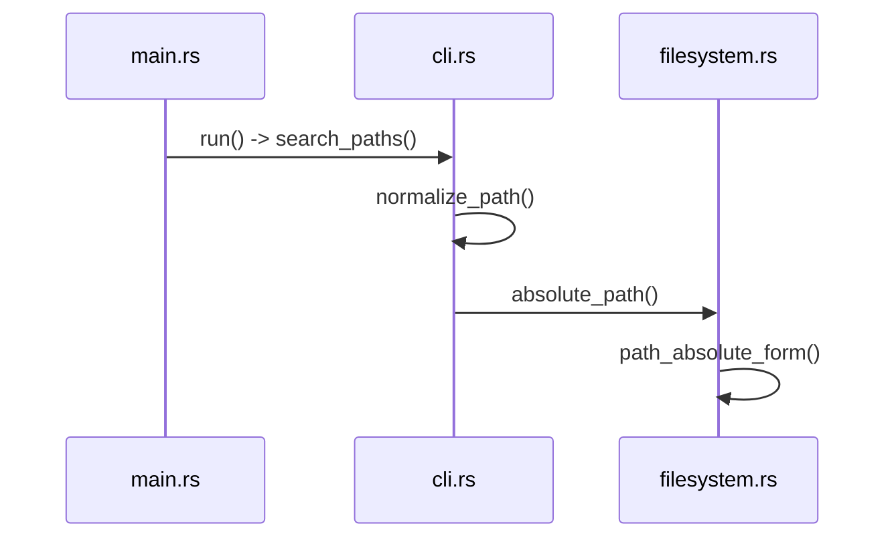
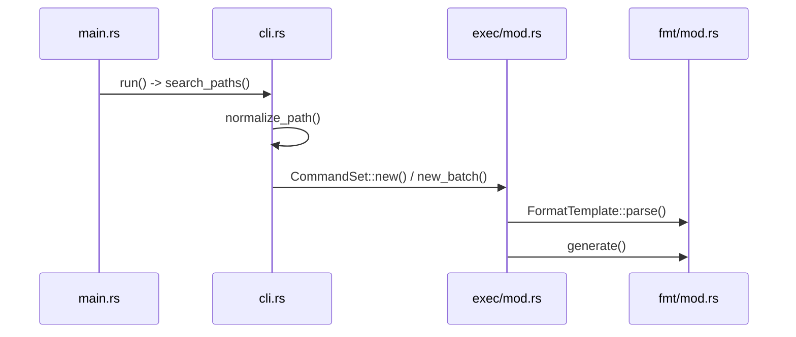

# Regex & Pattern Matching

Relevant source files

The following files were used as context for generating this wiki page:

- [src/main.rs](https://github.com/sharkdp/fd/blob/main/src/main.rs)
- [src/walk.rs](https://github.com/sharkdp/fd/blob/main/src/walk.rs)
- [src/cli.rs](https://github.com/sharkdp/fd/blob/main/src/cli.rs)
- [README.md](https://github.com/sharkdp/fd/blob/main/README.md)
- [src/fmt/mod.rs](https://github.com/sharkdp/fd/blob/main/src/fmt/mod.rs)
- [src/exec/mod.rs](https://github.com/sharkdp/fd/blob/main/src/exec/mod.rs)
- [src/exec/job.rs](https://github.com/sharkdp/fd/blob/main/src/exec/job.rs)
- [src/regex_helper.rs](https://github.com/sharkdp/fd/blob/main/src/regex_helper.rs)
- [src/filter/size.rs](https://github.com/sharkdp/fd/blob/main/src/filter/size.rs)
- [Cargo.toml](https://github.com/sharkdp/fd/blob/main/Cargo.toml)
- [src/fmt/input.rs](https://github.com/sharkdp/fd/blob/main/src/fmt/input.rs)
- [src/filter/owner.rs](https://github.com/sharkdp/fd/blob/main/src/filter/owner.rs)
- [src/sanitize.rs](https://github.com/sharkdp/fd/blob/main/src/sanitize.rs)
- [src/filetypes.rs](https://github.com/sharkdp/fd/blob/main/src/filetypes.rs)
- [src/filter/mod.rs](https://github.com/sharkdp/fd/blob/main/src/filter/mod.rs)
- [src/config.rs](https://github.com/sharkdp/fd/blob/main/src/config.rs)
- [src/filesystem.rs](https://github.com/sharkdp/fd/blob/main/src/filesystem.rs)

## Overview

The pattern matching and evaluation engine in *fd* translates user-specified search expressions into compiled regular expressions and path constraints, driving efficient parallel filesystem traversal. By transforming raw command-line inputs through glob builders, exact-match anchors, and case sensitivity heuristics, the system constructs robust search patterns that evaluate directory entries concurrently against file types, modification times, sizes, and ownership rules. Sources: [src/main.rs:94-112](https://github.com/sharkdp/fd/blob/main/src/main.rs#L94-L112), [src/walk.rs:444-592](https://github.com/sharkdp/fd/blob/main/src/walk.rs#L444-L592)

This subsystem bridges CLI argument configuration with low-level directory walking and command template expansion. It ensures safe path handling, analyzes intermediate representations to optimize smart-case and hidden-file detection, and formats matching results for console output or external process execution. Sources: [src/main.rs:218-232](https://github.com/sharkdp/fd/blob/main/src/main.rs#L218-L232), [src/regex_helper.rs:1-79](https://github.com/sharkdp/fd/blob/main/src/regex_helper.rs#L1-L79), [src/exec/mod.rs:220-256](https://github.com/sharkdp/fd/blob/main/src/exec/mod.rs#L220-L256)

## Regex Compilation and Pattern Building

### Overview

The pattern compilation pipeline transforms raw user inputs from command-line arguments into fully prepared regular expressions that drive file matching during filesystem walking. This construction flow handles standard regular expressions, glob expressions, fixed-string literal searches, and exact matches, while also validating patterns against accidental path-separator usage. Sources: [src/main.rs:89-112](https://github.com/sharkdp/fd/blob/main/src/main.rs#L89-L112), [src/main.rs:218-232](https://github.com/sharkdp/fd/blob/main/src/main.rs#L218-L232)

### Compilation Pipeline Execution Flow

The core pattern preparation sequence operates within the main execution loop before directory traversal begins:

`Opts::parse()` → `ensure_search_pattern_is_not_a_path()` → `build_pattern_regex()` → `construct_config()` → `build_regex()` → `walk::scan()`

1. **`Opts::parse()`**: Extracts command-line options and expressions from the environment. Sources: [src/main.rs:76](https://github.com/sharkdp/fd/blob/main/src/main.rs#L76)
2. **`ensure_search_pattern_is_not_a_path()`**: Inspects the primary search pattern and any `--and` expressions (`exprs`) to detect whether the user accidentally passed a filesystem path instead of a pattern. Sources: [src/main.rs:89](https://github.com/sharkdp/fd/blob/main/src/main.rs#L89), [src/main.rs:169-181](https://github.com/sharkdp/fd/blob/main/src/main.rs#L169-L181)
3. **`build_pattern_regex()`**: Processes each search string depending on whether `--glob`, `--exact`, or `--fixed-strings` flags are active, returning an intermediate regex string. Sources: [src/main.rs:94-100](https://github.com/sharkdp/fd/blob/main/src/main.rs#L94-L100), [src/main.rs:218-232](https://github.com/sharkdp/fd/blob/main/src/main.rs#L218-L232)
4. **`construct_config()`**: Builds the global `Config` structure, resolving smart-case sensitivity, path separators, file type filters, and color options. Sources: [src/main.rs:102](https://github.com/sharkdp/fd/blob/main/src/main.rs#L102), [src/main.rs:248-393](https://github.com/sharkdp/fd/blob/main/src/main.rs#L248-L393)
5. **`build_regex()`**: Compiles the intermediate pattern strings into concrete `regex::bytes::Regex` instances using case-sensitivity rules and newline settings. Sources: [src/main.rs:106-110](https://github.com/sharkdp/fd/blob/main/src/main.rs#L106-L110), [src/main.rs:541-555](https://github.com/sharkdp/fd/blob/main/src/main.rs#L541-L555)
6. **`walk::scan()`**: Initiates parallel directory traversal using the compiled regexes and configuration settings. Sources: [src/main.rs:111](https://github.com/sharkdp/fd/blob/main/src/main.rs#L111)

Sources: [src/main.rs:76-112](https://github.com/sharkdp/fd/blob/main/src/main.rs#L76-L112)

### Pattern Building Modes

The `build_pattern_regex` function branches on configuration flags to generate the appropriate regular expression syntax for user queries.

| Mode Flag | Transformation Logic | Resulting Regex Pattern Format | Sources |
| :--- | :--- | :--- | :--- |
| `--glob` (`opts.glob`) | Parses pattern via `GlobBuilder` with literal separators enabled (`literal_separator(true)`). | Compiled glob-to-regex string via `glob.regex()` | [src/main.rs:219-221](https://github.com/sharkdp/fd/blob/main/src/main.rs#L219-L221) |
| `--exact` (`opts.exact`) | Escapes the pattern text and anchors it at both ends for full match conformance. | `^{escaped_pattern}$` | [src/main.rs:222-225](https://github.com/sharkdp/fd/blob/main/src/main.rs#L222-L225) |
| `--fixed-strings` (`opts.fixed_strings`) | Escapes special regex characters to enforce literal substring matching. | `{escaped_pattern}` | [src/main.rs:226-228](https://github.com/sharkdp/fd/blob/main/src/main.rs#L226-L228) |
| Default (Regex) | Uses the raw user-supplied string directly without modification. | `{pattern}` | [src/main.rs:229-231](https://github.com/sharkdp/fd/blob/main/src/main.rs#L229-L231) |

Sources: [src/main.rs:218-232](https://github.com/sharkdp/fd/blob/main/src/main.rs#L218-L232)

> [!NOTE]
> When `--full-path` is disabled, `ensure_search_pattern_is_not_a_path` verifies that patterns do not contain path separators (`/` or platform-native `\`). On Windows, `\` checks require the target string to resolve to an existing directory via `Path::new(pattern).is_dir()`, allowing valid escape sequences like `\d+` to pass unhindered. Sources: [src/main.rs:149-216](https://github.com/sharkdp/fd/blob/main/src/main.rs#L149-L216)

## HIR Analysis and Pattern Heuristics

### Overview

The `regex_helper` module parses regular expression patterns into High-Level Intermediate Representation (HIR) Abstract Syntax Trees using the `regex_syntax` crate. This structural analysis powers smart-case detection and leading-dot inspection before executing directory traversal.

Sources: [src/regex_helper.rs:1-40](https://github.com/sharkdp/fd/blob/main/src/regex_helper.rs#L1-L40), [src/main.rs:248-255](https://github.com/sharkdp/fd/blob/main/src/main.rs#L248-L255)

### HIR Inspection and Smart-Case Detection

Smart-case sensitivity is determined by `pattern_has_uppercase_char()`, which builds a non-UTF8 parser via `ParserBuilder::new().utf8(false).build()` and evaluates the resulting `Hir` tree recursively via `hir_has_uppercase_char()`.

`pattern_has_uppercase_char()` → `ParserBuilder::parse()` → `hir_has_uppercase_char()`

1. **`pattern_has_uppercase_char()`**: Initializes a byte-oriented syntax parser and invokes it on the pattern string. Sources: [src/regex_helper.rs:5-12](https://github.com/sharkdp/fd/blob/main/src/regex_helper.rs#L5-L12)
2. **`hir_has_uppercase_char()`**: Matches on the node variant of `HirKind`:
   - `HirKind::Literal`: Validates UTF-8 strings or raw byte slices for uppercase characters. Sources: [src/regex_helper.rs:18-22](https://github.com/sharkdp/fd/blob/main/src/regex_helper.rs#L18-L22)
   - `HirKind::Class`: Inspects Unicode or byte character ranges for uppercase boundaries. Sources: [src/regex_helper.rs:23-28](https://github.com/sharkdp/fd/blob/main/src/regex_helper.rs#L23-L28)
   - `HirKind::Capture` / `HirKind::Repetition`: Recursively inspects nested sub-expressions. Sources: [src/regex_helper.rs:29-31](https://github.com/sharkdp/fd/blob/main/src/regex_helper.rs#L29-L31)
   - `HirKind::Concat` / `HirKind::Alternation`: Iterates across multiple sub-expressions. Sources: [src/regex_helper.rs:32-34](https://github.com/sharkdp/fd/blob/main/src/regex_helper.rs#L32-L34)

Sources: [src/regex_helper.rs:14-37](https://github.com/sharkdp/fd/blob/main/src/regex_helper.rs#L14-L37)

### Leading-Dot Inspection and Hidden File Validation

`pattern_matches_strings_with_leading_dot()` checks whether a pattern exclusively matches filenames starting with a dot, allowing `fd` to warn users when hidden files are ignored by default.

`pattern_matches_strings_with_leading_dot()` → `ParserBuilder::parse()` → `hir_matches_strings_with_leading_dot()`

1. **`pattern_matches_strings_with_leading_dot()`**: Parses the expression string into an HIR tree using a byte parser. Sources: [src/regex_helper.rs:40-47](https://github.com/sharkdp/fd/blob/main/src/regex_helper.rs#L40-L47)
2. **`hir_matches_strings_with_leading_dot()`**: Enforces that the HIR structure represents a concatenation where the first element is a start text anchor (`Look::Start`) and the second element is a literal byte sequence starting with `b"."`. Sources: [src/regex_helper.rs:50-79](https://github.com/sharkdp/fd/blob/main/src/regex_helper.rs#L50-L79)

> [!NOTE]
> The leading-dot check strictly detects simple patterns starting with `^\.`, such as `^\.gitignore`. Complex expressions like `^(\.foo|\.bar)` that also target hidden files are not matched by this heuristic. Sources: [src/regex_helper.rs:53-56](https://github.com/sharkdp/fd/blob/main/src/regex_helper.rs#L53-L56)

> [!WARNING]
> On Unix systems, if a search pattern matches strings with a leading dot while hidden files are ignored (`ignore_hidden`), `ensure_use_hidden_option_for_leading_dot_pattern` immediately aborts execution with an error recommending `-H/--hidden`. Sources: [src/main.rs:521-539](https://github.com/sharkdp/fd/blob/main/src/main.rs#L521-L539)

## Path Normalization and Absolute Resolution

### Overview

The initialization phase of `fd` processes user-supplied path arguments, validates their existence on disk, and normalizes them into absolute or canonical forms suitable for directory walkers. This subsystem bridges raw command-line arguments and low-level filesystem traversal primitives by vetting directory inputs and resolving current working directory contexts.

Sources: [src/cli.rs:695-736](https://github.com/sharkdp/fd/blob/main/src/cli.rs#L695-L736), [src/filesystem.rs:14-36](https://github.com/sharkdp/fd/blob/main/src/filesystem.rs#L14-L36)

### Call-Chain Execution Walkthrough

The resolution of search paths follows a strict sequence starting from main execution and descending into absolute path calculation.

1. `run` invokes `Opts::search_paths()` to gather and validate candidate directories from CLI inputs. Sources: [src/main.rs:84](https://github.com/sharkdp/fd/blob/main/src/main.rs#L84)
2. `search_paths` iterates over positional or `--search-path` arguments, verifying each via `filesystem::is_existing_directory` before normalizing. Sources: [src/cli.rs:698-720](https://github.com/sharkdp/fd/blob/main/src/cli.rs#L698-L720)
3. `normalize_path` processes individual paths based on CLI flags, adjusting special inputs like `.` or `-` or triggering absolute resolution. Sources: [src/cli.rs:723-736](https://github.com/sharkdp/fd/blob/main/src/cli.rs#L723-L736)
4. `absolute_path` receives normalized outputs when absolute paths are requested, stripping internal prefix syntax on Windows environments. Sources: [src/filesystem.rs:23-36](https://github.com/sharkdp/fd/blob/main/src/filesystem.rs#L23-L36)
5. `path_absolute_form` converts relative paths into absolute paths by joining them with the current working directory from `env::current_dir()`. Sources: [src/filesystem.rs:14-21](https://github.com/sharkdp/fd/blob/main/src/filesystem.rs#L14-L21)

Sources: [src/main.rs:84](https://github.com/sharkdp/fd/blob/main/src/main.rs#L84), [src/cli.rs:698-736](https://github.com/sharkdp/fd/blob/main/src/cli.rs#L698-L736), [src/filesystem.rs:14-36](https://github.com/sharkdp/fd/blob/main/src/filesystem.rs#L14-L36)

> [!NOTE]
> `is_existing_directory` avoids using standard `.exists()` calls on paths because `.` must always evaluate as existing even if the actual current working directory has been deleted underneath the process. Sources: [src/filesystem.rs:38-42](https://github.com/sharkdp/fd/blob/main/src/filesystem.rs#L38-L42)

### Path Transformation Rules

| Input Condition | Transformation Applied | Purpose |
| :--- | :--- | :--- |
| `path.is_absolute()` | Returns path unmodified | Preserves already-absolute user inputs |
| `absolute_path` flag set | `filesystem::absolute_path(path.normalize().unwrap())` | Calculates fully expanded absolute path form |
| Path equals `.` | Returns `./` | Workaround for ripgrep path handling compatibility |
| Path equals `-` | Prepends `.` resulting in `./-` | Forces underlying walker to treat hyphen as a path instead of an option |
| Default relative path | Returns path unmodified as `PathBuf` | Retains relative path representation for standard traversals |

Sources: [src/cli.rs:723-736](https://github.com/sharkdp/fd/blob/main/src/cli.rs#L723-L736), [src/filesystem.rs:14-21](https://github.com/sharkdp/fd/blob/main/src/filesystem.rs#L14-L21)

> [!WARNING]
> On Windows platforms, `absolute_path` strips any leading `\\?\` extended-length path prefix from the resulting string representation to maintain compatibility with standard filesystem operations. Sources: [src/filesystem.rs:26-34](https://github.com/sharkdp/fd/blob/main/src/filesystem.rs#L26-L34)

### Design Trade-Offs in Path Handling

| Design choice | Benefit | Cost |
| :--- | :--- | :--- |
| Custom `is_existing_directory` check using `is_dir()` and normalization rather than `.exists()` | Correctly handles deleted working directories where `.` is referenced | Slightly heavier syscall validation overhead |
| Windows `\\?\` prefix stripping | Prevents exotic extended path syntax from breaking standard string formatting | Minor string manipulation overhead during absolute resolution |
| Explicit `.` to `./` normalization | Avoids edge cases in external walker path concatenation | Diverges from raw standard library path formatting |

Sources: [src/cli.rs:726-728](https://github.com/sharkdp/fd/blob/main/src/cli.rs#L726-L728), [src/filesystem.rs:26-34](https://github.com/sharkdp/fd/blob/main/src/filesystem.rs#L26-L34), [src/filesystem.rs:38-42](https://github.com/sharkdp/fd/blob/main/src/filesystem.rs#L38-L42)

## Command Template Construction and Generation

### Overview

Command execution templates bridge search results with external processes through `-x`/`--exec` and `-X`/`--exec-batch` flags. Parsing these options initializes a `CommandSet`, which processes argument vectors containing placeholders like `{}`, `{/}`, `{//}`, `{.}` and `{/.}`. Using `aho_corasick`, templates identify substitution targets and escaped braces (`{{` and `}}`), transforming user-supplied syntax into executable commands. Sources: [src/cli.rs:855-880](https://github.com/sharkdp/fd/blob/main/src/cli.rs#L855-L880), [src/exec/mod.rs:30-74](https://github.com/sharkdp/fd/blob/main/src/exec/mod.rs#L30-L74), [src/fmt/mod.rs:51-66](https://github.com/sharkdp/fd/blob/main/src/fmt/mod.rs#L51-L66)

### Call-Chain Execution Walkthrough

The command construction and generation flow operates through structured invocation paths:

1. `run` parses CLI options and initializes configuration state. Sources: [src/main.rs:76-102](https://github.com/sharkdp/fd/blob/main/src/main.rs#L76-L102)
2. `search_paths` resolves search targets from positional inputs or `--search-path`. Sources: [src/cli.rs:696-721](https://github.com/sharkdp/fd/blob/main/src/cli.rs#L696-L721)
3. `normalize_path` adjusts path representations for absolute forms or special characters. Sources: [src/cli.rs:723-736](https://github.com/sharkdp/fd/blob/main/src/cli.rs#L723-L736)
4. `new` (in `CommandSet`) parses argument lists into `CommandTemplate` collections with one-by-one or batch execution modes. Sources: [src/exec/mod.rs:36-70](https://github.com/sharkdp/fd/blob/main/src/exec/mod.rs#L36-L70)
5. `generate` constructs final command strings or `Command` builders by substituting placeholders with target paths. Sources: [src/exec/mod.rs:266-272](https://github.com/sharkdp/fd/blob/main/src/exec/mod.rs#L266-L272), [src/fmt/mod.rs:112-141](https://github.com/sharkdp/fd/blob/main/src/fmt/mod.rs#L112-L141)

Sources: [src/main.rs:76-112](https://github.com/sharkdp/fd/blob/main/src/main.rs#L76-L112), [src/cli.rs:696-736](https://github.com/sharkdp/fd/blob/main/src/cli.rs#L696-L736), [src/exec/mod.rs:36-70](https://github.com/sharkdp/fd/blob/main/src/exec/mod.rs#L36-L70), [src/fmt/mod.rs:58-141](https://github.com/sharkdp/fd/blob/main/src/fmt/mod.rs#L58-L141)

> [!WARNING]
> For batch commands (`--exec-batch`), the first argument must be a fixed executable rather than a placeholder, enforced during `CommandSet::new_batch` construction. Sources: [src/exec/mod.rs:51-70](https://github.com/sharkdp/fd/blob/main/src/exec/mod.rs#L51-L70), [src/exec/mod.rs:245-248](https://github.com/sharkdp/fd/blob/main/src/exec/mod.rs#L245-L248)

### Placeholder Tokens and Format Mapping

| Token Variant | Syntax Pattern | Description |
| :--- | :--- | :--- |
| `Placeholder` | `{}` | Full path of the current search result |
| `Basename` | `{/}` | File or directory name without parent directories |
| `Parent` | `{//}` | Parent directory path containing the file |
| `NoExt` | `{.}` | Path with its file extension removed |
| `BasenameNoExt` | `{/.}` | Basename with its file extension removed |
| `Text` | Literal string | Unmodified text segment within command arguments |

Sources: [src/fmt/mod.rs:18-25](https://github.com/sharkdp/fd/blob/main/src/fmt/mod.rs#L18-L25), [src/cli.rs:900-907](https://github.com/sharkdp/fd/blob/main/src/cli.rs#L900-L907)

> [!TIP]
> If a command template contains no explicit placeholder token, an implicit `{}` is automatically appended to the end of the argument list. Sources: [src/exec/mod.rs:250-254](https://github.com/sharkdp/fd/blob/main/src/exec/mod.rs#L250-L254)

### Design Trade-Offs in Template Parsing

| Design choice | Benefit | Cost |
| :--- | :--- | :--- |
| `AhoCorasick` multi-pattern matcher for template parsing | Fast O(n) scanning for multiple placeholder variants and escaped braces simultaneously | Additional dependency footprint for pattern matching routines |
| Automatic implicit `{}` appending | Simplifies common user invocations like `fd -e rs -x wc -l` | Ambiguous argument placement if users expect custom positioning without flags |
| Strict single-placeholder restriction in batch mode | Prevents malformed argument lists when executing bulk system commands via `-X` | Limits batch flexibility for commands requiring multiple path projections per invocation |

Sources: [src/fmt/mod.rs:51-66](https://github.com/sharkdp/fd/blob/main/src/fmt/mod.rs#L51-L66), [src/exec/mod.rs:63-66](https://github.com/sharkdp/fd/blob/main/src/exec/mod.rs#L63-L66), [src/exec/mod.rs:250-254](https://github.com/sharkdp/fd/blob/main/src/exec/mod.rs#L250-L254)

## Filesystem Traversal and Pattern Evaluation

### Overview

During directory traversal, `fd` executes parallel walking using the `ignore` crate wrapped inside `WorkerState::spawn_senders`. Each directory entry encountered by background threads undergoes a strict evaluation pipeline consisting of depth boundaries, exclusion criteria, path regex matching, file extension filters, file type validation, ownership rules, size constraints, and modification time checks.

Sources: [src/walk.rs:443-592](https://github.com/sharkdp/fd/blob/main/src/walk.rs#L443-L592)

### Call-Chain Execution Walkthrough

The parallel directory traversal and entry evaluation flow executes through the following sequence of calls:

1. `scan()` initializes `WorkerState`, configures Ctrl-C handlers if color output is enabled, and launches `thread::scope` to coordinate parallel sender threads and receiver routing. Sources: [src/walk.rs:617-646](https://github.com/sharkdp/fd/blob/main/src/walk.rs#L617-L646)
2. `spawn_senders()` invokes `walker.run()` to traverse the filesystem paths in parallel across thread pool workers. Sources: [src/walk.rs:443-444](https://github.com/sharkdp/fd/blob/main/src/walk.rs#L443-L444)
3. For each visited path entry, closure logic checks `quit_flag`, validates ignore containment files via `e.file_type().is_some_and(|t| t.is_dir())`, skips depth 0 roots, and converts errors or successful paths into `DirEntry` wrappers. Sources: [src/walk.rs:460-506](https://github.com/sharkdp/fd/blob/main/src/walk.rs#L460-L506)
4. `search_str_for_entry()` determines whether to match against the full path or filename alone. Sources: [src/walk.rs:517-518](https://github.com/sharkdp/fd/blob/main/src/walk.rs#L517-L518), [src/walk.rs:656-678](https://github.com/sharkdp/fd/blob/main/src/walk.rs#L656-L678)
5. Pattern regexes (`pat.is_match()`), file extensions, file types (`file_types.should_ignore()`), ownership constraints (`owner_constraint.matches()`), size constraints (`size_constraints`), and modification time filters (`time_constraints`) are evaluated sequentially, returning `WalkState::Continue` on mismatch or queueing the valid entry via `tx.send()`. Sources: [src/walk.rs:519-612](https://github.com/sharkdp/fd/blob/main/src/walk.rs#L519-L612)

> [!WARNING]
> If an entry matches size or metadata constraints, `entry.metadata()` forces a synchronous stat syscall. Skipping filters that require metadata when possible avoids expensive kernel overhead during parallel walks. Sources: [src/walk.rs:547-592](https://github.com/sharkdp/fd/blob/main/src/walk.rs#L547-L592)

### Property Filter Reference Table

| Filter Type | Parsing Method | Matching Logic / Constraints | Supported Operators / Formats |
| :--- | :--- | :--- | :--- |
| `SizeFilter` | `SizeFilter::from_string()` | Compares file size in bytes against limits | `Max(u64)`, `Min(u64)`, `Equals(u64)` using SI/binary multipliers (`b`, `k`, `ki`, `m`, `mi`, `g`, `gi`, `t`, `ti`) |
| `OwnerFilter` | `OwnerFilter::from_string()` | Validates UID and GID against file metadata | Equal or negated (`!`) UID/GID numbers or user/group names separated by `:` |
| `FileTypes` | `FileTypes::should_ignore()` | Filters entries by category | Files, directories, symlinks, block devices, char devices, sockets, pipes, executables, empty entries |

Sources: [src/filter/size.rs:28-74](https://github.com/sharkdp/fd/blob/main/src/filter/size.rs#L28-L74), [src/filter/owner.rs:27-73](https://github.com/sharkdp/fd/blob/main/src/filter/owner.rs#L27-L73), [src/filetypes.rs:21-42](https://github.com/sharkdp/fd/blob/main/src/filetypes.rs#L21-L42)

> [!NOTE]
> `OwnerFilter` parsing returns `Ok(OwnerFilter::IGNORE)` when given empty strings or lone colons (`:`), acting as a safe no-op. Sources: [src/filter/owner.rs:26-30](https://github.com/sharkdp/fd/blob/main/src/filter/owner.rs#L26-L30), [src/filter/owner.rs:126-130](https://github.com/sharkdp/fd/blob/main/src/filter/owner.rs#L126-L130)

### Design Trade-Offs in Filtering

| Design choice | Benefit | Cost |
| :--- | :--- | :--- |
| Short-circuiting evaluation order (name → extension → type → owner → size → time) | Avoids expensive stat syscalls for entries failing cheap name or extension checks | Order-dependent logic requires careful arrangement to maximize performance |
| Crossbeam channel batching (`BatchSender`) | Reduces cross-thread synchronization overhead across parallel walk workers | Slight buffering delay before entries reach the receiver thread queue |
| Dual receiver modes (Buffering vs. Streaming) | Allows sorting and buffering short searches while streaming long-running searches immediately | Adds internal state machinery to track timeouts and buffer capacities |

Sources: [src/walk.rs:74-122](https://github.com/sharkdp/fd/blob/main/src/walk.rs#L74-L122), [src/walk.rs:151-246](https://github.com/sharkdp/fd/blob/main/src/walk.rs#L151-L246), [src/walk.rs:514-592](https://github.com/sharkdp/fd/blob/main/src/walk.rs#L514-L592)

## Related

- [[Command Line Interface]]
- [[Parallel Directory Traversal]]

