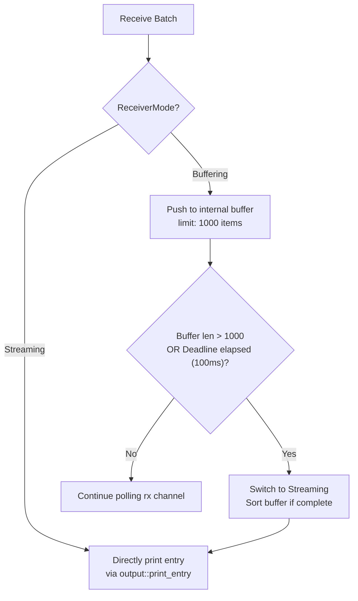
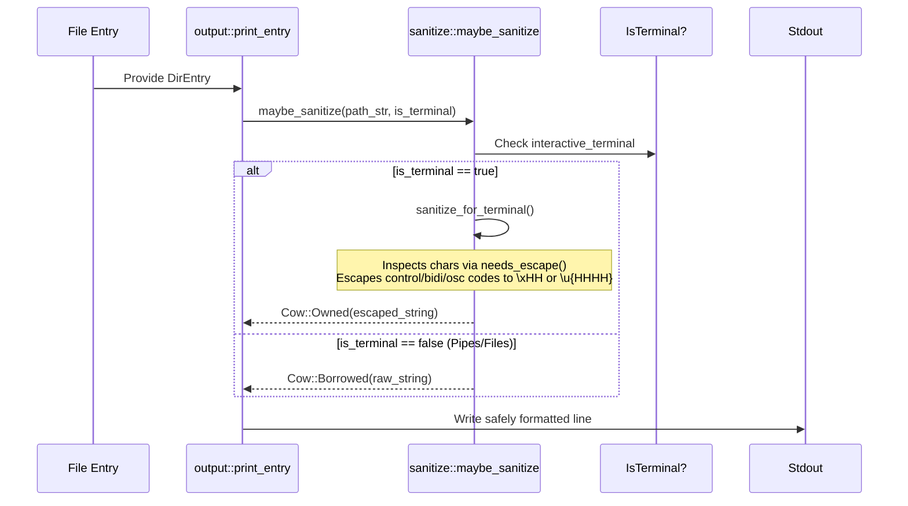
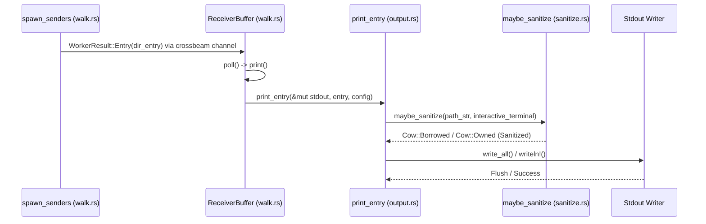

# Result Output

<details>
<summary>Relevant source files</summary>

The following files were used as context for generating this wiki page:

- [src/main.rs](https://github.com/sharkdp/fd/blob/main/src/main.rs)
- [src/walk.rs](https://github.com/sharkdp/fd/blob/main/src/walk.rs)
- [README.md](https://github.com/sharkdp/fd/blob/main/README.md)
- [src/cli.rs](https://github.com/sharkdp/fd/blob/main/src/cli.rs)
- [src/exec/job.rs](https://github.com/sharkdp/fd/blob/main/src/exec/job.rs)
- [src/output.rs](https://github.com/sharkdp/fd/blob/main/src/output.rs)
- [src/exec/mod.rs](https://github.com/sharkdp/fd/blob/main/src/exec/mod.rs)
- [src/fmt/mod.rs](https://github.com/sharkdp/fd/blob/main/src/fmt/mod.rs)
- [Cargo.toml](https://github.com/sharkdp/fd/blob/main/Cargo.toml)
- [src/exec/command.rs](https://github.com/sharkdp/fd/blob/main/src/exec/command.rs)
- [src/dir_entry.rs](https://github.com/sharkdp/fd/blob/main/src/dir_entry.rs)
- [src/hyperlink.rs](https://github.com/sharkdp/fd/blob/main/src/hyperlink.rs)
- [src/sanitize.rs](https://github.com/sharkdp/fd/blob/main/src/sanitize.rs)
- [src/config.rs](https://github.com/sharkdp/fd/blob/main/src/config.rs)
- [src/error.rs](https://github.com/sharkdp/fd/blob/main/src/error.rs)
- [doc/screencast.sh](https://github.com/sharkdp/fd/blob/main/doc/screencast.sh)
- [src/filetypes.rs](https://github.com/sharkdp/fd/blob/main/src/filetypes.rs)
</details>

## Overview

Result Output in *fd* encompasses the final presentation, formatting, buffering, and command dispatch pipeline that converts parallelly discovered filesystem entries into console streams, terminal hyperlinks, colorized text, custom template strings, or arguments passed to child processes. When worker threads match items during parallel traversal, results are packaged into asynchronous channels, collected by the receiver architecture, and handled depending on whether standard printing, quiet matching (`-q`), format templating (`--format`), or parallel command execution (`--exec`/`--exec-batch`) was requested.

Sources: [src/walk.rs:26-35](https://github.com/sharkdp/fd/blob/main/src/walk.rs#L26-L35)

The subsystem solves the classic performance and usability dilemma of parallel traversal tools: output interlacing, unbuffered write overhead, terminal injection vulnerabilities via malicious filenames, and deterministic sorting. By introducing a hybrid time-bounded buffering stage (`ReceiverBuffer`), *fd* dynamically collects early results to sort them lexicographically if a search finishes fast enough (defaulting to 100ms), while falling back to direct streaming for long-running scans.

Sources: [src/walk.rs:124-171](https://github.com/sharkdp/fd/blob/main/src/walk.rs#L124-L171)

Furthermore, output routing integrates terminal safety protocols through runtime TTY detection. When output targets an interactive terminal, malicious terminal escape sequences (such as OSC-8 hyperlink injections or ANSI control codes embedded in filenames) are caught and neutralized via strict sanitization routines. Conversely, when piped to non-terminal streams or tools like `xargs`, raw byte sequences are preserved on Unix systems to ensure invalid UTF-8 filenames reach downstream pipelines without corruption.

Sources: [src/output.rs:17-43](https://github.com/sharkdp/fd/blob/main/src/output.rs#L17-L43), [src/sanitize.rs:48-55](https://github.com/sharkdp/fd/blob/main/src/sanitize.rs#L48-L55)

---

## Receiver Buffer and Hybrid Streaming Architecture

The core controller for standard output presentation is the `ReceiverBuffer` type, managed within the receiver thread loop. It coordinates result intake from worker threads via crossbeam channels, handling backpressure, buffering deadlines, sorting semantics, and the eventual flush of standard output.

Sources: [src/walk.rs:129-150](https://github.com/sharkdp/fd/blob/main/src/walk.rs#L129-L150)



Sources: [src/walk.rs:174-249](https://github.com/sharkdp/fd/blob/main/src/walk.rs#L174-L249)

During initialization, `ReceiverBuffer::new` establishes a deadline (`Instant::now() + max_buffer_time`) using either the configured duration or the default 100ms limit. While in `ReceiverMode::Buffering`, incoming `WorkerResult::Entry` values are pushed into an internal `Vec<DirEntry>`. If the buffer reaches `MAX_BUFFER_LENGTH` (1000 items) or the timeout deadline fires, `ReceiverBuffer::stream` transitions the execution mode to `ReceiverMode::Streaming`, takes the buffer, and streams items downward.

Sources: [src/walk.rs:151-171](https://github.com/sharkdp/fd/blob/main/src/walk.rs#L151-L171), [src/walk.rs:270-279](https://github.com/sharkdp/fd/blob/main/src/walk.rs#L270-L279)

> [!NOTE]
> If a search finishes completely before the 100ms deadline expires and the receiver stops, `ReceiverBuffer::stop` sorts the accumulated buffer lexicographically via `self.buffer.sort()`, ensuring that quick, shallow searches output deterministic, sorted results.

Sources: [src/walk.rs:281-293](https://github.com/sharkdp/fd/blob/main/src/walk.rs#L281-L293)

---

## Output Modes and Formatting Engine

When an entry is approved for rendering, `output::print_entry` dictates how text, colors, hyperlinks, and trailing characters are structured. The engine supports three primary output branches checked sequentially in `Config`:

1. **Custom Format Templates (`--format`)**: Evaluated via `FormatTemplate::parse`, substituting replacement tokens.
2. **Colorized Output (`--color`)**: Rendered using `LsColors` rules mapped to `nu_ansi_term`.
3. **Uncolorized Output**: Standard string or raw byte printing.

Sources: [src/output.rs:17-33](https://github.com/sharkdp/fd/blob/main/src/output.rs#L17-L33)

| Token Variant | Display Syntax | Description |
| :--- | :--- | :--- |
| `Token::Placeholder` | `{}` | Full path of the current search result |
| `Token::Basename` | `{/}` | Basename component of the path |
| `Token::Parent` | `{//}` | Parent directory path |
| `Token::NoExt` | `{/}` | Path with file extension removed |
| `Token::BasenameNoExt` | `{/.}` | Basename with extension removed |
| `Token::Text(String)` | *literal* | Literal text segments |

Sources: [src/fmt/mod.rs:18-25](https://github.com/sharkdp/fd/blob/main/src/fmt/mod.rs#L18-L25)

The parsing mechanism relies on an `AhoCorasick` automaton initialized in a `OnceLock` to scan format strings for escape sequences (`{{`, `}}`) and placeholders (`{}`, `{/}`, `{//}`, `{.}`, `{/.}`). When a custom path separator is provided via `--path-separator`, `FormatTemplate::replace_separator` decomposes paths into components and re-joins them using the custom separator string.

Sources: [src/fmt/mod.rs:51-107](https://github.com/sharkdp/fd/blob/main/src/fmt/mod.rs#L51-L107), [src/fmt/mod.rs:147-196](https://github.com/sharkdp/fd/blob/main/src/fmt/mod.rs#L147-L196)

---

## Terminal Safety and Sanitization Pipeline

To prevent terminal escape injection attacks (where malicious filenames containing ANSI control codes, OSC-8 hyperlink payloads, or C0/C1 characters manipulate terminal emulators), *fd* processes all output strings through `maybe_sanitize`.

Sources: [src/sanitize.rs:48-55](https://github.com/sharkdp/fd/blob/main/src/sanitize.rs#L48-L55)



Sources: [src/output.rs:17-43](https://github.com/sharkdp/fd/blob/main/src/output.rs#L17-L43), [src/sanitize.rs:28-55](https://github.com/sharkdp/fd/blob/main/src/sanitize.rs#L28-L55)

The `needs_escape` function acts as the critical filtering guard:
```rust
fn needs_escape(c: char) -> bool {
    if c == '\t' {
        return false;
    }
    c.is_control()
        || matches!(c,
            '\u{00AD}'                  // soft hyphen (invisible)
            | '\u{180E}'                // Mongolian vowel separator
            | '\u{200B}'..='\u{200F}'   // zero-width + LRM/RLM
            | '\u{202A}'..='\u{202E}'   // bidi embedding/override
            | '\u{2060}'..='\u{206F}'   // word joiner, invisibles, deprecated formats
            | '\u{FEFF}'                // BOM / zero-width no-break space
            | '\u{FFF9}'..='\u{FFFB}'   // interlinear annotation
            | '\u{E0000}'..='\u{E007F}' // language tags
        )
}
```

Sources: [src/sanitize.rs:8-24](https://github.com/sharkdp/fd/blob/main/src/sanitize.rs#L8-L24)

> [!CAUTION]
> Disabling TTY detection or forcing raw terminal passthrough on untrusted filesystems exposes operators to Trojan-Source bidi-override attacks (`\u{202E}`) that visually invert filename extensions (e.g., rendering `malicious.exe\u{202E}txt.pdf` as `malicious.pdf.txt`).

Sources: [src/sanitize.rs:131-136](https://github.com/sharkdp/fd/blob/main/src/sanitize.rs#L131-L136)

---

## Terminal Hyperlink Integration

When `--hyperlink` is enabled (automatically when color is active or explicitly requested via `HyperlinkWhen::Always`), *fd* wraps output paths in OSC-8 escape sequences linking to `file://` URIs.

Sources: [src/output.rs:18-24](https://github.com/sharkdp/fd/blob/main/src/output.rs#L18-L24)

The `PathUrl` builder resolves the absolute path via `filesystem::absolute_path` and formats it into a URI:
```rust
impl fmt::Display for PathUrl {
    fn fmt(&self, f: &mut Formatter<'_>) -> fmt::Result {
        write!(f, "file://{}", host())?;
        let bytes = self.0.as_os_str().as_encoded_bytes();
        for &byte in bytes.iter() {
            encode(f, byte)?;
        }
        Ok(())
    }
}
```

Sources: [src/hyperlink.rs:7-22](https://github.com/sharkdp/fd/blob/main/src/hyperlink.rs#L7-L22)

The `encode` function ensures safe URI representation by permitting standard URI characters (`0-9`, `A-Z`, `a-z`, `/`, `:`, `-`, `.`, `_`, `~`) while percent-encoding any non-ASCII bytes or backslashes (on Windows) to prevent URI malformation.

Sources: [src/hyperlink.rs:24-41](https://github.com/sharkdp/fd/blob/main/src/hyperlink.rs#L24-L41)

---

## Command Execution and Batching Output (`--exec` / `--exec-batch`)

When `--exec` (`-x`) or `--exec-batch` (`-X`) is supplied, search results are diverted away from `ReceiverBuffer` and routed into the execution subsystem (`src/exec/`).

Sources: [src/walk.rs:411-414](https://github.com/sharkdp/fd/blob/main/src/walk.rs#L411-L414)

1. **One-by-One Mode (`--exec`)**: `exec::job` spawns worker thread pools that consume entries from the channel receiver. Each entry's stripped path is injected into a `CommandSet`, which executes the command and manages output buffering (`OutputBuffer`) to prevent standard output and error streams from different threads from interleaving.

Sources: [src/exec/job.rs:11-41](https://github.com/sharkdp/fd/blob/main/src/exec/job.rs#L11-41)

2. **Batch Mode (`--exec-batch`)**: `exec::batch` collects paths and feeds them into `CommandBuilder`. `CommandBuilder` monitors argument length limits (`argmax::Command`) and batches inputs together, flushing and re-spawning processes when operating system command line length constraints (`ARG_MAX`) or user-defined `batch_size` limits are approached.

Sources: [src/exec/job.rs:46-64](https://github.com/sharkdp/fd/blob/main/src/exec/job.rs#L46-L64), [src/exec/mod.rs:90-120](https://github.com/sharkdp/fd/blob/main/src/exec/mod.rs#L90-L120)

---

## Exit Codes and Result Summary Protocol

The result output subsystem communicates search outcomes to the host shell via strict `ExitCode` variants mapped in `src/exit_codes.rs`:

Sources: [src/walk.rs:204-206](https://github.com/sharkdp/fd/blob/main/src/walk.rs#L204-206)

| Exit Code Variant | Condition | Purpose |
| :--- | :--- | :--- |
| `ExitCode::Success` | `num_results >= 0` | Normal completion with or without results |
| `ExitCode::HasResults(true)` | `quiet = true` and match found | Returns `0` immediately when quiet search succeeds |
| `ExitCode::HasResults(false)` | `quiet = true` and zero matches | Returns `1` when quiet search yields no matches |
| `ExitCode::GeneralError` | I/O failure, broken pipe, or command error | Signals execution failure |
| `ExitCode::KilledBySigint` | Interrupted by Ctrl-C (`SIGINT`) | Clean termination on user interrupt |

Sources: [src/walk.rs:288-293](https://github.com/sharkdp/fd/blob/main/src/walk.rs#L288-L293), [src/walk.rs:296-302](https://github.com/sharkdp/fd/blob/main/src/walk.rs#L296-L302)

---

## Call-Chain Execution Walkthrough

The following trace details the execution path when a standard search discovers a file entry and writes it to standard output, including the error sanitation call chain (`Job -> Needs_escape: job → print_error → maybe_sanitize → sanitize_for_terminal → needs_escape`):

Sources: [src/walk.rs:443-614](https://github.com/sharkdp/fd/blob/main/src/walk.rs#L443-L614)

1. **Walk Discovery**: `WorkerState::spawn_senders` matches a filesystem path against regular expression patterns.

Sources: [src/walk.rs:519-524](https://github.com/sharkdp/fd/blob/main/src/walk.rs#L519-L524)

2. **Channel Transmission**: The sender packages the entry into `WorkerResult::Entry(entry)` and pushes it into the batch sender channel via `tx.send()`.

Sources: [src/walk.rs:600-604](https://github.com/sharkdp/fd/blob/main/src/walk.rs#L600-L604)

3. **Receiver Polling**: `ReceiverBuffer::poll` receives the batch, iterates through items, and checks configuration parameters.

Sources: [src/walk.rs:198-233](https://github.com/sharkdp/fd/blob/main/src/walk.rs#L198-L233)

4. **Error Handling & Sanitation Chain (`Job -> Needs_escape`)**: When worker jobs encounter filesystem errors (`WorkerResult::Error(err)`), `job` calls `print_error` (from `src/error.rs:4-8`), which invokes `maybe_sanitize` (from `src/sanitize.rs:48-54`), delegating to `sanitize_for_terminal` (from `src/sanitize.rs:27-45`) and `needs_escape` (from `src/sanitize.rs:8-23`) to sanitize dangerous control characters before writing to standard error.

Sources: [src/exec/job.rs:25-30](https://github.com/sharkdp/fd/blob/main/src/exec/job.rs#L25-L30), [src/error.rs:4-8](https://github.com/sharkdp/fd/blob/main/src/error.rs#L4-8), [src/sanitize.rs:8-54](https://github.com/sharkdp/fd/blob/main/src/sanitize.rs#L8-L54)

5. **Output Dispatch**: `output::print_entry` evaluates hyperlinks, selects the formatter (`print_entry_format`, `print_entry_colorized`, or `print_entry_uncolorized`), sanitizes strings via `maybe_sanitize`, and writes to `std::io::BufWriter<Stdout>`.

Sources: [src/output.rs:17-43](https://github.com/sharkdp/fd/blob/main/src/output.rs#L17-L43)



Sources: [src/walk.rs:443-614](https://github.com/sharkdp/fd/blob/main/src/walk.rs#L443-L614), [src/output.rs:17-43](https://github.com/sharkdp/fd/blob/main/src/output.rs#L17-L43)

## Related

- [[Path Formatting]]
- [[Hyperlink Generation]]

