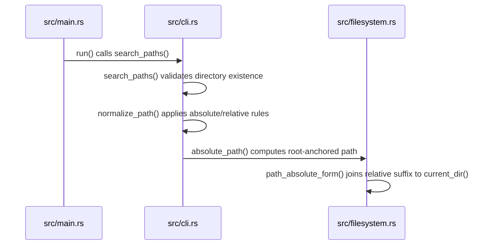
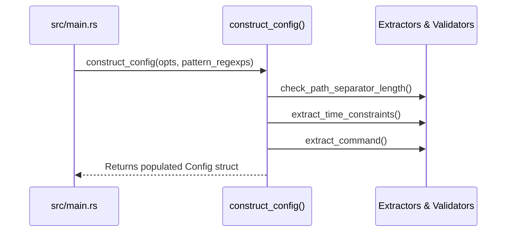
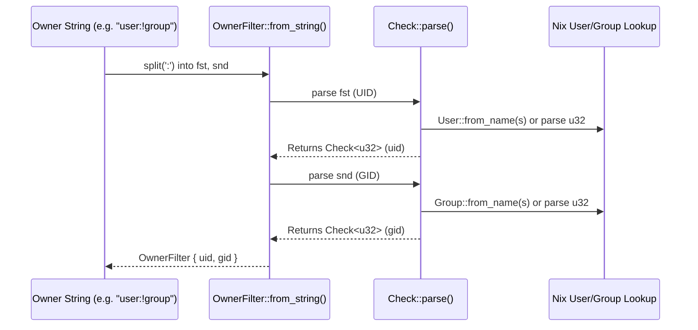
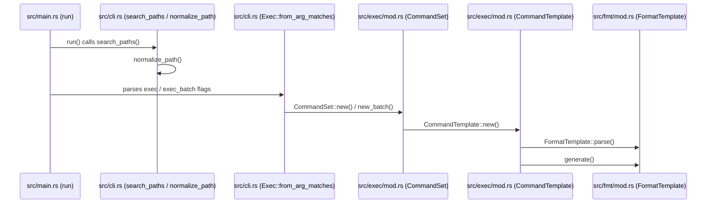

# Search Configuration

<details>
<summary>Relevant source files</summary>

The following files were used as context for generating this wiki page:

- [src/main.rs](https://github.com/sharkdp/fd/blob/main/src/main.rs)
- [src/cli.rs](https://github.com/sharkdp/fd/blob/main/src/cli.rs)
- [README.md](https://github.com/sharkdp/fd/blob/main/README.md)
- [src/walk.rs](https://github.com/sharkdp/fd/blob/main/src/walk.rs)
- [Cargo.toml](https://github.com/sharkdp/fd/blob/main/Cargo.toml)
- [src/config.rs](https://github.com/sharkdp/fd/blob/main/src/config.rs)
- [src/fmt/mod.rs](https://github.com/sharkdp/fd/blob/main/src/fmt/mod.rs)
- [src/filter/owner.rs](https://github.com/sharkdp/fd/blob/main/src/filter/owner.rs)
- [src/filter/size.rs](https://github.com/sharkdp/fd/blob/main/src/filter/size.rs)
- [doc/sponsors.md](https://github.com/sharkdp/fd/blob/main/doc/sponsors.md)
- [src/filetypes.rs](https://github.com/sharkdp/fd/blob/main/src/filetypes.rs)
- [contrib/completion/fdfind.bash](https://github.com/sharkdp/fd/blob/main/contrib/completion/fdfind.bash)
- [CONTRIBUTING.md](https://github.com/sharkdp/fd/blob/main/CONTRIBUTING.md)
- [src/exec/mod.rs](https://github.com/sharkdp/fd/blob/main/src/exec/mod.rs)
- [src/filesystem.rs](https://github.com/sharkdp/fd/blob/main/src/filesystem.rs)
</details>

## Overview

Search configuration serves as the central pipeline that translates raw command-line arguments and environment defaults into a unified, robust runtime state for filesystem traversal. It bridges the gap between user intent and high-performance execution by parsing inputs, normalizing target paths, establishing strict filtering criteria, and preparing parallel directory walkers. Sources: [src/main.rs:75-112](https://github.com/sharkdp/fd/blob/main/src/main.rs#L75-L112), [src/cli.rs:21-31](https://github.com/sharkdp/fd/blob/main/src/cli.rs#L21-L31)

By decoupling argument validation from parallel worker execution, the configuration subsystem prevents invalid search states early, ensures cross-platform path compatibility, and manages complex options such as VCS ignore rules, case sensitivity, and external command templates. Sources: [src/main.rs:83-104](https://github.com/sharkdp/fd/blob/main/src/main.rs#L83-L104), [src/walk.rs:347-404](https://github.com/sharkdp/fd/blob/main/src/walk.rs#L347-L404)

## CLI Argument Parsing and Validation

### Overview

The entry point of `fd` initiates execution via `main()` in `src/main.rs`, which delegates immediately to `run()` to parse command-line options and validate raw user inputs before any filesystem traversal begins. Argument structures are defined declaratively in `src/cli.rs` using `clap`'s derive macro on the `Opts` struct. Sources: [src/main.rs:62-76](https://github.com/sharkdp/fd/blob/main/src/main.rs#L62-L76), [src/cli.rs:21-32](https://github.com/sharkdp/fd/blob/main/src/cli.rs#L21-L32)

### Call-Chain Execution Walkthrough

The startup and raw input validation pipeline executes through a strict sequence of validation checks before constructing runtime structures:

1. `Opts::parse()` — Parses raw command-line arguments against the `Opts` struct definitions. Sources: [src/main.rs:76-76](https://github.com/sharkdp/fd/blob/main/src/main.rs#L76-L76)
2. `set_working_dir(&opts)` — Evaluates `opts.base_directory`, verifies that the target path exists on disk, and updates the process current working directory via `env::set_current_dir()`. Sources: [src/main.rs:83-83](https://github.com/sharkdp/fd/blob/main/src/main.rs#L83-L83), [src/main.rs:131-145](https://github.com/sharkdp/fd/blob/main/src/main.rs#L131-L145)
3. `opts.search_paths()` — Retrieves and validates positional or flag-driven target paths, ensuring each resolved entry points to a valid directory. Sources: [src/main.rs:84-84](https://github.com/sharkdp/fd/blob/main/src/main.rs#L84-L84), [src/cli.rs:696-721](https://github.com/sharkdp/fd/blob/main/src/cli.rs#L696-L721)
4. `ensure_search_pattern_is_not_a_path(&opts)` — Iterates over the primary pattern and all `--and` (`opts.exprs`) patterns to prevent accidental path-separator usage. Sources: [src/main.rs:89-89](https://github.com/sharkdp/fd/blob/main/src/main.rs#L89-L89), [src/main.rs:169-181](https://github.com/sharkdp/fd/blob/main/src/main.rs#L169-L181)
5. `ensure_single_search_pattern_is_not_a_path(pattern)` — Checks whether a pattern contains `/` or (on Windows) a native separator paired with an existing directory path, raising a descriptive error if true. Sources: [src/main.rs:177-179](https://github.com/sharkdp/fd/blob/main/src/main.rs#L177-L179), [src/main.rs:185-216](https://github.com/sharkdp/fd/blob/main/src/main.rs#L185-L216)

> [!WARNING]
> On Windows, path separators (`\`) double as regex escape characters (e.g., `\d+`). To prevent valid regexes from triggering false positives, `ensure_single_search_pattern_is_not_a_path` restricts the path check on `\` to patterns that also resolve to an existing directory on disk. Sources: [src/main.rs:152-166](https://github.com/sharkdp/fd/blob/main/src/main.rs#L152-L166), [src/main.rs:197-201](https://github.com/sharkdp/fd/blob/main/src/main.rs#L197-L201)

### CLI Argument Structure and Options

The `Opts` struct configures behavior flags, matching modes, depth constraints, and auxiliary filters. The following table summarizes key options and flags defined in `src/cli.rs`:

| Flag / Option | Rust Field Name | Default Value | Purpose |
| :--- | :--- | :--- | :--- |
| `-H`, `--hidden` | `hidden` | `false` | Include hidden files and directories in search results. Sources: [src/cli.rs:39-45](https://github.com/sharkdp/fd/blob/main/src/cli.rs#L39-L45) |
| `-I`, `--no-ignore` | `no_ignore` | `false` | Do not respect `.gitignore`, `.ignore`, or `.fdignore` files. Sources: [src/cli.rs:54-60](https://github.com/sharkdp/fd/blob/main/src/cli.rs#L54-L60) |
| `-s`, `--case-sensitive` | `case_sensitive` | `false` | Perform case-sensitive search instead of smart-case matching. Sources: [src/cli.rs:131-139](https://github.com/sharkdp/fd/blob/main/src/cli.rs#L131-L139) |
| `-i`, `--ignore-case` | `ignore_case` | `false` | Force case-insensitive search matching. Sources: [src/cli.rs:144-151](https://github.com/sharkdp/fd/blob/main/src/cli.rs#L144-L151) |
| `-g`, `--glob` | `glob` | `false` | Perform glob-based search instead of regular expression matching. Sources: [src/cli.rs:154-161](https://github.com/sharkdp/fd/blob/main/src/cli.rs#L154-L161) |
| `-F`, `--fixed-strings` | `fixed_strings` | `false` | Treat search pattern as a literal substring string. Sources: [src/cli.rs:177-185](https://github.com/sharkdp/fd/blob/main/src/cli.rs#L177-L185) |
| `--exact` | `exact` | `false` | Match the entire filename or path exactly (literal, non-substring). Sources: [src/cli.rs:187-198](https://github.com/sharkdp/fd/blob/main/src/cli.rs#L187-L198) |
| `-p`, `--full-path` | `full_path` | `false` | Match search pattern against the full absolute path rather than filename. Sources: [src/cli.rs:258-264](https://github.com/sharkdp/fd/blob/main/src/cli.rs#L258-L264) |
| `-L`, `--follow` | `follow` | `false` | Traverse into symbolic links. Sources: [src/cli.rs:241-249](https://github.com/sharkdp/fd/blob/main/src/cli.rs#L241-L249) |

Sources: [src/cli.rs:39-264](https://github.com/sharkdp/fd/blob/main/src/cli.rs#L39-L264)

### Design Trade-Offs

| Design Choice | Benefit | Cost |
| :--- | :--- | :--- |
| Declarative `clap` derive parser | Strong compile-time type safety, automatic help text generation, and robust flag conflict resolution. Sources: [src/cli.rs:21-31](https://github.com/sharkdp/fd/blob/main/src/cli.rs#L21-L31) | Increased binary size and compile-time overhead due to macro expansion. Sources: [src/cli.rs:21-31](https://github.com/sharkdp/fd/blob/main/src/cli.rs#L21-L31) |
| Hand-rolled `FromArgMatches` for `Exec` | Bypasses derive limitations for complex group-based flag collections (`-x` vs `-X`). Sources: [src/cli.rs:855-874](https://github.com/sharkdp/fd/blob/main/src/cli.rs#L855-L874) | Requires manual implementation of argument parsing and updating logic. Sources: [src/cli.rs:861-879](https://github.com/sharkdp/fd/blob/main/src/cli.rs#L861-L879) |
| Path-separator pattern check | Catches common user errors where full paths are pasted as regex search patterns. Sources: [src/main.rs:149-166](https://github.com/sharkdp/fd/blob/main/src/main.rs#L149-L166) | Requires conditional stat calls on Windows when backslashes are present in the pattern. Sources: [src/main.rs:197-201](https://github.com/sharkdp/fd/blob/main/src/main.rs#L197-L201) |

Sources: [src/cli.rs:21-31](https://github.com/sharkdp/fd/blob/main/src/cli.rs#L21-L31), [src/cli.rs:855-874](https://github.com/sharkdp/fd/blob/main/src/cli.rs#L855-L874), [src/main.rs:149-201](https://github.com/sharkdp/fd/blob/main/src/main.rs#L149-L201)

## Path Resolution and Normalization

### Overview

Target search directories are resolved from positional parameters or alternative `--search-path` options, validated for existence, and normalized into relative or absolute forms before filesystem traversal begins. Sources: [src/main.rs:83-87](https://github.com/sharkdp/fd/blob/main/src/main.rs#L83-L87), [src/cli.rs:696-736](https://github.com/sharkdp/fd/blob/main/src/cli.rs#L696-L736)

### Call-Chain Execution Walkthrough

The resolution and normalization of search paths proceed through a strict execution order from entry processing down to system-level path conversion:

1. `run` invokes `Opts::search_paths()` to collect user-specified directories or default to `./`. Sources: [src/main.rs:84](https://github.com/sharkdp/fd/blob/main/src/main.rs#L84), [src/cli.rs:696-721](https://github.com/sharkdp/fd/blob/main/src/cli.rs#L696-L721)
2. `search_paths` iterates over inputs, checks directory existence using `filesystem::is_existing_directory`, and hands each valid path to `normalize_path`. Sources: [src/cli.rs:707-720](https://github.com/sharkdp/fd/blob/main/src/cli.rs#L707-L720)
3. `normalize_path` inspects `--absolute-path` flags, canonicalizes standard relative tokens, and passes candidate paths to `absolute_path` if requested. Sources: [src/cli.rs:723-736](https://github.com/sharkdp/fd/blob/main/src/cli.rs#L723-L736)
4. `absolute_path` wraps lower-level resolution and strips Windows UNC path prefixes (`\\?\`) via `path_absolute_form`. Sources: [src/filesystem.rs:23-36](https://github.com/sharkdp/fd/blob/main/src/filesystem.rs#L23-L36)
5. `path_absolute_form` checks if a path is already absolute; if not, it strips leading dots and joins the relative path onto `env::current_dir()`. Sources: [src/filesystem.rs:14-21](https://github.com/sharkdp/fd/blob/main/src/filesystem.rs#L14-L21)



Sources: [src/main.rs:84](https://github.com/sharkdp/fd/blob/main/src/main.rs#L84), [src/cli.rs:696-736](https://github.com/sharkdp/fd/blob/main/src/cli.rs#L696-L736), [src/filesystem.rs:14-36](https://github.com/sharkdp/fd/blob/main/src/filesystem.rs#L14-L36)

### Path Verification and Normalization Functions

The filesystem and CLI helper modules provide specialized routines to inspect working directories and adjust path representations.

| Function Name | Module | Purpose |
| :--- | :--- | :--- |
| `search_paths` | `src/cli.rs` | Collects and filters positional or explicit search paths, defaulting to `./`. Sources: [src/cli.rs:696-721](https://github.com/sharkdp/fd/blob/main/src/cli.rs#L696-L721) |
| `normalize_path` | `src/cli.rs` | Adjusts path formatting based on `--absolute-path` flags and special symbols like `-`. Sources: [src/cli.rs:723-736](https://github.com/sharkdp/fd/blob/main/src/cli.rs#L723-L736) |
| `absolute_path` | `src/filesystem.rs` | Computes a fully resolved absolute path, stripping Windows UNC prefixes. Sources: [src/filesystem.rs:23-36](https://github.com/sharkdp/fd/blob/main/src/filesystem.rs#L23-L36) |
| `path_absolute_form` | `src/filesystem.rs` | Prepends the current working directory to relative paths. Sources: [src/filesystem.rs:14-21](https://github.com/sharkdp/fd/blob/main/src/filesystem.rs#L14-L21) |
| `is_existing_directory` | `src/filesystem.rs` | Verifies that a path is a directory and either has a filename or normalizes successfully. Sources: [src/filesystem.rs:38-42](https://github.com/sharkdp/fd/blob/main/src/filesystem.rs#L38-L42) |

Sources: [src/cli.rs:696-736](https://github.com/sharkdp/fd/blob/main/src/cli.rs#L696-L736), [src/filesystem.rs:14-42](https://github.com/sharkdp/fd/blob/main/src/filesystem.rs#L14-L42)

> [!NOTE]
> `is_existing_directory` deliberately avoids standard `.exists()` checks because `.` remains valid even if the underlying current working directory has been deleted out from under the process. Sources: [src/filesystem.rs:38-41](https://github.com/sharkdp/fd/blob/main/src/filesystem.rs#L38-L41)

## Runtime Configuration Construction

### Overview

The construction of the runtime search configuration aggregates parsed command-line flags, environment variables, and system defaults into the core `Config` structure. This transformation phase is governed primarily by `construct_config` in `src/main.rs`, which takes ownership of raw `Opts` structures and compiled pattern regular expressions to establish traversal flags, coloring policies, execution setups, and constraints. Sources: [src/main.rs:248-393](https://github.com/sharkdp/fd/blob/main/src/main.rs#L248-L393), [src/config.rs:14-136](https://github.com/sharkdp/fd/blob/main/src/config.rs#L14-L136)

### Call-Chain Execution Walkthrough

The assembly of runtime configurations follows a deterministic sequence from option validation down to field population within `Config`:

1. `run` passes ownership of `Opts` and `pattern_regexps` to `construct_config`. Sources: [src/main.rs:102](https://github.com/sharkdp/fd/blob/main/src/main.rs#L102), [src/main.rs:248](https://github.com/sharkdp/fd/blob/main/src/main.rs#L248)
2. `construct_config` evaluates smart case sensitivity by checking `opts.ignore_case`, `opts.case_sensitive`, and any uppercase letters in patterns via `pattern_has_uppercase_char`. Sources: [src/main.rs:251-255](https://github.com/sharkdp/fd/blob/main/src/main.rs#L251-L255)
3. It resolves and validates path separator constraints via `check_path_separator_length`. Sources: [src/main.rs:257-264](https://github.com/sharkdp/fd/blob/main/src/main.rs#L257-L264)
4. It extracts time constraints and command execution templates through `extract_time_constraints` and `extract_command`. Sources: [src/main.rs:267](https://github.com/sharkdp/fd/blob/main/src/main.rs#L267), [src/main.rs:298](https://github.com/sharkdp/fd/blob/main/src/main.rs#L298), [src/main.rs:395-410](https://github.com/sharkdp/fd/blob/main/src/main.rs#L395-L410), [src/main.rs:496-519](https://github.com/sharkdp/fd/blob/main/src/main.rs#L496-L519)
5. Finally, it constructs and returns the fully populated `Config` instance used by the parallel directory walker. Sources: [src/main.rs:310-392](https://github.com/sharkdp/fd/blob/main/src/main.rs#L310-L392), [src/main.rs:111](https://github.com/sharkdp/fd/blob/main/src/main.rs#L111)



Sources: [src/main.rs:102](https://github.com/sharkdp/fd/blob/main/src/main.rs#L102), [src/main.rs:248-393](https://github.com/sharkdp/fd/blob/main/src/main.rs#L248-L393)

### Configuration Field Mapping

| Option / Field | Source Type / Default | Purpose in `Config` |
| :--- | :--- | :--- |
| `case_sensitive` | `bool` | Determines whether string matching respects character casing or applies smart-case rules. Sources: [src/main.rs:251-255](https://github.com/sharkdp/fd/blob/main/src/main.rs#L251-L255), [src/config.rs:16](https://github.com/sharkdp/fd/blob/main/src/config.rs#L16) |
| `ignore_hidden` | `bool` (`!(opts.hidden || opts.rg_alias_ignore()`) | Controls whether files and directories starting with a dot are filtered out. Sources: [src/main.rs:313](https://github.com/sharkdp/fd/blob/main/src/main.rs#L313), [src/config.rs:23](https://github.com/sharkdp/fd/blob/main/src/config.rs#L23) |
| `read_fdignore` | `bool` (`!(opts.no_ignore || opts.rg_alias_ignore())`) | Dictates whether `.fdignore` exclusion files are respected. Sources: [src/main.rs:314](https://github.com/sharkdp/fd/blob/main/src/main.rs#L314), [src/config.rs:26](https://github.com/sharkdp/fd/blob/main/src/config.rs#L26) |
| `read_vcsignore` | `bool` (`!(opts.no_ignore || opts.rg_alias_ignore() || opts.no_ignore_vcs)`) | Governs respect for version control ignore rules like `.gitignore`. Sources: [src/main.rs:315](https://github.com/sharkdp/fd/blob/main/src/main.rs#L315), [src/config.rs:32](https://github.com/sharkdp/fd/blob/main/src/config.rs#L32) |
| `follow_links` | `bool` (`opts.follow`) | Specifies whether symbolic link directories are traversed during walks. Sources: [src/main.rs:321](https://github.com/sharkdp/fd/blob/main/src/main.rs#L321), [src/config.rs:41](https://github.com/sharkdp/fd/blob/main/src/config.rs#L41) |
| `one_file_system` | `bool` (`opts.one_file_system`) | Restricts traversal strictly to the initial file system mount point. Sources: [src/main.rs:322](https://github.com/sharkdp/fd/blob/main/src/main.rs#L322), [src/config.rs:44](https://github.com/sharkdp/fd/blob/main/src/config.rs#L44) |

Sources: [src/main.rs:310-392](https://github.com/sharkdp/fd/blob/main/src/main.rs#L310-L392), [src/config.rs:14-136](https://github.com/sharkdp/fd/blob/main/src/config.rs#L14-L136)

> [!WARNING]
> On Windows platforms, custom path separators supplied via `--path-separator` are strictly validated to be exactly one byte in length; providing multi-byte sequences triggers an immediate error unless doubled. Sources: [src/main.rs:234-246](https://github.com/sharkdp/fd/blob/main/src/main.rs#L234-L246), [src/main.rs:264](https://github.com/sharkdp/fd/blob/main/src/main.rs#L264)

## Filter and Type Constraint Resolution

### Overview

The runtime evaluation of file search constraints involves parsing, validating, and applying filters against individual directory entries. These filters govern which items are reported based on physical attributes such as file type, byte size, and Unix user or group ownership.

Sources: [src/config.rs:83-114](https://github.com/sharkdp/fd/blob/main/src/config.rs#L83-L114), [src/filter/owner.rs:6-73](https://github.com/sharkdp/fd/blob/main/src/filter/owner.rs#L6-L73), [src/filter/size.rs:9-74](https://github.com/sharkdp/fd/blob/main/src/filter/size.rs#L9-L74), [src/filetypes.rs:8-42](https://github.com/sharkdp/fd/blob/main/src/filetypes.rs#L8-L42)

### File Type Filtering

The `FileTypes` structure controls whether specific file categories and conditional states are included in search results. The `should_ignore` method evaluates a given `DirEntry` against these boolean flags, returning `true` to exclude the entry if it fails any active constraint.

```rust
pub struct FileTypes {
    pub files: bool,
    pub directories: bool,
    pub symlinks: bool,
    pub block_devices: bool,
    pub char_devices: bool,
    pub sockets: bool,
    pub pipes: bool,
    pub executables_only: bool,
    pub empty_only: bool,
}
```

Sources: [src/filetypes.rs:8-18](https://github.com/sharkdp/fd/filetypes.rs#L8-L18)

Entries lacking a resolvable file type return `true` immediately via `should_ignore`. Otherwise, basic file types are checked against negated flags (`!self.files && entry_type.is_file()`, etc.), while specialized modifiers evaluate path executability (`!entry.path().executable()`) or filesystem emptiness (`!filesystem::is_empty(entry)`).

Sources: [src/filetypes.rs:21-42](https://github.com/sharkdp/fd/src/filetypes.rs#L21-L42)

### Size Constraint Resolution

Size filters are managed by the `SizeFilter` enum, which supports minimum, maximum, and exact equality limits over byte quantities.

| `SizeFilter` Variant | Internal Data | Evaluation Rule |
| :--- | :--- | :--- |
| `SizeFilter::Max(u64)` | `limit: u64` | `size <= limit` |
| `SizeFilter::Min(u64)` | `limit: u64` | `size >= limit` |
| `SizeFilter::Equals(u64)` | `limit: u64` | `size == limit` |

Sources: [src/filter/size.rs:9-13](https://github.com/sharkdp/fd/src/filter/size.rs#L9-L13), [src/filter/size.rs:68-74](https://github.com/sharkdp/fd/src/filter/size.rs#L68-L74)

The parser evaluates size strings using a cached regex `SIZE_CAPTURES` matching `(?i)^([+-]?)(\d+)(b|[kmgt]i?b?)$`. It recognizes both SI base-10 multipliers (`KILO: 1000`, `MEGA`, `GIGA`, `TERA`) and binary base-2 multipliers (`KIBI: 1024`, `MEBI`, `GIBI`, `TEBI`).

Sources: [src/filter/size.rs:6-25](https://github.com/sharkdp/fd/src/filter/size.rs#L6-L25), [src/filter/size.rs:34-57](https://github.com/sharkdp/fd/src/filter/size.rs#L34-L57)

> [!NOTE]
> Size filter unit matching is case-insensitive; uppercase suffixes such as `+1KB` or `+1KiB` are correctly resolved to their respective byte multipliers. Sources: [src/filter/size.rs:35](https://github.com/sharkdp/fd/src/filter/size.rs#L35), [src/filter/size.rs:46-57](https://github.com/sharkdp/fd/src/filter/size.rs#L46-L57)

### Unix Ownership Filtering

Unix user and group ownership constraints are parsed into an `OwnerFilter` structure consisting of UID and GID checks. Each check can evaluate equality (`Check::Equal`), inequality (`Check::NotEq`), or bypass evaluation (`Check::Ignore`).

Sources: [src/filter/owner.rs:5-16](https://github.com/sharkdp/fd/src/filter/owner.rs#L5-L16)



Sources: [src/filter/owner.rs:27-58](https://github.com/sharkdp/fd/src/filter/owner.rs#L27-L58), [src/filter/owner.rs:85-102](https://github.com/sharkdp/fd/src/filter/owner.rs#L85-L102)

Input strings containing more than one colon separator (e.g., `3:5:`) return an error. If both fields resolve to `Check::Ignore`, `filter_ignore()` returns `None` to prevent unnecessary metadata inspection during traversal walks.

Sources: [src/filter/owner.rs:31-36](https://github.com/sharkdp/fd/src/filter/owner.rs#L31-L36), [src/filter/owner.rs:61-67](https://github.com/sharkdp/fd/src/filter/owner.rs#L61-L67)

> [!WARNING]
> Negation markers (`!`) must prefix the user or group identifier directly (e.g., `!5` or `:!3`); placing the exclamation mark before the colon delimiter or after it incorrectly invalidates the parse sequence. Sources: [src/filter/owner.rs:91](https://github.com/sharkdp/fd/src/filter/owner.rs#L91), [src/filter/owner.rs:133-134](https://github.com/sharkdp/fd/src/filter/owner.rs#L133-L134)

## Execution and Command Template Setup

### Execution and Command Template Setup

### Overview

Command execution and template parsing configure how `fd` invokes external processes for search results via `-x`/`--exec` (one-by-one execution) or `-X`/`--exec-batch` (batched command execution). Command templates parse raw argument strings, handle escaped braces, and substitute path-formatting tokens.

Sources: [src/exec/mod.rs:20-74](https://github.com/sharkdp/fd/blob/main/src/exec/mod.rs#L20-L74), [src/fmt/mod.rs:17-49](https://github.com/sharkdp/fd/blob/main/src/fmt/mod.rs#L17-L49), [src/cli.rs:856-950](https://github.com/sharkdp/fd/blob/main/src/cli.rs#L856-L950)

### Execution Trace and Sequence

The instantiation and parsing of command sets follow a strict call sequence from application startup to template construction.

1. `run` — Initiates command-line parsing and option extraction in `src/main.rs`.
Sources: [src/main.rs:75-84](https://github.com/sharkdp/fd/blob/main/src/main.rs#L75-L84)
2. `search_paths` — Resolves and validates directory targets under `Opts`.
Sources: [src/cli.rs:696-721](https://github.com/sharkdp/fd/blob/main/src/cli.rs#L696-L721)
3. `normalize_path` — Applies absolute paths, dot-prefixes, or standard path normalization rules.
Sources: [src/cli.rs:723-736](https://github.com/sharkdp/fd/blob/main/src/cli.rs#L723-L736)
4. `new` — Constructs the `Exec` structure from raw argument matches via `clap::FromArgMatches`.
Sources: [src/cli.rs:861-874](https://github.com/sharkdp/fd/blob/main/src/cli.rs#L861-L874)
5. `CommandSet` — Builds either single-execution or batch command templates via `CommandSet::new` or `CommandSet::new_batch`.
Sources: [src/exec/mod.rs:36-70](https://github.com/sharkdp/fd/blob/main/src/exec/mod.rs#L36-L70)

Similarly, command generation threads the path formatting step:

1. `run` — Starts the main application routine.
Sources: [src/main.rs:75-84](https://github.com/sharkdp/fd/blob/main/src/main.rs#L75-L84)
2. `search_paths` — Gathers target directories.
Sources: [src/cli.rs:696-721](https://github.com/sharkdp/fd/blob/main/src/cli.rs#L696-L721)
3. `normalize_path` — Adjusts relative or absolute prefixes.
Sources: [src/cli.rs:723-736](https://github.com/sharkdp/fd/blob/main/src/cli.rs#L723-L736)
4. `new` — Initializes command templates.
Sources: [src/exec/mod.rs:220-256](https://github.com/sharkdp/fd/blob/main/src/exec/mod.rs#L220-L256)
5. `generate` — Produces concrete execution parameters or string representations using `FormatTemplate`.
Sources: [src/exec/mod.rs:266-272](https://github.com/sharkdp/fd/blob/main/src/exec/mod.rs#L266-L272), [src/fmt/mod.rs:112-141](https://github.com/sharkdp/fd/blob/main/src/fmt/mod.rs#L112-L141)



Sources: [src/main.rs:75-112](https://github.com/sharkdp/fd/blob/main/src/main.rs#L75-L112), [src/cli.rs:696-736](https://github.com/sharkdp/fd/blob/main/src/cli.rs#L696-L736), [src/cli.rs:861-874](https://github.com/sharkdp/fd/blob/main/src/cli.rs#L861-L874), [src/exec/mod.rs:36-70](https://github.com/sharkdp/fd/blob/main/src/exec/mod.rs#L36-L70), [src/exec/mod.rs:220-272](https://github.com/sharkdp/fd/blob/main/src/exec/mod.rs#L220-L272), [src/fmt/mod.rs:58-141](https://github.com/sharkdp/fd/blob/main/src/fmt/mod.rs#L58-L141)

### Placeholder Tokens and Formatting

Format templates leverage an `AhoCorasick` automaton matching literal escape sequences and placeholder tokens.

| Token Variant | Syntax Representation | Output Resolution |
| :--- | :--- | :--- |
| `Token::Placeholder` | `{}` | Full path of current search result |
| `Token::Basename` | `{/}` | Filename basename |
| `Token::Parent` | `{//}` | Parent directory path |
| `Token::NoExt` | `{/}` without extension | Path without file extension |
| `Token::BasenameNoExt` | `{/.}` | Basename without file extension |
| `Token::Text(String)` | Literal text | Unmodified literal text segment |

Sources: [src/fmt/mod.rs:18-25](https://github.com/sharkdp/fd/blob/main/src/fmt/mod.rs#L18-L25), [src/fmt/mod.rs:64-66](https://github.com/sharkdp/fd/blob/main/src/fmt/mod.rs#L64-L66), [src/fmt/mod.rs:116-136](https://github.com/sharkdp/fd/blob/main/src/fmt/mod.rs#L116-L136)

> [!WARNING]
> In batch execution mode (`--exec-batch` / `-X`), command templates enforce a strict limit of exactly one placeholder token across all arguments. Attempting to supply multiple placeholders in batch mode returns an error. Sources: [src/exec/mod.rs:63-65](https://github.com/sharkdp/fd/blob/main/src/exec/mod.rs#L63-L65), [src/exec/mod.rs:423-424](https://github.com/sharkdp/fd/blob/main/src/exec/mod.rs#L423-L424)

### Design Trade-Offs in Command Execution

| Design Choice | Benefit | Cost |
| :--- | :--- | :--- |
| Automatic trailing placeholder insertion | Simplifies common invocations (`fd -e rs -x wc`) without requiring explicit `{}` suffixes. | Prevents running commands without any trailing argument unless explicitly avoided. |
| Batch argument size constraints (`CommandBuilder`) | Prevents OS `E2BIG` errors by chunking large result sets according to argument limits. | Adds overhead to track counts, flush buffers, and manage multiple sub-process lifecycles. |
| Separate `CommandSet` modes (`OneByOne` vs `Batch`) | Allows tailored argument verification (e.g., forbidding placeholders on the executable in batch mode). | Duplicates command construction paths and requires distinct builder flows. |

Sources: [src/exec/mod.rs:51-70](https://github.com/sharkdp/fd/blob/main/src/exec/mod.rs#L51-L70), [src/exec/mod.rs:173-189](https://github.com/sharkdp/fd/blob/main/src/exec/mod.rs#L173-L189), [src/exec/mod.rs:245-253](https://github.com/sharkdp/fd/blob/main/src/exec/mod.rs#L245-L253)

## Walker Initialization and Traversal Options

### Walker Initialization and Traversal Options

### Overview

Active parallel directory traversal is orchestrated by translating the runtime `Config` structure into options consumed by the external `ignore` crate's `WalkBuilder` and `WalkParallel`. The `WorkerState::build_walker` function acts as the primary bridge, configuring hidden file filtering, ignore-file discovery policies, exclusion overrides, symlink following, and file system boundaries.

Sources: [src/walk.rs:347-365](https://github.com/sharkdp/fd/blob/main/src/walk.rs#L347-L365)

### Walker Configuration Mapping

The `WorkerState::build_walker` implementation maps individual boolean and scalar flags from `Config` directly onto builder configuration methods provided by `WalkBuilder`.

| Configuration Field | Builder Method | Purpose / Behavior |
| :--- | :--- | :--- |
| `config.ignore_hidden` | `WalkBuilder::hidden` | Determines whether hidden files and directories are excluded. |
| `config.read_fdignore` | `WalkBuilder::ignore` | Controls whether `.fdignore` files are respected. |
| `config.read_parent_ignore` | `WalkBuilder::parents` | Decides whether ignore files in parent directories are evaluated. |
| `config.read_vcsignore` | `WalkBuilder::git_ignore`, `git_global`, `git_exclude` | Toggles VCS ignore file evaluation (`.gitignore`, global git ignore, exclude). |
| `config.require_git_to_read_vcsignore` | `WalkBuilder::require_git` | Mandates a `.git` directory presence to read VCS ignore files. |
| `config.follow_links` | `WalkBuilder::follow_links` | Specifies whether symbolic links should be followed during traversal. |
| `config.one_file_system` | `WalkBuilder::same_file_system` | Restricts traversal to the starting file system. |
| `config.max_depth` | `WalkBuilder::max_depth` | Sets the maximum search depth limit, if specified. |

Sources: [src/walk.rs:352-365](https://github.com/sharkdp/fd/blob/main/src/walk.rs#L352-L365)

> [!NOTE]
> Parent ignore evaluation (`read_parent_ignore`) is conditionally enabled only when either `read_fdignore` or `read_vcsignore` is also active, preventing redundant filesystem checks when all ignore mechanisms are disabled. Sources: [src/walk.rs:356](https://github.com/sharkdp/fd/blob/main/src/walk.rs#L356)

### Custom Ignore Files and Global Strategy

Beyond standard VCS and `.fdignore` support, `WorkerState::build_walker` incorporates custom ignore files and base-directory-strategy resolutions via the `etcetera` crate.

- If `config.read_fdignore` is enabled, `.fdignore` is registered as a custom ignore filename via `builder.add_custom_ignore_filename(".fdignore")`.
- If `config.read_global_ignore` is true, base directories are resolved using `etcetera::choose_base_strategy()`, locating the global ignore file at `<config_dir>/fd/ignore`.
- Each path in `config.ignore_files` is iteratively added via `builder.add_ignore(ignore_file)`.

Sources: [src/walk.rs:367-396](https://github.com/sharkdp/fd/blob/main/src/walk.rs#L367-L396)

> [!WARNING]
> Errors encountered when parsing global or custom ignore files are caught and routed to `print_error` rather than aborting traversal, except for `ignore::Error::Partial` variants which are silently ignored. Sources: [src/walk.rs:377-383](https://github.com/sharkdp/fd/blob/main/src/walk.rs#L377-L383), [src/walk.rs:389-395](https://github.com/sharkdp/fd/blob/main/src/walk.rs#L389-L395)

## Related

- [[Command Line Interface]]
- [[Parallel Directory Traversal]]

