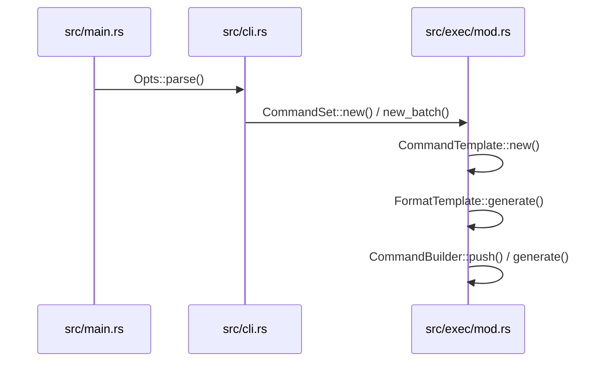
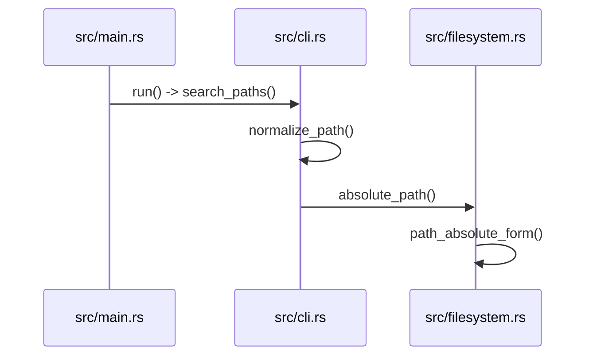
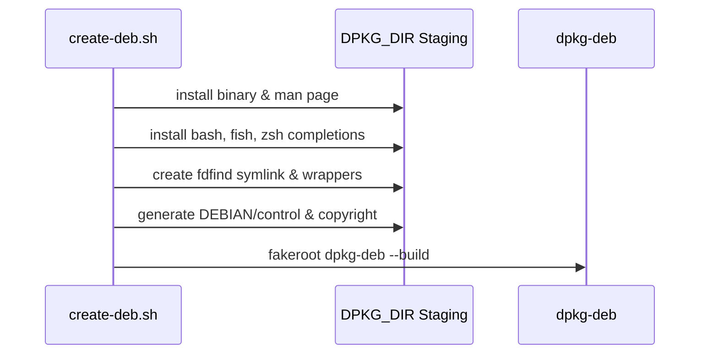
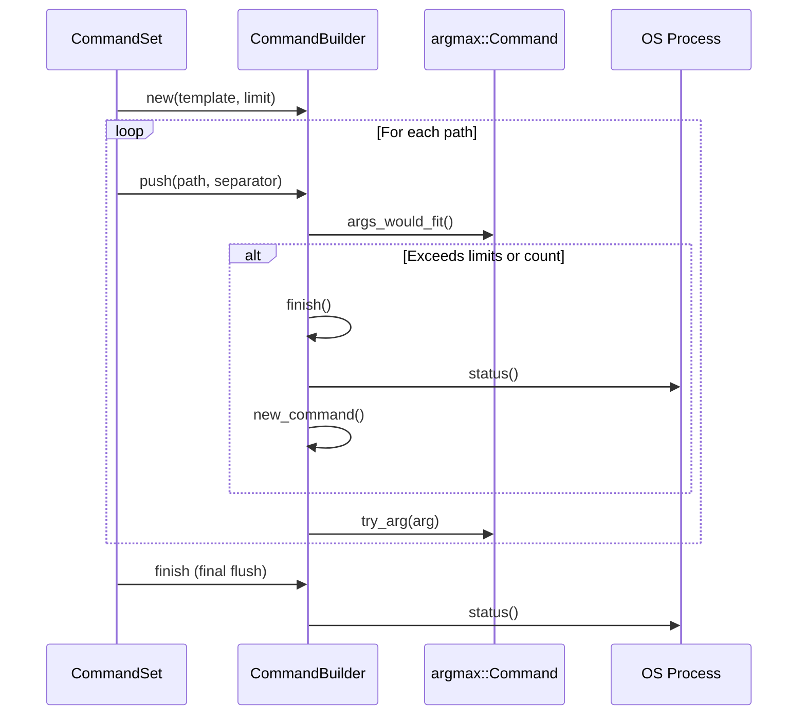

# Shell Completions

Relevant source files

The following files were used as context for generating this wiki page:

- [src/main.rs](https://github.com/sharkdp/fd/blob/main/src/main.rs)
- [README.md](https://github.com/sharkdp/fd/blob/main/README.md)
- [src/cli.rs](https://github.com/sharkdp/fd/blob/main/src/cli.rs)
- [src/exec/mod.rs](https://github.com/sharkdp/fd/blob/main/src/exec/mod.rs)
- [src/exec/job.rs](https://github.com/sharkdp/fd/blob/main/src/exec/job.rs)
- [scripts/create-deb.sh](https://github.com/sharkdp/fd/blob/main/scripts/create-deb.sh)
- [Cargo.toml](https://github.com/sharkdp/fd/blob/main/Cargo.toml)
- [src/fmt/mod.rs](https://github.com/sharkdp/fd/blob/main/src/fmt/mod.rs)
- [CONTRIBUTING.md](https://github.com/sharkdp/fd/blob/main/CONTRIBUTING.md)
- [contrib/completion/fdfind.bash](https://github.com/sharkdp/fd/blob/main/contrib/completion/fdfind.bash)
- [src/exec/command.rs](https://github.com/sharkdp/fd/blob/main/src/exec/command.rs)
- [src/fmt/input.rs](https://github.com/sharkdp/fd/blob/main/src/fmt/input.rs)
- [scripts/version-bump.sh](https://github.com/sharkdp/fd/blob/main/scripts/version-bump.sh)
- [doc/screencast.sh](https://github.com/sharkdp/fd/blob/main/doc/screencast.sh)
- [doc/sponsors.md](https://github.com/sharkdp/fd/blob/main/doc/sponsors.md)
- [src/filesystem.rs](https://github.com/sharkdp/fd/blob/main/src/filesystem.rs)

## Overview

Shell completions automate argument and flag suggestions for `fd` across multiple command-line interpreters, enhancing user efficiency and reducing syntax errors. By integrating with underlying argument parsers and packaging pipelines, completion scripts provide robust autocomplete support for both primary binaries and distribution-specific aliases. Sources: [README.md:753-778](https://github.com/sharkdp/fd/blob/main/README.md#L753-L778), [src/cli.rs:690-693](https://github.com/sharkdp/fd/blob/main/src/cli.rs#L690-L693)

## CLI Completion Generation Flags

### Overview

Command-line argument parsing and main entry point dispatch coordinate automatic shell completion generation when the `--gen-completions` flag is passed. The `Opts` structure defined via `clap` handles the exclusive completion flag parsing, returning an optional target shell. Sources: [src/cli.rs:690-693](https://github.com/sharkdp/fd/blob/main/src/cli.rs#L690-L693)

When execution begins in `run()`, parsed options are inspected for completion generation requests before any filesystem search operations initialize. Sources: [src/main.rs:75-81](https://github.com/sharkdp/fd/blob/main/src/main.rs#L75-L81)

The control flow follows a distinct dispatch sequence:
1. `Opts::parse()` parses command-line arguments into the `Opts` configuration struct. Sources: [src/main.rs:76|src/cli.rs:21-32](https://github.com/sharkdp/fd/blob/main/src/main.rs#L76)
2. `opts.gen_completions()?` checks for the presence of completion flags and extracts or detects the target `Shell`. Sources: [src/main.rs:79|src/cli.rs:776-785](https://github.com/sharkdp/fd/blob/main/src/cli.rs#L776-L785)
3. If a shell is returned, `print_completions(shell)` is invoked to construct command metadata and write script contents to standard output. Sources: [src/main.rs:79-81|src/main.rs:116-129](https://github.com/sharkdp/fd/blob/main/src/main.rs#L79-L81)
4. `print_completions` inspects the program name from environment arguments, builds the `clap` command via `Opts::command()`, and calls `clap_complete::generate()`. Sources: [src/main.rs:116-128](https://github.com/sharkdp/fd/blob/main/src/main.rs#L116-L128)

Sources: [src/main.rs:116-128](https://github.com/sharkdp/fd/blob/main/src/main.rs#L116-L128)

> [!NOTE]
> The `gen_completions` field is marked `exclusive = true` in its argument attributes, ensuring that completion generation flags cannot be combined with standard search options or directory arguments. Sources: [src/cli.rs:690-693](https://github.com/sharkdp/fd/blob/main/src/cli.rs#L690-L693)

The completion generation capability relies on `clap_complete::Shell` variants to target specific shell interpreters. Sources: [src/cli.rs:690-693](https://github.com/sharkdp/fd/blob/main/src/cli.rs#L690-L693)

| Argument / Method | Type | Default / Behavior | Purpose |
| :--- | :--- | :--- | :--- |
| `gen_completions` | `Option<Option<Shell>>` | `None` (exclusive) | Triggers shell completion output generation for a specified or auto-detected shell. Sources: [src/cli.rs:690-693](https://github.com/sharkdp/fd/blob/main/src/cli.rs#L690-L693) |
| `Opts::gen_completions()` | Method | Resolves environment shell | Detects shell from environment if flag is passed without explicit value. Sources: [src/cli.rs:775-785](https://github.com/sharkdp/fd/blob/main/src/cli.rs#L775-L785) |
| `print_completions()` | Function | Outputs via `std::io::stdout()` | Builds command schema and invokes `clap_complete::generate`. Sources: [src/main.rs:114-129](https://github.com/sharkdp/fd/blob/main/src/main.rs#L114-L129) |

Sources: [src/main.rs:114-129](https://github.com/sharkdp/fd/blob/main/src/main.rs#L114-L129), [src/cli.rs:690-693](https://github.com/sharkdp/fd/blob/main/src/cli.rs#L690-L693), [src/cli.rs:775-785](https://github.com/sharkdp/fd/blob/main/src/cli.rs#L775-L785)

## Command Set Initialization and Generation Flow

### Overview

The execution pipeline setup and command generation control flow dictate how parsed command-line options are transformed into executable process templates, streaming configurations, and batch execution groups via `CommandSet`. Sources: [src/exec/mod.rs:30-70](https://github.com/sharkdp/fd/blob/main/src/exec/mod.rs#L30-L70), [src/main.rs:298-299](https://github.com/sharkdp/fd/blob/main/src/main.rs#L298-L299)

### Execution Pipeline and Command Generation Walkthrough

The transformation of raw options into structured command execution units proceeds through explicit call chains that validate tokens, enforce execution modes, and construct argument templates. Sources: [src/exec/mod.rs:36-70](https://github.com/sharkdp/fd/blob/main/src/exec/mod.rs#L36-L70), [src/exec/mod.rs:220-256](https://github.com/sharkdp/fd/blob/main/src/exec/mod.rs#L220-L256)

1. `run` initializes command extraction during configuration construction via `extract_command`. Sources: [src/main.rs:298](https://github.com/sharkdp/fd/blob/main/src/main.rs#L298), [src/cli.rs:857-874](https://github.com/sharkdp/fd/blob/main/src/cli.rs#L857-L874)
2. `search_paths` and `normalize_path` handle argument path resolution prior to invoking execution builders. Sources: [src/cli.rs:696-736](https://github.com/sharkdp/fd/blob/main/src/cli.rs#L696-L736)
3. `CommandSet::new` or `CommandSet::new_batch` receives the parsed argument collections and creates a `CommandSet`. Sources: [src/exec/mod.rs:36-70](https://github.com/sharkdp/fd/blob/main/src/exec/mod.rs#L36-L70)
4. `CommandTemplate::new` parses individual string arguments into `FormatTemplate` tokens, validates that command lists are non-empty, and appends an implicit placeholder if no token is present. Sources: [src/exec/mod.rs:220-256](https://github.com/sharkdp/fd/blob/main/src/exec/mod.rs#L220-L256)
5. `generate` or `CommandBuilder::push` constructs runtime processes using `FormatTemplate::generate` to substitute search result paths and custom path separators. Sources: [src/exec/mod.rs:173-189](https://github.com/sharkdp/fd/blob/main/src/exec/mod.rs#L173-L189), [src/exec/mod.rs:266-272](https://github.com/sharkdp/fd/blob/main/src/exec/mod.rs#L266-L272)

Sources: [src/exec/mod.rs:173-272](https://github.com/sharkdp/fd/blob/main/src/exec/mod.rs#L173-L272)

Sources: [src/main.rs:76|src/cli.rs:857-874](https://github.com/sharkdp/fd/blob/main/src/main.rs#L76), [src/exec/mod.rs:36-70](https://github.com/sharkdp/fd/blob/main/src/exec/mod.rs#L36-L70), [src/exec/mod.rs:173-189](https://github.com/sharkdp/fd/blob/main/src/exec/mod.rs#L173-L189), [src/exec/mod.rs:220-256](https://github.com/sharkdp/fd/blob/main/src/exec/mod.rs#L220-L256), [src/exec/mod.rs:266-272](https://github.com/sharkdp/fd/blob/main/src/exec/mod.rs#L266-L272)

> [!WARNING]
> In batch execution mode (`--exec-batch` / `-X`), batch commands are strictly limited to exactly one placeholder token across their argument list. Supplying multiple placeholder tokens or using a placeholder as the executable position triggers an immediate error return. Sources: [src/exec/mod.rs:63-65](https://github.com/sharkdp/fd/blob/main/src/exec/mod.rs#L63-L65), [src/exec/mod.rs:246-248](https://github.com/sharkdp/fd/blob/main/src/exec/mod.rs#L246-L248)

The command execution engine supports distinct operational modes and structural constraints defined across `CommandSet` and `CommandTemplate`. Sources: [src/exec/mod.rs:20-70](https://github.com/sharkdp/fd/blob/main/src/exec/mod.rs#L20-L70)

| Structure / Method | Type / Signature | Default / Behavior | Purpose |
| :--- | :--- | :--- | :--- |
| `ExecutionMode::OneByOne` | Enum variant | Default for `-x` / `--exec` | Executes the command separately for each matching search result. Sources: [src/exec/mod.rs:22-24](https://github.com/sharkdp/fd/blob/main/src/exec/mod.rs#L22-L24), [src/exec/mod.rs:43](https://github.com/sharkdp/fd/blob/main/src/exec/mod.rs#L43) |
| `ExecutionMode::Batch` | Enum variant | Default for `-X` / `--exec-batch` | Runs the command once across a batched collection of search results. Sources: [src/exec/mod.rs:25-27](https://github.com/sharkdp/fd/blob/main/src/exec/mod.rs#L25-L27), [src/exec/mod.rs:58](https://github.com/sharkdp/fd/blob/main/src/exec/mod.rs#L58) |
| `CommandSet::new()` | Function | Returns `Result<CommandSet>` | Instantiates one-by-one execution commands from raw argument iterators. Sources: [src/exec/mod.rs:36-49](https://github.com/sharkdp/fd/blob/main/src/exec/mod.rs#L36-L49) |
| `CommandSet::new_batch()` | Function | Returns `Result<CommandSet>` | Instantiates batch execution commands, ensuring token limits are respected. Sources: [src/exec/mod.rs:51-70](https://github.com/sharkdp/fd/blob/main/src/exec/mod.rs#L51-L70) |
| `CommandTemplate::new()` | Function | Returns `Result<CommandTemplate>` | Parses templates, validates argument presence, and appends implicit placeholders. Sources: [src/exec/mod.rs:220-256](https://github.com/sharkdp/fd/blob/main/src/exec/mod.rs#L220-L256) |

Sources: [src/exec/mod.rs:20-70](https://github.com/sharkdp/fd/blob/main/src/exec/mod.rs#L20-L70), [src/exec/mod.rs:220-256](https://github.com/sharkdp/fd/blob/main/src/exec/mod.rs#L220-L256)

## Search Path Normalization and Resolution

### Overview

Path resolution and normalization mechanics handle positional and explicitly provided search paths, translating raw user inputs into canonical forms ready for directory walking. Sources: [src/cli.rs:696-736](https://github.com/sharkdp/fd/blob/main/src/cli.rs#L696-L736), [src/filesystem.rs:14-36](https://github.com/sharkdp/fd/blob/main/src/filesystem.rs#L14-L36)

### Call-Chain Execution Walkthrough

The execution flow for resolving search paths proceeds through the following ordered functions:

1. `run` retrieves parsed options via `Opts::parse()` and invokes path collection and configuration setup. Sources: [src/main.rs:76-84](https://github.com/sharkdp/fd/blob/main/src/main.rs#L76-L84)
2. `search_paths` inspects positional `path` arguments or `--search-path` parameters, falling back to `./` if both are empty, and validates each directory. Sources: [src/cli.rs:696-721](https://github.com/sharkdp/fd/blob/main/src/cli.rs#L696-L721)
3. `normalize_path` transforms individual paths based on whether `--absolute-path` is requested, converting `.` to `./` or prefixing `-` to ensure proper walker handling. Sources: [src/cli.rs:723-736](https://github.com/sharkdp/fd/blob/main/src/cli.rs#L723-L736)
4. `absolute_path` wraps absolute form resolution and strips Windows UNC path prefixes (`\\?\`) when targeting Windows systems. Sources: [src/filesystem.rs:23-36](https://github.com/sharkdp/fd/blob/main/src/filesystem.rs#L23-L36)
5. `path_absolute_form` checks if a path is already absolute; if relative, it strips any leading `.` component and joins the remainder with `env::current_dir()`. Sources: [src/filesystem.rs:14-21](https://github.com/sharkdp/fd/blob/main/src/filesystem.rs#L14-L21)

Sources: [src/main.rs:76-84](https://github.com/sharkdp/fd/blob/main/src/main.rs#L76-L84), [src/cli.rs:696-736](https://github.com/sharkdp/fd/blob/main/src/cli.rs#L696-L736), [src/filesystem.rs:14-36](https://github.com/sharkdp/fd/blob/main/src/filesystem.rs#L14-L36)

Sources: [src/main.rs:76-84](https://github.com/sharkdp/fd/blob/main/src/main.rs#L76-L84), [src/cli.rs:696-736](https://github.com/sharkdp/fd/blob/main/src/cli.rs#L696-L736), [src/filesystem.rs:14-36](https://github.com/sharkdp/fd/blob/main/src/filesystem.rs#L14-L36)

> [!NOTE]
> `is_existing_directory` avoids using standard `.exists()` checks because `.` must remain valid even if the underlying current working directory has been deleted. It explicitly verifies that the path is a directory and either has a file name or successfully normalizes via `normpath`. Sources: [src/filesystem.rs:38-42](https://github.com/sharkdp/fd/blob/main/src/filesystem.rs#L38-L42)

The path processing subsystem exposes helper functions and utilities across CLI configuration and filesystem modules. Sources: [src/cli.rs:696-736](https://github.com/sharkdp/fd/blob/main/src/cli.rs#L696-L736), [src/filesystem.rs:14-121](https://github.com/sharkdp/fd/blob/main/src/filesystem.rs#L14-L121)

| Function | Module | Return Type | Purpose |
| :--- | :--- | :--- | :--- |
| `search_paths()` | `src/cli.rs` | `anyhow::Result<VecathBuf>>` | Collects positional or flag-based search paths, validating existence. Sources: [src/cli.rs:696-721](https://github.com/sharkdp/fd/blob/main/src/cli.rs#L696-L721) |
| `normalize_path()` | `src/cli.rs` | `PathBuf` | Applies absolute path mapping, dot-prefix preservation, and dash escaping. Sources: [src/cli.rs:723-736](https://github.com/sharkdp/fd/blob/main/src/cli.rs#L723-L736) |
| `path_absolute_form()` | `src/filesystem.rs` | `io::ResultathBuf>` | Converts relative paths to absolute form using current working directory. Sources: [src/filesystem.rs:14-21](https://github.com/sharkdp/fd/blob/main/src/filesystem.rs#L14-L21) |
| `absolute_path()` | `src/filesystem.rs` | `io::ResultathBuf>` | Normalizes absolute forms and strips Windows UNC prefixes. Sources: [src/filesystem.rs:23-36](https://github.com/sharkdp/fd/blob/main/src/filesystem.rs#L23-L36) |
| `strip_current_dir()` | `src/filesystem.rs` | `&Path` | Removes leading `./` prefixes from path slices. Sources: [src/filesystem.rs:118-121](https://github.com/sharkdp/fd/blob/main/src/filesystem.rs#L118-L121) |

Sources: [src/cli.rs:696-736](https://github.com/sharkdp/fd/blob/main/src/cli.rs#L696-L736), [src/filesystem.rs:14-121](https://github.com/sharkdp/fd/blob/main/src/filesystem.rs#L14-L121)

| Design choice | Benefit | Cost |
| :--- | :--- | :--- |
| Explicit UNC prefix stripping on Windows | Prevents path formatting discrepancies when interacting with standard Win32 APIs | Requires platform-conditional compilation branches (`#[cfg(windows)]`) |
| Custom `is_existing_directory` check instead of `.exists()` | Preserves validity of `.` as a search root even if the working directory was deleted | Incurs additional checks via `normpath` or file name inspection |
| Special casing dash (`-`) in `normalize_path` | Ensures the directory walker correctly interprets hyphen-named paths without treating them as flags | Adds edge-case branching logic inside argument normalization |

Sources: [src/cli.rs:729-732](https://github.com/sharkdp/fd/blob/main/src/cli.rs#L729-L732), [src/filesystem.rs:26-33](https://github.com/sharkdp/fd/blob/main/src/filesystem.rs#L26-L33), [src/filesystem.rs:38-42](https://github.com/sharkdp/fd/blob/main/src/filesystem.rs#L38-L42)

## Debian Packaging and Shell Integration

### Overview

The Debian packaging and shell integration subsystem builds distributable `.deb` packages, configures binary installations, and sets up shell completion wrappers for both `fd` and the `fdfind` alias. The packaging script `scripts/create-deb.sh` orchestrates staging, arch detection, control file generation, and compression. Sources: [scripts/create-deb.sh:1-136](https://github.com/sharkdp/fd/blob/main/scripts/create-deb.sh#L1-L136)

Target architectures are mapped from Rust compilation targets to Debian architecture descriptors via a case statement. The script distinguishes between standard builds and musl-based builds to configure conflict lists and package basenames. Sources: [scripts/create-deb.sh:13-35](https://github.com/sharkdp/fd/blob/main/scripts/create-deb.sh#L13-L35)

| Target Pattern | Debian Architecture (`DPKG_ARCH`) | Package Basename (`DPKG_BASENAME`) | Conflicts List (`DPKG_CONFLICTS`) |
| :--- | :--- | :--- | :--- |
| `aarch64-*-linux-*` | `arm64` | `fd` (or `fd-musl`) | `fd-musl, fd-find` |
| `arm-*-linux-*hf` | `armhf` | `fd` (or `fd-musl`) | `fd-musl, fd-find` |
| `i686-*-linux-*` | `i686` | `fd` (or `fd-musl`) | `fd-musl, fd-find` |
| `x86_64-*-linux-*` | `amd64` | `fd` (or `fd-musl`) | `fd-musl, fd-find` |
| `*-musl*` (Name override) | Determined by target prefix | `fd-musl` | `fd, fd-find` |

Sources: [scripts/create-deb.sh:13-35](https://github.com/sharkdp/fd/blob/main/scripts/create-deb.sh#L13-L35)

> [!NOTE]
> If the `TARGET` environment variable is empty, the script automatically queries the host compiler via `rustc -vV` and extracts the host string using `sed`. Similarly, package versions are retrieved dynamically using `cargo metadata` combined with `jq`. Sources: [scripts/create-deb.sh:9-11](https://github.com/sharkdp/fd/blob/main/scripts/create-deb.sh#L9-L11), [scripts/create-deb.sh:24-26](https://github.com/sharkdp/fd/blob/main/scripts/create-deb.sh#L24-L26)

The packaging script populates the staging directory with binaries, man pages, documentation, and completion scripts for Bash, Fish, and Zsh. To support Debian installations where `fd` is traditionally registered as `fdfind`, the script installs symlinks and dedicated wrapper completion files. Sources: [scripts/create-deb.sh:39-66](https://github.com/sharkdp/fd/blob/main/scripts/create-deb.sh#L39-L66)

The `contrib/completion/fdfind.bash` wrapper sources the primary `fd` completions and registers the `fdfind` completion handler with conditional checks for Bash version 4.4 compatibility. Sources: [contrib/completion/fdfind.bash:1-9](https://github.com/sharkdp/fd/blob/main/contrib/completion/fdfind.bash#L1-L9)

Sources: [scripts/create-deb.sh:39-135](https://github.com/sharkdp/fd/blob/main/scripts/create-deb.sh#L39-L135)

> [!WARNING]
> When executing completion registration for `fdfind` in Bash, the script explicitly inspects `BASH_VERSINFO` to determine whether to pass the `-o nosort` flag alongside `-o bashdefault` and `-o default`. Version 4.4 and newer receive the `-o nosort` option, whereas older versions omit it. Sources: [contrib/completion/fdfind.bash:4-8](https://github.com/sharkdp/fd/blob/main/contrib/completion/fdfind.bash#L4-L8)

## Command Execution and Error Reporting

### Overview

The execution subsystem handles job scheduling, process spawning, argument sizing constraints, and error reporting when executing external commands via `--exec` (`-x`) or `--exec-batch` (`-X`). Task dispatch is managed through job loops that receive search results from worker threads, construct command sets, and delegate execution to command builders or streaming executors. Sources: [src/exec/mod.rs:20-88](https://github.com/sharkdp/fd/blob/main/src/exec/mod.rs#L20-L88), [src/exec/job.rs:8-64](https://github.com/sharkdp/fd/blob/main/src/exec/job.rs#L8-L64)

> [!NOTE]
> Output buffering is automatically enabled when running with multiple threads (`config.threads > 1`) to prevent interlace corruption of terminal outputs, whereas single-threaded runs disable buffering to allow interactive command execution. Sources: [src/exec/job.rs:16-17](https://github.com/sharkdp/fd/blob/main/src/exec/job.rs#L16-L17), [src/exec/command.rs:60-95](https://github.com/sharkdp/fd/blob/main/src/exec/command.rs#L60-L95)

When processing search results in batch mode, `CommandBuilder` coordinates argument packing while respecting operating system command-line length limits through the `argmax` crate. Sources: [src/exec/mod.rs:90-208](https://github.com/sharkdp/fd/blob/main/src/exec/mod.rs#L90-L208)

Adding entries and executing batches follows a strict invocation path: `CommandSet::execute_batch()` → `CommandBuilder::new()` → `CommandBuilder::push()` → `CommandBuilder::finish()`. Within `push()`, the builder checks whether adding the next path argument exceeds count limits or argument byte constraints via `cmd.args_would_fit()`. If constraints are violated, `finish()` executes the accumulated command batch, flushes output streams, and re-initializes a fresh command instance using `CommandBuilder::new_command()`. Sources: [src/exec/mod.rs:90-208](https://github.com/sharkdp/fd/blob/main/src/exec/mod.rs#L90-L208), [src/exec/job.rs:46-64](https://github.com/sharkdp/fd/blob/main/src/exec/job.rs#L46-L64)

Sources: [src/exec/mod.rs:90-208](https://github.com/sharkdp/fd/blob/main/src/exec/mod.rs#L90-L208)

> [!WARNING]
> In batch mode (`--exec-batch`), templates are restricted to having at most one placeholder token. Furthermore, the first argument representing the executable must be a fixed binary name rather than a dynamic path placeholder. Sources: [src/exec/mod.rs:63-65](https://github.com/sharkdp/fd/blob/main/src/exec/mod.rs#L63-L65), [src/exec/mod.rs:246-248](https://github.com/sharkdp/fd/blob/main/src/exec/mod.rs#L246-L248)

Output synchronization is governed by `OutputBuffer`, which captures standard output and standard error vectors from concurrent tasks and flushes them atomically while holding stdout and stderr locks. Sources: [src/exec/command.rs:13-57](https://github.com/sharkdp/fd/blob/main/src/exec/command.rs#L13-L57)

| Error Condition / Trigger | Handled By Function | Resulting Action & Exit Code |
| :--- | :--- | :--- |
| Command binary not found (`ErrorKind::NotFound`) | `handle_cmd_error()` | Prints `"Command not found: rogram>"` to stderr; returns `ExitCode::GeneralError`. Sources: [src/exec/command.rs:101-109](https://github.com/sharkdp/fd/blob/main/src/exec/command.rs#L101-L109) |
| General I/O or execution failure | `handle_cmd_error()` | Prints `"Problem while executing command: <err>"` to stderr; returns `ExitCode::GeneralError`. Sources: [src/exec/command.rs:110-114](https://github.com/sharkdp/fd/blob/main/src/exec/command.rs#L110-L114) |
| Non-zero process exit status | `execute_commands()` | Flushes buffered outputs immediately; returns `ExitCode::GeneralError`. Sources: [src/exec/command.rs:86-89](https://github.com/sharkdp/fd/blob/main/src/exec/command.rs#L86-L89) |
| Missing executable argument for `--exec` / `--exec-batch` | `CommandTemplate::new()` | Aborts execution via `bail!` with `"No executable provided for --exec or --exec-batch"`. Sources: [src/exec/mod.rs:241-243](https://github.com/sharkdp/fd/blob/main/src/exec/mod.rs#L241-L243) |

Sources: [src/exec/command.rs:13-114](https://github.com/sharkdp/fd/blob/main/src/exec/command.rs#L13-L114), [src/exec/mod.rs:241-243](https://github.com/sharkdp/fd/blob/main/src/exec/mod.rs#L241-L243)

## Related

- [[Command Line Interface]]

