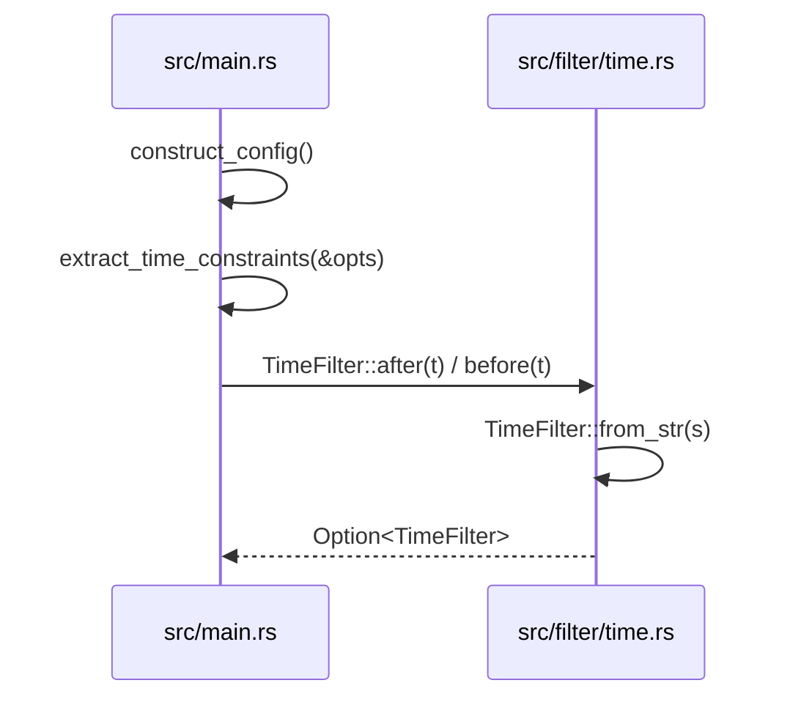
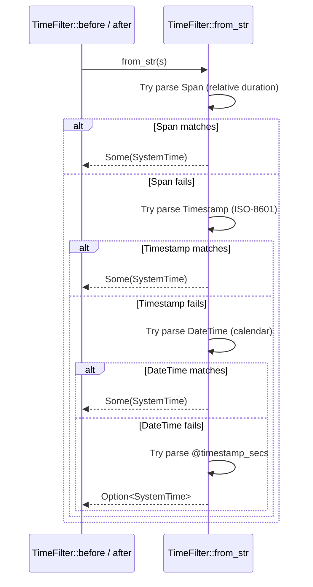
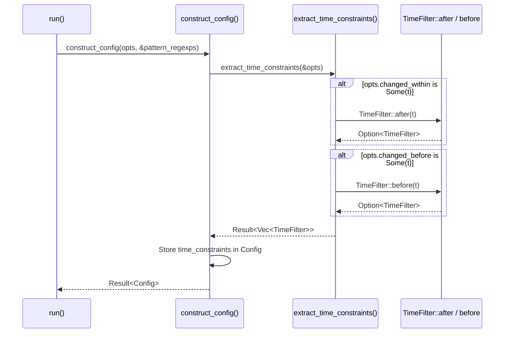
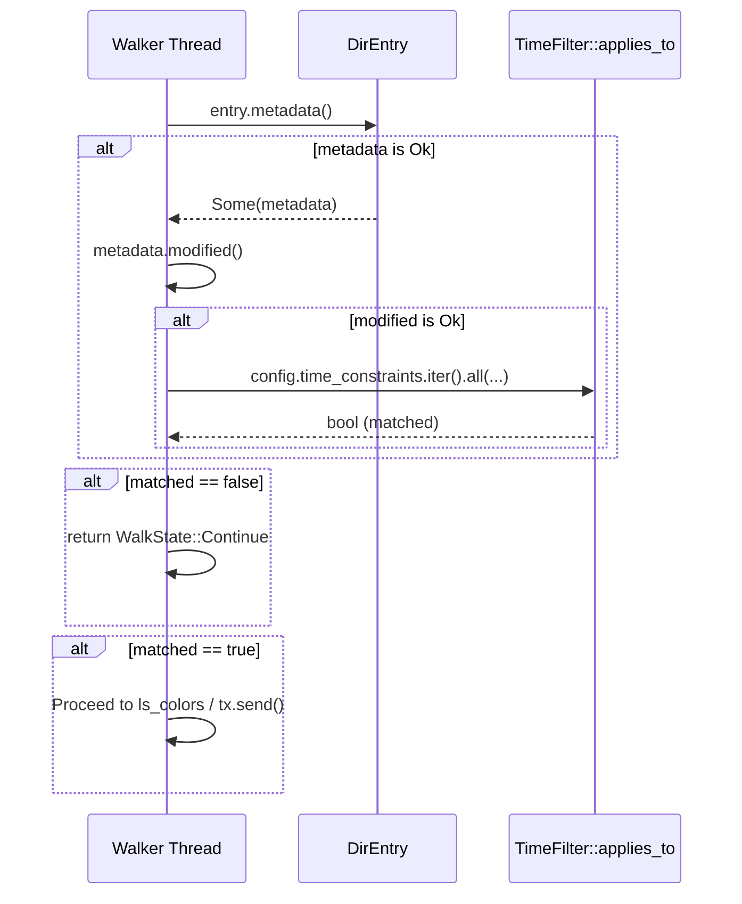

# Time-Based Filtering

Relevant source files

The following files were used as context for generating this wiki page:

- [src/main.rs](https://github.com/sharkdp/fd/blob/main/src/main.rs)
- [src/cli.rs](https://github.com/sharkdp/fd/blob/main/src/cli.rs)
- [README.md](https://github.com/sharkdp/fd/blob/main/README.md)
- [src/walk.rs](https://github.com/sharkdp/fd/blob/main/src/walk.rs)
- [src/filter/size.rs](https://github.com/sharkdp/fd/blob/main/src/filter/size.rs)
- [src/filter/time.rs](https://github.com/sharkdp/fd/blob/main/src/filter/time.rs)
- [Cargo.toml](https://github.com/sharkdp/fd/blob/main/Cargo.toml)
- [src/fmt/mod.rs](https://github.com/sharkdp/fd/blob/main/src/fmt/mod.rs)
- [src/filter/owner.rs](https://github.com/sharkdp/fd/blob/main/src/filter/owner.rs)
- [src/filter/mod.rs](https://github.com/sharkdp/fd/blob/main/src/filter/mod.rs)
- [src/config.rs](https://github.com/sharkdp/fd/blob/main/src/config.rs)
- [doc/screencast.sh](https://github.com/sharkdp/fd/blob/main/doc/screencast.sh)
- [src/filetypes.rs](https://github.com/sharkdp/fd/blob/main/src/filetypes.rs)
- [CONTRIBUTING.md](https://github.com/sharkdp/fd/blob/main/CONTRIBUTING.md)
- [doc/sponsors.md](https://github.com/sharkdp/fd/blob/main/doc/sponsors.md)

## Overview

Time-based filtering enables `fd` to restrict filesystem searches by file modification time, empowering users to locate files modified within relative durations or specific absolute timestamps. By processing flags such as `--changed-within` and `--changed-before`, the engine evaluates file metadata against structured time constraints during parallel directory traversal. Sources: [src/main.rs:496-519](https://github.com/sharkdp/fd/blob/main/src/main.rs#L496-L519), [src/filter/time.rs:1-63](https://github.com/sharkdp/fd/blob/main/src/filter/time.rs#L1-L63), [src/walk.rs:577-591](https://github.com/sharkdp/fd/blob/main/src/walk.rs#L577-L591)

## CLI Parsing of Time Filter Options

### Overview

Command-line options governing file modification time constraints are parsed via `clap` inside `src/cli.rs` and subsequently mapped into internal filter representations inside `src/main.rs`. When `fd` initializes configuration parameters, command-line flags are inspected to generate structured time bounds. Sources: [src/main.rs:248-267](https://github.com/sharkdp/fd/blob/main/src/main.rs#L248-L267), [src/cli.rs:419-458](https://github.com/sharkdp/fd/blob/main/src/cli.rs#L419-L458)

### Call-Chain Execution Walkthrough

The extraction of time filter constraints executes through the following call chain:

1. `construct_config` — Invoked during `run()` in `src/main.rs`, this function initializes the global search `Config` and triggers time constraint extraction by calling `extract_time_constraints(&opts)` at line 267. Sources: [src/main.rs:248-267](https://github.com/sharkdp/fd/blob/main/src/main.rs#L248-L267)
2. `extract_time_constraints` — Iterates over `opts.changed_within` and `opts.changed_before`, dispatching string slices to `TimeFilter::after` and `TimeFilter::before` respectively, returning an `anyhow::Result<Vec<TimeFilter>>`. Sources: [src/main.rs:496-519](https://github.com/sharkdp/fd/blob/main/src/main.rs#L496-L519)
3. `after` (or `before`) — Located in `src/filter/time.rs`, these methods delegate string parsing to `TimeFilter::from_str(s)` and wrap the resulting `SystemTime` in a `TimeFilter::After` or `TimeFilter::Before` variant. Sources: [src/filter/time.rs:49-55](https://github.com/sharkdp/fd/blob/main/src/filter/time.rs#L49-L55)
4. `from_str` — Parses the input string via `jiff` spans, timestamps, or date-times, or falls back to UNIX epoch offsets, handing back an `Option<SystemTime>` to complete the instantiation. Sources: [src/filter/time.rs:29-47](https://github.com/sharkdp/fd/blob/main/src/filter/time.rs#L29-L47)

Sources: [src/main.rs:248-267](https://github.com/sharkdp/fd/blob/main/src/main.rs#L248-L267), [src/main.rs:496-519](https://github.com/sharkdp/fd/blob/main/src/main.rs#L496-L519), [src/filter/time.rs:29-55](https://github.com/sharkdp/fd/blob/main/src/filter/time.rs#L29-L55)

> [!NOTE]
> If either `changed_within` or `changed_before` fails to parse into a valid date or duration, `extract_time_constraints` immediately returns an `anyhow::Error` stating that the string is not a valid date or duration. Sources: [src/main.rs:496-519](https://github.com/sharkdp/fd/blob/main/src/main.rs#L496-L519)

### CLI Argument Options Reference

The command-line flags exposed in `src/cli.rs` accept dates or durations and support multiple aliases.

| Flag / Option | Aliases | Value Name | Purpose |
| :--- | :--- | :--- | :--- |
| `--changed-within` | `--change-newer-than`, `--newer`, `--changed-after` | `date\|dur` | Filter by file modification time (newer than argument) |
| `--changed-before` | `--change-older-than`, `--older` | `date\|dur` | Filter by file modification time (older than argument) |

Sources: [src/cli.rs:430-458](https://github.com/sharkdp/fd/blob/main/src/cli.rs#L430-L458)

## TimeFilter Structure and Timestamp Parsing

### Overview

The `TimeFilter` enum serves as the internal representation for time-based search boundaries in `fd`. It encapsulates upper and lower time limits as standard `SystemTime` values. String parsing logic converts relative durations, ISO timestamps, calendar date-times, and UNIX epoch offsets into concrete timestamps relative to either current system time or the epoch. Sources: [src/filter/time.rs:5-10](https://github.com/sharkdp/fd/blob/main/src/filter/time.rs#L5-L10), [src/filter/time.rs:28-47](https://github.com/sharkdp/fd/blob/main/src/filter/time.rs#L28-L47)

### Call-Chain Execution Walkthrough

Parsing an arbitrary filter string into a concrete timestamp boundary executes through a prioritized cascading match sequence inside `TimeFilter::from_str`:

1. `from_str` — Receives a string slice `s` and attempts four consecutive parsing strategies in order, returning `None` if all strategies fail. Sources: [src/filter/time.rs:29-47](https://github.com/sharkdp/fd/blob/main/src/filter/time.rs#L29-L47)
2. Span Parsing (`s.parse::()`) — Evaluates relative durations (e.g., `1min`, `30sec`). If successful, `now().checked_sub(span)` subtracts the duration from the current system time (or test time override) to establish an absolute `Zoned` datetime, which converts into `SystemTime`. Sources: [src/filter/time.rs:30-32](https://github.com/sharkdp/fd/blob/main/src/filter/time.rs#L30-L32)
3. Timestamp Parsing (`s.parse::<Timestamp>()`) — Evaluates absolute RFC-3339 or ISO-8601 timestamps (e.g., `2010-10-10T10:10:10+00:00`). If successful, the `Timestamp` converts directly into `SystemTime`. Sources: [src/filter/time.rs:33-34](https://github.com/sharkdp/fd/blob/main/src/filter/time.rs#L33-L34)
4. Calendar Date-Time Parsing (`s.parse::<DateTime>()`) — Evaluates partial or full calendar dates (e.g., `2010-10-10 10:10:10` or `2010-10-10`). If successful, `TimeZone::system().to_ambiguous_zoned(datetime).later()` maps the naive date into a zoned timestamp, choosing the later interpretation during ambiguous daylight saving transitions before converting to `SystemTime`. Sources: [src/filter/time.rs:35-42](https://github.com/sharkdp/fd/blob/main/src/filter/time.rs#L35-L42)
5. Epoch Seconds Parsing (`s.strip_prefix('@')?`) — Falls back to integer seconds prefixed by `@` (e.g., `@1707723412`), adding the parsed seconds duration to `UNIX_EPOCH`. Sources: [src/filter/time.rs:43-46](https://github.com/sharkdp/fd/blob/main/src/filter/time.rs#L43-L46)

Sources: [src/filter/time.rs:28-55](https://github.com/sharkdp/fd/blob/main/src/filter/time.rs#L28-L55)

> [!WARNING]
> Absolute integer timestamps are strictly ignored unless prefixed with the `@` character. Passing a raw integer string without `@` fails all initial parser branches and returns `None`. Sources: [src/filter/time.rs:43-46](https://github.com/sharkdp/fd/blob/main/src/filter/time.rs#L43-L46), [src/filter/time.rs:179-180](https://github.com/sharkdp/fd/blob/main/src/filter/time.rs#L179-L180)

### TimeFilter Variants and Evaluation

The `TimeFilter` enum defines two variants representing upper and lower temporal bounds. The `applies_to` method checks whether a given file modification `SystemTime` satisfies the constraint.

| Variant | Internal Data | Matching Condition | Purpose |
| :--- | :--- | :--- | :--- |
| `TimeFilter::Before` | `SystemTime` | `t < limit` | Matches files modified earlier than the limit (older than) |
| `TimeFilter::After` | `SystemTime` | `t > limit` | Matches files modified later than the limit (newer than) |

Sources: [src/filter/time.rs:5-10](https://github.com/sharkdp/fd/blob/main/src/filter/time.rs#L5-L10), [src/filter/time.rs:57-62](https://github.com/sharkdp/fd/blob/main/src/filter/time.rs#L57-L62)

> [!NOTE]
> When parsing ambiguous calendar datetimes during local clock transitions, the parser explicitly calls `.later()` on the ambiguous zoned conversion to resolve duplicate local hours to the second occurrence. Sources: [src/filter/time.rs:35-42](https://github.com/sharkdp/fd/blob/main/src/filter/time.rs#L35-L42)

### Design Trade-Offs in Parsing Architecture

| Design Choice | Benefit | Cost |
| :--- | :--- | :--- |
| Cascading `parse` attempts over disjoint types (`Span`, `Timestamp`, `DateTime`, `@secs`) | Supports flexible human-readable inputs ranging from relative durations to absolute calendar dates under a single entry point | Sequential fallback checks introduce minor redundant parsing overhead per strategy failure |
| Thread-local `TESTTIME` override cell in test configurations | Enables deterministic unit testing of relative time filters without depending on wall-clock drift | Requires conditional compilation guards (`#[cfg(test)]`) and thread-local borrow checks in `now()` |
| Storage of `SystemTime` inside enum variants rather than string slices | Decouples filter evaluation from string parsing, ensuring fast comparisons during directory traversal | Loses the original format representation after initial construction |

Sources: [src/filter/time.rs:12-27](https://github.com/sharkdp/fd/blob/main/src/filter/time.rs#L12-L27), [src/filter/time.rs:28-47](https://github.com/sharkdp/fd/blob/main/src/filter/time.rs#L28-L47), [src/filter/time.rs:57-62](https://github.com/sharkdp/fd/blob/main/src/filter/time.rs#L57-L62)

## Configuration Storage for Time Constraints

### Overview

Constructed `TimeFilter` instances are housed inside the global search configuration via the `Config` struct. During option processing, command-line arguments are validated and converted into concrete filter vectors that dictate how file traversal worker threads filter candidates. Sources: [src/config.rs:109-111](https://github.com/sharkdp/fd/blob/main/src/config.rs#L109-L111), [src/main.rs:267-267](https://github.com/sharkdp/fd/blob/main/src/main.rs#L267-L267), [src/main.rs:496-519](https://github.com/sharkdp/fd/blob/main/src/main.rs#L496-L519)

### Configuration Pipeline and Extraction Flow

The configuration construction follows an explicit call chain where options are converted, validated, and embedded into the primary configuration object passed down to the scanning engine.

Sources: [src/main.rs:102-102](https://github.com/sharkdp/fd/blob/main/src/main.rs#L102-L102), [src/main.rs:267-267](https://github.com/sharkdp/fd/blob/main/src/main.rs#L267-L267), [src/main.rs:496-519](https://github.com/sharkdp/fd/blob/main/src/main.rs#L496-L519)

### Config Field Definition

The `Config` struct stores the extracted time filters alongside other search parameters in a `Vec<TimeFilter>`.

| Field Name | Type | Purpose |
| :--- | :--- | :--- |
| `time_constraints` | `Vec<TimeFilter>` | Holds upper and lower modification time bounds populated from `--changed-within` and `--changed-before` flags |

Sources: [src/config.rs:109-111](https://github.com/sharkdp/fd/blob/main/src/config.rs#L109-L111)

> [!WARNING]
> If `extract_time_constraints` encounters an unparseable string inside `opts.changed_within` or `opts.changed_before`, it immediately halts execution and returns an error message `'{}' is not a valid date or duration. See 'fd --help'.`. Sources: [src/main.rs:498-506](https://github.com/sharkdp/fd/blob/main/src/main.rs#L498-L506), [src/main.rs:508-516](https://github.com/sharkdp/fd/blob/main/src/main.rs#L508-L516)

## Evaluating Time Filters During Directory Traversal

### Overview

During parallel directory traversal, filesystem worker threads inspect each discovered path to verify whether its modification timestamp complies with active search parameters. Time filters operate as part of a multi-stage filtering pipeline executed inside the parallel walker closure. Sources: [src/walk.rs:577-591](https://github.com/sharkdp/fd/blob/main/src/walk.rs#L577-L591)

### Execution Walkthrough of Time Evaluation

When the parallel walker evaluates a candidate entry, the worker thread executes a precise sequence of checks before emitting or discarding the entry.

Sources: [src/walk.rs:578-591](https://github.com/sharkdp/fd/blob/main/src/walk.rs#L578-L591)

The evaluation process follows this explicit call chain:
1. `WorkerState::spawn_senders()` closure intercepts each discovered entry. Sources: [src/walk.rs:444-459](https://github.com/sharkdp/fd/blob/main/src/walk.rs#L444-L459)
2. The engine verifies if `!config.time_constraints.is_empty()`. Sources: [src/walk.rs:578-578](https://github.com/sharkdp/fd/blob/main/src/walk.rs#L578-L578)
3. It requests file metadata via `entry.metadata()`. Sources: [src/walk.rs:580-580](https://github.com/sharkdp/fd/blob/main/src/walk.rs#L580-L580)
4. It extracts the modification time via `metadata.modified()`. Sources: [src/walk.rs:581-581](https://github.com/sharkdp/fd/blob/main/src/walk.rs#L581-L581)
5. It iterates over all constraints using `config.time_constraints.iter().all(|tf| tf.applies_to(&modified))`. Sources: [src/walk.rs:583-586](https://github.com/sharkdp/fd/blob/main/src/walk.rs#L583-L586)
6. If the predicate evaluates to `false`, the thread aborts further processing for that entry and returns `WalkState::Continue`. Sources: [src/walk.rs:588-590](https://github.com/sharkdp/fd/blob/main/src/walk.rs#L588-L590)

### Time Filter Evaluation Rules

The `TimeFilter::applies_to` method checks the file's modification time (`t`) against the bound limit stored inside the enum variant.

| Variant | Condition | Meaning |
| :--- | :--- | :--- |
| `TimeFilter::Before(limit)` | `t < limit` | File was modified before the specified limit |
| `TimeFilter::After(limit)` | `t > limit` | File was modified after the specified limit |

Sources: [src/filter/time.rs:57-62](https://github.com/sharkdp/fd/blob/main/src/filter/time.rs#L57-L62)

> [!WARNING]
> If retrieving file metadata fails or calling `metadata.modified()` returns an I/O error, the worker treats the time constraint match as failed (`matched = false`), causing the entry to be skipped immediately via `WalkState::Continue`. Sources: [src/walk.rs:580-590](https://github.com/sharkdp/fd/blob/main/src/walk.rs#L580-L590)

## Filter Module Organization and Composition

### Overview

The `filter` module aggregates independent search constraints, exposing `TimeFilter`, `SizeFilter`, `OwnerFilter`, and `FileTypes` to govern path acceptance during directory traversal. Sources: [src/filter/mod.rs:1-12](https://github.com/sharkdp/fd/blob/main/src/filter/mod.rs#L1-L12)

### Filter Predicate Composition

Each filter component implements distinct parsing routines and validation predicates that operate on filesystem metadata or directory entries. Sources: [src/filter/size.rs:68-74](https://github.com/sharkdp/fd/blob/main/src/filter/size.rs#L68-L74), [src/filter/owner.rs:69-73](https://github.com/sharkdp/fd/blob/main/src/filter/owner.rs#L69-L73), [src/filetypes.rs:21-42](https://github.com/sharkdp/fd/blob/main/src/filetypes.rs#L21-L42)

| Filter Module | Struct / Enum Name | Core Predicate Method | Target Metadata Field |
| :--- | :--- | :--- | :--- |
| `time` | `TimeFilter` | `applies_to(&self, t: &SystemTime) -> bool` | `Metadata::modified()` |
| `size` | `SizeFilter` | `is_within(&self, size: u64) -> bool` | `Metadata::len()` |
| `owner` | `OwnerFilter` | `matches(&self, md: &fs::Metadata) -> bool` | `MetadataExt::uid()`, `MetadataExt::gid()` |
| `filetypes` | `FileTypes` | `should_ignore(&self, entry: &DirEntry) -> bool` | `DirEntry::file_type()`, Path extensions |

Sources: [src/filter/size.rs:68-74](https://github.com/sharkdp/fd/blob/main/src/filter/size.rs#L68-L74), [src/filter/owner.rs:69-73](https://github.com/sharkdp/fd/blob/main/src/filter/owner.rs#L69-L73), [src/filetypes.rs:21-42](https://github.com/sharkdp/fd/blob/main/src/filetypes.rs#L21-L42)

> [!NOTE]
> Under Unix-like targets, `OwnerFilter` is conditionally compiled into the filter module via `#[cfg(unix)]`, utilizing the `nix` crate to resolve user and group identifiers from names or numeric UIDs and GIDs. Sources: [src/filter/mod.rs:4-6](https://github.com/sharkdp/fd/blob/main/src/filter/mod.rs#L4-L6), [src/filter/owner.rs:2-3](https://github.com/sharkdp/fd/blob/main/src/filter/owner.rs#L2-L3)

### Size and Owner Parsing Mechanics

`SizeFilter` parses constraints via regular expressions matching quantity and SI or binary multipliers (e.g., `k`, `ki`, `m`, `mib`), supporting minimum, maximum, and exact equality limits. Sources: [src/filter/size.rs:33-66](https://github.com/sharkdp/fd/blob/main/src/filter/size.rs#L33-L66) `OwnerFilter` splits input strings on colons (`user:group`), supporting equality checks, negation (`!`), and omission for either UID or GID checks. Sources: [src/filter/owner.rs:27-58](https://github.com/sharkdp/fd/blob/main/src/filter/owner.rs#L27-L58)

## Related

- [[File Size Filtering]]
- [[Owner & Group Filtering]]

