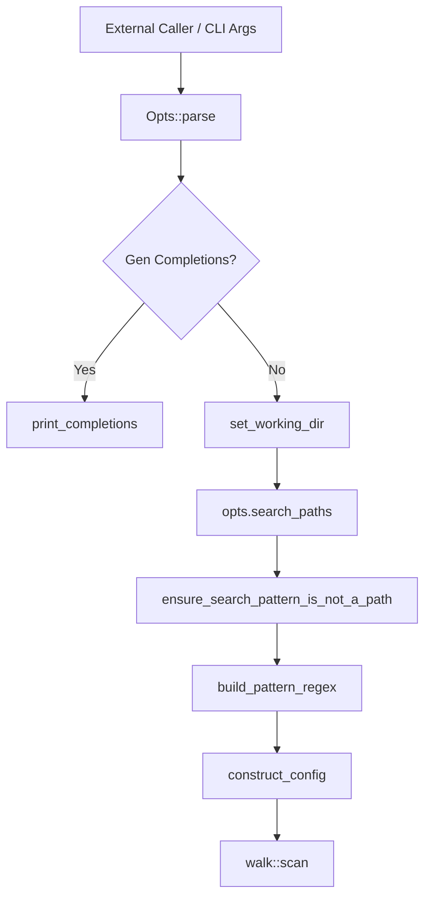

# Tool Integrations

Relevant source files

The following files were used as context for generating this wiki page:

- [src/main.rs](https://github.com/sharkdp/fd/blob/main/src/main.rs)
- [README.md](https://github.com/sharkdp/fd/blob/main/README.md)
- [src/cli.rs](https://github.com/sharkdp/fd/blob/main/src/cli.rs)
- [Cargo.toml](https://github.com/sharkdp/fd/blob/main/Cargo.toml)
- [CONTRIBUTING.md](https://github.com/sharkdp/fd/blob/main/CONTRIBUTING.md)
- [scripts/create-deb.sh](https://github.com/sharkdp/fd/blob/main/scripts/create-deb.sh)
- [src/fmt/mod.rs](https://github.com/sharkdp/fd/blob/main/src/fmt/mod.rs)
- [contrib/completion/fdfind.bash](https://github.com/sharkdp/fd/blob/main/contrib/completion/fdfind.bash)
- [doc/sponsors.md](https://github.com/sharkdp/fd/blob/main/doc/sponsors.md)
- [doc/screencast.sh](https://github.com/sharkdp/fd/blob/main/doc/screencast.sh)
- [src/config.rs](https://github.com/sharkdp/fd/blob/main/src/config.rs)
- [doc/release-checklist.md](https://github.com/sharkdp/fd/blob/main/doc/release-checklist.md)
- [SECURITY.md](https://github.com/sharkdp/fd/blob/main/SECURITY.md)

## Overview

Tool Integrations bridge `fd` with external command-line utilities, shell environments, script pipelines, and package ecosystems, enabling seamless interoperability across platforms. By establishing structured interfaces for argument parsing, execution options, output formatting, shell completion, and deployment context, these integrations allow external callers and automated workflows to invoke filesystem searches reliably. Sources: [src/cli.rs:21-31](https://github.com/sharkdp/fd/blob/main/src/cli.rs#L21-L31), [src/config.rs:13-136](https://github.com/sharkdp/fd/blob/main/src/config.rs#L13-L136)

This component solves the challenges of inconsistent flag propagation, rigid output parsing, and manual shell setup by providing standardized configuration structures, placeholder tokens, and autocomplete mechanisms. These capabilities ensure that downstream tools, menus, and editors receive precisely formatted data without manual intervention or pipeline breakage. Sources: [src/main.rs:75-112](https://github.com/sharkdp/fd/blob/main/src/main.rs#L75-L112), [src/fmt/mod.rs:17-49](https://github.com/sharkdp/fd/blob/main/src/fmt/mod.rs#L17-L49), [src/config.rs:13-136](https://github.com/sharkdp/fd/blob/main/src/config.rs#L13-L136)

## CLI Options and Argument Integration

### Overview

Command-line argument parsing and flag propagation in `fd` are built around the `clap` derive macro framework, anchoring the CLI interface in `src/cli.rs` and the execution pipeline in `src/main.rs`. External callers and wrapper scripts interact with `fd` by passing positional paths, search patterns, and filter flags that `Opts` parses and translates into domain-specific structures. Sources: [src/main.rs:75-112](https://github.com/sharkdp/fd/blob/main/src/main.rs#L75-L112), [src/cli.rs:21-31](https://github.com/sharkdp/fd/blob/main/src/cli.rs#L21-L31)

Sources: [src/main.rs:75-112](https://github.com/sharkdp/fd/blob/main/src/main.rs#L75-L112), [src/cli.rs:21-31](https://github.com/sharkdp/fd/blob/main/src/cli.rs#L21-L31)

### Call-Chain Execution Walkthrough

When an external caller invokes `fd`, the command execution flows through a strict sequence of validation, parsing, and propagation steps in `src/main.rs`:

1. `main()` calls `run()` to initiate execution, catching any returned `ExitCode` or printing formatted errors via `crate::error::print_error()`. Sources: [src/main.rs:62-73](https://github.com/sharkdp/fd/blob/main/src/main.rs#L62-L73)
2. `run()` parses command-line arguments via `Opts::parse()` into the strongly-typed `Opts` struct. Sources: [src/main.rs:75-76](https://github.com/sharkdp/fd/blob/main/src/main.rs#L75-L76)
3. If the compilation feature is enabled, `opts.gen_completions()?` checks for shell completion generation and hands control to `print_completions(shell)` if requested. Sources: [src/main.rs:78-81](https://github.com/sharkdp/fd/blob/main/src/main.rs#L78-L81)
4. `set_working_dir(&opts)?` evaluates the `--base-directory` option, validating that the target is an existing directory via `filesystem::is_existing_directory()` before shifting the process working directory with `env::set_current_dir()`. Sources: [src/main.rs:83|131-147](https://github.com/sharkdp/fd/blob/main/src/main.rs#L83|L131-L147)
5. `opts.search_paths()?` resolves root search paths or defaults to `./`, validating their existence. Sources: [src/main.rs:84-87](https://github.com/sharkdp/fd/blob/main/src/main.rs#L84-L87), [src/cli.rs:696-721](https://github.com/sharkdp/fd/blob/main/src/cli.rs#L696-L721)
6. `ensure_search_pattern_is_not_a_path(&opts)?` intercepts accidental path strings passed as regular expressions, inspecting both the primary pattern and `--and` expressions. Sources: [src/main.rs:89|169-181](https://github.com/sharkdp/fd/blob/main/src/main.rs#L89|L169-L181)
7. `build_pattern_regex()` converts individual search strings according to CLI flags (`--glob`, `--exact`, `--fixed-strings`). Sources: [src/main.rs:94-100|218-232](https://github.com/sharkdp/fd/blob/main/src/main.rs#L94-L100|L218-L232)
8. `construct_config(opts, &pattern_regexps)?` consumes the options and regular expressions to assemble the consolidated `Config` struct. Sources: [src/main.rs:102|248-393](https://github.com/sharkdp/fd/blob/main/src/main.rs#L102|L248-L393)
9. `ensure_use_hidden_option_for_leading_dot_pattern()` verifies that dot-matching patterns are not run under default hidden-file filtering rules. Sources: [src/main.rs:104|521-539](https://github.com/sharkdp/fd/blob/main/src/main.rs#L104|L521-L539)
10. `build_regex()` compiles the byte-level regular expressions with case sensitivity and newline settings. Sources: [src/main.rs:106-109|541-555](https://github.com/sharkdp/fd/blob/main/src/main.rs#L106-L109|L541-L555)
11. `walk::scan()` receives the validated search paths, compiled regexes, and configuration to execute the traversal. Sources: [src/main.rs:111](https://github.com/sharkdp/fd/blob/main/src/main.rs#L111)

> [!WARNING]
> When passing regular expression patterns that begin with a dash (`-`), external callers must supply `--` prior to the pattern (e.g., `fd -- -foo`), otherwise `clap` interprets the pattern as an unrecognized command-line flag. Sources: [src/cli.rs:630-632](https://github.com/sharkdp/fd/blob/main/src/cli.rs#L630-L632)

Sources: [src/main.rs:75-112](https://github.com/sharkdp/fd/blob/main/src/main.rs#L75-L112), [src/cli.rs:630-632](https://github.com/sharkdp/fd/blob/main/src/cli.rs#L630-L632)

### Option Parsing and Command-Line Flags

The CLI interface configures mutually exclusive argument groups and option overrides to prevent invalid flag combinations and simplify wrapper integration.

| Option Flag | Short Flag | Type / Value Name | Purpose and Conflicting Rules |
| :--- | :--- | :--- | :--- |
| `--hidden` | `-h` (note: overridden by short `-H`) | `bool` | Search hidden files and directories; skipped by default. Sources: [src/cli.rs:39-45](https://github.com/sharkdp/fd/blob/main/src/cli.rs#L39-L45) |
| `--no-ignore` | `-I` | `bool` | Do not respect `.gitignore`, `.ignore`, or `.fdignore` files. Sources: [src/cli.rs:54-60](https://github.com/sharkdp/fd/blob/main/src/cli.rs#L54-L60) |
| `--unrestricted` | `-u` | `u8` (Count) | Unrestricted search, alias for `--no-ignore --hidden`. Sources: [src/cli.rs:124-128](https://github.com/sharkdp/fd/blob/main/src/cli.rs#L124-L128) |
| `--case-sensitive` | `-s` | `bool` | Perform a case-sensitive search; overrides `--ignore-case`. Sources: [src/cli.rs:131-139](https://github.com/sharkdp/fd/blob/main/src/cli.rs#L131-L139) |
| `--glob` | `-g` | `bool` | Glob-based search; conflicts with `--fixed-strings`. Sources: [src/cli.rs:154-161](https://github.com/sharkdp/fd/blob/main/src/cli.rs#L154-L161) |
| `--fixed-strings` | `-F` | `bool` | Treat pattern as literal string; alias `--literal`. Sources: [src/cli.rs:177-185](https://github.com/sharkdp/fd/blob/main/src/cli.rs#L177-L185) |
| `--exact` | None | `bool` | Match entire filename exactly; conflicts with `--glob` and `--fixed-strings`. Sources: [src/cli.rs:187-198](https://github.com/sharkdp/fd/blob/main/src/cli.rs#L187-L198) |
| `--and` | None | `Vec<String>` | Additional search patterns that need to be matched. Sources: [src/cli.rs:203-211](https://github.com/sharkdp/fd/blob/main/src/cli.rs#L203-L211) |
| `--absolute-path` | `-a` | `bool` | Show absolute instead of relative paths. Sources: [src/cli.rs:215-221](https://github.com/sharkdp/fd/blob/main/src/cli.rs#L215-L221) |
| `--list-details` | `-l` | `bool` | Detailed listing format like `ls -l`; conflicts with `--absolute-path`. Sources: [src/cli.rs:231-238](https://github.com/sharkdp/fd/blob/main/src/cli.rs#L231-L238) |
| `--follow` | `-L` | `bool` | Follow symbolic links; alias `--dereference`. Sources: [src/cli.rs:240-249](https://github.com/sharkdp/fd/blob/main/src/cli.rs#L240-L249) |
| `--full-path` | `-p` | `bool` | Match pattern against full absolute path. Sources: [src/cli.rs:257-264](https://github.com/sharkdp/fd/blob/main/src/cli.rs#L257-L264) |
| `--print0` | `-0` | `bool` | Separate search results by null character; conflicts with `--list-details`. Sources: [src/cli.rs:268-276](https://github.com/sharkdp/fd/blob/main/src/cli.rs#L268-L276) |
| `--type` | `-t` | `Option<Vec<FileType>>` | Filter by file type (`file`, `directory`, `symlink`, `executable`, `empty`, `socket`, `pipe`, `char-device`, `block-device`). Sources: [src/cli.rs:367-378](https://github.com/sharkdp/fd/blob/main/src/cli.rs#L367-L378), [src/cli.rs:802-823](https://github.com/sharkdp/fd/blob/main/src/cli.rs#L802-L823) |
| `--exec` | `-x` | `CommandSet` | Execute command for each result in parallel. Sources: [src/cli.rs:883-920](https://github.com/sharkdp/fd/blob/main/src/cli.rs#L883-L920) |
| `--exec-batch` | `-X` | `CommandSet` | Execute command with all search results at once. Sources: [src/cli.rs:921-951](https://github.com/sharkdp/fd/blob/main/src/cli.rs#L921-L951) |

Sources: [src/cli.rs:21-951](https://github.com/sharkdp/fd/blob/main/src/cli.rs#L21-L951)

### Design Trade-Offs in Argument Architecture

| Design Choice | Benefit | Cost |
| :--- | :--- | :--- |
| Custom `clap::FromArgMatches` implementation for `Exec` | Enables hand-rolled parsing of complex trailing command templates and multi-argument aggregations without standard derive limitations. | Requires manual maintenance of argument augmentations and error mapping within `Exec`. Sources: [src/cli.rs:855-880](https://github.com/sharkdp/fd/blob/main/src/cli.rs#L855-L880) |
| Smart case sensitivity default | Automatically switches to case-sensitive searching if any search pattern contains uppercase characters, reducing user friction. | Can occasionally surprise users mixing lowercase patterns with mixed-case filenames unless explicitly overridden with `-i` or `-s`. Sources: [src/main.rs:249-255](https://github.com/sharkdp/fd/blob/main/src/main.rs#L249-L255) |
| Path-separator length restriction checks | Prevents multi-byte path separator configurations on Windows shells where `/` might be improperly expanded. | Introduces platform-specific validation logic during configuration construction. Sources: [src/main.rs:234-246](https://github.com/sharkdp/fd/blob/main/src/main.rs#L234-L246) |

Sources: [src/cli.rs:855-880](https://github.com/sharkdp/fd/blob/main/src/cli.rs#L855-L880), [src/main.rs:234-255](https://github.com/sharkdp/fd/blob/main/src/main.rs#L234-L255)

## Runtime Configuration and Execution Options

### Overview

The execution pipeline transitions from raw command-line parsing to a validated runtime environment via the central `run()` function. This routine resolves search paths, builds pattern expressions, and constructs the comprehensive `Config` structure that dictates directory traversal and search behavior. Sources: [src/main.rs:75-112](https://github.com/sharkdp/fd/blob/main/src/main.rs#L75-L112)

### Execution Pipeline Walkthrough

The core initialization lifecycle follows a strict sequence of validations and transformations before handing off control to the traversal engine:

1. `Opts::parse()` — Parses command-line arguments using `clap`. Sources: [src/main.rs:76](https://github.com/sharkdp/fd/blob/main/src/main.rs#L76-L76)
2. `set_working_dir(&opts)` — Validates and changes the working directory if `--base-directory` is provided. Sources: [src/main.rs:83](https://github.com/sharkdp/fd/blob/main/src/main.rs#L83-L83), [src/main.rs:131-147](https://github.com/sharkdp/fd/blob/main/src/main.rs#L131-L147)
3. `opts.search_paths()` — Retrieves and validates target search directories, failing if empty. Sources: [src/main.rs:84-87](https://github.com/sharkdp/fd/blob/main/src/main.rs#L84-L87)
4. `ensure_search_pattern_is_not_a_path(&opts)` — Detects accidental path inputs in search patterns and emits diagnostic guidance. Sources: [src/main.rs:89](https://github.com/sharkdp/fd/blob/main/src/main.rs#L89-L89), [src/main.rs:169-181](https://github.com/sharkdp/fd/blob/main/src/main.rs#L169-L181)
5. `build_pattern_regex()` — Transforms glob, exact, fixed-string, or regex patterns into normalized string representations. Sources: [src/main.rs:94-100](https://github.com/sharkdp/fd/blob/main/src/main.rs#L94-L100), [src/main.rs:218-232](https://github.com/sharkdp/fd/blob/main/src/main.rs#L218-L232)
6. `construct_config(opts, &pattern_regexps)` — Resolves environment variables, color rules, time limits, and ignore rules into a unified `Config`. Sources: [src/main.rs:102](https://github.com/sharkdp/fd/blob/main/src/main.rs#L102-L102), [src/main.rs:248-393](https://github.com/sharkdp/fd/blob/main/src/main.rs#L248-L393)
7. `build_regex()` — Compiles final byte-level regular expressions with case sensitivity and newline dot settings enabled. Sources: [src/main.rs:106-110](https://github.com/sharkdp/fd/blob/main/src/main.rs#L106-L110), [src/main.rs:541-555](https://github.com/sharkdp/fd/blob/main/src/main.rs#L541-L555)
8. `walk::scan(&search_paths, regexps, config)` — Dispatches the concurrent directory traversal scanner. Sources: [src/main.rs:111](https://github.com/sharkdp/fd/blob/main/src/main.rs#L111-L111)

Sources: [src/main.rs:75-112](https://github.com/sharkdp/fd/blob/main/src/main.rs#L75-L112)

> [!WARNING]
> If a pattern contains a path separator without `--full-path` enabled, `ensure_search_pattern_is_not_a_path` triggers an immediate error rather than returning zero results. On Windows, `\` is checked against existing directory paths via a filesystem stat call only when forward slashes are absent. Sources: [src/main.rs:169-216](https://github.com/sharkdp/fd/blob/main/src/main.rs#L169-L216)

### Configuration Structure Fields

The `Config` struct consolidates all execution flags, filters, and behavioral parameters governing matching and output emission.

| Field | Type | Purpose |
| :--- | :--- | :--- |
| `case_sensitive` | `bool` | Controls case sensitivity (respects smart case rules). Sources: [src/config.rs:16](https://github.com/sharkdp/fd/blob/main/src/config.rs#L16-L16) |
| `full_path_base` | `OptionathBuf>` | Cached working directory for absolute path expansion when `--full-path` is active. Sources: [src/config.rs:18-20](https://github.com/sharkdp/fd/blob/main/src/config.rs#L18-L20) |
| `ignore_hidden` | `bool` | Filters out hidden files and directories by default. Sources: [src/config.rs:22-23](https://github.com/sharkdp/fd/blob/main/src/config.rs#L22-L23) |
| `read_fdignore` | `bool` | Respects custom `.fdignore` files. Sources: [src/config.rs:25-26](https://github.com/sharkdp/fd/blob/main/src/config.rs#L25-L26) |
| `read_vcsignore` | `bool` | Respects VCS ignore files such as `.gitignore`. Sources: [src/config.rs:31-32](https://github.com/sharkdp/fd/blob/main/src/config.rs#L31-L32) |
| `follow_links` | `bool` | Determines whether symbolic links are dereferenced during traversal. Sources: [src/config.rs:40-41](https://github.com/sharkdp/fd/blob/main/src/config.rs#L40-L41) |
| `max_depth` | `Option<usize>` | Upper bound on traversal depth. Sources: [src/config.rs:49-53](https://github.com/sharkdp/fd/blob/main/src/config.rs#L49-L53) |
| `min_depth` | `Option<usize>` | Lower bound for reporting matched entries. Sources: [src/config.rs:55-56](https://github.com/sharkdp/fd/blob/main/src/config.rs#L55-L56) |
| `threads` | `usize` | Number of worker threads allocated for directory scanning. Sources: [src/config.rs:61-62](https://github.com/sharkdp/fd/blob/main/src/config.rs#L61-L62) |
| `max_buffer_time` | `Option<Duration>` | Duration to buffer results internally before streaming for sorted console output. Sources: [src/config.rs:68-71](https://github.com/sharkdp/fd/blob/main/src/config.rs#L68-L71) |
| `ls_colors` | `Option<LsColors>` | Colorization rules derived from environment settings or default themes. Sources: [src/config.rs:73-75](https://github.com/sharkdp/fd/blob/main/src/config.rs#L73-L75) |
| `command` | `Option<Arc<CommandSet>>` | Optional command execution set for `--exec` or `--exec-batch`. Sources: [src/config.rs:93-94](https://github.com/sharkdp/fd/blob/main/src/config.rs#L93-L94) |
| `batch_size` | `usize` | Maximum results passed per command batch execution. Sources: [src/config.rs:97-99](https://github.com/sharkdp/fd/blob/main/src/config.rs#L97-L99) |

Sources: [src/config.rs:13-136](https://github.com/sharkdp/fd/blob/main/src/config.rs#L13-L136)

> [!NOTE]
> `Config` provides the helper method `is_printing(&self) -> bool`, which returns `true` when no execution command is attached (`self.command.is_none()`). Sources: [src/config.rs:138-143](https://github.com/sharkdp/fd/blob/main/src/config.rs#L138-L143)

### Runtime Design Trade-Offs

| Design Choice | Benefit | Cost |
| :--- | :--- | :--- |
| Smart case evaluation via pattern inspection | Automatically enables case-sensitive matching if any expression contains an uppercase character, eliminating manual flag toggling for capitalized queries. | Can cause unexpected misses if users combine lowercase search terms with mixed-case identifiers unless explicitly overridden. Sources: [src/main.rs:249-255](https://github.com/sharkdp/fd/blob/main/src/main.rs#L249-L255) |
| Platform-specific `ls` command resolution (`--list-details`) | Dynamically falls back between GNU `ls`, `gls`, and BSD `ls` flags depending on OS capabilities and binary availability. | Adds branching execution overhead and error handling during configuration construction. Sources: [src/main.rs:412-494](https://github.com/sharkdp/fd/blob/main/src/main.rs#L412-L494) |
| Byte-level regular expression compilation | Uses `regex::bytes::Regex` to handle arbitrary non-Unicode byte sequences correctly on Unix filesystems. | Requires explicit handling of byte-oriented patterns and conversions during regex building. Sources: [src/main.rs:26-26](https://github.com/sharkdp/fd/blob/main/src/main.rs#L26-L26), [src/main.rs:541-555](https://github.com/sharkdp/fd/blob/main/src/main.rs#L541-L555) |

Sources: [src/main.rs:26-26](https://github.com/sharkdp/fd/blob/main/src/main.rs#L26-L26), [src/main.rs:249-255](https://github.com/sharkdp/fd/blob/main/src/main.rs#L249-L255), [src/main.rs:412-494](https://github.com/sharkdp/fd/blob/main/src/main.rs#L412-L494), [src/main.rs:541-555](https://github.com/sharkdp/fd/blob/main/src/main.rs#L541-L555)

## Formatting Output for Downstream Parsers

### Overview

The formatting engine parses format templates into discrete token vectors or literal strings using `AhoCorasick` pattern matching, enabling path manipulation and custom delimiter substitution for downstream tools and interactive editors.

Sources: [src/fmt/mod.rs:41-49](https://github.com/sharkdp/fd/blob/main/src/fmt/mod.rs#L41-L49), [src/fmt/mod.rs:58-66](https://github.com/sharkdp/fd/blob/main/src/fmt/mod.rs#L58-L66)

### Format Token Reference

Format strings support literal text alongside specific substitution placeholders. The `Token` enum defines the available variants:

| Token Variant | Pattern String | Description |
| :--- | :--- | :--- |
| `Placeholder` | `{}` | The full matched path string. |
| `Basename` | `{/}` | The file or directory name component only. |
| `Parent` | `{//}` | The parent directory containing the path. |
| `NoExt` | `{.}` | The path with its extension removed. |
| `BasenameNoExt` | `{/.}` | The basename with its extension removed. |
| `Text(String)` | Literal | Unmodified literal text segments. |

Sources: [src/fmt/mod.rs:18-25](https://github.com/sharkdp/fd/blob/main/src/fmt/mod.rs#L18-L25), [src/fmt/mod.rs:27-39](https://github.com/sharkdp/fd/blob/main/src/fmt/mod.rs#L27-L39)

### Template Parsing and Generation Call Chain

When parsing custom format strings, `FormatTemplate::parse` scans input templates through a stateful recognition sequence:

1. `FormatTemplate::parse(fmt)` — Initializes an `AhoCorasick` automaton matching `["{{", "}}", "{}", "{/}", "{//}", "{.}", "{/.}"]`.
2. `placeholders.find(remaining)` — Locates the next token or escape sequence within the format string.
3. `token_from_pattern_id(id)` — Maps pattern integer identifiers (2 through 6) to corresponding `Token` variants (`Placeholder`, `Basename`, `Parent`, `NoExt`, `BasenameNoExt`).
4. `FormatTemplate::generate(path, path_separator)` — Iterates over the resulting tokens, resolves path components via helper functions like `basename`, `dirname`, and `remove_extension`, and applies custom separator substitutions via `replace_separator`.

Sources: [src/fmt/mod.rs:58-107](https://github.com/sharkdp/fd/blob/main/src/fmt/mod.rs#L58-L107), [src/fmt/mod.rs:112-141](https://github.com/sharkdp/fd/blob/main/src/fmt/mod.rs#L112-L141), [src/fmt/mod.rs:201-211](https://github.com/sharkdp/fd/blob/main/src/fmt/mod.rs#L201-L211)

> [!NOTE]
> Escaped braces (`{{` and `}}`) are parsed as literal text components by capturing pattern IDs `0` and `1`, adding preceding text to the buffer, and skipping the secondary brace character.
> Sources: [src/fmt/mod.rs:68-75](https://github.com/sharkdp/fd/blob/main/src/fmt/mod.rs#L68-L75)

### Path Separator Substitution Design

When a custom `path_separator` is supplied (`Some(&str)`), `replace_separator` inspects path components individually to guarantee cross-platform delimiter consistency.

| Component Match | Substitution Behavior |
| :--- | :--- |
| `Component::Prefix(Prefix::UNC(server, share))` | Reconstructs UNC paths as `separator + separator + server + separator + share`. |
| `Component::Prefix(prefix)` | Renders other prefix types (such as Windows drive letters like `C:`) as-is. |
| `Component::RootDir` | Replaces root directory markings entirely with the custom separator string. |
| Other Components (`Normal`, `CurDir`, `ParentDir`) | Appends the component value, appending a trailing separator if additional components follow in the peekable iterator. |

Sources: [src/fmt/mod.rs:147-196](https://github.com/sharkdp/fd/blob/main/src/fmt/mod.rs#L147-L196)

> [!WARNING]
> Verbatim Windows path prefixes beginning with `\\?\` are ignored and passed through unnormalized because they are extremely rare and cannot be reliably mapped by standard component iterators.
> Sources: [src/fmt/mod.rs:161-165](https://github.com/sharkdp/fd/blob/main/src/fmt/mod.rs#L161-L165)

## Shell Completion and Wrapper Scripts

### Overview

Integration with shell environments is handled via wrapper scripts that bridge alternative command names to standard completion definitions. Specifically, the `fdfind.bash` contribution script provides Bash completion support for environments where the binary is named `fdfind` rather than `fd`.

Sources: [contrib/completion/fdfind.bash:1-9](https://github.com/sharkdp/fd/blob/main/contrib/completion/fdfind.bash#L1-L9)

### Bash Version Conditional Completion

The script first loads the primary fd completions from `/usr/share/bash-completion/completions/fd`. It then checks the Bash major and minor version numbers via `BASH_VERSINFO` to register completion bindings with appropriate flags.

| Bash Version Condition | Registration Command |
| :--- | :--- |
| `BASH_VERSINFO[0] == 4` and `BASH_VERSINFO[1] >= 4`, or `BASH_VERSINFO[0] > 4` | `complete -F _fd -o nosort -o bashdefault -o default fdfind` |
| Older Bash versions | `complete -F _fd -o bashdefault -o default fdfind` |

Sources: [contrib/completion/fdfind.bash:1-8](https://github.com/sharkdp/fd/blob/main/contrib/completion/fdfind.bash#L1-L8)

> [!NOTE]
> The `-o nosort` completion option is only appended when running Bash version 4.4 or higher, preserving sort ordering for modern shells while maintaining compatibility with older interpreters.
> Sources: [contrib/completion/fdfind.bash:4-8](https://github.com/sharkdp/fd/blob/main/contrib/completion/fdfind.bash#L4-L8)

## Build Packaging and Environment Context

### Overview

Platform packaging and distribution of `fd` are managed through target-specific deployment scripts, cargo metadata specifications, and staging configurations. The Debian package generation script (`scripts/create-deb.sh`) automates directory staging, architecture mapping, and control file assembly, ensuring the built binary and its assets conform to Debian policy requirements across different target environments.

Sources: [scripts/create-deb.sh:1-38](https://github.com/sharkdp/fd/blob/main/scripts/create-deb.sh#L1-L38)

### Debian Package Generation Workflow

The packaging script executes a sequence of environment validation and asset staging operations before building the final `.deb` archive:

1. `mkdir -p "${DPKG_DIR}"` — Prepares the isolated staging root directory (`${CICD_INTERMEDIATES_DIR:-.}/debian-package/dpkg`).
2. `cargo metadata --no-deps --format-version 1 | jq -r .packages[0].version` — Extracts the authoritative package version directly from `Cargo.toml` if `DPKG_VERSION` is unset.
3. `install -Dm755 "${BIN_PATH}" "${DPKG_DIR}/usr/bin/fd"` — Installs the compiled release binary with execute permissions.
4. `install -Dm644 'doc/fd.1' ...` — Installs and compresses the manual page and changelog using `gzip -n --best`.
5. `fakeroot dpkg-deb --build "${DPKG_DIR}" "${DPKG_PATH}"` — Assembles the finalized Debian archive from the staged directory structure.

Sources: [scripts/create-deb.sh:5-39](https://github.com/sharkdp/fd/blob/main/scripts/create-deb.sh#L5-L39), [scripts/create-deb.sh:42-59](https://github.com/sharkdp/fd/blob/main/scripts/create-deb.sh#L42-L59), [scripts/create-deb.sh:135-135](https://github.com/sharkdp/fd/blob/main/scripts/create-deb.sh#L135-L135)

> [!NOTE]
> When compiling for `musl` targets, the package basename switches from `fd` to `fd-musl` and declares package conflicts with both `fd` and `fd-find` to prevent file collision issues on target filesystems.
> Sources: [scripts/create-deb.sh:13-22](https://github.com/sharkdp/fd/blob/main/scripts/create-deb.sh#L13-L22)

### Target Architecture Mapping

The script maps Rust compilation target triples to standard Debian architecture identifiers during package configuration:

| Rust Target Pattern | Debian Architecture (`DPKG_ARCH`) |
| :--- | :--- |
| `aarch64-*-linux-*` | `arm64` |
| `arm-*-linux-*hf` | `armhf` |
| `i686-*-linux-*` | `i686` |
| `x86_64-*-linux-*` | `amd64` |
| Any other target | `notset` |

Sources: [scripts/create-deb.sh:28-36](https://github.com/sharkdp/fd/blob/main/scripts/create-deb.sh#L28-L36)

> [!WARNING]
> If the `TARGET` environment variable does not match any known Linux triple pattern, `DPKG_ARCH` defaults to `notset`, which will cause `dpkg-deb` to fail during archive generation.
> Sources: [scripts/create-deb.sh:9-11](https://github.com/sharkdp/fd/blob/main/scripts/create-deb.sh#L9-L11), [scripts/create-deb.sh:28-36](https://github.com/sharkdp/fd/blob/main/scripts/create-deb.sh#L28-L36), [scripts/create-deb.sh:135-135](https://github.com/sharkdp/fd/blob/main/scripts/create-deb.sh#L135-L135)

## Related

- [[Quick Start]]
- [[Command Line Interface]]

