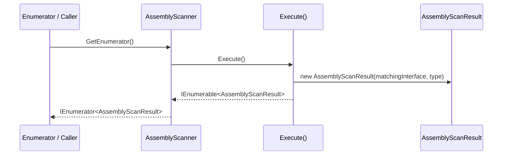
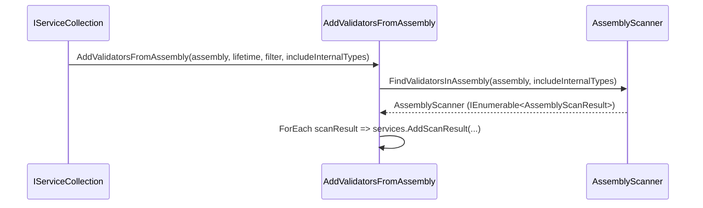

# Assembly Scanning

<details>
<summary>Relevant source files</summary>

The following files were used as context for generating this wiki page:

- [src/FluentValidation/Validators/ChildValidatorAdaptor.cs](https://github.com/FluentValidation/FluentValidation/blob/main/src/FluentValidation/Validators/ChildValidatorAdaptor.cs)
- [src/FluentValidation/TestHelper/ValidatorTestExtensions.cs](https://github.com/FluentValidation/FluentValidation/blob/main/src/FluentValidation/TestHelper/ValidatorTestExtensions.cs)
- [src/FluentValidation.DependencyInjectionExtensions/ServiceCollectionExtensions.cs](https://github.com/FluentValidation/FluentValidation/blob/main/src/FluentValidation.DependencyInjectionExtensions/ServiceCollectionExtensions.cs)
- [src/FluentValidation/Internal/MemberNameValidatorSelector.cs](https://github.com/FluentValidation/FluentValidation/blob/main/src/FluentValidation/Internal/MemberNameValidatorSelector.cs)
- [src/FluentValidation/AssemblyScanner.cs](https://github.com/FluentValidation/FluentValidation/blob/main/src/FluentValidation/AssemblyScanner.cs)
- [src/FluentValidation/ValidatorDescriptor.cs](https://github.com/FluentValidation/FluentValidation/blob/main/src/FluentValidation/ValidatorDescriptor.cs)
- [src/FluentValidation/Internal/RulesetValidatorSelector.cs](https://github.com/FluentValidation/FluentValidation/blob/main/src/FluentValidation/Internal/RulesetValidatorSelector.cs)
- [src/FluentValidation.Tests/AssemblyScannerTester.cs](https://github.com/FluentValidation/FluentValidation/blob/main/src/FluentValidation.Tests/AssemblyScannerTester.cs)
- [src/FluentValidation/ValidatorFactoryBase.cs](https://github.com/FluentValidation/FluentValidation/blob/main/src/FluentValidation/ValidatorFactoryBase.cs)
- [docs/di.md](https://github.com/FluentValidation/FluentValidation/blob/main/docs/di.md)
- [src/FluentValidation/Validators/EnumValidator.cs](https://github.com/FluentValidation/FluentValidation/blob/main/src/FluentValidation/Validators/EnumValidator.cs)
- [src/FluentValidation/DefaultValidatorExtensions.cs](https://github.com/FluentValidation/FluentValidation/blob/main/src/FluentValidation/DefaultValidatorExtensions.cs)
- [src/FluentValidation.Tests/DefaultValidatorExtensionTester.cs](https://github.com/FluentValidation/FluentValidation/blob/main/src/FluentValidation.Tests/DefaultValidatorExtensionTester.cs)
- [src/FluentValidation/Validators/PolymorphicValidator.cs](https://github.com/FluentValidation/FluentValidation/blob/main/src/FluentValidation/Validators/PolymorphicValidator.cs)
- [src/FluentValidation/Internal/CompositeValidatorSelector.cs](https://github.com/FluentValidation/FluentValidation/blob/main/src/FluentValidation/Internal/CompositeValidatorSelector.cs)
- [src/FluentValidation/Internal/IncludeRule.cs](https://github.com/FluentValidation/FluentValidation/blob/main/src/FluentValidation/Internal/IncludeRule.cs)
- [src/FluentValidation/IValidatorDescriptor.cs](https://github.com/FluentValidation/FluentValidation/blob/main/src/FluentValidation/IValidatorDescriptor.cs)
- [docs/aspnet.md](https://github.com/FluentValidation/FluentValidation/blob/main/docs/aspnet.md)
- [src/FluentValidation/Internal/IValidatorSelector.cs](https://github.com/FluentValidation/FluentValidation/blob/main/src/FluentValidation/Internal/IValidatorSelector.cs)
- [src/FluentValidation.Tests/ValidatorDescriptorTester.cs](https://github.com/FluentValidation/FluentValidation/blob/main/src/FluentValidation.Tests/ValidatorDescriptorTester.cs)
- [src/FluentValidation.DependencyInjectionExtensions/ServiceProviderValidatorFactory.cs](https://github.com/FluentValidation/FluentValidation/blob/main/src/FluentValidation.DependencyInjectionExtensions/ServiceProviderValidatorFactory.cs)
- [src/FluentValidation/Internal/DefaultValidatorSelector.cs](https://github.com/FluentValidation/FluentValidation/blob/main/src/FluentValidation/Internal/DefaultValidatorSelector.cs)
- [src/FluentValidation/IValidatorFactory.cs](https://github.com/FluentValidation/FluentValidation/blob/main/src/FluentValidation/IValidatorFactory.cs)
- [src/FluentValidation/IValidator.cs](https://github.com/FluentValidation/FluentValidation/blob/main/src/FluentValidation/IValidator.cs)
- [src/FluentValidation.Tests/AbstractValidatorTester.cs](https://github.com/FluentValidation/FluentValidation/blob/main/src/FluentValidation.Tests/AbstractValidatorTester.cs)
- [src/FluentValidation/AssemblyInfo.FluentValidation.cs](https://github.com/FluentValidation/FluentValidation/blob/main/src/FluentValidation/AssemblyInfo.FluentValidation.cs)
- [src/FluentValidation/Validators/IPropertyValidator.cs](https://github.com/FluentValidation/FluentValidation/blob/main/src/FluentValidation/Validators/IPropertyValidator.cs)
- [src/FluentValidation/IValidationRuleInternal.cs](https://github.com/FluentValidation/FluentValidation/blob/main/src/FluentValidation/IValidationRuleInternal.cs)
</details>

## Overview

Assembly scanning provides automated discovery and registration of validator implementations within .NET assemblies, eliminating the need for manual, individual service registrations. By leveraging reflection through the `AssemblyScanner` component, applications can inspect types, filter concrete validator classes against `IValidator<T>` interfaces, and seamlessly wire them into dependency injection containers or validator factories.

Sources: [AssemblyScanner.cs:29-59](https://github.com/FluentValidation/FluentValidation/blob/main/src/FluentValidation/AssemblyScanner.cs#L29-L59), [ServiceCollectionExtensions.cs:27-59](https://github.com/FluentValidation/FluentValidation/blob/main/src/FluentValidation.DependencyInjectionExtensions/ServiceCollectionExtensions.cs#L27-L59)

## AssemblyScanner Core API and Discovery Mechanics

### Overview

The `AssemblyScanner` core API processes sequences of .NET types or assemblies to discover concrete validator implementations. It implements `IEnumerable<AssemblyScanner.AssemblyScanResult>` to expose scanned items through LINQ queries and iteration methods.

Sources: [AssemblyScanner.cs:29-32](https://github.com/FluentValidation/FluentValidation/blob/main/src/FluentValidation/AssemblyScanner.cs#L29-L32)

### Entry Points and Type Resolution

`AssemblyScanner` provides static factory methods to locate validator types across individual assemblies, multiple assemblies, or specific type containers. Depending on the `includeInternalTypes` parameter, entry points selectively retrieve public exported types via `assembly.GetExportedTypes()` or all types via `assembly.GetTypes()`.

Sources: [AssemblyScanner.cs:42-73](https://github.com/FluentValidation/FluentValidation/blob/main/src/FluentValidation/AssemblyScanner.cs#L42-L73)

| Method Signature | Parameters | Default Value | Behavior |
| --- | --- | --- | --- |
| `FindValidatorsInAssembly` | `Assembly assembly, bool includeInternalTypes` | `false` | Scans a single assembly using `GetExportedTypes()` or `GetTypes()`. |
| `FindValidatorsInAssemblies` | `IEnumerable<Assembly> assemblies, bool includeInternalTypes` | `false` | Scans multiple assemblies, combines types via `SelectMany`, and applies `Distinct()`. |
| `FindValidatorsInAssemblyContaining<T>` | None | N/A | Finds validators in the assembly containing generic type `T`. |
| `FindValidatorsInAssemblyContaining` | `Type type` | N/A | Finds validators in the assembly containing the specified `Type`. |

Sources: [AssemblyScanner.cs:47-73](https://github.com/FluentValidation/FluentValidation/blob/main/src/FluentValidation/AssemblyScanner.cs#L47-L73)

### Call-Chain Execution Walkthrough

The execution pipeline processes types through a defined sequence of calls:

1. `GetEnumerator()` — Invoked when iterating over the scanner; calls `Execute()` to generate the underlying sequence and fetches its enumerator.
2. `Execute()` — Iterates over the type collection, filtering out abstract types and generic type definitions, and matches generic `IValidator<>` interfaces to produce `AssemblyScanResult` instances.
3. `AssemblyScanResult` — Represents a matched pair containing the `InterfaceType` and `ValidatorType`.

Sources: [AssemblyScanner.cs:75-111](https://github.com/FluentValidation/FluentValidation/blob/main/src/FluentValidation/AssemblyScanner.cs#L75-L111), [AssemblyScanner.cs:116-134](https://github.com/FluentValidation/FluentValidation/blob/main/src/FluentValidation/AssemblyScanner.cs#L116-L134)



Sources: [AssemblyScanner.cs:75-111](https://github.com/FluentValidation/FluentValidation/blob/main/src/FluentValidation/AssemblyScanner.cs#L75-L111), [AssemblyScanner.cs:116-134](https://github.com/FluentValidation/FluentValidation/blob/main/src/FluentValidation/AssemblyScanner.cs#L116-L134)

> [!NOTE]
> `Execute()` evaluates types lazily during enumeration. Filtering checks `!type.IsAbstract && !type.IsGenericTypeDefinition` before inspecting implemented interfaces for `typeof(IValidator<>)`.

Sources: [AssemblyScanner.cs:75-87](https://github.com/FluentValidation/FluentValidation/blob/main/src/FluentValidation/AssemblyScanner.cs#L75-L87)

### Design Trade-offs

| Design Choice | Benefit | Cost |
| --- | --- | --- |
| Deferred execution via `IEnumerable<AssemblyScanResult>` | Avoids immediate reflection overhead until iteration begins. | Repeated enumeration triggers multiple reflection queries over the underlying type collection. |
| Automatic LINQ-based interface matching (`genericInterfaces.FirstOrDefault()`) | Concise, declarative filtering of target validator interfaces. | Assumes single primary validator interface per concrete type; additional interfaces are ignored. |
| Distinct collection filtering in multi-assembly scans | Prevents duplicate scan results when types span overlapping assembly references. | Small performance overhead when hashing and comparing types. |

Sources: [AssemblyScanner.cs:56-59](https://github.com/FluentValidation/FluentValidation/blob/main/src/FluentValidation/AssemblyScanner.cs#L56-L59), [AssemblyScanner.cs:75-87](https://github.com/FluentValidation/FluentValidation/blob/main/src/FluentValidation/AssemblyScanner.cs#L75-L87)

### Worked Example

The following example demonstrates how to instantiate an `AssemblyScanner` directly with a collection of validator types and iterate over the results using `ForEach`:

```csharp
var scanner = new AssemblyScanner(new[] { typeof(Model1Validator), typeof(Model2Validator) });

scanner.ForEach(result => {
    var interfaceType = result.InterfaceType; // e.g., IValidator<Model1>
    var validatorType = result.ValidatorType; // e.g., Model1Validator
});
```

Sources: [AssemblyScanner.cs:38-40](https://github.com/FluentValidation/FluentValidation/blob/main/src/FluentValidation/AssemblyScanner.cs#L38-L40), [AssemblyScanner.cs:92-96](https://github.com/FluentValidation/FluentValidation/blob/main/src/FluentValidation/AssemblyScanner.cs#L92-L96), [AssemblyScannerTester.cs:28-37](https://github.com/FluentValidation/FluentValidation/blob/main/src/FluentValidation.Tests/AssemblyScannerTester.cs#L28-L37)

## Dependency Injection Extension Integration

### Overview

The `FluentValidation.DependencyInjectionExtensions` package provides a set of `IServiceCollection` extension methods that bridge automated assembly scanning with the Microsoft Dependency Injection container. These methods locate validator implementations and register them with specified lifetimes, registering each validator both against its generic interface (`IValidator<T>`) and as its own concrete type.

Sources: [ServiceCollectionExtensions.cs:27-112](https://github.com/FluentValidation/FluentValidation/blob/main/src/FluentValidation.DependencyInjectionExtensions/ServiceCollectionExtensions.cs#L27-L112), [di.md:61-80](https://github.com/FluentValidation/FluentValidation/blob/main/docs/di.md#L61-L80)

### Call-Chain Execution Walkthrough

When registering discovered validators into an `IServiceCollection`, the integration pipeline executes a specific sequence of calls:

1. `AddValidatorsFromAssembly` — Serves as the primary entry point on `IServiceCollection`, receiving an `Assembly`, `ServiceLifetime` (defaulting to `ServiceLifetime.Scoped`), an optional `filter`, and an `includeInternalTypes` flag.
2. `FindValidatorsInAssembly` — Invokes the assembly scanner to discover candidate validator types within the target assembly, respecting the `includeInternalTypes` parameter.
3. `AssemblyScanner` — Executes the underlying type query, yielding a sequence of `AssemblyScanResult` instances that pair each concrete validator type with its matched `IValidator<T>` interface.

Sources: [ServiceCollectionExtensions.cs:53-59](https://github.com/FluentValidation/FluentValidation/blob/main/src/FluentValidation.DependencyInjectionExtensions/ServiceCollectionExtensions.cs#L53-L59), [AssemblyScanner.cs:47-49](https://github.com/FluentValidation/FluentValidation/blob/main/src/FluentValidation/AssemblyScanner.cs#L47-L49)



Sources: [ServiceCollectionExtensions.cs:53-59](https://github.com/FluentValidation/FluentValidation/blob/main/src/FluentValidation.DependencyInjectionExtensions/ServiceCollectionExtensions.cs#L53-L59), [AssemblyScanner.cs:47-49](https://github.com/FluentValidation/FluentValidation/blob/main/src/FluentValidation/AssemblyScanner.cs#L47-L49)

> [!NOTE]
> `AddScanResult` evaluates the optional `filter` delegate via `filter?.Invoke(scanResult) ?? true`. If permitted, it registers the type twice using `TryAddEnumerable` for the interface and `TryAdd` for the concrete implementation type.

Sources: [ServiceCollectionExtensions.cs:92-108](https://github.com/FluentValidation/FluentValidation/blob/main/src/FluentValidation.DependencyInjectionExtensions/ServiceCollectionExtensions.cs#L92-L108)

### ServiceCollection Extension Methods

| Extension Method | Parameters | Default Value | Purpose |
| --- | --- | --- | --- |
| `AddValidatorsFromAssemblies` | `IEnumerable<Assembly> assemblies, ServiceLifetime lifetime, Func<AssemblyScanner.AssemblyScanResult, bool> filter, bool includeInternalTypes` | `ServiceLifetime.Scoped`, `null`, `false` | Iterates over a collection of assemblies and registers validators from each. |
| `AddValidatorsFromAssembly` | `Assembly assembly, ServiceLifetime lifetime, Func<AssemblyScanner.AssemblyScanResult, bool> filter, bool includeInternalTypes` | `ServiceLifetime.Scoped`, `null`, `false` | Scans a single assembly and registers all discovered validators. |
| `AddValidatorsFromAssemblyContaining` | `Type type, ServiceLifetime lifetime, Func<AssemblyScanner.AssemblyScanResult, bool> filter, bool includeInternalTypes` | `ServiceLifetime.Scoped`, `null`, `false` | Scans the assembly containing the specified `Type`. |
| `AddValidatorsFromAssemblyContaining<T>` | `ServiceLifetime lifetime, Func<AssemblyScanner.AssemblyScanResult, bool> filter, bool includeInternalTypes` | `ServiceLifetime.Scoped`, `null`, `false` | Scans the assembly containing generic type parameter `T`. |

Sources: [ServiceCollectionExtensions.cs:37-82](https://github.com/FluentValidation/FluentValidation/blob/main/src/FluentValidation.DependencyInjectionExtensions/ServiceCollectionExtensions.cs#L37-L82)

### Design Trade-offs

| Design Choice | Benefit | Cost |
| --- | --- | --- |
| Dual service registration (Interface + Self) | Allows consumers to resolve validators either via `IValidator<T>` or directly as the concrete validator type. | Doubles the number of service descriptors added to the container for each validator. |
| `TryAddEnumerable` and `TryAdd` usage | Prevents accidental duplicate registrations if scanning methods or manual setup overlap. | Suppresses duplicate registration exceptions silently, which can mask configuration oversights. |
| Default `ServiceLifetime.Scoped` | Matches typical per-request web application lifecycles where validators often depend on scoped repositories or database contexts. | Can cause captive dependency issues if singleton services depend on request-scoped validators improperly. |

Sources: [ServiceCollectionExtensions.cs:96-107](https://github.com/FluentValidation/FluentValidation/blob/main/src/FluentValidation.DependencyInjectionExtensions/ServiceCollectionExtensions.cs#L96-L107), [di.md:80-92](https://github.com/FluentValidation/FluentValidation/blob/main/docs/di.md#L80-L92)

### Worked Example

The following example demonstrates registering validators from an assembly containing `UserValidator`, applying a custom filter to exclude specific validator types, and overriding the default lifetime to transient:

```csharp
using Microsoft.Extensions.DependencyInjection;
using FluentValidation;
using FluentValidation.DependencyInjectionExtensions;

public class Startup 
{
    public void ConfigureServices(IServiceCollection services) 
    {
        services.AddValidatorsFromAssemblyContaining<UserValidator>(
            lifetime: ServiceLifetime.Transient,
            filter: scanResult => scanResult.ValidatorType != typeof(CustomerValidator),
            includeInternalTypes: false
        );
    }
}
```

Sources: [ServiceCollectionExtensions.cs:70-82](https://github.com/FluentValidation/FluentValidation/blob/main/src/FluentValidation.DependencyInjectionExtensions/ServiceCollectionExtensions.cs#L70-L82), [di.md:111-118](https://github.com/FluentValidation/FluentValidation/blob/main/docs/di.md#L111-L118)

## Validator Type Filtering and Internal Types

### Overview

Type filtering during assembly scanning determines which candidate types within an assembly qualify for validator registration. The internal `Execute()` query method evaluates every type provided by the scanner collection against specific structural criteria, filtering out abstract classes, generic type definitions, and types lacking the open generic `IValidator<>` interface.

Sources: [AssemblyScanner.cs:75-87](https://github.com/FluentValidation/FluentValidation/blob/main/src/FluentValidation/AssemblyScanner.cs#L75-L87)

### Filtering Criteria and Execution Flow

The scanning engine processes candidate types through a LINQ query pipeline defined in `Execute()`. The execution path follows these precise steps:

1. `_types` collection provides candidate types based on whether internal types are included or excluded.
2. `!type.IsAbstract && !type.IsGenericTypeDefinition` evaluates each candidate to exclude abstract base validator classes and open generic definitions.
3. `type.GetInterfaces()` retrieves all interfaces implemented by the candidate type.
4. `interfaces.Where(i => i.IsGenericType && i.GetGenericTypeDefinition() == openGenericType)` filters for interfaces matching `IValidator<>`.
5. `genericInterfaces.FirstOrDefault()` selects the matching interface, and `where matchingInterface != null` discards any types not implementing `IValidator<>`.
6. `select new AssemblyScanResult(matchingInterface, type)` yields the validated pairing.

Sources: [AssemblyScanner.cs:75-87](https://github.com/FluentValidation/FluentValidation/blob/main/src/FluentValidation/AssemblyScanner.cs#L75-L87)

> [!WARNING]
> Abstract validator classes (such as `AbstractValidator<T>`) are explicitly excluded by `!type.IsAbstract`. Attempting to register an abstract base class directly via assembly scanning will fail because it does not pass this structural guard.

Sources: [AssemblyScanner.cs:79-79](https://github.com/FluentValidation/FluentValidation/blob/main/src/FluentValidation/AssemblyScanner.cs#L79-L79), [AssemblyScannerTester.cs:74-85](https://github.com/FluentValidation/FluentValidation/blob/main/src/FluentValidation.Tests/AssemblyScannerTester.cs#L74-L85)

### Internal Type Inclusion

By default, scanner methods such as `FindValidatorsInAssembly` call `assembly.GetExportedTypes()`, which restricts discovery strictly to public types. Setting the `includeInternalTypes` parameter to `true` switches the source collection to `assembly.GetTypes()`, allowing internal validator classes—such as `Model1InternalValidator`—to be discovered and returned.

Sources: [AssemblyScanner.cs:46-58](https://github.com/FluentValidation/FluentValidation/blob/main/src/FluentValidation/AssemblyScanner.cs#L46-L58), [AssemblyScannerTester.cs:49-64](https://github.com/FluentValidation/FluentValidation/blob/main/src/FluentValidation.Tests/AssemblyScannerTester.cs#L49-L64)

> [!TIP]
> When scanning multiple assemblies via `FindValidatorsInAssemblies`, pass `includeInternalTypes: true` as the second argument to ensure internal validators across all target assemblies are captured in the resulting scan collection.

Sources: [AssemblyScanner.cs:56-59](https://github.com/FluentValidation/FluentValidation/blob/main/src/FluentValidation/AssemblyScanner.cs#L56-L59)

## Validator Factory Infrastructure Integration

### Overview

Discovered validator types integrate with runtime resolution through the `IValidatorFactory` interface and its foundational abstract base class `ValidatorFactoryBase`. These components bridge type requests to service containers or service providers, though they are currently marked with a deprecation attribute directing consumers toward direct service provider usage.

Sources: [IValidatorFactory.cs:23-37](https://github.com/FluentValidation/FluentValidation/blob/main/src/FluentValidation/IValidatorFactory.cs#L23-L37), [ValidatorFactoryBase.cs:23-52](https://github.com/FluentValidation/FluentValidation/blob/main/src/FluentValidation/ValidatorFactoryBase.cs#L23-L52)

### Factory Interfaces and Resolution Flow

The resolution mechanism follows a structured call chain from generic type requests down to concrete instance creation:

1. `GetValidator<T>()` invokes `GetValidator(typeof(T))` with the generic type parameter.
2. `GetValidator(Type type)` constructs the target service type via `typeof(IValidator<>).MakeGenericType(type)`.
3. `CreateInstance(Type validatorType)` is called to instantiate the concrete validator.

Sources: [ValidatorFactoryBase.cs:33-52](https://github.com/FluentValidation/FluentValidation/blob/main/src/FluentValidation/ValidatorFactoryBase.cs#L33-L52), [IValidatorFactory.cs:27-37](https://github.com/FluentValidation/FluentValidation/blob/main/src/FluentValidation/IValidatorFactory.cs#L27-L37)

```csharp
public abstract class ValidatorFactoryBase : IValidatorFactory {
	public IValidator<T> GetValidator<T>() {
		return (IValidator<T>)GetValidator(typeof(T));
	}
	public IValidator GetValidator(Type type) {
		var genericType = typeof(IValidator<>).MakeGenericType(type);
		return CreateInstance(genericType);
	}
	public abstract IValidator CreateInstance(Type validatorType);
}
```

Sources: [ValidatorFactoryBase.cs:27-52](https://github.com/FluentValidation/FluentValidation/blob/main/src/FluentValidation/ValidatorFactoryBase.cs#L27-L52)

> [!WARNING]
> `IValidatorFactory` and its implementors are deprecated and will be removed in a future release. Applications should use the `IServiceProvider` or DI container directly.

Sources: [IValidatorFactory.cs:26-26](https://github.com/FluentValidation/FluentValidation/blob/main/src/FluentValidation/IValidatorFactory.cs#L26-L26), [ValidatorFactoryBase.cs:26-26](https://github.com/FluentValidation/FluentValidation/blob/main/src/FluentValidation/ValidatorFactoryBase.cs#L26-L26)

### Service Provider Integration

`ServiceProviderValidatorFactory` extends `ValidatorFactoryBase` to resolve validators from an underlying `IServiceProvider` instance supplied through its constructor.

```csharp
public class ServiceProviderValidatorFactory : ValidatorFactoryBase {
	private readonly IServiceProvider _serviceProvider;

	public ServiceProviderValidatorFactory(IServiceProvider serviceProvider)
		=> _serviceProvider = serviceProvider;

	public override IValidator CreateInstance(Type validatorType)
		=> _serviceProvider.GetService(validatorType) as IValidator;
}
```

Sources: [ServiceProviderValidatorFactory.cs:22-34](https://github.com/FluentValidation/FluentValidation/blob/main/src/FluentValidation.DependencyInjectionExtensions/ServiceProviderValidatorFactory.cs#L22-L34)

## Batch Scanning and Iteration Flow

### Overview

Multi-assembly scanning allows applications to aggregate validator types from several assemblies into a single unified sequence through `AssemblyScanner.FindValidatorsInAssemblies`. This method takes an `IEnumerable<Assembly>` collection, applies distinct filtering across the combined types using `.SelectMany()`, and wraps them into a single `AssemblyScanner` instance.

Sources: [AssemblyScanner.cs:52-59](https://github.com/FluentValidation/FluentValidation/blob/main/src/FluentValidation/AssemblyScanner.cs#L52-L59)

### Execution Pipeline and Iteration

The core scanning and execution pipeline is driven by the private `Execute()` method, which filters the input `_types` sequence by excluding abstract types and generic type definitions, inspecting their implemented interfaces, and matching them against the open generic type `IValidator<>`. The resulting pairs of interface types and concrete validator types are encapsulated as `AssemblyScanResult` instances.

Sources: [AssemblyScanner.cs:75-87](https://github.com/FluentValidation/FluentValidation/blob/main/src/FluentValidation/AssemblyScanner.cs#L75-L87)

Consumers can iterate over these discovered results using the generic enumerator returned by `GetEnumerator()`, or via the convenience `ForEach()` method which accepts an `Action<AssemblyScanResult>` delegate.

Sources: [AssemblyScanner.cs:90-111](https://github.com/FluentValidation/FluentValidation/blob/main/src/FluentValidation/AssemblyScanner.cs#L90-L111), [AssemblyScannerTester.cs:40-46](https://github.com/FluentValidation/FluentValidation/blob/main/src/FluentValidation.Tests/AssemblyScannerTester.cs#L40-L46)

```csharp
var assemblies = new[] { typeof(Model1Validator).Assembly, typeof(Model2Validator).Assembly };
var scanner = AssemblyScanner.FindValidatorsInAssemblies(assemblies, includeInternalTypes: false);

var results = new List<AssemblyScanner.AssemblyScanResult>();
scanner.ForEach(result => {
    results.Add(result);
});
```

Sources: [AssemblyScanner.cs:56-59](https://github.com/FluentValidation/FluentValidation/blob/main/src/FluentValidation/AssemblyScanner.cs#L56-L59), [AssemblyScanner.cs:92-96](https://github.com/FluentValidation/FluentValidation/blob/main/src/FluentValidation/AssemblyScanner.cs#L92-L96), [AssemblyScannerTester.cs:40-46](https://github.com/FluentValidation/FluentValidation/blob/main/src/FluentValidation.Tests/AssemblyScannerTester.cs#L40-L46)

> [!NOTE]
> `FindValidatorsInAssemblies` automatically calls `.Distinct()` on the combined type sequence to prevent duplicate registrations when multiple scanned assemblies reference shared validator types.

Sources: [AssemblyScanner.cs:56-59](https://github.com/FluentValidation/FluentValidation/blob/main/src/FluentValidation/AssemblyScanner.cs#L56-L59)

## Related

- [[Dependency Injection]]

