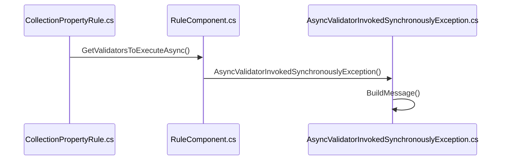
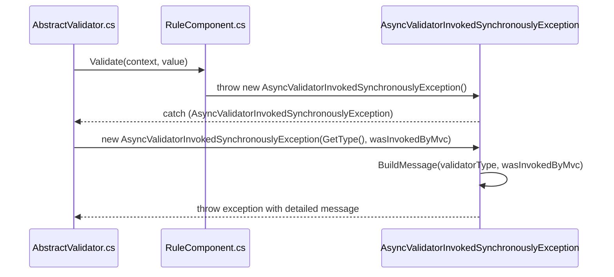
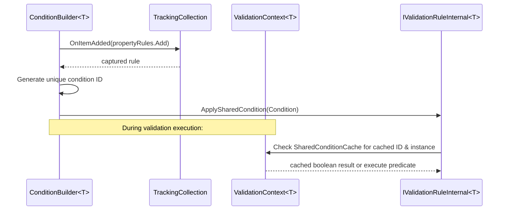
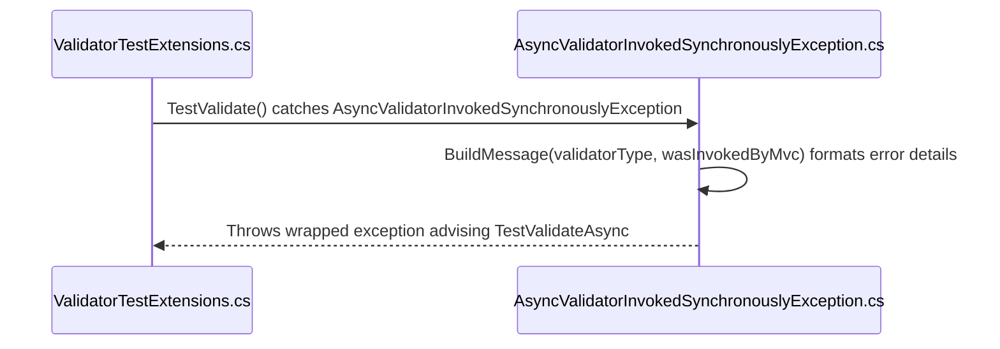

# Asynchronous Validation

<details>
<summary>Relevant source files</summary>

The following files were used as context for generating this wiki page:

- [src/FluentValidation/Validators/ChildValidatorAdaptor.cs](https://github.com/FluentValidation/FluentValidation/blob/main/src/FluentValidation/Validators/ChildValidatorAdaptor.cs)
- [src/FluentValidation/AbstractValidator.cs](https://github.com/FluentValidation/FluentValidation/blob/main/src/FluentValidation/AbstractValidator.cs)
- [src/FluentValidation.Tests/CascadingFailuresTester.cs](https://github.com/FluentValidation/FluentValidation/blob/main/src/FluentValidation.Tests/CascadingFailuresTester.cs)
- [src/FluentValidation/Internal/PropertyRule.cs](https://github.com/FluentValidation/FluentValidation/blob/main/src/FluentValidation/Internal/PropertyRule.cs)
- [src/FluentValidation/DefaultValidatorOptions.cs](https://github.com/FluentValidation/FluentValidation/blob/main/src/FluentValidation/DefaultValidatorOptions.cs)
- [src/FluentValidation/Internal/RuleComponent.cs](https://github.com/FluentValidation/Internal/RuleComponent.cs)
- [src/FluentValidation/Internal/CollectionPropertyRule.cs](https://github.com/FluentValidation/Internal/CollectionPropertyRule.cs)
- [src/FluentValidation/Internal/ConditionBuilder.cs](https://github.com/FluentValidation/Internal/ConditionBuilder.cs)
- [src/FluentValidation/Internal/IncludeRule.cs](https://github.com/FluentValidation/Internal/IncludeRule.cs)
- [docs/async.md](https://github.com/FluentValidation/FluentValidation/blob/main/docs/async.md)
- [src/FluentValidation/Internal/RuleBuilder.cs](https://github.com/FluentValidation/Internal/RuleBuilder.cs)
- [src/FluentValidation/Validators/IPropertyValidator.cs](https://github.com/FluentValidation/FluentValidation/blob/main/src/FluentValidation/Validators/IPropertyValidator.cs)
- [src/FluentValidation/AsyncValidatorInvokedSynchronouslyException.cs](https://github.com/FluentValidation/AsyncValidatorInvokedSynchronouslyException.cs)
- [src/FluentValidation/Validators/AsyncPropertyValidator.cs](https://github.com/FluentValidation/Validators/AsyncPropertyValidator.cs)
- [src/FluentValidation/Validators/AsyncPredicateValidator.cs](https://github.com/FluentValidation/Validators/AsyncPredicateValidator.cs)
- [src/FluentValidation/IValidationRuleInternal.cs](https://github.com/FluentValidation/IValidationRuleInternal.cs)
- [src/FluentValidation.Tests/ComplexValidationTester.cs](https://github.com/FluentValidation.Tests/ComplexValidationTester.cs)
- [src/FluentValidation.Tests/AbstractValidatorTester.cs](https://github.com/FluentValidation.Tests/AbstractValidatorTester.cs)
- [src/FluentValidation/Internal/RuleComponentForNullableStruct.cs](https://github.com/FluentValidation/Internal/RuleComponentForNullableStruct.cs)
- [src/FluentValidation.Tests/ValidatorTesterTester.cs](https://github.com/FluentValidation.Tests/ValidatorTesterTester.cs)
- [src/FluentValidation/IValidator.cs](https://github.com/FluentValidation/IValidator.cs)
- [src/FluentValidation/TestHelper/ValidatorTestExtensions.cs](https://github.com/FluentValidation/TestHelper/ValidatorTestExtensions.cs)
</details>

## Overview

Asynchronous validation in FluentValidation enables developers to define rules that perform non-blocking I/O operations, such as querying external web APIs or database lookups, by integrating natively with .NET tasks and cancellation tokens. This capability addresses the need to validate data against external dependencies without stalling execution threads. Key design decisions include enforcing asynchronous rule execution paths through dedicated API methods while preventing accidental synchronous invocations, supporting asynchronous conditions and collection filtering, and providing specialized test helpers for robust verification.

Sources: [docs/async.md:1-42](https://github.com/FluentValidation/FluentValidation/blob/main/docs/async.md#L1-L42), [src/FluentValidation/AbstractValidator.cs:88-92](https://github.com/FluentValidation/FluentValidation/blob/main/src/FluentValidation/AbstractValidator.cs#L88-L92)

## Asynchronous API Surface and Validation Overloads

### Overview

The asynchronous validation API surface centers around the `IValidator`, `IValidator<T>`, and `AbstractValidator<T>` abstractions, providing dedicated entry points for executing validation logic asynchronously. Callers invoke asynchronous validation by passing model instances or validation contexts alongside optional `CancellationToken` instances.

Sources: [src/FluentValidation/AbstractValidator.cs:83-138](https://github.com/FluentValidation/FluentValidation/blob/main/src/FluentValidation/AbstractValidator.cs#L83-L138), [src/FluentValidation/IValidator.cs:50-64](https://github.com/FluentValidation/FluentValidation/blob/main/src/FluentValidation/IValidator.cs#L50-L64)

### Validation Overloads and Invocation Signatures

Both generic and non-generic interfaces expose complementary overloads for asynchronous and synchronous validation paths. The non-generic `IValidator` interface accepts `IValidationContext`, whereas `IValidator<T>` and `AbstractValidator<T>` provide strongly-typed signatures for model instances and explicit `ValidationContext<T>` wrappers.

| Interface / Class | Method Signature | Purpose |
| :--- | :--- | :--- |
| `IValidator` | `Task<ValidationResult> ValidateAsync(IValidationContext context, CancellationToken cancellation = default)` | Executes validation asynchronously using a non-generic context. |
| `IValidator<T>` | `Task<ValidationResult> ValidateAsync(T instance, CancellationToken cancellation = default)` | Executes validation asynchronously on a strongly-typed instance. |
| `AbstractValidator<T>` | `Task<ValidationResult> ValidateAsync(ValidationContext<T> context, CancellationToken cancellation = default)` | Virtual entry point that sets `context.IsAsync = true` and invokes internal pipeline execution. |

Sources: [src/FluentValidation/AbstractValidator.cs:88-91](https://github.com/FluentValidation/FluentValidation/blob/main/src/FluentValidation/AbstractValidator.cs#L88-L91), [src/FluentValidation/AbstractValidator.cs:107-108](https://github.com/FluentValidation/FluentValidation/blob/main/src/FluentValidation/AbstractValidator.cs#L107-L108), [src/FluentValidation/AbstractValidator.cs:134-138](https://github.com/FluentValidation/FluentValidation/blob/main/src/FluentValidation/AbstractValidator.cs#L134-L138), [src/FluentValidation/IValidator.cs:44-44](https://github.com/FluentValidation/FluentValidation/blob/main/src/FluentValidation/IValidator.cs#L44-L44), [src/FluentValidation/IValidator.cs:64-64](https://github.com/FluentValidation/FluentValidation/blob/main/src/FluentValidation/IValidator.cs#L64-L64)

> [!WARNING]
> When a validator contains asynchronous validators or asynchronous conditions, callers must always invoke `ValidateAsync` rather than `Validate`. Calling `Validate` on an asynchronous validator triggers an explicit exception mechanism.

Sources: [src/FluentValidation/AbstractValidator.cs:121-125](https://github.com/FluentValidation/FluentValidation/blob/main/src/FluentValidation/AbstractValidator.cs#L121-L125), [docs/async.md:38-40](https://github.com/FluentValidation/FluentValidation/blob/main/docs/async.md#L38-L40)

### Execution Entry Flow

When an asynchronous validation call is initiated on an `AbstractValidator<T>`, the execution flows through a defined sequence of entry methods before evaluating rules:

1. `IValidator.ValidateAsync(IValidationContext, CancellationToken)` or `IValidator<T>.ValidateAsync(T, CancellationToken)` receives the caller's arguments.
2. The call bridges into `AbstractValidator<T>.ValidateAsync(ValidationContext<T>, CancellationToken)`.
3. `context.IsAsync = true` is assigned to flag the context as asynchronous.
4. `ValidateInternalAsync(ValidationContext<T>, CancellationToken)` is invoked to execute pre-validation, check null root models, iterate over registered rules, and apply class-level cascade rules.

Sources: [src/FluentValidation/AbstractValidator.cs:88-91](https://github.com/FluentValidation/FluentValidation/blob/main/src/FluentValidation/AbstractValidator.cs#L88-L91), [src/FluentValidation/AbstractValidator.cs:134-179](https://github.com/FluentValidation/FluentValidation/blob/main/src/FluentValidation/AbstractValidator.cs#L134-L179)

## Async Property Validators and Rule Builders

### Overview

Custom asynchronous property validation and rule building mechanics rely on specialized interface hierarchies and builder extensions that bridge fluent rule definitions to asynchronous execution units. Developers define custom asynchronous behavior by subclassing `AsyncPropertyValidator<T, TProperty>` or by leveraging `AsyncPredicateValidator<T, TProperty>`, which wraps inline lambda predicates.

Sources: [src/FluentValidation/Validators/AsyncPropertyValidator.cs:25-54](https://github.com/FluentValidation/FluentValidation/blob/main/src/FluentValidation/Validators/AsyncPropertyValidator.cs#L25-L54), [src/FluentValidation/Validators/AsyncPredicateValidator.cs:29-50](https://github.com/FluentValidation/FluentValidation/blob/main/src/FluentValidation/Validators/AsyncPredicateValidator.cs#L29-L50)

### Implementation Mechanics of Async Validators

The asynchronous property validator architecture centres around `IAsyncPropertyValidator<T, TProperty>`, which inherits from `IPropertyValidator`. The abstract base class `AsyncPropertyValidator<T, TProperty>` implements this interface, translating internal property validation calls and providing access to the global language manager for localized error message resolution.

Sources: [src/FluentValidation/Validators/IPropertyValidator.cs:24-33](https://github.com/FluentValidation/FluentValidation/blob/main/src/FluentValidation/Validators/IPropertyValidator.cs#L24-L33), [src/FluentValidation/Validators/AsyncPropertyValidator.cs:25-54](https://github.com/FluentValidation/FluentValidation/blob/main/src/FluentValidation/Validators/AsyncPropertyValidator.cs#L25-L54)

| Interface / Class | Base / Implements | Primary Members | Purpose |
| :--- | :--- | :--- | :--- |
| `IPropertyValidator` | None | `Name`, `GetDefaultMessageTemplate(string)` | Base contract defining name and default error message templates. |
| `IAsyncPropertyValidator<T, TProperty>` | `IPropertyValidator` | `IsValidAsync(ValidationContext<T>, TProperty, CancellationToken)` | Contract for validating property values asynchronously. |
| `AsyncPropertyValidator<T, TProperty>` | `IAsyncPropertyValidator<T, TProperty>` | `Localized(string, string)`, `GetDefaultMessageTemplate(string)` | Abstract base class handling localization and message fallback. |
| `AsyncPredicateValidator<T, TProperty>` | `AsyncPropertyValidator<T, TProperty>` | `_predicate`, `IsValidAsync(...)` | Encapsulates a lambda function executing an async predicate rule. |

Sources: [src/FluentValidation/Validators/IPropertyValidator.cs:24-64](https://github.com/FluentValidation/FluentValidation/blob/main/src/FluentValidation/Validators/IPropertyValidator.cs#L24-L64), [src/FluentValidation/Validators/AsyncPropertyValidator.cs:25-54](https://github.com/FluentValidation/FluentValidation/blob/main/src/FluentValidation/Validators/AsyncPropertyValidator.cs#L25-L54), [src/FluentValidation/Validators/AsyncPredicateValidator.cs:29-50](https://github.com/FluentValidation/FluentValidation/blob/main/src/FluentValidation/Validators/AsyncPredicateValidator.cs#L29-L50)

> [!NOTE]
> The `IPropertyValidator` interface explicitly documents that it should not be implemented directly in consumer code because it is subject to change. Custom property validators should inherit from `PropertyValidator<T, TProperty>` or `AsyncPropertyValidator<T, TProperty>` instead.

Sources: [src/FluentValidation/Validators/IPropertyValidator.cs:45-49](https://github.com/FluentValidation/FluentValidation/blob/main/src/FluentValidation/Validators/IPropertyValidator.cs#L45-L49)

### Rule Builder Registration Extensions

The `RuleBuilder<T, TProperty>` class acts as the bridge between fluent validation rules and rule storage. When an async validator or child validator is attached, `RuleBuilder` invokes specific registration methods on the underlying rule instance.

Sources: [src/FluentValidation/Internal/RuleBuilder.cs:30-128](https://github.com/FluentValidation/FluentValidation/blob/main/src/FluentValidation/Internal/RuleBuilder.cs#L30-L128)

The registration call-chain flows as follows:
1. `RuleBuilder.SetAsyncValidator(IAsyncPropertyValidator<T, TProperty>)` validates that the validator parameter is non-null using `ArgumentNullException.ThrowIfNull(validator)`.
2. It casts the validator to see if it also implements `IPropertyValidator<T, TProperty>` via `validator as IPropertyValidator<T, TProperty>` to obtain an optional synchronous fallback.
3. It hands both the async validator and the fallback reference to `Rule.AddAsyncValidator(validator, fallback)`.

Sources: [src/FluentValidation/Internal/RuleBuilder.cs:58-64](https://github.com/FluentValidation/FluentValidation/blob/main/src/FluentValidation/Internal/RuleBuilder.cs#L58-L64)

> [!TIP]
> Child validator adaptors like `ChildValidatorAdaptor<T, TProperty>` implement both synchronous and asynchronous execution paths natively, allowing `RuleBuilder` to register them using `Rule.AddAsyncValidator(adaptor, adaptor)` so they participate in both execution flows.

Sources: [src/FluentValidation/Internal/RuleBuilder.cs:66-94](https://github.com/FluentValidation/FluentValidation/blob/main/src/FluentValidation/Internal/RuleBuilder.cs#L66-L94)

### Worked Example: Custom Async Predicate and Registration

The following example demonstrates how `AsyncPredicateValidator` is instantiated and how `RuleBuilder` methods process validator registrations using the underlying rule storage mechanisms:

```csharp
public class UserValidator : AbstractValidator<User> {
    public UserValidator() {
        RuleFor(x => x.Email)
            .MustAsync(async (email, cancellation) => {
                bool exists = await Database.CheckEmailExistsAsync(email, cancellation);
                return !exists;
            })
            .WithMessage("The email address is already in use.");
    }
}
```

Sources: [src/FluentValidation/Internal/RuleBuilder.cs:58-64](https://github.com/FluentValidation/FluentValidation/blob/main/src/FluentValidation/Internal/RuleBuilder.cs#L58-L64), [src/FluentValidation/Validators/AsyncPredicateValidator.cs:38-45](https://github.com/FluentValidation/FluentValidation/blob/main/src/FluentValidation/Validators/AsyncPredicateValidator.cs#L38-L45)

## Internal Pipeline Execution and Collection Evaluation

### Overview

Internal pipeline execution manages how property rules, collection rules, and include directives evaluate asynchronously across the validation lifecycle. Rules verify selectors, execute synchronous and asynchronous conditions, retrieve property values or collection elements, and enforce cascade stops.

Sources: [src/FluentValidation/Internal/PropertyRule.cs:52-143](https://github.com/FluentValidation/FluentValidation/blob/main/src/FluentValidation/Internal/PropertyRule.cs#L52-L143), [src/FluentValidation/Internal/CollectionPropertyRule.cs:71-199](https://github.com/FluentValidation/FluentValidation/blob/main/src/FluentValidation/Internal/CollectionPropertyRule.cs#L71-L199), [src/FluentValidation/Internal/IncludeRule.cs:55-75](https://github.com/FluentValidation/FluentValidation/blob/main/src/FluentValidation/Internal/IncludeRule.cs#L55-L75)

### Execution Flow and Call Chains

The asynchronous execution pipeline handles rule validation through a defined call chain. When executing collection rules, `GetValidatorsToExecuteAsync` filters rule components by evaluating their conditions beforehand, throwing an `AsyncValidatorInvokedSynchronouslyException` if synchronous code generation flags are triggered, and constructs error messages via `BuildMessage`.

1. `GetValidatorsToExecuteAsync` — Iterates over rule components and evaluates async conditions on the root object before collection retrieval.
2. `AsyncValidatorInvokedSynchronouslyException` — Thrown when sync-only compilation paths encounter asynchronous execution requirements.
3. `BuildMessage` — Formats error messages using validator types and invocation contexts.

Sources: [src/FluentValidation/Internal/CollectionPropertyRule.cs:207-235](https://github.com/FluentValidation/FluentValidation/blob/main/src/FluentValidation/Internal/CollectionPropertyRule.cs#L207-L235), [src/FluentValidation/AsyncValidatorInvokedSynchronouslyException.cs:29-46](https://github.com/FluentValidation/FluentValidation/blob/main/src/FluentValidation/AsyncValidatorInvokedSynchronouslyException.cs#L29-L46)



Sources: [src/FluentValidation/Internal/CollectionPropertyRule.cs:207-235](https://github.com/FluentValidation/FluentValidation/blob/main/src/FluentValidation/Internal/CollectionPropertyRule.cs#L207-L235), [src/FluentValidation/Internal/RuleComponent.cs:102-110](https://github.com/FluentValidation/FluentValidation/blob/main/src/FluentValidation/Internal/RuleComponent.cs#L102-L110), [src/FluentValidation/AsyncValidatorInvokedSynchronouslyException.cs:29-46](https://github.com/FluentValidation/FluentValidation/blob/main/src/FluentValidation/AsyncValidatorInvokedSynchronouslyException.cs#L29-L46)

### Include Directives and State Management

`IncludeRule<T>` inherits from `PropertyRule<T, T>` and integrates external validators into the current validation pipeline. During asynchronous execution, `IncludeRule.ValidateAsync` manages state keys in `context.RootContextData` to control cascading behavior.

> [!NOTE]
> `IncludeRule` disables the `MemberNameValidatorSelector` cascade functionality temporarily by adding `MemberNameValidatorSelector.DisableCascadeKey` to `RootContextData` during its execution cycle, ensuring nested include rules behave as direct children of the parent rule.

Sources: [src/FluentValidation/Internal/IncludeRule.cs:16-75](https://github.com/FluentValidation/FluentValidation/blob/main/src/FluentValidation/Internal/IncludeRule.cs#L16-L75)

### Rule Pipeline Component Reference

| Class / Member | Base / Interface | Purpose | Sources |
| --- | --- | --- | --- |
| `PropertyRule<T, TProperty>` | `RuleBase`, `IValidationRuleInternal` | Executes property validation rules, sync/async conditions, and component iteration. | [src/FluentValidation/Internal/PropertyRule.cs:31-143](https://github.com/FluentValidation/FluentValidation/blob/main/src/FluentValidation/Internal/PropertyRule.cs#L31-L143) |
| `CollectionPropertyRule<T, TElement>` | `RuleBase`, `ICollectionRule` | Evaluates collection items, filters, indexers, and child component validations. | [src/FluentValidation/Internal/CollectionPropertyRule.cs:36-246](https://github.com/FluentValidation/FluentValidation/blob/main/src/FluentValidation/Internal/CollectionPropertyRule.cs#L36-L246) |
| `IncludeRule<T>` | `PropertyRule<T, T>`, `IIncludeRule` | Inlines rules from another validator instance using child validator adaptors. | [src/FluentValidation/Internal/IncludeRule.cs:16-76](https://github.com/FluentValidation/FluentValidation/blob/main/src/FluentValidation/Internal/IncludeRule.cs#L16-L76) |
| `RuleComponent<T, TProperty>` | `IRuleComponent` | Encapsulates an individual validator instance, error codes, severity, and conditions. | [src/FluentValidation/Internal/RuleComponent.cs:33-212](https://github.com/FluentValidation/Internal/RuleComponent.cs#L33-L212) |

Sources: [src/FluentValidation/Internal/PropertyRule.cs:31-35](https://github.com/FluentValidation/FluentValidation/blob/main/src/FluentValidation/Internal/PropertyRule.cs#L31-L35), [src/FluentValidation/Internal/CollectionPropertyRule.cs:36-42](https://github.com/FluentValidation/FluentValidation/blob/main/src/FluentValidation/Internal/CollectionPropertyRule.cs#L36-L42), [src/FluentValidation/Internal/IncludeRule.cs:16-16](https://github.com/FluentValidation/FluentValidation/blob/main/src/FluentValidation/Internal/IncludeRule.cs#L16-L16), [src/FluentValidation/Internal/RuleComponent.cs:33-33](https://github.com/FluentValidation/Internal/RuleComponent.cs#L33-L33)

### Pipeline Design Trade-Offs

| Design Choice | Benefit | Cost | Sources |
| --- | --- | --- | --- |
| Pre-filtering collection validators via `GetValidatorsToExecuteAsync` | Prevents collection enumeration and potential `NullReferenceException`s when root conditions fail. | Requires iterating components twice prior to processing collection elements. | [src/FluentValidation/Internal/CollectionPropertyRule.cs:108-113](https://github.com/FluentValidation/FluentValidation/blob/main/src/FluentValidation/Internal/CollectionPropertyRule.cs#L108-L113), [src/FluentValidation/Internal/CollectionPropertyRule.cs:207-235](https://github.com/FluentValidation/FluentValidation/blob/main/src/FluentValidation/Internal/CollectionPropertyRule.cs#L207-L235) |
| State key toggling in `IncludeRule` via `RootContextData` | Preserves parent context and prevents redundant cascade key modifications in nested includes. | Mutates shared context dictionary state during rule execution. | [src/FluentValidation/Internal/IncludeRule.cs:56-75](https://github.com/FluentValidation/FluentValidation/blob/main/src/FluentValidation/Internal/IncludeRule.cs#L56-L75) |
| Dual interface implementation on `ChildValidatorAdaptor` | Permits unified registration for both synchronous and asynchronous execution paths. | Couples synchronous and asynchronous contracts within a single adapter implementation. | [src/FluentValidation/Internal/IncludeRule.cs:23-27](https://github.com/FluentValidation/FluentValidation/blob/main/src/FluentValidation/Internal/IncludeRule.cs#L23-L27) |

Sources: [src/FluentValidation/Internal/CollectionPropertyRule.cs:108-113](https://github.com/FluentValidation/FluentValidation/blob/main/src/FluentValidation/Internal/CollectionPropertyRule.cs#L108-L113), [src/FluentValidation/Internal/CollectionPropertyRule.cs:207-235](https://github.com/FluentValidation/FluentValidation/blob/main/src/FluentValidation/Internal/CollectionPropertyRule.cs#L207-L235), [src/FluentValidation/Internal/IncludeRule.cs:23-75](https://github.com/FluentValidation/FluentValidation/blob/main/src/FluentValidation/Internal/IncludeRule.cs#L23-L75)

## Synchronous Invocation Prevention and Error Enforcement

### Overview

When an asynchronous validation rule or asynchronous property validator is present within a validator hierarchy, attempting to execute the validator via synchronous methods like `Validate` triggers enforcement mechanisms that intercept the execution flow and prevent improper synchronous invocation. This ensures developers are alerted immediately if asynchronous rules are executed outside an asynchronous pipeline or via automatic MVC validation.

Sources: [src/FluentValidation/AbstractValidator.cs:115-126](https://github.com/FluentValidation/AbstractValidator.cs#L115-L126), [src/FluentValidation/Internal/RuleComponent.cs:79-89](https://github.com/FluentValidation/Internal/RuleComponent.cs#L79-L89), [src/FluentValidation/AsyncValidatorInvokedSynchronouslyException.cs:23-26](https://github.com/FluentValidation/AsyncValidatorInvokedSynchronouslyException.cs#L23-L26)

### Call-Chain Execution Walkthrough

When synchronous validation encounters an asynchronous property validator component, the failure propagates through a specific call chain:

1. `Validate` — The public synchronous entry point on `AbstractValidator<T>` catches exceptions thrown during internal rule processing.
Sources: [src/FluentValidation/AbstractValidator.cs:115-126](https://github.com/FluentValidation/AbstractValidator.cs#L115-L126)

2. `AsyncValidatorInvokedSynchronouslyException` — Caught inside `Validate`, where `context.RootContextData` is checked for the `"InvokedByMvc"` key to determine if ASP.NET automatic validation triggered the invocation.
Sources: [src/FluentValidation/AbstractValidator.cs:121-125](https://github.com/FluentValidation/AbstractValidator.cs#L121-L125), [src/FluentValidation/AsyncValidatorInvokedSynchronouslyException.cs:32-35](https://github.com/FluentValidation/AsyncValidatorInvokedSynchronouslyException.cs#L32-L35)

3. `BuildMessage` — A private static method on `AsyncValidatorInvokedSynchronouslyException` that inspects the `wasInvokedByMvc` boolean flag to construct either an MVC-specific error message or a general recommendation to call `ValidateAsync` instead.
Sources: [src/FluentValidation/AsyncValidatorInvokedSynchronouslyException.cs:40-46](https://github.com/FluentValidation/AsyncValidatorInvokedSynchronouslyException.cs#L40-L46)



Sources: [src/FluentValidation/AbstractValidator.cs:115-126](https://github.com/FluentValidation/AbstractValidator.cs#L115-L126), [src/FluentValidation/Internal/RuleComponent.cs:79-89](https://github.com/FluentValidation/Internal/RuleComponent.cs#L79-L89), [src/FluentValidation/AsyncValidatorInvokedSynchronouslyException.cs:32-46](https://github.com/FluentValidation/AsyncValidatorInvokedSynchronouslyException.cs#L32-L46)

### Enforcement Component Reference

| Class / Method | Signature / Type | Purpose | Sources |
| --- | --- | --- | --- |
| `AbstractValidator<T>.Validate` | `ValidationResult Validate(ValidationContext<T> context)` | Intercepts `AsyncValidatorInvokedSynchronouslyException` and decorates it with context. | [src/FluentValidation/AbstractValidator.cs:115-126](https://github.com/FluentValidation/AbstractValidator.cs#L115-L126) |
| `RuleComponent<T, TProperty>.Validate` | `bool Validate(ValidationContext<T> context, TProperty value)` | Checks `SupportsSynchronousValidation` and throws if missing. | [src/FluentValidation/Internal/RuleComponent.cs:79-89](https://github.com/FluentValidation/Internal/RuleComponent.cs#L79-L89) |
| `AsyncValidatorInvokedSynchronouslyException` | Constructor / Exception | Stores `ValidatorType` and generates detailed error messages. | [src/FluentValidation/AsyncValidatorInvokedSynchronouslyException.cs:26-47](https://github.com/FluentValidation/AsyncValidatorInvokedSynchronouslyException.cs#L26-L47) |

Sources: [src/FluentValidation/AbstractValidator.cs:115-126](https://github.com/FluentValidation/AbstractValidator.cs#L115-L126), [src/FluentValidation/Internal/RuleComponent.cs:79-89](https://github.com/FluentValidation/Internal/RuleComponent.cs#L79-L89), [src/FluentValidation/AsyncValidatorInvokedSynchronouslyException.cs:26-47](https://github.com/FluentValidation/AsyncValidatorInvokedSynchronouslyException.cs#L26-L47)

> [!CAUTION]
> ASP.NET's built-in model validation pipeline is strictly synchronous and cannot execute asynchronous rules. When automatic MVC validation encounters a validator containing async rules, `context.RootContextData` contains `"InvokedByMvc"`, resulting in a specialized error message instructing that asynchronous rules must be removed for compatibility.

Sources: [src/FluentValidation/AbstractValidator.cs:123-124](https://github.com/FluentValidation/AbstractValidator.cs#L123-L124), [src/FluentValidation/AsyncValidatorInvokedSynchronouslyException.cs:41-43](https://github.com/FluentValidation/AsyncValidatorInvokedSynchronouslyException.cs#L41-L43)

## Conditional Execution and Async Child Validators

### Overview

Conditional rule execution and child validator integration coordinate through dedicated internal builders and adaptor types. When applying shared conditions across multiple validation rules via `When` or `WhenAsync`, `ConditionBuilder<T>` and `AsyncConditionBuilder<T>` intercept rule additions using a `TrackingCollection<IValidationRuleInternal<T>>`. They generate unique identifiers (`_FV_Condition_...` and `_FV_AsyncCondition_...`) to cache predicate evaluations in `actualContext.SharedConditionCache`, preventing redundant executions when multiple rules share identical conditional logic on the same validated instance.

Sources: [src/FluentValidation/Internal/ConditionBuilder.cs:26-155](https://github.com/FluentValidation/Internal/ConditionBuilder.cs#L26-L155)



Sources: [src/FluentValidation/Internal/ConditionBuilder.cs:39-78](https://github.com/FluentValidation/Internal/ConditionBuilder.cs#L39-L78), [src/FluentValidation/Internal/ConditionBuilder.cs:105-142](https://github.com/FluentValidation/Internal/ConditionBuilder.cs#L105-L142)

### Child Validator Adaptors and Execution Flow

Child validator integration is managed by `ChildValidatorAdaptor<T, TProperty>`, which implements both `IAsyncPropertyValidator<T, TProperty>` and `IChildValidatorAdaptor`. The adaptor supports both instance-based wrapping and delegate-based provision via `_validatorProvider`. 

The call-chain execution walkthrough for asynchronous child validation proceeds through the following named steps:
1. `IsValidAsync(ValidationContext<T> context, TProperty value, CancellationToken cancellation)` — Receives the validation context and child property value, returning early if `value` or the resolved `validator` is `null`.
2. `GetValidator(ValidationContext<T> context, TProperty value)` — Evaluates whether `_validatorProvider` is present; if so, invokes it with `context` and `value`, otherwise falls back to the instance `_validator`.
3. `CreateNewValidationContextForChildValidator(ValidationContext<T> context, TProperty value)` — Clones the parent context via `context.CloneForChildValidator(value, true, selector)` and appends the raw property name to `newContext.PropertyChain` if not executing within a child collection context.
4. `HandleCollectionIndex(...)` — Extracts and preserves collection indexing placeholders from `context.MessageFormatter.PlaceholderValues` into `context.RootContextData["__FV_CollectionIndex"]`.
5. `validator.ValidateAsync(newContext, cancellation)` — Executes the underlying child validator asynchronously with the prepared context and cancellation token.
6. `ResetCollectionIndex(...)` — Restores or removes the original collection index from root context data upon completion.

Sources: [src/FluentValidation/Validators/ChildValidatorAdaptor.cs:18-125](https://github.com/FluentValidation/FluentValidation/blob/main/src/FluentValidation/Validators/ChildValidatorAdaptor.cs#L18-L125)

> [!TIP]
> When using `RuleForEach` with child validators, `HandleCollectionIndex` caches the index in `RootContextData` under `__FV_CollectionIndex`. This ensures that nested property error messages correctly format indices such as `Orders[0].ProductName` without losing placeholder context during recursive validation passes.

Sources: [src/FluentValidation/Validators/ChildValidatorAdaptor.cs:51-55](https://github.com/FluentValidation/FluentValidation/blob/main/src/FluentValidation/Validators/ChildValidatorAdaptor.cs#L51-L55), [src/FluentValidation/Validators/ChildValidatorAdaptor.cs:107-113](https://github.com/FluentValidation/FluentValidation/blob/main/src/FluentValidation/Validators/ChildValidatorAdaptor.cs#L107-L113)

### Cascade Mode and Failure Stopping

Cascade mode execution dictates whether rule evaluation halts immediately upon encountering a failure. FluentValidation defines cascade behavior via the `CascadeMode` enumeration, which interacts across global defaults (`ValidatorOptions.Global`), class-level configurations, and rule-level overrides.

| CascadeMode Member | Underlying Value | Meaning / Behavior | Sources |
| --- | --- | --- | --- |
| `CascadeMode.Continue` | `0` | Continue executing subsequent validators or rules even if a validation check fails. | [src/FluentValidation.Tests/CascadingFailuresTester.cs:483-483](https://github.com/FluentValidation/FluentValidation/blob/main/src/FluentValidation.Tests/CascadingFailuresTester.cs#L483-L483) |
| `CascadeMode.Stop` | `2` | Stop rule execution immediately upon encountering the first validation failure. | [src/FluentValidation.Tests/CascadingFailuresTester.cs:484-484](https://github.com/FluentValidation/FluentValidation/blob/main/src/FluentValidation.Tests/CascadingFailuresTester.cs#L484-L484) |

Sources: [src/FluentValidation.Tests/CascadingFailuresTester.cs:480-485](https://github.com/FluentValidation/FluentValidation/blob/main/src/FluentValidation.Tests/CascadingFailuresTester.cs#L480-L485)

> [!WARNING]
> Historical versions included a `StopOnFirstFailure` enum value (numeric value `1`), which was removed in version 12.0. For backward compatibility, `CascadeMode.Stop` retains its numeric value of `2` rather than being renumbered.

Sources: [src/FluentValidation.Tests/CascadingFailuresTester.cs:480-485](https://github.com/FluentValidation/FluentValidation/blob/main/src/FluentValidation.Tests/CascadingFailuresTester.cs#L480-L485)

## Test Extensions and Asynchronous Assertions

### Overview

FluentValidation provides a robust testing helper framework in the `FluentValidation.TestHelper` namespace that allows developers to write unit tests for validators synchronously or asynchronously. Test helpers such as `TestValidate` and `TestValidateAsync` wrap a validator instance and return a `TestValidationResult<T>`, which exposes fluent assertion extensions like `ShouldHaveValidationErrorFor`, `ShouldNotHaveValidationErrorFor`, and `Only`.

Sources: [src/FluentValidation.Tests/AbstractValidatorTester.cs:26-28](https://github.com/FluentValidation/FluentValidation/blob/main/src/FluentValidation.Tests/AbstractValidatorTester.cs#L26-L28), [src/FluentValidation/TestHelper/ValidatorTestExtensions.cs:83-120](https://github.com/FluentValidation/FluentValidation/blob/main/src/FluentValidation/TestHelper/ValidatorTestExtensions.cs#L83-L120)

### Call-Chain Execution Walkthrough

When validating synchronously via test extensions on a validator containing asynchronous rules, the test helper intercepts invocation errors and formats an exception. The call-chain execution walkthrough proceeds through the following named steps:
1. `TestValidate` — Invokes `validator.Validate(context)` inside a try-catch block to execute synchronous validation rules against the provided context.
2. `AsyncValidatorInvokedSynchronouslyException` — Traps the thrown exception when an asynchronous rule is encountered during synchronous execution.
3. `BuildMessage` — Formats a descriptive error message via `BuildMessage(Type validatorType, bool wasInvokedByMvc)` using the validator type name and invocation context.

Sources: [src/FluentValidation/TestHelper/ValidatorTestExtensions.cs:94-104](https://github.com/FluentValidation/FluentValidation/blob/main/src/FluentValidation/TestHelper/ValidatorTestExtensions.cs#L94-L104), [src/FluentValidation/AsyncValidatorInvokedSynchronouslyException.cs:32-46](https://github.com/FluentValidation/AsyncValidatorInvokedSynchronouslyException.cs#L32-L46)



Sources: [src/FluentValidation/TestHelper/ValidatorTestExtensions.cs:94-104](https://github.com/FluentValidation/FluentValidation/blob/main/src/FluentValidation/TestHelper/ValidatorTestExtensions.cs#L94-L104), [src/FluentValidation/AsyncValidatorInvokedSynchronouslyException.cs:32-46](https://github.com/FluentValidation/FluentValidation/blob/main/src/FluentValidation/AsyncValidatorInvokedSynchronouslyException.cs#L32-L46)

> [!WARNING]
> Calling `TestValidate` on a validator that defines asynchronous rules (such as `MustAsync` or `WhenAsync`) throws an `AsyncValidatorInvokedSynchronouslyException`. Tests evaluating asynchronous rules must use `TestValidateAsync` instead.

Sources: [src/FluentValidation.Tests/AbstractValidatorTester.cs:565-568](https://github.com/FluentValidation.Tests/AbstractValidatorTester.cs#L565-L568), [src/FluentValidation/TestHelper/ValidatorTestExtensions.cs:107-120](https://github.com/FluentValidation/FluentValidation/blob/main/src/FluentValidation/TestHelper/ValidatorTestExtensions.cs#L107-L120)

### Assertion Helpers and Fluent Modifiers

The test assertion methods support narrowing down expectations using fluent continuation modifiers on `ITestValidationContinuation`.

| Assertion / Modifier | Description | Sources |
| --- | --- | --- | --- |
| `ShouldHaveValidationErrorFor` | Asserts that a validation error was raised for the specified property expression or property name string. | [src/FluentValidation/TestHelper/ValidatorTestExtensions.cs:90-98](https://github.com/FluentValidation/TestHelper/ValidatorTestExtensions.cs#L90-L98) |
| `ShouldNotHaveValidationErrorFor` | Asserts that no validation errors were reported for the specified property. | [src/FluentValidation/TestHelper/ValidatorTestExtensions.cs:101-111](https://github.com/FluentValidation/TestHelper/ValidatorTestExtensions.cs#L101-L111) |
| `WithErrorMessage` | Filters or asserts that a matching failure contains the exact expected error message. | [src/FluentValidation/TestHelper/ValidatorTestExtensions.cs:183-185](https://github.com/FluentValidation/TestHelper/ValidatorTestExtensions.cs#L183-L185) |
| `WithErrorCode` | Asserts that a matching validation failure exhibits the specified error code string. | [src/FluentValidation/TestHelper/ValidatorTestExtensions.cs:187-189](https://github.com/FluentValidation/TestHelper/ValidatorTestExtensions.cs#L187-L189) |
| `WithSeverity` | Asserts that the validation failure matches the expected `Severity` level. | [src/FluentValidation/TestHelper/ValidatorTestExtensions.cs:170-172](https://github.com/FluentValidation/TestHelper/ValidatorTestExtensions.cs#L170-L172) |
| `Only` | Asserts that *only* the explicitly matched errors exist, throwing a `ValidationTestException` if unexpected failures are present. | [src/FluentValidation/TestHelper/ValidatorTestExtensions.cs:207-232](https://github.com/FluentValidation/TestHelper/ValidatorTestExtensions.cs#L207-L232) |

Sources: [src/FluentValidation/TestHelper/ValidatorTestExtensions.cs:170-232](https://github.com/FluentValidation/TestHelper/ValidatorTestExtensions.cs#L170-L232)

> [!TIP]
> Use `.Only()` at the end of assertion chains to guarantee that no secondary validation errors occurred unexpectedly on other properties or rules during test execution.

Sources: [src/FluentValidation.Tests/AbstractValidatorTester.cs:813-819](https://github.com/FluentValidation.Tests/AbstractValidatorTester.cs#L813-L819), [src/FluentValidation/TestHelper/ValidatorTestExtensions.cs:207-232](https://github.com/FluentValidation/TestHelper/ValidatorTestExtensions.cs#L207-L232)

### Design Trade-Offs in Test Helpers

| Design Choice | Benefit | Cost | Sources |
| --- | --- | --- | --- |
| `TestValidate` wrapping `Validate` in a try-catch block | Translates internal synchronous invocation exceptions into clear testing instructions. | Adds a slight runtime exception overhead during failed synchronous assertions. | [src/FluentValidation/TestHelper/ValidatorTestExtensions.cs:94-104](https://github.com/FluentValidation/TestHelper/ValidatorTestExtensions.cs#L94-L104) |
| Recursive parent-child traversal in `Only()` | Aggregates unmatched failures across nested child validator contexts for complete assertions. | Increases traversal depth and complexity when analyzing large object graphs. | [src/FluentValidation/TestHelper/ValidatorTestExtensions.cs:207-218](https://github.com/FluentValidation/TestHelper/ValidatorTestExtensions.cs#L207-L218) |
| Separate `TestValidateAsync` extension methods | Enforces correct async pipeline execution without blocking threads. | Requires duplicate method overloads across synchronous and asynchronous test helpers. | [src/FluentValidation/TestHelper/ValidatorTestExtensions.cs:107-120](https://github.com/FluentValidation/TestHelper/ValidatorTestExtensions.cs#L107-L120) |

Sources: [src/FluentValidation/TestHelper/ValidatorTestExtensions.cs:94-120](https://github.com/FluentValidation/TestHelper/ValidatorTestExtensions.cs#L94-L120), [src/FluentValidation/TestHelper/ValidatorTestExtensions.cs:207-218](https://github.com/FluentValidation/TestHelper/ValidatorTestExtensions.cs#L207-L218)

## Related

- [[Validation Core]]
- [[Custom Validators]]

