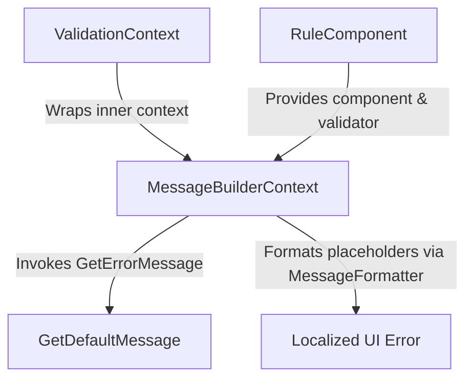

# Blazor Integration

<details>
<summary>Relevant source files</summary>

The following files were used as context for generating this wiki page:

- [docs/aspnet.md](https://github.com/FluentValidation/FluentValidation/blob/main/docs/aspnet.md)
- [src/FluentValidation/Internal/MessageBuilderContext.cs](https://github.com/FluentValidation/FluentValidation/blob/main/src/FluentValidation/Internal/MessageBuilderContext.cs)
- [src/FluentValidation/IValidationContext.cs](https://github.com/FluentValidation/FluentValidation/blob/main/src/FluentValidation/IValidationContext.cs)
- [docs/blazor.md](https://github.com/FluentValidation/FluentValidation/blob/main/docs/blazor.md)
- [docs/upgrading-to-10.md](https://github.com/FluentValidation/FluentValidation/blob/main/docs/upgrading-to-10.md)
- [docs/di.md](https://github.com/FluentValidation/FluentValidation/blob/main/docs/di.md)
- [src/FluentValidation/AbstractValidator.cs](https://github.com/FluentValidation/FluentValidation/blob/main/src/FluentValidation/AbstractValidator.cs)
- [docs/upgrading-to-8.md](https://github.com/FluentValidation/FluentValidation/blob/main/docs/upgrading-to-8.md)
- [src/FluentValidation/Internal/IRuleComponent.cs](https://github.com/FluentValidation/FluentValidation/blob/main/src/FluentValidation/Internal/IRuleComponent.cs)
- [docs/advanced.md](https://github.com/FluentValidation/FluentValidation/blob/main/docs/advanced.md)
- [docs/custom-validators.md](https://github.com/FluentValidation/FluentValidation/blob/main/docs/custom-validators.md)
- [docs/upgrading-to-9.md](https://github.com/FluentValidation/FluentValidation/blob/main/docs/upgrading-to-9.md)
- [src/FluentValidation/Internal/RuleComponent.cs](https://github.com/FluentValidation/FluentValidation/blob/main/src/FluentValidation/Internal/RuleComponent.cs)
- [src/FluentValidation/README.md](https://github.com/FluentValidation/FluentValidation/blob/main/src/FluentValidation/README.md)
- [src/FluentValidation/DefaultValidatorExtensions_Validate.cs](https://github.com/FluentValidation/FluentValidation/blob/main/src/FluentValidation/DefaultValidatorExtensions_Validate.cs)
- [src/FluentValidation.DependencyInjectionExtensions/README.md](https://github.com/FluentValidation/FluentValidation/blob/main/src/FluentValidation.DependencyInjectionExtensions/README.md)
- [docs/index.rst](https://github.com/FluentValidation/FluentValidation/blob/main/docs/index.rst)
- [docs/localization.md](https://github.com/FluentValidation/FluentValidation/blob/main/docs/localization.md)
- [docs/testing.md](https://github.com/FluentValidation/FluentValidation/blob/main/docs/testing.md)
- [docs/built-in-validators.md](https://github.com/FluentValidation/FluentValidation/blob/main/docs/built-in-validators.md)
- [docs/start.md](https://github.com/FluentValidation/FluentValidation/blob/main/docs/start.md)
- [src/FluentValidation.Tests/UserStateTester.cs](https://github.com/FluentValidation/FluentValidation.Tests/UserStateTester.cs)
- [docs/upgrading-to-11.md](https://github.com/FluentValidation/FluentValidation/blob/main/docs/upgrading-to-11.md)
- [docs/mvc5.md](https://github.com/FluentValidation/FluentValidation/blob/main/docs/mvc5.md)
- [docs/upgrading-to-12.md](https://github.com/FluentValidation/FluentValidation/blob/main/docs/upgrading-to-12.md)
</details>

## Overview

FluentValidation does not provide direct integration with Blazor out of the box. Instead, developers rely on various community-driven third-party libraries designed to bridge Blazor form validation workflows with FluentValidation's core engine. These ecosystem integrations typically leverage third-party packages such as Blazilla, Blazored.FluentValidation (archived), Blazor-Validation, Accelist.FluentValidation.Blazor, vNext.BlazorComponents.FluentValidation, and Tenekon.FluentValidation.Extensions.AspNetCore.Components. Sources: [docs/blazor.md:3-10](https://github.com/FluentValidation/FluentValidation/blob/main/docs/blazor.md#L3-L10)

## Blazor EditContext Integration Overview

### Overview

FluentValidation does not provide direct, out-of-the-box integration support or built-in `EditContext` binding patterns for Blazor applications. Sources: [docs/blazor.md:3-3](https://github.com/FluentValidation/FluentValidation/blob/main/docs/blazor.md#L3-L3)

Because core FluentValidation focuses strictly on building strongly-typed validation rules and evaluating them against .NET objects rather than interacting with UI component lifecycles, form state management, or `EditContext` instances, developers must integrate validation into Blazor forms using third-party ecosystem libraries. Sources: [docs/blazor.md:3-3](https://github.com/FluentValidation/FluentValidation/blob/main/docs/blazor.md#L3-L3)

### Third-Party Integration Ecosystem

To achieve `EditContext` integration and form validation binding in Blazor components, the community provides several specialized packages that hook into Blazor's validation infrastructure. Sources: [docs/blazor.md:3-4](https://github.com/FluentValidation/FluentValidation/blob/main/docs/blazor.md#L3-L4)

The available third-party integration libraries include Blazilla, Blazored.FluentValidation (Archived), Blazor-Validation, Accelist.FluentValidation.Blazor, vNext.BlazorComponents.FluentValidation, and Tenekon.FluentValidation.Extensions.AspNetCore.Components. Sources: [docs/blazor.md:5-10](https://github.com/FluentValidation/FluentValidation/blob/main/docs/blazor.md#L5-L10)

> [!NOTE]
> Some community packages such as Blazored.FluentValidation are currently archived, meaning developers should evaluate active maintenance status and target framework compatibility when selecting a third-party bridge for Blazor form workflows. Sources: [docs/blazor.md:6-6](https://github.com/FluentValidation/FluentValidation/blob/main/docs/blazor.md#L6-L6)

Sources: [docs/blazor.md:3-10](https://github.com/FluentValidation/FluentValidation/blob/main/docs/blazor.md#L3-L10)

## Dependency Injection for Blazor Components

### Overview

Validators can be integrated with any dependency injection library, such as `Microsoft.Extensions.DependencyInjection`, which is utilized across both Blazor server and WebAssembly application hosts. Sources: [docs/di.md:3-3](https://github.com/FluentValidation/FluentValidation/blob/main/docs/di.md#L3-L3)

To inject a validator for a specific model, developers must register the validator with the service provider as `IValidator<T>`, where `T` represents the model type being validated. Sources: [docs/di.md:3-3](https://github.com/FluentValidation/FluentValidation/blob/main/docs/di.md#L3-L3)

### Manual and Automatic Registration

Individual validators can be manually registered against `IServiceCollection` within the application's startup routine or `Program.cs` file. Sources: [docs/di.md:29-32](https://github.com/FluentValidation/FluentValidation/blob/main/docs/di.md#L29-L32)

For instance, registering a scoped validator for a `User` model looks like:

```csharp
services.AddScoped<IValidator<User>, UserValidator>();
```

Sources: [docs/di.md:32-32](https://github.com/FluentValidation/FluentValidation/blob/main/docs/di.md#L32-L32)

Alternatively, developers can utilize the `FluentValidation.DependencyInjectionExtensions` package to automatically scan assemblies and register validators using extension methods such as `AddValidatorsFromAssemblyContaining<T>()`, `AddValidatorsFromAssemblyContaining(Type)`, or `AddValidatorsFromAssembly(Assembly)`. Sources: [docs/di.md:63-63](https://github.com/FluentValidation/FluentValidation/blob/main/docs/di.md#L63-L63), [docs/di.md:96-104](https://github.com/FluentValidation/FluentValidation/blob/main/docs/di.md#L96-L104), [src/FluentValidation.DependencyInjectionExtensions/README.md:4-5](https://github.com/FluentValidation/FluentValidation/blob/main/src/FluentValidation.DependencyInjectionExtensions/README.md#L4-L5)

> [!WARNING]
> By default, auto-registration registers validators with a `Scoped` service lifetime. If you register a validator as a `Singleton`, ensure you do not inject transient or request-scoped dependencies into it. Registering validators as `Transient` is the simplest and safest option unless you are experienced with troubleshooting singleton scoping issues. Sources: [docs/di.md:80-92](https://github.com/FluentValidation/FluentValidation/blob/main/docs/di.md#L80-L92)

### Filtering Auto-Registration

When scanning assemblies for automatic registration, an optional filter function can be provided to exclude specific validators. Sources: [docs/di.md:111-113](https://github.com/FluentValidation/FluentValidation/blob/main/docs/di.md#L111-L113)

For example, to register all validators in an assembly except `CustomerValidator`, use:

```csharp
services.AddValidatorsFromAssemblyContaining<MyValidator>(ServiceLifetime.Scoped, 
    filter => filter.ValidatorType != typeof(CustomerValidator));
```

Sources: [docs/di.md:115-118](https://github.com/FluentValidation/FluentValidation/blob/main/docs/di.md#L115-L118)

Sources: [docs/di.md:3-118](https://github.com/FluentValidation/FluentValidation/blob/main/docs/di.md#L3-L118)

## Validation Context and Failure Tracking

### Overview

Managing `IValidationContext` state during form submissions and field validations involves creating, transforming, and tracking context instances across root models, child validators, and collections. Sources: [src/FluentValidation/IValidationContext.cs:26-72](https://github.com/FluentValidation/FluentValidation/blob/main/src/FluentValidation/IValidationContext.cs#L26-L72)

The core contract is defined by `IValidationContext`, while concrete implementations like `ValidationContext<T>` maintain failure collections, property chains, selector strategies, and shared caching mechanisms. Sources: [src/FluentValidation/IValidationContext.cs:82-117](https://github.com/FluentValidation/FluentValidation/blob/main/src/FluentValidation/IValidationContext.cs#L82-L117)

### Context Creation and Options Configuration

Instances of `ValidationContext<T>` can be instantiated directly or built dynamically using strategy callbacks. Sources: [src/FluentValidation/IValidationContext.cs:97-129](https://github.com/FluentValidation/FluentValidation/blob/main/src/FluentValidation/IValidationContext.cs#L97-L129)

The `ValidationContext<T>.CreateWithOptions` method executes a configuration action against a new `ValidationStrategy<T>` instance before building the context. Sources: [src/FluentValidation/IValidationContext.cs:124-129](https://github.com/FluentValidation/FluentValidation/blob/main/src/FluentValidation/IValidationContext.cs#L124-L129)

```csharp
var context = ValidationContext<Person>.CreateWithOptions(personInstance, strategy => {
    strategy.IncludeRuleSets("Default", "CustomRuleSet");
    strategy.ThrowOnFailures();
});
```

Sources: [src/FluentValidation/IValidationContext.cs:124-129](https://github.com/FluentValidation/FluentValidation/blob/main/src/FluentValidation/IValidationContext.cs#L124-L129), [src/FluentValidation/DefaultValidatorExtensions_Validate.cs:37-38](https://github.com/FluentValidation/FluentValidation/blob/main/src/FluentValidation/DefaultValidatorExtensions_Validate.cs#L37-L38)

> [!TIP]
> When executing validation with extra options, extension methods like `validator.Validate(instance, options => options.ThrowOnFailures())` streamline the creation of `ValidationContext<T>` by encapsulating `ValidationContext<T>.CreateWithOptions` under the hood. Sources: [src/FluentValidation/DefaultValidatorExtensions_Validate.cs:37-38](https://github.com/FluentValidation/FluentValidation/blob/main/src/FluentValidation/DefaultValidatorExtensions_Validate.cs#L37-L38), [src/FluentValidation/DefaultValidatorExtensions_Validate.cs:58-62](https://github.com/FluentValidation/FluentValidation/blob/main/src/FluentValidation/DefaultValidatorExtensions_Validate.cs#L58-L62)

### Context Transformation and State Management

When validating child validators or collections, the context must be cloned or prepared with modified property chains and parent references. Sources: [src/FluentValidation/IValidationContext.cs:204-271](https://github.com/FluentValidation/FluentValidation/blob/main/src/FluentValidation/IValidationContext.cs#L204-L271)

The `ValidationContext<T>` type provides explicit methods to handle these state transitions safely:

- `CloneForChildValidator<TChild>(TChild instanceToValidate, bool preserveParentContext, IValidatorSelector selector)`: Creates a new `ValidationContext<TChild>` for a child validator, optionally preserving parent context links. Sources: [src/FluentValidation/IValidationContext.cs:247-254](https://github.com/FluentValidation/FluentValidation/blob/main/src/FluentValidation/IValidationContext.cs#L247-L254)
- `GetFromNonGenericContext(IValidationContext context)`: Converts a non-generic `IValidationContext` into a generic `ValidationContext<T>`, throwing an `InvalidOperationException` if the instance type does not match. Sources: [src/FluentValidation/IValidationContext.cs:204-238](https://github.com/FluentValidation/FluentValidation/blob/main/src/FluentValidation/IValidationContext.cs#L204-L238)
- `PrepareForChildCollectionValidator()`: Pushes current child and property chain states onto an internal stack and resets the property chain for collection items. Sources: [src/FluentValidation/IValidationContext.cs:256-262](https://github.com/FluentValidation/FluentValidation/blob/main/src/FluentValidation/IValidationContext.cs#L256-L262)
- `RestoreState()`: Pops the internal stack to restore previous child context and property chain configurations. Sources: [src/FluentValidation/IValidationContext.cs:264-271](https://github.com/FluentValidation/FluentValidation/blob/main/src/FluentValidation/IValidationContext.cs#L264-L271)

Sources: [src/FluentValidation/IValidationContext.cs:204-271](https://github.com/FluentValidation/FluentValidation/blob/main/src/FluentValidation/IValidationContext.cs#L204-L271)

### Validation Failure Tracking and Custom State

Failures encountered during validation are aggregated in an internal list accessible via `IHasFailures.Failures` or `ValidationContext<T>.Failures`. Sources: [src/FluentValidation/IValidationContext.cs:74-86](https://github.com/FluentValidation/FluentValidation/blob/main/src/FluentValidation/IValidationContext.cs#L74-L86)

Developers can add failures directly or attach custom state objects using rules. Sources: [src/FluentValidation/IValidationContext.cs:281-306](https://github.com/FluentValidation/FluentValidation/blob/main/src/FluentValidation/IValidationContext.cs#L281-306), [src/FluentValidation.Tests/UserStateTester.cs:36-40](https://github.com/FluentValidation.Tests/UserStateTester.cs#L36-L40)

| Method / Property | Parameter Type | Purpose / Description |
| :--- | :--- | :--- |
| `AddFailure(ValidationFailure failure)` | `ValidationFailure` | Adds an explicit pre-constructed `ValidationFailure` instance to the context failure collection. |
| `AddFailure(string propertyName, string errorMessage)` | `string, string` | Constructs and adds a validation failure for a specified property name and error message. |
| `AddFailure(string errorMessage)` | `string` | Associates an error message with the current property being validated using the active property path. |
| `RootContextData` | `IDictionary<string, object>` | Dictionary for storing arbitrary key-value metadata associated with the overall validation request. |

Sources: [src/FluentValidation/IValidationContext.cs:33-36](https://github.com/FluentValidation/FluentValidation/blob/main/src/FluentValidation/IValidationContext.cs#L33-L36), [src/FluentValidation/IValidationContext.cs:281-306](https://github.com/FluentValidation/FluentValidation/blob/main/src/FluentValidation/IValidationContext.cs#L281-306)

> [!WARNING]
> Calling `AddFailure(string errorMessage)` relies on `PropertyPath` being initialized for the active property validator. If invoked outside a property rule without proper initialization, it falls back to the root property path. Sources: [src/FluentValidation/IValidationContext.cs:298-306](https://github.com/FluentValidation/FluentValidation/blob/main/src/FluentValidation/IValidationContext.cs#L298-L306), [src/FluentValidation/IValidationContext.cs:326-330](https://github.com/FluentValidation/FluentValidation/blob/main/src/FluentValidation/IValidationContext.cs#L326-L330)

Sources: [src/FluentValidation/IValidationContext.cs:26-330](https://github.com/FluentValidation/FluentValidation/blob/main/src/FluentValidation/IValidationContext.cs#L26-L330)

## AbstractValidator Execution and Rule Components

### Overview

When validating forms within Blazor components via `AbstractValidator<T>`, rule execution proceeds through a structured pipeline managed by both the validator class and individual property rule components. Sources: [src/FluentValidation/AbstractValidator.cs:115-138](https://github.com/FluentValidation/AbstractValidator.cs#L115-L138), [src/FluentValidation/Internal/RuleComponent.cs:66-89](https://github.com/FluentValidation/Internal/RuleComponent.cs#L66-L89)

Understanding this invocation sequence helps diagnose async vs sync execution mismatches and condition evaluation order during interactive form input events. Sources: [src/FluentValidation/AbstractValidator.cs:115-138](https://github.com/FluentValidation/AbstractValidator.cs#L115-L138), [src/FluentValidation/Internal/RuleComponent.cs:66-89](https://github.com/FluentValidation/Internal/RuleComponent.cs#L66-L89)

### Execution Call-Chain

The core validation workflow follows a deterministic path from validator entry points down to individual property validator components. Sources: [src/FluentValidation/AbstractValidator.cs:134-171](https://github.com/FluentValidation/AbstractValidator.cs#L134-L171), [src/FluentValidation/Internal/RuleComponent.cs:66-95](https://github.com/FluentValidation/Internal/RuleComponent.cs#L66-L95)

`ValidateAsync()` / `Validate()` → `ValidateInternalAsync()` → `PreValidate()` → `Rules[i].ValidateAsync()` → `RuleComponent.ValidateAsync()` → `InvokePropertyValidatorAsync()`

1. **`ValidateAsync()`** (or `Validate()`): Entry point accepting `ValidationContext<T>` and an optional `CancellationToken`. Sources: [src/FluentValidation/AbstractValidator.cs:134-138](https://github.com/FluentValidation/AbstractValidator.cs#L134-L138)
2. **`ValidateInternalAsync()`**: Checks `PreValidate()`, ensures `InstanceToValidate` is non-null, and iterates through registered rules using a `for` loop to avoid allocations. Sources: [src/FluentValidation/AbstractValidator.cs:141-171](https://github.com/FluentValidation/AbstractValidator.cs#L141-L171)
3. **`Rules[i].ValidateAsync()`**: Executes each rule, evaluating class-level cascade rules (`ClassLevelCascadeMode == CascadeMode.Stop`) to bail out early if errors increase. Sources: [src/FluentValidation/AbstractValidator.cs:160-171](https://github.com/FluentValidation/AbstractValidator.cs#L160-L171)
4. **`RuleComponent.ValidateAsync()`**: Inspects whether asynchronous property validation is supported, delegating execution to the underlying validator or throwing if sync/async mismatch occurs. Sources: [src/FluentValidation/Internal/RuleComponent.cs:66-77](https://github.com/FluentValidation/Internal/RuleComponent.cs#L66-L77)
5. **`InvokePropertyValidatorAsync()`** / **`InvokePropertyValidator()`**: Calls `IsValidAsync()` or `IsValid()` on the concrete validator implementation. Sources: [src/FluentValidation/Internal/RuleComponent.cs:91-95](https://github.com/FluentValidation/Internal/RuleComponent.cs#L91-L95)

> [!WARNING]
> Calling synchronous validation methods on a validator containing asynchronous property validators without proper wrapping triggers an `AsyncValidatorInvokedSynchronouslyException`, which `AbstractValidator.Validate` catches and re-throws with additional context regarding MVC or component invocation source. Sources: [src/FluentValidation/AbstractValidator.cs:118-126](https://github.com/FluentValidation/AbstractValidator.cs#L118-L126)

Sources: [src/FluentValidation/AbstractValidator.cs:118-138](https://github.com/FluentValidation/AbstractValidator.cs#L118-L138), [src/FluentValidation/Internal/RuleComponent.cs:66-89](https://github.com/FluentValidation/Internal/RuleComponent.cs#L66-L89)

### Rule Component Properties and Methods

Rule components encapsulate individual validators (`NotNull`, `NotEqual`, etc.) attached via rules like `RuleFor` or `RuleForEach`. Sources: [src/FluentValidation/Internal/IRuleComponent.cs:28-30](https://github.com/FluentValidation/Internal/IRuleComponent.cs#L28-L30), [src/FluentValidation/Internal/RuleComponent.cs:28-32](https://github.com/FluentValidation/Internal/RuleComponent.cs#L28-L32)

Each component manages conditions, custom state, error codes, and message formatting. Sources: [src/FluentValidation/Internal/IRuleComponent.cs:31-70](https://github.com/FluentValidation/Internal/IRuleComponent.cs#L31-L70), [src/FluentValidation/Internal/RuleComponent.cs:33-211](https://github.com/FluentValidation/Internal/RuleComponent.cs#L33-L211)

| Member Name | Type | Purpose / Description |
| :--- | :--- | :--- |
| `HasCondition` | `bool` | Indicates whether a synchronous condition is associated with the component. |
| `HasAsyncCondition` | `bool` | Indicates whether an asynchronous condition is associated with the component. |
| `Validator` | `IPropertyValidator` | Gets the active property validator (prefers async validator if available in async contexts). |
| `CustomStateProvider` | `Func<ValidationContext<T>, TProperty, object>` | Retrieves custom user state associated with validation failures. |
| `SeverityProvider` | `Func<ValidationContext<T>, TProperty, Severity>` | Retrieves the severity level for validation failures. |
| `ErrorCode` | `string` | Gets or sets the error code associated with the rule component. |

Sources: [src/FluentValidation/Internal/IRuleComponent.cs:31-101](https://github.com/FluentValidation/Internal/IRuleComponent.cs#L31-L101), [src/FluentValidation/Internal/RuleComponent.cs:33-59](https://github.com/FluentValidation/Internal/RuleComponent.cs#L33-L59)

> [!TIP]
> When multiple conditions are applied to a single rule component via `ApplyCondition` or `ApplyAsyncCondition`, subsequent conditions are combined with existing ones using a logical AND (`&&`) operator. Sources: [src/FluentValidation/Internal/RuleComponent.cs:101-123](https://github.com/FluentValidation/Internal/RuleComponent.cs#L101-L123)

Sources: [src/FluentValidation/Internal/IRuleComponent.cs:31-101](https://github.com/FluentValidation/Internal/IRuleComponent.cs#L31-L101), [src/FluentValidation/Internal/RuleComponent.cs:33-123](https://github.com/FluentValidation/Internal/RuleComponent.cs#L33-L123)

### Design Trade-offs in Rule Execution

| Design Choice | Benefit | Cost |
| :--- | :--- | :--- |
| **`for` loops over `foreach` in `ValidateInternalAsync`** | Reduces iterator allocations during high-frequency form validation ticks. | Requires keeping an explicit index counter over the `Rules` collection. |
| **Separate sync and async validator references** | Allows clean differentiation between synchronous and asynchronous rules without runtime boxing overhead. | Increases constructor and field overhead within `RuleComponent<T, TProperty>`. |
| **Chained condition evaluation (`_condition = ctx => condition(ctx) && original(ctx)`)** | Preserves existing condition evaluation order while appending new predicates cleanly. | Nested delegate invocations add slight call-stack depth during predicate execution. |

Sources: [src/FluentValidation/AbstractValidator.cs:157-171](https://github.com/FluentValidation/AbstractValidator.cs#L157-L171), [src/FluentValidation/Internal/RuleComponent.cs:33-48](https://github.com/FluentValidation/Internal/RuleComponent.cs#L33-L48), [src/FluentValidation/Internal/RuleComponent.cs:101-123](https://github.com/FluentValidation/Internal/RuleComponent.cs#L101-L123)

Sources: [src/FluentValidation/AbstractValidator.cs:115-398](https://github.com/FluentValidation/AbstractValidator.cs#L115-L398), [src/FluentValidation/Internal/RuleComponent.cs:33-212](https://github.com/FluentValidation/Internal/RuleComponent.cs#L33-L212)

## Message Building and UI Localization

### Overview

Interactive UI contexts such as Blazor forms rely on precise error message construction and culture-aware localization to render feedback to users. Sources: [src/FluentValidation/Internal/MessageBuilderContext.cs:5-15](https://github.com/FluentValidation/Internal/MessageBuilderContext.cs#L5-L15)

FluentValidation manages this via `IMessageBuilderContext<T, TProperty>` and `MessageBuilderContext<T, TProperty>`, which bridge rule components, property values, and parent validation contexts. Sources: [src/FluentValidation/Internal/MessageBuilderContext.cs:5-50](https://github.com/FluentValidation/Internal/MessageBuilderContext.cs#L5-L50)



Sources: [src/FluentValidation/Internal/MessageBuilderContext.cs:17-50](https://github.com/FluentValidation/Internal/MessageBuilderContext.cs#L17-L50)

### Message Builder Context API

The `MessageBuilderContext<T, TProperty>` class implements `IMessageBuilderContext<T, TProperty>` to expose runtime state during error message evaluation. Sources: [src/FluentValidation/Internal/MessageBuilderContext.cs:17-50](https://github.com/FluentValidation/Internal/MessageBuilderContext.cs#L17-L50)

| Member Name | Type | Purpose / Description |
| :--- | :--- | :--- |
| `Component` | `IRuleComponent<T, TProperty>` | Gets the rule component associated with the current validation failure. |
| `PropertyValidator` | `IPropertyValidator` | Gets the underlying property validator instance from the component. |
| `ParentContext` | `ValidationContext<T>` | Gets the inner validation context enclosing the current execution run. |
| `PropertyName` | `string` | Gets the resolved property path from the parent context. |
| `DisplayName` | `string` | Gets the display name for the property being validated. |
| `MessageFormatter` | `MessageFormatter` | Gets the message formatter responsible for placeholder substitutions. |
| `InstanceToValidate` | `T` | Gets the root model instance being validated. |
| `PropertyValue` | `TProperty` | Gets the specific value of the property being validated. |
| `GetDefaultMessage()` | `string` | Invokes `Component.GetErrorMessage(_innerContext, _value)` to generate the default error message. |

Sources: [src/FluentValidation/Internal/MessageBuilderContext.cs:5-50](https://github.com/FluentValidation/Internal/MessageBuilderContext.cs#L5-L50)

> [!NOTE]
> The `MessageBuilderContext` constructor takes an inner `ValidationContext<T>`, a property value of type `TProperty`, and a `RuleComponent<T, TProperty>`, binding them directly to read-only properties for message generation. Sources: [src/FluentValidation/Internal/MessageBuilderContext.cs:17-25](https://github.com/FluentValidation/Internal/MessageBuilderContext.cs#L17-L25)

Sources: [src/FluentValidation/Internal/MessageBuilderContext.cs:5-50](https://github.com/FluentValidation/Internal/MessageBuilderContext.cs#L5-L50)

## Related

- [[ASP.NET Integration]]

