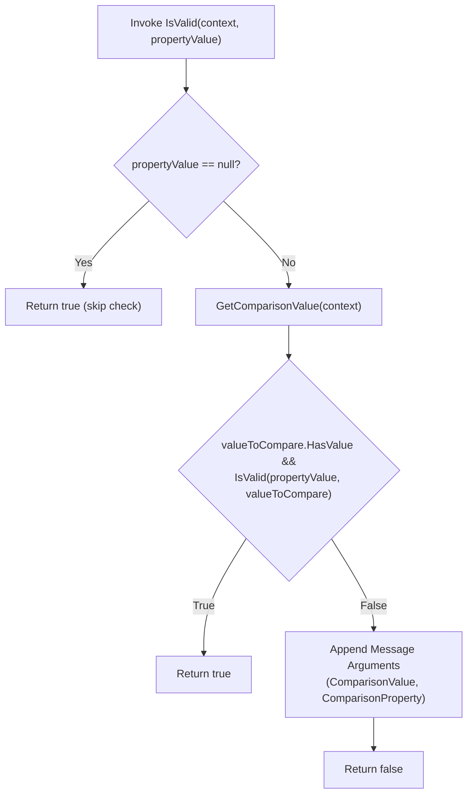
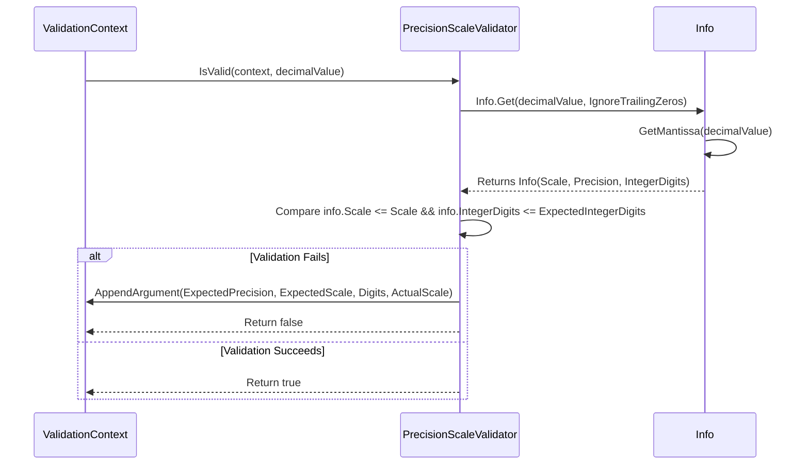

# Built In Validators

<details>
<summary>Relevant source files</summary>

The following files were used as context for generating this wiki page:

- [src/FluentValidation/Validators/AbstractComparisonValidator.cs](https://github.com/FluentValidation/FluentValidation/blob/main/src/FluentValidation/Validators/AbstractComparisonValidator.cs)
- [src/FluentValidation/DefaultValidatorExtensions.cs](https://github.com/FluentValidation/FluentValidation/blob/main/src/FluentValidation/DefaultValidatorExtensions.cs)
- [src/FluentValidation/Validators/EqualValidator.cs](https://github.com/FluentValidation/FluentValidation/blob/main/src/FluentValidation/Validators/EqualValidator.cs)
- [docs/built-in-validators.md](https://github.com/FluentValidation/FluentValidation/blob/main/docs/built-in-validators.md)
- [src/FluentValidation/Validators/RangeValidator.cs](https://github.com/FluentValidation/FluentValidation/blob/main/src/FluentValidation/Validators/RangeValidator.cs)
- [src/FluentValidation/Validators/NotEqualValidator.cs](https://github.com/FluentValidation/FluentValidation/blob/main/src/FluentValidation/Validators/NotEqualValidator.cs)
- [src/FluentValidation.Tests/LessThanValidatorTester.cs](https://github.com/FluentValidation/FluentValidation/blob/main/src/FluentValidation.Tests/LessThanValidatorTester.cs)
- [src/FluentValidation.Tests/LessThanOrEqualToValidatorTester.cs](https://github.com/FluentValidation/FluentValidation/blob/main/src/FluentValidation.Tests/LessThanOrEqualToValidatorTester.cs)
- [src/FluentValidation.Tests/DefaultValidatorExtensionTester.cs](https://github.com/FluentValidation/FluentValidation/blob/main/src/FluentValidation.Tests/DefaultValidatorExtensionTester.cs)
- [src/FluentValidation/Validators/InclusiveBetweenValidator.cs](https://github.com/FluentValidation/FluentValidation/blob/main/src/FluentValidation/Validators/InclusiveBetweenValidator.cs)
- [src/FluentValidation/Validators/CreditCardValidator.cs](https://github.com/FluentValidation/FluentValidation/blob/main/src/FluentValidation/Validators/CreditCardValidator.cs)
- [src/FluentValidation/Validators/EmailValidator.cs](https://github.com/FluentValidation/FluentValidation/blob/main/src/FluentValidation/Validators/EmailValidator.cs)
- [src/FluentValidation/Validators/EmptyValidator.cs](https://github.com/FluentValidation/FluentValidation/blob/main/src/FluentValidation/Validators/EmptyValidator.cs)
- [src/FluentValidation/Validators/EnumValidator.cs](https://github.com/FluentValidation/FluentValidation/blob/main/src/FluentValidation/Validators/EnumValidator.cs)
- [src/FluentValidation/Validators/ExclusiveBetweenValidator.cs](https://github.com/FluentValidation/FluentValidation/blob/main/src/FluentValidation/Validators/ExclusiveBetweenValidator.cs)
- [src/FluentValidation/Validators/GreaterThanValidator.cs](https://github.com/FluentValidation/FluentValidation/blob/main/src/FluentValidation/Validators/GreaterThanValidator.cs)
- [src/FluentValidation/Validators/LengthValidator.cs](https://github.com/FluentValidation/FluentValidation/blob/main/src/FluentValidation/Validators/LengthValidator.cs)
- [src/FluentValidation/Validators/LessThanValidator.cs](https://github.com/FluentValidation/FluentValidation/blob/main/src/FluentValidation/Validators/LessThanValidator.cs)
- [src/FluentValidation/Validators/NotEmptyValidator.cs](https://github.com/FluentValidation/FluentValidation/blob/main/src/FluentValidation/Validators/NotEmptyValidator.cs)
- [src/FluentValidation/Validators/NotNullValidator.cs](https://github.com/FluentValidation/Validators/NotNullValidator.cs)
- [src/FluentValidation/Validators/NullValidator.cs](https://github.com/FluentValidation/FluentValidation/blob/main/src/FluentValidation/Validators/NullValidator.cs)
- [src/FluentValidation/Validators/PrecisionScaleValidator.cs](https://github.com/FluentValidation/FluentValidation/blob/main/src/FluentValidation/Validators/PrecisionScaleValidator.cs)
- [src/FluentValidation/Validators/RegularExpressionValidator.cs](https://github.com/FluentValidation/FluentValidation/blob/main/src/FluentValidation/Validators/RegularExpressionValidator.cs)
</details>

## Overview

FluentValidation provides a comprehensive library of built-in property validators designed to encapsulate common validation rules—such as equality checks, boundary comparisons, string length constraints, regular expression matches, and domain-specific formats like email and credit card numbers. These validators share a common foundational design built upon `PropertyValidator<T, TProperty>`, offering a fluent API exposed via extension methods on `IRuleBuilder<T, TProperty>`. They integrate seamlessly into the validation pipeline by evaluating instances against fixed constants or dynamic lambda expressions while leveraging `ValidationContext<T>` and `MessageFormatter` to populate error parameters dynamically.

The core design philosophy separates rule definition (fluent extension syntax) from validation execution (stateless validator classes). Validators implement specific interfaces (such as `IComparisonValidator`, `IBetweenValidator`, or `ILengthValidator`) to expose internal metadata like expected bounds, target comparison members, and error templates. Null handling is standardized across classes: unless explicitly mandated by `NotNull` or `NotEmpty`, validators typically bypass validation for null property values, leaving nullability enforcement to dedicated null validators.

Sources: [src/FluentValidation/Validators/AbstractComparisonValidator.cs:25-30](https://github.com/FluentValidation/FluentValidation/blob/main/src/FluentValidation/Validators/AbstractComparisonValidator.cs#L25-L30), [src/FluentValidation/DefaultValidatorExtensions.cs:32-35](https://github.com/FluentValidation/FluentValidation/blob/main/src/FluentValidation/DefaultValidatorExtensions.cs#L32-L35), [src/FluentValidation/Validators/RangeValidator.cs:24-27](https://github.com/FluentValidation/FluentValidation/blob/main/src/FluentValidation/Validators/RangeValidator.cs#L24-L27)

## Comparison Validators

Comparison validators enforce relational constraints between a target property and a static constant value or another property retrieved dynamically via a lambda expression. This category includes `EqualValidator`, `NotEqualValidator`, `LessThanValidator`, `LessThanOrEqualValidator`, `GreaterThanValidator`, and `GreaterThanOrEqualValidator`.

Relational comparisons (less than, greater than, etc.) derive from `AbstractComparisonValidator<T, TProperty>`, which constrains generic type parameters to types implementing `IComparable<TProperty>` and `IComparable`. During execution of `AbstractComparisonValidator.IsValid(ValidationContext<T>, TProperty)`, null property values bypass comparison and return `true` immediately, relying on separate `NotNull` rules if nullability is disallowed. 



Sources: [src/FluentValidation/Validators/AbstractComparisonValidator.cs:28-85](https://github.com/FluentValidation/FluentValidation/blob/main/src/FluentValidation/Validators/AbstractComparisonValidator.cs#L28-L85), [src/FluentValidation/DefaultValidatorExtensions.cs:513-517](https://github.com/FluentValidation/FluentValidation/blob/main/src/FluentValidation/DefaultValidatorExtensions.cs#L513-L517)

Equality comparisons (`EqualValidator` and `NotEqualValidator`) support custom `IEqualityComparer<TProperty>` instances. For string properties, FluentValidation defaults equality checks to `StringComparer.Ordinal` unless an explicit comparer or culture-specific option (such as `StringComparer.CurrentCulture`) is provided.

```csharp
// Example usage of comparison validators
RuleFor(customer => customer.CreditLimit).LessThan(customer => customer.MaxCreditLimit);
RuleFor(customer => customer.Surname).Equal("Foo", StringComparer.OrdinalIgnoreCase);
```
Sources: [src/FluentValidation/DefaultValidatorExtensions.cs:297-301](https://github.com/FluentValidation/FluentValidation/blob/main/src/FluentValidation/DefaultValidatorExtensions.cs#L297-L301), [src/FluentValidation/Validators/EqualValidator.cs:27-46](https://github.com/FluentValidation/FluentValidation/blob/main/src/FluentValidation/Validators/EqualValidator.cs#L27-L46), [src/FluentValidation/Validators/NotEqualValidator.cs:25-43](https://github.com/FluentValidation/FluentValidation/blob/main/src/FluentValidation/Validators/NotEqualValidator.cs#L25-L43)

> [!NOTE]
> When comparing nullable properties against constants or cross-property expressions, `AbstractComparisonValidator` wraps accessors and evaluates nullability tuples `(bool HasValue, TProperty Value)` to prevent NullReferenceExceptions during comparison evaluation.

Sources: [src/FluentValidation/Validators/AbstractComparisonValidator.cs:29-50](https://github.com/FluentValidation/FluentValidation/blob/main/src/FluentValidation/Validators/AbstractComparisonValidator.cs#L29-L50)

## Range Validators

Range validators verify that a property value falls within a specified upper and lower bound. The built-in implementations are `InclusiveBetweenValidator` and `ExclusiveBetweenValidator`, both inheriting from the abstract base class `RangeValidator<T, TProperty>`.

The underlying mechanism uses an `IComparer<TProperty>` (defaulting via `RangeValidatorFactory` to `ComparableComparer<TProperty>.Instance`). Upon initialization, the constructor validates that the upper bound (`to`) is greater than or equal to the lower bound (`from`).

> [!WARNING]
> If `comparer.Compare(to, from) == -1`, the range validator throws an `ArgumentOutOfRangeException` during rule construction, failing fast if bounds are inverted.

Sources: [src/FluentValidation/Validators/RangeValidator.cs:27-40](https://github.com/FluentValidation/FluentValidation/blob/main/src/FluentValidation/Validators/RangeValidator.cs#L27-L40), [src/FluentValidation/Validators/RangeValidator.cs:75-84](https://github.com/FluentValidation/FluentValidation/blob/main/src/FluentValidation/Validators/RangeValidator.cs#L75-L84)

During validation, `RangeValidator.IsValid` checks for null values and returns `true` if null. Otherwise, it invokes the subclass implementation of `HasError(TProperty value)`:
- `InclusiveBetweenValidator`: Fails if `Compare(value, From) < 0 || Compare(value, To) > 0`.
- `ExclusiveBetweenValidator`: Fails if `Compare(value, From) <= 0 || Compare(value, To) >= 0`.

```csharp
// Example usage of range validators
RuleFor(x => x.Id).InclusiveBetween(1, 10);
RuleFor(x => x.Id).ExclusiveBetween(1, 10);
```
Sources: [src/FluentValidation/Validators/InclusiveBetweenValidator.cs:26-36](https://github.com/FluentValidation/FluentValidation/blob/main/src/FluentValidation/Validators/InclusiveBetweenValidator.cs#L26-L36), [src/FluentValidation/Validators/ExclusiveBetweenValidator.cs:26-36](https://github.com/FluentValidation/FluentValidation/blob/main/src/FluentValidation/Validators/ExclusiveBetweenValidator.cs#L26-L36)

| Validator Class | Boundary Inclusion | Error Condition (`HasError`) |
| :--- | :--- | :--- |
| `InclusiveBetweenValidator` | Inclusive (`[From, To]`) | `Compare(value, From) < 0 \|\| Compare(value, To) > 0` |
| `ExclusiveBetweenValidator` | Exclusive (`(From, To)`) | `Compare(value, From) <= 0 \|\| Compare(value, To) >= 0` |

Sources: [src/FluentValidation/Validators/InclusiveBetweenValidator.cs:33-35](https://github.com/FluentValidation/FluentValidation/blob/main/src/FluentValidation/Validators/InclusiveBetweenValidator.cs#L33-L35), [src/FluentValidation/Validators/ExclusiveBetweenValidator.cs:33-35](https://github.com/FluentValidation/FluentValidation/blob/main/src/FluentValidation/Validators/ExclusiveBetweenValidator.cs#L33-L35)

## String Validators

String validators specialize in inspecting character sequences, enforcing length constraints, regular expression matching, credit card validation, and email formatting. 

`LengthValidator<T>` serves as the base for length checks, supporting `MinimumLengthValidator`, `MaximumLengthValidator`, and `ExactLengthValidator`. It evaluates string length against static integers or dynamic lambda functions. If `max != -1 && max < min`, an `ArgumentOutOfRangeException` is thrown.

```csharp
RuleFor(customer => customer.Surname).Length(1, 250);
RuleFor(customer => customer.Surname).MaximumLength(250);
RuleFor(customer => customer.Surname).MinimumLength(10);
RuleFor(customer => customer.Surname).Length(5); // Exact length
```
Sources: [src/FluentValidation/Validators/LengthValidator.cs:23-45](https://github.com/FluentValidation/FluentValidation/blob/main/src/FluentValidation/Validators/LengthValidator.cs#L23-L45), [src/FluentValidation/Validators/LengthValidator.cs:76-127](https://github.com/FluentValidation/FluentValidation/blob/main/src/FluentValidation/Validators/LengthValidator.cs#L76-127)

`RegularExpressionValidator<T>` compiles and executes regex checks with a default 2.0-second timeout (`TimeSpan.FromSeconds(2.0)`) to mitigate catastrophic backtracking attacks.

`EmailValidator` operates in two modes defined by `EmailValidationMode`:
- `AspNetCoreCompatible`: Performs a simplified check ensuring the string contains exactly one `@` symbol which is neither the first nor the last character.
- `Net4xRegex`: Utilizes a legacy regular expression for DataAnnotations parity (marked obsolete due to performance and maintenance recommendations).

`CreditCardValidator<T>` applies the Luhn algorithm. It strips hyphens and spaces, reverses the digit sequence, doubles alternating digits, sums constituent digits, and checks whether `checksum % 10 == 0`.

Sources: [src/FluentValidation/Validators/EmailValidator.cs:27-90](https://github.com/FluentValidation/FluentValidation/blob/main/src/FluentValidation/Validators/EmailValidator.cs#L27-L90), [src/FluentValidation/Validators/CreditCardValidator.cs:26-60](https://github.com/FluentValidation/FluentValidation/blob/main/src/FluentValidation/Validators/CreditCardValidator.cs#L26-L60), [src/FluentValidation/Validators/RegularExpressionValidator.cs:73-75](https://github.com/FluentValidation/FluentValidation/blob/main/src/FluentValidation/Validators/RegularExpressionValidator.cs#L73-75)

## Type Validators

Type validators manage presence, nullability, enum membership, and numeric precision/scale constraints.

Nullability and emptiness are handled by `NotNullValidator`, `NullValidator`, `NotEmptyValidator`, and `EmptyValidator`. `NotEmptyValidator` checks that a value is neither null, nor an empty string/whitespace, nor an empty collection (`ICollection.Count == 0` or empty `IEnumerable`), nor the default value for value types (`default`). `EmptyValidator` enforces the exact inverse conditions.

```csharp
RuleFor(x => x.Surname).NotNull();
RuleFor(x => x.Surname).NotEmpty();
RuleFor(x => x.ErrorLevel).IsInEnum();
RuleFor(x => x.Amount).PrecisionScale(4, 2, ignoreTrailingZeros: false);
```
Sources: [src/FluentValidation/Validators/NotNullValidator.cs:21-32](https://github.com/FluentValidation/FluentValidation/blob/main/src/FluentValidation/Validators/NotNullValidator.cs#L21-L32), [src/FluentValidation/Validators/NotEmptyValidator.cs:27-49](https://github.com/FluentValidation/FluentValidation/blob/main/src/FluentValidation/Validators/NotEmptyValidator.cs#L27-L49), [src/FluentValidation/Validators/EmptyValidator.cs:27-49](https://github.com/FluentValidation/FluentValidation/blob/main/src/FluentValidation/Validators/EmptyValidator.cs#L27-L49), [src/FluentValidation/Validators/PrecisionScaleValidator.cs:42-89](https://github.com/FluentValidation/FluentValidation/blob/main/src/FluentValidation/Validators/PrecisionScaleValidator.cs#L42-L89)

`EnumValidator<T, TProperty>` resolves underlying enum types (supporting Nullable wrappers and `[Flags]` attributes). For standard enums, it invokes `Enum.IsDefined`. For `[Flags]` enums, `IsFlagsEnumDefined` extracts the underlying integer representation (`Byte`, `Int16`, `Int32`, `Int64`, `SByte`, `UInt16`, `UInt32`, `UInt64`) and evaluates bitwise mask combinations via `EvaluateFlagEnumValues`.

`PrecisionScaleValidator<T>` validates decimal numbers using an internal record struct `Info` to execute the call chain `IsValid` → `Info.Get` → `GetMantissa`. When `PrecisionScaleValidator.IsValid` executes, it invokes `Info.Get(decimalValue, IgnoreTrailingZeros)`. Inside `Info.Get`, `GetMantissa(value)` extracts the positive decimal mantissa with its scale reset to zero by inspecting underlying `decimal.GetBits`. Trailing zeros are optionally stripped based on `IgnoreTrailingZeros`, after which precision and scale are computed and verified against expected limits.



Sources: [src/FluentValidation/Validators/EnumValidator.cs:26-113](https://github.com/FluentValidation/FluentValidation/blob/main/src/FluentValidation/Validators/EnumValidator.cs#L26-L113), [src/FluentValidation/Validators/PrecisionScaleValidator.cs:66-128](https://github.com/FluentValidation/FluentValidation/blob/main/src/FluentValidation/Validators/PrecisionScaleValidator.cs#L66-L128)

## Related

- [[Custom Validators]]

