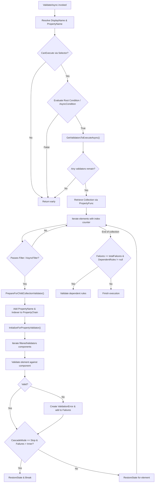
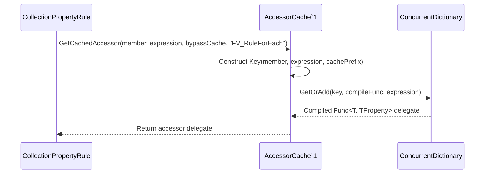

# Collection Validation

<details>
<summary>Relevant source files</summary>

The following files were used as context for generating this wiki page:

- [src/FluentValidation/Validators/ChildValidatorAdaptor.cs](https://github.com/FluentValidation/FluentValidation/blob/main/src/FluentValidation/Validators/ChildValidatorAdaptor.cs)
- [src/FluentValidation/Internal/CollectionPropertyRule.cs](https://github.com/FluentValidation/FluentValidation/blob/main/src/FluentValidation/Internal/CollectionPropertyRule.cs)
- [src/FluentValidation/TestHelper/ValidatorTestExtensions.cs](https://github.com/FluentValidation/FluentValidation/blob/main/src/FluentValidation/TestHelper/ValidatorTestExtensions.cs)
- [src/FluentValidation/Internal/MemberNameValidatorSelector.cs](https://github.com/FluentValidation/FluentValidation/blob/main/src/FluentValidation/Internal/MemberNameValidatorSelector.cs)
- [src/FluentValidation/AbstractValidator.cs](https://github.com/FluentValidation/AbstractValidator.cs)
- [src/FluentValidation.Tests.Benchmarks/Models.cs](https://github.com/FluentValidation/FluentValidation.Tests.Benchmarks/Models.cs)
- [src/FluentValidation.Tests/InheritanceValidatorTest.cs](https://github.com/FluentValidation/FluentValidation.Tests/InheritanceValidatorTest.cs)
- [src/FluentValidation.Tests/ChainedValidationTester.cs](https://github.com/FluentValidation/FluentValidation.Tests/ChainedValidationTester.cs)
- [src/FluentValidation.Tests/ComplexValidationTester.cs](https://github.com/FluentValidation/FluentValidation.Tests/ComplexValidationTester.cs)
- [docs/collections.md](https://github.com/FluentValidation/FluentValidation/blob/main/docs/collections.md)
- [src/FluentValidation/Internal/PropertyRule.cs](https://github.com/FluentValidation/Internal/PropertyRule.cs)
- [src/FluentValidation/Internal/TrackingCollection.cs](https://github.com/FluentValidation/Internal/TrackingCollection.cs)
- [src/FluentValidation/Results/ValidationResult.cs](https://github.com/FluentValidation/Results/ValidationResult.cs)
- [src/FluentValidation/ICollectionRule.cs](https://github.com/FluentValidation/ICollectionRule.cs)
- [src/FluentValidation/Internal/IncludeRule.cs](https://github.com/FluentValidation/Internal/IncludeRule.cs)
- [src/FluentValidation/Internal/ChildRulesContainer.cs](https://github.com/FluentValidation/Internal/ChildRulesContainer.cs)
- [src/FluentValidation.Tests/ValidatorTesterTester.cs](https://github.com/FluentValidation/ValidatorTesterTester.cs)
- [docs/start.md](https://github.com/FluentValidation/docs/start.md)
- [src/FluentValidation.Tests/CascadingFailuresTester.cs](https://github.com/FluentValidation/CascadingFailuresTester.cs)
- [docs/inheritance.md](https://github.com/FluentValidation/docs/inheritance.md)
- [src/FluentValidation/AsyncValidatorInvokedSynchronouslyException.cs](https://github.com/FluentValidation/AsyncValidatorInvokedSynchronouslyException.cs)
- [src/FluentValidation/Internal/AccessorCache.cs](https://github.com/FluentValidation/Internal/AccessorCache.cs)
</details>

## Overview

### Overview Introduction
Collection Validation in FluentValidation provides the architectural foundation for evaluating sequences, arrays, and other `IEnumerable<T>` properties item-by-item rather than treating the collection as a monolithic scalar object. When domain models contain lists of elements (such as customer orders, address lines, or polymorphic items), standard single-property rules are insufficient for generating accurate error paths or executing discrete sub-validators per element. This component solves the challenge of iterating collections while preserving contextual state, correctly building hierarchical property paths with indexers (e.g., `Orders[0].Total`), evaluating synchronous and asynchronous filters, and coordinating cascading failure modes across collection elements.

Sources: [docs/collections.md:1-119](https://github.com/FluentValidation/FluentValidation/blob/main/docs/collections.md#L1-L119)

At the core of the architecture lies `CollectionPropertyRule<T, TElement>`, which implements `ICollectionRule<T, TElement>` and `IValidationRuleInternal<T, TElement>`. Unlike scalar `PropertyRule<T, TProperty>`, a collection rule compiles an accessor via `AccessorCache<T>` using a dedicated prefix (`"FV_RuleForEach"`) to ensure that collection-access delegates are never incorrectly shared with scalar property accessors.

Sources: [src/FluentValidation/Internal/CollectionPropertyRule.cs:31-67](https://github.com/FluentValidation/Internal/CollectionPropertyRule.cs#L31-L67), [src/FluentValidation/Internal/AccessorCache.cs:24-68](https://github.com/FluentValidation/Internal/AccessorCache.cs#L24-L68)

During execution, the engine evaluates root-level conditions, retrieves the collection instance, iterates over elements with optional `Filter` or `AsyncFilter` predicates, formats collection indexers via `IndexBuilder`, manipulates property chains, and dispatches validation components down to child validators or individual property validators.

Sources: [src/FluentValidation/Internal/CollectionPropertyRule.cs:69-199](https://github.com/FluentValidation/Internal/CollectionPropertyRule.cs#L69-L199)

This subsystem integrates deeply with validation selectors (`MemberNameValidatorSelector`), state management (`ValidationContext<T>`), and message formatting (`MessageFormatter`). By injecting placeholders such as `{CollectionIndex}` into the message formatter and preserving state in `RootContextData`, error messages accurately reference individual collection indices. Furthermore, collection validation fully supports complex child objects via `SetValidator` or inline `ChildRules`, as well as polymorphic collections via `SetInheritanceValidator`.

Sources: [src/FluentValidation/Validators/ChildValidatorAdaptor.cs:51-125](https://github.com/FluentValidation/Validators/ChildValidatorAdaptor.cs#L51-L125), [docs/inheritance.md:89-113](https://github.com/FluentValidation/FluentValidation/blob/main/docs/inheritance.md#L89-L113)

---

## Public API Surface and Collection Rule Definition

### API Overview
Collection rules are declared using the `RuleForEach` extension method exposed on `AbstractValidator<T>`. This method accepts an expression pointing to an `IEnumerable<TElement>` property and instantiates a `CollectionPropertyRule<T, TElement>`, adding it to the validator's internal rule collection. 

Sources: [src/FluentValidation/AbstractValidator.cs:219-230](https://github.com/FluentValidation/AbstractValidator.cs#L219-L230)

Alternatively, developers can use `ForEach` as part of a regular `RuleFor` chain to mix collection-level validation (e.g., checking collection `Count`) with element-level validation.

Sources: [docs/collections.md:72-118](https://github.com/FluentValidation/FluentValidation/blob/main/docs/collections.md#L72-L118)

The public interface `ICollectionRule<T, TElement>` exposes configuration hooks for customizing element filtering and index generation:

Sources: [src/FluentValidation/ICollectionRule.cs:25-46](https://github.com/FluentValidation/ICollectionRule.cs#L25-L46)

| Property / Method | Type | Description |
| :--- | :--- | :--- |
| `Filter` | `Func<TElement, bool>` | Synchronous predicate to include or exclude specific items in the collection. |
| `AsyncFilter` | `Func<TElement, Task<bool>>` | Asynchronous predicate to include or exclude specific items in the collection. |
| `IndexBuilder` | `Func<T, IEnumerable<TElement>, TElement, int, string>` | Custom builder for constructing the indexer string injected into property paths. |

Sources: [src/FluentValidation/ICollectionRule.cs:30-46](https://github.com/FluentValidation/ICollectionRule.cs#L30-L46)

```csharp
public class CustomerValidator : AbstractValidator<Customer> {
    public CustomerValidator() {
        RuleForEach(x => x.Orders)
            .Where(order => order.Total > 0)
            .SetValidator(new OrderValidator());
    }
}
```

Sources: [docs/collections.md:72-93](https://github.com/FluentValidation/FluentValidation/blob/main/docs/collections.md#L72-L93)

---

## Execution Control Flow and Iteration Mechanism

### Execution Flow
When `ValidateAsync` (or its synchronous generated counterpart) is invoked on a `CollectionPropertyRule<T, TElement>`, the rule executes a precise sequence of operations to resolve property names, evaluate root conditions, filter validators, iterate over collection elements, and manage property path chains.

Sources: [src/FluentValidation/Internal/CollectionPropertyRule.cs:69-199](https://github.com/FluentValidation/Internal/CollectionPropertyRule.cs#L69-L199)



Sources: [src/FluentValidation/Internal/CollectionPropertyRule.cs:69-199](https://github.com/FluentValidation/Internal/CollectionPropertyRule.cs#L69-L199)

---

## Accessor Caching and Call-Chain Walkthrough

### Accessor Compilation and Caching Mechanism
Collection property rules rely on `AccessorCache<T>` to compile and cache delegate accessors for collection members. When `CollectionPropertyRule.Create` is called, it executes the verified call chain: `Create` calls `GetCachedAccessor`, which instantiates a `Key`.

Sources: [src/FluentValidation/Internal/CollectionPropertyRule.cs:62-67](https://github.com/FluentValidation/Internal/CollectionPropertyRule.cs#L62-L67), [src/FluentValidation/Internal/AccessorCache.cs:24-68](https://github.com/FluentValidation/Internal/AccessorCache.cs#L24-L68)

1. `CollectionPropertyRule.Create()` extracts the member info and invokes `AccessorCache<T>.GetCachedAccessor(member, expression, bypassCache, "FV_RuleForEach")`.
2. `AccessorCache<T>.GetCachedAccessor()` initializes a new `Key` object using the member info, expression, and the `"FV_RuleForEach"` prefix to isolate collection access delegates from scalar accessors.
3. The cache lookup `_cache.GetOrAdd()` fetches the compiled delegate or compiles the expression if absent.

Sources: [src/FluentValidation/Internal/CollectionPropertyRule.cs:62-67](https://github.com/FluentValidation/Internal/CollectionPropertyRule.cs#L62-L67), [src/FluentValidation/Internal/AccessorCache.cs:24-46](https://github.com/FluentValidation/Internal/AccessorCache.cs#L24-L46), [src/FluentValidation/Internal/AccessorCache.cs:54-68](https://github.com/FluentValidation/Internal/AccessorCache.cs#L54-L68)



Sources: [src/FluentValidation/Internal/CollectionPropertyRule.cs:62-67](https://github.com/FluentValidation/Internal/CollectionPropertyRule.cs#L62-L67), [src/FluentValidation/Internal/AccessorCache.cs:24-46](https://github.com/FluentValidation/Internal/AccessorCache.cs#L24-L46), [src/FluentValidation/Internal/AccessorCache.cs:54-68](https://github.com/FluentValidation/Internal/AccessorCache.cs#L54-L68)

---

## Index Generation and Placeholder Management

### Indexer and Context Flow
To ensure error messages correctly identify which collection item failed validation, FluentValidation generates structured property paths using indexers and passes collection index metadata through the validation context.

Sources: [docs/collections.md:26-36](https://github.com/FluentValidation/FluentValidation/blob/main/docs/collections.md#L26-L36)

By default, `CollectionPropertyRule` constructs an indexer string using the zero-based element index: `index.ToString()`, formatted via `context.PropertyChain.AddIndexer(indexer, useDefaultIndexFormat)` which wraps the index in brackets (e.g., `Orders[0]`). Developers can override this behavior by supplying a custom `IndexBuilder` delegate implementing `Func<T, IEnumerable<TElement>, TElement, int, string>`.

Sources: [src/FluentValidation/Internal/CollectionPropertyRule.cs:150-156](https://github.com/FluentValidation/Internal/CollectionPropertyRule.cs#L150-L156)

During validation component execution, the engine populates the message formatter with the current index:
```csharp
context.MessageFormatter.Reset();
context.MessageFormatter.AppendArgument("CollectionIndex", index);
```
This enables error messages to reference `{CollectionIndex}` directly (e.g., `"Address {CollectionIndex} is required."`). Furthermore, `ChildValidatorAdaptor` detects when it resides inside a collection rule by checking `context.MessageFormatter.PlaceholderValues`, caching the index in `RootContextData["__FV_CollectionIndex"]` so that nested child validators inherit the correct collection index context.

Sources: [src/FluentValidation/Internal/CollectionPropertyRule.cs:167-170](https://github.com/FluentValidation/Internal/CollectionPropertyRule.cs#L167-L170), [docs/collections.md:26-36](https://github.com/FluentValidation/FluentValidation/blob/main/docs/collections.md#L26-L36)

> [!NOTE]
> `ChildValidatorAdaptor` preserves the collection index placeholder across nested validation calls by temporarily caching `originalIndex` in `RootContextData` under `__FV_CollectionIndex`, and restores or removes the key upon completion of the child validation run.

Sources: [src/FluentValidation/Validators/ChildValidatorAdaptor.cs:107-125](https://github.com/FluentValidation/Validators/ChildValidatorAdaptor.cs#L107-L125)

---

## Selector Normalization and Collection Path Matching

### Selector Matching
When validation is restricted to specific properties using validation strategies (such as `IncludeProperties("Orders[0].Amount")` or `IncludeProperties("Orders[].Amount")`), `MemberNameValidatorSelector` evaluates whether a given rule should execute against a property path.

Sources: [src/FluentValidation/Internal/MemberNameValidatorSelector.cs:30-137](https://github.com/FluentValidation/Internal/MemberNameValidatorSelector.cs#L30-L137)

When evaluating collection property paths, `MemberNameValidatorSelector` utilizes a compiled regular expression `CollectionIndexNormalizer()` matching `[.*?[]` to normalize explicit indexer paths into wildcard paths. 

Sources: [src/FluentValidation/Internal/MemberNameValidatorSelector.cs:30-36](https://github.com/FluentValidation/Internal/MemberNameValidatorSelector.cs#L30-L36)

```csharp
[GeneratedRegex(@"\[.*?\]")]
private static partial Regex CollectionIndexNormalizer();
```

Sources: [src/FluentValidation/Internal/MemberNameValidatorSelector.cs:34-36](https://github.com/FluentValidation/Internal/MemberNameValidatorSelector.cs#L34-L36)

If a member name for inclusion contains a wildcard `[]` (e.g., `Orders[].Name`), `MemberNameValidatorSelector` normalizes the runtime property path (converting `Orders[0].Name` to `Orders[].Name`) before performing equality and prefix checks. This enables selective validation of all items within a collection or matching nested properties across collection elements.

Sources: [src/FluentValidation/Internal/MemberNameValidatorSelector.cs:116-133](https://github.com/FluentValidation/Internal/MemberNameValidatorSelector.cs#L116-L133)

```csharp
if (memberName.Contains("[]")) {
    if (normalizedPropertyPath == null) {
        normalizedPropertyPath = CollectionIndexNormalizer().Replace(propertyPath, "[]");
    }

    if (memberName == normalizedPropertyPath) {
        return true;
    }

    if (memberName.StartsWith(normalizedPropertyPath + ".")) {
        return true;
    }

    if (memberName.StartsWith(normalizedPropertyPath + "[")) {
        return true;
    }
}
```

Sources: [src/FluentValidation/Internal/MemberNameValidatorSelector.cs:116-133](https://github.com/FluentValidation/Internal/MemberNameValidatorSelector.cs#L116-L133)

---

## Cascading Failures and Stop Modes in Collections

### Cascade Execution
Collection rule execution interacts with two distinct cascade tiers: class-level cascade mode (`ClassLevelCascadeMode`) and rule-level cascade mode (`RuleLevelCascadeMode` or rule-specific `.Cascade(CascadeMode.Stop)`).

Sources: [src/FluentValidation/AbstractValidator.cs:37-81](https://github.com/FluentValidation/AbstractValidator.cs#L37-L81), [src/FluentValidation.Tests/CascadingFailuresTester.cs:452-477](https://github.com/FluentValidation/CascadingFailuresTester.cs#L452-L477)

Within `CollectionPropertyRule.ValidateAsync`, when iterating over elements and their respective validation components, the engine checks whether a failure occurred and whether cascade mode is set to stop:

Sources: [src/FluentValidation/Internal/CollectionPropertyRule.cs:179-184](https://github.com/FluentValidation/Internal/CollectionPropertyRule.cs#L179-L184)

```csharp
// If there has been at least one failure, and our CascadeMode has been set to Stop
// then don't continue to the next rule
if (context.Failures.Count > totalFailuresInner && cascade == CascadeMode.Stop) {
    context.RestoreState();
    goto AfterValidate; // 🙃
}
```

Sources: [src/FluentValidation/Internal/CollectionPropertyRule.cs:179-184](https://github.com/FluentValidation/Internal/CollectionPropertyRule.cs#L179-L184)

> [!IMPORTANT]
> The condition checks `context.Failures.Count > totalFailuresInner` (where `totalFailuresInner` records the failure count before validating the current element). This guarantees that `CascadeMode.Stop` halts validation for the *current element* when a component fails, but correctly allows subsequent elements in the collection to be validated. A bug in earlier versions that checked against total rule failures rather than per-element failures was resolved to ensure proper iteration across collection items.

Sources: [src/FluentValidation/Internal/CollectionPropertyRule.cs:179-184](https://github.com/FluentValidation/Internal/CollectionPropertyRule.cs#L179-L184), [src/FluentValidation.Tests/CascadingFailuresTester.cs:452-477](https://github.com/FluentValidation/CascadingFailuresTester.cs#L452-L477)

---

## Complex and Polymorphic Collections

### Complex and Polymorphic Mapping
When collections contain complex objects or polymorphic hierarchies, collection validation combines `RuleForEach` with child validators, inline child rules, or inheritance validators.

Sources: [docs/collections.md:38-85](https://github.com/FluentValidation/FluentValidation/blob/main/docs/collections.md#L38-L85), [docs/inheritance.md:89-113](https://github.com/FluentValidation/FluentValidation/blob/main/docs/inheritance.md#L89-L113)

### 1. Complex Object Validation via Child Validator
```csharp
public class CustomerValidator : AbstractValidator<Customer> {
    public CustomerValidator() {
        RuleForEach(x => x.Orders).SetValidator(new OrderValidator());
    }
}
```

Sources: [docs/collections.md:63-70](https://github.com/FluentValidation/FluentValidation/blob/main/docs/collections.md#L63-L70)

### 2. Inline Child Rules (`ChildRules`)
Introduced to define element-level rules directly within the collection rule builder without declaring a separate validator class:
```csharp
public class CustomerValidator : AbstractValidator<Customer> {
    public CustomerValidator() {
        RuleForEach(x => x.Orders).ChildRules(order => {
            order.RuleFor(x => x.Total).GreaterThan(0);
        });
    }
}
```

Sources: [docs/collections.md:75-85](https://github.com/FluentValidation/FluentValidation/blob/main/docs/collections.md#L75-L85)

### 3. Polymorphic Collection Validation (`SetInheritanceValidator`)
When collection elements implement a base class or interface with multiple distinct implementations, `SetInheritanceValidator` maps runtime types to specific validators:
```csharp
public class ContactRequestValidator : AbstractValidator<ContactRequest> {
    public ContactRequestValidator() {
        RuleForEach(x => x.Contacts).SetInheritanceValidator(v => {
            v.Add<Organisation>(new OrganisationValidator());
            v.Add<Person>(new PersonValidator());
        });
    }
}
```

Sources: [docs/inheritance.md:100-113](https://github.com/FluentValidation/FluentValidation/blob/main/docs/inheritance.md#L100-L113)

---

## Design Trade-Offs

### Trade-Off Analysis
| Design Choice | Benefit | Cost |
| :--- | :--- | :--- |
| **Dedicated `CollectionPropertyRule` class** | Separates collection iteration logic, index tracking, and path building from scalar property rules. | Additional class hierarchy and rule type specialization. |
| **Separate `FV_RuleForEach` accessor cache prefix** | Prevents expression cache collisions between scalar property access and collection property access. | Minor memory overhead in `AccessorCache<T>` for dual-registered expressions. |
| **Per-element failure count tracking (`totalFailuresInner`)** | Allows `CascadeMode.Stop` to halt validation on the failing element while continuing evaluation of subsequent items. | Requires state tracking per loop iteration before validating components. |
| **Regex-based collection index normalization (`CollectionIndexNormalizer`)** | Enables flexible property selection with wildcard brackets (`[]`) across nested collections. | Regular expression evaluation overhead during selector execution. |

Sources: [src/FluentValidation/Internal/CollectionPropertyRule.cs:31-188](https://github.com/FluentValidation/Internal/CollectionPropertyRule.cs#L31-L188), [src/FluentValidation/Internal/AccessorCache.cs:24-68](https://github.com/FluentValidation/Internal/AccessorCache.cs#L24-L68), [src/FluentValidation/Internal/MemberNameValidatorSelector.cs:30-137](https://github.com/FluentValidation/Internal/MemberNameValidatorSelector.cs#L30-L137)

## Related

- [[Validation Core]]
- [[Inheritance and Polymorphism]]

