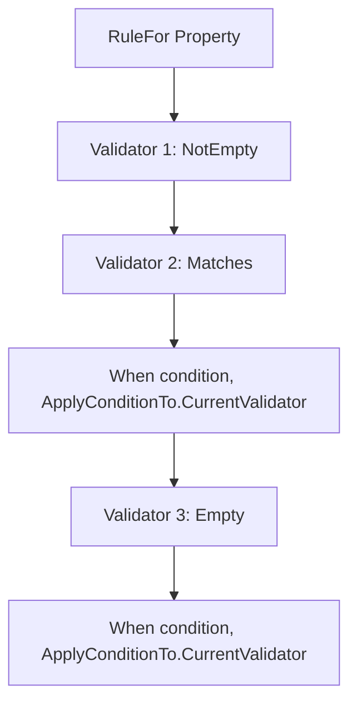
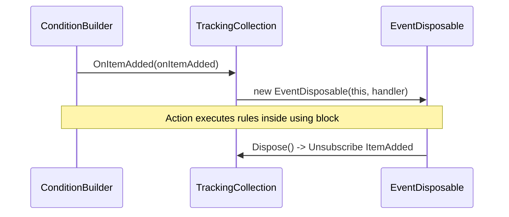
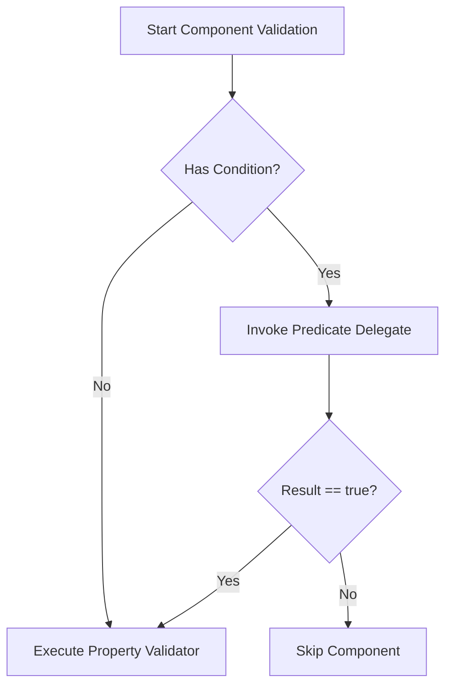

# Conditional Validation

<details>
<summary>Relevant source files</summary>

The following files were used as context for generating this wiki page:

- [src/FluentValidation/DefaultValidatorOptions.cs](https://github.com/FluentValidation/FluentValidation/blob/main/src/FluentValidation/DefaultValidatorOptions.cs)
- [src/FluentValidation/Internal/RuleBase.cs](https://github.com/FluentValidation/FluentValidation/blob/main/src/FluentValidation/Internal/RuleBase.cs)
- [src/FluentValidation/TestHelper/ValidatorTestExtensions.cs](https://github.com/FluentValidation/TestHelper/ValidatorTestExtensions.cs)
- [src/FluentValidation/Internal/ConditionBuilder.cs](https://github.com/FluentValidation/Internal/ConditionBuilder.cs)
- [src/FluentValidation/AbstractValidator.cs](https://github.com/FluentValidation/AbstractValidator.cs)
- [src/FluentValidation/Internal/RulesetValidatorSelector.cs](https://github.com/FluentValidation/Internal/RulesetValidatorSelector.cs)
- [src/FluentValidation/Internal/MemberNameValidatorSelector.cs](https://github.com/FluentValidation/Internal/MemberNameValidatorSelector.cs)
- [src/FluentValidation/Internal/RuleComponent.cs](https://github.com/FluentValidation/Internal/RuleComponent.cs)
- [docs/conditions.md](https://github.com/FluentValidation/FluentValidation/blob/main/docs/conditions.md)
- [src/FluentValidation/Internal/ValidationStrategy.cs](https://github.com/FluentValidation/Internal/ValidationStrategy.cs)
- [src/FluentValidation.Tests.Benchmarks/Models.cs](https://github.com/FluentValidation.Tests.Benchmarks/Models.cs)
- [src/FluentValidation/Internal/IValidatorSelector.cs](https://github.com/FluentValidation/Internal/IValidatorSelector.cs)
- [src/FluentValidation/Internal/DefaultValidatorSelector.cs](https://github.com/FluentValidation/Internal/DefaultValidatorSelector.cs)
- [src/FluentValidation/IValidationRule.cs](https://github.com/FluentValidation/IValidationRule.cs)
- [src/FluentValidation/Enums.cs](https://github.com/FluentValidation/Enums.cs)
- [docs/dependentrules.md](https://github.com/FluentValidation/FluentValidation/blob/main/docs/dependentrules.md)
- [src/FluentValidation/Internal/IRuleComponent.cs](https://github.com/FluentValidation/Internal/IRuleComponent.cs)
- [src/FluentValidation/Internal/TrackingCollection.cs](https://github.com/FluentValidation/Internal/TrackingCollection.cs)
</details>

## Overview

### Overview

Conditional validation in FluentValidation provides a robust mechanism to dynamically control when validation rules and individual rule components execute based on runtime state. By leveraging fluent extension methods such as `When`, `Unless`, `WhenAsync`, and `UnlessAsync`, developers can construct sophisticated validation workflows that adapt to contextual criteria without cluttering object models. The system addresses the common problem of conditional dependency by allowing predicates to govern single validators, entire rule chains, or multi-rule blocks via scoped tracking mechanisms. Core architectural components like `ConditionBuilder`, `AsyncConditionBuilder`, and `TrackingCollection` coordinate condition evaluation across rules, integrating seamlessly with validation strategies, rulesets, and testing harnesses to verify complex execution paths accurately. 

Sources: [src/FluentValidation/DefaultValidatorOptions.cs#L173-L379](https://github.com/FluentValidation/FluentValidation/blob/main/src/FluentValidation/DefaultValidatorOptions.cs#L173-L379), [src/FluentValidation/Internal/ConditionBuilder.cs#L26-L203](https://github.com/FluentValidation/Internal/ConditionBuilder.cs#L26-L203), [src/FluentValidation/AbstractValidator.cs#L251-L340](https://github.com/FluentValidation/AbstractValidator.cs#L251-L340), [src/FluentValidation/Internal/TrackingCollection.cs#L25-L98](https://github.com/FluentValidation/Internal/TrackingCollection.cs#L25-L98)

## Conditional Validation API Surface

### Overview

The conditional validation API surface is exposed via fluent extension methods defined on `IRuleBuilderOptions`, `IRuleBuilderOptionsConditions`, and instance methods on `AbstractValidator`. These methods allow developers to attach synchronous and asynchronous predicates that govern when rules or specific rule components execute. The API supports both positive conditions via `When` and `WhenAsync` and inverted conditions via `Unless` and `UnlessAsync`. 

Sources: [src/FluentValidation/DefaultValidatorOptions.cs#L173-L379](https://github.com/FluentValidation/FluentValidation/blob/main/src/FluentValidation/DefaultValidatorOptions.cs#L173-L379), [src/FluentValidation/AbstractValidator.cs#L251-L340](https://github.com/FluentValidation/AbstractValidator.cs#L251-L340)

### Synchronous and Asynchronous Condition Methods

The extension methods in `DefaultValidatorOptions` accept various predicate signatures ranging from simple instance checks to context-aware evaluations. Each method checks for null predicates via `ArgumentNullException.ThrowIfNull` and routes execution through internal configuration mechanisms. 

Sources: [src/FluentValidation/DefaultValidatorOptions.cs#L173-L379](https://github.com/FluentValidation/DefaultValidatorOptions.cs#L173-L379)

```csharp
public static IRuleBuilderOptions<T, TProperty> When<T, TProperty>(
    this IRuleBuilderOptions<T, TProperty> rule, 
    Func<T, ValidationContext<T>, bool> predicate, 
    ApplyConditionTo applyConditionTo = ApplyConditionTo.AllValidators) {
    ArgumentNullException.ThrowIfNull(predicate);
    Configurable(rule).ApplyCondition(ctx => predicate(ctx.InstanceToValidate, ValidationContext<T>.GetFromNonGenericContext(ctx)), applyConditionTo);
    return rule;
}
```
Sources: [src/FluentValidation/DefaultValidatorOptions.cs#L199-L204](https://github.com/FluentValidation/DefaultValidatorOptions.cs#L199-L204)

The API surface provides overloads for both single property rules and multi-rule blocks defined directly on validator classes.

| Method Signature | Target Scope | Behavior / Predicate Type |
| :--- | :--- | :--- |
| `When(Func<T, bool>, ApplyConditionTo)` | Rule Builder | Executes only if predicate returns `true` using model instance. |
| `When(Func<T, ValidationContext<T>, bool>, ApplyConditionTo)` | Rule Builder | Executes only if predicate returns `true` using instance and validation context. |
| `Unless(Func<T, bool>, ApplyConditionTo)` | Rule Builder | Executes only if predicate returns `false` (inverted `When`). |
| `Unless(Func<T, ValidationContext<T>, bool>, ApplyConditionTo)` | Rule Builder | Executes only if predicate returns `false` using instance and context. |
| `WhenAsync(Func<T, CancellationToken, Task<bool>>, ApplyConditionTo)` | Rule Builder | Asynchronous condition evaluating model and cancellation token. |
| `WhenAsync(Func<T, ValidationContext<T>, CancellationToken, Task<bool>>, ApplyConditionTo)` | Rule Builder | Asynchronous condition evaluating model, context, and cancellation token. |
| `UnlessAsync(Func<T, CancellationToken, Task<bool>>, ApplyConditionTo)` | Rule Builder | Inverted asynchronous condition evaluating model and token. |
| `UnlessAsync(Func<T, ValidationContext<T>, CancellationToken, Task<bool>>, ApplyConditionTo)` | Rule Builder | Inverted asynchronous condition evaluating model, context, and token. |

Sources: [src/FluentValidation/DefaultValidatorOptions.cs#L173-L379](https://github.com/FluentValidation/DefaultValidatorOptions.cs#L173-L379)

> [!NOTE]
> When calling `Unless` or `UnlessAsync`, the implementation internally negates the result of the provided predicate and invokes `When` or `WhenAsync`, unifying condition storage and evaluation under the hood. 

Sources: [src/FluentValidation/DefaultValidatorOptions.cs#L255-L258](https://github.com/FluentValidation/DefaultValidatorOptions.cs#L255-L258), [src/FluentValidation/DefaultValidatorOptions.cs#L363-L366](https://github.com/FluentValidation/DefaultValidatorOptions.cs#L363-L366)

### Application Scope Control via `ApplyConditionTo`

When conditions are chained onto property rules, developers can control how widely the predicate applies within the fluent chain by specifying the `ApplyConditionTo` enumeration. 

Sources: [docs/conditions.md#L31-L39](https://github.com/FluentValidation/FluentValidation/blob/main/docs/conditions.md#L31-L39), [src/FluentValidation/Enums.cs#L41-L52](https://github.com/FluentValidation/Enums.cs#L41-L52)


Sources: [docs/conditions.md#L43-L50](https://github.com/FluentValidation/FluentValidation/blob/main/docs/conditions.md#L43-L50)

> [!WARNING]
> By default, `ApplyConditionTo` is set to `ApplyConditionTo.AllValidators`, which retroactively applies the condition to all preceding validators declared within the same method call chain. To restrict a condition strictly to the validator that immediately precedes it, developers must explicitly pass `ApplyConditionTo.CurrentValidator`. 

Sources: [docs/conditions.md#L31-L39](https://github.com/FluentValidation/FluentValidation/blob/main/docs/conditions.md#L31-L39), [src/FluentValidation/Enums.cs#L41-L52](https://github.com/FluentValidation/Enums.cs#L41-L52)

## ConditionBuilder and TrackingCollection Mechanics

### Overview

The `ConditionBuilder`, `AsyncConditionBuilder`, `ConditionOtherwiseBuilder`, and `TrackingCollection` classes manage how shared conditional blocks apply to multiple validation rules declared within an `Action` delegate. When a developer scopes several rules inside a `When` or `WhenAsync` block, `TrackingCollection` intercepts the registration of each rule via ephemeral event subscriptions and disposables, ensuring that the shared predicate is correctly applied to every rule created inside the block. 

Sources: [src/FluentValidation/Internal/ConditionBuilder.cs#L26-L145](https://github.com/FluentValidation/Internal/ConditionBuilder.cs#L26-L145), [src/FluentValidation/Internal/TrackingCollection.cs#L25-L82](https://github.com/FluentValidation/Internal/TrackingCollection.cs#L25-L82)

### Call-Chain Execution Walkthroughs

#### Synchronous `Unless` Chain

### Overview
This subsection details the step-by-step mechanism of synchronous inverse conditions.

1. `Unless` — Wraps the negated predicate and delegates invocation to `When`. Sources: [src/FluentValidation/Internal/ConditionBuilder.cs#L87-L89](https://github.com/FluentValidation/FluentValidation/blob/main/src/FluentValidation/Internal/ConditionBuilder.cs#L87-L89)
2. `When` — Instantiates a local rule list and activates tracking on the rules collection. Sources: [src/FluentValidation/Internal/ConditionBuilder.cs#L39-L44](https://github.com/FluentValidation/Internal/ConditionBuilder.cs#L39-L44)
3. `OnItemAdded` — Subscribes the list addition handler to `ItemAdded` and returns an `EventDisposable`. Sources: [src/FluentValidation/Internal/TrackingCollection.cs#L49-L52](https://github.com/FluentValidation/Internal/TrackingCollection.cs#L49-L52)
4. `EventDisposable` — Unsubscribes the handler upon disposal when exiting the `using` block. Sources: [src/FluentValidation/Internal/TrackingCollection.cs#L70-L82](https://github.com/FluentValidation/Internal/TrackingCollection.cs#L70-L82)

Sources: [src/FluentValidation/Internal/ConditionBuilder.cs#L39-L89](https://github.com/FluentValidation/Internal/ConditionBuilder.cs#L39-L89), [src/FluentValidation/Internal/TrackingCollection.cs#L49-L82](https://github.com/FluentValidation/Internal/TrackingCollection.cs#L49-L82)

#### Asynchronous `UnlessAsync` Chain

### Overview
This subsection details the step-by-step mechanism of asynchronous inverse conditions.

1. `UnlessAsync` — Wraps the negated asynchronous predicate and delegates to `WhenAsync`. Sources: [src/FluentValidation/Internal/ConditionBuilder.cs#L152-L154](https://github.com/FluentValidation/Internal/ConditionBuilder.cs#L152-L154)
2. `WhenAsync` — Sets up asynchronous tracking for rules created within the encapsulated action. Sources: [src/FluentValidation/Internal/ConditionBuilder.cs#L105-L110](https://github.com/FluentValidation/Internal/ConditionBuilder.cs#L105-L110)
3. `OnItemAdded` — Registers the rule capture handler on the collection. Sources: [src/FluentValidation/Internal/TrackingCollection.cs#L49-L52](https://github.com/FluentValidation/Internal/TrackingCollection.cs#L49-L52)
4. `EventDisposable` — Cleans up the event subscription on disposal. Sources: [src/FluentValidation/Internal/TrackingCollection.cs#L70-L82](https://github.com/FluentValidation/Internal/TrackingCollection.cs#L70-L82)

Sources: [src/FluentValidation/Internal/ConditionBuilder.cs#L105-L154](https://github.com/FluentValidation/Internal/ConditionBuilder.cs#L105-L154), [src/FluentValidation/Internal/TrackingCollection.cs#L49-L82](https://github.com/FluentValidation/Internal/TrackingCollection.cs#L49-L82)

#### Otherwise Chain

### Overview
This subsection details the step-by-step mechanism of fallback otherwise condition blocks.

1. `Otherwise` — Creates a secondary rule tracking list for fallback rules. Sources: [src/FluentValidation/Internal/ConditionBuilder.cs#L166-L173](https://github.com/FluentValidation/Internal/ConditionBuilder.cs#L166-L173)
2. `OnItemAdded` — Attaches the rule collection handler during `Otherwise` execution. Sources: [src/FluentValidation/Internal/TrackingCollection.cs#L49-L52](https://github.com/FluentValidation/Internal/TrackingCollection.cs#L49-L52)
3. `EventDisposable` — Removes the event handler upon block exit. Sources: [src/FluentValidation/Internal/TrackingCollection.cs#L70-L82](https://github.com/FluentValidation/Internal/TrackingCollection.cs#L70-L82)

Sources: [src/FluentValidation/Internal/ConditionBuilder.cs#L166-L178](https://github.com/FluentValidation/Internal/ConditionBuilder.cs#L166-L178), [src/FluentValidation/Internal/TrackingCollection.cs#L49-L82](https://github.com/FluentValidation/Internal/TrackingCollection.cs#L49-L82)


Sources: [src/FluentValidation/Internal/ConditionBuilder.cs#L39-L44](https://github.com/FluentValidation/Internal/ConditionBuilder.cs#L39-L44), [src/FluentValidation/Internal/TrackingCollection.cs#L49-L82](https://github.com/FluentValidation/Internal/TrackingCollection.cs#L49-L82)

> [!NOTE]
> Shared conditions generate a unique identifier prefixed with `_FV_Condition_` or `_FV_AsyncCondition_` combined with a `Guid`. This identifier is used to cache predicate evaluation results inside `SharedConditionCache` for the duration of a validation run against a specific model instance. 

Sources: [src/FluentValidation/Internal/ConditionBuilder.cs#L47-L70](https://github.com/FluentValidation/Internal/ConditionBuilder.cs#L47-L70), [src/FluentValidation/Internal/ConditionBuilder.cs#L113-L136](https://github.com/FluentValidation/Internal/ConditionBuilder.cs#L113-L136)

### TrackingCollection and Disposable Architecture

| Class / Component | Purpose | Key Members | Sources |
|-------------------|---------|-------------|---------|
| `TrackingCollection<T>` | Intercepts item additions via event publishers or capture delegates while maintaining an inner `List<T>`. | `Add(T)`, `OnItemAdded(Action<T>)`, `Capture(Action<T>)`, `ItemAdded` | [src/FluentValidation/Internal/TrackingCollection.cs#L25-L57](https://github.com/FluentValidation/Internal/TrackingCollection.cs#L25-L57) |
| `EventDisposable` | Removes the event subscription from `TrackingCollection.ItemAdded` upon disposal. | `Dispose()` | [src/FluentValidation/Internal/TrackingCollection.cs#L70-L82](https://github.com/FluentValidation/Internal/TrackingCollection.cs#L70-L82) |
| `CaptureDisposable` | Temporarily overrides the capture delegate target on `TrackingCollection` during specific operations. | `CaptureDisposable(...)`, `Dispose()` | [src/FluentValidation/Internal/TrackingCollection.cs#L84-L97](https://github.com/FluentValidation/Internal/TrackingCollection.cs#L84-L97) |
| `ConditionBuilder<T>` | Builds shared synchronous conditions across multiple rules intercepted from a `TrackingCollection`. | `When(...)`, `Unless(...)` | [src/FluentValidation/Internal/ConditionBuilder.cs#L26-L90](https://github.com/FluentValidation/Internal/ConditionBuilder.cs#L26-L90) |
| `AsyncConditionBuilder<T>` | Builds shared asynchronous conditions across rules captured via `TrackingCollection`. | `WhenAsync(...)`, `UnlessAsync(...)` | [src/FluentValidation/Internal/ConditionBuilder.cs#L92-L155](https://github.com/FluentValidation/Internal/ConditionBuilder.cs#L92-L155) |
| `ConditionOtherwiseBuilder<T>` | Handles fallback rule registration when the primary shared condition evaluates to `false`. | `Otherwise(Action)` | [src/FluentValidation/Internal/ConditionBuilder.cs#L157-L179](https://github.com/FluentValidation/Internal/ConditionBuilder.cs#L157-L179) |
| `AsyncConditionOtherwiseBuilder<T>` | Handles fallback rule registration for asynchronous shared conditions. | `Otherwise(Action)` | [src/FluentValidation/Internal/ConditionBuilder.cs#L181-L203](https://github.com/FluentValidation/Internal/ConditionBuilder.cs#L181-L203) |

Sources: [src/FluentValidation/Internal/ConditionBuilder.cs#L26-L203](https://github.com/FluentValidation/Internal/ConditionBuilder.cs#L26-L203), [src/FluentValidation/Internal/TrackingCollection.cs#L25-L98](https://github.com/FluentValidation/Internal/TrackingCollection.cs#L25-L98)

> [!WARNING]
> If `_capture` is non-null on a `TrackingCollection<T>`, invoking `Add(T item)` bypasses the `_innerCollection` entirely and routes the item directly to the `_capture` delegate before invoking `ItemAdded`. 

Sources: [src/FluentValidation/Internal/TrackingCollection.cs#L30-L39](https://github.com/FluentValidation/Internal/TrackingCollection.cs#L30-L39)

### Design Trade-Offs

| Design Choice | Benefit | Cost | Sources |
|---|---|---|---|
| Ephemeral `EventDisposable` subscription via `using` blocks | Automatically detaches rule collection handlers when exiting the condition block, preventing memory leaks and cross-talk between rule blocks. | Requires careful `using` block scoping around the action delegate. | [src/FluentValidation/Internal/ConditionBuilder.cs#L42-L44](https://github.com/FluentValidation/Internal/ConditionBuilder.cs#L42-L44), [src/FluentValidation/Internal/TrackingCollection.cs#L49-L52](https://github.com/FluentValidation/Internal/TrackingCollection.cs#L49-L52) |
| Instance-level `SharedConditionCache` lookup by unique GUID string | Prevents redundant condition evaluations when multiple rules share the exact same `When` block for the same model instance. | Increases memory footprint slightly by retaining a dictionary cache per validation context. | [src/FluentValidation/Internal/ConditionBuilder.cs#L47-L70](https://github.com/FluentValidation/Internal/ConditionBuilder.cs#L47-L70), [src/FluentValidation/Internal/ConditionBuilder.cs#L113-L136](https://github.com/FluentValidation/Internal/ConditionBuilder.cs#L113-L136) |
| Dual-mode `Add` handling with `_capture` and `_innerCollection` | Enables redirection of rule insertion during specialized collection operations without altering consumer APIs. | Adds branching overhead to every collection addition (`Add` checks `_capture == null`). | [src/FluentValidation/Internal/TrackingCollection.cs#L30-L39](https://github.com/FluentValidation/Internal/TrackingCollection.cs#L30-L39) |

Sources: [src/FluentValidation/Internal/ConditionBuilder.cs#L39-L72](https://github.com/FluentValidation/Internal/ConditionBuilder.cs#L39-L72), [src/FluentValidation/Internal/TrackingCollection.cs#L30-L52](https://github.com/FluentValidation/Internal/TrackingCollection.cs#L30-L52)

## Rule and Component Condition Evaluation

### Overview

FluentValidation stores rule-level and component-level conditions directly on rule and component structures. `RuleBase<T, TProperty, TValue>` implements shared conditions affecting entire validation rules, while `RuleComponent<T, TProperty>` manages predicates tied to individual rule components. Both support synchronous (`Func<ValidationContext<T>, bool>`) and asynchronous (`Func<ValidationContext<T>, CancellationToken, Task<bool>>`) predicates.

Sources: [src/FluentValidation/Internal/RuleBase.cs#L31-L37](https://github.com/FluentValidation/Internal/RuleBase.cs#L31-L37), [src/FluentValidation/Internal/RuleComponent.cs#L33-L37](https://github.com/FluentValidation/Internal/RuleComponent.cs#L33-L37)

### Condition Application and Composition

When `ApplyCondition` or `ApplyAsyncCondition` is invoked on `RuleBase`, the rule distributes the predicate depending on the specified `ApplyConditionTo` scope. If `ApplyConditionTo.AllValidators` is selected, every existing component in `_components` receives the condition, and any registered `DependentRules` are recursively updated. If a specific component is targeted via `ApplyConditionTo.Current`, only the last item (`Current`) is modified.

Sources: [src/FluentValidation/Internal/RuleBase.cs#L217-L256](https://github.com/FluentValidation/Internal/RuleBase.cs#L217-L256)

```csharp
public void ApplyCondition(Func<ValidationContext<T>, bool> predicate, ApplyConditionTo applyConditionTo = ApplyConditionTo.AllValidators) {
    if (applyConditionTo == ApplyConditionTo.AllValidators) {
        foreach (var validator in _components) {
            validator.ApplyCondition(predicate);
        }
        if (DependentRules != null) {
            foreach (var dependentRule in DependentRules) {
                dependentRule.ApplyCondition(predicate, applyConditionTo);
            }
        }
    }
    else {
        Current.ApplyCondition(predicate);
    }
}
```

Sources: [src/FluentValidation/Internal/RuleBase.cs#L217-L233](https://github.com/FluentValidation/Internal/RuleBase.cs#L217-L233)

> [!NOTE]
> When multiple conditions are applied to a single `RuleComponent`, they do not overwrite each other. Instead, `RuleComponent.ApplyCondition` and `ApplyAsyncCondition` capture the existing condition delegate (`original`) and combine it with the new predicate using a logical short-circuiting AND (`condition(ctx) && original(ctx)`).

Sources: [src/FluentValidation/Internal/RuleComponent.cs#L101-L123](https://github.com/FluentValidation/Internal/RuleComponent.cs#L101-L123)

### Predicate Evaluation Flow

During validation, conditions are invoked before executing the underlying property validator. `RuleComponent` exposes `InvokeCondition` and `InvokeAsyncCondition` to evaluate these checks against the current `ValidationContext<T>`.



Sources: [src/FluentValidation/Internal/RuleComponent.cs#L125-L139](https://github.com/FluentValidation/Internal/RuleComponent.cs#L125-L139)

| Method Name | Return Type | Purpose | Sources |
|---|---|---|---|
| `ApplyCondition` | `void` | Appends a synchronous predicate to a rule or component, combining with existing predicates via logical AND. | [src/FluentValidation/Internal/RuleBase.cs#L217-L233](https://github.com/FluentValidation/Internal/RuleBase.cs#L217-L233), [src/FluentValidation/Internal/RuleComponent.cs#L101-L109](https://github.com/FluentValidation/Internal/RuleComponent.cs#L101-L109) |
| `ApplyAsyncCondition` | `void` | Appends an asynchronous predicate to a rule or component, combining with existing async predicates via logical AND. | [src/FluentValidation/Internal/RuleBase.cs#L240-L256](https://github.com/FluentValidation/Internal/RuleBase.cs#L240-L256), [src/FluentValidation/Internal/RuleComponent.cs#L111-L123](https://github.com/FluentValidation/Internal/RuleComponent.cs#L111-L123) |
| `ApplySharedCondition` | `void` | Registers a shared synchronous rule-level condition on `RuleBase`, wrapping any prior shared condition. | [src/FluentValidation/Internal/RuleBase.cs#L258-L266](https://github.com/FluentValidation/Internal/RuleBase.cs#L258-L266) |
| `ApplySharedAsyncCondition` | `void` | Registers a shared asynchronous rule-level condition on `RuleBase`, wrapping any prior shared async condition. | [src/FluentValidation/Internal/RuleBase.cs#L268-L276](https://github.com/FluentValidation/Internal/RuleBase.cs#L268-L276) |
| `InvokeCondition` | `bool` | Evaluates the component's synchronous condition if present; returns `true` otherwise. | [src/FluentValidation/Internal/RuleComponent.cs#L125-L131](https://github.com/FluentValidation/Internal/RuleComponent.cs#L125-L131) |
| `InvokeAsyncCondition` | `Task<bool>` | Evaluates the component's asynchronous condition if present; returns `true` otherwise. | [src/FluentValidation/Internal/RuleComponent.cs#L133-L139](https://github.com/FluentValidation/Internal/RuleComponent.cs#L133-L139) |

Sources: [src/FluentValidation/Internal/RuleBase.cs#L217-L276](https://github.com/FluentValidation/Internal/RuleBase.cs#L217-L276), [src/FluentValidation/Internal/RuleComponent.cs#L101-L139](https://github.com/FluentValidation/Internal/RuleComponent.cs#L101-L139)

## Dependent Rules and Validator Selectors

### Overview

Conditional evaluation interacts directly with rule structuring mechanisms such as dependent rules, rulesets, and validator selectors. FluentValidation governs execution flow using components that implement `IValidatorSelector`, filtering rules at runtime based on property names, ruleset inclusion criteria, or child validation contexts.

Sources: [src/FluentValidation/Internal/IValidatorSelector.cs#L24-L34](https://github.com/FluentValidation/Internal/IValidatorSelector.cs#L24-L34), [src/FluentValidation/Internal/RulesetValidatorSelector.cs#L10-L77](https://github.com/FluentValidation/Internal/RulesetValidatorSelector.cs#L10-L77)

### Validator Selectors and Rule Execution

When validation executes, the engine consults an `IValidatorSelector` implementation via `CanExecute(IValidationRule rule, string propertyPath, IValidationContext context)` to determine whether a given rule should run. The library provides several built-in selectors to handle rulesets, property filtering, and default behavior.

Sources: [src/FluentValidation/Internal/IValidatorSelector.cs#L24-L34](https://github.com/FluentValidation/Internal/IValidatorSelector.cs#L24-L34), [src/FluentValidation/Internal/RulesetValidatorSelector.cs#L35-L77](https://github.com/FluentValidation/Internal/RulesetValidatorSelector.cs#L35-L77)

| Selector Class | Purpose | Key Behavior | Sources |
|---|---|---|---|
| `DefaultValidatorSelector` | Executes rules that do not belong to a ruleset, ignoring rules assigned to explicit rulesets unless they match the default set name. | Rejects rules where `RuleSets` contains non-default identifiers. | [src/FluentValidation/Internal/DefaultValidatorSelector.cs#L27-L42](https://github.com/FluentValidation/Internal/DefaultValidatorSelector.cs#L27-L42) |
| `RulesetValidatorSelector` | Selects validators belonging to specified rulesets (`_rulesetsToExecute`). | Intersects rule rulesets with target rulesets; supports wildcard (`*`) and `default` ruleset names. | [src/FluentValidation/Internal/RulesetValidatorSelector.cs#L10-L77](https://github.com/FluentValidation/Internal/RulesetValidatorSelector.cs#L10-L77) |
| `MemberNameValidatorSelector` | Selects validators associated with specific properties or property paths. | Handles child property paths, collection indexing, and wildcard collection normalization (`[]`). | [src/FluentValidation/Internal/MemberNameValidatorSelector.cs#L30-L137](https://github.com/FluentValidation/Internal/MemberNameValidatorSelector.cs#L30-L137) |

Sources: [src/FluentValidation/Internal/DefaultValidatorSelector.cs#L27-L42](https://github.com/FluentValidation/Internal/DefaultValidatorSelector.cs#L27-L42), [src/FluentValidation/Internal/RulesetValidatorSelector.cs#L10-L77](https://github.com/FluentValidation/Internal/RulesetValidatorSelector.cs#L10-L77), [src/FluentValidation/Internal/MemberNameValidatorSelector.cs#L30-L137](https://github.com/FluentValidation/Internal/MemberNameValidatorSelector.cs#L30-L137)

> [!NOTE]
> `MemberNameValidatorSelector` automatically bypasses selection restrictions for child contexts when cascade validation is enabled, ensuring child properties of a validated parent execute unless explicit child member paths contain periods.

Sources: [src/FluentValidation/Internal/MemberNameValidatorSelector.cs#L60-L69](https://github.com/FluentValidation/Internal/MemberNameValidatorSelector.cs#L60-L69)

### ValidationStrategy Configuration

The `ValidationStrategy<T>` class provides a fluent API for building composite selector configurations, allowing developers to include specific property names, include particular rulesets, or require immediate exception throwing on failure.

```csharp
var strategy = new ValidationStrategy<T>();
strategy.IncludeProperties(x => x.Surname);
strategy.IncludeRuleSets("MyRuleSet");
var context = strategy.BuildContext(instance);
```

Sources: [src/FluentValidation/Internal/ValidationStrategy.cs#L25-L157](https://github.com/FluentValidation/Internal/ValidationStrategy.cs#L25-L157)

## Testing Conditional Rules

### Overview

Verifying conditional rule activation and behavior relies on test extensions provided in `FluentValidation.TestHelper`. Methods such as `TestValidate` and `TestValidateAsync` execute validation on an object instance or explicit `ValidationContext<T>`, capturing all resulting `ValidationFailure` instances inside a `TestValidationResult<T>`. 

Sources: [src/FluentValidation/TestHelper/ValidatorTestExtensions.cs#L83-L120](https://github.com/FluentValidation/TestHelper/ValidatorTestExtensions.cs#L83-L120)

### Call-Chain Execution Walkthrough

When testing validators with conditional rules, the testing pipeline follows an explicit invocation sequence that bridges test assertions with the underlying validation engine.

1. `TestValidate<T>(this IValidator<T> validator, T objectToTest, Action<ValidationStrategy<T>> options)` normalizes the optional strategy action and calls `ValidationContext<T>.CreateWithOptions`. Sources: [src/FluentValidation/TestHelper/ValidatorTestExtensions.cs#L86-L89](https://github.com/FluentValidation/TestHelper/ValidatorTestExtensions.cs#L86-L89)
2. `TestValidate<T>(this IValidator<T> validator, ValidationContext<T> context)` invokes `validator.Validate(context)` inside a `try` block, catching any `AsyncValidatorInvokedSynchronouslyException`. Sources: [src/FluentValidation/TestHelper/ValidatorTestExtensions.cs#L94-L104](https://github.com/FluentValidation/TestHelper/ValidatorTestExtensions.cs#L94-L104)
3. If intercepted, `AsyncValidatorInvokedSynchronouslyException` throws a new wrapped exception notifying the caller that the validator contains asynchronous rules and that asynchronous test methods must be used instead. Sources: [src/FluentValidation/TestHelper/ValidatorTestExtensions.cs#L96-L101](https://github.com/FluentValidation/TestHelper/ValidatorTestExtensions.cs#L96-L101)
4. Otherwise, the returned `ValidationResult` is wrapped into a new `TestValidationResult<T>` instance to expose continuation helpers. Sources: [src/FluentValidation/TestHelper/ValidatorTestExtensions.cs#L103-L103](https://github.com/FluentValidation/TestHelper/ValidatorTestExtensions.cs#L103-L103)

> [!WARNING]
> Invoking synchronous test methods like `TestValidate` on validators containing asynchronous rules triggers an `AsyncValidatorInvokedSynchronouslyException`, which is caught and rethrown with a recommendation to use `TestValidateAsync`.

Sources: [src/FluentValidation/TestHelper/ValidatorTestExtensions.cs#L96-L101](https://github.com/FluentValidation/TestHelper/ValidatorTestExtensions.cs#L96-L101)

### Test Validation Extension Methods

The `ValidationTestExtension` static class provides several methods for executing and inspecting validation outcomes under different conditions.

| Method Signature | Return Type | Purpose | Sources |
|---|---|---|---|
| `TestValidate<T>(this IValidator<T> validator, T objectToTest, Action<ValidationStrategy<T>> options)` | `TestValidationResult<T>` | Executes synchronous validation with optional strategy configuration. | [src/FluentValidation/TestHelper/ValidatorTestExtensions.cs#L86-L89](https://github.com/FluentValidation/TestHelper/ValidatorTestExtensions.cs#L86-L89) |
| `TestValidate<T>(this IValidator<T> validator, ValidationContext<T> context)` | `TestValidationResult<T>` | Executes synchronous validation using a pre-constructed validation context. | [src/FluentValidation/TestHelper/ValidatorTestExtensions.cs#L94-L104](https://github.com/FluentValidation/TestHelper/ValidatorTestExtensions.cs#L94-L104) |
| `TestValidateAsync<T>(this IValidator<T> validator, T objectToTest, Action<ValidationStrategy<T>> options, CancellationToken cancellationToken)` | `Task<TestValidationResult<T>>` | Executes asynchronous validation with optional strategy configuration. | [src/FluentValidation/TestHelper/ValidatorTestExtensions.cs#L109-L112](https://github.com/FluentValidation/TestHelper/ValidatorTestExtensions.cs#L109-L112) |
| `TestValidateAsync<T>(this IValidator<T> validator, ValidationContext<T> context, CancellationToken cancellationToken)` | `Task<TestValidationResult<T>>` | Executes asynchronous validation using a pre-constructed validation context. | [src/FluentValidation/TestHelper/ValidatorTestExtensions.cs#L117-L120](https://github.com/FluentValidation/TestHelper/ValidatorTestExtensions.cs#L117-L120) |

Sources: [src/FluentValidation/TestHelper/ValidatorTestExtensions.cs#L86-L120](https://github.com/FluentValidation/TestHelper/ValidatorTestExtensions.cs#L86-L120)

## Related

- [[Validation Core]]
- [[Cascade Modes]]

