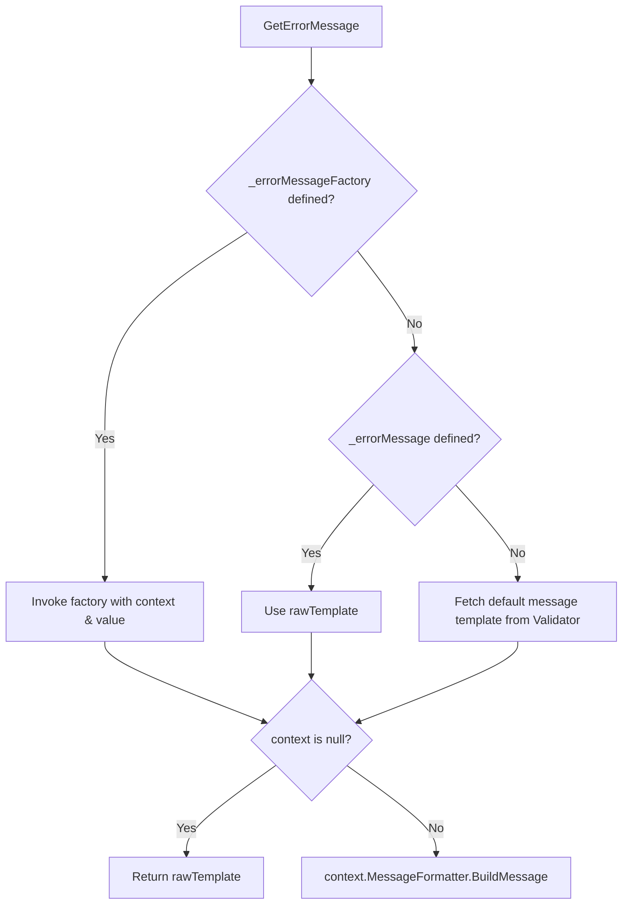

# Custom Validators

<details>
<summary>Relevant source files</summary>

The following files were used as context for generating this wiki page:

- [src/FluentValidation/DefaultValidatorExtensions.cs](https://github.com/FluentValidation/FluentValidation/blob/main/src/FluentValidation/DefaultValidatorExtensions.cs)
- [src/FluentValidation/TestHelper/ValidatorTestExtensions.cs](https://github.com/FluentValidation/TestHelper/ValidatorTestExtensions.cs)
- [docs/custom-validators.md](https://github.com/FluentValidation/FluentValidation/blob/main/docs/custom-validators.md)
- [docs/built-in-validators.md](https://github.com/FluentValidation/FluentValidation/blob/main/docs/built-in-validators.md)
- [src/FluentValidation.Tests/DefaultValidatorExtensionTester.cs](https://github.com/FluentValidation/FluentValidation.Tests/DefaultValidatorExtensionTester.cs)
- [src/FluentValidation.Tests/CustomValidatorTester.cs](https://github.com/FluentValidation/FluentValidation.Tests/CustomValidatorTester.cs)
- [src/FluentValidation.Tests/PredicateValidatorTester.cs](https://github.com/FluentValidation/FluentValidation.Tests/PredicateValidatorTester.cs)
- [src/FluentValidation/Internal/RuleComponent.cs](https://github.com/FluentValidation/FluentValidation/blob/main/src/FluentValidation/Internal/RuleComponent.cs)
- [src/FluentValidation/Validators/IPropertyValidator.cs](https://github.com/FluentValidation/FluentValidation/blob/main/src/FluentValidation/Validators/IPropertyValidator.cs)
- [src/FluentValidation/Validators/PredicateValidator.cs](https://github.com/FluentValidation/FluentValidation/blob/main/src/FluentValidation/Validators/PredicateValidator.cs)
- [src/FluentValidation/Syntax.cs](https://github.com/FluentValidation/FluentValidation/blob/main/src/FluentValidation/Syntax.cs)
- [src/FluentValidation/Validators/PropertyValidator.cs](https://github.com/FluentValidation/FluentValidation/blob/main/src/FluentValidation/Validators/PropertyValidator.cs)
</details>

## Overview

Custom validators enable developers to extend FluentValidation beyond built-in rules by implementing specialized validation logic tailored to unique domain requirements. They address the need for reusable validation behaviors, complex cross-property checks, and custom error reporting mechanisms that standard rules cannot fulfill. The system embodies design decisions centered around flexibility and seamless integration, offering tiered implementation approaches ranging from inline predicate clauses to dedicated custom classes and explicit context manipulation. These components interact closely with rule builders, validation contexts, and message formatters to participate fully in synchronous and asynchronous validation pipelines while preserving consistent error formatting and testability. Sources: [docs/custom-validators.md:3-120](https://github.com/FluentValidation/FluentValidation/blob/main/docs/custom-validators.md#L3-L120), [src/FluentValidation/Validators/IPropertyValidator.cs:24-43](https://github.com/FluentValidation/FluentValidation/blob/main/src/FluentValidation/Validators/IPropertyValidator.cs#L24-L43)

## Custom Validator Contracts and Core Interfaces

### Overview

FluentValidation defines its custom validator architecture around a core set of interfaces and abstract base classes located in the `FluentValidation.Validators` namespace. These contracts establish a uniform mechanism for validating property values synchronously and asynchronously while supplying metadata such as validator names and default error message templates. The non-generic `IPropertyValidator` interface serves as the foundational root contract defining the `Name` property and the `GetDefaultMessageTemplate(string errorCode)` method. Direct implementation of `IPropertyValidator` is discouraged by the framework; instead, developers and built-in rules rely on typed interfaces and abstract base classes. Sources: [src/FluentValidation/Validators/IPropertyValidator.cs:45-64](https://github.com/FluentValidation/Validators/IPropertyValidator.cs#L45-L64), [docs/custom-validators.md:117-124](https://github.com/FluentValidation/docs/custom-validators.md#L117-L124)

### Core Interfaces and Contracts

The validation system distinguishes between non-generic metadata requirements and strongly typed validation execution through specialized generic interfaces:

- `IPropertyValidator`: Root interface specifying `Name` and `GetDefaultMessageTemplate(string errorCode)`. Sources: [src/FluentValidation/Validators/IPropertyValidator.cs:50-64](https://github.com/FluentValidation/Validators/IPropertyValidator.cs#L50-L64)
- `IPropertyValidator<T, TProperty>`: Adds synchronous validation via `bool IsValid(ValidationContext<T> context, TProperty value)`. Sources: [src/FluentValidation/Validators/IPropertyValidator.cs:35-43](https://github.com/FluentValidation/Validators/IPropertyValidator.cs#L35-L43)
- `IAsyncPropertyValidator<T, TProperty>`: Adds asynchronous validation via `Task<bool> IsValidAsync(ValidationContext<T> context, TProperty value, CancellationToken cancellation)`. Sources: [src/FluentValidation/Validators/IPropertyValidator.cs:24-33](https://github.com/FluentValidation/Validators/IPropertyValidator.cs#L24-L33)

> [!WARNING]
> The `IPropertyValidator` interface should not be implemented directly in custom code because it is subject to change across minor versions. Always inherit from the abstract `PropertyValidator` class instead. Sources: [src/FluentValidation/Validators/IPropertyValidator.cs:45-49](https://github.com/FluentValidation/Validators/IPropertyValidator.cs#L45-L49), [docs/custom-validators.md:117-119](https://github.com/FluentValidation/docs/custom-validators.md#L117-L119)

Sources: [src/FluentValidation/Validators/IPropertyValidator.cs:24-64](https://github.com/FluentValidation/Validators/IPropertyValidator.cs#L24-L64)

### PropertyValidator Base Class

The abstract `PropertyValidator` class implements property validator contracts and provides helper infrastructure for custom validator implementations. It handles explicit interface dispatch for `GetDefaultMessageTemplate` and exposes protected methods for localization. Sources: [src/FluentValidation/Validators/PropertyValidator.cs:23-58](https://github.com/FluentValidation/Validators/PropertyValidator.cs#L23-L58)

| Member | Type | Purpose |
| :--- | :--- | :--- |
| `Name` | `string` (abstract property) | Returns the unique name of the validator, serving as the default error code. Sources: [src/FluentValidation/Validators/PropertyValidator.cs:36|36](https://github.com/FluentValidation/Validators/PropertyValidator.cs#L36-L36) |
| `IsValid` | `bool` (abstract method) | Evaluates the property value against validation rules, receiving `ValidationContext<T>` and property value. Sources: [src/FluentValidation/Validators/PropertyValidator.cs:57|57](https://github.com/FluentValidation/Validators/PropertyValidator.cs#L57-L57) |
| `GetDefaultMessageTemplate` | `string` (protected virtual method) | Supplies the default error message template when no override is provided, defaulting to `"No default error message has been specified"`. Sources: [src/FluentValidation/Validators/PropertyValidator.cs:33|33](https://github.com/FluentValidation/Validators/PropertyValidator.cs#L33-L33) |
| `Localized` | `string` (protected helper method) | Resolves localized strings from `ValidatorOptions.Global.LanguageManager` using the error code and fallback key. Sources: [src/FluentValidation/Validators/PropertyValidator.cs:47-49](https://github.com/FluentValidation/Validators/PropertyValidator.cs#L47-L49) |

Sources: [src/FluentValidation/Validators/PropertyValidator.cs:23-58](https://github.com/FluentValidation/Validators/PropertyValidator.cs#L23-L58)

## Predicate and Must Clause Extensions

### Overview

FluentValidation provides predicate-based rule creation through `Must` clauses and underlying predicate validator implementations. This mechanism allows developers to embed custom boolean expressions directly into fluent validation chains without creating dedicated validator classes. Sources: [src/FluentValidation/DefaultValidatorExtensions.cs:409-453](https://github.com/FluentValidation/DefaultValidatorExtensions.cs#L409-L453), [src/FluentValidation/Validators/PredicateValidator.cs:23-45](https://github.com/FluentValidation/Validators/PredicateValidator.cs#L23-L45)

### Predicate Overloads and Execution Path

The `DefaultValidatorExtensions` class defines multiple `Must` overloads accepting different delegate signatures, which route execution through a sequence of conversions before instantiating the core validator:

1. `Must(Func<TProperty, bool> predicate)` checks for null arguments via `ArgumentNullException.ThrowIfNull(predicate)` and wraps the call into a parent-accepting lambda. Sources: [src/FluentValidation/DefaultValidatorExtensions.cs:418-421](https://github.com/FluentValidation/DefaultValidatorExtensions.cs#L418-L421)
2. `Must(Func<T, TProperty, bool> predicate)` verifies the delegate and normalizes it to accept the validation context. Sources: [src/FluentValidation/DefaultValidatorExtensions.cs:434-437](https://github.com/FluentValidation/DefaultValidatorExtensions.cs#L434-L437)
3. `Must(Func<T, TProperty, ValidationContext<T>, bool> predicate)` throws on null and initializes a new predicate validator instance. Sources: [src/FluentValidation/DefaultValidatorExtensions.cs:450-453](https://github.com/FluentValidation/DefaultValidatorExtensions.cs#L450-L453)

When validation runs, validator execution evaluates the stored predicate delegate, passing `context.InstanceToValidate`, `value`, and `context`. If the delegate returns `false`, validation fails. Sources: [src/FluentValidation/Validators/PredicateValidator.cs:25-40](https://github.com/FluentValidation/Validators/PredicateValidator.cs#L25-L40)

> [!WARNING]
> Passing a null predicate delegate to any `Must` overload immediately throws an `ArgumentNullException` during rule construction, failing fast before any validation execution takes place. Sources: [src/FluentValidation/DefaultValidatorExtensions.cs:419|419](https://github.com/FluentValidation/DefaultValidatorExtensions.cs#L419-L419), [src/FluentValidation.Tests/PredicateValidatorTester.cs:48-52](https://github.com/FluentValidation.Tests/PredicateValidatorTester.cs#L48-L52)

Sources: [src/FluentValidation/DefaultValidatorExtensions.cs:418-453](https://github.com/FluentValidation/DefaultValidatorExtensions.cs#L418-L453), [src/FluentValidation/Validators/PredicateValidator.cs:23-41](https://github.com/FluentValidation/Validators/PredicateValidator.cs#L23-L41)

### Async Predicate Extensions

For asynchronous operations, `MustAsync` mirrors the synchronous extension structure with overloads accepting `CancellationToken` and returning a `Task<bool>`:

- `MustAsync(Func<TProperty, CancellationToken, Task<bool>> predicate)` Sources: [src/FluentValidation/DefaultValidatorExtensions.cs:465-469](https://github.com/FluentValidation/DefaultValidatorExtensions.cs#L465-L469)
- `MustAsync(Func<T, TProperty, CancellationToken, Task<bool>> predicate)` Sources: [src/FluentValidation/DefaultValidatorExtensions.cs:482-485](https://github.com/FluentValidation/DefaultValidatorExtensions.cs#L482-L485)
- `MustAsync(Func<T, TProperty, ValidationContext<T>, CancellationToken, Task<bool>> predicate)` instantiates an async predicate validator. Sources: [src/FluentValidation/DefaultValidatorExtensions.cs:498-501](https://github.com/FluentValidation/DefaultValidatorExtensions.cs#L498-L501)

Sources: [src/FluentValidation/DefaultValidatorExtensions.cs:465-501](https://github.com/FluentValidation/DefaultValidatorExtensions.cs#L465-L501)

## Custom Rule Component Execution Flow

### Overview

Rule component classes serve as discrete execution units wrapping property validators, error formatting rules, conditions, and metadata providers within a validation rule. They coordinate both synchronous and asynchronous execution paths, evaluate conditions, and format error messages using the validation context. Sources: [src/FluentValidation/Internal/RuleComponent.cs:28-48](https://github.com/FluentValidation/Internal/RuleComponent.cs#L28-L48)

### Execution Flow and Validation Routing

When validation executes on a rule component, the decision to run synchronously or asynchronously depends on the capability of the underlying validator and whether the root validation call was synchronous or asynchronous. 

1. `ValidateAsync` checks asynchronous validation support to determine routing:
   - If asynchronous validation is supported, it invokes `InvokePropertyValidatorAsync(context, value, cancellation)` which calls the validator's `IsValidAsync(...)`. Sources: [src/FluentValidation/Internal/RuleComponent.cs:60-71](https://github.com/FluentValidation/Internal/RuleComponent.cs#L60-L71), [src/FluentValidation/Internal/RuleComponent.cs:94-95](https://github.com/FluentValidation/Internal/RuleComponent.cs#L94-L95)
   - Otherwise, it falls back to `InvokePropertyValidator(context, value)` running synchronous validation. Sources: [src/FluentValidation/Internal/RuleComponent.cs:72-76](https://github.com/FluentValidation/Internal/RuleComponent.cs#L72-L76), [src/FluentValidation/Internal/RuleComponent.cs:91-92](https://github.com/FluentValidation/Internal/RuleComponent.cs#L91-L92)

2. `Validate` for synchronous root calls checks synchronous validation support:
   - If synchronous validation is supported, it calls `InvokePropertyValidator(context, value)`. Sources: [src/FluentValidation/Internal/RuleComponent.cs:79-84](https://github.com/FluentValidation/Internal/RuleComponent.cs#L79-L84)
   - If the root validator is invoked synchronously but the underlying validator only supports asynchronous execution, it throws an `AsyncValidatorInvokedSynchronouslyException`. Sources: [src/FluentValidation/Internal/RuleComponent.cs:85-89](https://github.com/FluentValidation/Internal/RuleComponent.cs#L85-L89), [src/FluentValidation.Tests/CustomValidatorTester.cs:148-155](https://github.com/FluentValidation.Tests/CustomValidatorTester.cs#L148-L155)

> [!WARNING]
> Invoking validation synchronously on a rule configured with an asynchronous validator or `CustomAsync` throws an `AsyncValidatorInvokedSynchronouslyException`. Synchronous execution cannot await asynchronous property validator logic. Sources: [src/FluentValidation/Internal/RuleComponent.cs:85-89](https://github.com/FluentValidation/Internal/RuleComponent.cs#L85-L89), [src/FluentValidation.Tests/CustomValidatorTester.cs:148-155](https://github.com/FluentValidation.Tests/CustomValidatorTester.cs#L148-L155)

Sources: [src/FluentValidation/Internal/RuleComponent.cs:66-96](https://github.com/FluentValidation/Internal/RuleComponent.cs#L66-L96), [src/FluentValidation.Tests/CustomValidatorTester.cs:148-155](https://github.com/FluentValidation.Tests/CustomValidatorTester.cs#L148-L155)

### Error Message Formatting and Factories

Rule components manage error message retrieval and template interpolation through `GetErrorMessage` and `GetUnformattedErrorMessage`. Sources: [src/FluentValidation/Internal/RuleComponent.cs:163-193](https://github.com/FluentValidation/Internal/RuleComponent.cs#L163-L193)



Sources: [src/FluentValidation/Internal/RuleComponent.cs:163-178](https://github.com/FluentValidation/Internal/RuleComponent.cs#L163-L178)

Sources: [src/FluentValidation/Internal/RuleComponent.cs:163-178](https://github.com/FluentValidation/Internal/RuleComponent.cs#L163-L178)

### Condition Evaluation

Conditions applied to rule components via `ApplyCondition` or `ApplyAsyncCondition` are combined using logical AND operations. Sources: [src/FluentValidation/Internal/RuleComponent.cs:101-123](https://github.com/FluentValidation/Internal/RuleComponent.cs#L101-L123)

- `ApplyCondition(Func<ValidationContext<T>, bool> condition)`: If a condition already exists, the new condition is chained such that `ctx => condition(ctx) && original(ctx)`. Sources: [src/FluentValidation/Internal/RuleComponent.cs:101-109](https://github.com/FluentValidation/Internal/RuleComponent.cs#L101-L109)
- `ApplyAsyncCondition(Func<ValidationContext<T>, CancellationToken, Task<bool>> condition)`: Chains async conditions with `await condition(ctx, ct) && await original(ctx, ct)`. Sources: [src/FluentValidation/Internal/RuleComponent.cs:115-123](https://github.com/FluentValidation/Internal/RuleComponent.cs#L115-L123)

Sources: [src/FluentValidation/Internal/RuleComponent.cs:101-123](https://github.com/FluentValidation/Internal/RuleComponent.cs#L101-L123)

## Fluent Extension Methods and Syntax

### Overview

FluentValidation provides a rich set of fluent builder interfaces and extension methods that enable declarative property validation chains. The fluent syntax relies on interface contracts defined in `Syntax.cs`, such as rule builders (`IRuleBuilder<T, TProperty>`), initial collection builders, and condition builders (`IConditionBuilder`). Sources: [src/FluentValidation/Syntax.cs:25-119](https://github.com/FluentValidation/Syntax.cs#L25-L119)

### Rule Builder Interfaces

The rule builder interfaces structure the method chains available when defining validation rules on an `AbstractValidator<T>`.

| Interface | Purpose / Scope |
| --- | --- |
| `IRuleBuilder<T, TProperty>` | Defines core methods for attaching property validators (`SetValidator`, `SetAsyncValidator`) and validator providers. Sources: [src/FluentValidation/Syntax.cs:37-75](https://github.com/FluentValidation/Syntax.cs#L37-L75) |
| `IRuleBuilderInitial<T, TProperty>` | Represents a rule builder that starts a validation chain for a property. Sources: [src/FluentValidation/Syntax.cs:25-30](https://github.com/FluentValidation/Syntax.cs#L25-30) |
| `IRuleBuilderOptions<T, TProperty>` | Returned by validators to allow chaining options like `DependentRules`. Sources: [src/FluentValidation/Syntax.cs:82-87](https://github.com/FluentValidation/Syntax.cs#L82-87) |
| `IRuleBuilderOptionsConditions<T, TProperty>` | Used for validators that only support conditions without secondary rule options. Sources: [src/FluentValidation/Syntax.cs:90-99](https://github.com/FluentValidation/Syntax.cs#L90-99) |
| `IRuleBuilderInitialCollection<T, TElement>` | Represents the start of a validation chain for collection elements (`RuleForEach`). Sources: [src/FluentValidation/Syntax.cs:101-108](https://github.com/FluentValidation/Syntax.cs#L101-108) |
| `IConditionBuilder` | Provides conditional execution builders (`Otherwise`) for `When`/`Unless` blocks. Sources: [src/FluentValidation/Syntax.cs:113-119](https://github.com/FluentValidation/Syntax.cs#L113-L119) |

Sources: [src/FluentValidation/Syntax.cs:25-119](https://github.com/FluentValidation/Syntax.cs#L119)

### Default Extension Methods and Customization

The static class `DefaultValidatorExtensions` houses extension methods operating on rule builders. These methods instantiate concrete property validators and bind them via `ruleBuilder.SetValidator(...)`. Sources: [src/FluentValidation/DefaultValidatorExtensions.cs:35-1252](https://github.com/FluentValidation/DefaultValidatorExtensions.cs#L35-L1252)

Developers can extend validation capabilities by writing custom extension methods that target rule builders. For instance, custom validation actions can be attached using `Custom` or `CustomAsync`, which wrap user-defined delegates inside validation components:

```csharp
public static IRuleBuilderOptionsConditions<T, string> CustomLengthCheck<T>(this IRuleBuilder<T, string> ruleBuilder) {
    return ruleBuilder.Custom((value, context) => {
        if (value != null && value.Length % 2 != 0) {
            context.AddFailure("The property length must be even.");
        }
    });
}
```

Sources: [src/FluentValidation/DefaultValidatorExtensions.cs:1130-1154](https://github.com/FluentValidation/DefaultValidatorExtensions.cs#L1130-L1154), [src/FluentValidation.Tests/DefaultValidatorExtensionTester.cs:104-107](https://github.com/FluentValidation.Tests/DefaultValidatorExtensionTester.cs#L104-L107)

> [!NOTE]
> Custom extension methods targeting rule builders must return the options instance returned by `SetValidator` or `SetAsyncValidator` to allow further fluent chaining. Sources: [src/FluentValidation/DefaultValidatorExtensions.cs:43-50](https://github.com/FluentValidation/DefaultValidatorExtensions.cs#L43-50), [src/FluentValidation/DefaultValidatorExtensions.cs:1130-1137](https://github.com/FluentValidation/DefaultValidatorExtensions.cs#L1130-L1137)

## Testing Custom Validation Rules

### Overview

FluentValidation provides testing helper extensions in the `ValidationTestExtension` static class to simplify unit testing of validators, custom property validators, and rule extensions. These extensions enable developers to execute validators directly against model instances and make fluent assertions against individual validation failures without requiring a full testing framework infrastructure. Sources: [src/FluentValidation/TestHelper/ValidatorTestExtensions.cs:34-36](https://github.com/FluentValidation/TestHelper/ValidatorTestExtensions.cs#L34-L36), [src/FluentValidation/TestHelper/ValidatorTestExtensions.cs:83-89](https://github.com/FluentValidation/TestHelper/ValidatorTestExtensions.cs#L83-L89)

### Test Execution Methods and Validation Flow

The test helper API supplies synchronous and asynchronous execution wrappers that take validator instances and target objects or pre-configured validation contexts, returning a test validation result.

The call-chain execution walkthrough for test validation proceeds as follows:
`TestValidate()` / `TestValidateAsync()` → context creation → validator execution → result wrapping.

During this execution, if an asynchronous validator is invoked synchronously via `TestValidate()`, an `AsyncValidatorInvokedSynchronouslyException` is caught and rethrown with a targeted test failure message prompting the author to use `TestValidateAsync` instead.

| Method Signature | Return Type | Purpose / Description |
| --- | --- | --- |
| `TestValidate<T>(this IValidator<T> validator, T objectToTest, Action<ValidationStrategy<T>> options)` | `TestValidationResult<T>` | Creates a validation options context and executes synchronous validation. Sources: [src/FluentValidation/TestHelper/ValidatorTestExtensions.cs:86-89](https://github.com/FluentValidation/TestHelper/ValidatorTestExtensions.cs#L86-L89) |
| `TestValidate<T>(this IValidator<T> validator, ValidationContext<T> context)` | `TestValidationResult<T>` | Executes synchronous validation against an explicit validation context. Sources: [src/FluentValidation/TestHelper/ValidatorTestExtensions.cs:94-104](https://github.com/FluentValidation/TestHelper/ValidatorTestExtensions.cs#L94-L104) |
| `TestValidateAsync<T>(this IValidator<T> validator, T objectToTest, Action<ValidationStrategy<T>> options, CancellationToken cancellationToken)` | `Task<TestValidationResult<T>>` | Executes asynchronous validation with optional validation strategy configuration. Sources: [src/FluentValidation/TestHelper/ValidatorTestExtensions.cs:109-112](https://github.com/FluentValidation/TestHelper/ValidatorTestExtensions.cs#L109-L112) |
| `TestValidateAsync<T>(this IValidator<T> validator, ValidationContext<T> context, CancellationToken cancellationToken)` | `Task<TestValidationResult<T>>` | Executes asynchronous validation against an explicit validation context. Sources: [src/FluentValidation/TestHelper/ValidatorTestExtensions.cs:117-120](https://github.com/FluentValidation/TestHelper/ValidatorTestExtensions.cs#L117-L120) |

Sources: [src/FluentValidation/TestHelper/ValidatorTestExtensions.cs:86-120](https://github.com/FluentValidation/TestHelper/ValidatorTestExtensions.cs#L86-L120)

> [!WARNING]
> Invoking `TestValidate()` on a validator containing asynchronous rules (such as `MustAsync` or `CustomAsync`) throws an `AsyncValidatorInvokedSynchronouslyException`. Always use `TestValidateAsync()` when testing asynchronous custom rules. Sources: [src/FluentValidation/TestHelper/ValidatorTestExtensions.cs:99-101](https://github.com/FluentValidation/TestHelper/ValidatorTestExtensions.cs#L99-L101)

### Fluent Assertion Extensions

Once test validation results are obtained, validation failures can be filtered and asserted upon using continuation extension methods. These methods inspect matched and unmatched failures, throwing exceptions with formatted error messages when expectations are violated.

| Assertion Extension | Target Condition / Action | Failure Message Formatting |
| --- | --- | --- |
| `When(failurePredicate, exceptionMessage)` | Filters failures matching a predicate; throws if none match. Sources: [src/FluentValidation/TestHelper/ValidatorTestExtensions.cs:141-153](https://github.com/FluentValidation/TestHelper/ValidatorTestExtensions.cs#L141-L153) | `"Expected validation error was not found"` Sources: [src/FluentValidation/TestHelper/ValidatorTestExtensions.cs:148-148](https://github.com/FluentValidation/TestHelper/ValidatorTestExtensions.cs#L148-L148) |
| `WhenAll(failurePredicate, exceptionMessage)` | Asserts that all failures match the given predicate. Sources: [src/FluentValidation/TestHelper/ValidatorTestExtensions.cs:155-168](https://github.com/FluentValidation/TestHelper/ValidatorTestExtensions.cs#L155-L168) | `"Found an unexpected validation error"` Sources: [src/FluentValidation/TestHelper/ValidatorTestExtensions.cs:163-163](https://github.com/FluentValidation/TestHelper/ValidatorTestExtensions.cs#L163-L163) |
| `WithSeverity(expectedSeverity)` | Asserts that matching failure possesses the expected `Severity`. Sources: [src/FluentValidation/TestHelper/ValidatorTestExtensions.cs:170-172](https://github.com/FluentValidation/TestHelper/ValidatorTestExtensions.cs#L170-L172) | `"Expected a severity of '{0}'. Actual severity was '{Severity}'"` Sources: [src/FluentValidation/TestHelper/ValidatorTestExtensions.cs:171-171](https://github.com/FluentValidation/TestHelper/ValidatorTestExtensions.cs#L171-L171) |
| `WithCustomState(expectedCustomState, comparer)` | Asserts custom state equality. Sources: [src/FluentValidation/TestHelper/ValidatorTestExtensions.cs:174-176](https://github.com/FluentValidation/TestHelper/ValidatorTestExtensions.cs#L174-L176) | `"Expected custom state of '{0}'. Actual state was '{State}'"` Sources: [src/FluentValidation/TestHelper/ValidatorTestExtensions.cs:175-175](https://github.com/FluentValidation/TestHelper/ValidatorTestExtensions.cs#L175-L175) |
| `WithMessageArgument(argumentKey, argumentValue)` | Asserts placeholder values present in message placeholders. Sources: [src/FluentValidation/TestHelper/ValidatorTestExtensions.cs:178-181](https://github.com/FluentValidation/TestHelper/ValidatorTestExtensions.cs#L178-L181) | `"Expected message argument '{0}' with value '{1}'. Actual value was '{MessageArgument:{0}}'"` Sources: [src/FluentValidation/TestHelper/ValidatorTestExtensions.cs:180-180](https://github.com/FluentValidation/TestHelper/ValidatorTestExtensions.cs#L180-L180) |
| `WithErrorMessage(expectedErrorMessage)` | Asserts exact error message match. Sources: [src/FluentValidation/TestHelper/ValidatorTestExtensions.cs:183-185](https://github.com/FluentValidation/TestHelper/ValidatorTestExtensions.cs#L183-L185) | `"Expected an error message of '{0}'. Actual message was '{Message}'"` Sources: [src/FluentValidation/TestHelper/ValidatorTestExtensions.cs:184-184](https://github.com/FluentValidation/TestHelper/ValidatorTestExtensions.cs#L184-L184) |
| `WithErrorCode(expectedErrorCode)` | Asserts error code match. Sources: [src/FluentValidation/TestHelper/ValidatorTestExtensions.cs:187-189](https://github.com/FluentValidation/TestHelper/ValidatorTestExtensions.cs#L187-L189) | `"Expected an error code of '{0}'. Actual error code was '{Code}'"` Sources: [src/FluentValidation/TestHelper/ValidatorTestExtensions.cs:188-188](https://github.com/FluentValidation/TestHelper/ValidatorTestExtensions.cs#L188-L188) |

Sources: [src/FluentValidation/TestHelper/ValidatorTestExtensions.cs:141-190](https://github.com/FluentValidation/TestHelper/ValidatorTestExtensions.cs#L141-L190)

> [!TIP]
> Use `Only()` at the end of an assertion chain to guarantee that no unexpected validation errors occurred outside of those explicitly matched by preceding filters. Sources: [src/FluentValidation/TestHelper/ValidatorTestExtensions.cs:207-232](https://github.com/FluentValidation/TestHelper/ValidatorTestExtensions.cs#L207-L232)

## Related

- [[Built In Validators]]
- [[Asynchronous Validation]]

