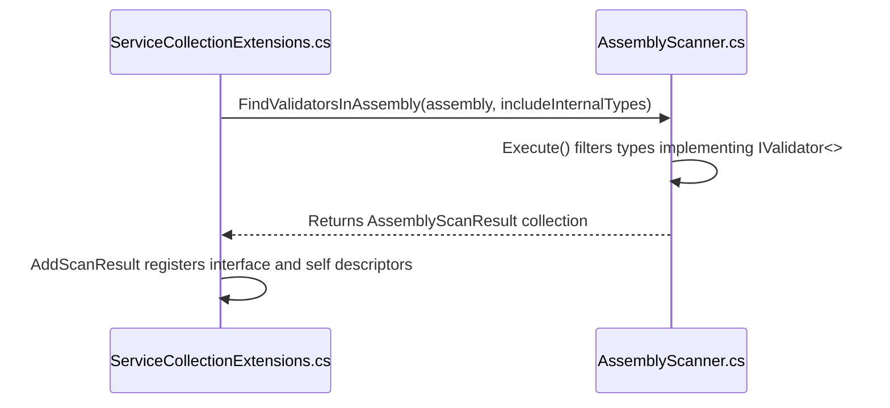
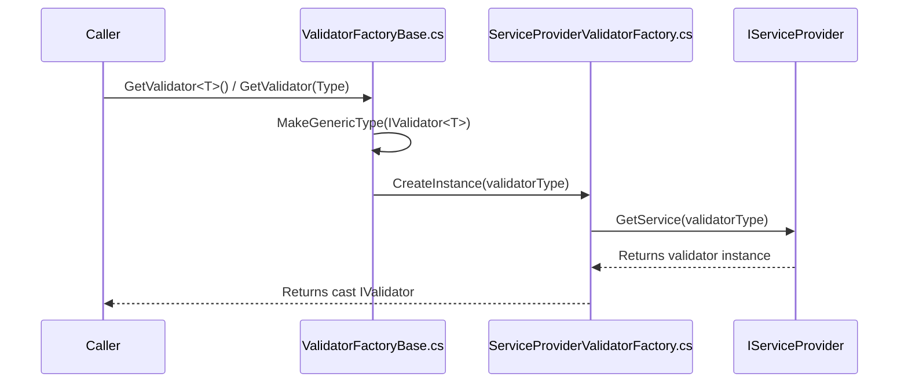

# Dependency Injection

<details>
<summary>Relevant source files</summary>

The following files were used as context for generating this wiki page:

- [src/FluentValidation/Validators/ChildValidatorAdaptor.cs](https://github.com/FluentValidation/FluentValidation/blob/main/src/FluentValidation/Validators/ChildValidatorAdaptor.cs)
- [src/FluentValidation.DependencyInjectionExtensions/ServiceCollectionExtensions.cs](https://github.com/FluentValidation/FluentValidation/blob/main/src/FluentValidation.DependencyInjectionExtensions/ServiceCollectionExtensions.cs)
- [src/FluentValidation/TestHelper/ValidatorTestExtensions.cs](https://github.com/FluentValidation/FluentValidation/blob/main/src/FluentValidation/TestHelper/ValidatorTestExtensions.cs)
- [docs/aspnet.md](https://github.com/FluentValidation/FluentValidation/blob/main/docs/aspnet.md)
- [src/FluentValidation/ValidatorOptions.cs](https://github.com/FluentValidation/FluentValidation/blob/main/src/FluentValidation/ValidatorOptions.cs)
- [docs/di.md](https://github.com/FluentValidation/FluentValidation/blob/main/docs/di.md)
- [src/FluentValidation/ValidatorFactoryBase.cs](https://github.com/FluentValidation/FluentValidation/blob/main/src/FluentValidation/ValidatorFactoryBase.cs)
- [src/FluentValidation/Validators/PolymorphicValidator.cs](https://github.com/FluentValidation/FluentValidation/blob/main/src/FluentValidation/Validators/PolymorphicValidator.cs)
- [src/FluentValidation/ValidatorDescriptor.cs](https://github.com/FluentValidation/FluentValidation/blob/main/src/FluentValidation/ValidatorDescriptor.cs)
- [src/FluentValidation/IValidationContext.cs](https://github.com/FluentValidation/FluentValidation/blob/main/src/FluentValidation/IValidationContext.cs)
- [src/FluentValidation.Tests/AssemblyScannerTester.cs](https://github.com/FluentValidation/FluentValidation/blob/main/src/FluentValidation.Tests/AssemblyScannerTester.cs)
- [src/FluentValidation/Validators/EmailValidator.cs](https://github.com/FluentValidation/FluentValidation/blob/main/src/FluentValidation/Validators/EmailValidator.cs)
- [src/FluentValidation.DependencyInjectionExtensions/ServiceProviderValidatorFactory.cs](https://github.com/FluentValidation/FluentValidation/blob/main/src/FluentValidation.DependencyInjectionExtensions/ServiceProviderValidatorFactory.cs)
- [src/FluentValidation/AssemblyScanner.cs](https://github.com/FluentValidation/FluentValidation/blob/main/src/FluentValidation/AssemblyScanner.cs)
- [src/FluentValidation/Internal/CompositeValidatorSelector.cs](https://github.com/FluentValidation/FluentValidation/blob/main/src/FluentValidation/Internal/CompositeValidatorSelector.cs)
- [src/FluentValidation.DependencyInjectionExtensions/README.md](https://github.com/FluentValidation/FluentValidation/blob/main/src/FluentValidation.DependencyInjectionExtensions/README.md)
- [src/FluentValidation/IValidatorFactory.cs](https://github.com/FluentValidation/FluentValidation/blob/main/src/FluentValidation/IValidatorFactory.cs)
- [src/FluentValidation/IValidator.cs](https://github.com/FluentValidation/FluentValidation/blob/main/src/FluentValidation/IValidator.cs)
- [docs/upgrading-to-10.md](https://github.com/FluentValidation/FluentValidation/blob/main/docs/upgrading-to-10.md)
- [src/FluentValidation/Internal/IValidatorSelector.cs](https://github.com/FluentValidation/FluentValidation/blob/main/src/FluentValidation/Internal/IValidatorSelector.cs)
- [src/FluentValidation.Tests/InheritanceValidatorTest.cs](https://github.com/FluentValidation/FluentValidation/blob/main/src/FluentValidation.Tests/InheritanceValidatorTest.cs)
- [docs/localization.md](https://github.com/FluentValidation/FluentValidation/blob/main/docs/localization.md)
- [src/FluentValidation.Tests/NameResolutionPluggabilityTester.cs](https://github.com/FluentValidation/FluentValidation/blob/main/src/FluentValidation.Tests/NameResolutionPluggabilityTester.cs)
- [docs/start.md](https://github.com/FluentValidation/FluentValidation/blob/main/docs/start.md)
- [src/FluentValidation/IValidatorDescriptor.cs](https://github.com/FluentValidation/FluentValidation/blob/main/src/FluentValidation/IValidatorDescriptor.cs)
</details>

## Overview

Dependency injection integration in FluentValidation allows validators to be seamlessly registered and resolved through .NET service providers, such as `Microsoft.Extensions.DependencyInjection`. By registering validators as `IValidator<T>`, applications can automatically wire up complex validation logic alongside other dependencies and inject them directly into controllers, services, or minimal API endpoints. Sources: [docs/di.md:1-4](https://github.com/FluentValidation/FluentValidation/blob/main/docs/di.md#L1-L4), [docs/aspnet.md:89-98](https://github.com/FluentValidation/FluentValidation/blob/main/docs/aspnet.md#L89-L98)

Using service collection extensions combined with an assembly scanner, developers can automate the discovery and registration of all validator types within specified assemblies without manual configuration. Furthermore, runtime resolution facilities and contextual validation options support advanced patterns such as nested child validators, polymorphic hierarchies, and customized validation lifecycles. Sources: [src/FluentValidation.DependencyInjectionExtensions/ServiceCollectionExtensions.cs:27-42](https://github.com/FluentValidation/FluentValidation/blob/main/src/FluentValidation.DependencyInjectionExtensions/ServiceCollectionExtensions.cs#L27-L42), [src/FluentValidation/Validators/ChildValidatorAdaptor.cs:18-36](https://github.com/FluentValidation/FluentValidation/blob/main/src/FluentValidation/Validators/ChildValidatorAdaptor.cs#L18-L36), [src/FluentValidation/Validators/PolymorphicValidator.cs:32-37](https://github.com/FluentValidation/FluentValidation/blob/main/src/FluentValidation/Validators/PolymorphicValidator.cs#L32-L37)

## Service Registration and Assembly Scanning

### Overview

Automatic registration of validator types into `IServiceCollection` is orchestrated via `AssemblyScanner` and a set of extension methods defined in `ServiceCollectionExtensions`. These utilities discover concrete validator implementations within assemblies, match them against the open generic interface `IValidator<>`, and register both the interface mapping and the concrete type directly into the service container. Sources: [src/FluentValidation.DependencyInjectionExtensions/ServiceCollectionExtensions.cs:27-112](https://github.com/FluentValidation/FluentValidation/blob/main/src/FluentValidation.DependencyInjectionExtensions/ServiceCollectionExtensions.cs#L27-L112), [src/FluentValidation/AssemblyScanner.cs:32-87](https://github.com/FluentValidation/FluentValidation/blob/main/src/FluentValidation/AssemblyScanner.cs#L32-L87)

### Registration Extension Methods

The library provides several extension methods on `IServiceCollection` to target single assemblies, multiple assemblies, or assemblies containing specific marker types. Each method accepts an optional service lifetime, a filter predicate, and a flag for internal types. Sources: [src/FluentValidation.DependencyInjectionExtensions/ServiceCollectionExtensions.cs:37-83](https://github.com/FluentValidation/FluentValidation/blob/main/src/FluentValidation.DependencyInjectionExtensions/ServiceCollectionExtensions.cs#L37-L83)

| Extension Method | Parameters | Default Values | Target Action | Sources |
| :--- | :--- | :--- | :--- | :--- |
| `AddValidatorsFromAssemblies` | `IEnumerable<Assembly> assemblies`, `ServiceLifetime lifetime`, `Func<AssemblyScanResult, bool> filter`, `bool includeInternalTypes` | `lifetime = ServiceLifetime.Scoped`, `filter = null`, `includeInternalTypes = false` | Iterates through the provided assembly collection and invokes `AddValidatorsFromAssembly` for each. | [src/FluentValidation.DependencyInjectionExtensions/ServiceCollectionExtensions.cs:37-42](https://github.com/FluentValidation/FluentValidation/blob/main/src/FluentValidation.DependencyInjectionExtensions/ServiceCollectionExtensions.cs#L37-L42) |
| `AddValidatorsFromAssembly` | `Assembly assembly`, `ServiceLifetime lifetime`, `Func<AssemblyScanResult, bool> filter`, `bool includeInternalTypes` | `lifetime = ServiceLifetime.Scoped`, `filter = null`, `includeInternalTypes = false` | Scans the single assembly for validators and registers each scan result. | [src/FluentValidation.DependencyInjectionExtensions/ServiceCollectionExtensions.cs:53-59](https://github.com/FluentValidation/FluentValidation/blob/main/src/FluentValidation.DependencyInjectionExtensions/ServiceCollectionExtensions.cs#L53-L59) |
| `AddValidatorsFromAssemblyContaining` (Type) | `Type type`, `ServiceLifetime lifetime`, `Func<AssemblyScanResult, bool> filter`, `bool includeInternalTypes` | `lifetime = ServiceLifetime.Scoped`, `filter = null`, `includeInternalTypes = false` | Resolves `type.Assembly` and delegates to `AddValidatorsFromAssembly`. | [src/FluentValidation.DependencyInjectionExtensions/ServiceCollectionExtensions.cs:70-71](https://github.com/FluentValidation/FluentValidation/blob/main/src/FluentValidation.DependencyInjectionExtensions/ServiceCollectionExtensions.cs#L70-L71) |
| `AddValidatorsFromAssemblyContaining<T>` | `ServiceLifetime lifetime`, `Func<AssemblyScanResult, bool> filter`, `bool includeInternalTypes` | `lifetime = ServiceLifetime.Scoped`, `filter = null`, `includeInternalTypes = false` | Resolves `typeof(T).Assembly` and delegates to `AddValidatorsFromAssembly`. | [src/FluentValidation.DependencyInjectionExtensions/ServiceCollectionExtensions.cs:81-82](https://github.com/FluentValidation/FluentValidation/blob/main/src/FluentValidation.DependencyInjectionExtensions/ServiceCollectionExtensions.cs#L81-L82) |

Sources: [src/FluentValidation.DependencyInjectionExtensions/ServiceCollectionExtensions.cs:37-83](https://github.com/FluentValidation/FluentValidation/blob/main/src/FluentValidation.DependencyInjectionExtensions/ServiceCollectionExtensions.cs#L37-L83)

### Call-Chain Execution Walkthrough

When an application boots up and invokes registration, the execution follows a strict sequence from extension invocation down to type scanning and container registration:

1. `AddValidatorsFromAssembly` is called on an `IServiceCollection`, receiving an `Assembly`, a `ServiceLifetime`, an optional filter, and `includeInternalTypes`. Sources: [src/FluentValidation.DependencyInjectionExtensions/ServiceCollectionExtensions.cs:53-59](https://github.com/FluentValidation/FluentValidation/blob/main/src/FluentValidation.DependencyInjectionExtensions/ServiceCollectionExtensions.cs#L53-L59)
2. `AssemblyScanner.FindValidatorsInAssembly` is invoked with the target assembly and `includeInternalTypes`, which queries either `assembly.GetExportedTypes()` or `assembly.GetTypes()` depending on the flag. Sources: [src/FluentValidation/AssemblyScanner.cs:47-49](https://github.com/FluentValidation/AssemblyScanner.cs#L47-L49)
3. `AssemblyScanner` filters the type collection to exclude abstract types and generic type definitions, verifying that each concrete type implements the open generic interface `IValidator<>` via `Execute()`. Sources: [src/FluentValidation/AssemblyScanner.cs:75-87](https://github.com/FluentValidation/AssemblyScanner.cs#L75-L87)
4. Each discovered type is wrapped in an `AssemblyScanResult` containing the matched `InterfaceType` and `ValidatorType`, which is handed back to `AddScanResult` to populate the `IServiceCollection` via `TryAddEnumerable` and `TryAdd`. Sources: [src/FluentValidation.DependencyInjectionExtensions/ServiceCollectionExtensions.cs:92-111](https://github.com/FluentValidation.DependencyInjectionExtensions/ServiceCollectionExtensions.cs#L92-L111), [src/FluentValidation/AssemblyScanner.cs:116-134](https://github.com/FluentValidation/AssemblyScanner.cs#L116-L134)


Sources: [src/FluentValidation.DependencyInjectionExtensions/ServiceCollectionExtensions.cs:53-59](https://github.com/FluentValidation/FluentValidation/blob/main/src/FluentValidation.DependencyInjectionExtensions/ServiceCollectionExtensions.cs#L53-L59), [src/FluentValidation.DependencyInjectionExtensions/ServiceCollectionExtensions.cs:92-111](https://github.com/FluentValidation/FluentValidation/blob/main/src/FluentValidation.DependencyInjectionExtensions/ServiceCollectionExtensions.cs#L92-L111), [src/FluentValidation/AssemblyScanner.cs:47-49](https://github.com/FluentValidation/AssemblyScanner.cs#L47-L49), [src/FluentValidation/AssemblyScanner.cs:75-87](https://github.com/FluentValidation/AssemblyScanner.cs#L75-L87)

> [!NOTE]
> By default, `FindValidatorsInAssembly` invokes `assembly.GetExportedTypes()`, meaning internal validator classes are ignored unless `includeInternalTypes` is explicitly set to `true`. Sources: [src/FluentValidation/AssemblyScanner.cs:47-49](https://github.com/FluentValidation/AssemblyScanner.cs#L47-L49)

### Service Registration Design Choices

| Design Choice | Benefit | Cost | Sources |
| :--- | :--- | :--- | :--- |
| **Dual Registration (Interface and Self)** | Allows resolving both `IValidator<T>` (for dependency injection into services) and `TValidator` directly (for self-typed or factory lookups). | Doubles the number of service descriptors added to the container for each validator type. | [src/FluentValidation.DependencyInjectionExtensions/ServiceCollectionExtensions.cs:96-107](https://github.com/FluentValidation/FluentValidation/blob/main/src/FluentValidation.DependencyInjectionExtensions/ServiceCollectionExtensions.cs#L96-L107) |
| **TryAdd / TryAddEnumerable** | Prevents duplicate service registrations if the same assembly or scanner method is invoked multiple times. | Requires service descriptors to match equality checks precisely to be skipped. | [src/FluentValidation.DependencyInjectionExtensions/ServiceCollectionExtensions.cs:96-103](https://github.com/FluentValidation/FluentValidation/blob/main/src/FluentValidation.DependencyInjectionExtensions/ServiceCollectionExtensions.cs#L96-L103) |
| **Scoped Default Lifetime** | Aligns validator instances with web request lifecycles, safely supporting scoped dependencies inside validators (such as Entity Framework contexts). | Can cause captive dependency issues or memory retention if resolved improperly from singleton roots without care. | [src/FluentValidation.DependencyInjectionExtensions/ServiceCollectionExtensions.cs:33-49](https://github.com/FluentValidation/FluentValidation/blob/main/src/FluentValidation.DependencyInjectionExtensions/ServiceCollectionExtensions.cs#L33-L49) |

Sources: [src/FluentValidation.DependencyInjectionExtensions/ServiceCollectionExtensions.cs:33-107](https://github.com/FluentValidation/FluentValidation/blob/main/src/FluentValidation.DependencyInjectionExtensions/ServiceCollectionExtensions.cs#L33-L107)

## ServiceProvider Validator Resolution Facilities

### Overview

FluentValidation provides factory abstractions to obtain validator instances dynamically. The `IValidatorFactory` interface defines contract methods for looking up validators by type or generic parameter, while `ValidatorFactoryBase` and `ServiceProviderValidatorFactory` implement these lookup mechanisms using an underlying service provider.

Sources: [src/FluentValidation/IValidatorFactory.cs:23-37](https://github.com/FluentValidation/IValidatorFactory.cs#L23-L37), [src/FluentValidation/ValidatorFactoryBase.cs:23-52](https://github.com/FluentValidation/ValidatorFactoryBase.cs#L23-L52), [src/FluentValidation.DependencyInjectionExtensions/ServiceProviderValidatorFactory.cs:22-34](https://github.com/FluentValidation/FluentValidation/blob/main/src/FluentValidation.DependencyInjectionExtensions/ServiceProviderValidatorFactory.cs#L22-L34)

> [!WARNING]
> `IValidatorFactory` and its implementors are deprecated and marked with `[Obsolete]` pointing to issue #1961. Consumers should resolve `IValidator<T>` or `IValidator` directly from the `IServiceProvider` or DI container rather than using a validator factory.
> Sources: [src/FluentValidation/ValidatorFactoryBase.cs:26-26](https://github.com/FluentValidation/ValidatorFactoryBase.cs#L26-L26), [src/FluentValidation.DependencyInjectionExtensions/ServiceProviderValidatorFactory.cs:25-25](https://github.com/FluentValidation/FluentValidation/blob/main/src/FluentValidation.DependencyInjectionExtensions/ServiceProviderValidatorFactory.cs#L25-L25), [src/FluentValidation/IValidatorFactory.cs:26-26](https://github.com/FluentValidation/IValidatorFactory.cs#L26-L26)

### Resolution Call-Chain Walkthrough

When requesting a validator through the factory abstractions, execution follows a specific path from the generic interface down to container resolution:

1. `GetValidator<T>()` invokes `GetValidator(typeof(T))` by casting the result to `IValidator<T>`.
Sources: [src/FluentValidation/ValidatorFactoryBase.cs:33-35](https://github.com/FluentValidation/ValidatorFactoryBase.cs#L33-L35)

2. `GetValidator(Type type)` constructs the open generic interface type via `typeof(IValidator<>).MakeGenericType(type)` and passes it to `CreateInstance(Type validatorType)`.
Sources: [src/FluentValidation/ValidatorFactoryBase.cs:41-44](https://github.com/FluentValidation/ValidatorFactoryBase.cs#L41-L44)

3. `ServiceProviderValidatorFactory.CreateInstance(Type validatorType)` invokes `_serviceProvider.GetService(validatorType)`, casting the returned object as `IValidator`.
Sources: [src/FluentValidation.DependencyInjectionExtensions/ServiceProviderValidatorFactory.cs:32-33](https://github.com/FluentValidation/FluentValidation.DependencyInjectionExtensions/ServiceProviderValidatorFactory.cs#L32-L33)


Sources: [src/FluentValidation/ValidatorFactoryBase.cs:33-44](https://github.com/FluentValidation/ValidatorFactoryBase.cs#L33-L44), [src/FluentValidation.DependencyInjectionExtensions/ServiceProviderValidatorFactory.cs:32-33](https://github.com/FluentValidation/FluentValidation/blob/main/src/FluentValidation.DependencyInjectionExtensions/ServiceProviderValidatorFactory.cs#L32-L33)

### Validator Factory API Reference

| Type / Member | Kind | Signature / Return Type | Purpose | Sources |
| :--- | :--- | :--- | :--- | :--- |
| `IValidatorFactory` | Interface | `IValidator<T> GetValidator<T>()`, `IValidator GetValidator(Type type)` | Defines contracts for obtaining validator instances for specific types. | [src/FluentValidation/IValidatorFactory.cs:27-37](https://github.com/FluentValidation/IValidatorFactory.cs#L27-L37) |
| `ValidatorFactoryBase` | Abstract Class | `public abstract IValidator CreateInstance(Type validatorType)` | Implements type-to-generic-interface mapping before delegating instantiation. | [src/FluentValidation/ValidatorFactoryBase.cs:27-52](https://github.com/FluentValidation/ValidatorFactoryBase.cs#L27-L52) |
| `ServiceProviderValidatorFactory` | Class | `public ServiceProviderValidatorFactory(IServiceProvider serviceProvider)` | Resolves validator instances using an ASP.NET `IServiceProvider`. | [src/FluentValidation.DependencyInjectionExtensions/ServiceProviderValidatorFactory.cs:25-34](https://github.com/FluentValidation/FluentValidation/blob/main/src/FluentValidation.DependencyInjectionExtensions/ServiceProviderValidatorFactory.cs#L25-L34) |

Sources: [src/FluentValidation/IValidatorFactory.cs:27-37](https://github.com/FluentValidation/IValidatorFactory.cs#L27-L37), [src/FluentValidation/ValidatorFactoryBase.cs:27-52](https://github.com/FluentValidation/ValidatorFactoryBase.cs#L27-L52), [src/FluentValidation.DependencyInjectionExtensions/ServiceProviderValidatorFactory.cs:25-34](https://github.com/FluentValidation/FluentValidation/blob/main/src/FluentValidation.DependencyInjectionExtensions/ServiceProviderValidatorFactory.cs#L25-L34)

## Dependency Injection Integration and Documentation

### Dependency Injection Integration and Documentation

FluentValidation integrates directly with ASP.NET Core applications by registering validators with `IServiceCollection` and resolving them via constructor injection or action parameters. When configuring services in the `Startup` class or `Program.cs`, validators must be registered as `IValidator<T>`, where `T` is the validated model type. 
Sources: [docs/aspnet.md:38-51](https://github.com/FluentValidation/FluentValidation/blob/main/docs/aspnet.md#L38-L51), [docs/di.md:1-3](https://github.com/FluentValidation/FluentValidation/blob/main/docs/di.md#L1-L3)

> [!WARNING]
> When registering validators as `Singleton`, ensure you do not inject transient or request-scoped dependencies into the validator. Registering validators as `Transient` or `Scoped` is recommended to avoid scope-related issues.
Sources: [docs/di.md:90-92](https://github.com/FluentValidation/FluentValidation/blob/main/docs/di.md#L90-L92), [docs/upgrading-to-10.md:118-118](https://github.com/FluentValidation/FluentValidation/blob/main/docs/upgrading-to-10.md#L118-L118)

### ASP.NET Core Migration and Setup Patterns

Transitioning applications to modern FluentValidation releases involves updating service lifetimes, client-side adaptors, and custom property validator definitions. In FluentValidation 10.0 and newer, automatic ASP.NET integrations register validators with a `Scoped` service lifetime rather than `Transient`. Custom property validators must inherit from generic `PropertyValidator<T, TProperty>` or `AsyncPropertyValidator<T, TProperty>` instead of non-generic base classes.
Sources: [docs/upgrading-to-10.md:30-33](https://github.com/FluentValidation/FluentValidation/blob/main/docs/upgrading-to-10.md#L30-L33), [docs/upgrading-to-10.md:118-118](https://github.com/FluentValidation/FluentValidation/blob/main/docs/upgrading-to-10.md#L118-L118)

| Migration Item | Previous Version (9.x) | Current Version (10+) | Sources |
| :--- | :--- | :--- | :--- |
| ASP.NET Service Lifetime | `Transient` | `Scoped` | [docs/upgrading-to-10.md:118-118](https://github.com/FluentValidation/FluentValidation/blob/main/docs/upgrading-to-10.md#L118-L118) |
| Custom Property Validator Base | `PropertyValidator` (non-generic) | `PropertyValidator<T, TProperty>` | [docs/upgrading-to-10.md:30-33](https://github.com/FluentValidation/FluentValidation/blob/main/docs/upgrading-to-10.md#L30-L33) |
| Rule Validator Access | `rule.Validators` | `rule.Components` via `IRuleComponent` | [docs/upgrading-to-10.md:86-96](https://github.com/FluentValidation/FluentValidation/blob/main/docs/upgrading-to-10.md#L86-L96) |
| Client Validator Adaptor Key | `typeof(MyCustomPropertyValidator)` | `typeof(IMyCustomPropertyValidator)` | [docs/upgrading-to-10.md:172-176](https://github.com/FluentValidation/FluentValidation/blob/main/docs/upgrading-to-10.md#L172-L176) |

Sources: [docs/upgrading-to-10.md:30-33](https://github.com/FluentValidation/FluentValidation/blob/main/docs/upgrading-to-10.md#L30-L33), [docs/upgrading-to-10.md:86-96](https://github.com/FluentValidation/FluentValidation/blob/main/docs/upgrading-to-10.md#L86-L96), [docs/upgrading-to-10.md:118-118](https://github.com/FluentValidation/FluentValidation/blob/main/docs/upgrading-to-10.md#L118-L118), [docs/upgrading-to-10.md:172-176](https://github.com/FluentValidation/FluentValidation/blob/main/docs/upgrading-to-10.md#L172-L176)

## Nested and Polymorphic Child Validation

### Overview

FluentValidation handles nested and polymorphic property validation using specialized adapters that delegate execution to child or derived validators dynamically at runtime. The core components driving this behavior are `ChildValidatorAdaptor<T, TProperty>` and its subclass `PolymorphicValidator<T, TProperty>`. These adapters manage child contexts, preserve collection index placeholders across validation hierarchies, and resolve specific validator implementations based on the runtime type of the property value.
Sources: [src/FluentValidation/Validators/ChildValidatorAdaptor.cs:18-24](https://github.com/FluentValidation/FluentValidation/blob/main/src/FluentValidation/Validators/ChildValidatorAdaptor.cs#L18-L24), [src/FluentValidation/Validators/PolymorphicValidator.cs:32-34](https://github.com/FluentValidation/Validators/PolymorphicValidator.cs#L32-L34)

### Execution Flow and Call-Chain Walkthrough

When a validation rule encounters a child or polymorphic validator, execution follows a well-defined sequence through synchronous or asynchronous validation entry points. 

For standard validation runs, the call sequence proceeds as follows:
1. `ChildValidatorAdaptor.IsValid()` (or `IsValidAsync()`) checks if the property `value` is `null`. If null, validation passes immediately.
Sources: [src/FluentValidation/Validators/ChildValidatorAdaptor.cs:38-41](https://github.com/FluentValidation/Validators/ChildValidatorAdaptor.cs#L38-L41), [src/FluentValidation/Validators/ChildValidatorAdaptor.cs:63-66](https://github.com/FluentValidation/Validators/ChildValidatorAdaptor.cs#L63-L66)
2. `GetValidator()` is invoked to resolve the specific `IValidator` instance using either a stored validator instance or a provider callback.
Sources: [src/FluentValidation/Validators/ChildValidatorAdaptor.cs:43-43](https://github.com/FluentValidation/FluentValidation/blob/main/src/FluentValidation/Validators/ChildValidatorAdaptor.cs#L43-L43), [src/FluentValidation/Validators/ChildValidatorAdaptor.cs:88-91](https://github.com/FluentValidation/FluentValidation/blob/main/src/FluentValidation/Validators/ChildValidatorAdaptor.cs#L88-L91), [src/FluentValidation/Validators/PolymorphicValidator.cs:99-108](https://github.com/FluentValidation/Validators/PolymorphicValidator.cs#L99-L108)
3. `CreateNewValidationContextForChildValidator()` clones the parent context via `context.CloneForChildValidator()`, appending the raw property name to the property chain if not operating inside a child collection context.
Sources: [src/FluentValidation/Validators/ChildValidatorAdaptor.cs:49-49](https://github.com/FluentValidation/FluentValidation/blob/main/src/FluentValidation/Validators/ChildValidatorAdaptor.cs#L49-L49), [src/FluentValidation/Validators/ChildValidatorAdaptor.cs:93-101](https://github.com/FluentValidation/FluentValidation/blob/main/src/FluentValidation/Validators/ChildValidatorAdaptor.cs#L93-L101)
4. `HandleCollectionIndex()` extracts any `CollectionIndex` placeholder value from the message formatter and caches it in `RootContextData["__FV_CollectionIndex"]` to ensure error messages retain correct collection indexing.
Sources: [src/FluentValidation/Validators/ChildValidatorAdaptor.cs:54-54](https://github.com/FluentValidation/FluentValidation/blob/main/src/FluentValidation/Validators/ChildValidatorAdaptor.cs#L54-L54), [src/FluentValidation/Validators/ChildValidatorAdaptor.cs:107-113](https://github.com/FluentValidation/FluentValidation/blob/main/src/FluentValidation/Validators/ChildValidatorAdaptor.cs#L107-L113)
5. `validator.Validate()` or `validator.ValidateAsync()` executes against the child context, after which `ResetCollectionIndex()` restores the prior index state.
Sources: [src/FluentValidation/Validators/ChildValidatorAdaptor.cs:56-59](https://github.com/FluentValidation/FluentValidation/blob/main/src/FluentValidation/Validators/ChildValidatorAdaptor.cs#L56-L59), [src/FluentValidation/Validators/ChildValidatorAdaptor.cs:81-83](https://github.com/FluentValidation/Validators/ChildValidatorAdaptor.cs#L81-L83), [src/FluentValidation/Validators/ChildValidatorAdaptor.cs:115-125](https://github.com/FluentValidation/Validators/ChildValidatorAdaptor.cs#L115-L125)

> [!NOTE]
> In `PolymorphicValidator`, `GetValidator` evaluates `value.GetType()` against an internal dictionary (`_derivedValidators`) containing `DerivedValidatorFactory` instances. If the runtime type matches an explicitly registered derived type, the associated validator or factory function is invoked.
Sources: [src/FluentValidation/Validators/PolymorphicValidator.cs:33-33](https://github.com/FluentValidation/FluentValidation/blob/main/src/FluentValidation/Validators/PolymorphicValidator.cs#L33-L33), [src/FluentValidation/Validators/PolymorphicValidator.cs:99-108](https://github.com/FluentValidation/Validators/PolymorphicValidator.cs#L99-L108)

### Polymorphic Validator Configuration API

`PolymorphicValidator` exposes multiple overload methods on `Add` to register derived type handlers, supporting direct validator instances, context-aware factories, and derived-type-aware callbacks.

| Method Signature | Description | Sources |
| :--- | :--- | :--- |
| `Add<TDerived>(IValidator<TDerived>, params string[])` | Registers a specific validator instance for derived type `TDerived` with optional rulesets. | [src/FluentValidation/Validators/PolymorphicValidator.cs:46-50](https://github.com/FluentValidation/Validators/PolymorphicValidator.cs#L46-L50) |
| `Add<TDerived>(Func<T, IValidator<TDerived>>, params string[])` | Registers a factory callback accepting the root model instance to resolve the validator. | [src/FluentValidation/Validators/PolymorphicValidator.cs:59-63](https://github.com/FluentValidation/Validators/PolymorphicValidator.cs#L59-L63) |
| `Add<TDerived>(Func<T, TDerived, IValidator<TDerived>>, params string[])` | Registers a factory callback accepting both the root model instance and the strongly-typed derived value. | [src/FluentValidation/Validators/PolymorphicValidator.cs:72-76](https://github.com/FluentValidation/Validators/PolymorphicValidator.cs#L72-L76) |
| `Add(Type, IValidator, params string[])` | Protected method registering a non-generic validator for a specific subclass type after validating compatibility via `CanValidateInstancesOfType`. | [src/FluentValidation/Validators/PolymorphicValidator.cs:88-97](https://github.com/FluentValidation/Validators/PolymorphicValidator.cs#L88-L97) |

Sources: [src/FluentValidation/Validators/PolymorphicValidator.cs:46-97](https://github.com/FluentValidation/Validators/PolymorphicValidator.cs#L46-L97)

> [!WARNING]
> When using the protected non-generic `Add` method on `PolymorphicValidator`, an `InvalidOperationException` is thrown if `validator.CanValidateInstancesOfType(subclassType)` returns `false`.
Sources: [src/FluentValidation/Validators/PolymorphicValidator.cs:91-93](https://github.com/FluentValidation/Validators/PolymorphicValidator.cs#L91-L93)

### Worked Example: Inheritance and Polymorphic Validation

The following example demonstrates how to configure and execute polymorphic validation against a property hierarchy containing interface implementations (`FooImpl1` and `FooImpl2`) using `SetInheritanceValidator`:

```csharp
var validator = new InlineValidator<Root>();
var impl1Validator = new InlineValidator<FooImpl1>();
var impl2Validator = new InlineValidator<FooImpl2>();

impl1Validator.RuleFor(x => x.Name).NotNull();
impl2Validator.RuleFor(x => x.Number).GreaterThan(0);

validator.RuleFor(x => x.Foo).SetInheritanceValidator(v => {
    v.Add(impl1Validator)
     .Add(impl2Validator);
});

var result = validator.Validate(new Root { Foo = new FooImpl1() });
```

Sources: [src/FluentValidation.Tests/InheritanceValidatorTest.cs:30-50](https://github.com/FluentValidation.Tests/InheritanceValidatorTest.cs#L30-L50)

## Validation Context and Service Options

### Overview

Managing validation context and global options allows fine-grained control over runtime behavior, property naming rules, and rule execution filters. `IValidationContext` and its implementation `ValidationContext<T>` track the target object, property chains, active validator selectors, and accumulated `ValidationFailure` collection across validation passes.

Sources: [src/FluentValidation/IValidationContext.cs:26-72](https://github.com/FluentValidation/IValidationContext.cs#L26-L72), [src/FluentValidation/IValidationContext.cs:82-131](https://github.com/FluentValidation/IValidationContext.cs#L82-L131)

### Validation Context Lifecycle and State Management

When validating child models or collections, `ValidationContext<T>` manages contextual state via `CloneForChildValidator` and state-stack operations.

```csharp
public ValidationContext<TChild> CloneForChildValidator<TChild>(TChild instanceToValidate, bool preserveParentContext = false, IValidatorSelector selector = null) {
    return new ValidationContext<TChild>(instanceToValidate, PropertyChain, selector ?? Selector, Failures, MessageFormatter) {
        IsChildContext = true,
        RootContextData = RootContextData,
        _parentContext = preserveParentContext ? this : null,
        IsAsync = IsAsync,
    };
}
```

Sources: [src/FluentValidation/IValidationContext.cs:247-254](https://github.com/FluentValidation/IValidationContext.cs#L247-L254)

> [!NOTE]
> For child collection validators, `PrepareForChildCollectionValidator()` pushes the current context state (`IsChildContext`, `IsChildCollectionContext`, `_parentContext`, `PropertyChain`, `_sharedConditionCache`) onto an internal stack before resetting the property chain. `RestoreState()` pops and restores these fields once collection iteration completes.
Sources: [src/FluentValidation/IValidationContext.cs:256-271](https://github.com/FluentValidation/IValidationContext.cs#L256-L271)

### Validator Selectors and Composite Selection

`IValidatorSelector` determines whether a specific validation rule should execute based on the current property path and validation context. 

```csharp
internal class CompositeValidatorSelector : IValidatorSelector {
    private IEnumerable<IValidatorSelector> _selectors;

    public CompositeValidatorSelector(IEnumerable<IValidatorSelector> selectors) {
        _selectors = selectors;
    }

    public bool CanExecute(IValidationRule rule, string propertyPath, IValidationContext context) {
        return _selectors.Any(s => s.CanExecute(rule, propertyPath, context));
    }
}
```

Sources: [src/FluentValidation/Internal/CompositeValidatorSelector.cs:24-34](https://github.com/FluentValidation/Internal/CompositeValidatorSelector.cs#L24-L34)

### Global Configuration via ValidatorOptions

`ValidatorOptions.Global` exposes a `ValidatorConfiguration` instance that customizes default resolvers and factories across all validator instances in the application domain.

| Property | Type | Default Value | Purpose |
| :--- | :--- | :--- | :--- |
| `DefaultClassLevelCascadeMode` | `CascadeMode` | `CascadeMode.Continue` | Sets the default cascade mode for classes. |
| `DefaultRuleLevelCascadeMode` | `CascadeMode` | `CascadeMode.Continue` | Sets the default cascade mode for rules. |
| `Severity` | `Severity` | `Severity.Error` | Default severity level assigned to failures. |
| `PropertyChainSeparator` | `string` | `"."` | Separator string used when building nested property paths. |
| `LanguageManager` | `ILanguageManager` | `LanguageManager` | Manages localized error message translations. |
| `DisableAccessorCache` | `bool` | `false` | Disables the expression accessor cache when true. |

Sources: [src/FluentValidation/ValidatorOptions.cs:33-115](https://github.com/FluentValidation/ValidatorOptions.cs#L33-L115), [src/FluentValidation/ValidatorOptions.cs:140-145](https://github.com/FluentValidation/ValidatorOptions.cs#L140-L145)

## Related

- [[Assembly Scanning]]
- [[ASP.NET Integration]]

