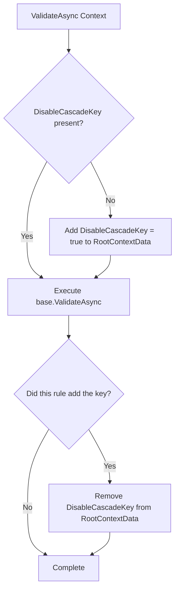

# Dependent and Included Rules

<details>
<summary>Relevant source files</summary>

The following files were used as context for generating this wiki page:

- [src/FluentValidation/TestHelper/ValidatorTestExtensions.cs](https://github.com/FluentValidation/FluentValidation/blob/main/src/FluentValidation/TestHelper/ValidatorTestExtensions.cs)
- [src/FluentValidation.Tests.Benchmarks/Models.cs](https://github.com/FluentValidation/FluentValidation/blob/main/src/FluentValidation.Tests.Benchmarks/Models.cs)
- [src/FluentValidation/Internal/RuleBase.cs](https://github.com/FluentValidation/FluentValidation/blob/main/src/FluentValidation/Internal/RuleBase.cs)
- [src/FluentValidation/Internal/RulesetValidatorSelector.cs](https://github.com/FluentValidation/Internal/RulesetValidatorSelector.cs)
- [src/FluentValidation/AbstractValidator.cs](https://github.com/FluentValidation/AbstractValidator.cs)
- [src/FluentValidation.Tests/ChainedValidationTester.cs](https://github.com/FluentValidation.Tests/ChainedValidationTester.cs)
- [src/FluentValidation.Tests/InheritanceValidatorTest.cs](https://github.com/FluentValidation.Tests/InheritanceValidatorTest.cs)
- [src/FluentValidation/Internal/IncludeRule.cs](https://github.com/FluentValidation/Internal/IncludeRule.cs)
- [src/FluentValidation/Internal/PropertyRule.cs](https://github.com/FluentValidation/Internal/PropertyRule.cs)
- [docs/start.md](https://github.com/FluentValidation/FluentValidation/blob/main/docs/start.md)
- [src/FluentValidation/Internal/MemberNameValidatorSelector.cs](https://github.com/FluentValidation/Internal/MemberNameValidatorSelector.cs)
- [src/FluentValidation.Tests/ValidatorTesterTester.cs](https://github.com/FluentValidation.Tests/ValidatorTesterTester.cs)
- [docs/rulesets.md](https://github.com/FluentValidation/FluentValidation/blob/main/docs/rulesets.md)
- [src/FluentValidation/DefaultValidatorExtensions.cs](https://github.com/FluentValidation/DefaultValidatorExtensions.cs)
- [docs/inheritance.md](https://github.com/FluentValidation/FluentValidation/blob/main/docs/inheritance.md)
</details>

## Overview

Dependent and included rules in FluentValidation provide advanced composition and structuring mechanisms that allow developers to modularize validation logic, share rule sets across validators, and manage complex hierarchical data structures. By using mechanisms like `IncludeRule` and dependent rule chains, validation logic can be cleanly refactored into reusable components or conditionally bound to parent validation outcomes without duplicating rule definitions. These composition patterns integrate seamlessly with rule sets and selector mechanisms, ensuring precise filtering and execution control across nested object graphs and polymorphic inheritance hierarchies.
Sources: [src/FluentValidation/Internal/IncludeRule.cs](https://github.com/FluentValidation/FluentValidation/blob/main/src/FluentValidation/Internal/IncludeRule.cs#L8-L76), [src/FluentValidation/Internal/PropertyRule.cs](https://github.com/FluentValidation/FluentValidation/blob/main/src/FluentValidation/Internal/PropertyRule.cs#L137-L142)

## Include Rule Composition and Execution

### Overview

The `IncludeRule` class acts as the core internal mechanism for reusing external validators and merging rule sets into parent rule trees. Inheriting from `PropertyRule<T, T>`, an `IncludeRule` treats included validators as properties of type `T` using an identity expression (`x => x`), wrapping the target validator inside a `ChildValidatorAdaptor<T, T>`. When invoked via `Include(IValidator<T>)` or `Include(Func<T, TValidator>)`, the rule is added directly to the parent validator's internal rule collection (`Rules`), allowing rules from external validator classes to execute inline within the parent rule tree.

Sources: [src/FluentValidation/AbstractValidator.cs](https://github.com/FluentValidation/AbstractValidator.cs#L345-L360), [src/FluentValidation/Internal/IncludeRule.cs](https://github.com/FluentValidation/Internal/IncludeRule.cs#L16-L38)

### Execution and Cascade State Management

During validation execution, `IncludeRule` intercepts the call to handle special state management concerning member-name filtering and cascade behavior. 



Sources: [src/FluentValidation/Internal/IncludeRule.cs](https://github.com/FluentValidation/FluentValidation/blob/main/src/FluentValidation/Internal/IncludeRule.cs#L55-L75)

> [!NOTE]
> The `DisableCascadeKey` check prevents nested `Include` rules from repeatedly adding and removing the state flag. Only the root `IncludeRule` manages the lifecycle of the state key in `RootContextData`.
> Sources: [src/FluentValidation/Internal/IncludeRule.cs](https://github.com/FluentValidation/FluentValidation/blob/main/src/FluentValidation/Internal/IncludeRule.cs#L56-L63)

### IncludeRule Creation and Adaptor Mapping

The `IncludeRule` provides overloaded creation methods supporting both static validator instances and dynamic factory functions.

| Method | Signature | Adaptor Type | Target Type | Sources |
| :--- | :--- | :--- | :--- | :--- |
| `Create` (Instance) | `Create(IValidator<T> validator, Func<CascadeMode> cascadeModeThunk)` | `ChildValidatorAdaptor<T, T>` | `typeof(T)` | [src/FluentValidation/Internal/IncludeRule.cs](https://github.com/FluentValidation/FluentValidation/blob/main/src/FluentValidation/Internal/IncludeRule.cs#L43-L45) |
| `Create` (Factory) | `Create<TValidator>(Func<T, TValidator> func, Func<CascadeMode> cascadeModeThunk)` | `ChildValidatorAdaptor<T, T>` | `typeof(TValidator)` | [src/FluentValidation/Internal/IncludeRule.cs](https://github.com/FluentValidation/FluentValidation/blob/main/src/FluentValidation/Internal/IncludeRule.cs#L50-L53) |

Sources: [src/FluentValidation/Internal/IncludeRule.cs](https://github.com/FluentValidation/FluentValidation/blob/main/src/FluentValidation/Internal/IncludeRule.cs#L40-L54)

### Design Trade-Offs

| Design Choice | Benefit | Cost | Sources |
| :--- | :--- | :--- | :--- |
| **Inheriting from `PropertyRule<T, T>`** | Reuses existing property validation machinery and pipeline structures without duplicating execution logic. | Treats validators as identity properties (`x => x`), which requires overriding member-name cascade handling explicitly. | [src/FluentValidation/Internal/IncludeRule.cs](https://github.com/FluentValidation/FluentValidation/blob/main/src/FluentValidation/Internal/IncludeRule.cs#L16-L27) |
| **RootContextData State Flags** | Disables member-name selector cascading seamlessly across nested include boundaries. | Relies on shared dictionary state mutability during asynchronous execution walks. | [src/FluentValidation/Internal/IncludeRule.cs](https://github.com/FluentValidation/FluentValidation/blob/main/src/FluentValidation/Internal/IncludeRule.cs#L56-L74) |

Sources: [src/FluentValidation/Internal/IncludeRule.cs](https://github.com/FluentValidation/FluentValidation/blob/main/src/FluentValidation/Internal/IncludeRule.cs#L16-L75)

## Dependent Rules Hierarchy and Evaluation

### Overview

Dependent rules registered via fluent extensions are managed internally as child rules attached directly to a parent rule instance. In FluentValidation, rules extend from `RuleBase<T, TProperty, TValue>`, which maintains a collection of dependent validation rules via its `DependentRules` property. When a primary property rule finishes executing successfully without generating new validation failures, its dependent rules are evaluated sequentially in the order they were registered.

Sources: [src/FluentValidation/Internal/RuleBase.cs](https://github.com/FluentValidation/FluentValidation/blob/main/src/FluentValidation/Internal/RuleBase.cs#L197-L202), [src/FluentValidation/Internal/PropertyRule.cs](https://github.com/FluentValidation/Internal/PropertyRule.cs#L137-L142)

### Call-Chain Execution Walkthrough

The evaluation sequence for property rules and their dependents follows a precise execution path through internal members:

`AbstractValidator.ValidateInternalAsync()` → `PropertyRule.ValidateAsync()` → parent component iteration and failure check → `dependentRule.ValidateAsync()`

1. **`AbstractValidator.ValidateInternalAsync()`** iterates over the validator's registered `Rules` collection using an indexed `for` loop to minimize allocations.
Sources: [src/FluentValidation/AbstractValidator.cs](https://github.com/FluentValidation/AbstractValidator.cs#L160-L171)

2. **`PropertyRule.ValidateAsync()`** executes each component in `Components`. It tracks the initial failure count via `totalFailures = context.Failures.Count`.
Sources: [src/FluentValidation/Internal/PropertyRule.cs](https://github.com/FluentValidation/Internal/PropertyRule.cs#L89-L135)

3. **Parent Failure Evaluation Branch**: After running all components on the parent rule, the method checks `if (context.Failures.Count <= totalFailures && DependentRules != null)`. If the parent rule generated any failures, dependent rules are skipped entirely.
Sources: [src/FluentValidation/Internal/PropertyRule.cs](https://github.com/FluentValidation/Internal/PropertyRule.cs#L137-L137)

4. **Dependent Rule Iteration**: When no failures occurred, it iterates through each `dependentRule` in `DependentRules`, invoking `cancellation.ThrowIfCancellationRequested()` and calling `await dependentRule.ValidateAsync(context, cancellation)` for each child rule.
Sources: [src/FluentValidation/Internal/PropertyRule.cs](https://github.com/FluentValidation/Internal/PropertyRule.cs#L138-L142)

> [!NOTE]
> Dependent rules only execute if the parent rule passes completely without adding new validation failures to the context. If a parent rule fails, all associated dependent rules are bypassed.
> Sources: [src/FluentValidation/Internal/PropertyRule.cs](https://github.com/FluentValidation/Internal/PropertyRule.cs#L137-L142)

### Dependent Rules Interface and Collection API

Internal management of dependent rules is exposed through interface contracts defined on rule base classes and internal rule collections.

| Member Name | Containing Type | Return Type / Signature | Purpose | Sources |
| :--- | :--- | :--- | :--- | :--- |
| `DependentRules` | `RuleBase<T, TProperty, TValue>` | `List<IValidationRuleInternal<T>>` | Stores the collection of child rules dependent on the parent rule. | [src/FluentValidation/Internal/RuleBase.cs](https://github.com/FluentValidation/Internal/RuleBase.cs#L197-L199) |
| `AddDependentRules` | `IValidationRuleInternal<T>` | `void AddDependentRules(IEnumerable<IValidationRuleInternal<T>> rules)` | Appends a sequence of rules to the dependent rules list, initializing the list if null. | [src/FluentValidation/Internal/PropertyRule.cs](https://github.com/FluentValidation/Internal/PropertyRule.cs#L145-L149) |
| `ApplyCondition` | `RuleBase<T, TProperty, TValue>` | `void ApplyCondition(Func<ValidationContext<T>, bool> predicate, ApplyConditionTo applyConditionTo)` | Recursively applies conditional predicates to components and all nested dependent rules when `ApplyConditionTo.AllValidators` is specified. | [src/FluentValidation/Internal/RuleBase.cs](https://github.com/FluentValidation/Internal/RuleBase.cs#L217-L229) |
| `ApplyAsyncCondition` | `RuleBase<T, TProperty, TValue>` | `void ApplyAsyncCondition(Func<ValidationContext<T>, CancellationToken, Task<bool>> predicate, ApplyConditionTo applyConditionTo)` | Recursively applies asynchronous conditional predicates to components and all nested dependent rules when `ApplyConditionTo.AllValidators` is specified. | [src/FluentValidation/Internal/RuleBase.cs](https://github.com/FluentValidation/Internal/RuleBase.cs#L240-L252) |

Sources: [src/FluentValidation/Internal/RuleBase.cs](https://github.com/FluentValidation/Internal/RuleBase.cs#L197-L256), [src/FluentValidation/Internal/PropertyRule.cs](https://github.com/FluentValidation/Internal/PropertyRule.cs#L145-L149)

> [!TIP]
> When applying `When` or `Unless` conditions to a rule with dependent rules using `ApplyConditionTo.AllValidators`, the condition propagates down into every registered dependent rule automatically.
> Sources: [src/FluentValidation/Internal/RuleBase.cs](https://github.com/FluentValidation/Internal/RuleBase.cs#L217-L229)

### Design Trade-Offs

| Design Choice | Benefit | Cost | Sources |
| :--- | :--- | :--- | :--- |
| **Failure-Gate Execution (`Count <= totalFailures`)** | Prevents cascading dependent validations on invalid models, reducing redundant evaluations and error noise. | Couples dependent rule execution directly to parent failure counts, making independent execution impossible without restructuring rules. | [src/FluentValidation/Internal/PropertyRule.cs](https://github.com/FluentValidation/Internal/PropertyRule.cs#L137-L142) |
| **Recursive Condition Propagation** | Ensures global rule conditions (`When`/`Unless`) apply uniformly to both parent components and all nested dependent rules. | Mutates condition state across child rules during builder configuration, requiring careful ordering of fluent method calls. | [src/FluentValidation/Internal/RuleBase.cs](https://github.com/FluentValidation/Internal/RuleBase.cs#L217-L252) |

Sources: [src/FluentValidation/Internal/RuleBase.cs](https://github.com/FluentValidation/Internal/RuleBase.cs#L217-L252), [src/FluentValidation/Internal/PropertyRule.cs](https://github.com/FluentValidation/Internal/PropertyRule.cs#L137-L142)

## Ruleset and Member Selection Mechanics

### Overview

The validation pipeline utilizes `RulesetValidatorSelector` and `MemberNameValidatorSelector` to dynamically filter which validation rules execute during a validation run. These selectors implement `IValidatorSelector` and evaluate each incoming rule against requested rule sets or member names.

Sources: [src/FluentValidation/Internal/RulesetValidatorSelector.cs](https://github.com/FluentValidation/Internal/RulesetValidatorSelector.cs#L10-L77), [src/FluentValidation/Internal/MemberNameValidatorSelector.cs](https://github.com/FluentValidation/Internal/MemberNameValidatorSelector.cs#L30-L137)

### Ruleset Selection Mechanics

`RulesetValidatorSelector` manages execution according to active rule set filters supplied in validation options. 

| Constant Name | Value | Meaning | Sources |
| :--- | :--- | :--- | :--- |
| `DefaultRuleSetName` | `"default"` | Represents rules that do not belong to an explicit named rule set. | [src/FluentValidation/Internal/RulesetValidatorSelector.cs](https://github.com/FluentValidation/Internal/RulesetValidatorSelector.cs#L12-L12) |
| `WildcardRuleSetName` | `"*"` | Matches all rule sets, forcing every rule to execute. | [src/FluentValidation/Internal/RulesetValidatorSelector.cs](https://github.com/FluentValidation/Internal/RulesetValidatorSelector.cs#L13-L13) |

Sources: [src/FluentValidation/Internal/RulesetValidatorSelector.cs](https://github.com/FluentValidation/Internal/RulesetValidatorSelector.cs#L12-L13)

When `CanExecute(IValidationRule rule, string propertyPath, IValidationContext context)` is invoked:
1. It retrieves or creates a `HashSet<string>` tracking executed rule sets from `context.RootContextData` using key `_FV_RuleSetsExecuted`.
Sources: [src/FluentValidation/Internal/RulesetValidatorSelector.cs](https://github.com/FluentValidation/Internal/RulesetValidatorSelector.cs#L35-L36)
2. If `rule.RuleSets` is empty and explicit rule sets are requested, it checks `IsIncludeRule(rule)` (returning `true` if it implements `IIncludeRule`).
Sources: [src/FluentValidation/Internal/RulesetValidatorSelector.cs](https://github.com/FluentValidation/Internal/RulesetValidatorSelector.cs#L38-L42)
3. If no explicit rule sets are requested and the rule has no rule sets, it records `default` in executed rule sets and returns `true`.
Sources: [src/FluentValidation/Internal/RulesetValidatorSelector.cs](https://github.com/FluentValidation/Internal/RulesetValidatorSelector.cs#L44-L47)
4. If `default` is requested, rules lacking rule sets or explicitly tagged with `default` are executed.
Sources: [src/FluentValidation/Internal/RulesetValidatorSelector.cs](https://github.com/FluentValidation/Internal/RulesetValidatorSelector.cs#L49-L54)
5. If both the rule and requested collections contain entries, it computes their intersection using `StringComparer.OrdinalIgnoreCase`.
Sources: [src/FluentValidation/Internal/RulesetValidatorSelector.cs](https://github.com/FluentValidation/Internal/RulesetValidatorSelector.cs#L56-L62)
6. If the wildcard `*` is requested, all rule names are marked as executed and it returns `true`.
Sources: [src/FluentValidation/Internal/RulesetValidatorSelector.cs](https://github.com/FluentValidation/Internal/RulesetValidatorSelector.cs#L64-L74), [docs/rulesets.md](https://github.com/FluentValidation/FluentValidation/blob/main/docs/rulesets.md#L47-L68)

> [!NOTE]
> Rules included via `Include()` bypass standard ruleset restrictions when no rulesets are explicitly specified, permitting embedded validation rules to evaluate correctly.
> Sources: [src/FluentValidation/Internal/RulesetValidatorSelector.cs](https://github.com/FluentValidation/Internal/RulesetValidatorSelector.cs#L38-L42)

### Member Name Selection Mechanics

`MemberNameValidatorSelector` filters rules by property path. 

```csharp
public bool CanExecute (IValidationRule rule, string propertyPath, IValidationContext context) {
    bool isChildContext = context.IsChildContext;
    bool cascadeEnabled = !context.RootContextData.ContainsKey(DisableCascadeKey);

    if (isChildContext && cascadeEnabled && !_memberNames.Any(x => x.Contains('.'))) {
        return true;
    }

    if (rule is IIncludeRule) {
        return true;
    }

    string normalizedPropertyPath = null;

    foreach (var memberName in _memberNames) {
        if (memberName == propertyPath) {
            return true;
        }
        if (propertyPath.StartsWith(memberName + ".")) {
            return true;
        }
        if (memberName.StartsWith(propertyPath + ".")) {
            return true;
        }
        if (memberName.StartsWith(propertyPath + "[")) {
            return true;
        }
        if (memberName.Contains("[]")) {
            if (normalizedPropertyPath == null) {
                normalizedPropertyPath = CollectionIndexNormalizer().Replace(propertyPath, "[]");
            }
            if (memberName == normalizedPropertyPath || memberName.StartsWith(normalizedPropertyPath + ".") || memberName.StartsWith(normalizedPropertyPath + "[")) {
                return true;
            }
        }
    }
    return false;
}
```
Sources: [src/FluentValidation/Internal/MemberNameValidatorSelector.cs](https://github.com/FluentValidation/Internal/MemberNameValidatorSelector.cs#L56-L137)

> [!WARNING]
> Setting `_FV_DisableSelectorCascadeForChildRules` inside `RootContextData` disables automatic cascade behavior for child rules when executing with member name selectors.
> Sources: [src/FluentValidation/Internal/MemberNameValidatorSelector.cs](https://github.com/FluentValidation/Internal/MemberNameValidatorSelector.cs#L31-L61)

## Validator Reuse and Inheritance Integration

### Validator Reuse and Inheritance Integration

FluentValidation provides robust composition patterns for validating complex properties, child object hierarchies, and polymorphism through specialized extensions. When dealing with properties that represent base classes or interfaces, standard child validators cannot inspect subclass-specific properties without runtime type matching. The `SetInheritanceValidator` extension method solves this by registering a `PolymorphicValidator` instance that dynamically dispatches validation to the appropriate subclass validator based on the runtime type of the property value.

```csharp
var validator = new InlineValidator<Root>();
var impl1Validator = new InlineValidator<FooImpl1>();
var impl2Validator = new InlineValidator<FooImpl2>();

impl1Validator.RuleFor(x => x.Name).NotNull();
impl2Validator.RuleFor(x => x.Number).GreaterThan(0);

validator.RuleFor(x => x.Foo).SetInheritanceValidator(v => {
    v.Add(impl1Validator)
     .Add(impl2Validator);
});
```
Sources: [src/FluentValidation.Tests/InheritanceValidatorTest.cs](https://github.com/FluentValidation.Tests/InheritanceValidatorTest.cs#L31-L41), [src/FluentValidation/DefaultValidatorExtensions.cs](https://github.com/FluentValidation/DefaultValidatorExtensions.cs#L1242-L1247)

### Inheritance Validator Execution Path

When an inheritance validator executes against a polymorphic property, it follows a structured registration and invocation sequence:

1. `SetInheritanceValidator()` is invoked on an `IRuleBuilder<T, TProperty>`, instantiating a `PolymorphicValidator<T, TProperty>` via `DefaultValidatorExtensions.SetInheritanceValidator`.
   Sources: [src/FluentValidation/DefaultValidatorExtensions.cs](https://github.com/FluentValidation/DefaultValidatorExtensions.cs#L1242-L1247)
2. The user configuration callback registers subclass validators using `.Add(implValidator)` or overload variants taking runtime evaluation callbacks.
   Sources: [src/FluentValidation.Tests/InheritanceValidatorTest.cs](https://github.com/FluentValidation.Tests/InheritanceValidatorTest.cs#L38-L41), [src/FluentValidation.Tests/InheritanceValidatorTest.cs#L132-L135), [src/FluentValidation.Tests/InheritanceValidatorTest.cs#L180-L189)
3. During `Validate()` or `ValidateAsync()`, the polymorphic validator inspects the runtime type of the instance property (`TProperty`).
   Sources: [src/FluentValidation.Tests/InheritanceValidatorTest.cs](https://github.com/FluentValidation.Tests/InheritanceValidatorTest.cs#L43-L50), [src/FluentValidation.Tests/InheritanceValidatorTest.cs#L67-L74)
4. It resolves the matching child validator registered for that exact derived type and executes its rule tree, prepending the parent property path (or collection index) to any resulting `ValidationError` property names.
   Sources: [src/FluentValidation.Tests/InheritanceValidatorTest.cs](https://github.com/FluentValidation.Tests/InheritanceValidatorTest.cs#L43-L50), [src/FluentValidation.Tests/InheritanceValidatorTest.cs#L93-L97)

> [!NOTE]
> `SetInheritanceValidator` supports both synchronous and asynchronous child rules, collections (`RuleForEach`), explicit rulesets per subclass, and factory callbacks accepting the parent instance or derived instance directly.
> Sources: [src/FluentValidation.Tests/InheritanceValidatorTest.cs](https://github.com/FluentValidation.Tests/InheritanceValidatorTest.cs#L54-L75), [src/FluentValidation.Tests/InheritanceValidatorTest.cs#L86-L90), [src/FluentValidation.Tests/InheritanceValidatorTest.cs#L180-L189), [src/FluentValidation.Tests/InheritanceValidatorTest.cs#L250-L253)

### Polymorphic and Complex Property Options

| Extension / Method | Target Type | Behavior & Purpose | Sources |
| :--- | :--- | :--- | :--- |
| `SetInheritanceValidator()` | `IRuleBuilder<T, TProperty>` | Registers a `PolymorphicValidator` allowing multiple subclass-specific validators for base class or interface properties. | [src/FluentValidation/DefaultValidatorExtensions.cs](https://github.com/FluentValidation/DefaultValidatorExtensions.cs#L1242-L1247) |
| `ChildRules()` | `IRuleBuilder<T, TProperty>` | Defines inline child rules for a nested property using an `InlineValidator<TProperty>` container, inheriting parent ruleset scopes automatically. | [src/FluentValidation/DefaultValidatorExtensions.cs](https://github.com/FluentValidation/DefaultValidatorExtensions.cs#L1205-L1232) |
| `SetValidator()` | `IRuleBuilder<T, TProperty?>` | Associates an external validator instance or `InlineValidator` with a complex property or nullable struct property. | [src/FluentValidation/DefaultValidatorExtensions.cs](https://github.com/FluentValidation/DefaultValidatorExtensions.cs#L43-L50), [src/FluentValidation.Tests/ChainedValidationTester.cs](https://github.com/FluentValidation.Tests/ChainedValidationTester.cs#L106-L108) |

Sources: [src/FluentValidation/DefaultValidatorExtensions.cs](https://github.com/FluentValidation/DefaultValidatorExtensions.cs#L43-L50), [src/FluentValidation/DefaultValidatorExtensions.cs](https://github.com/FluentValidation/DefaultValidatorExtensions.cs#L1205-L1232), [src/FluentValidation/DefaultValidatorExtensions.cs](https://github.com/FluentValidation/DefaultValidatorExtensions.cs#L1242-L1247), [src/FluentValidation.Tests/ChainedValidationTester.cs](https://github.com/FluentValidation.Tests/ChainedValidationTester.cs#L106-L108)

## Testing Subtree Rules and Validations

### Overview

FluentValidation provides test extension methods in the `FluentValidation.TestHelper` namespace that enable unit testing of validation rules, child validators, dependent rules, and rule sets. The `TestValidate` and `TestValidateAsync` methods execute validation against an object instance or a custom `ValidationContext<T>`, returning a `TestValidationResult<T>` that encapsulates validation failures and supports fluent assertion chains.
Sources: [src/FluentValidation/TestHelper/ValidatorTestExtensions.cs](https://github.com/FluentValidation/TestHelper/ValidatorTestExtensions.cs#L34-L120), [src/FluentValidation.Tests/ValidatorTesterTester.cs](https://github.com/FluentValidation.Tests/ValidatorTesterTester.cs#L30-L45)

### Verification Helpers and Child Validator Inspection

When inspecting property rules, the `ShouldHaveChildValidator` extension method evaluates whether a specified property or model-level rule contains a registered child validator of a given type. It queries the validator descriptor to retrieve rules and member validators, automatically incorporating dependent rules associated with that member expression.
Sources: [src/FluentValidation/TestHelper/ValidatorTestExtensions.cs](https://github.com/FluentValidation/TestHelper/ValidatorTestExtensions.cs#L38-L61)

```csharp
[Fact]
public void ShouldHaveChildValidator_should_work_with_DependentRules() {
    var validator = new InlineValidator<Person>();

    validator.RuleFor(x => x.Children)
        .NotNull().When(p => true)
        .DependentRules(() => {
            validator.RuleForEach(p => p.Children).SetValidator(p => new InlineValidator<Person>());
        });

    validator.ShouldHaveChildValidator(x => x.Children, typeof(InlineValidator<Person>));
}
```
Sources: [src/FluentValidation.Tests/ValidatorTesterTester.cs](https://github.com/FluentValidation.Tests/ValidatorTesterTester.cs#L623-L633)

> [!WARNING]
> `ShouldHaveChildValidator` can only be used for simple property expressions or model-level rules. Using it for expressions containing anything other than a simple property reference throws a `NotSupportedException`.
> Sources: [src/FluentValidation/TestHelper/ValidatorTestExtensions.cs](https://github.com/FluentValidation/TestHelper/ValidatorTestExtensions.cs#L38-L44)

### Call-Chain Execution Walkthrough: `ShouldHaveChildValidator`

1. `ShouldHaveChildValidator()` is invoked on an `IValidator<T>` with a member expression and a target child validator `Type`.
   Sources: [src/FluentValidation/TestHelper/ValidatorTestExtensions.cs](https://github.com/FluentValidation/TestHelper/ValidatorTestExtensions.cs#L38-L40)
2. `validator.CreateDescriptor()` builds an `IValidatorDescriptor`, and `expression.GetMember()?.Name` extracts the target property name.
   Sources: [src/FluentValidation/TestHelper/ValidatorTestExtensions.cs](https://github.com/FluentValidation/TestHelper/ValidatorTestExtensions.cs#L39-L40)
3. If `expression.IsParameterExpression()` is true, `GetModelLevelValidators<T>()` retrieves model-level components; otherwise, `descriptor.GetValidatorsForMember()` fetches registered property validators.
   Sources: [src/FluentValidation/TestHelper/ValidatorTestExtensions.cs](https://github.com/FluentValidation/TestHelper/ValidatorTestExtensions.cs#L46-L50), [src/FluentValidation/TestHelper/ValidatorTestExtensions.cs](https://github.com/FluentValidation/TestHelper/ValidatorTestExtensions.cs#L75-L81)
4. `GetDependentRules()` queries `descriptor.GetRulesForMember()`, casts rules to `IValidationRuleInternal<T>`, extracts their `DependentRules`, and flattens their rule components and property validators.
   Sources: [src/FluentValidation/TestHelper/ValidatorTestExtensions.cs](https://github.com/FluentValidation/TestHelper/ValidatorTestExtensions.cs#L53-L53), [src/FluentValidation/TestHelper/ValidatorTestExtensions.cs](https://github.com/FluentValidation/TestHelper/ValidatorTestExtensions.cs#L63-L73)
5. The matching validators are concatenated, filtered by `IChildValidatorAdaptor`, and checked against the expected child validator type; if unassignable, a `ValidationTestException` is thrown.
   Sources: [src/FluentValidation/TestHelper/ValidatorTestExtensions.cs](https://github.com/FluentValidation/TestHelper/ValidatorTestExtensions.cs#L53-L60)

### Assertion and Continuation Methods

| Test Extension Method | Return Type | Purpose & Behavior | Sources |
| :--- | :--- | :--- | :--- |
| `TestValidate()` / `TestValidateAsync()` | `TestValidationResult<T>` | Executes synchronous or asynchronous validation and wraps the resulting `ValidationResult`. | [src/FluentValidation/TestHelper/ValidatorTestExtensions.cs](https://github.com/FluentValidation/TestHelper/ValidatorTestExtensions.cs#L86-L120) |
| `ShouldHaveValidationErrorFor()` | `ITestValidationContinuation` | Asserts that a validation error was raised for the specified property or model expression. | [src/FluentValidation.Tests/ValidatorTesterTester.cs](https://github.com/FluentValidation.Tests/ValidatorTesterTester.cs#L42-L45), [src/FluentValidation.Tests/ValidatorTesterTester.cs](https://github.com/FluentValidation.Tests/ValidatorTesterTester.cs#L88-L98) |
| `ShouldNotHaveValidationErrorFor()` | `void` | Asserts that no validation errors occurred for the specified property expression. | [src/FluentValidation.Tests/ValidatorTesterTester.cs](https://github.com/FluentValidation.Tests/ValidatorTesterTester.cs#L58-L61), [src/FluentValidation.Tests/ValidatorTesterTester.cs](https://github.com/FluentValidation.Tests/ValidatorTesterTester.cs#L101-L110) |
| `WithErrorCode()` / `WithErrorMessage()` | `ITestValidationWith` | Refines a failure assertion by matching specific error codes or error messages. | [src/FluentValidation/TestHelper/ValidatorTestExtensions.cs](https://github.com/FluentValidation/TestHelper/ValidatorTestExtensions.cs#L183-L189) |
| `Only()` | `ITestValidationWith` | Asserts that no unexpected validation errors exist outside the filtered matched failures, including parent continuation scopes. | [src/FluentValidation/TestHelper/ValidatorTestExtensions.cs](https://github.com/FluentValidation/TestHelper/ValidatorTestExtensions.cs#L207-L232) |

Sources: [src/FluentValidation/TestHelper/ValidatorTestExtensions.cs](https://github.com/FluentValidation/TestHelper/ValidatorTestExtensions.cs#L86-L120), [src/FluentValidation/TestHelper/ValidatorTestExtensions.cs](https://github.com/FluentValidation/TestHelper/ValidatorTestExtensions.cs#L183-L189), [src/FluentValidation/TestHelper/ValidatorTestExtensions.cs](https://github.com/FluentValidation/TestHelper/ValidatorTestExtensions.cs#L207-L232), [src/FluentValidation.Tests/ValidatorTesterTester.cs](https://github.com/FluentValidation.Tests/ValidatorTesterTester.cs#L42-L61), [src/FluentValidation.Tests/ValidatorTesterTester.cs#L88-L110)

> [!TIP]
> When testing rules defined inside specific rule sets, pass an options delegate to `TestValidate` using `opt.IncludeRuleSets("RuleSetName")` to ensure rules within that rule set are executed and inspected correctly.
> Sources: [src/FluentValidation.Tests/ValidatorTesterTester.cs](https://github.com/FluentValidation.Tests/ValidatorTesterTester.cs#L206-L216)

## Related

- [[Validation Core]]
- [[Validator Definition]]

