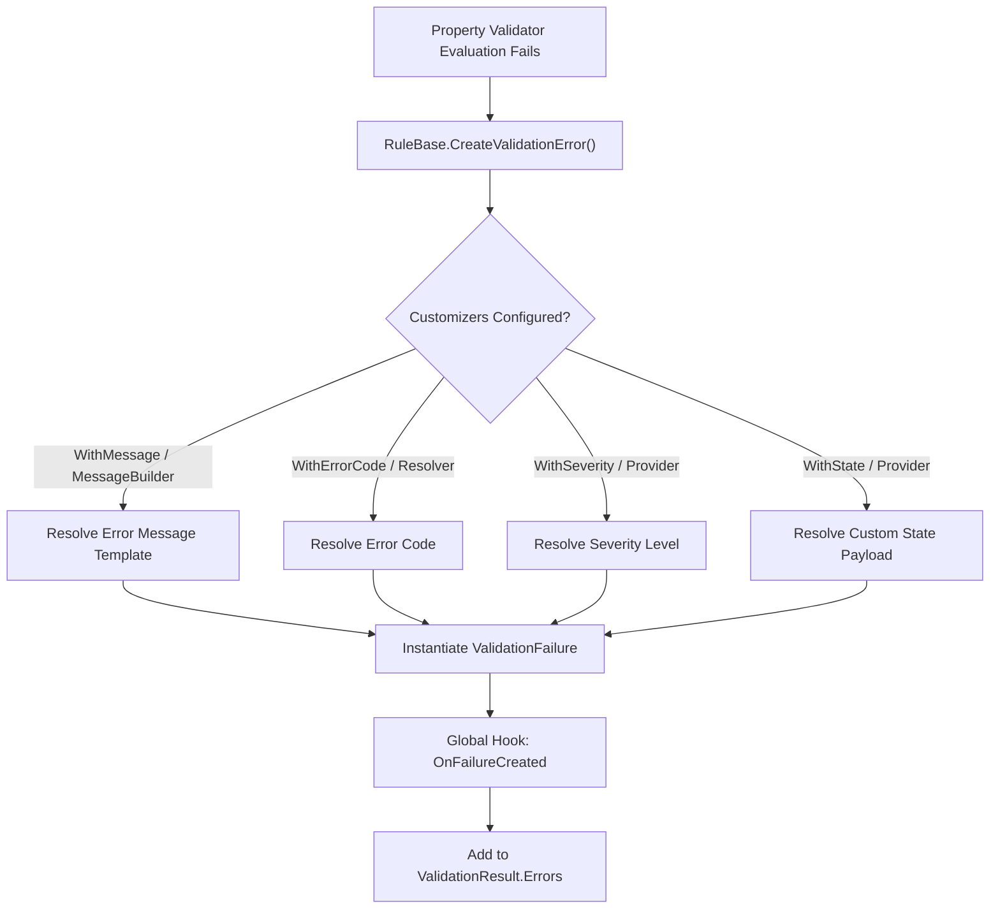
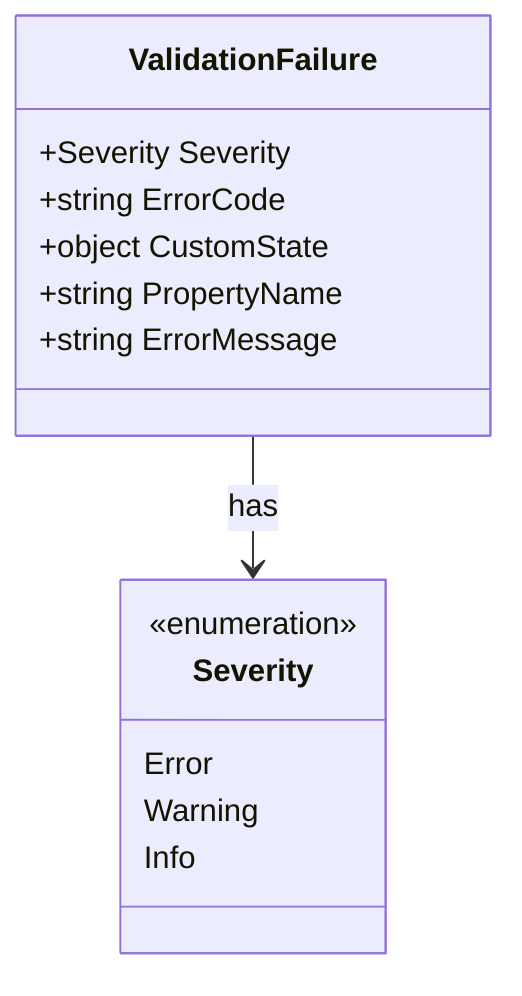

# Error Customization

<details>
<summary>Relevant source files</summary>

The following files were used as context for generating this wiki page:

- [src/FluentValidation/TestHelper/ValidatorTestExtensions.cs](https://github.com/FluentValidation/FluentValidation/blob/main/src/FluentValidation/TestHelper/ValidatorTestExtensions.cs)
- [src/FluentValidation.Tests/ValidatorTesterTester.cs](https://github.com/FluentValidation/FluentValidation.Tests/ValidatorTesterTester.cs)
- [src/FluentValidation/Internal/RuleBase.cs](https://github.com/FluentValidation/FluentValidation/blob/main/src/FluentValidation/Internal/RuleBase.cs)
- [src/FluentValidation/DefaultValidatorOptions.cs](https://github.com/FluentValidation/FluentValidation/blob/main/src/FluentValidation/DefaultValidatorOptions.cs)
- [src/FluentValidation/Internal/RuleComponent.cs](https://github.com/FluentValidation/FluentValidation/blob/main/src/FluentValidation/Internal/RuleComponent.cs)
- [src/FluentValidation/ValidationException.cs](https://github.com/FluentValidation/ValidationException.cs)
- [src/FluentValidation.Tests/UserStateTester.cs](https://github.com/FluentValidation/FluentValidation.Tests/UserStateTester.cs)
- [src/FluentValidation/IValidationContext.cs](https://github.com/FluentValidation/FluentValidation/blob/main/src/FluentValidation/IValidationContext.cs)
- [src/FluentValidation/Results/ValidationFailure.cs](https://github.com/FluentValidation/FluentValidation/blob/main/src/FluentValidation/Results/ValidationFailure.cs)
- [src/FluentValidation.Tests/UserSeverityTester.cs](https://github.com/FluentValidation/FluentValidation.Tests/UserSeverityTester.cs)
- [src/FluentValidation/Internal/IRuleComponent.cs](https://github.com/FluentValidation/FluentValidation/blob/main/src/FluentValidation/Internal/IRuleComponent.cs)
- [src/FluentValidation.Tests/AbstractValidatorTester.cs](https://github.com/FluentValidation/FluentValidation.Tests/AbstractValidatorTester.cs)
- [src/FluentValidation/Results/ValidationResult.cs](https://github.com/FluentValidation/FluentValidation/blob/main/src/FluentValidation/Results/ValidationResult.cs)
- [src/FluentValidation.Tests/CascadingFailuresTester.cs](https://github.com/FluentValidation/FluentValidation.Tests/CascadingFailuresTester.cs)
- [docs/error-codes.md](https://github.com/FluentValidation/FluentValidation/blob/main/docs/error-codes.md)
- [docs/severity.md](https://github.com/FluentValidation/FluentValidation/blob/main/docs/severity.md)
- [docs/custom-state.md](https://github.com/FluentValidation/FluentValidation/blob/main/docs/custom-state.md)
- [src/FluentValidation/Enums.cs](https://github.com/FluentValidation/FluentValidation/blob/main/src/FluentValidation/Enums.cs)
- [src/FluentValidation/TestHelper/ValidationTestException.cs](https://github.com/FluentValidation/FluentValidation/blob/main/src/FluentValidation/TestHelper/ValidationTestException.cs)
- [src/FluentValidation.Tests/OnFailureHookTester.cs](https://github.com/FluentValidation/FluentValidation.Tests/OnFailureHookTester.cs)
- [docs/advanced.md](https://github.com/FluentValidation/FluentValidation/blob/main/docs/advanced.md)
- [src/FluentValidation.Tests/ValidateAndThrowTester.cs](https://github.com/FluentValidation/FluentValidation.Tests/ValidateAndThrowTester.cs)
- [docs/start.md](https://github.com/FluentValidation/FluentValidation/blob/main/docs/start.md)
- [src/FluentValidation.Tests/CustomValidatorTester.cs](https://github.com/FluentValidation/FluentValidation.Tests/CustomValidatorTester.cs)
</details>

## Overview

Error Customization in FluentValidation provides a mechanism to override, enrich, and transform default validation failure attributes—such as error messages, error codes, severity levels, property names, and user state payloads—generated during rule execution. Rather than being restricted to built-in string formats or default error properties, developers can supply dynamic delegates, custom message templates, or global interception hooks to tailor every facet of a `ValidationFailure` instance.
Sources: [src/FluentValidation/Internal/RuleBase.cs:320-343](https://github.com/FluentValidation/FluentValidation/blob/main/src/FluentValidation/Internal/RuleBase.cs#L320-L343)

This capability operates at the boundary where a validation rule component fails and constructs a `ValidationFailure` object. By attaching extension methods like `WithMessage`, `WithErrorCode`, `WithSeverity`, `WithState`, and `WithName` directly to a `RuleBuilder`, developers can inject custom factories that execute against the current validation context and property value. These customizations flow through `RuleBase.CreateValidationError`, populating the resulting failure object before it is added to the validation results or exception pipelines.
Sources: [src/FluentValidation/DefaultValidatorOptions.cs:115-585](https://github.com/FluentValidation/FluentValidation/blob/main/src/FluentValidation/DefaultValidatorOptions.cs#L115-L585)


Sources: [src/FluentValidation/Internal/RuleBase.cs:320-343](https://github.com/FluentValidation/FluentValidation/blob/main/src/FluentValidation/Internal/RuleBase.cs#L320-L343)

---

## Custom Error Messages and Templates

Error message customization allows developers to replace default validation messages with static strings or dynamic factories. The `WithMessage` extension method operates on `IRuleBuilderOptions<T, TProperty>` and updates the underlying `RuleComponent` by storing either a literal error string or a message factory delegate.
Sources: [src/FluentValidation/DefaultValidatorOptions.cs:119-151](https://github.com/FluentValidation/FluentValidation/blob/main/src/FluentValidation/DefaultValidatorOptions.cs#L119-L151)

When validation fails, `RuleComponent.GetErrorMessage` evaluates any registered `_errorMessageFactory` or raw `_errorMessage`. If neither is explicitly provided on the component, it falls back to querying the validator's language manager using the component's `ErrorCode` as the lookup key. Message templates support placeholders such as `{PropertyName}`, `{PropertyValue}`, `{PropertyPath}`, and custom arguments appended via the `MessageFormatter`.
Sources: [src/FluentValidation/Internal/RuleComponent.cs:163-211](https://github.com/FluentValidation/FluentValidation/blob/main/src/FluentValidation/Internal/RuleComponent.cs#L163-L211)

```csharp
public class PersonValidator : AbstractValidator<Person> {
    public PersonValidator() {
        RuleFor(x => x.Surname)
            .NotNull()
            .WithMessage("Surname cannot be missing.")
            .WithState(x => x.Age);
    }
}
```
Sources: [src/FluentValidation/DefaultValidatorOptions.cs:119-151](https://github.com/FluentValidation/FluentValidation/blob/main/src/FluentValidation/DefaultValidatorOptions.cs#L119-L151)

---

## Error Codes and Lookup Mechanics

Every rule component possesses an `ErrorCode` property that serves a dual purpose: identifying the classification of the failure in client applications and acting as the dictionary lookup key for default localization strings. By default, the error code is resolved via `ValidatorOptions.Global.ErrorCodeResolver(component.Validator)`, which defaults to the validator type name (e.g., `"NotNullValidator"`).
Sources: [src/FluentValidation/Internal/RuleBase.cs:328](https://github.com/FluentValidation/FluentValidation/blob/main/src/FluentValidation/Internal/RuleBase.cs#L328)

Developers can override this classification by invoking `WithErrorCode`. If an error code is explicitly supplied alongside a custom message or matched against localization tables, the engine delegates lookup through the configured resolution pipeline.
Sources: [src/FluentValidation/DefaultValidatorOptions.cs:159-163](https://github.com/FluentValidation/FluentValidation/blob/main/src/FluentValidation/DefaultValidatorOptions.cs#L159-L163)

| Configuration Method | Parameter Signature | Target Property / Field | Default Behavior |
| :--- | :--- | :--- | :--- |
| `WithErrorCode` | `string errorCode` | `RuleComponent.ErrorCode` | Evaluates `ValidatorOptions.Global.ErrorCodeResolver` |
| `WithName` | `string` or `Func<T, string>` | `ValidationContext.DisplayName` | Uses PascalCase-split property name |
| `OverridePropertyName` | `string` or `Expression<Func<T, object>>` | `RuleBase.PropertyName` | Uses member expression name |
Sources: [src/FluentValidation/DefaultValidatorOptions.cs:159-462](https://github.com/FluentValidation/FluentValidation/blob/main/src/FluentValidation/DefaultValidatorOptions.cs#L159-L462)

---

## Severity Level Assignment

Validation failures carry a `Severity` property of type `Severity`, defaulting to `Severity.Error`. FluentValidation supports three discrete severity tiers: `Error`, `Warning`, and `Info`.
Sources: [src/FluentValidation/Enums.cs:57-70](https://github.com/FluentValidation/FluentValidation/blob/main/src/FluentValidation/Enums.cs#L57-L70)


Sources: [src/FluentValidation/Results/ValidationFailure.cs:73-82](https://github.com/FluentValidation/FluentValidation/blob/main/src/FluentValidation/Results/ValidationFailure.cs#L73-L82)

Developers can configure severity at the rule level using overloaded `WithSeverity` extension methods or establish a global default via `ValidatorOptions.Global.Severity`. When a severity provider delegate is assigned, it receives parameters corresponding to the validated model instance, property value, and validation context.
Sources: [src/FluentValidation/DefaultValidatorOptions.cs:525-585](https://github.com/FluentValidation/FluentValidation/blob/main/src/FluentValidation/DefaultValidatorOptions.cs#L525-L585)

```csharp
RuleFor(person => person.Surname)
    .NotNull()
    .WithSeverity(person => person.Age > 10 ? Severity.Info : Severity.Warning);
```
Sources: [src/FluentValidation.Tests/UserSeverityTester.cs:92-103](https://github.com/FluentValidation/FluentValidation.Tests/UserSeverityTester.cs#L92-L103)

> [!NOTE]
> Setting a rule failure severity to `Severity.Warning` or `Severity.Info` changes metadata on the resulting `ValidationFailure`, but does *not* automatically cause `ValidationResult.IsValid` to evaluate to `true`. `IsValid` checks strictly whether `Errors.Count == 0`.
Sources: [src/FluentValidation/Results/ValidationResult.cs:35](https://github.com/FluentValidation/FluentValidation/blob/main/src/FluentValidation/Results/ValidationResult.cs#L35)

---

## Custom State Payloads

The `WithState` extension family allows attaching arbitrary contextual payloads to a `ValidationFailure.CustomState` property when a rule fails. State providers can accept the parent model instance, the failing property value, or the active `ValidationContext<T>`.
Sources: [src/FluentValidation/DefaultValidatorOptions.cs:472-515](https://github.com/FluentValidation/FluentValidation/blob/main/src/FluentValidation/DefaultValidatorOptions.cs#L472-L515)

During `RuleBase.CreateValidationError`, if `component.CustomStateProvider` is non-null, it is invoked with the current validation context and property value, assigning the return value directly to `failure.CustomState`.
Sources: [src/FluentValidation/Internal/RuleBase.cs:334-336](https://github.com/FluentValidation/FluentValidation/blob/main/src/FluentValidation/Internal/RuleBase.cs#L334-L336)

```csharp
validator.RuleFor(x => x.Surname)
    .NotNull()
    .WithState((p, surname, ctx) => new {
        ModelId = p.Id,
        RootData = ctx.RootContextData["SessionToken"]
    });
```
Sources: [src/FluentValidation.Tests/UserStateTester.cs:70-82](https://github.com/FluentValidation/FluentValidation.Tests/UserStateTester.cs#L70-L82)

---

## Global Interception via OnFailureCreated

For cross-cutting concerns that require modifying or inspecting every validation failure instance generated across an entire application, FluentValidation exposes a global lifecycle hook: `ValidatorOptions.Global.OnFailureCreated`.
Sources: [src/FluentValidation/Internal/RuleBase.cs:338-340](https://github.com/FluentValidation/FluentValidation/blob/main/src/FluentValidation/Internal/RuleBase.cs#L338-L340)

When configured, this delegate is invoked at the terminal step of `RuleBase.CreateValidationError`, receiving the newly created `ValidationFailure`, the active validation context, property value, parent rule, and rule component.
Sources: [src/FluentValidation/Internal/RuleBase.cs:338-340](https://github.com/FluentValidation/FluentValidation/blob/main/src/FluentValidation/Internal/RuleBase.cs#L338-L340)

```csharp
ValidatorOptions.Global.OnFailureCreated = (failure, context, propertyValue, rule, component) => {
    failure.ErrorCode = "GLOBAL_" + failure.ErrorCode;
    return failure;
};
```
Sources: [src/FluentValidation.Tests/OnFailureHookTester.cs:28-31](https://github.com/FluentValidation/FluentValidation.Tests/OnFailureHookTester.cs#L28-L31)

> [!WARNING]
> Because `OnFailureCreated` is a static global configuration, mutating failure objects inside this hook affects all executing validators in the AppDomain. Ensure thread safety and guard against null references when inspecting rule components.
Sources: [src/FluentValidation/Internal/RuleBase.cs:338-340](https://github.com/FluentValidation/FluentValidation/blob/main/src/FluentValidation/Internal/RuleBase.cs#L338-L340)

---

## Complete Worked Example

The following self-contained validator demonstrates the concurrent use of custom error messages, error codes, severity levels, custom state, and global option overrides.
Sources: [src/FluentValidation/DefaultValidatorOptions.cs:115-585](https://github.com/FluentValidation/FluentValidation/blob/main/src/FluentValidation/DefaultValidatorOptions.cs#L115-L585)

```csharp
using System;
using FluentValidation;
using FluentValidation.Results;

public class Order {
    public int Id { get; set; }
    public string ProductName { get; set; }
    public decimal Amount { get; set; }
}

public class OrderValidator : AbstractValidator<Order> {
    public OrderValidator() {
        RuleFor(o => o.ProductName)
            .NotNull()
            .WithMessage("Product name is mandatory for order {PropertyValue}.")
            .WithErrorCode("ERR_PROD_NULL")
            .WithSeverity(Severity.Error)
            .WithState(o => new { AttemptedTime = DateTime.UtcNow });

        RuleFor(o => o.Amount)
            .GreaterThan(0)
            .WithMessage("Order amount must be greater than zero. Entered: {PropertyValue}")
            .WithErrorCode("ERR_AMT_INVALID")
            .WithSeverity(Severity.Warning);
    }
}
```
Sources: [src/FluentValidation/DefaultValidatorOptions.cs:115-585](https://github.com/FluentValidation/FluentValidation/blob/main/src/FluentValidation/DefaultValidatorOptions.cs#L115-L585)

## Related

- [[Validation Core]]
- [[Localization Management]]

