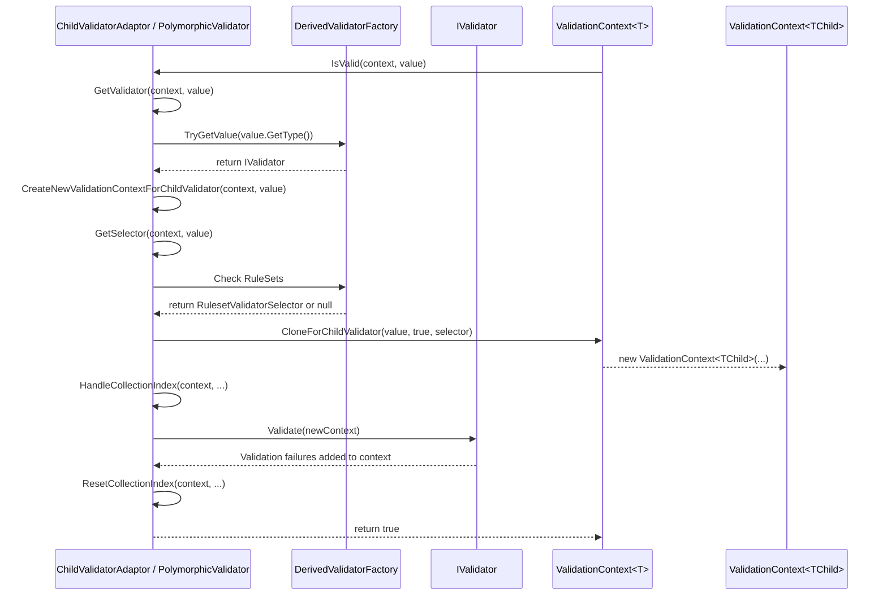

# Inheritance and Polymorphism

<details>
<summary>Relevant source files</summary>

The following files were used as context for generating this wiki page:

- [src/FluentValidation/Validators/ChildValidatorAdaptor.cs](https://github.com/FluentValidation/FluentValidation/blob/main/src/FluentValidation/Validators/ChildValidatorAdaptor.cs)
- [src/FluentValidation.Tests/InheritanceValidatorTest.cs](https://github.com/FluentValidation/FluentValidation/blob/main/src/FluentValidation.Tests/InheritanceValidatorTest.cs)
- [src/FluentValidation/Validators/PolymorphicValidator.cs](https://github.com/FluentValidation/FluentValidation/blob/main/src/FluentValidation/Validators/PolymorphicValidator.cs)
- [src/FluentValidation/TestHelper/ValidatorTestExtensions.cs](https://github.com/FluentValidation/FluentValidation/blob/main/src/FluentValidation/TestHelper/ValidatorTestExtensions.cs)
- [src/FluentValidation.Tests/ComplexValidationTester.cs](https://github.com/FluentValidation/FluentValidation/blob/main/src/FluentValidation.Tests/ComplexValidationTester.cs)
- [src/FluentValidation.Tests/ChainedValidationTester.cs](https://github.com/FluentValidation/FluentValidation/blob/main/src/FluentValidation.Tests/ChainedValidationTester.cs)
- [docs/inheritance.md](https://github.com/FluentValidation/FluentValidation/blob/main/docs/inheritance.md)
- [src/FluentValidation/IValidationContext.cs](https://github.com/FluentValidation/FluentValidation/blob/main/src/FluentValidation/IValidationContext.cs)
- [docs/start.md](https://github.com/FluentValidation/FluentValidation/blob/main/docs/start.md)
- [src/FluentValidation/DefaultValidatorExtensions.cs](https://github.com/FluentValidation/FluentValidation/blob/main/src/FluentValidation/DefaultValidatorExtensions.cs)
- [docs/custom-validators.md](https://github.com/FluentValidation/FluentValidation/blob/main/docs/custom-validators.md)
- [src/FluentValidation.Tests/AbstractValidatorTester.cs](https://github.com/FluentValidation/FluentValidation/blob/main/src/FluentValidation.Tests/AbstractValidatorTester.cs)
- [src/FluentValidation/Validators/PropertyValidator.cs](https://github.com/FluentValidation/FluentValidation/blob/main/src/FluentValidation/Validators/PropertyValidator.cs)
- [src/FluentValidation/Internal/IncludeRule.cs](https://github.com/FluentValidation/FluentValidation/blob/main/src/FluentValidation/Internal/IncludeRule.cs)
- [docs/including-rules.md](https://github.com/FluentValidation/FluentValidation/blob/main/docs/including-rules.md)
- [docs/collections.md](https://github.com/FluentValidation/FluentValidation/blob/main/docs/collections.md)
- [src/FluentValidation.Tests/ValidatorTesterTester.cs](https://github.com/FluentValidation/FluentValidation/blob/main/src/FluentValidation.Tests/ValidatorTesterTester.cs)
</details>

## Overview

### Overview

FluentValidation enables robust handling of inheritance and polymorphism by allowing developers to associate specialized child validators with properties typed as base classes or interfaces. Through the `SetInheritanceValidator` extension method and the underlying `PolymorphicValidator` and `ChildValidatorAdaptor` classes, validation rules dynamically route to specific subclass implementations at runtime. This architecture solves the challenge of validating polymorphic object graphs and heterogeneous collections without sacrificing type safety or losing property chains, context data, and rule execution strategies across boundaries.

Sources: [src/FluentValidation/Validators/ChildValidatorAdaptor.cs:18-36](https://github.com/FluentValidation/FluentValidation/blob/main/src/FluentValidation/Validators/ChildValidatorAdaptor.cs#L18-L36), [src/FluentValidation/Validators/PolymorphicValidator.cs:32-37](https://github.com/FluentValidation/FluentValidation/blob/main/src/FluentValidation/Validators/PolymorphicValidator.cs#L32-L37), [docs/inheritance.md:3-69](https://github.com/FluentValidation/FluentValidation/blob/main/docs/inheritance.md#L3-L69), [src/FluentValidation/DefaultValidatorExtensions.cs:1242-1247](https://github.com/FluentValidation/FluentValidation/blob/main/src/FluentValidation/DefaultValidatorExtensions.cs#L1242-L1247)

When domain models feature interface properties (such as `IContact`) or base class references with concrete implementations (such as `Person` or `Organisation`), standard statically-typed property validators cannot inspect derived-type members. Polymorphic validation in FluentValidation intercepts runtime property instances, matches their exact `System.Type` against registered subclass factories, and dispatches execution to the corresponding child validator.

Sources: [docs/inheritance.md:8-39](https://github.com/FluentValidation/FluentValidation/blob/main/docs/inheritance.md#L8-L39), [src/FluentValidation/Validators/PolymorphicValidator.cs:99-108](https://github.com/FluentValidation/FluentValidation/blob/main/src/FluentValidation/Validators/PolymorphicValidator.cs#L99-L108)

The design isolates dynamic type dispatch within `PolymorphicValidator<T, TProperty>`, which inherits from `ChildValidatorAdaptor<T, TProperty>`. By extending `ChildValidatorAdaptor`, polymorphic rules automatically inherit context cloning, property path tracking, collection index preservation, ruleset selection, and asynchronous validation capabilities.

Sources: [src/FluentValidation/Validators/ChildValidatorAdaptor.cs:18-36](https://github.com/FluentValidation/FluentValidation/blob/main/src/FluentValidation/Validators/ChildValidatorAdaptor.cs#L18-L36), [src/FluentValidation/Validators/PolymorphicValidator.cs:32-37](https://github.com/FluentValidation/FluentValidation/blob/main/src/FluentValidation/Validators/PolymorphicValidator.cs#L32-L37)

## Polymorphic Validation Registration API

### API Surface

The entry point for registering runtime subclass mappings in FluentValidation is the `SetInheritanceValidator` extension method defined on `IRuleBuilder<T, TProperty>`. When invoked, `SetInheritanceValidator` instantiates a `PolymorphicValidator<T, TProperty>` and passes it to the user-supplied configuration callback.

Sources: [src/FluentValidation/DefaultValidatorExtensions.cs:1242-1247](https://github.com/FluentValidation/FluentValidation/blob/main/src/FluentValidation/DefaultValidatorExtensions.cs#L1242-L1247), [src/FluentValidation/Validators/PolymorphicValidator.cs:32-37](https://github.com/FluentValidation/FluentValidation/blob/main/src/FluentValidation/Validators/PolymorphicValidator.cs#L32-L37)

Inside the configuration block, developers call `Add<TDerived>` to register specific derived types or interface implementors alongside their corresponding child validators or lazy factories.

Sources: [src/FluentValidation/Validators/PolymorphicValidator.cs:46-76](https://github.com/FluentValidation/FluentValidation/blob/main/src/FluentValidation/Validators/PolymorphicValidator.cs#L46-L76), [docs/inheritance.md:77-85](https://github.com/FluentValidation/FluentValidation/blob/main/docs/inheritance.md#L77-L85)

### Registration Overloads and Options

`PolymorphicValidator<T, TProperty>` provides public generic `Add` overloads and a protected non-generic `Add` method supporting direct validator instances, context-aware factories, and optional ruleset filtering:

| Method Signature | Constraint | Description | Sources |
|------------------|------------|-------------|---------|
| `Add<TDerived>(IValidator<TDerived> derivedValidator, params string[] ruleSets)` | `where TDerived : TProperty` | Registers a pre-instantiated validator for the given derived type with optional ruleset names. | [src/FluentValidation/Validators/PolymorphicValidator.cs:46-50](https://github.com/FluentValidation/FluentValidation/blob/main/src/FluentValidation/Validators/PolymorphicValidator.cs#L46-L50) |
| `Add<TDerived>(Func<T, IValidator<TDerived>> validatorFactory, params string[] ruleSets)` | `where TDerived : TProperty` | Registers a factory function receiving the parent model instance to construct the validator lazily. | [src/FluentValidation/Validators/PolymorphicValidator.cs:59-63](https://github.com/FluentValidation/FluentValidation/blob/main/src/FluentValidation/Validators/PolymorphicValidator.cs#L59-L63) |
| `Add<TDerived>(Func<T, TDerived, IValidator<TDerived>> validatorFactory, params string[] ruleSets)` | `where TDerived : TProperty` | Registers a factory function receiving both the parent model instance and the cast derived property value. | [src/FluentValidation/Validators/PolymorphicValidator.cs:72-76](https://github.com/FluentValidation/FluentValidation/blob/main/src/FluentValidation/Validators/PolymorphicValidator.cs#L72-L76) |
| `Add(Type subclassType, IValidator validator, params string[] ruleSets)` | `protected` | Non-generic overload allowing dynamic type registration; verifies `validator.CanValidateInstancesOfType(subclassType)`. | [src/FluentValidation/Validators/PolymorphicValidator.cs:88-97](https://github.com/FluentValidation/FluentValidation/blob/main/src/FluentValidation/Validators/PolymorphicValidator.cs#L88-L97) |

Sources: [src/FluentValidation/Validators/PolymorphicValidator.cs:46-97](https://github.com/FluentValidation/FluentValidation/blob/main/src/FluentValidation/Validators/PolymorphicValidator.cs#L46-L97)

> [!WARNING]
> Every subclass or interface implementor that requires validation must be explicitly mapped via `Add<TDerived>()`. Registering only a base validator against an interface or base type will not automatically route validation to unmapped derived classes like `Person` or `Organisation`.

Sources: [docs/inheritance.md:115-143](https://github.com/FluentValidation/FluentValidation/blob/main/docs/inheritance.md#L115-L143)

In the protected non-generic `Add` overload, FluentValidation enforces type safety at registration time through a load-bearing guard:
`if (!validator.CanValidateInstancesOfType(subclassType)) throw new InvalidOperationException(...)`.

Sources: [src/FluentValidation/Validators/PolymorphicValidator.cs:91-93](https://github.com/FluentValidation/FluentValidation/blob/main/src/FluentValidation/Validators/PolymorphicValidator.cs#L91-L93)

### Registration Call-Chain Walkthrough

The configuration and registration flow proceeds through specific execution steps:

1. `SetInheritanceValidator(validatorConfiguration)` is called on the rule builder, which invokes `new PolymorphicValidator<T, TProperty>()`.
Sources: [src/FluentValidation/DefaultValidatorExtensions.cs:1242-1247](https://github.com/FluentValidation/FluentValidation/blob/main/src/FluentValidation/DefaultValidatorExtensions.cs#L1242-L1247), [src/FluentValidation/Validators/PolymorphicValidator.cs:32-37](https://github.com/FluentValidation/FluentValidation/blob/main/src/FluentValidation/Validators/PolymorphicValidator.cs#L32-L37)
2. `PolymorphicValidator` initializes its internal dictionary: `readonly Dictionary<Type, DerivedValidatorFactory> _derivedValidators = new();`.
Sources: [src/FluentValidation/Validators/PolymorphicValidator.cs:32-33](https://github.com/FluentValidation/FluentValidation/blob/main/src/FluentValidation/Validators/PolymorphicValidator.cs#L32-L33)
3. The configuration callback executes `validator.Add<TDerived>(...)`, which performs an `ArgumentNullException.ThrowIfNull()` check on the provided argument.
Sources: [src/FluentValidation/Validators/PolymorphicValidator.cs:46-50](https://github.com/FluentValidation/FluentValidation/blob/main/src/FluentValidation/Validators/PolymorphicValidator.cs#L46-L50)
4. An entry is stored in `_derivedValidators` mapping `typeof(TDerived)` to a new `DerivedValidatorFactory` instance enclosing the validator or factory delegate and any specified `ruleSets`.
Sources: [src/FluentValidation/Validators/PolymorphicValidator.cs:46-50](https://github.com/FluentValidation/FluentValidation/blob/main/src/FluentValidation/Validators/PolymorphicValidator.cs#L46-L50), [src/FluentValidation/Validators/PolymorphicValidator.cs:117-135](https://github.com/FluentValidation/FluentValidation/blob/main/src/FluentValidation/Validators/PolymorphicValidator.cs#L117-L135)
5. Finally, `SetInheritanceValidator` registers the configured `PolymorphicValidator` instance onto the rule builder via `ruleBuilder.SetAsyncValidator(validator)`.
Sources: [src/FluentValidation/DefaultValidatorExtensions.cs:1242-1247](https://github.com/FluentValidation/FluentValidation/blob/main/src/FluentValidation/DefaultValidatorExtensions.cs#L1242-L1247)

## Child Validator Adaptor Execution Mechanics

### Adaptor Overview

The `ChildValidatorAdaptor<T, TProperty>` class bridges parent and child validators during rule execution. It wraps an underlying `IValidator<TProperty>` or a dynamic factory function (`Func<ValidationContext<T>, TProperty, IValidator<TProperty>>`), executing child object validation synchronously or asynchronously while managing validation contexts, property chains, and collection indices.

Sources: [src/FluentValidation/Validators/ChildValidatorAdaptor.cs:18-36](https://github.com/FluentValidation/FluentValidation/blob/main/src/FluentValidation/Validators/ChildValidatorAdaptor.cs#L18-L36)

### Synchronous Execution and Ruleset Selector Call-Chain

When validating a child property synchronously, execution follows a precise call chain: `IsValid` → `CreateNewValidationContextForChildValidator` → `GetSelector`. This call chain creates a child validation context and configures ruleset selection rules.

1. **`IsValid(context, value)`**: The engine invokes `IsValid` on `ChildValidatorAdaptor`. If `value` is `null`, it immediately returns `true`.
Sources: [src/FluentValidation/Validators/ChildValidatorAdaptor.cs:38-41](https://github.com/FluentValidation/FluentValidation/blob/main/src/FluentValidation/Validators/ChildValidatorAdaptor.cs#L38-L41)
2. **`GetValidator(context, value)`**: `IsValid` calls `GetValidator` to resolve the validator instance. In `PolymorphicValidator`, this looks up `value.GetType()` in `_derivedValidators`:
`if (_derivedValidators.TryGetValue(value.GetType(), out var derivedValidatorFactory)) return derivedValidatorFactory.GetValidator(context, value);`. If no validator is registered for the runtime type, `GetValidator` returns `null` and `IsValid` returns `true`.
Sources: [src/FluentValidation/Validators/ChildValidatorAdaptor.cs:43-47](https://github.com/FluentValidation/FluentValidation/blob/main/src/FluentValidation/Validators/ChildValidatorAdaptor.cs#L43-L47), [src/FluentValidation/Validators/PolymorphicValidator.cs:99-108](https://github.com/FluentValidation/FluentValidation/blob/main/src/FluentValidation/Validators/PolymorphicValidator.cs#L99-L108)
3. **`CreateNewValidationContextForChildValidator(context, value)`**: `IsValid` calls `CreateNewValidationContextForChildValidator` to construct the child context.
Sources: [src/FluentValidation/Validators/ChildValidatorAdaptor.cs:49](https://github.com/FluentValidation/FluentValidation/blob/main/src/FluentValidation/Validators/ChildValidatorAdaptor.cs#L49), [src/FluentValidation/Validators/ChildValidatorAdaptor.cs:93-101](https://github.com/FluentValidation/FluentValidation/blob/main/src/FluentValidation/Validators/ChildValidatorAdaptor.cs#L93-L101)
4. **`GetSelector(context, value)`**: Inside `CreateNewValidationContextForChildValidator`, the adaptor calls `GetSelector`. In `PolymorphicValidator`, `GetSelector` checks if the matched `DerivedValidatorFactory` has defined `RuleSets`:
`if (_derivedValidators.TryGetValue(value.GetType(), out var derivedValidatorFactory) && derivedValidatorFactory.RuleSets is {Length: > 0}) return new RulesetValidatorSelector(derivedValidatorFactory.RuleSets);`. Otherwise, `ChildValidatorAdaptor.GetSelector` returns `RuleSets?.Length > 0 ? new RulesetValidatorSelector(RuleSets) : null`.
Sources: [src/FluentValidation/Validators/ChildValidatorAdaptor.cs:94](https://github.com/FluentValidation/FluentValidation/blob/main/src/FluentValidation/Validators/ChildValidatorAdaptor.cs#L94), [src/FluentValidation/Validators/ChildValidatorAdaptor.cs:103-105](https://github.com/FluentValidation/FluentValidation/blob/main/src/FluentValidation/Validators/ChildValidatorAdaptor.cs#L103-L105), [src/FluentValidation/Validators/PolymorphicValidator.cs:110-115](https://github.com/FluentValidation/FluentValidation/blob/main/src/FluentValidation/Validators/PolymorphicValidator.cs#L110-L115)
5. **Context Cloning & Propagation**: `CreateNewValidationContextForChildValidator` invokes `context.CloneForChildValidator(value, true, selector)`. If `!context.IsChildCollectionContext`, it appends `context.RawPropertyName` to the child's `PropertyChain`.
Sources: [src/FluentValidation/Validators/ChildValidatorAdaptor.cs:95-99](https://github.com/FluentValidation/FluentValidation/blob/main/src/FluentValidation/Validators/ChildValidatorAdaptor.cs#L95-L99), [src/FluentValidation/IValidationContext.cs:247-254](https://github.com/FluentValidation/FluentValidation/blob/main/src/FluentValidation/IValidationContext.cs#L247-L254)
6. **Collection Indexing and Execution**: `HandleCollectionIndex(context, out originalIndex, out currentIndex)` preserves index state in `RootContextData`, `validator.Validate(newContext)` executes child rules, and `ResetCollectionIndex(context, originalIndex, currentIndex)` restores the original index state before returning `true`.
Sources: [src/FluentValidation/Validators/ChildValidatorAdaptor.cs:54-60](https://github.com/FluentValidation/FluentValidation/blob/main/src/FluentValidation/Validators/ChildValidatorAdaptor.cs#L54-L60)



Sources: [src/FluentValidation/Validators/ChildValidatorAdaptor.cs:38-60](https://github.com/FluentValidation/FluentValidation/blob/main/src/FluentValidation/Validators/ChildValidatorAdaptor.cs#L38-L60), [src/FluentValidation/Validators/ChildValidatorAdaptor.cs:93-105](https://github.com/FluentValidation/FluentValidation/blob/main/src/FluentValidation/Validators/ChildValidatorAdaptor.cs#L93-L105), [src/FluentValidation/Validators/PolymorphicValidator.cs:99-115](https://github.com/FluentValidation/FluentValidation/blob/main/src/FluentValidation/Validators/PolymorphicValidator.cs#L99-L115), [src/FluentValidation/IValidationContext.cs:247-254](https://github.com/FluentValidation/FluentValidation/blob/main/src/FluentValidation/IValidationContext.cs#L247-L254)

### Asynchronous Execution Walkthrough

The asynchronous flow in `IsValidAsync` mirrors synchronous execution while awaiting async child validation:

1. `IsValidAsync` checks if `value == null` or if `GetValidator(context, value)` yields `null`, returning `true` if either condition holds.
Sources: [src/FluentValidation/Validators/ChildValidatorAdaptor.cs:64-72](https://github.com/FluentValidation/FluentValidation/blob/main/src/FluentValidation/Validators/ChildValidatorAdaptor.cs#L64-L72)
2. `CreateNewValidationContextForChildValidator(context, value)` builds `newContext` asynchronously using `GetSelector` and `CloneForChildValidator`.
Sources: [src/FluentValidation/Validators/ChildValidatorAdaptor.cs:74](https://github.com/FluentValidation/FluentValidation/blob/main/src/FluentValidation/Validators/ChildValidatorAdaptor.cs#L74), [src/FluentValidation/Validators/ChildValidatorAdaptor.cs:93-101](https://github.com/FluentValidation/FluentValidation/blob/main/src/FluentValidation/Validators/ChildValidatorAdaptor.cs#L93-L101)
3. `HandleCollectionIndex(context, out originalIndex, out currentIndex)` caches collection placeholders.
Sources: [src/FluentValidation/Validators/ChildValidatorAdaptor.cs:79](https://github.com/FluentValidation/FluentValidation/blob/main/src/FluentValidation/Validators/ChildValidatorAdaptor.cs#L79)
4. `await validator.ValidateAsync(newContext, cancellation)` executes asynchronous child validation rules.
Sources: [src/FluentValidation/Validators/ChildValidatorAdaptor.cs:81](https://github.com/FluentValidation/FluentValidation/blob/main/src/FluentValidation/Validators/ChildValidatorAdaptor.cs#L81)
5. `ResetCollectionIndex(context, originalIndex, currentIndex)` restores context state and returns `true`.
Sources: [src/FluentValidation/Validators/ChildValidatorAdaptor.cs:83-85](https://github.com/FluentValidation/FluentValidation/blob/main/src/FluentValidation/Validators/ChildValidatorAdaptor.cs#L83-L85)

### Context Cloning and Collection Index Preservation

`ChildValidatorAdaptor` relies on `ValidationContext<T>.CloneForChildValidator` to pass state down to child validators while preserving the root context data dictionary and parent-child linkage.

| Method / Property | Return Type | Description | Sources |
|------------------|-------------|-------------|---------|
| `CloneForChildValidator<TChild>(TChild instanceToValidate, bool preserveParentContext, IValidatorSelector selector)` | `ValidationContext<TChild>` | Creates a new validation context for a child instance, copying the message formatter, failures, root data, and setting `IsChildContext = true`. | [src/FluentValidation/IValidationContext.cs:247-254](https://github.com/FluentValidation/FluentValidation/blob/main/src/FluentValidation/IValidationContext.cs#L247-L254) |
| `HandleCollectionIndex` | `void` | Preserves and temporarily caches collection index placeholders (`CollectionIndex`) within `RootContextData` under `__FV_CollectionIndex`. | [src/FluentValidation/Validators/ChildValidatorAdaptor.cs:107-113](https://github.com/FluentValidation/FluentValidation/blob/main/src/FluentValidation/Validators/ChildValidatorAdaptor.cs#L107-L113) |
| `ResetCollectionIndex` | `void` | Restores or removes the original collection index in `RootContextData` after child validation completes. | [src/FluentValidation/Validators/ChildValidatorAdaptor.cs:115-125](https://github.com/FluentValidation/FluentValidation/blob/main/src/FluentValidation/Validators/ChildValidatorAdaptor.cs#L115-L125) |

Sources: [src/FluentValidation/Validators/ChildValidatorAdaptor.cs:107-125](https://github.com/FluentValidation/FluentValidation/blob/main/src/FluentValidation/Validators/ChildValidatorAdaptor.cs#L107-L125), [src/FluentValidation/IValidationContext.cs:247-254](https://github.com/FluentValidation/FluentValidation/blob/main/src/FluentValidation/IValidationContext.cs#L247-L254)

> [!NOTE]
> When executing validation inside a collection via `RuleForEach`, `HandleCollectionIndex` extracts the `CollectionIndex` placeholder value from `MessageFormatter.PlaceholderValues` and caches it in `RootContextData["__FV_CollectionIndex"]` so nested child rules can format error messages correctly.

Sources: [src/FluentValidation/Validators/ChildValidatorAdaptor.cs:107-113](https://github.com/FluentValidation/FluentValidation/blob/main/src/FluentValidation/Validators/ChildValidatorAdaptor.cs#L107-L113)

## Ruleset Propagation Across Polymorphic Hierarchies

### Ruleset Propagation Mechanics

Polymorphic validation rulesets require propagation across runtime type boundaries to ensure that rules defined inside specific derived validators execute correctly when invoked through a base type or interface property. When configuring polymorphic hierarchies using `SetInheritanceValidator`, rule sets can be explicitly bound to derived implementations or cascaded globally through parent validation options.

Sources: [src/FluentValidation.Tests/InheritanceValidatorTest.cs:234-264](https://github.com/FluentValidation/FluentValidation/blob/main/src/FluentValidation.Tests/InheritanceValidatorTest.cs#L234-L264)

### Explicit Ruleset Mapping

When mapping derived validators via `SetInheritanceValidator`, individual rule sets can be passed directly as arguments to the `Add` extension method. This guarantees that when a specific derived instance is evaluated, only the rules belonging to the specified rule set execute.

```csharp
var validator = new InlineValidator<Root>();
var impl1Validator = new InlineValidator<FooImpl1>();
var impl2Validator = new InlineValidator<FooImpl2>();

impl1Validator.RuleFor(x => x.Name).Equal("Foo");
impl1Validator.RuleSet("RuleSet1", () => {
    impl1Validator.RuleFor(x => x.Name).NotNull();
});

validator.RuleFor(x => x.Foo).SetInheritanceValidator(v => {
    v.Add(impl1Validator, "RuleSet1")
        .Add(impl2Validator, "RuleSet2");
});
```

Sources: [src/FluentValidation.Tests/InheritanceValidatorTest.cs:234-254](https://github.com/FluentValidation/FluentValidation/blob/main/src/FluentValidation.Tests/InheritanceValidatorTest.cs#L234-L254)

### Cascading Rule Sets Across Hierarchies

Rule sets can also cascade from the root validator down into polymorphic child validators when options such as `IncludeRuleSets` and `IncludeRulesNotInRuleSet` are specified during validation execution.

```csharp
var fooValidator = new InlineValidator<FooImpl1>();
fooValidator.RuleSet("test", () => {
    fooValidator.RuleFor(x => x.Name).NotNull();
});

var validator = new InlineValidator<Root>();
validator.RuleSet("test", () => {
    validator.RuleFor(x => x.Foo).SetInheritanceValidator(v => {
        v.Add<FooImpl1>(fooValidator);
    });
});

var result = validator.Validate(model, options => {
    options.IncludeRuleSets("test").IncludeRulesNotInRuleSet();
});
```

Sources: [src/FluentValidation.Tests/InheritanceValidatorTest.cs:306-328](https://github.com/FluentValidation/FluentValidation/blob/main/src/FluentValidation.Tests/InheritanceValidatorTest.cs#L306-L328)

> [!NOTE]
> Explicitly passing a rule set name in `v.Add(implValidator, "RuleSetName")` restricts execution of that implementation's rules to the named rule set, bypassing default rules unless root-level cascade options explicitly include them.

Sources: [src/FluentValidation.Tests/InheritanceValidatorTest.cs:234-254](https://github.com/FluentValidation/FluentValidation/blob/main/src/FluentValidation.Tests/InheritanceValidatorTest.cs#L234-L254)

## Complex Hierarchy and Chained Validation

### Hierarchical Validation Overview

Validating complex hierarchies involves navigating nested property chains, such as `PersonValidator` invoking `AddressValidator` which in turn invokes `CountryValidator`. When processing these nested structures, FluentValidation constructs property names dynamically using dot-notation (e.g., `Address.Postcode` and `Address.Country.Name`). Complex property validation also integrates with conditions (`When` and `WhenAsync`), property exclusion filters (`IncludeProperties`), and explicit rule set targeting on nested child validators.

Sources: [src/FluentValidation.Tests/ComplexValidationTester.cs:48-56](https://github.com/FluentValidation/FluentValidation/blob/main/src/FluentValidation.Tests/ComplexValidationTester.cs#L48-L56), [src/FluentValidation.Tests/ChainedValidationTester.cs:43-51](https://github.com/FluentValidation/FluentValidation/blob/main/src/FluentValidation.Tests/ChainedValidationTester.cs#L43-L51)

### Chained Property Traversal

Nested property chains can be defined either by using `SetValidator` on a nested property or by grouping rules inside conditional blocks. When `validator.Validate(person)` runs on a hierarchical model, the validation engine evaluates parent rules, checks nullability guards, and traverses down into child validators.

```csharp
public class PersonValidator : InlineValidator<Person> {
    public PersonValidator() {
        RuleFor(x => x.Forename).NotNull();
        RuleFor(x => x.Address).SetValidator(new AddressValidator());
    }
}

public class AddressValidator : AbstractValidator<Address> {
    public AddressValidator() {
        RuleFor(x => x.Postcode).NotNull();
        RuleFor(x => x.Country).SetValidator(new CountryValidator());
    }
}
```

Sources: [src/FluentValidation.Tests/ComplexValidationTester.cs:248-266](https://github.com/FluentValidation/FluentValidation/blob/main/src/FluentValidation.Tests/ComplexValidationTester.cs#L248-L266)

> [!WARNING]
> Complex property validators are automatically skipped when the target nested property is `null`. For example, validating an empty `Person` instance with a null `Address` property suppresses all errors originating from `AddressValidator` and `CountryValidator`, returning only root-level validation errors.

Sources: [src/FluentValidation.Tests/ComplexValidationTester.cs:71-74](https://github.com/FluentValidation/FluentValidation/blob/main/src/FluentValidation.Tests/ComplexValidationTester.cs#L71-L74)

### Preventing Cyclic References

When validating object graphs that contain circular references (such as `InfiniteLoop` referencing `InfiniteLoop2` which points back to `InfiniteLoop`), standard recursive descent without cycle detection can trigger a stack overflow. While FluentValidation allows nesting child validators across mutual reference classes, cyclic models require external cycle tracking or architectural avoidance to prevent infinite loops during traversal.

```csharp
public class InfiniteLoop {
    public InfiniteLoop2 Property { get; set; }
}

public class InfiniteLoop2 {
    public InfiniteLoop Property { get; set; }
}

public class InfiniteLoopValidator : AbstractValidator<InfiniteLoop> {
    public InfiniteLoopValidator() {
        RuleFor(x => x.Property).SetValidator(new InfiniteLoop2Validator());
    }
}
```

Sources: [src/FluentValidation.Tests/ComplexValidationTester.cs:271-289](https://github.com/FluentValidation/FluentValidation/blob/main/src/FluentValidation.Tests/ComplexValidationTester.cs#L271-L289)

> [!CAUTION]
> Direct bidirectional validator nesting (e.g., `InfiniteLoopValidator` calling `InfiniteLoop2Validator` which calls `InfiniteLoopValidator`) will cause an infinite loop and result in a `StackOverflowException` at runtime if evaluated against a cyclic object graph.

Sources: [src/FluentValidation.Tests/ComplexValidationTester.cs:236-289](https://github.com/FluentValidation/FluentValidation/blob/main/src/FluentValidation.Tests/ComplexValidationTester.cs#L236-L289)

### Include Rules and State Key Management

When executing `IncludeRule` instances to merge rules from another validator inline, FluentValidation manages selector cascades using `MemberNameValidatorSelector.DisableCascadeKey` in `RootContextData`. This prevents nested include rules from corrupting property selection behavior.

```csharp
public override async ValueTask ValidateAsync(ValidationContext<T> context, CancellationToken cancellation) {
    bool shouldAddStateKey = !context.RootContextData.ContainsKey(MemberNameValidatorSelector.DisableCascadeKey);

    if (shouldAddStateKey) {
        context.RootContextData[MemberNameValidatorSelector.DisableCascadeKey] = true;
    }

    await base.ValidateAsync(context, cancellation);

    if (shouldAddStateKey) {
        context.RootContextData.Remove(MemberNameValidatorSelector.DisableCascadeKey);
    }
}
```

Sources: [src/FluentValidation/Internal/IncludeRule.cs:56-75](https://github.com/FluentValidation/FluentValidation/blob/main/src/FluentValidation/Internal/IncludeRule.cs#L56-L75)

## Testing Polymorphic and Child Rules

### Testing Integration Overview

Verifying child validator bindings, collection element validators, and model-level rules within unit tests is supported through test helper extension methods. The `ShouldHaveChildValidator` extension inspects validator descriptors to ensure that a given property is correctly configured with a specified child validator type or its assignable base type.

Sources: [src/FluentValidation/TestHelper/ValidatorTestExtensions.cs:38-61](https://github.com/FluentValidation/FluentValidation/blob/main/src/FluentValidation/TestHelper/ValidatorTestExtensions.cs#L38-L61), [src/FluentValidation.Tests/ValidatorTesterTester.cs:153-203](https://github.com/FluentValidation/FluentValidation/blob/main/src/FluentValidation.Tests/ValidatorTesterTester.cs#L153-L203)

### Child Validator Assertion Mechanics

When `ShouldHaveChildValidator` is invoked against an expression, the test extension executes a specific code path to locate and evaluate matching validators:

1. `validator.CreateDescriptor()` extracts the underlying `IValidatorDescriptor` for the validator instance.
2. `expression.GetMember()?.Name` resolves the target property name, or handles model-level expressions if `expression.IsParameterExpression()` is true.
3. `descriptor.GetValidatorsForMember(expressionMemberName)` retrieves the configured property validators from the descriptor.
4. `GetDependentRules()` appends any validators attached via `.DependentRules()` on matching rules.
5. `matchingValidators.OfType<IChildValidatorAdaptor>()` filters for child validator adapters and retrieves their `ValidatorType`.
6. `childValidatorTypes.All(x => !childValidatorType.IsAssignableFrom(x))` checks assignment compatibility; if no matching adaptor is assignable, a `ValidationTestException` is thrown.

```csharp
public static void ShouldHaveChildValidator<T, TProperty>(this IValidator<T> validator, Expression<Func<T, TProperty>> expression, Type childValidatorType) {
    var descriptor = validator.CreateDescriptor();
    var expressionMemberName = expression.GetMember()?.Name;

    if (expressionMemberName == null && !expression.IsParameterExpression()) {
        throw new NotSupportedException("ShouldHaveChildValidator can only be used for simple property expressions.");
    }

    var matchingValidators =
        expression.IsParameterExpression() ? GetModelLevelValidators<T>(descriptor) :
            descriptor.GetValidatorsForMember(expressionMemberName)
                .Select(x => x.Validator)
                .ToArray();

    matchingValidators = matchingValidators.Concat(GetDependentRules(expressionMemberName, expression, descriptor)).ToArray();

    var childValidatorTypes = matchingValidators.OfType<IChildValidatorAdaptor>().Select(x => x.ValidatorType);

    if (childValidatorTypes.All(x => !childValidatorType.IsAssignableFrom(x))) {
        var childValidatorNames = childValidatorTypes.Any() ? string.Join(", ", childValidatorTypes.Select(x => x.Name)) : "none";
        throw new ValidationTestException(string.Format("Expected property '{0}' to have a child validator of type '{1}.'. Instead found '{2}'", expressionMemberName, childValidatorType.Name, childValidatorNames));
    }
}
```

Sources: [src/FluentValidation/TestHelper/ValidatorTestExtensions.cs:38-61](https://github.com/FluentValidation/FluentValidation/blob/main/src/FluentValidation/TestHelper/ValidatorTestExtensions.cs#L38-L61)

> [!NOTE]
> `ShouldHaveChildValidator` supports simple property expressions, collection rules configured with `RuleForEach`, model-level rules, and dependent rules linked via `.DependentRules()`. It cannot be used for complex nested property chains without referencing the immediate parent property.

Sources: [src/FluentValidation/TestHelper/ValidatorTestExtensions.cs:38-61](https://github.com/FluentValidation/FluentValidation/blob/main/src/FluentValidation/TestHelper/ValidatorTestExtensions.cs#L38-L61), [src/FluentValidation.Tests/ValidatorTesterTester.cs:194-203](https://github.com/FluentValidation/FluentValidation/blob/main/src/FluentValidation.Tests/ValidatorTesterTester.cs#L194-L203)

### Test Assertion API

The test helper extensions also provide fluent methods for asserting validation outcomes on pre-constructed or test-run objects using `TestValidate` and `TestValidateAsync`.

| Method / Extension | Return Type | Purpose | Sources |
| :--- | :--- | :--- | :--- |
| `TestValidate(object, options)` | `TestValidationResult<T>` | Executes synchronous validation and returns an assertion wrapper. | [src/FluentValidation/TestHelper/ValidatorTestExtensions.cs:86-89](https://github.com/FluentValidation/FluentValidation/blob/main/src/FluentValidation/TestHelper/ValidatorTestExtensions.cs#L86-L89) |
| `TestValidateAsync(object, options, token)` | `Task<TestValidationResult<T>>` | Executes asynchronous validation and returns an assertion wrapper. | [src/FluentValidation/TestHelper/ValidatorTestExtensions.cs:109-112](https://github.com/FluentValidation/FluentValidation/blob/main/src/FluentValidation/TestHelper/ValidatorTestExtensions.cs#L109-L112) |
| `When(failurePredicate, message)` | `ITestValidationWith` | Asserts that at least one failure matches the specified predicate function. | [src/FluentValidation/TestHelper/ValidatorTestExtensions.cs:141-153](https://github.com/FluentValidation/FluentValidation/blob/main/src/FluentValidation/TestHelper/ValidatorTestExtensions.cs#L141-L153) |
| `WithErrorCode(code)` | `ITestValidationWith` | Filters or asserts matched failures against a specific error code string. | [src/FluentValidation/TestHelper/ValidatorTestExtensions.cs:187-189](https://github.com/FluentValidation/FluentValidation/blob/main/src/FluentValidation/TestHelper/ValidatorTestExtensions.cs#L187-L189) |
| `WithErrorMessage(message)` | `ITestValidationWith` | Filters or asserts matched failures against an expected error message. | [src/FluentValidation/TestHelper/ValidatorTestExtensions.cs:183-185](https://github.com/FluentValidation/FluentValidation/blob/main/src/FluentValidation/TestHelper/ValidatorTestExtensions.cs#L183-L185) |
| `WithSeverity(severity)` | `ITestValidationWith` | Asserts that matching errors carry the expected `Severity` level. | [src/FluentValidation/TestHelper/ValidatorTestExtensions.cs:170-172](https://github.com/FluentValidation/FluentValidation/blob/main/src/FluentValidation/TestHelper/ValidatorTestExtensions.cs#L170-L172) |
| `WithCustomState(state, comparer)` | `ITestValidationWith` | Asserts matching errors possess specific custom state objects. | [src/FluentValidation/TestHelper/ValidatorTestExtensions.cs:174-176](https://github.com/FluentValidation/FluentValidation/blob/main/src/FluentValidation/TestHelper/ValidatorTestExtensions.cs#L174-L176) |
| `Only()` | `ITestValidationWith` | Asserts that *only* the matched failures exist across the entire result set, throwing if unexpected errors are present. | [src/FluentValidation/TestHelper/ValidatorTestExtensions.cs:207-232](https://github.com/FluentValidation/FluentValidation/blob/main/src/FluentValidation/TestHelper/ValidatorTestExtensions.cs#L207-L232) |

Sources: [src/FluentValidation/TestHelper/ValidatorTestExtensions.cs:86-232](https://github.com/FluentValidation/FluentValidation/blob/main/src/FluentValidation/TestHelper/ValidatorTestExtensions.cs#L86-L232), [src/FluentValidation.Tests/ValidatorTesterTester.cs:41-123](https://github.com/FluentValidation/FluentValidation/blob/main/src/FluentValidation.Tests/ValidatorTesterTester.cs#L41-L123)

> [!WARNING]
> If a validator contains asynchronous rules (such as `MustAsync` or `WhenAsync`), invoking synchronous test methods like `TestValidate` will throw an `AsyncValidatorInvokedSynchronouslyException`. You must use `TestValidateAsync` for asynchronous validators.

Sources: [src/FluentValidation/TestHelper/ValidatorTestExtensions.cs:98-101](https://github.com/FluentValidation/FluentValidation/blob/main/src/FluentValidation/TestHelper/ValidatorTestExtensions.cs#L98-L101), [src/FluentValidation.Tests/ValidatorTesterTester.cs:565-568](https://github.com/FluentValidation/FluentValidation/blob/main/src/FluentValidation.Tests/ValidatorTesterTester.cs#L565-L568)

## Design Trade-offs

| Design Choice | Benefit | Cost |
| :--- | :--- | :--- |
| Exact Type Match (`Dictionary<Type, DerivedValidatorFactory>`) | Provides O(1) runtime dispatch and explicit mapping control. | Requires every derived subclass or implementor type to be explicitly registered. |
| Context Cloning (`CloneForChildValidator`) | Isolates child property chains while maintaining shared root failure lists and context data. | Allocates a new `ValidationContext<TChild>` instance for each child object validation run. |
| Automatic Null Suppression | Eliminates boiler-plate null checks inside child validators. | Suppresses child rules entirely when a parent property is null, suppressing potential missing-object errors. |
| Thread-Safe Collection Indexing (`HandleCollectionIndex`) | Allows nested rules to read accurate collection index placeholders without modifying child property state. | Caches indexes temporarily inside `RootContextData`, requiring cleanup in a `try...finally` block. |

Sources: [src/FluentValidation/Validators/PolymorphicValidator.cs:33-34](https://github.com/FluentValidation/FluentValidation/blob/main/src/FluentValidation/Validators/PolymorphicValidator.cs#L33-L34), [src/FluentValidation/Validators/ChildValidatorAdaptor.cs:39-41](https://github.com/FluentValidation/FluentValidation/blob/main/src/FluentValidation/Validators/ChildValidatorAdaptor.cs#L39-L41), [src/FluentValidation/IValidationContext.cs:247-254](https://github.com/FluentValidation/FluentValidation/blob/main/src/FluentValidation/IValidationContext.cs#L247-L254), [src/FluentValidation/Validators/ChildValidatorAdaptor.cs:107-125](https://github.com/FluentValidation/FluentValidation/blob/main/src/FluentValidation/Validators/ChildValidatorAdaptor.cs#L107-L125)

## Full Worked Example

The following self-contained example demonstrates registering a polymorphic collection validator and executing asynchronous validation against heterogeneous objects:

```csharp
using System;
using System.Collections.Generic;
using System.Threading.Tasks;
using FluentValidation;
using FluentValidation.Results;

public interface IContact {
    string Name { get; set; }
    string Email { get; set; }
}

public class PersonContact : IContact {
    public string Name { get; set; }
    public string Email { get; set; }
    public DateTime DateOfBirth { get; set; }
}

public class OrganisationContact : IContact {
    public string Name { get; set; }
    public string Email { get; set; }
    public string CompanyNumber { get; set; }
}

public class ContactBatchRequest {
    public List<IContact> Contacts { get; set; } = new();
}

public class PersonContactValidator : AbstractValidator<PersonContact> {
    public PersonContactValidator() {
        RuleFor(x => x.Name).NotEmpty();
        RuleFor(x => x.Email).EmailAddress();
        RuleFor(x => x.DateOfBirth).LessThan(DateTime.Today);
    }
}

public class OrganisationContactValidator : AbstractValidator<OrganisationContact> {
    public OrganisationContactValidator() {
        RuleFor(x => x.Name).NotEmpty();
        RuleFor(x => x.Email).EmailAddress();
        RuleFor(x => x.CompanyNumber).NotEmpty();
    }
}

public class ContactBatchRequestValidator : AbstractValidator<ContactBatchRequest> {
    public ContactBatchRequestValidator() {
        RuleForEach(x => x.Contacts).SetInheritanceValidator(v => {
            v.Add<PersonContact>(new PersonContactValidator());
            v.Add<OrganisationContact>(new OrganisationContactValidator());
        });
    }
}

public class Program {
    public static async Task Main() {
        var request = new ContactBatchRequest {
            Contacts = new List<IContact> {
                new PersonContact { Name = "Alice", Email = "alice@example.com", DateOfBirth = DateTime.Today.AddYears(1) },
                new OrganisationContact { Name = "Acme Corp", Email = "invalid-email", CompanyNumber = "" }
            }
        };

        var validator = new ContactBatchRequestValidator();
        ValidationResult result = await validator.ValidateAsync(request);

        foreach (var failure in result.Errors) {
            Console.WriteLine($"Error on {failure.PropertyName}: {failure.ErrorMessage}");
        }
    }
}
```

Sources: [docs/inheritance.md:8-114](https://github.com/FluentValidation/FluentValidation/blob/main/docs/inheritance.md#L8-L114), [src/FluentValidation/DefaultValidatorExtensions.cs:1242-1247](https://github.com/FluentValidation/FluentValidation/blob/main/src/FluentValidation/DefaultValidatorExtensions.cs#L1242-L1247), [src/FluentValidation.Tests/InheritanceValidatorTest.cs:78-121](https://github.com/FluentValidation/FluentValidation/blob/main/src/FluentValidation.Tests/InheritanceValidatorTest.cs#L78-L121)

## Related

- [[Validator Definition]]
- [[Collection Validation]]

