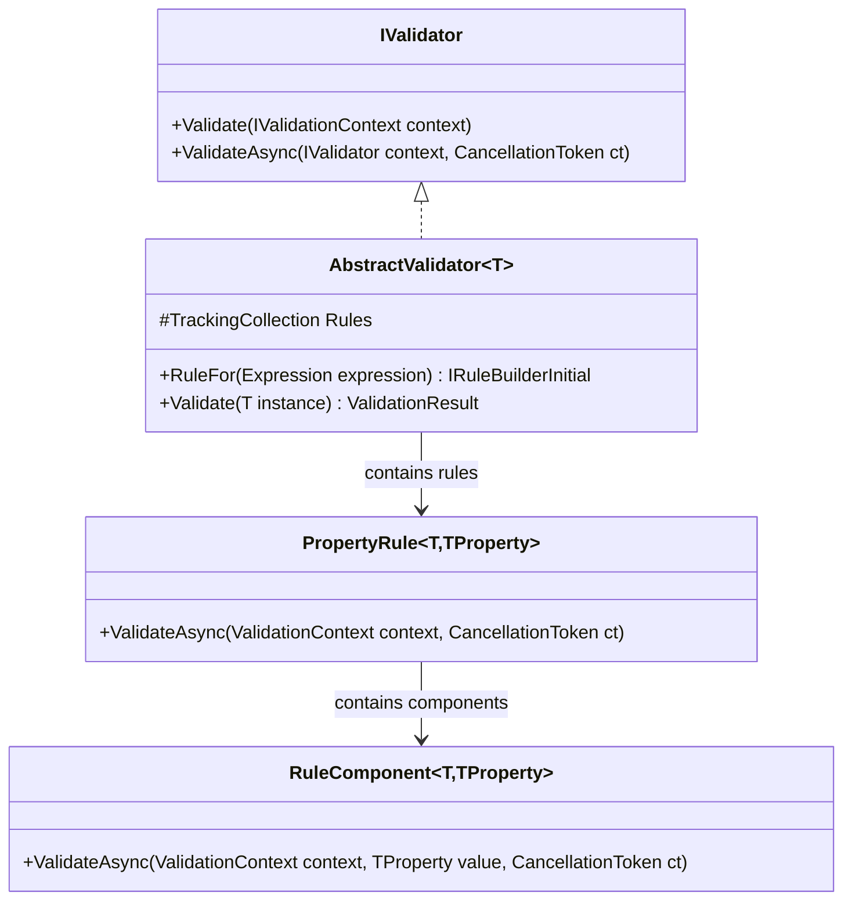
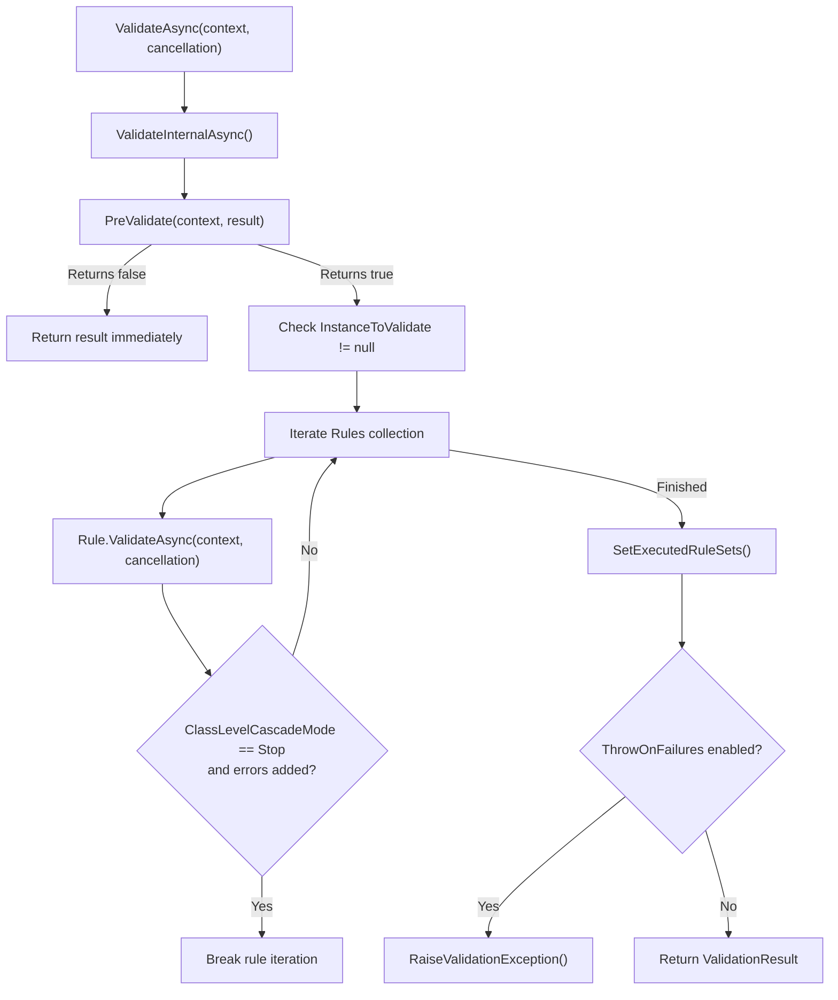
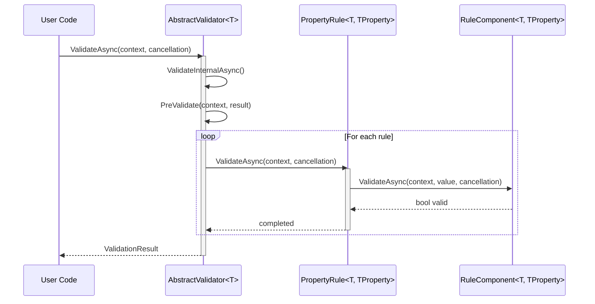

# Overview

Relevant source files

The following files were used as context for generating this wiki page:

- [docs/aspnet.md](https://github.com/FluentValidation/FluentValidation/blob/main/docs/aspnet.md)
- [src/FluentValidation/Internal/RuleBase.cs](https://github.com/FluentValidation/FluentValidation/blob/main/src/FluentValidation/Internal/RuleBase.cs)
- [src/FluentValidation.Tests.Benchmarks/EngineOnlyBenchmark.cs](https://github.com/FluentValidation/FluentValidation/blob/main/src/FluentValidation.Tests.Benchmarks/EngineOnlyBenchmark.cs)
- [src/FluentValidation/AbstractValidator.cs](https://github.com/FluentValidation/FluentValidation/blob/main/src/FluentValidation/AbstractValidator.cs)
- [src/FluentValidation/Internal/PropertyRule.cs](https://github.com/FluentValidation/Internal/PropertyRule.cs)
- [src/FluentValidation/Internal/RuleComponent.cs](https://github.com/FluentValidation/Internal/RuleComponent.cs)
- [src/FluentValidation/Internal/MessageBuilderContext.cs](https://github.com/FluentValidation/Internal/MessageBuilderContext.cs)
- [docs/index.rst](https://github.com/FluentValidation/FluentValidation/blob/main/docs/index.rst)
- [src/FluentValidation/IValidationRule.cs](https://github.com/FluentValidation/FluentValidation/blob/main/src/FluentValidation/IValidationRule.cs)
- [docs/start.md](https://github.com/FluentValidation/FluentValidation/blob/main/docs/start.md)
- [src/FluentValidation/Internal/IRuleComponent.cs](https://github.com/FluentValidation/Internal/IRuleComponent.cs)
- [src/FluentValidation/Syntax.cs](https://github.com/FluentValidation/Syntax.cs)
- [src/FluentValidation.Tests/AbstractValidatorTester.cs](https://github.com/FluentValidation/FluentValidation/blob/main/src/FluentValidation.Tests/AbstractValidatorTester.cs)
- [src/FluentValidation.Tests.Benchmarks/Models.cs](https://github.com/FluentValidation/FluentValidation.Tests.Benchmarks/Models.cs)
- [src/FluentValidation/ValidatorOptions.cs](https://github.com/FluentValidation/ValidatorOptions.cs)
- [src/FluentValidation/IValidationContext.cs](https://github.com/FluentValidation/IValidationContext.cs)
- [src/FluentValidation/README.md](https://github.com/FluentValidation/README.md)
- [docs/upgrading-to-10.md](https://github.com/FluentValidation/FluentValidation/blob/main/docs/upgrading-to-10.md)
- [src/FluentValidation.DependencyInjectionExtensions/README.md](https://github.com/FluentValidation/DependencyInjectionExtensions/README.md)
- [src/FluentValidation/Internal/IncludeRule.cs](https://github.com/FluentValidation/Internal/IncludeRule.cs)
- [docs/testing.md](https://github.com/FluentValidation/Testing.md)
- [src/FluentValidation/IValidationRuleInternal.cs](https://github.com/FluentValidation/IValidationRuleInternal.cs)
- [src/FluentValidation/IValidatorDescriptor.cs](https://github.com/FluentValidation/IValidatorDescriptor.cs)
- [src/FluentValidation.Tests/ChainingValidatorsTester.cs](https://github.com/FluentValidation/FluentValidation.Tests/ChainingValidatorsTester.cs)
- [docs/upgrading-to-11.md](https://github.com/FluentValidation/FluentValidation/blob/main/docs/upgrading-to-11.md)
- [src/FluentValidation/IValidator.cs](https://github.com/FluentValidation/IValidator.cs)

## Overview

FluentValidation is a .NET library for building strongly-typed validation rules using a fluent interface and lambda expressions.
Sources: [docs/index.rst:6-10](https://github.com/FluentValidation/FluentValidation/blob/main/docs/index.rst#L6-L10)

By separating validation logic from domain models, FluentValidation ensures domain entities remain focused entirely on business behavior.
Sources: [src/FluentValidation/README.md:1-3](https://github.com/FluentValidation/FluentValidation/blob/main/src/FluentValidation/README.md#L1-L3)

Application models are validated either manually within controllers or automatically via ASP.NET integration and validation filters.
Sources: [docs/aspnet.md:3-11](https://github.com/FluentValidation/FluentValidation/blob/main/docs/aspnet.md#L3-L11)

## Public API and Core Interfaces

FluentValidation exposes core contracts through `IValidator<T>` and `IValidator`, defining methods to validate instances both synchronously and asynchronously.
Sources: [src/FluentValidation/IValidator.cs:30-65](https://github.com/FluentValidation/FluentValidation/blob/main/src/FluentValidation/IValidator.cs#L30-L65)

The `AbstractValidator<T>` class implements these interfaces, serving as the base class for custom validators and containing the tracking collection of validation rules.
Sources: [src/FluentValidation/AbstractValidator.cs:32-38](https://github.com/FluentValidation/FluentValidation/blob/main/src/FluentValidation/AbstractValidator.cs#L32-L38)

Rules themselves implement `IValidationRule<T, TProperty>`, maintaining components, conditions, and display name configurations.
Sources: [src/FluentValidation/IValidationRule.cs:30-63](https://github.com/FluentValidation/FluentValidation/blob/main/src/FluentValidation/IValidationRule.cs#L30-L63)

| Interface / Class | Category | Description |
| :--- | :--- | :--- |
| `IValidator<T>` | Public API | Defines strongly-typed `Validate` and `ValidateAsync` methods. |
| `IValidator` | Public API | Non-generic base interface supporting execution via `IValidationContext`. |
| `AbstractValidator<T>` | Core Engine | Base class for object validators providing fluent rule builders. |
| `IValidationRule<T, TProperty>` | Internal / Rule | Contract for property rules managing validators, conditions, and messages. |

Sources: [src/FluentValidation/IValidator.cs:30-76](https://github.com/FluentValidation/FluentValidation/blob/main/src/FluentValidation/IValidator.cs#L30-L76), [src/FluentValidation/AbstractValidator.cs:32-38](https://github.com/FluentValidation/FluentValidation/blob/main/src/FluentValidation/AbstractValidator.cs#L32-L38), [src/FluentValidation/IValidationRule.cs:30-63](https://github.com/FluentValidation/FluentValidation/blob/main/src/FluentValidation/IValidationRule.cs#L30-L63)

## Validator Initialization and Rule Construction

Validators are constructed by inheriting from `AbstractValidator<T>` and defining rules inside the constructor using methods such as `RuleFor` and `RuleForEach`.
Sources: [src/FluentValidation/AbstractValidator.cs:202-231](https://github.com/FluentValidation/FluentValidation/blob/main/src/FluentValidation/AbstractValidator.cs#L202-L231)

When `RuleFor` is invoked, it creates a `PropertyRule<T, TProperty>` using compiled accessors from expression trees, adds it to the internal `Rules` collection, and returns a `RuleBuilder`.
Sources: [src/FluentValidation/AbstractValidator.cs:210-216](https://github.com/FluentValidation/FluentValidation/blob/main/src/FluentValidation/AbstractValidator.cs#L210-L216), [src/FluentValidation/Internal/PropertyRule.cs:38-44](https://github.com/FluentValidation/FluentValidation/blob/main/src/FluentValidation/Internal/PropertyRule.cs#L38-L44)

Sources: [src/FluentValidation/IValidator.cs:30-76](https://github.com/FluentValidation/FluentValidation/blob/main/src/FluentValidation/IValidator.cs#L30-L76), [src/FluentValidation/AbstractValidator.cs:32-216](https://github.com/FluentValidation/FluentValidation/blob/main/src/FluentValidation/AbstractValidator.cs#L32-L216), [src/FluentValidation/Internal/PropertyRule.cs:31-44](https://github.com/FluentValidation/FluentValidation/blob/main/src/FluentValidation/Internal/PropertyRule.cs#L31-L44)

## Execution Engine and Control Flow

Validation execution begins when `Validate` or `ValidateAsync` is called on `AbstractValidator<T>`, wrapping the instance in a `ValidationContext<T>`.
Sources: [src/FluentValidation/AbstractValidator.cs:93-138](https://github.com/FluentValidation/FluentValidation/blob/main/src/FluentValidation/AbstractValidator.cs#L93-L138)

The engine delegates internal execution to `ValidateInternalAsync`, which executes pre-validation hooks and evaluates rules iteratively.
Sources: [src/FluentValidation/AbstractValidator.cs:139-179](https://github.com/FluentValidation/FluentValidation/blob/main/src/FluentValidation/AbstractValidator.cs#L139-L179)

Sources: [src/FluentValidation/AbstractValidator.cs:139-179](https://github.com/FluentValidation/FluentValidation/blob/main/src/FluentValidation/AbstractValidator.cs#L139-L179)

## Call-Chain Execution Walkthrough

The core validation invocation follows a strict path from public entry points through pre-validation and rule iteration:

1. `ValidateAsync` (lines 133-137) invokes `ValidateInternalAsync` (lines 139-179).
   Sources: [src/FluentValidation/AbstractValidator.cs:133-179](https://github.com/FluentValidation/FluentValidation/blob/main/src/FluentValidation/AbstractValidator.cs#L133-L179)
2. `ValidateInternalAsync` executes `PreValidate` (line 379) to determine whether validation should proceed or return immediately.
   Sources: [src/FluentValidation/AbstractValidator.cs:139-179](https://github.com/FluentValidation/FluentValidation/blob/main/src/FluentValidation/AbstractValidator.cs#L139-L179), [src/FluentValidation/AbstractValidator.cs:379-379](https://github.com/FluentValidation/FluentValidation/blob/main/src/FluentValidation/AbstractValidator.cs#L379-L379)
3. If pre-validation passes, rules are evaluated sequentially via `Rules[i].ValidateAsync(context, cancellation)`.
   Sources: [src/FluentValidation/AbstractValidator.cs:157-165](https://github.com/FluentValidation/FluentValidation/blob/main/src/FluentValidation/AbstractValidator.cs#L157-L165)
4. Property rules evaluate selectors, conditions, and execute underlying rule components.
   Sources: [src/FluentValidation/Internal/PropertyRule.cs:52-135](https://github.com/FluentValidation/FluentValidation/blob/main/src/FluentValidation/Internal/PropertyRule.cs#L52-L135)
5. Component failures generate validation failures via `CreateValidationError()`.
   Sources: [src/FluentValidation/Internal/PropertyRule.cs:125-128](https://github.com/FluentValidation/FluentValidation/blob/main/src/FluentValidation/Internal/PropertyRule.cs#L125-L128), [src/FluentValidation/Internal/RuleBase.cs:320-343](https://github.com/FluentValidation/FluentValidation/blob/main/src/FluentValidation/Internal/RuleBase.cs#L320-L343)

Sources: [src/FluentValidation/AbstractValidator.cs:133-180](https://github.com/FluentValidation/FluentValidation/blob/main/src/FluentValidation/AbstractValidator.cs#L133-L180), [src/FluentValidation/AbstractValidator.cs:379-379](https://github.com/FluentValidation/FluentValidation/blob/main/src/FluentValidation/AbstractValidator.cs#L379-L379), [src/FluentValidation/Internal/PropertyRule.cs:52-143](https://github.com/FluentValidation/FluentValidation/blob/main/src/FluentValidation/Internal/PropertyRule.cs#L52-L143), [src/FluentValidation/Internal/RuleBase.cs:320-343](https://github.com/FluentValidation/FluentValidation/blob/main/src/FluentValidation/Internal/RuleBase.cs#L320-L343)

## Configuration and Global Options

Global configuration settings are exposed via `ValidatorOptions.Global`, allowing customization of default behaviors, cascading modes, and resolvers.
Sources: [src/FluentValidation/ValidatorOptions.cs:30-145](https://github.com/FluentValidation/ValidatorOptions.cs#L30-L145)

| Configuration Property | Type | Default Value | Purpose |
| :--- | :--- | :--- | :--- |
| `DefaultClassLevelCascadeMode` | `CascadeMode` | `CascadeMode.Continue` | Default cascade mode between rules in a validator class. |
| `DefaultRuleLevelCascadeMode` | `CascadeMode` | `CascadeMode.Continue` | Default cascade mode within individual rules. |
| `Severity` | `Severity` | `Severity.Error` | Default severity level for validation failures. |
| `PropertyChainSeparator` | `string` | `"."` | Default separator used when constructing property paths. |

Sources: [src/FluentValidation/ValidatorOptions.cs:33-65](https://github.com/FluentValidation/ValidatorOptions.cs#L33-L65)

## Design Trade-Offs

FluentValidation's internal architecture balances execution performance with declarative ergonomics through deliberate design choices.

| Design Choice | Benefit | Cost |
| :--- | :--- | :--- |
| **Expression-based Rule Definition** | Provides strong typing, compile-time safety, and refactoring support. | Expression compilation overhead during validator startup. |
| **Separation of Rules and Components** | Decouples rule configuration (`PropertyRule`) from component execution (`RuleComponent`). | Additional indirection and object allocation per rule definition. |
| **For-Loop Engine Iteration** | Eliminates enumerator allocations during high-frequency validation runs. | Requires manual index tracking across rule collections. |

Sources: [src/FluentValidation/AbstractValidator.cs:159-161](https://github.com/FluentValidation/FluentValidation/blob/main/src/FluentValidation/AbstractValidator.cs#L159-L161), [src/FluentValidation/Internal/PropertyRule.cs:31-143](https://github.com/FluentValidation/Internal/PropertyRule.cs#L31-L143), [docs/upgrading-to-10.md:72-75](https://github.com/FluentValidation/FluentValidation/blob/main/docs/upgrading-to-10.md#L72-L75)

## ASP.NET Core Integration and Dependency Injection

Validators can be registered with Microsoft Dependency Injection using service collection extensions such as `AddScoped` or assembly scanning methods like `AddValidatorsFromAssemblyContaining`.
Sources: [docs/aspnet.md:38-74](https://github.com/FluentValidation/FluentValidation/blob/main/docs/aspnet.md#L38-L74)

In ASP.NET Core Minimal APIs or controllers, validators are injected and executed explicitly, returning `ValidationProblem` responses when validation fails.
Sources: [docs/aspnet.md:207-234](https://github.com/FluentValidation/FluentValidation/blob/main/docs/aspnet.md#L207-L234)

> [!NOTE]
> Validators registered via dependency injection in ASP.NET Core must be registered as scoped (`AddScoped`) when depending on scoped infrastructure such as database contexts.
Sources: [docs/upgrading-to-10.md:117-119](https://github.com/FluentValidation/FluentValidation/blob/main/docs/upgrading-to-10.md#L117-L119)

## Related

- [[Quick Start]]
- [[Project Structure]]
- [[Validation Core]]

