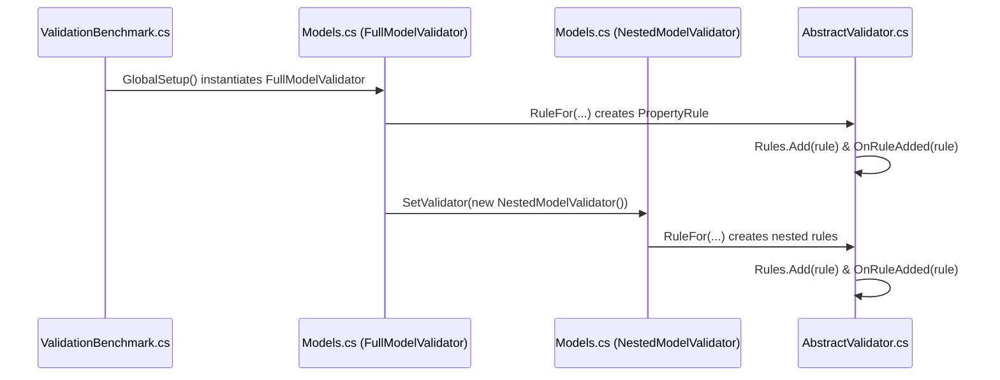
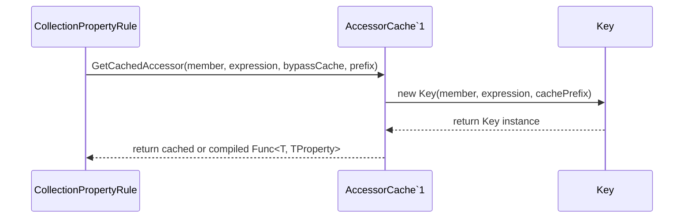
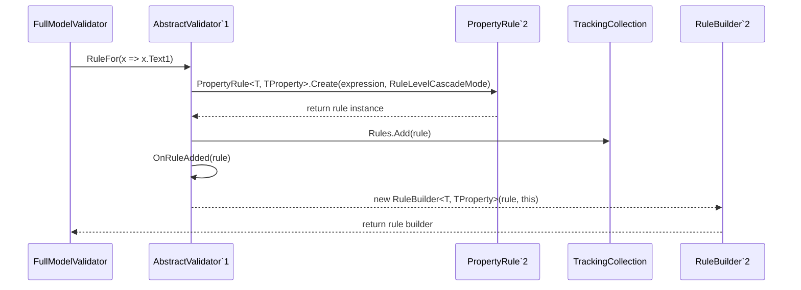
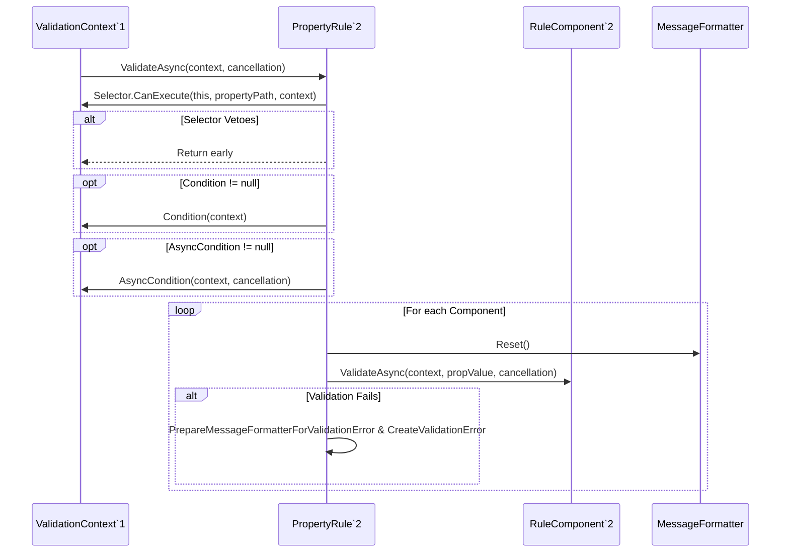

# Performance Benchmarks

<details>
<summary>Relevant source files</summary>

The following files were used as context for generating this wiki page:

- [src/FluentValidation/Validators/ChildValidatorAdaptor.cs](https://github.com/FluentValidation/FluentValidation/blob/main/src/FluentValidation/Validators/ChildValidatorAdaptor.cs)
- [src/FluentValidation.Tests.Benchmarks/EngineOnlyBenchmark.cs](https://github.com/FluentValidation/FluentValidation/blob/main/src/FluentValidation.Tests.Benchmarks/EngineOnlyBenchmark.cs)
- [src/FluentValidation.Tests.Benchmarks/DataSet.cs](https://github.com/FluentValidation/FluentValidation/blob/main/src/FluentValidation.Tests.Benchmarks/DataSet.cs)
- [src/FluentValidation/TestHelper/ValidatorTestExtensions.cs](https://github.com/FluentValidation/FluentValidation/blob/main/src/FluentValidation/TestHelper/ValidatorTestExtensions.cs)
- [src/FluentValidation.Tests.Benchmarks/Models.cs](https://github.com/FluentValidation/FluentValidation/blob/main/src/FluentValidation.Tests.Benchmarks/Models.cs)
- [src/FluentValidation/Internal/PropertyRule.cs](https://github.com/FluentValidation/FluentValidation/blob/main/src/FluentValidation/Internal/PropertyRule.cs)
- [src/FluentValidation/Internal/RuleBase.cs](https://github.com/FluentValidation/FluentValidation/blob/main/src/FluentValidation/Internal/RuleBase.cs)
- [src/FluentValidation/Internal/AccessorCache.cs](https://github.com/FluentValidation/FluentValidation/blob/main/src/FluentValidation/Internal/AccessorCache.cs)
- [src/FluentValidation.Tests.Benchmarks/InitializationBenchmark.cs](https://github.com/FluentValidation/FluentValidation/blob/main/src/FluentValidation.Tests.Benchmarks/InitializationBenchmark.cs)
- [src/FluentValidation/Validators/AbstractComparisonValidator.cs](https://github.com/FluentValidation/FluentValidation/blob/main/src/FluentValidation/Validators/AbstractComparisonValidator.cs)
- [src/FluentValidation/Internal/CollectionPropertyRule.cs](https://github.com/FluentValidation/FluentValidation/blob/main/src/FluentValidation/Internal/CollectionPropertyRule.cs)
- [src/FluentValidation/AbstractValidator.cs](https://github.com/FluentValidation/FluentValidation/blob/main/src/FluentValidation/AbstractValidator.cs)
- [src/FluentValidation.Tests.Benchmarks/ValidationBenchmark.cs](https://github.com/FluentValidation/FluentValidation/blob/main/src/FluentValidation.Tests.Benchmarks/ValidationBenchmark.cs)
- [src/FluentValidation/DefaultValidatorOptions.cs](https://github.com/FluentValidation/FluentValidation/blob/main/src/FluentValidation/DefaultValidatorOptions.cs)
- [src/FluentValidation/Validators/LengthValidator.cs](https://github.com/FluentValidation/FluentValidation/blob/main/src/FluentValidation/Validators/LengthValidator.cs)
- [src/FluentValidation.Tests/AbstractValidatorTester.cs](https://github.com/FluentValidation/FluentValidation/blob/main/src/FluentValidation.Tests/AbstractValidatorTester.cs)
- [src/FluentValidation.Tests/Person.cs](https://github.com/FluentValidation/FluentValidation/blob/main/src/FluentValidation.Tests/Person.cs)
- [src/FluentValidation.Tests.Benchmarks/AccessorCacheBenchmark.cs](https://github.com/FluentValidation/FluentValidation/blob/main/src/FluentValidation.Tests.Benchmarks/AccessorCacheBenchmark.cs)
- [src/FluentValidation.Tests/ValidatorDescriptorTester.cs](https://github.com/FluentValidation/FluentValidation/blob/main/src/FluentValidation.Tests/ValidatorDescriptorTester.cs)
- [src/FluentValidation/Internal/IncludeRule.cs](https://github.com/FluentValidation/FluentValidation/blob/main/src/FluentValidation/Internal/IncludeRule.cs)
- [src/FluentValidation.Tests.Benchmarks/Program.cs](https://github.com/FluentValidation/FluentValidation/blob/main/src/FluentValidation.Tests.Benchmarks/Program.cs)
- [src/FluentValidation.Tests/ComplexValidationTester.cs](https://github.com/FluentValidation/FluentValidation/blob/main/src/FluentValidation.Tests/ComplexValidationTester.cs)
- [src/FluentValidation.Tests/DefaultValidatorExtensionTester.cs](https://github.com/FluentValidation/FluentValidation/blob/main/src/FluentValidation.Tests/DefaultValidatorExtensionTester.cs)
- [src/FluentValidation.Tests/CascadingFailuresTester.cs](https://github.com/FluentValidation/FluentValidation/blob/main/src/FluentValidation.Tests/CascadingFailuresTester.cs)
</details>

## Overview

The performance benchmark suite utilizes [BenchmarkDotNet](https://github.com/dotnet/BenchmarkDotNet) to measure execution throughput, memory allocation overhead, and initialization costs across core validation engine workflows. By simulating realistic validation scenarios through randomized datasets and complex models, the benchmarks evaluate critical infrastructure components including expression accessor caching, rule execution mechanics, and validator construction performance.

Sources: [src/FluentValidation.Tests.Benchmarks/EngineOnlyBenchmark.cs:26-27](https://github.com/FluentValidation/FluentValidation/blob/main/src/FluentValidation.Tests.Benchmarks/EngineOnlyBenchmark.cs#L26-L27), [src/FluentValidation.Tests.Benchmarks/DataSet.cs:28-57](https://github.com/FluentValidation/FluentValidation/blob/main/src/FluentValidation.Tests.Benchmarks/DataSet.cs#L28-L57), [src/FluentValidation.Tests.Benchmarks/InitializationBenchmark.cs:24-29](https://github.com/FluentValidation/FluentValidation/blob/main/src/FluentValidation.Tests.Benchmarks/InitializationBenchmark.cs#L24-L29)

## Benchmark Suite Architecture and Models

### Overview

The benchmark suite architecture relies on BenchmarkDotNet attributes such as `[MemoryDiagnoser]` and `[Params]` to analyze execution performance and memory overhead across specialized benchmark classes. The harness entry point is managed by `Program.Main`, which executes the benchmark assembly via `BenchmarkSwitcher`. Synthetic test data and validation models are structured to measure both minimal engine overhead and complex hierarchical object graphs.

Sources: [src/FluentValidation.Tests.Benchmarks/EngineOnlyBenchmark.cs:24-61](https://github.com/FluentValidation/FluentValidation/blob/main/src/FluentValidation.Tests.Benchmarks/EngineOnlyBenchmark.cs#L24-L61), [src/FluentValidation.Tests.Benchmarks/Program.cs:24-27](https://github.com/FluentValidation/FluentValidation/blob/main/src/FluentValidation.Tests.Benchmarks/Program.cs#L24-L27)

### Harness Entry Point and Execution Setup

Benchmark execution begins at the assembly entry point in `Program.Main`, which invokes `BenchmarkSwitcher.FromAssembly(typeof(Program).Assembly).Run(args)`. Individual benchmark classes orchestrate setup routines using `[GlobalSetup]` attributes. For instance, `EngineOnlyBenchmark` instantiates `NoLogicModelSingleRuleValidator` and `NoLogicModelTenRulesValidator`, alongside a collection of `VoidModel` instances configured via `Enumerable.Range(0, N).Select(m => new VoidModel() {Member = new object()}).ToList()`.

Sources: [src/FluentValidation.Tests.Benchmarks/EngineOnlyBenchmark.cs:28-67](https://github.com/FluentValidation/FluentValidation/blob/main/src/FluentValidation.Tests.Benchmarks/EngineOnlyBenchmark.cs#L28-L67), [src/FluentValidation.Tests.Benchmarks/Program.cs:24-27](https://github.com/FluentValidation/FluentValidation/blob/main/src/FluentValidation.Tests.Benchmarks/Program.cs#L24-L27)

### Benchmark Models and Synthetic Data Generation

The benchmark models comprise structural domain objects (`FullModel` and `NestedModel`) and lightweight engine models (`VoidModel`). `FullModel` includes string properties (`Text1` through `Text5`), integer properties (`Number1` through `Number5`), nullable decimals (`SuperNumber1` through `SuperNumber3`), nested model references (`NestedModel1`, `NestedModel2`), collection models (`ModelCollection`), and value collections (`StructCollection`). Synthetic datasets are generated using the `Bogus` library via `DataSet.cs`, establishing distinct distributions across `ManyErrorsDataSet`, `HalfErrorsDataSet`, and `NoErrorsDataSet` with a fixed random seed (`Randomizer.Seed = new Random(666)`) and a dataset size of `10_000`.

Sources: [src/FluentValidation.Tests.Benchmarks/DataSet.cs:28-151](https://github.com/FluentValidation/FluentValidation/blob/main/src/FluentValidation.Tests.Benchmarks/DataSet.cs#L28-L151), [src/FluentValidation.Tests.Benchmarks/Models.cs:25-69](https://github.com/FluentValidation/FluentValidation/blob/main/src/FluentValidation.Tests.Benchmarks/Models.cs#L25-L69), [src/FluentValidation.Tests.Benchmarks/EngineOnlyBenchmark.cs:34-36](https://github.com/FluentValidation/FluentValidation/blob/main/src/FluentValidation.Tests.Benchmarks/EngineOnlyBenchmark.cs#L34-L36)

### Call-Chain Execution Walkthrough

The benchmark setup initializes complex validators that register property rules and nested validators. The initialization trace proceeds through the following call chain:

1. `GlobalSetup` — Sets up test fixtures and instantiates root validators like `FullModelValidator`. Sources: [src/FluentValidation.Tests.Benchmarks/ValidationBenchmark.cs:35-44](https://github.com/FluentValidation/FluentValidation/blob/main/src/FluentValidation.Tests.Benchmarks/ValidationBenchmark.cs#L35-L44)
2. `FullModelValidator` — Constructor executes rule definitions, registering child validators via `SetValidator(new NestedModelValidator())`. Sources: [src/FluentValidation.Tests.Benchmarks/Models.cs:71-123](https://github.com/FluentValidation/FluentValidation/blob/main/src/FluentValidation.Tests.Benchmarks/Models.cs#L71-L123)
3. `NestedModelValidator` — Constructor executes nested property rules using `RuleFor`. Sources: [src/FluentValidation.Tests.Benchmarks/Models.cs:125-142](https://github.com/FluentValidation/FluentValidation/blob/main/src/FluentValidation.Tests.Benchmarks/Models.cs#L125-L142)
4. `RuleFor` — Creates property rules via `PropertyRule<T, TProperty>.Create` and appends them to the internal rules collection. Sources: [src/FluentValidation/AbstractValidator.cs:210-216](https://github.com/FluentValidation/FluentValidation/blob/main/src/FluentValidation/AbstractValidator.cs#L210-L216)
5. `OnRuleAdded` — Invokes virtual extension points when rules are added to the validator. Sources: [src/FluentValidation/AbstractValidator.cs:214-214](https://github.com/FluentValidation/FluentValidation/blob/main/src/FluentValidation/AbstractValidator.cs#L214-L214), [src/FluentValidation/AbstractValidator.cs:396-398](https://github.com/FluentValidation/FluentValidation/blob/main/src/FluentValidation/AbstractValidator.cs#L396-L398)



Sources: [src/FluentValidation.Tests.Benchmarks/Models.cs:71-142](https://github.com/FluentValidation/FluentValidation/blob/main/src/FluentValidation.Tests.Benchmarks/Models.cs#L71-L142), [src/FluentValidation.Tests.Benchmarks/ValidationBenchmark.cs:35-44](https://github.com/FluentValidation/FluentValidation/blob/main/src/FluentValidation.Tests.Benchmarks/ValidationBenchmark.cs#L35-L44), [src/FluentValidation/AbstractValidator.cs:210-216](https://github.com/FluentValidation/FluentValidation/blob/main/src/FluentValidation/AbstractValidator.cs#L210-L216)

### Benchmark Models and Validation Rule Reference

| Model Class | Property Name | Type | Validation Rules / Setup Behavior | Sources |
| :--- | :--- | :--- | :--- | :--- |
| `VoidModel` | `Member` | `object` | Evaluated with `.Must(o => true)` in single and ten-rule engine benchmarks. | [src/FluentValidation.Tests.Benchmarks/EngineOnlyBenchmark.cs:34-57](https://github.com/FluentValidation/FluentValidation/blob/main/src/FluentValidation.Tests.Benchmarks/EngineOnlyBenchmark.cs#L34-L57) |
| `FullModel` | `Text1`-`Text5` | `string` | Must not be null; must contain specific characters (`a`-`e`) when not null. | [src/FluentValidation.Tests.Benchmarks/Models.cs:25-142](https://github.com/FluentValidation/FluentValidation/blob/main/src/FluentValidation.Tests.Benchmarks/Models.cs#L25-L142) |
| `FullModel` | `Number1`-`Number5` | `int` | Must be less than 10 (`m < 10`). | [src/FluentValidation.Tests.Benchmarks/Models.cs:25-142](https://github.com/FluentValidation/FluentValidation/blob/main/src/FluentValidation.Tests.Benchmarks/Models.cs#L25-L142) |
| `FullModel` | `SuperNumber1`-`SuperNumber3` | `decimal?` | Must not be null; must be less than 10 when present. | [src/FluentValidation.Tests.Benchmarks/Models.cs:25-142](https://github.com/FluentValidation/FluentValidation/blob/main/src/FluentValidation.Tests.Benchmarks/Models.cs#L25-L142) |
| `FullModel` | `NestedModel1`, `NestedModel2` | `NestedModel` | Must not be null; validated using `NestedModelValidator`. | [src/FluentValidation.Tests.Benchmarks/Models.cs:25-142](https://github.com/FluentValidation/FluentValidation/blob/main/src/FluentValidation.Tests.Benchmarks/Models.cs#L25-L142) |
| `FullModel` | `ModelCollection` | `IReadOnlyList<NestedModel>` | Must not be null; count must be $\le 10$; each item validated via `RuleForEach`. | [src/FluentValidation.Tests.Benchmarks/Models.cs:25-142](https://github.com/FluentValidation/FluentValidation/blob/main/src/FluentValidation.Tests.Benchmarks/Models.cs#L25-L142) |
| `FullModel` | `StructCollection` | `IReadOnlyList<int>` | Must not be null; count must be $\le 10$; elements must be $\le 10$. | [src/FluentValidation.Tests.Benchmarks/Models.cs:25-142](https://github.com/FluentValidation/FluentValidation/blob/main/src/FluentValidation.Tests.Benchmarks/Models.cs#L25-L142) |
| `NestedModel` | `Text1`, `Text2` | `string` | Must not be null; must contain character (`a` or `b`) when not null. | [src/FluentValidation.Tests.Benchmarks/Models.cs:25-142](https://github.com/FluentValidation/FluentValidation/blob/main/src/FluentValidation.Tests.Benchmarks/Models.cs#L25-L142) |
| `NestedModel` | `Number1`, `Number2` | `int` | Must be less than 10. | [src/FluentValidation.Tests.Benchmarks/Models.cs:25-142](https://github.com/FluentValidation/FluentValidation/blob/main/src/FluentValidation.Tests.Benchmarks/Models.cs#L25-L142) |
| `NestedModel` | `SuperNumber1`, `SuperNumber2` | `decimal?` | Must not be null; must be less than 10 when present. | [src/FluentValidation.Tests.Benchmarks/Models.cs:25-142](https://github.com/FluentValidation/FluentValidation/blob/main/src/FluentValidation.Tests.Benchmarks/Models.cs#L25-L142) |

Sources: [src/FluentValidation.Tests.Benchmarks/EngineOnlyBenchmark.cs:34-57](https://github.com/FluentValidation/FluentValidation/blob/main/src/FluentValidation.Tests.Benchmarks/EngineOnlyBenchmark.cs#L34-L57), [src/FluentValidation.Tests.Benchmarks/Models.cs:25-142](https://github.com/FluentValidation/FluentValidation/blob/main/src/FluentValidation.Tests.Benchmarks/Models.cs#L25-L142)

### Dataset Generation and Architectural Design Trade-Offs

| Design Choice | Benefit | Cost | Sources |
| :--- | :--- | :--- | :--- |
| **Lazy Dataset Generation via Bogus** (`GenerateLazy`) | Avoids upfront memory allocation spikes when generating 10,000 complex model instances. | Defers evaluation overhead to initial benchmark iteration unless pre-cached. | [src/FluentValidation.Tests.Benchmarks/DataSet.cs:29-134](https://github.com/FluentValidation/FluentValidation/blob/main/src/FluentValidation.Tests.Benchmarks/DataSet.cs#L29-L134) |
| **Parameterized Error Distributions** (`ManyErrors`, `HalfErrors`, `NoErrors`) | Enables precise isolation of failure accumulation and short-circuiting overhead. | Requires maintaining multiple distinct faker configurations in `DataSet.cs`. | [src/FluentValidation.Tests.Benchmarks/DataSet.cs:29-134](https://github.com/FluentValidation/FluentValidation/blob/main/src/FluentValidation.Tests.Benchmarks/DataSet.cs#L29-L134) |
| **Specialized Engine-Only Models** (`VoidModel` with `Must(o => true)`) | Isolates core validation pipeline overhead from expression complexity and reflection. | Does not exercise real-world string formatting or nested object traversal. | [src/FluentValidation.Tests.Benchmarks/EngineOnlyBenchmark.cs:27-57](https://github.com/FluentValidation/FluentValidation/blob/main/src/FluentValidation.Tests.Benchmarks/EngineOnlyBenchmark.cs#L27-L57) |

Sources: [src/FluentValidation.Tests.Benchmarks/DataSet.cs:29-134](https://github.com/FluentValidation/FluentValidation/blob/main/src/FluentValidation.Tests.Benchmarks/DataSet.cs#L29-L134), [src/FluentValidation.Tests.Benchmarks/EngineOnlyBenchmark.cs:27-57](https://github.com/FluentValidation/FluentValidation/blob/main/src/FluentValidation.Tests.Benchmarks/EngineOnlyBenchmark.cs#L27-L57)

> [!NOTE]
> Synthetic datasets are seeded deterministically with `Randomizer.Seed = new Random(666)` inside `DataSet.cs` to ensure reproducible benchmark measurements across runs.
> Sources: [src/FluentValidation.Tests.Benchmarks/DataSet.cs:123-123](https://github.com/FluentValidation/FluentValidation/blob/main/src/FluentValidation.Tests.Benchmarks/DataSet.cs#L123-L123)

> [!WARNING]
> Failing to pass a non-null root model to `Validate` or `ValidateAsync` throws an `InvalidOperationException` ("Cannot pass a null model to Validate/ValidateAsync. The root model must be non-null."), which will abort benchmark iterations if improperly handled.
> Sources: [src/FluentValidation/AbstractValidator.cs:153-155](https://github.com/FluentValidation/FluentValidation/blob/main/src/FluentValidation/AbstractValidator.cs#L153-L155)

## Validation Engine Benchmark Execution

### Overview

The engine-only and full-model validation benchmarks measure throughput and allocation behavior across distinct rule complexities. By isolating minimal overhead paths via `EngineOnlyBenchmark` and comprehensive object graphs via `ValidationBenchmark`, these suites quantify the raw cost of pipeline execution, rule traversal, and cascading strategies.

Sources: [src/FluentValidation.Tests.Benchmarks/EngineOnlyBenchmark.cs:26-90](https://github.com/FluentValidation/FluentValidation/blob/main/src/FluentValidation.Tests.Benchmarks/EngineOnlyBenchmark.cs#L26-L90), [src/FluentValidation.Tests.Benchmarks/ValidationBenchmark.cs:25-71](https://github.com/FluentValidation/FluentValidation/blob/main/src/FluentValidation.Tests.Benchmarks/ValidationBenchmark.cs#L25-L71)

### Single-Rule and Multi-Rule Engine Throughput

The `EngineOnlyBenchmark` class measures baseline engine execution speed using `VoidModel` instances containing a single object member. The harness evaluates models across two validator implementations: `NoLogicModelSingleRuleValidator` and `NoLogicModelTenRulesValidator`, both executing trivial `.Must(o => true)` predicates over $N = 10,000$ iterations.

```csharp
[Benchmark]
public object Validate_SingleRule() {
    object t = null;
    for (var i = 0; i < N; ++i) {
        t = _fluentValidationSingleRuleValidator.Validate(_noLogicModels[i]);
    }
    return t;
}

[Benchmark]
public object Validate_TenRules() {
    object t = null;
    for (var i = 0; i < N; ++i) {
        t = _fluentValidationTenRulesValidator.Validate(_noLogicModels[i]);
    }
    return t;
}
```

Sources: [src/FluentValidation.Tests.Benchmarks/EngineOnlyBenchmark.cs:27-89](https://github.com/FluentValidation/FluentValidation/blob/main/src/FluentValidation.Tests.Benchmarks/EngineOnlyBenchmark.cs#L27-L89)

### Full Model and Fail-Fast Validation Execution

The `ValidationBenchmark` class evaluates `FullModelValidator` performance across three dataset distributions (`ManyErrors`, `HalfErrors`, `NoErrors`). It compares standard evaluation against fail-fast execution configured with `ClassLevelCascadeMode = CascadeMode.Stop` and `RuleLevelCascadeMode = CascadeMode.Stop`.

```csharp
_failFastValidator = new FullModelValidator {
    ClassLevelCascadeMode = CascadeMode.Stop,
    RuleLevelCascadeMode = CascadeMode.Stop,
};
```

Sources: [src/FluentValidation.Tests.Benchmarks/ValidationBenchmark.cs:38-41](https://github.com/FluentValidation/FluentValidation/blob/main/src/FluentValidation.Tests.Benchmarks/ValidationBenchmark.cs#L38-L41)

## Accessor Caching and Key Resolution

### Overview

The `AccessorCache<T>` class manages the compilation and caching of LINQ expression tree property accessors. By storing compiled delegates in a thread-safe `ConcurrentDictionary<Key, Delegate>`, it avoids the substantial performance penalty associated with repeatedly invoking `LambdaExpression.Compile()` during rule execution.

Sources: [src/FluentValidation/Internal/AccessorCache.cs:12-47](https://github.com/FluentValidation/FluentValidation/blob/main/src/FluentValidation/Internal/AccessorCache.cs#L12-L47)

### Call-Chain Execution Walkthrough

When resolving property accessors or constructing collection rules, the caching framework executes a specific series of steps across `CollectionPropertyRule`, `AccessorCache<T>`, and nested `Key` structures.

1. `CollectionPropertyRule.Create` — Extracts the member info from the lambda expression and calls the accessor cache with an optional rule prefix.
   Sources: [src/FluentValidation/Internal/CollectionPropertyRule.cs:63-67](https://github.com/FluentValidation/FluentValidation/blob/main/src/FluentValidation/Internal/CollectionPropertyRule.cs#L63-L67)
2. `AccessorCache<T>.GetCachedAccessor` — Evaluates whether caching is bypassed or globally disabled. If active, it inspects the member info and constructs a cache key.
   Sources: [src/FluentValidation/Internal/AccessorCache.cs:24-46](https://github.com/FluentValidation/FluentValidation/blob/main/src/FluentValidation/Internal/AccessorCache.cs#L24-L46)
3. `AccessorCache<T>.Key` — Combines the `MemberInfo` and the string representation of the expression (prefixed by `cachePrefix`) to guarantee uniqueness between standard and collection rule accessors.
   Sources: [src/FluentValidation/Internal/AccessorCache.cs:55-68](https://github.com/FluentValidation/FluentValidation/blob/main/src/FluentValidation/Internal/AccessorCache.cs#L55-L68)



Sources: [src/FluentValidation/Internal/CollectionPropertyRule.cs:63-67](https://github.com/FluentValidation/FluentValidation/blob/main/src/FluentValidation/Internal/CollectionPropertyRule.cs#L63-L67), [src/FluentValidation/Internal/AccessorCache.cs:24-68](https://github.com/FluentValidation/FluentValidation/blob/main/src/FluentValidation/Internal/AccessorCache.cs#L24-L68)

> [!NOTE]
> Collection and non-collection property access must use distinct accessors to prevent runtime execution exceptions, which is enforced by prefixing collection rule keys with `"FV_RuleForEach"`.
> Sources: [src/FluentValidation/Internal/AccessorCache.cs:24-27](https://github.com/FluentValidation/FluentValidation/blob/main/src/FluentValidation/Internal/AccessorCache.cs#L24-L27), [src/FluentValidation/Internal/CollectionPropertyRule.cs:63-67](https://github.com/FluentValidation/FluentValidation/blob/main/src/FluentValidation/Internal/CollectionPropertyRule.cs#L63-L67)

### Design Trade-Offs

| Design Choice | Benefit | Cost | Sources |
| :--- | :--- | :--- | :--- |
| `ConcurrentDictionary<Key, Delegate>` | Thread-safe lookups and concurrent cache additions without explicit locking overhead. | Potential memory retention of compiled expression delegates across the validator's lifespan. | [src/FluentValidation/Internal/AccessorCache.cs:13-85](https://github.com/FluentValidation/FluentValidation/blob/main/src/FluentValidation/Internal/AccessorCache.cs#L13-L85) |
| Compound `Key` hashing (`MemberInfo` + `_expressionKey`) | Distinguishes identical property accessors used in different evaluation contexts (e.g., standard vs collection rules). | Additional string concatenation overhead during cache key instantiation. | [src/FluentValidation/Internal/AccessorCache.cs:13-85](https://github.com/FluentValidation/FluentValidation/blob/main/src/FluentValidation/Internal/AccessorCache.cs#L13-L85) |
| Fallback to un-cached `expression.Compile()` | Safely handles parameter expressions and unsupported or dynamic member accessors without failing. | Incurs expression compilation overhead on every invocation when member info is null and criteria are unmet. | [src/FluentValidation/Internal/AccessorCache.cs:13-85](https://github.com/FluentValidation/FluentValidation/blob/main/src/FluentValidation/Internal/AccessorCache.cs#L13-L85) |

Sources: [src/FluentValidation/Internal/AccessorCache.cs:13-85](https://github.com/FluentValidation/FluentValidation/blob/main/src/FluentValidation/Internal/AccessorCache.cs#L13-L85)

### Worked Example

The following benchmark harness setup demonstrates how `AccessorCache<T>` resolves and benchmarks compiled accessors with and without cache prefixes.

```csharp
[MemoryDiagnoser]
public class AccessorCacheBenchmark {
    private Expression<Func<TestModel, int>> Expression { get; set; }
    private MemberInfo Member { get; set; }

    [GlobalSetup]
    public void GlobalSetup() {
        Expression = GetExpression<TestModel, int>(x => x.Property);
        Member = Expression.GetMember();
    }

    [Benchmark]
    public Func<TestModel, int> GetCachedAccessor() {
        return AccessorCache<TestModel>.GetCachedAccessor(Member, Expression, false, "");
    }

    [Benchmark]
    public Func<TestModel, int> GetCachedAccessorWithCachePrefix() {
        return AccessorCache<TestModel>.GetCachedAccessor(Member, Expression, false, "Prefix");
    }

    private Expression<Func<T, TProperty>> GetExpression<T, TProperty>(Expression<Func<T, TProperty>> expression) {
        return expression;
    }

    public class TestModel {
        public int Property { get; set; }
    }
}
```

Sources: [src/FluentValidation.Tests.Benchmarks/AccessorCacheBenchmark.cs:28-57](https://github.com/FluentValidation/FluentValidation/blob/main/src/FluentValidation.Tests.Benchmarks/AccessorCacheBenchmark.cs#L28-L57)

## Validator Initialization and Construction Overhead

### Overview

Validator initialization measures the overhead involved in constructing a validator instance and registering its rules. During startup, instantiating an `AbstractValidator<T>` subclass executes its constructor, which adds rules via methods like `RuleFor` and `RuleForEach`, creates child validators via `SetValidator`, and registers condition blocks. The `InitializationBenchmark` suite quantifies this cost by comparing standard cached instantiation against an un-cached path where accessor caching is globally disabled via `ValidatorOptions.Global.DisableAccessorCache`.

Sources: [src/FluentValidation.Tests.Benchmarks/InitializationBenchmark.cs:24-38](https://github.com/FluentValidation/FluentValidation/blob/main/src/FluentValidation.Tests.Benchmarks/InitializationBenchmark.cs#L24-L38), [src/FluentValidation/AbstractValidator.cs:36-230](https://github.com/FluentValidation/FluentValidation/blob/main/src/FluentValidation/AbstractValidator.cs#L36-L230)

### Initialization Benchmark Implementation

The benchmarking harness uses BenchmarkDotNet with memory diagnostics enabled to measure allocation and timing differences between cached and un-cached validator construction.

```csharp
[MemoryDiagnoser]
public class InitializationBenchmark {
	[Benchmark]
	public object Initialization_using_cache() {
		return new FullModelValidator();
	}

	[Benchmark(Baseline = true)]
	public object Initialization_without_cache() {
		ValidatorOptions.Global.DisableAccessorCache = true;
		var validator = new FullModelValidator();
		ValidatorOptions.Global.DisableAccessorCache = false;
		return validator;
	}
}
```

Sources: [src/FluentValidation.Tests.Benchmarks/InitializationBenchmark.cs:24-38](https://github.com/FluentValidation/FluentValidation/blob/main/src/FluentValidation.Tests.Benchmarks/InitializationBenchmark.cs#L24-L38)

### Rule Registration Call-Chain

When a validator constructor executes, property rules and nested validators are sequentially instantiated and appended to the internal rules collection. 



1. `AbstractValidator<T>.RuleFor()` — Receives a property expression, validates it for nullness, and calls `PropertyRule<T, TProperty>.Create`.
   Sources: [src/FluentValidation/AbstractValidator.cs:210-216](https://github.com/FluentValidation/FluentValidation/blob/main/src/FluentValidation/AbstractValidator.cs#L210-L216)
2. `PropertyRule<T, TProperty>.Create` — Instantiates the property rule wrapper alongside the rule-level cascade mode delegate.
   Sources: [src/FluentValidation/AbstractValidator.cs:212-212](https://github.com/FluentValidation/FluentValidation/blob/main/src/FluentValidation/AbstractValidator.cs#L212-L212)
3. `TrackingCollection.Add` — Appends the newly created validation rule internally to the validator's rule list.
   Sources: [src/FluentValidation/AbstractValidator.cs:213-213](https://github.com/FluentValidation/FluentValidation/blob/main/src/FluentValidation/AbstractValidator.cs#L213-L213)
4. `AbstractValidator<T>.OnRuleAdded` — Triggers extension points for rule customization upon addition.
   Sources: [src/FluentValidation/AbstractValidator.cs:214-214](https://github.com/FluentValidation/FluentValidation/blob/main/src/FluentValidation/AbstractValidator.cs#L214-L214)
5. `RuleBuilder` Constructor — Returns an initial rule builder enabling fluent configuration options such as `.NotNull()` or `.Must()`.
   Sources: [src/FluentValidation/AbstractValidator.cs:215-215](https://github.com/FluentValidation/FluentValidation/blob/main/src/FluentValidation/AbstractValidator.cs#L215-L215)

Sources: [src/FluentValidation/AbstractValidator.cs:210-216](https://github.com/FluentValidation/FluentValidation/blob/main/src/FluentValidation/AbstractValidator.cs#L210-L216)

> [!WARNING]
> Disabling the accessor cache (`DisableAccessorCache = true`) during validator initialization forces expression trees to be recompiled on every rule construction, increasing startup time and memory allocations.
> Sources: [src/FluentValidation.Tests.Benchmarks/InitializationBenchmark.cs:31-37](https://github.com/FluentValidation/FluentValidation/blob/main/src/FluentValidation.Tests.Benchmarks/InitializationBenchmark.cs#L31-L37)

## Property Rule Execution Mechanics

### Overview

Core property rule evaluation governs how `PropertyRule<T, TProperty>`, `CollectionPropertyRule<T, TElement>`, and `IncludeRule<T>` execute their underlying components. Execution performance depends on selector pre-filtering, conditional branch evaluation, property accessor invocation, and state management during nested child validator and collection rule execution.

Sources: [src/FluentValidation/Internal/PropertyRule.cs:52-143](https://github.com/FluentValidation/FluentValidation/blob/main/src/FluentValidation/Internal/PropertyRule.cs#L52-L143), [src/FluentValidation/Internal/CollectionPropertyRule.cs:71-199](https://github.com/FluentValidation/FluentValidation/blob/main/src/FluentValidation/Internal/CollectionPropertyRule.cs#L71-L199), [src/FluentValidation/Internal/IncludeRule.cs:56-75](https://github.com/FluentValidation/FluentValidation/blob/main/src/FluentValidation/Internal/IncludeRule.cs#L56-L75)

### Property Rule Execution Mechanics

When `PropertyRule<T, TProperty>.ValidateAsync` (or its synchronous counterpart) runs, it executes a strict sequence of checks before evaluating rule components or dependent rules.



1. `PropertyRule<T, TProperty>.ValidateAsync` — Resolves the property display name and computes the full `propertyPath` via `context.PropertyChain.BuildPropertyPath`.
   Sources: [src/FluentValidation/Internal/PropertyRule.cs:52-61](https://github.com/FluentValidation/FluentValidation/blob/main/src/FluentValidation/Internal/PropertyRule.cs#L52-L61)
2. `IValidatorSelector.CanExecute` — Queries the active validation selector to determine if the rule is permitted to run for the generated property path.
   Sources: [src/FluentValidation/Internal/PropertyRule.cs:65-67](https://github.com/FluentValidation/FluentValidation/blob/main/src/FluentValidation/Internal/PropertyRule.cs#L65-L67)
3. `Condition` & `AsyncCondition` Evaluation — Executes rule-level synchronous and asynchronous predicates to short-circuit rule execution if conditions evaluate to false.
   Sources: [src/FluentValidation/Internal/PropertyRule.cs:69-83](https://github.com/FluentValidation/FluentValidation/blob/main/src/FluentValidation/Internal/PropertyRule.cs#L69-L83)
4. Property Accessor Invocation (`PropertyFunc`) — Lazy-evaluates the target property value on the first valid component interaction, trapping any `NullReferenceException` and rethrowing it with guidance to add a null check.
   Sources: [src/FluentValidation/Internal/PropertyRule.cs:112-120](https://github.com/FluentValidation/FluentValidation/blob/main/src/FluentValidation/Internal/PropertyRule.cs#L112-L120)
5. Component Validation & Cascade Handling — Iterates through rule components, invokes `ValidateAsync`, formats error messages upon failure, and breaks out of the loop if `CascadeMode.Stop` is met.
   Sources: [src/FluentValidation/Internal/PropertyRule.cs:94-135](https://github.com/FluentValidation/FluentValidation/blob/main/src/FluentValidation/Internal/PropertyRule.cs#L94-L135)

Sources: [src/FluentValidation/Internal/PropertyRule.cs:52-143](https://github.com/FluentValidation/FluentValidation/blob/main/src/FluentValidation/Internal/PropertyRule.cs#L52-L143)

> [!WARNING]
> Accessing instance properties without a null check inside a rule expression throws a wrapped `NullReferenceException` during `PropertyFunc` evaluation. Use `.When()` conditions to guard nullable properties safely.
> Sources: [src/FluentValidation/Internal/PropertyRule.cs:114-120](https://github.com/FluentValidation/FluentValidation/blob/main/src/FluentValidation/Internal/PropertyRule.cs#L114-L120)

### Child Adaptors and Collection Rules

Collection rules (`CollectionPropertyRule<T, TElement>`) pre-filter rule components prior to accessing the collection via `GetValidatorsToExecuteAsync`, avoiding collection materialization when component conditions fail on the root instance. During element iteration, indexers are registered into the property chain via `context.PropertyChain.AddIndexer`, and collection indices are preserved in `RootContextData["__FV_CollectionIndex"]` for child validator message formatting.

Sources: [src/FluentValidation/Internal/CollectionPropertyRule.cs:108-188](https://github.com/FluentValidation/FluentValidation/blob/main/src/FluentValidation/Internal/CollectionPropertyRule.cs#L108-L188), [src/FluentValidation/Validators/ChildValidatorAdaptor.cs:51-55](https://github.com/FluentValidation/FluentValidation/blob/main/src/FluentValidation/Validators/ChildValidatorAdaptor.cs#L51-L55), [src/FluentValidation/Internal/IncludeRule.cs:56-75](https://github.com/FluentValidation/FluentValidation/blob/main/src/FluentValidation/Internal/IncludeRule.cs#L56-L75)

## Related

- [[Validation Core]]

