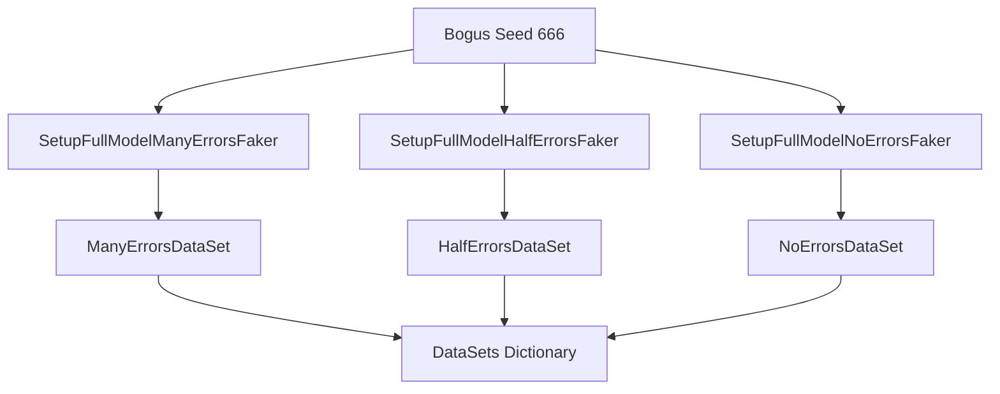

# Project Structure

Relevant source files

The following files were used as context for generating this wiki page:

- [src/FluentValidation/TestHelper/ValidatorTestExtensions.cs](https://github.com/FluentValidation/FluentValidation/blob/main/src/FluentValidation/TestHelper/ValidatorTestExtensions.cs)
- [src/FluentValidation.Tests.Benchmarks/EngineOnlyBenchmark.cs](https://github.com/FluentValidation/FluentValidation/blob/main/src/FluentValidation.Tests.Benchmarks/EngineOnlyBenchmark.cs)
- [docs/testing.md](https://github.com/FluentValidation/FluentValidation/blob/main/docs/testing.md)
- [src/FluentValidation.Tests/ValidatorTesterTester.cs](https://github.com/FluentValidation/FluentValidation/blob/main/src/FluentValidation.Tests/ValidatorTesterTester.cs)
- [src/FluentValidation.Tests/AbstractValidatorTester.cs](https://github.com/FluentValidation/FluentValidation/blob/main/src/FluentValidation.Tests/AbstractValidatorTester.cs)
- [src/FluentValidation.Tests/DefaultValidatorExtensionTester.cs](https://github.com/FluentValidation/FluentValidation/blob/main/src/FluentValidation.Tests/DefaultValidatorExtensionTester.cs)
- [src/FluentValidation.Tests.Benchmarks/Models.cs](https://github.com/FluentValidation/FluentValidation/blob/main/src/FluentValidation.Tests.Benchmarks/Models.cs)
- [src/FluentValidation.Tests.Benchmarks/DataSet.cs](https://github.com/FluentValidation/FluentValidation/blob/main/src/FluentValidation.Tests.Benchmarks/DataSet.cs)
- [src/FluentValidation/ValidatorOptions.cs](https://github.com/FluentValidation/FluentValidation/blob/main/src/FluentValidation/ValidatorOptions.cs)
- [src/FluentValidation/TestHelper/TestValidationResult.cs](https://github.com/FluentValidation/FluentValidation/blob/main/src/FluentValidation/TestHelper/TestValidationResult.cs)
- [src/FluentValidation.Tests/AssemblyScannerTester.cs](https://github.com/FluentValidation/FluentValidation/blob/main/src/FluentValidation.Tests/AssemblyScannerTester.cs)
- [src/FluentValidation.Tests.Benchmarks/ValidationBenchmark.cs](https://github.com/FluentValidation/FluentValidation/blob/main/src/FluentValidation.Tests.Benchmarks/ValidationBenchmark.cs)
- [src/FluentValidation/Internal/ExtensionsInternal.cs](https://github.com/FluentValidation/FluentValidation/blob/main/src/FluentValidation/Internal/ExtensionsInternal.cs)
- [src/FluentValidation.DependencyInjectionExtensions/README.md](https://github.com/FluentValidation/FluentValidation/blob/main/src/FluentValidation.DependencyInjectionExtensions/README.md)
- [src/FluentValidation.Tests/xunit.runner.json](https://github.com/FluentValidation/FluentValidation/blob/main/src/FluentValidation.Tests/xunit.runner.json)
- [src/FluentValidation/README.md](https://github.com/FluentValidation/FluentValidation/blob/main/src/FluentValidation/README.md)
- [src/FluentValidation/IValidationRuleInternal.cs](https://github.com/FluentValidation/FluentValidation/blob/main/src/FluentValidation/IValidationRuleInternal.cs)
- [docs/index.rst](https://github.com/FluentValidation/FluentValidation/blob/main/docs/index.rst)
- [src/FluentValidation.Tests/ChainingValidatorsTester.cs](https://github.com/FluentValidation/FluentValidation/blob/main/src/FluentValidation.Tests/ChainingValidatorsTester.cs)
- [src/FluentValidation.Tests.Benchmarks/Program.cs](https://github.com/FluentValidation/FluentValidation/blob/main/src/FluentValidation.Tests.Benchmarks/Program.cs)
- [src/FluentValidation.Tests/ComplexValidationTester.cs](https://github.com/FluentValidation/FluentValidation/blob/main/src/FluentValidation.Tests/ComplexValidationTester.cs)

## Overview

The codebase is organized around core validation primitives, extension packages, testing helpers, a comprehensive unit test suite, and a dedicated benchmarking framework. These components establish the foundational architecture for defining strongly-typed validation rules, configuring global options, executing validations synchronously or asynchronously, and ensuring rigorous quality and performance tracking.

Sources: [src/FluentValidation/ValidatorOptions.cs:33-145](https://github.com/FluentValidation/FluentValidation/blob/main/src/FluentValidation/ValidatorOptions.cs#L33-L145), [src/FluentValidation.DependencyInjectionExtensions/README.md:1-8](https://github.com/FluentValidation/FluentValidation/blob/main/src/FluentValidation.DependencyInjectionExtensions/README.md#L1-L8), [src/FluentValidation/TestHelper/ValidatorTestExtensions.cs:34-233](https://github.com/FluentValidation/FluentValidation/blob/main/src/FluentValidation/TestHelper/ValidatorTestExtensions.cs#L34-L233), [src/FluentValidation.Tests/ValidatorTesterTester.cs:30-1067](https://github.com/FluentValidation/FluentValidation/blob/main/src/FluentValidation.Tests/ValidatorTesterTester.cs#L30-L1067), [src/FluentValidation.Tests.Benchmarks/ValidationBenchmark.cs:25-71](https://github.com/FluentValidation/FluentValidation/blob/main/src/FluentValidation.Tests.Benchmarks/ValidationBenchmark.cs#L25-L71)

## Core Primitives and Global Configuration

### Overview

The core validation engine of FluentValidation is built upon primary abstractions that coordinate rule definitions, internal rule structures, and global configuration settings. At the global level, `ValidatorConfiguration` and `ValidatorOptions.Global` manage defaults such as `DefaultClassLevelCascadeMode`, `DefaultRuleLevelCascadeMode`, `Severity`, `PropertyChainSeparator`, `LanguageManager`, `ValidatorSelectors`, `MessageFormatterFactory`, `PropertyNameResolver`, `DisplayNameResolver`, `DisableAccessorCache`, `ErrorCodeResolver`, and `OnFailureCreated`.

Sources: [src/FluentValidation/ValidatorOptions.cs:33-145](https://github.com/FluentValidation/FluentValidation/blob/main/src/FluentValidation/ValidatorOptions.cs#L33-L145)

### Global Configuration and Resolver Options

The `ValidatorConfiguration` class exposes several pluggable delegates and default values that control how property names, display names, error codes, and message formatting operate across all validators.

| Configuration Property | Type | Default Value / Factory | Purpose |
| :--- | :--- | :--- | :--- |
| `DefaultClassLevelCascadeMode` | `CascadeMode` | `CascadeMode.Continue` | Sets default class-level cascade mode for validators. |
| `DefaultRuleLevelCascadeMode` | `CascadeMode` | `CascadeMode.Continue` | Sets default rule-level cascade mode for rules. |
| `Severity` | `Severity` | `Severity.Error` | Default severity level for validation failures. |
| `PropertyChainSeparator` | `string` | `"."` | Default property chain separator string. |
| `LanguageManager` | `ILanguageManager` | `new LanguageManager()` | Language manager for localization. |
| `ValidatorSelectors` | `ValidatorSelectorOptions` | `new ValidatorSelectorOptions()` | Customizations for validator selectors. |
| `MessageFormatterFactory` | `Func<MessageFormatter>` | `() => new MessageFormatter()` | Factory for creating `MessageFormatter` instances. |
| `PropertyNameResolver` | `Func<Type, MemberInfo, LambdaExpression, string>` | `DefaultPropertyNameResolver` | Pluggable logic for resolving property names. |
| `DisplayNameResolver` | `Func<Type, MemberInfo, LambdaExpression, string>` | `DefaultDisplayNameResolver` | Pluggable logic for resolving display names. |
| `DisableAccessorCache` | `bool` | `false` | Disables the expression accessor cache when set to true. |
| `ErrorCodeResolver` | `Func<IPropertyValidator, string>` | `DefaultErrorCodeResolver` | Pluggable resolver for default error codes. |
| `OnFailureCreated` | `Func<ValidationFailure, IValidationContext, object, IValidationRule, IRuleComponent, ValidationFailure>` | `null` | Hook that runs when a `ValidationFailure` is created. |

Sources: [src/FluentValidation/ValidatorOptions.cs:33-135](https://github.com/FluentValidation/FluentValidation/blob/main/src/FluentValidation/ValidatorOptions.cs#L33-L135)

> [!NOTE]
> Disabling the expression accessor cache via `DisableAccessorCache` is not recommended because it bypasses optimized expression caching mechanisms used during rule execution.
> Sources: [src/FluentValidation/ValidatorOptions.cs:104-106](https://github.com/FluentValidation/FluentValidation/blob/main/src/FluentValidation/ValidatorOptions.cs#L104-L106)

### Internal Rule Interfaces and Execution Contracts

Internal rule structures are defined by `IValidationRuleInternal<T>` and `IValidationRuleInternal<T, TProperty>`. These interfaces extend public validation rules to expose synchronization and execution pathways, including `Validate(ValidationContext<T> context)`, `ValidateAsync(ValidationContext<T> context, CancellationToken cancellation)`, `AddDependentRules(IEnumerable<IValidationRuleInternal<T>> rules)`, and a strongly-typed `Components` list holding `RuleComponent<T, TProperty>` items.

Sources: [src/FluentValidation/IValidationRuleInternal.cs:26-35](https://github.com/FluentValidation/FluentValidation/blob/main/src/FluentValidation/IValidationRuleInternal.cs#L26-L35)

Helper extensions within `ExtensionsInternal` provide utility functions such as `ThrowIfNullOrEmpty`, `IsParameterExpression`, `SplitPascalCase`, `GetOrAdd`, and `ResolveErrorMessageUsingErrorCode`.

Sources: [src/FluentValidation/Internal/ExtensionsInternal.cs:29-101](https://github.com/FluentValidation/FluentValidation/blob/main/src/FluentValidation/Internal/ExtensionsInternal.cs#L29-L101)

| Design Choice | Benefit | Cost |
| :--- | :--- | :--- |
| Pluggable Resolvers (`PropertyNameResolver`, `DisplayNameResolver`, `ErrorCodeResolver`) | Allows custom naming conventions and error code strategies globally without altering individual rules. | Introduces delegate invocation overhead during rule setup or resolution phases. |
| Separate `IValidationRuleInternal<T>` Abstraction | Keeps internal execution hooks (`ValidateAsync`, `AddDependentRules`) hidden from public API consumers while accessible to the execution engine. | Adds interface layering between public rule definitions and internal runner logic. |

Sources: [src/FluentValidation/ValidatorOptions.cs:33-135](https://github.com/FluentValidation/FluentValidation/blob/main/src/FluentValidation/ValidatorOptions.cs#L33-L135), [src/FluentValidation/IValidationRuleInternal.cs:26-35](https://github.com/FluentValidation/FluentValidation/blob/main/src/FluentValidation/IValidationRuleInternal.cs#L26-L35)

## Dependency Injection Framework Extensions

### Overview

The `FluentValidation.DependencyInjectionExtensions` package provides integration with Microsoft Dependency Injection (`IServiceProvider`), enabling automated wiring and resolution of validators within application containers.

Sources: [src/FluentValidation.DependencyInjectionExtensions/README.md:4-6](https://github.com/FluentValidation/FluentValidation/blob/main/src/FluentValidation.DependencyInjectionExtensions/README.md#L4-L6)

> [!NOTE]
> Further documentation regarding specific methods and configuration parameters provided in this package can be found directly within the online FluentValidation dependency injection guide.
> Sources: [src/FluentValidation.DependencyInjectionExtensions/README.md:7-7](https://github.com/FluentValidation/FluentValidation/blob/main/src/FluentValidation.DependencyInjectionExtensions/README.md#L7-L7)

## Testing Extensions and Validation Helpers

### Overview

FluentValidation provides specialized test extensions and validation helper utilities within the `FluentValidation.TestHelper` namespace designed to simplify unit testing validators by treating them as black boxes. Rather than mocking validators—which can lead to brittle tests tied to internal rule structures—developers provide input models to validator instances and execute assertion helpers against the resulting validation outcome.

Sources: [src/FluentValidation/TestHelper/ValidatorTestExtensions.cs:20-34](https://github.com/FluentValidation/FluentValidation/blob/main/src/FluentValidation/TestHelper/ValidatorTestExtensions.cs#L20-L34), [docs/testing.md:5-113](https://github.com/FluentValidation/FluentValidation/blob/main/docs/testing.md#L5-L113)

### Validation Execution and Assertion Flow

The primary entry point for testing is the `TestValidate` extension method, which wraps validator execution and returns a specialized `TestValidationResult<T>`. When testing asynchronous validators, `TestValidateAsync` should be used to await validation completion.

The complete test execution and assertion pipeline proceeds through the following named functions and checks:

`TestValidate()` / `TestValidateAsync()` → `validator.Validate()` / `validator.ValidateAsync()` → `new TestValidationResult<T>()` → `ShouldHaveValidationErrorFor()` / `ShouldNotHaveValidationErrorFor()` → `TestValidationContinuation.ApplyPredicate()` → `BuildErrorMessage()` → throws `ValidationTestException` upon failure.

Sources: [src/FluentValidation/TestHelper/ValidatorTestExtensions.cs:86-120](https://github.com/FluentValidation/FluentValidation/blob/main/src/FluentValidation/TestHelper/ValidatorTestExtensions.cs#L86-L120), [src/FluentValidation/TestHelper/TestValidationResult.cs:30-116](https://github.com/FluentValidation/FluentValidation/blob/main/src/FluentValidation/TestHelper/TestValidationResult.cs#L30-L116)

> [!WARNING]
> Invoking synchronous test methods like `TestValidate` on a validator containing asynchronous rules throws an `AsyncValidatorInvokedSynchronouslyException`, which is caught and rethrown with guidance to use the asynchronous test methods instead.
> Sources: [src/FluentValidation/TestHelper/ValidatorTestExtensions.cs:96-101](https://github.com/FluentValidation/FluentValidation/blob/main/src/FluentValidation/TestHelper/ValidatorTestExtensions.cs#L96-L101)

### Test Result Assertion Methods

`TestValidationResult<T>` and `ValidationTestExtension` provide numerous fluent assertion methods to inspect failures, error codes, severities, custom states, and message arguments.

| Extension Method | Target Condition / Parameter | Description |
| :--- | :--- | :--- |
| `ShouldHaveValidationErrorFor` | `Expression<Func<T, TProperty>>` or `string propertyName` | Asserts that a validation error exists for the specified property. |
| `ShouldNotHaveValidationErrorFor` | `Expression<Func<T, TProperty>>` or `string propertyName` | Asserts that no validation error exists for the specified property. |
| `ShouldNotHaveAnyValidationErrors` | `MatchAnyFailure` constant (`__FV__ANY`) | Asserts that the validation result contains zero errors across all properties. |
| `ShouldHaveValidationErrors` | None | Asserts that at least one validation error exists across the result. |
| `WithErrorMessage` | `string expectedErrorMessage` | Chains an assertion verifying the failure's `ErrorMessage`. |
| `WithErrorCode` | `string expectedErrorCode` | Chains an assertion verifying the failure's `ErrorCode`. |
| `WithSeverity` | `Severity expectedSeverity` | Chains an assertion verifying the failure's `Severity`. |
| `WithCustomState` | `object expectedCustomState`, `IEqualityComparer comparer` | Chains an assertion verifying the failure's custom state object. |
| `WithMessageArgument` | `string argumentKey`, `T argumentValue` | Chains an assertion verifying a formatted message placeholder value. |
| `Only` | None | Asserts that no unexpected validation errors occurred outside of specified filter conditions. |

Sources: [src/FluentValidation/TestHelper/ValidatorTestExtensions.cs:34-232](https://github.com/FluentValidation/FluentValidation/blob/main/src/FluentValidation/TestHelper/ValidatorTestExtensions.cs#L34-L232), [src/FluentValidation/TestHelper/TestValidationResult.cs:30-116](https://github.com/FluentValidation/FluentValidation/blob/main/src/FluentValidation/TestHelper/TestValidationResult.cs#L30-L116)

> [!TIP]
> When testing properties that cannot be easily represented using lambda expressions (such as nested indexers like `Addresses[0].Line1`), you can pass the property path directly as a string into `ShouldHaveValidationErrorFor("Addresses[0].Line1")`.
> Sources: [docs/testing.md:73-75](https://github.com/FluentValidation/FluentValidation/blob/main/docs/testing.md#L73-L75)

### Design Trade-offs in Test Helpers

| Design Choice | Benefit | Cost |
| :--- | :--- | :--- |
| Black-box testing via `TestValidate` | Tests use real validator instances against models, preventing brittle tests tied to internal rule construction. | Requires instantiating domain models with specific test data to trigger rule branches. |
| Fluent continuation API (`When`, `WithErrorCode`, `Only`) | Enables precise chaining of multiple assertions (severity, error code, custom state) on specific property failures. | Increases test helper surface area and exception message formatting complexity. |
| `InlineValidator<T>` stub implementation | Allows stubbing failure conditions without pulling in external mocking frameworks. | Requires manually writing inline rule definitions for complex failure scenarios. |

Sources: [src/FluentValidation/TestHelper/ValidatorTestExtensions.cs:34-232](https://github.com/FluentValidation/FluentValidation/blob/main/src/FluentValidation/TestHelper/ValidatorTestExtensions.cs#L34-L232), [docs/testing.md:5-135](https://github.com/FluentValidation/FluentValidation/blob/main/docs/testing.md#L5-L135)

## Core Unit Test Suite Structure

### Overview

The test suite validates complex behaviors including rule chaining, nested and multi-level object validation, pre-validation hooks, assembly scanning, and individual validator extensions. These tests verify proper error propagation across object graphs and ensure that rule options apply exclusively to their target validators.

Sources: [src/FluentValidation.Tests/AbstractValidatorTester.cs:29-352](https://github.com/FluentValidation/FluentValidation/blob/main/src/FluentValidation.Tests/AbstractValidatorTester.cs#L29-L352), [src/FluentValidation.Tests/ChainingValidatorsTester.cs:24-59](https://github.com/FluentValidation/FluentValidation/blob/main/src/FluentValidation.Tests/ChainingValidatorsTester.cs#L24-L59), [src/FluentValidation.Tests/ComplexValidationTester.cs:31-304](https://github.com/FluentValidation/FluentValidation/blob/main/src/FluentValidation.Tests/ComplexValidationTester.cs#L31-L304), [src/FluentValidation.Tests/AssemblyScannerTester.cs:25-85](https://github.com/FluentValidation/FluentValidation/blob/main/src/FluentValidation.Tests/AssemblyScannerTester.cs#L25-L85)

### Rule Chaining and Execution

When multiple validators are chained on a single property rule, each component is appended to the rule's component list. Tests confirm that rule configurations such as custom error messages apply strictly to the immediate validator component rather than bleeding into subsequent validations in the chain.

Sources: [src/FluentValidation.Tests/ChainingValidatorsTester.cs:24-59](https://github.com/FluentValidation/FluentValidation/blob/main/src/FluentValidation.Tests/ChainingValidatorsTester.cs#L24-L59)

| Chaining Operation | Test Verification | Source Behavior |
| :--- | :--- | :--- |
| Multiple validator creation | `validator.Single().Components.Count().ShouldEqual(2)` | Chaining `.NotNull().NotEqual("foo")` creates two distinct validation components under one rule. |
| Multiple validator execution | `validator.Validate(new Person()).Errors.Count().ShouldEqual(2)` | Both validation components execute and return separate failures when conditions fail. |
| Scoped options | `results.Errors.ElementAt(0).ErrorMessage.ShouldEqual("null")` | Calling `.WithMessage()` immediately after a validator modifies only that component's error message. |

Sources: [src/FluentValidation.Tests/ChainingValidatorsTester.cs:31-58](https://github.com/FluentValidation/FluentValidation/blob/main/src/FluentValidation.Tests/ChainingValidatorsTester.cs#L31-L58)

> [!WARNING]
> Rule options like `.WithMessage()` or `.WithErrorCode()` apply only to the immediately preceding validator in the fluent chain; placing them after the entire rule chain without a preceding validator will misalign configuration or fail compilation.
> Sources: [src/FluentValidation.Tests/ChainingValidatorsTester.cs:49-58](https://github.com/FluentValidation/FluentValidation/blob/main/src/FluentValidation.Tests/ChainingValidatorsTester.cs#L49-L58)

### Complex Object Validation and Assembly Scanning

Complex validation tests verify that nested child validators correctly propagate property names (e.g., `Address.Postcode`, `Address.Country.Name`) and respect filtering options like `IncludeProperties`. Additionally, the assembly scanner correctly discovers public validator implementations, and can be explicitly configured to locate internal validator types.

Sources: [src/FluentValidation.Tests/ComplexValidationTester.cs:31-104](https://github.com/FluentValidation/FluentValidation/blob/main/src/FluentValidation.Tests/ComplexValidationTester.cs#L31-L104), [src/FluentValidation.Tests/AssemblyScannerTester.cs:25-64](https://github.com/FluentValidation/FluentValidation/blob/main/src/FluentValidation.Tests/AssemblyScannerTester.cs#L25-L64)

| Scanner Configuration Method | Target Behavior | Discovered Types |
| :--- | :--- | :--- |
| `AssemblyScanner.FindValidatorsInAssembly(assembly)` | Default discovery mode | Finds public validators (e.g., `Model1Validator`, `Model2Validator`), excludes internal types. |
| `AssemblyScanner.FindValidatorsInAssembly(assembly, includeInternalTypes: true)` | Inclusive discovery mode | Finds both public validators and internal types (e.g., `Model1InternalValidator`). |

Sources: [src/FluentValidation.Tests/AssemblyScannerTester.cs:49-64](https://github.com/FluentValidation/FluentValidation/blob/main/src/FluentValidation.Tests/AssemblyScannerTester.cs#L49-L64)

> [!NOTE]
> By default, `AssemblyScanner.FindValidatorsInAssembly` ignores internal validator classes; you must explicitly pass `includeInternalTypes: true` as the second parameter to discover internal validator implementations.
> Sources: [src/FluentValidation.Tests/AssemblyScannerTester.cs:49-64](https://github.com/FluentValidation/FluentValidation/blob/main/src/FluentValidation.Tests/AssemblyScannerTester.cs#L49-L64)

## Performance Benchmarks and Dataset Tools

### Overview

The `FluentValidation.Tests.Benchmarks` project contains a dedicated benchmarking suite built with BenchmarkDotNet to measure engine execution overhead, validation throughput, rule complexity scaling, and fail-fast cascade performance across synthetic datasets. Program execution entry point is defined in `Program.cs`, which invokes `BenchmarkSwitcher.FromAssembly(typeof(Program).Assembly).Run(args)` to execute benchmark classes from command-line arguments or interactive runs.

Sources: [src/FluentValidation.Tests.Benchmarks/Program.cs:24-28](https://github.com/FluentValidation/FluentValidation/blob/main/src/FluentValidation.Tests.Benchmarks/Program.cs#L24-L28)

### Engine and Validation Benchmarks

The benchmark suite is partitioned into two primary performance measurement classes annotated with `[MemoryDiagnoser]`: `EngineOnlyBenchmark` and `ValidationBenchmark`.

`EngineOnlyBenchmark` isolates pure rule engine dispatch overhead using minimal models (`VoidModel`) and no-logic rules (`Must(o => true)`), parametrized with a sample size `N` of 10,000 models. It compares single-rule versus ten-rule execution paths.

Sources: [src/FluentValidation.Tests.Benchmarks/EngineOnlyBenchmark.cs:26-60](https://github.com/FluentValidation/FluentValidation/blob/main/src/FluentValidation.Tests.Benchmarks/EngineOnlyBenchmark.cs#L26-L60)

`ValidationBenchmark` evaluates full-object graph validation utilizing `FullModelValidator` against parameterized error distribution datasets. It contrasts standard cascade behavior (`Validate`) with fail-fast cascade behavior (`FailFast`), where `ClassLevelCascadeMode` and `RuleLevelCascadeMode` are set to `CascadeMode.Stop`.

Sources: [src/FluentValidation.Tests.Benchmarks/ValidationBenchmark.cs:25-42](https://github.com/FluentValidation/FluentValidation/blob/main/src/FluentValidation.Tests.Benchmarks/ValidationBenchmark.cs#L25-L42)

| Benchmark Class | Target Component | Benchmark Method | Setup Configuration |
| :--- | :--- | :--- | :--- |
| `EngineOnlyBenchmark` | `NoLogicModelSingleRuleValidator` | `Validate_SingleRule()` | 10,000 `VoidModel` instances, 1 rule per model |
| `EngineOnlyBenchmark` | `NoLogicModelTenRulesValidator` | `Validate_TenRules()` | 10,000 `VoidModel` instances, 10 rules per model |
| `ValidationBenchmark` | `FullModelValidator` | `Validate()` | Parameterized dataset (`ManyErrors`, `HalfErrors`, `NoErrors`), default cascade mode |
| `ValidationBenchmark` | `FullModelValidator` | `FailFast()` | Parameterized dataset, `ClassLevelCascadeMode = CascadeMode.Stop`, `RuleLevelCascadeMode = CascadeMode.Stop` |

Sources: [src/FluentValidation.Tests.Benchmarks/EngineOnlyBenchmark.cs:27-90](https://github.com/FluentValidation/FluentValidation/blob/main/src/FluentValidation.Tests.Benchmarks/EngineOnlyBenchmark.cs#L27-L90), [src/FluentValidation.Tests.Benchmarks/ValidationBenchmark.cs:25-71](https://github.com/FluentValidation/FluentValidation/blob/main/src/FluentValidation.Tests.Benchmarks/ValidationBenchmark.cs#L25-L71)

> [!NOTE]
> `EngineOnlyBenchmark` uses `[Params(10000)]` for sample size `N` and loops through the pre-allocated `_noLogicModels` collection inside each benchmark iteration to measure aggregate validation dispatch time without allocation noise from model generation.
> Sources: [src/FluentValidation.Tests.Benchmarks/EngineOnlyBenchmark.cs:59-89](https://github.com/FluentValidation/FluentValidation/blob/main/src/FluentValidation.Tests.Benchmarks/EngineOnlyBenchmark.cs#L59-L89)

### Dataset Generation and Models

The `DataSet` utility class initializes static test data collections using the `Bogus` library with a fixed random seed (`666`) and a constant dataset size of 10,000 items (`Size = 10_000`). It defines three distinct error generation fakers (`FullModelManyErrorsFaker`, `FullModelHalfErrorsFaker`, `FullModelNoErrorsFaker`) supplying `ManyErrorsDataSet`, `HalfErrorsDataSet`, and `NoErrorsDataSet` collections aggregated into a read-only dictionary (`DataSets`).

Sources: [src/FluentValidation.Tests.Benchmarks/DataSet.cs:28-145](https://github.com/FluentValidation/FluentValidation/blob/main/src/FluentValidation.Tests.Benchmarks/DataSet.cs#L28-L145)

Sources: [src/FluentValidation.Tests.Benchmarks/DataSet.cs:29-134](https://github.com/FluentValidation/FluentValidation/blob/main/src/FluentValidation.Tests.Benchmarks/DataSet.cs#L29-L134)

The data structures subject to validation comprise `FullModel` and `NestedModel`, containing scalar string properties (`Text1` through `Text5`), integer properties (`Number1` through `Number5`), nullable decimals (`SuperNumber1` through `SuperNumber3`), nested object references (`NestedModel1`, `NestedModel2`), object collections (`ModelCollection`), and value type collections (`StructCollection`).

Sources: [src/FluentValidation.Tests.Benchmarks/Models.cs:25-69](https://github.com/FluentValidation/FluentValidation/blob/main/src/FluentValidation.Tests.Benchmarks/Models.cs#L25-L69)

| Dataset Key | Faker Method | Error Distribution Profile | Source Range |
| :--- | :--- | :--- | :--- |
| `"ManyErrors"` | `SetupFullModelManyErrorsFaker()` | Generates high failure rates with random nulls (10%-30%) and out-of-range numerical values across scalar and collection rules. | [src/FluentValidation.Tests.Benchmarks/DataSet.cs:30-57](https://github.com/FluentValidation/FluentValidation/blob/main/src/FluentValidation.Tests.Benchmarks/DataSet.cs#L30-L57) |
| `"HalfErrors"` | `SetupFullModelHalfErrorsFaker()` | Generates moderate failure rates combining long text strings, word lists, and occasional null decimals. | [src/FluentValidation.Tests.Benchmarks/DataSet.cs:88-115](https://github.com/FluentValidation/FluentValidation/blob/main/src/FluentValidation.Tests.Benchmarks/DataSet.cs#L88-L115) |
| `"NoErrors"` | `SetupFullModelNoErrorsFaker()` | Generates valid data meeting all `NotNull`, `Must` substring requirements, and boundary checks (`< 9` or `<= 9`). | [src/FluentValidation.Tests.Benchmarks/DataSet.cs:59-86](https://github.com/FluentValidation/FluentValidation/blob/main/src/FluentValidation.Tests.Benchmarks/DataSet.cs#L59-L86) |

Sources: [src/FluentValidation.Tests.Benchmarks/DataSet.cs:30-134](https://github.com/FluentValidation/FluentValidation/blob/main/src/FluentValidation.Tests.Benchmarks/DataSet.cs#L30-L134)

> [!WARNING]
> Dataset generation relies on `Bogus.Randomizer.Seed = new Random(666)` during static initialization of `DataSet`; altering or removing the static constructor seed will result in non-deterministic benchmark measurements across test runs.
> Sources: [src/FluentValidation.Tests.Benchmarks/DataSet.cs:29-124](https://github.com/FluentValidation/FluentValidation/blob/main/src/FluentValidation.Tests.Benchmarks/DataSet.cs#L29-L124)

## Related

- [[Overview]]
- [[Validation Core]]

