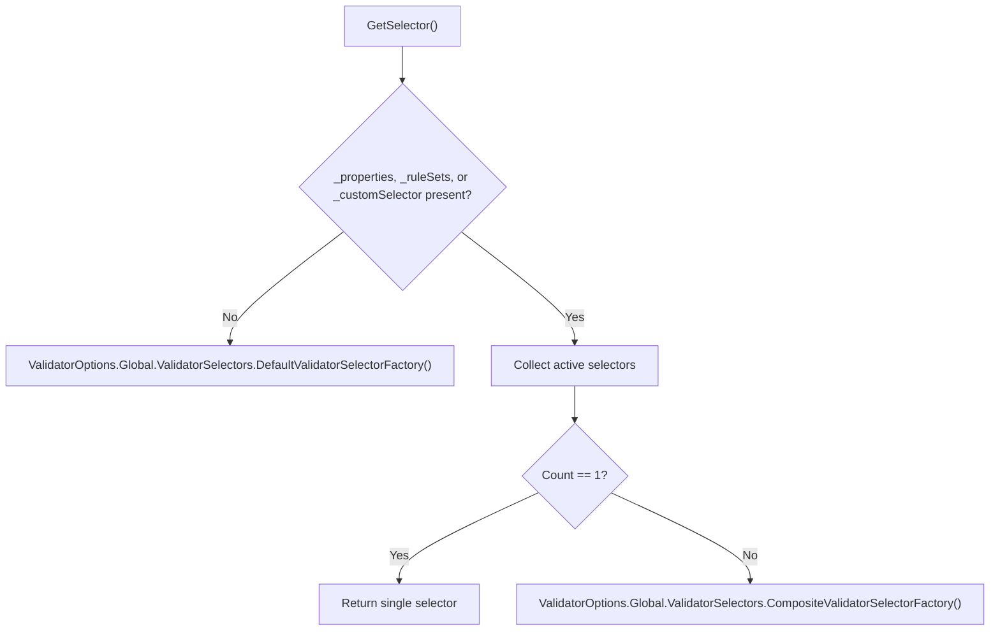
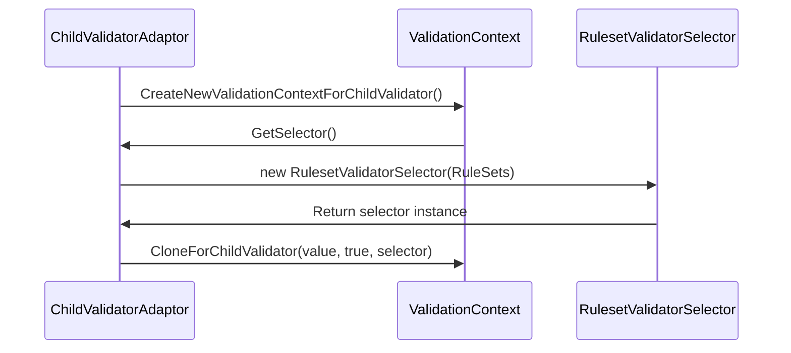

# Rulesets and Selection

<details>
<summary>Relevant source files</summary>

The following files were used as context for generating this wiki page:

- [src/FluentValidation/Validators/ChildValidatorAdaptor.cs](https://github.com/FluentValidation/FluentValidation/blob/main/src/FluentValidation/Validators/ChildValidatorAdaptor.cs)
- [src/FluentValidation/Internal/MemberNameValidatorSelector.cs](https://github.com/FluentValidation/FluentValidation/blob/main/src/FluentValidation/Internal/MemberNameValidatorSelector.cs)
- [src/FluentValidation/Internal/RulesetValidatorSelector.cs](https://github.com/FluentValidation/FluentValidation/blob/main/src/FluentValidation/Internal/RulesetValidatorSelector.cs)
- [src/FluentValidation/Internal/ValidationStrategy.cs](https://github.com/FluentValidation/FluentValidation/blob/main/src/FluentValidation/Internal/ValidationStrategy.cs)
- [src/FluentValidation/ValidatorDescriptor.cs](https://github.com/FluentValidation/FluentValidation/blob/main/src/FluentValidation/ValidatorDescriptor.cs)
- [src/FluentValidation/Internal/RuleBase.cs](https://github.com/FluentValidation/FluentValidation/blob/main/src/FluentValidation/Internal/RuleBase.cs)
- [src/FluentValidation/AbstractValidator.cs](https://github.com/FluentValidation/FluentValidation/blob/main/src/FluentValidation/AbstractValidator.cs)
- [src/FluentValidation/Validators/PolymorphicValidator.cs](https://github.com/FluentValidation/FluentValidation/blob/main/src/FluentValidation/Validators/PolymorphicValidator.cs)
- [docs/rulesets.md](https://github.com/FluentValidation/FluentValidation/blob/main/docs/rulesets.md)
- [src/FluentValidation/ValidatorOptions.cs](https://github.com/FluentValidation/FluentValidation/blob/main/src/FluentValidation/ValidatorOptions.cs)
- [src/FluentValidation/Internal/CollectionPropertyRule.cs](https://github.com/FluentValidation/FluentValidation/blob/main/src/FluentValidation/Internal/CollectionPropertyRule.cs)
- [src/FluentValidation/DefaultValidatorExtensions.cs](https://github.com/FluentValidation/FluentValidation/blob/main/src/FluentValidation/DefaultValidatorExtensions.cs)
- [src/FluentValidation/Internal/CompositeValidatorSelector.cs](https://github.com/FluentValidation/FluentValidation/blob/main/src/FluentValidation/Internal/CompositeValidatorSelector.cs)
- [src/FluentValidation.Tests/InheritanceValidatorTest.cs](https://github.com/FluentValidation/FluentValidation/blob/main/src/FluentValidation.Tests/InheritanceValidatorTest.cs)
- [src/FluentValidation.Tests/AbstractValidatorTester.cs](https://github.com/FluentValidation/FluentValidation/blob/main/src/FluentValidation.Tests/AbstractValidatorTester.cs)
- [src/FluentValidation/Syntax.cs](https://github.com/FluentValidation/FluentValidation/blob/main/src/FluentValidation/Syntax.cs)
- [src/FluentValidation/Internal/DefaultValidatorSelector.cs](https://github.com/FluentValidation/FluentValidation/blob/main/src/FluentValidation/Internal/DefaultValidatorSelector.cs)
- [src/FluentValidation/AssemblyScanner.cs](https://github.com/FluentValidation/FluentValidation/blob/main/src/FluentValidation/AssemblyScanner.cs)
- [src/FluentValidation/Internal/IValidatorSelector.cs](https://github.com/FluentValidation/FluentValidation/blob/main/src/FluentValidation/Internal/IValidatorSelector.cs)
- [src/FluentValidation/IValidatorDescriptor.cs](https://github.com/FluentValidation/FluentValidation/blob/main/src/FluentValidation/IValidatorDescriptor.cs)
- [src/FluentValidation/Internal/ChildRulesContainer.cs](https://github.com/FluentValidation/FluentValidation/blob/main/src/FluentValidation/Internal/ChildRulesContainer.cs)
- [src/FluentValidation.Tests/ValidatorDescriptorTester.cs](https://github.com/FluentValidation/FluentValidation/blob/main/src/FluentValidation.Tests/ValidatorDescriptorTester.cs)
- [src/FluentValidation/IValidationRule.cs](https://github.com/FluentValidation/FluentValidation/blob/main/src/FluentValidation/IValidationRule.cs)
- [docs/including-rules.md](https://github.com/FluentValidation/FluentValidation/blob/main/docs/including-rules.md)
</details>

## Overview

Rule validation filtering and grouping mechanisms in FluentValidation allow complex validation logic to be structured into modular execution units and selectively filtered at runtime. By organizing rules into named rule groups and applying targeted selection strategies, validators can execute subsets of rules or specific properties based on operational requirements. Sources: [docs/rulesets.md:3-36](https://github.com/FluentValidation/FluentValidation/blob/main/docs/rulesets.md#L3-L36), [src/FluentValidation/Internal/ValidationStrategy.cs:39-104](https://github.com/FluentValidation/FluentValidation/blob/main/src/FluentValidation/Internal/ValidationStrategy.cs#L39-L104)

These selection capabilities integrate across nested and polymorphic object hierarchies, propagating inclusion rules down child validator chains while providing reflective metadata inspection tools to analyze rule structures and ruleset assignments. Sources: [src/FluentValidation/Validators/ChildValidatorAdaptor.cs:49-105](https://github.com/FluentValidation/FluentValidation/blob/main/src/FluentValidation/Validators/ChildValidatorAdaptor.cs#L49-L105), [src/FluentValidation/Validators/PolymorphicValidator.cs:110-115](https://github.com/FluentValidation/FluentValidation/blob/main/src/FluentValidation/Validators/PolymorphicValidator.cs#L110-L115), [src/FluentValidation/ValidatorDescriptor.cs:112-120](https://github.com/FluentValidation/FluentValidation/blob/main/src/FluentValidation/ValidatorDescriptor.cs#L112-L120)

## RuleSet Syntax and Declaration

### Overview

Named rule groups within `AbstractValidator<T>` are declared using the `RuleSet` method, allowing developers to partition a validator into distinct operational segments. When defining validation logic inside a class inheriting from `AbstractValidator<T>`, wrapping individual rules inside a `RuleSet` block assigns those rules to one or more specific group identifiers. Sources: [src/FluentValidation/AbstractValidator.cs:237-248](https://github.com/FluentValidation/AbstractValidator.cs#L237-L248), [docs/rulesets.md:3-21](https://github.com/FluentValidation/FluentValidation/blob/main/docs/rulesets.md#L3-L21)

### RuleSet Method Signature and Parsing

The `RuleSet` method accepts a comma- or semicolon-delimited string of rule set names alongside an `Action` delegate that encapsulates the rules belonging to those sets. Internally, the string is split and trimmed into an array of names before registering them with the rule collection. Sources: [src/FluentValidation/AbstractValidator.cs:237-248](https://github.com/FluentValidation/AbstractValidator.cs#L237-L248)

```csharp
public void RuleSet(string ruleSetName, Action action) {
    ExtensionsInternal.ThrowIfNullOrEmpty(ruleSetName);
    ArgumentNullException.ThrowIfNull(action);

    var ruleSetNames = ruleSetName.Split(',', ';')
        .Select(x => x.Trim())
        .ToArray();

    using (Rules.OnItemAdded(r => r.RuleSets = ruleSetNames)) {
        action();
    }
}
```
Sources: [src/FluentValidation/AbstractValidator.cs:237-248](https://github.com/FluentValidation/AbstractValidator.cs#L237-L248)

> [!NOTE]
> The `RuleSet` implementation uses `Rules.OnItemAdded` to temporarily hook into rule creation. Any rule instantiated via `RuleFor` or `RuleForEach` inside the provided `action` delegate automatically receives the parsed `ruleSetNames` assigned to its `RuleSets` property. Sources: [src/FluentValidation/AbstractValidator.cs:245-247](https://github.com/FluentValidation/AbstractValidator.cs#L245-L247), [src/FluentValidation/IValidationRule.cs:127|127](https://github.com/FluentValidation/IValidationRule.cs#L127-L127)

### RuleSet Declaration Example

The following validator demonstrates partitioning validation logic between a named `Names` rule set and ungrouped rules:

```csharp
public class PersonValidator : AbstractValidator<Person> {
    public PersonValidator() {
        RuleSet("Names", () => {
            RuleFor(x => x.Surname).NotNull();
            RuleFor(x => x.Forename).NotNull();
        });

        RuleFor(x => x.Id).NotEqual(0);
    }
}
```
Sources: [docs/rulesets.md:8-20](https://github.com/FluentValidation/FluentValidation/blob/main/docs/rulesets.md#L8-L20)

> [!WARNING]
> Rules declared outside any `RuleSet` block belong to no rule set (implicitly designated as ungrouped rules). Attempting to name a custom rule set `"default"` is restricted; FluentValidation treats rules assigned to `"default"` as rules not belonging to any rule set. Sources: [docs/rulesets.md:36-37|59-60](https://github.com/FluentValidation/FluentValidation/blob/main/docs/rulesets.md#L36-L59)

## The IValidatorSelector Interface Hierarchy

### Overview

The rule execution filtering mechanism in FluentValidation is governed by the `IValidatorSelector` interface contract. During validation execution, selectors evaluate individual validation rules against current property paths and contextual information to determine whether a rule should execute. Four concrete classes implement this contract, handling default execution, ruleset filtering, member-name targeting, and composite aggregation. Sources: [src/FluentValidation/Internal/IValidatorSelector.cs:21-34](https://github.com/FluentValidation/FluentValidation/blob/main/src/FluentValidation/Internal/IValidatorSelector.cs#L21-L34), [src/FluentValidation/Internal/DefaultValidatorSelector.cs:27-43](https://github.com/FluentValidation/Internal/DefaultValidatorSelector.cs#L27-L43), [src/FluentValidation/Internal/RulesetValidatorSelector.cs:10-87](https://github.com/FluentValidation/Internal/RulesetValidatorSelector.cs#L10-L87), [src/FluentValidation/Internal/MemberNameValidatorSelector.cs:30-159](https://github.com/FluentValidation/Internal/MemberNameValidatorSelector.cs#L30-L159), [src/FluentValidation/Internal/CompositeValidatorSelector.cs:24-34](https://github.com/FluentValidation/Internal/CompositeValidatorSelector.cs#L24-L34)

### Interface Contract

The `IValidatorSelector` contract defines a single method, `CanExecute`, which inspects the rule, property path, and validation context. Sources: [src/FluentValidation/Internal/IValidatorSelector.cs:21-34](https://github.com/FluentValidation/Internal/IValidatorSelector.cs#L21-L34)

```csharp
public interface IValidatorSelector {
    bool CanExecute(IValidationRule rule, string propertyPath, IValidationContext context);
}
```
Sources: [src/FluentValidation/Internal/IValidatorSelector.cs:21-34](https://github.com/FluentValidation/Internal/IValidatorSelector.cs#L21-L34)

### Selector Implementation Reference

| Selector Class | Scope / Target | Key Behavior | Constants / Members |
| --- | --- | --- | --- |
| `DefaultValidatorSelector` | Ungrouped rules | Ignores rules belonging to a ruleset unless explicitly named `default`. | None |
| `RulesetValidatorSelector` | Named rulesets | Evaluates rulesets against requested sets; supports wildcards (`*`) and tracks executed rulesets in `RootContextData`. | `DefaultRuleSetName = "default"`, `WildcardRuleSetName = "*"` |
| `MemberNameValidatorSelector` | Specific properties | Matches rule property paths against included member names, supporting wildcards (`[]`), partial matches, and child cascading. | `DisableCascadeKey = "_FV_DisableSelectorCascadeForChildRules"` |
| `CompositeValidatorSelector` | Multiple selectors | Combines multiple selectors via logical OR (`Any`) evaluation. | None |

Sources: [src/FluentValidation/Internal/DefaultValidatorSelector.cs:27-43](https://github.com/FluentValidation/Internal/DefaultValidatorSelector.cs#L27-L43), [src/FluentValidation/Internal/RulesetValidatorSelector.cs:10-87](https://github.com/FluentValidation/Internal/RulesetValidatorSelector.cs#L10-L87), [src/FluentValidation/Internal/MemberNameValidatorSelector.cs:30-159](https://github.com/FluentValidation/Internal/MemberNameValidatorSelector.cs#L30-L159), [src/FluentValidation/Internal/CompositeValidatorSelector.cs:24-34](https://github.com/FluentValidation/Internal/CompositeValidatorSelector.cs#L24-L34)

### Design Trade-Offs in Selector Architecture

| Design Choice | Benefit | Cost |
| --- | --- | --- |
| **Interface-based polymorphism (`IValidatorSelector`)** | Enables seamless composition of different filtering strategies without coupling validation logic to specific selection mechanisms. | Requires virtual or interface dispatch overhead during rule evaluation loops. |
| **Composite delegation (`CompositeValidatorSelector`)** | Allows combining property and ruleset filters (e.g., validating specific properties within a ruleset) via simple `Any` aggregation. | Hides individual selector evaluation details and short-circuits on the first matching selector. |
| **Contextual state tracking (`_FV_RuleSetsExecuted`)** | Records executed rulesets directly inside `RootContextData`, enabling downstream inspection and metadata reporting. | Mutates shared context state during read-only evaluation checks. |

Sources: [src/FluentValidation/Internal/CompositeValidatorSelector.cs:24-34](https://github.com/FluentValidation/Internal/CompositeValidatorSelector.cs#L24-L34), [src/FluentValidation/Internal/RulesetValidatorSelector.cs:36-36](https://github.com/FluentValidation/Internal/RulesetValidatorSelector.cs#L36-L36)

> [!NOTE]
> `CompositeValidatorSelector` evaluates its underlying selectors using `_selectors.Any(s => s.CanExecute(rule, propertyPath, context))`. If any single selector in the composite collection returns `true`, the rule is permitted to execute. Sources: [src/FluentValidation/Internal/CompositeValidatorSelector.cs:31-33](https://github.com/FluentValidation/Internal/CompositeValidatorSelector.cs#L31-L33)

> [!WARNING]
> `MemberNameValidatorSelector` checks `context.IsChildContext` and cascades validation to child rules by default. To suppress this cascade behavior for child rules, add `MemberNameValidatorSelector.DisableCascadeKey` (`"_FV_DisableSelectorCascadeForChildRules"`) to `context.RootContextData`. Sources: [src/FluentValidation/Internal/MemberNameValidatorSelector.cs:31-61](https://github.com/FluentValidation/Internal/MemberNameValidatorSelector.cs#L31-L61)

## Ruleset and Member Name Selection Strategy

### Overview

The `ValidationStrategy<T>` class provides a fluent API for constructing and applying validation strategies, allowing fine-grained control over which properties, rulesets, or custom selectors are evaluated during validation. Through methods on `ValidationStrategy<T>`, callers can specify property inclusion using string names or lambda expressions, select specific rulesets or wildcards, enforce failure-throwing behavior, or supply custom validator selectors. 

Sources: [src/FluentValidation/Internal/ValidationStrategy.cs:25-125](https://github.com/FluentValidation/FluentValidation/blob/main/src/FluentValidation/Internal/ValidationStrategy.cs#L25-L125)

### Strategy Configuration API

| Method Signature | Action / Purpose |
| --- | --- |
| `IncludeProperties(params string[] properties)` | Adds specified string property names to the active member selection list. |
| `IncludeProperties(params Expression<Func<T, object>>[] propertyExpressions)` | Resolves property names from lambda expressions and adds them to the selection list. |
| `IncludeRulesNotInRuleSet()` | Adds `RulesetValidatorSelector.DefaultRuleSetName` (`"default"`) to the ruleset selection list. |
| `IncludeAllRuleSets()` | Adds `RulesetValidatorSelector.WildcardRuleSetName` (`"*"`) to the ruleset selection list. |
| `IncludeRuleSets(params string[] ruleSets)` | Adds specified ruleset names to the ruleset selection list. |
| `UseCustomSelector(IValidatorSelector selector)` | Assigns a custom `IValidatorSelector` instance, throwing `ArgumentNullException` if null. |
| `ThrowOnFailures()` | Configures the resulting validation context to throw an exception upon encountering validation failures. |

Sources: [src/FluentValidation/Internal/ValidationStrategy.cs:39-124](https://github.com/FluentValidation/FluentValidation/blob/main/src/FluentValidation/Internal/ValidationStrategy.cs#L39-L124)

### Selector Resolution and Context Building

When a validation strategy builds its execution context via `BuildContext(T instance)`, it determines the active validator selector through the internal `GetSelector()` method. 



Sources: [src/FluentValidation/Internal/ValidationStrategy.cs:126-157](https://github.com/FluentValidation/FluentValidation/blob/main/src/FluentValidation/Internal/ValidationStrategy.cs#L126-L157)

The resolution sequence operates as follows:
1. `GetSelector()` checks if any properties, rulesets, or custom selectors have been configured.
2. If none are specified, it invokes `ValidatorOptions.Global.ValidatorSelectors.DefaultValidatorSelectorFactory()`.
3. If criteria are present, it instantiates a list of selectors:
   - If a custom selector is provided, it adds it via `_customSelector`.
   - If properties are specified, it creates a selector via `ValidatorOptions.Global.ValidatorSelectors.MemberNameValidatorSelectorFactory(_properties.ToArray())`.
   - If rulesets are specified, it creates a selector via `ValidatorOptions.Global.ValidatorSelectors.RulesetValidatorSelectorFactory(_ruleSets.ToArray())`.
4. If exactly one selector is assembled, it returns that selector directly; otherwise, it combines them using `ValidatorOptions.Global.ValidatorSelectors.CompositeValidatorSelectorFactory(selectors)`.

Sources: [src/FluentValidation/Internal/ValidationStrategy.cs:126-151](https://github.com/FluentValidation/FluentValidation/blob/main/src/FluentValidation/Internal/ValidationStrategy.cs#L126-L151)

> [!NOTE]
> Global factory delegates for constructing selectors are fully customizable via `ValidatorOptions.Global.ValidatorSelectors`, allowing replacement of default factories for member name selectors, ruleset selectors, composite selectors, and default selectors. Sources: [src/FluentValidation/ValidatorOptions.cs:150-189](https://github.com/FluentValidation/FluentValidation/blob/main/src/FluentValidation/ValidatorOptions.cs#L150-L189)

### Strategy Design Choices

| Design Choice | Benefit | Cost |
| --- | --- | --- |
| **Lazy selector collection list** | Avoids allocating list overhead when no strategy filters are applied. | Requires conditional branching checks before selector instantiation. |
| **Pluggable factory delegates** | Enables global customization or substitution of selector instantiation logic without modifying strategy code. | Introduces indirection when debugging default selector resolution paths. |
| **Single-selector shortcut** | Returns underlying selectors directly when count equals 1, bypassing composite wrapper overhead. | Requires an explicit branch checking `selectors.Count == 1`. |

Sources: [src/FluentValidation/Internal/ValidationStrategy.cs:126-151](https://github.com/FluentValidation/FluentValidation/blob/main/src/FluentValidation/Internal/ValidationStrategy.cs#L126-L151)

## RuleSet Cascading in Child Validators

### Overview

When validation rules target child properties or polymorphic type hierarchies, ruleset selections must propagate across validator boundaries. The `ChildValidatorAdaptor<T, TProperty>` and its subclass `PolymorphicValidator<T, TProperty>` manage this propagation by cloning the parent validation context and instantiating appropriate ruleset selectors for child execution paths. Sources: [src/FluentValidation/Validators/ChildValidatorAdaptor.cs:18-105](https://github.com/FluentValidation/FluentValidation/blob/main/src/FluentValidation/Validators/ChildValidatorAdaptor.cs#L18-L105), [src/FluentValidation/Validators/PolymorphicValidator.cs:32-115](https://github.com/FluentValidation/FluentValidation/blob/main/src/FluentValidation/Validators/PolymorphicValidator.cs#L32-L115)

### Call-Chain Execution Walkthrough

During synchronous child validator execution, the flow proceeds through specific named methods to set up context and rule filtering:

1. `IsValid` — Intercepts validation on the child property, checks for null values, resolves the target child validator, and initiates context creation. Sources: [src/FluentValidation/Validators/ChildValidatorAdaptor.cs:38-50](https://github.com/FluentValidation/FluentValidation/blob/main/src/FluentValidation/Validators/ChildValidatorAdaptor.cs#L38-L50)
2. `CreateNewValidationContextForChildValidator` — Clones the parent context via `context.CloneForChildValidator(value, true, selector)` and appends the raw property name to the property chain if not within a child collection context. Sources: [src/FluentValidation/Validators/ChildValidatorAdaptor.cs:93-101](https://github.com/FluentValidation/FluentValidation/blob/main/src/FluentValidation/Validators/ChildValidatorAdaptor.cs#L93-L101)
3. `GetSelector` — Evaluates whether configured rulesets exist on the adaptor or derived factory, returning a selector instance if matched. Sources: [src/FluentValidation/Validators/ChildValidatorAdaptor.cs:103-105](https://github.com/FluentValidation/FluentValidation/blob/main/src/FluentValidation/Validators/ChildValidatorAdaptor.cs#L103-L105), [src/FluentValidation/Validators/PolymorphicValidator.cs:110-115](https://github.com/FluentValidation/FluentValidation/blob/main/src/FluentValidation/Validators/PolymorphicValidator.cs#L110-L115)
4. `RulesetValidatorSelector` — Filters rules against the active rulesets during subsequent child validation execution. Sources: [src/FluentValidation/Internal/RulesetValidatorSelector.cs:10-77](https://github.com/FluentValidation/Internal/RulesetValidatorSelector.cs#L10-L77)

For asynchronous execution, the corresponding synchronous path is mirrored:

1. `IsValidAsync` — Asynchronously handles null checks, resolves the validator, creates the child context, and invokes asynchronous validation. Sources: [src/FluentValidation/Validators/ChildValidatorAdaptor.cs:63-86](https://github.com/FluentValidation/FluentValidation/blob/main/src/FluentValidation/Validators/ChildValidatorAdaptor.cs#L63-L86)
2. `CreateNewValidationContextForChildValidator` — Constructs the cloned context and property chain for the asynchronous run. Sources: [src/FluentValidation/Validators/ChildValidatorAdaptor.cs:93-101](https://github.com/FluentValidation/FluentValidation/blob/main/src/FluentValidation/Validators/ChildValidatorAdaptor.cs#L93-L101)
3. `GetSelector` — Resolves the ruleset selector for the current child or derived instance. Sources: [src/FluentValidation/Validators/ChildValidatorAdaptor.cs:103-105](https://github.com/FluentValidation/Validators/ChildValidatorAdaptor.cs#L103-L105), [src/FluentValidation/Validators/PolymorphicValidator.cs:110-115](https://github.com/FluentValidation/Validators/PolymorphicValidator.cs#L110-L115)
4. `RulesetValidatorSelector` — Applies ruleset filtering logic during asynchronous child validation calls. Sources: [src/FluentValidation/Internal/RulesetValidatorSelector.cs:10-77](https://github.com/FluentValidation/Internal/RulesetValidatorSelector.cs#L10-L77)



Sources: [src/FluentValidation/Validators/ChildValidatorAdaptor.cs:38-105](https://github.com/FluentValidation/FluentValidation/blob/main/src/FluentValidation/Validators/ChildValidatorAdaptor.cs#L38-L105), [src/FluentValidation/Internal/RulesetValidatorSelector.cs:10-27](https://github.com/FluentValidation/Internal/RulesetValidatorSelector.cs#L10-L27)

> [!NOTE]
> When executing rules within collections using `RuleForEach`, `ChildValidatorAdaptor` preserves and temporarily caches the `CollectionIndex` placeholder inside `RootContextData` as `__FV_CollectionIndex` so that child validators correctly format error property names. Sources: [src/FluentValidation/Validators/ChildValidatorAdaptor.cs:51-55](https://github.com/FluentValidation/FluentValidation/blob/main/src/FluentValidation/Validators/ChildValidatorAdaptor.cs#L51-L55)

### Polymorphic Ruleset Resolution

`PolymorphicValidator<T, TProperty>` extends `ChildValidatorAdaptor<T, TProperty>` to support runtime type checking against registered derived validators. When `GetSelector` executes on a polymorphic validator, it inspects the concrete type of the validated instance value, looks up its corresponding `DerivedValidatorFactory`, and extracts any rulesets explicitly bound to that derived type definition. Sources: [src/FluentValidation/Validators/PolymorphicValidator.cs:32-37](https://github.com/FluentValidation/FluentValidation/blob/main/src/FluentValidation/Validators/PolymorphicValidator.cs#L32-L37), [src/FluentValidation/Validators/PolymorphicValidator.cs:110-115](https://github.com/FluentValidation/Validators/PolymorphicValidator.cs#L110-L115)

| Adaptor Type | Selector Resolution Source | Fallback Behavior |
| --- | --- | --- |
| `ChildValidatorAdaptor` | `RuleSets` property array defined on the adaptor instance. | Returns `null` if `RuleSets` is empty or null. |
| `PolymorphicValidator` | `DerivedValidatorFactory.RuleSets` mapped to the runtime type. | Returns `null` if the derived type has no registered rulesets or matching factory. |

Sources: [src/FluentValidation/Validators/ChildValidatorAdaptor.cs:26-36](https://github.com/FluentValidation/FluentValidation/blob/main/src/FluentValidation/Validators/ChildValidatorAdaptor.cs#L26-L36), [src/FluentValidation/Validators/PolymorphicValidator.cs:110-115](https://github.com/FluentValidation/Validators/PolymorphicValidator.cs#L110-L115)

> [!WARNING]
> If a derived validator is added to a `PolymorphicValidator` without specifying rulesets, but the parent validator invocation specifies rulesets, the child rules will not execute unless explicitly included or matched via wildcard ruleset configurations. Sources: [src/FluentValidation/Validators/PolymorphicValidator.cs:46-76](https://github.com/FluentValidation/Validators/PolymorphicValidator.cs#L46-L76), [src/FluentValidation.Tests/InheritanceValidatorTest.cs:306-328](https://github.com/FluentValidation/FluentValidation/blob/main/src/FluentValidation.Tests/InheritanceValidatorTest.cs#L306-L328)

## Validator Descriptor Ruleset Inspection

### Overview

`ValidatorDescriptor<T>` implements `IValidatorDescriptor` to provide runtime metadata introspection for validator instances. Rather than executing validation, the descriptor inspects configured rules, properties, and rule components. This inspection supports scenarios such as generating client-side validation rules, UI schema generation, and documentation tooling. Sources: [src/FluentValidation/ValidatorDescriptor.cs:28-31](https://github.com/FluentValidation/ValidatorDescriptor.cs#L28-L31), [src/FluentValidation/IValidatorDescriptor.cs:26-29](https://github.com/FluentValidation/IValidatorDescriptor.cs#L26-29)

### Querying Rulesets and Metadata

The descriptor exposes the `GetRulesByRuleset()` method, which groups all defined validation rules by their assigned ruleset identifiers using LINQ query syntax over the `Rules` collection. Sources: [src/FluentValidation/ValidatorDescriptor.cs:112-120](https://github.com/FluentValidation/ValidatorDescriptor.cs#L112-120)

```csharp
public IEnumerable<RulesetMetadata> GetRulesByRuleset() {
    var query = from rule in Rules
        from ruleset in rule.RuleSets
        group rule by ruleset
        into grp
        select new RulesetMetadata(grp.Key, grp);

    return query.ToList();
}
```
Sources: [src/FluentValidation/ValidatorDescriptor.cs:112-120](https://github.com/FluentValidation/ValidatorDescriptor.cs#L112-120)

Each ruleset bucket is returned as a `RulesetMetadata` instance containing the ruleset name and its associated rules. Sources: [src/FluentValidation/ValidatorDescriptor.cs:123-146](https://github.com/FluentValidation/ValidatorDescriptor.cs#L123-146)

| Descriptor Method | Return Type | Purpose |
| --- | --- | --- |
| `GetName(string property)` | `string` | Retrieves the display name configured for a specific property name. |
| `GetMembersWithValidators()` | `ILookup<string, (IPropertyValidator Validator, IRuleComponent Options)>` | Returns all members grouped with their property validators and rule components. |
| `GetValidatorsForMember(string name)` | `IEnumerable<(IPropertyValidator Validator, IRuleComponent Options)>` | Gets validator components associated with a particular member. |
| `GetRulesForMember(string name)` | `IEnumerable<IValidationRule>` | Gets all validation rules defined for a particular member. |
| `GetRulesByRuleset()` | `IEnumerable<RulesetMetadata>` | Groups rules by their assigned ruleset names. |

Sources: [src/FluentValidation/ValidatorDescriptor.cs:51-120](https://github.com/FluentValidation/ValidatorDescriptor.cs#L51-L120), [src/FluentValidation/IValidatorDescriptor.cs:39-54](https://github.com/FluentValidation/IValidatorDescriptor.cs#L39-54)

> [!NOTE]
> `GetMembersWithValidators()` flattens every rule and its component list into a LINQ lookup indexed by `rule.PropertyName`. Model-level rules where `PropertyName` is null map to `null` keys. Sources: [src/FluentValidation/ValidatorDescriptor.cs:63-69](https://github.com/FluentValidation/ValidatorDescriptor.cs#L63-69)

## Related

- [[Validation Core]]

