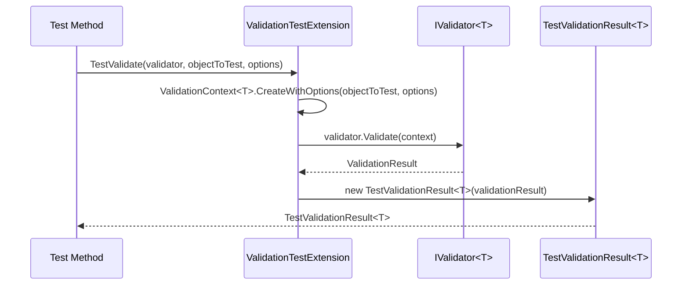
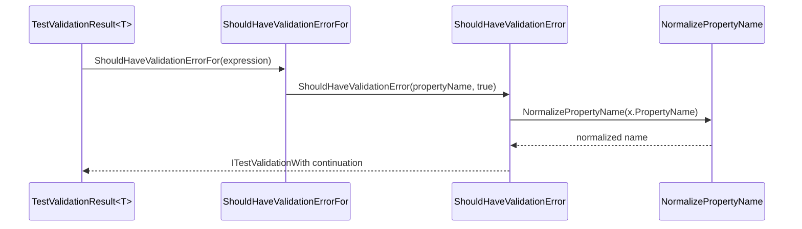
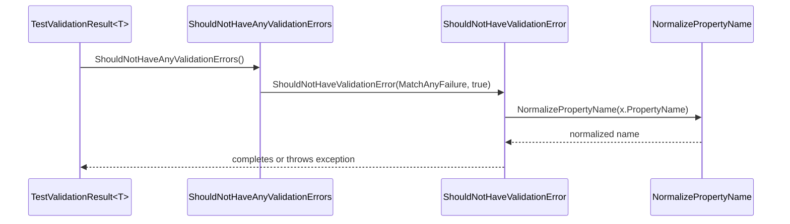
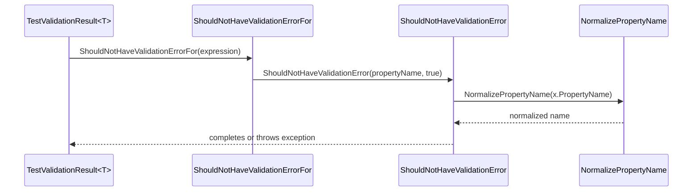

# Testing Infrastructure

<details>
<summary>Relevant source files</summary>

The following files were used as context for generating this wiki page:

- [src/FluentValidation/TestHelper/ValidatorTestExtensions.cs](https://github.com/FluentValidation/FluentValidation/blob/main/src/FluentValidation/TestHelper/ValidatorTestExtensions.cs)
- [src/FluentValidation.Tests/ValidatorTesterTester.cs](https://github.com/FluentValidation/FluentValidation/blob/main/src/FluentValidation.Tests/ValidatorTesterTester.cs)
- [docs/testing.md](https://github.com/FluentValidation/FluentValidation/blob/main/docs/testing.md)
- [src/FluentValidation.Tests/DefaultValidatorExtensionTester.cs](https://github.com/FluentValidation/FluentValidation/blob/main/src/FluentValidation.Tests/DefaultValidatorExtensionTester.cs)
- [src/FluentValidation/TestHelper/TestValidationResult.cs](https://github.com/FluentValidation/FluentValidation/blob/main/src/FluentValidation/TestHelper/TestValidationResult.cs)
- [src/FluentValidation.Tests/AbstractValidatorTester.cs](https://github.com/FluentValidation/FluentValidation/blob/main/src/FluentValidation.Tests/AbstractValidatorTester.cs)
- [src/FluentValidation.Tests/TestExtensions.cs](https://github.com/FluentValidation/FluentValidation/blob/main/src/FluentValidation.Tests/TestExtensions.cs)
- [src/FluentValidation/TestHelper/ValidationTestException.cs](https://github.com/FluentValidation/FluentValidation/blob/main/src/FluentValidation/TestHelper/ValidationTestException.cs)
- [src/FluentValidation.Tests/ValidateAndThrowTester.cs](https://github.com/FluentValidation/FluentValidation/blob/main/src/FluentValidation.Tests/ValidateAndThrowTester.cs)
- [src/FluentValidation/TestHelper/ITestValidationContinuation.cs](https://github.com/FluentValidation/FluentValidation/blob/main/src/FluentValidation/TestHelper/ITestValidationContinuation.cs)
- [src/FluentValidation.Tests/InlineValidatorTester.cs](https://github.com/FluentValidation/FluentValidation/blob/main/src/FluentValidation.Tests/InlineValidatorTester.cs)
</details>

## Overview

FluentValidation provides a specialized testing infrastructure designed to verify validator behavior reliably without requiring complex mocking frameworks or exposing internal implementation details. By treating validators as black boxes that accept test input and return validation outcomes, developers can write robust, upgrade-safe unit and integration tests for both synchronous and asynchronous rules. Sources: [docs/testing.md:3-114](https://github.com/FluentValidation/FluentValidation/blob/main/docs/testing.md#L3-L114)

The testing infrastructure solves the common brittleness associated with mocking validators by offering purpose-built assertion extensions, fluent continuation APIs, and stub implementations such as `InlineValidator<T>`. This design empowers developers to inspect property errors, validate error metadata like codes and severities, and handle test failures through detailed exception reporting seamlessly. Sources: [docs/testing.md:77-114](https://github.com/FluentValidation/FluentValidation/blob/main/docs/testing.md#L77-L114)

## Test Extension Methods and Invocation

### Overview

The `ValidationTestExtension` static class provides extension methods for executing validators during unit tests both synchronously and asynchronously. These methods wrap standard execution paths to return a `TestValidationResult<T>`, enabling fluent assertions against validation outcomes while preserving correct error handling and synchronous/asynchronous separation. Sources: [src/FluentValidation/TestHelper/ValidatorTestExtensions.cs:34-120](https://github.com/FluentValidation/TestHelper/ValidatorTestExtensions.cs#L34-L120)

### Synchronous Invocation and Guard Execution

Synchronous test execution is performed using `TestValidate`. The extension method accepts either an instance to test with an optional strategy configuration action or a pre-constructed `ValidationContext<T>`. When options are provided, `ValidationContext<T>.CreateWithOptions` builds the execution context. Sources: [src/FluentValidation/TestHelper/ValidatorTestExtensions.cs:86-94](https://github.com/FluentValidation/TestHelper/ValidatorTestExtensions.cs#L86-L94)

The execution flow within `TestValidate(this IValidator<T> validator, ValidationContext<T> context)` proceeds through the following call chain:
`TestValidate()` → `validator.Validate(context)` → `new TestValidationResult<T>(validationResult)` Sources: [src/FluentValidation/TestHelper/ValidatorTestExtensions.cs:94-104](https://github.com/FluentValidation/TestHelper/ValidatorTestExtensions.cs#L94-L104)


Sources: [src/FluentValidation/TestHelper/ValidatorTestExtensions.cs:86-104](https://github.com/FluentValidation/TestHelper/ValidatorTestExtensions.cs#L86-L104)

> [!WARNING]
> If a synchronous `TestValidate` call encounters a validator containing asynchronous rules, `validator.Validate(context)` throws an `AsyncValidatorInvokedSynchronouslyException`. The test extension catches this exception and rethrows a formatted `AsyncValidatorInvokedSynchronouslyException` stating that the validator contains asynchronous rules and advising the use of asynchronous test methods. Sources: [src/FluentValidation/TestHelper/ValidatorTestExtensions.cs:96-101](https://github.com/FluentValidation/TestHelper/ValidatorTestExtensions.cs#L96-L101)

### Asynchronous Test Execution

Asynchronous validation in test scenarios is handled by `TestValidateAsync`. Like its synchronous counterpart, it offers overloads taking an object instance with options or a direct `ValidationContext<T>`, alongside an optional `CancellationToken`. Sources: [src/FluentValidation/TestHelper/ValidatorTestExtensions.cs:109-117](https://github.com/FluentValidation/TestHelper/ValidatorTestExtensions.cs#L109-L117)

The asynchronous execution call chain proceeds as follows:
`TestValidateAsync()` → `await validator.ValidateAsync(context, cancellationToken)` → `new TestValidationResult<T>(validationResult)` Sources: [src/FluentValidation/TestHelper/ValidatorTestExtensions.cs:109-120](https://github.com/FluentValidation/TestHelper/ValidatorTestExtensions.cs#L109-L120)

```csharp
[Test]
public async Task Should_have_error_asynchronously()
{
    var model = new Person { Name = null };
    var result = await validator.TestValidateAsync(model, options => options.IncludeRuleSets("Default"));
    result.ShouldHaveValidationErrorFor(person => person.Name);
}
```
Sources: [docs/testing.md:104-107](https://github.com/FluentValidation/Testing.md#L104-L107), [src/FluentValidation/TestHelper/ValidatorTestExtensions.cs:109-120](https://github.com/FluentValidation/TestHelper/ValidatorTestExtensions.cs#L109-L120)

## Validation Result Assertion Extensions

### Overview

The `TestValidationResult<T>` class extends `ValidationResult` to supply assertion methods verifying specific properties or general validation outcomes. When developers invoke assertion methods like `ShouldHaveValidationErrorFor`, `ShouldNotHaveValidationErrorFor`, or `ShouldNotHaveAnyValidationErrors`, the test result processes error collections and normalizes property names before matching against expected criteria. Sources: [src/FluentValidation/TestHelper/TestValidationResult.cs:30-48](https://github.com/FluentValidation/TestHelper/TestValidationResult.cs#L30-L48)

### Call-Chain Execution Walkthroughs

#### Positive Validation Error Assertion Chain

When verifying that a validation error exists for a specific property expression, the call sequence executes through member resolution and normalization checks.

1. `ShouldHaveValidationErrorFor` (expression overload) — Resolves the property name from the member expression using `ValidatorOptions.Global.PropertyNameResolver`, then invokes `ShouldHaveValidationError(propertyName, true)`. Sources: [src/FluentValidation/TestHelper/TestValidationResult.cs:36-39](https://github.com/FluentValidation/TestHelper/TestValidationResult.cs#L36-L39)
2. `ShouldHaveValidationError` — Filters or evaluates the error collection using a predicate that applies `NormalizePropertyName` when the boolean flag is true. Sources: [src/FluentValidation/TestHelper/TestValidationResult.cs:65-69](https://github.com/FluentValidation/TestHelper/TestValidationResult.cs#L65-L69)
3. `NormalizePropertyName` — Strips collection indexer brackets using a regular expression `Regex.Replace(propertyName, @"\[.*\]", string.Empty)`. Sources: [src/FluentValidation/TestHelper/TestValidationResult.cs:114-116](https://github.com/FluentValidation/TestHelper/TestValidationResult.cs#L114-L116)


Sources: [src/FluentValidation/TestHelper/TestValidationResult.cs:36-39](https://github.com/FluentValidation/TestHelper/TestValidationResult.cs#L36-L39), [src/FluentValidation/TestHelper/TestValidationResult.cs:65-69](https://github.com/FluentValidation/TestHelper/TestValidationResult.cs#L65-L69), [src/FluentValidation/TestHelper/TestValidationResult.cs:114-116](https://github.com/FluentValidation/TestHelper/TestValidationResult.cs#L114-L116)

#### Negative Validation Error Assertion Chain

When asserting that a property has no validation errors, the execution flows through specific negative validation paths.

1. `ShouldNotHaveAnyValidationErrors` — Invokes `ShouldNotHaveValidationError` passing `ValidationTestExtension.MatchAnyFailure` and a normalization flag of `true`. Sources: [src/FluentValidation/TestHelper/TestValidationResult.cs:46-48](https://github.com/FluentValidation/TestHelper/TestValidationResult.cs#L46-L48)
2. `ShouldNotHaveValidationError` — Queries the error collection for matching failures, comparing normalized property names. Sources: [src/FluentValidation/TestHelper/TestValidationResult.cs:94-98](https://github.com/FluentValidation/TestHelper/TestValidationResult.cs#L94-L98)
3. `NormalizePropertyName` — Executes regex replacement on `x.PropertyName` to remove collection index notation prior to string matching. Sources: [src/FluentValidation/TestHelper/TestValidationResult.cs:114-116](https://github.com/FluentValidation/TestHelper/TestValidationResult.cs#L114-L116)


Sources: [src/FluentValidation/TestHelper/TestValidationResult.cs:46-48](https://github.com/FluentValidation/TestHelper/TestValidationResult.cs#L46-L48), [src/FluentValidation/TestHelper/TestValidationResult.cs:94-98](https://github.com/FluentValidation/TestHelper/TestValidationResult.cs#L94-L98), [src/FluentValidation/TestHelper/TestValidationResult.cs:114-116](https://github.com/FluentValidation/TestHelper/TestValidationResult.cs#L114-L116)

#### Property Specific Negative Validation Error Assertion Chain

1. `ShouldNotHaveValidationErrorFor` (expression overload) — Resolves property name via `PropertyNameResolver` and passes it to `ShouldNotHaveValidationError(propertyName, true)`. Sources: [src/FluentValidation/TestHelper/TestValidationResult.cs:41-44](https://github.com/FluentValidation/TestHelper/TestValidationResult.cs#L41-L44)
2. `ShouldNotHaveValidationError` — Filters failures using the normalization check. Sources: [src/FluentValidation/TestHelper/TestValidationResult.cs:94-98](https://github.com/FluentValidation/TestHelper/TestValidationResult.cs#L94-L98)
3. `NormalizePropertyName` — Cleans up indexers on `x.PropertyName`. Sources: [src/FluentValidation/TestHelper/TestValidationResult.cs:114-116](https://github.com/FluentValidation/TestHelper/TestValidationResult.cs#L114-L116)


Sources: [src/FluentValidation/TestHelper/TestValidationResult.cs:41-44](https://github.com/FluentValidation/TestHelper/TestValidationResult.cs#L41-L44), [src/FluentValidation/TestHelper/TestValidationResult.cs:94-98](https://github.com/FluentValidation/TestHelper/TestValidationResult.cs#L94-L98), [src/FluentValidation/TestHelper/TestValidationResult.cs:114-116](https://github.com/FluentValidation/TestHelper/TestValidationResult.cs#L114-L116)

> [!NOTE]
> `NormalizePropertyName` strips collection indexers using `Regex.Replace(propertyName, @"\[.*\]", string.Empty)`. This allows assertions on collection properties like `NickNames` to match individual error entries whose property paths include array indices such as `NickNames[0]`. Sources: [src/FluentValidation/TestHelper/TestValidationResult.cs:114-116](https://github.com/FluentValidation/TestHelper/TestValidationResult.cs#L114-L116)

### Assertion Methods Reference Table

| Method Signature | Parameter Type | Normalizes Property Name | Purpose |
| :--- | :--- | :--- | :--- |
| `ShouldHaveValidationErrorFor<TProperty>` | `Expression<Func<T, TProperty>>` | Yes | Asserts that a validation error occurred for the member accessed by the expression. |
| `ShouldNotHaveValidationErrorFor<TProperty>` | `Expression<Func<T, TProperty>>` | Yes | Asserts that no validation error occurred for the member accessed by the expression. |
| `ShouldNotHaveAnyValidationErrors` | None | Yes (via `MatchAnyFailure`) | Asserts that the validation result contains zero errors across all properties. |
| `ShouldHaveValidationErrors` | None | N/A | Asserts that at least one validation error exists and returns a continuation helper. |
| `ShouldHaveValidationErrorFor` | `string propertyName` | No | Asserts that an error exists for the explicitly provided property name string. |
| `ShouldNotHaveValidationErrorFor` | `string propertyName` | No | Asserts that no error exists for the explicitly provided property name string. |

Sources: [src/FluentValidation/TestHelper/TestValidationResult.cs:36-63](https://github.com/FluentValidation/TestHelper/TestValidationResult.cs#L36-L63)

### Design Trade-Offs in Result Assertion Helpers

| Design Choice | Benefit | Cost |
| :--- | :--- | :--- |
| Expression-based and string-based overloads | Supports compile-time safe member access alongside raw string property targeting. | Increases surface area and code duplication between expression and string handling methods. |
| Automatic indexer regex stripping (`\[.*\]`) | Simplifies collection testing by letting collection-level property expressions match indexed error items. | Hides distinct collection item paths unless explicitly using string identifiers or continuation filters. |
| Eager exception throwing with detailed error banners | Accelerates test failure diagnosis by dumping all recorded validation properties into exception messages. | Allocates formatted string builders and arrays on every assertion failure path. |

Sources: [src/FluentValidation/TestHelper/TestValidationResult.cs:36-116](https://github.com/FluentValidation/TestHelper/TestValidationResult.cs#L36-L116)

## Assertion Chaining and Continuations

### Overview

FluentValidation provides fluent assertion chaining through continuation interfaces and extension methods that operate on `ITestValidationContinuation`. When an assertion such as `ShouldHaveValidationErrorFor` matches a property, it yields a continuation object exposing `MatchedFailures` and `UnmatchedFailures`. Test authors can chain refining assertions like `WithErrorCode`, `WithErrorMessage`, `WithSeverity`, `WithCustomState`, and `WithMessageArgument` to verify specific characteristics of individual validation failures. Conversely, negative counterparts such as `WithoutErrorCode`, `WithoutErrorMessage`, `WithoutSeverity`, and `WithoutCustomState` apply predicates via `WhenAll` to ensure unwanted attributes are absent.

Sources: [src/FluentValidation/TestHelper/ValidatorTestExtensions.cs:141-205](https://github.com/FluentValidation/TestHelper/ValidatorTestExtensions.cs#L141-L205), [src/FluentValidation/TestHelper/ITestValidationContinuation.cs:12-15](https://github.com/FluentValidation/TestHelper/ITestValidationContinuation.cs#L12-L15)

### Continuation Call-Chain Execution Walkthrough

When a test author chains conditional filters onto a validation assertion, execution flows through specific internal methods. Taking the call chain `ShouldHaveValidationErrorFor(x => x.Surname).WithErrorCode("NotEmptyValidator")`, the execution proceeds as follows:

1. `ShouldHaveValidationErrorFor` evaluates the expression, resolves the property name, and constructs an initial `TestValidationContinuation` instance containing the error list. Sources: [src/FluentValidation/TestHelper/TestValidationResult.cs:36-39](https://github.com/FluentValidation/TestHelper/TestValidationResult.cs#L36-L39), [src/FluentValidation/TestHelper/TestValidationResult.cs:65-66](https://github.com/FluentValidation/TestHelper/TestValidationResult.cs#L65-L66)
2. The returned `ITestValidationWith` (implemented by `TestValidationContinuation`) receives the `.WithErrorCode("NotEmptyValidator")` extension call. Sources: [src/FluentValidation/TestHelper/ValidatorTestExtensions.cs:187-189](https://github.com/FluentValidation/TestHelper/ValidatorTestExtensions.cs#L187-L189), [src/FluentValidation/TestHelper/ITestValidationContinuation.cs:17](https://github.com/FluentValidation/TestHelper/ITestValidationContinuation.cs#L17)
3. `WithErrorCode` delegates to `When`, which instantiates a new child `TestValidationContinuation` linked to its parent, calls `result.ApplyPredicate(failurePredicate)` to append the error code filter to `_predicates`, and evaluates `result.Any()`. Sources: [src/FluentValidation/TestHelper/ValidatorTestExtensions.cs:141-145](https://github.com/FluentValidation/TestHelper/ValidatorTestExtensions.cs#L141-L145), [src/FluentValidation/TestHelper/ITestValidationContinuation.cs:23-31](https://github.com/FluentValidation/TestHelper/ITestValidationContinuation.cs#L23-L31)
4. If `result.Any()` returns false, `UnmatchedFailures.FirstOrDefault()` retrieves the first failing validation item, and `BuildErrorMessage` formats the exception template with placeholder replacements before throwing a `ValidationTestException`. Sources: [src/FluentValidation/TestHelper/ValidatorTestExtensions.cs:122-150](https://github.com/FluentValidation/TestHelper/ValidatorTestExtensions.cs#L122-L150)
5. If matching succeeds, the continuation is returned to allow further chaining. Sources: [src/FluentValidation/TestHelper/ValidatorTestExtensions.cs:152](https://github.com/FluentValidation/TestHelper/ValidatorTestExtensions.cs#L152)

> [!NOTE]
> The `Only()` extension method crawls up the continuation `.Parent` references recursively via a `do-while` loop to aggregate all unmatched failures across parent and child scopes, ensuring that no unexpected validation errors escaped validation filtering. Sources: [src/FluentValidation/TestHelper/ValidatorTestExtensions.cs:207-218](https://github.com/FluentValidation/TestHelper/ValidatorTestExtensions.cs#L207-L218)

### Continuation Methods Reference Table

| Extension Method | Underlying Condition | Failure Handling Method | Purpose |
| :--- | :--- | :--- | :--- |
| `When` | `failurePredicate` | `ValidationTestException` via `BuildErrorMessage` | Asserts that at least one failure matches the predicate. |
| `WhenAll` | `failurePredicate` | `ValidationTestException` via `BuildErrorMessage` | Asserts that all failures match the predicate. |
| `WithSeverity` | `failure.Severity == expectedSeverity` | `When` | Asserts that the matched error has the specified severity level. |
| `WithCustomState` | `comparer?.Equals(...) ?? Equals(...)` | `When` | Asserts that the matched error carries expected custom state. |
| `WithMessageArgument` | `FormattedMessagePlaceholderValues` check | `When` | Asserts that message placeholder values contain the given argument. |
| `WithErrorMessage` | `failure.ErrorMessage == expectedErrorMessage` | `When` | Asserts an exact match on the rendered error message. |
| `WithErrorCode` | `failure.ErrorCode == expectedErrorCode` | `When` | Asserts an exact match on the validation error code. |
| `WithoutSeverity` | `failure.Severity != unexpectedSeverity` | `WhenAll` | Asserts that no error possesses the forbidden severity. |
| `WithoutCustomState` | `failure.CustomState != unexpectedCustomState` | `WhenAll` | Asserts that no error possesses the forbidden custom state. |
| `WithoutErrorMessage` | `failure.ErrorMessage != unexpectedErrorMessage` | `WhenAll` | Asserts that no error carries the forbidden message string. |
| `WithoutErrorCode` | `failure.ErrorCode != unexpectedErrorCode` | `WhenAll` | Asserts that no error carries the forbidden error code. |
| `Only` | Unmatched failure collection check | `ValidationTestException` with banner | Asserts that *only* the filtered errors exist, failing if unmatched errors remain. |

Sources: [src/FluentValidation/TestHelper/ValidatorTestExtensions.cs:141-232](https://github.com/FluentValidation/TestHelper/ValidatorTestExtensions.cs#L141-L232)

### Full Worked Example of Continuation Chaining

The following example demonstrates how to exercise validation result continuations and chaining methods in a test method:

```csharp
var validator = new PersonValidator();
var person = new Person { Surname = "" };

var result = validator.TestValidate(person);

result.ShouldHaveValidationErrorFor(x => x.Surname)
    .WithErrorCode("NotEmptyValidator")
    .WithMessageErrorMessage("'Surname' must not be empty.")
    .WithSeverity(Severity.Error);
```
Sources: [src/FluentValidation/TestHelper/ValidatorTestExtensions.cs:86](https://github.com/FluentValidation/TestHelper/ValidatorTestExtensions.cs#L86), [src/FluentValidation/TestHelper/ValidatorTestExtensions.cs:170-189](https://github.com/FluentValidation/TestHelper/ValidatorTestExtensions.cs#L170-L189), [src/FluentValidation/TestHelper/TestValidationResult.cs:36](https://github.com/FluentValidation/TestHelper/TestValidationResult.cs#L36)

## Test Failure Reporting and Exceptions

### Overview

When assertion methods fail during unit testing, FluentValidation reports failures through a dedicated exception infrastructure centred around `ValidationTestException`. This exception type extends the base .NET `Exception` class and exposes a public `Errors` collection property holding any associated `ValidationFailure` instances. 

Sources: [src/FluentValidation/TestHelper/ValidationTestException.cs:26-34](https://github.com/FluentValidation/TestHelper/ValidationTestException.cs#L26-L34)

### Error Message Construction and Placeholder Replacement

The `BuildErrorMessage` internal helper processes custom exception messages by replacing standard tokens with failure property values. Supported template replacements include `{Code}` for the error code, `{Message}` for the validation message, `{State}` for custom state, and `{Severity}` for the failure severity level. Additionally, `{MessageArgument:...}` tokens are dynamically replaced using entries retrieved from the failure's `FormattedMessagePlaceholderValues` dictionary.

```csharp
private static string BuildErrorMessage(ValidationFailure failure, string exceptionMessage, string defaultMessage) {
    if (exceptionMessage != null && failure != null) {
        var formattedExceptionMessage = exceptionMessage.Replace("{Code}", failure.ErrorCode)
            .Replace("{Message}", failure.ErrorMessage)
            .Replace("{State}", failure.CustomState?.ToString() ?? "")
            .Replace("{Severity}", failure.Severity.ToString());

        var messageArgumentMatches = Regex.Matches(formattedExceptionMessage, "{MessageArgument:(.*)}");
        for (var i = 0; i < messageArgumentMatches.Count; i++) {
            if (failure.FormattedMessagePlaceholderValues.ContainsKey(messageArgumentMatches[i].Groups[1].Value)) {
                formattedExceptionMessage = formattedExceptionMessage.Replace(messageArgumentMatches[i].Value, failure.FormattedMessagePlaceholderValues[messageArgumentMatches[i].Groups[1].Value].ToString());
            }
        }
        return formattedExceptionMessage;
    }
    return defaultMessage;
}
```

Sources: [src/FluentValidation/TestHelper/ValidatorTestExtensions.cs:122-138](https://github.com/FluentValidation/TestHelper/ValidatorTestExtensions.cs#L122-L138)

### Exception Types Reference Table

| Exception Type | Base Class | Public Properties | Purpose |
| :--- | :--- | :--- | :--- |
| `ValidationTestException` | `Exception` | `List<ValidationFailure> Errors` | Thrown when a test assertion fails, carrying diagnostic banners, failure listings, and optional error details. |

Sources: [src/FluentValidation/TestHelper/ValidationTestException.cs:26-34](https://github.com/FluentValidation/TestHelper/ValidationTestException.cs#L26-L34)

## Validator Testing Patterns and Suites

### Validator Testing Patterns and Suites

### Overview

FluentValidation provides robust integration testing support for multiple validator styles, including traditional abstract validators, inline collection definitions, and imperative exception-throwing routines. Test fixtures verify that individual rules trigger correctly across varied object graphs, collection properties, and asynchronous execution pipelines without requiring boilerplate setup logic.

Sources: [src/FluentValidation.Tests/ValidatorTesterTester.cs:30-39](https://github.com/FluentValidation.Tests/ValidatorTesterTester.cs#L30-L39), [src/FluentValidation.Tests/InlineValidatorTester.cs:7-14](https://github.com/FluentValidation.Tests/InlineValidatorTester.cs#L7-L14)

### Abstract and Inline Validator Suites

Abstract validators derived from `AbstractValidator<T>` organize validation logic within constructor blocks using fluent rule builders. Alternatively, `InlineValidator<T>` instances allow validators to be declared inline as static fields or local variables on model classes. Both architectural patterns integrate seamlessly with `TestValidate` extensions, verifying property-level rules, nested objects, and collection rule semantics.

```csharp
public class Customer {
    public int Id { get; set; }
    public string Name { get; set; }

    public ValidationResult Validate() {
        return Validator.Validate(this);
    }

    public static readonly InlineValidator<Customer> Validator = new InlineValidator<Customer>() {
        v => v.RuleFor(x => x.Name).NotNull(),
        v => v.RuleFor(x => x.Id).NotEqual(0)
    };
}
```

Sources: [src/FluentValidation.Tests/InlineValidatorTester.cs:16-28](https://github.com/FluentValidation.Tests/InlineValidatorTester.cs#L16-L28), [src/FluentValidation.Tests/AbstractValidatorTester.cs:29-37](https://github.com/FluentValidation.Tests/AbstractValidatorTester.cs#L29-L37)

### Throwing Validators and Exception Handling

Validators can enforce fail-fast error handling using `ValidateAndThrow` and `ValidateAndThrowAsync`. When validation failures occur, these methods raise a `ValidationException` containing the collected failure instances. Root validators aggregate both local rules and descendant child validator failures, ensuring that only the root invocation triggers the exception.

```csharp
[Fact]
public void Only_root_validator_throws() {
    var validator = new InlineValidator<Person>();
    var addressValidator = new InlineValidator<Address>();
    validator.RuleFor(x => x.Address).SetValidator(addressValidator);
    validator.RuleFor(x => x.Forename).NotNull();
    addressValidator.RuleFor(x => x.Line1).NotNull();

    try {
        validator.ValidateAndThrow(new Person() {Address = new Address()});
    }
    catch (ValidationException e) {
        e.Errors.Count().ShouldEqual(2);
    }
}
```

Sources: [src/FluentValidation.Tests/ValidateAndThrowTester.cs:11-23](https://github.com/FluentValidation.Tests/ValidateAndThrowTester.cs#L11-L23), [src/FluentValidation.Tests/ValidateAndThrowTester.cs:165-186](https://github.com/FluentValidation.Tests/ValidateAndThrowTester.cs#L165-L186)

## Related

- [[Validation Core]]
- [[Validator Definition]]

