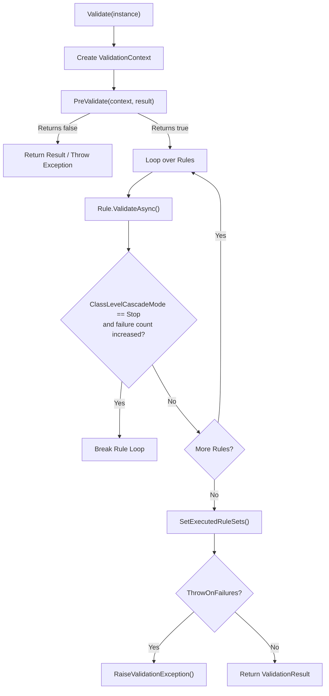
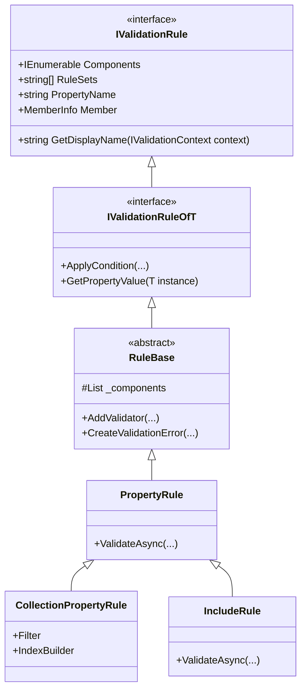
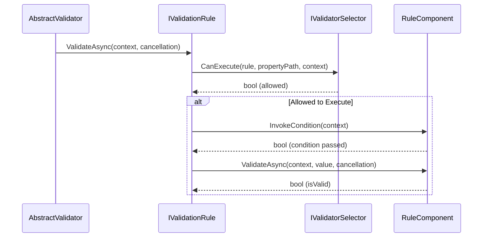

# Validation Core

<details>
<summary>Relevant source files</summary>

The following files were used as context for generating this wiki page:

- [src/FluentValidation/Internal/RuleBase.cs](https://github.com/FluentValidation/FluentValidation/blob/main/src/FluentValidation/Internal/RuleBase.cs)
- [src/FluentValidation/Internal/PropertyRule.cs](https://github.com/FluentValidation/FluentValidation/blob/main/src/FluentValidation/Internal/PropertyRule.cs)
- [src/FluentValidation/Internal/CollectionPropertyRule.cs](https://github.com/FluentValidation/FluentValidation/blob/main/src/FluentValidation/Internal/CollectionPropertyRule.cs)
- [src/FluentValidation/Internal/MemberNameValidatorSelector.cs](https://github.com/FluentValidation/FluentValidation/blob/main/src/FluentValidation/Internal/MemberNameValidatorSelector.cs)
- [src/FluentValidation/IValidationRule.cs](https://github.com/FluentValidation/FluentValidation/blob/main/src/FluentValidation/IValidationRule.cs)
- [src/FluentValidation/ValidatorDescriptor.cs](https://github.com/FluentValidation/ValidatorDescriptor.cs)
- [src/FluentValidation/Internal/RuleComponent.cs](https://github.com/FluentValidation/FluentValidation/blob/main/src/FluentValidation/Internal/RuleComponent.cs)
- [src/FluentValidation/AbstractValidator.cs](https://github.com/FluentValidation/AbstractValidator.cs)
- [src/FluentValidation/Internal/RuleBuilder.cs](https://github.com/FluentValidation/FluentValidation/blob/main/src/FluentValidation/Internal/RuleBuilder.cs)
- [src/FluentValidation/Internal/IRuleComponent.cs](https://github.com/FluentValidation/FluentValidation/blob/main/src/FluentValidation/Internal/IRuleComponent.cs)
- [src/FluentValidation/Syntax.cs](https://github.com/FluentValidation/Syntax.cs)
- [src/FluentValidation/Internal/ValidationStrategy.cs](https://github.com/FluentValidation/Internal/ValidationStrategy.cs)
- [src/FluentValidation/Internal/IncludeRule.cs](https://github.com/FluentValidation/Internal/IncludeRule.cs)
- [src/FluentValidation/IValidationRuleInternal.cs](https://github.com/FluentValidation/IValidationRuleInternal.cs)
- [src/FluentValidation/IValidatorDescriptor.cs](https://github.com/FluentValidation/IValidatorDescriptor.cs)
- [src/FluentValidation/Internal/ChildRulesContainer.cs](https://github.com/FluentValidation/Internal/ChildRulesContainer.cs)
- [src/FluentValidation/ICollectionRule.cs](https://github.com/FluentValidation/ICollectionRule.cs)
- [src/FluentValidation/Internal/ExtensionsInternal.cs](https://github.com/FluentValidation/Internal/ExtensionsInternal.cs)
- [src/FluentValidation/Internal/CompositeValidatorSelector.cs](https://github.com/FluentValidation/Internal/CompositeValidatorSelector.cs)
- [src/FluentValidation/Internal/DefaultValidatorSelector.cs](https://github.com/FluentValidation/Internal/DefaultValidatorSelector.cs)
- [src/FluentValidation/IValidationContext.cs](https://github.com/FluentValidation/FluentValidation/blob/main/src/FluentValidation/IValidationContext.cs)
- [src/FluentValidation/Results/ValidationFailure.cs](https://github.com/FluentValidation/Results/ValidationFailure.cs)
- [src/FluentValidation/Results/ValidationResult.cs](https://github.com/FluentValidation/Results/ValidationResult.cs)
- [src/FluentValidation/ValidationException.cs](https://github.com/FluentValidation/ValidationException.cs)
- [src/FluentValidation/DefaultValidatorExtensions_Validate.cs](https://github.com/FluentValidation/DefaultValidatorExtensions_Validate.cs)
- [src/FluentValidation/TestHelper/ValidatorTestExtensions.cs](https://github.com/FluentValidation/TestHelper/ValidatorTestExtensions.cs)
</details>

## Overview

Validation Core forms the underlying execution backbone and infrastructural framework of FluentValidation. It manages how validation definitions are stored, evaluated, filtered, and converted into concrete results or thrown exceptions. Rather than dealing purely with individual property checks, Validation Core orchestrates execution flow across object graphs, coordinates validation selectors, handles conditional rule evaluation, structures error accumulation, and provides metadata descriptors for introspection.
Sources: [src/FluentValidation/AbstractValidator.cs:36-39](https://github.com/FluentValidation/FluentValidation/blob/main/src/AbstractValidator.cs#L36-L39)

At its architectural center, the framework treats validation as a pipeline of rules (`IValidationRule`) attached to a parent validator (`AbstractValidator<T>`). Each rule encapsulates one or more execution components (`RuleComponent<T, TProperty>`), housing validators, conditions, message builders, severity rules, and custom state providers.
Sources: [src/FluentValidation/Internal/RuleBase.cs:31-43](https://github.com/FluentValidation/FluentValidation/blob/main/src/Internal/RuleBase.cs#L31-L43)

The engine coordinates execution via `ValidationContext<T>` tracking instances, property paths, message formatters, and cascading behavior (`CascadeMode`), bridging user-facing fluent syntax with robust, high-performance execution mechanics.
Sources: [src/FluentValidation/IValidationContext.cs:82-92](https://github.com/FluentValidation/IValidationContext.cs#L82-L92)

---

## Validation Engine

The Validation Engine governs how an instance of type `T` is inspected against a collection of rules. It is anchored by `AbstractValidator<T>` which maintains a tracking collection of internal rules (`Rules`) and handles both synchronous and asynchronous validation entry points.
Sources: [src/FluentValidation/AbstractValidator.cs:36-37](https://github.com/FluentValidation/AbstractValidator.cs#L36-L37)


Sources: [src/FluentValidation/AbstractValidator.cs:134-180](https://github.com/FluentValidation/AbstractValidator.cs#L134-L180)

The execution loop uses a performance-optimized `for` loop over `Rules` instead of a standard `foreach` to minimize enumerator allocations. Before evaluating rules, `PreValidate` allows subclasses to short-circuit validation. If `ClassLevelCascadeMode` is set to `CascadeMode.Stop`, the engine halts rule evaluation immediately upon detecting a new failure in `context.Failures`.
Sources: [src/FluentValidation/AbstractValidator.cs:157-170](https://github.com/FluentValidation/AbstractValidator.cs#L157-L170)

```csharp
var validator = new PersonValidator();
ValidationResult result = validator.Validate(person, options => {
    options.IncludeProperties(p => p.Surname);
    options.ThrowOnFailures();
});
```
Sources: [src/FluentValidation/DefaultValidatorExtensions_Validate.cs:37-62](https://github.com/FluentValidation/DefaultValidatorExtensions_Validate.cs#L37-L62)

To trace the call chain `TestValidate` → `CreateWithOptions` → `BuildContext` → `GetSelector`: When a test helper or extension executes `TestValidate` (or `Validate` with options), it invokes `ValidationContext<T>.CreateWithOptions` (found in [src/FluentValidation/IValidationContext.cs:123-128](https://github.com/FluentValidation/IValidationContext.cs#L123-L128)) which instantiates a `ValidationStrategy<T>` and passes it to the options callback. That strategy internally calls `BuildContext(instanceToValidate)` (found in [src/FluentValidation/Internal/ValidationStrategy.cs:152-156](https://github.com/FluentValidation/Internal/ValidationStrategy.cs#L152-L156)), which in turn invokes `GetSelector()` (found in [src/FluentValidation/Internal/ValidationStrategy.cs:125-150](https://github.com/FluentValidation/Internal/ValidationStrategy.cs#L125-L150)) to assemble the appropriate member, ruleset, or custom validator selectors into a cohesive execution strategy.
Sources: [src/FluentValidation/TestHelper/ValidatorTestExtensions.cs:86-89](https://github.com/FluentValidation/TestHelper/ValidatorTestExtensions.cs#L86-L89), [src/FluentValidation/IValidationContext.cs:123-128](https://github.com/FluentValidation/IValidationContext.cs#L123-L128), [src/FluentValidation/Internal/ValidationStrategy.cs:125-156](https://github.com/FluentValidation/Internal/ValidationStrategy.cs#L125-L156)

---

## Validation Results

Validation results encapsulate the outcome of an execution run. The primary output container is `ValidationResult`, which aggregates a list of `ValidationFailure` objects, tracks executed rule sets, and provides utility methods for querying failures.
Sources: [src/FluentValidation/Results/ValidationResult.cs:29-55](https://github.com/FluentValidation/Results/ValidationResult.cs#L29-L55)

| Property / Method | Return Type | Purpose / Behavior |
| :--- | :--- | :--- |
| `IsValid` | `bool` | Returns `true` if `Errors.Count == 0`. |
| `Errors` | `List<ValidationFailure>` | Collection of validation failure objects, filtering out any `null` entries on assignment. |
| `RuleSetsExecuted` | `string[]` | Array of ruleset names executed during the validation run. |
| `ToString(string)` | `string` | Joins error messages separated by the specified delimiter. |
| `ToDictionary()` | `IDictionary<string, string[]>` | Groups failures by `PropertyName`, mapping each property to an array of error messages. |
Sources: [src/FluentValidation/Results/ValidationResult.cs:33-118](https://github.com/FluentValidation/Results/ValidationResult.cs#L33-L118)

When `ThrowOnFailures` is enabled on the validation context or strategy, a failed validation run throws a `ValidationException`. The exception formats error details incorporating property names, error messages, severities, and error codes.
Sources: [src/FluentValidation/ValidationException.cs:60-76](https://github.com/FluentValidation/ValidationException.cs#L60-L76)

```csharp
public ValidationException(IEnumerable<ValidationFailure> errors) : base(BuildErrorMessage(errors)) {
    Errors = errors;
}
```
Sources: [src/FluentValidation/ValidationException.cs:69-71](https://github.com/FluentValidation/ValidationException.cs#L69-L71)

> [!NOTE]
> `ValidationException` overrides `GetObjectData` to support binary serialization on supported target frameworks, explicitly serializing the `errors` collection.
Sources: [src/FluentValidation/ValidationException.cs:88-93](https://github.com/FluentValidation/ValidationException.cs#L88-L93)

---

## Validation Rules

Validation rules represent individual declarative validation checks against a property or collection. The rule architecture is split between abstract base classes and concrete rule types.
Sources: [src/FluentValidation/IValidationRule.cs:119-122](https://github.com/FluentValidation/IValidationRule.cs#L119-L122)

- **`RuleBase<T, TProperty, TValue>`**: Abstract base class implementing `IValidationRule<T, TValue>`. Manages rule components, display names, property member info, conditions (`Condition`, `AsyncCondition`), message builders, and failure creation logic.
Sources: [src/FluentValidation/Internal/RuleBase.cs:31-43](https://github.com/FluentValidation/Internal/RuleBase.cs#L31-L43)
- **`PropertyRule<T, TProperty>`**: Represents standard property validation rules. Compiles and executes accessors, evaluates rule-level cascade modes (`CascadeMode.Stop` vs `CascadeMode.Continue`), and executes downstream dependent rules (`DependentRules`).
Sources: [src/FluentValidation/Internal/PropertyRule.cs:31-31](https://github.com/FluentValidation/Internal/PropertyRule.cs#L31-L31)
- **`CollectionPropertyRule<T, TElement>`**: Handles collection validation (`RuleForEach`). Iterates over collection elements, applies collection filters (`Filter`, `AsyncFilter`), builds custom collection indices using `IndexBuilder`, and formats property chains with indexers.
Sources: [src/FluentValidation/Internal/CollectionPropertyRule.cs:36-59](https://github.com/FluentValidation/Internal/CollectionPropertyRule.cs#L36-L59)
- **`IncludeRule<T>`**: Special rule type that encapsulates rules from another validator, temporarily disabling selector cascade mechanisms during execution to ensure nested rules inherit parent evaluation context.
Sources: [src/FluentValidation/Internal/IncludeRule.cs:16-16](https://github.com/FluentValidation/Internal/IncludeRule.cs#L16-L16)


Sources: [src/FluentValidation/IValidationRule.cs:30-178](https://github.com/FluentValidation/IValidationRule.cs#L30-L178), [src/FluentValidation/Internal/RuleBase.cs:31-31](https://github.com/FluentValidation/Internal/RuleBase.cs#L31-L31), [src/FluentValidation/Internal/PropertyRule.cs:31-31](https://github.com/FluentValidation/Internal/PropertyRule.cs#L31-L31), [src/FluentValidation/Internal/CollectionPropertyRule.cs:36-36](https://github.com/FluentValidation/Internal/CollectionPropertyRule.cs#L36-L36), [src/FluentValidation/Internal/IncludeRule.cs:16-16](https://github.com/FluentValidation/Internal/IncludeRule.cs#L16-L16)

---

## Execution Call Walkthrough

When `validator.Validate(instance)` or `ValidateAsync` is invoked, execution flows through a precise sequence of calls coordinated across the validator, rules, and components.
Sources: [src/FluentValidation/AbstractValidator.cs:98-108](https://github.com/FluentValidation/AbstractValidator.cs#L98-L108)

1. **`AbstractValidator.ValidateAsync()`** creates or accepts a `ValidationContext<T>` and invokes `PreValidate(context, result)`.
Sources: [src/FluentValidation/AbstractValidator.cs:134-143](https://github.com/FluentValidation/AbstractValidator.cs#L134-L143)
2. The engine loops over `Rules` and calls **`IValidationRuleInternal.ValidateAsync()`** (implemented in `PropertyRule` and `CollectionPropertyRule`).
Sources: [src/FluentValidation/AbstractValidator.cs:160-164](https://github.com/FluentValidation/AbstractValidator.cs#L160-L164)
3. **`CanExecute()`** is evaluated via the active `IValidatorSelector` to determine if the rule is permitted to run for the given property path.
Sources: [src/FluentValidation/Internal/PropertyRule.cs:65-67](https://github.com/FluentValidation/Internal/PropertyRule.cs#L65-L67)
4. Rule-level `Condition` and `AsyncCondition` delegates are tested; if false, execution returns immediately.
Sources: [src/FluentValidation/Internal/PropertyRule.cs:69-83](https://github.com/FluentValidation/Internal/PropertyRule.cs#L69-L83)
5. For each rule component in **`Components`**, component-level conditions are checked via `InvokeCondition()`.
Sources: [src/FluentValidation/Internal/PropertyRule.cs:94-100](https://github.com/FluentValidation/Internal/PropertyRule.cs#L94-100)
6. **`RuleComponent.ValidateAsync()`** invokes the underlying `IPropertyValidator` or `IAsyncPropertyValidator`.
Sources: [src/FluentValidation/Internal/RuleComponent.cs:66-77](https://github.com/FluentValidation/Internal/RuleComponent.cs#L66-L77)
7. If validation fails, `PrepareMessageFormatterForValidationError()` formats property names and values, and **`CreateValidationError()`** instantiates a `ValidationFailure` populated with error codes, severities, and custom states.
Sources: [src/FluentValidation/Internal/PropertyRule.cs:124-128](https://github.com/FluentValidation/Internal/PropertyRule.cs#L124-L128)
8. If `CascadeMode` is set to `CascadeMode.Stop` and a failure occurs, rule evaluation breaks early. Otherwise, dependent rules are executed recursively.
Sources: [src/FluentValidation/Internal/PropertyRule.cs:130-141](https://github.com/FluentValidation/Internal/PropertyRule.cs#L130-L141)

---

## Validation Selectors

Validation selectors determine whether specific rules are permitted to execute during a validation pass. The framework provides several built-in selector implementations adhering to `IValidatorSelector`.
Sources: [src/FluentValidation/Internal/DefaultValidatorSelector.cs:27-27](https://github.com/FluentValidation/Internal/DefaultValidatorSelector.cs#L27-L27)

- **`DefaultValidatorSelector`**: Executes all rules that do not belong to a ruleset, ignoring rules explicitly assigned to named rulesets.
Sources: [src/FluentValidation/Internal/DefaultValidatorSelector.cs:35-42](https://github.com/FluentValidation/Internal/DefaultValidatorSelector.cs#L35-L42)
- **`MemberNameValidatorSelector`**: Selects rules associated with specific property names or paths (supporting child properties, parent properties, and wildcard collection indexing like `Orders[].Amount`).
Sources: [src/FluentValidation/Internal/MemberNameValidatorSelector.cs:30-137](https://github.com/FluentValidation/Internal/MemberNameValidatorSelector.cs#L30-L137)
- **`RulesetValidatorSelector`**: Selects rules belonging to specified ruleset names.
Sources: [src/FluentValidation/Internal/ValidationStrategy.cs:141-142](https://github.com/FluentValidation/Internal/ValidationStrategy.cs#L141-L142)
- **`CompositeValidatorSelector`**: Combines multiple selectors, permitting execution if *any* underlying selector returns true.
Sources: [src/FluentValidation/Internal/CompositeValidatorSelector.cs:31-33](https://github.com/FluentValidation/Internal/CompositeValidatorSelector.cs#L31-L33)


Sources: [src/FluentValidation/AbstractValidator.cs:164](https://github.com/FluentValidation/AbstractValidator.cs#L164), [src/FluentValidation/Internal/PropertyRule.cs:65](https://github.com/FluentValidation/Internal/PropertyRule.cs#L65), [src/FluentValidation/Internal/RuleComponent.cs:66](https://github.com/FluentValidation/Internal/RuleComponent.cs#L66)

> [!WARNING]
> When executing `IncludeRule`, `MemberNameValidatorSelector` temporarily injects `DisableCascadeKey` into `RootContextData` to prevent cascading member name restrictions from cutting off nested validation rules.
Sources: [src/FluentValidation/Internal/IncludeRule.cs:64-68](https://github.com/FluentValidation/Internal/IncludeRule.cs#L64-L68)

---

## Rule Components and Messages

Validation rules delegate actual validation logic to rule components (`RuleComponent<T, TProperty>`). A single rule builder chain creates two distinct `RuleComponent` instances inside the underlying rule.
Sources: [src/FluentValidation/Internal/RuleComponent.cs:33-48](https://github.com/FluentValidation/Internal/RuleComponent.cs#L33-L48)

Each component maintains references to synchronous and asynchronous property validators, component-level conditions, error message templates or custom message builders, and metadata providers (`SeverityProvider`, `CustomStateProvider`, `ErrorCode`).
Sources: [src/FluentValidation/Internal/RuleComponent.cs:34-48](https://github.com/FluentValidation/Internal/RuleComponent.cs#L34-L48), [src/FluentValidation/Internal/RuleComponent.cs:144-154](https://github.com/FluentValidation/Internal/RuleComponent.cs#L144-L154)

When formatting error messages, `GetErrorMessage` checks for custom message factories, falls back to default message templates retrieved from the validator configuration/language manager, and processes placeholders via `MessageFormatter`.
Sources: [src/FluentValidation/Internal/RuleComponent.cs:163-178](https://github.com/FluentValidation/Internal/RuleComponent.cs#L163-L178)

```csharp
RuleFor(x => x.Email)
    .NotEmpty()
    .WithErrorCode("ERR_EMAIL_EMPTY")
    .WithSeverity(Severity.Warning);
```
Sources: [src/FluentValidation/Internal/RuleComponent.cs:154-154](https://github.com/FluentValidation/Internal/RuleComponent.cs#L154-L154), [src/FluentValidation/Internal/RuleComponent.cs:149-149](https://github.com/FluentValidation/Internal/RuleComponent.cs#L149-L149)

---

## Testing Extensions

Validation Core includes robust test helpers (`ValidationTestExtension`) under `FluentValidation.TestHelper` designed for unit testing validators without manual mock orchestration.
Sources: [src/FluentValidation/TestHelper/ValidatorTestExtensions.cs:34-34](https://github.com/FluentValidation/TestHelper/ValidatorTestExtensions.cs#L34-L34)

| Test Extension Method | Purpose |
| :--- | :--- |
| `TestValidate(instance, options)` | Synchronously runs validation and wraps the result in `TestValidationResult<T>`. |
| `TestValidateAsync(instance, options)` | Asynchronously runs validation and returns a task yielding `TestValidationResult<T>`. |
| `ShouldHaveChildValidator(expression, type)` | Asserts that a property or model-level rule defines a child validator matching the expected type. |
| `WithSeverity(severity)` | Asserts that matched validation failures possess the expected `Severity` level. |
| `WithErrorCode(code)` | Asserts that matched failures carry the expected error code. |
| `WithErrorMessage(message)` | Asserts exact matching of error message strings. |
| `Only()` | Asserts that no unexpected validation errors occurred outside the filtered assertions. |
Sources: [src/FluentValidation/TestHelper/ValidatorTestExtensions.cs:38-232](https://github.com/FluentValidation/TestHelper/ValidatorTestExtensions.cs#L38-L232)

```csharp
var validator = new PersonValidator();
var result = validator.TestValidate(new Person { Surname = "" });
result.ShouldHaveValidationErrorFor(x => x.Surname)
      .WithErrorCode("NotEmptyValidator");
```
Sources: [src/FluentValidation/TestHelper/ValidatorTestExtensions.cs:86-89](https://github.com/FluentValidation/TestHelper/ValidatorTestExtensions.cs#L86-L89), [src/FluentValidation/TestHelper/ValidatorTestExtensions.cs:187-189](https://github.com/FluentValidation/TestHelper/ValidatorTestExtensions.cs#L187-L189)

## Related

- [[Validator Definition]]
- [[Error Customization]]

