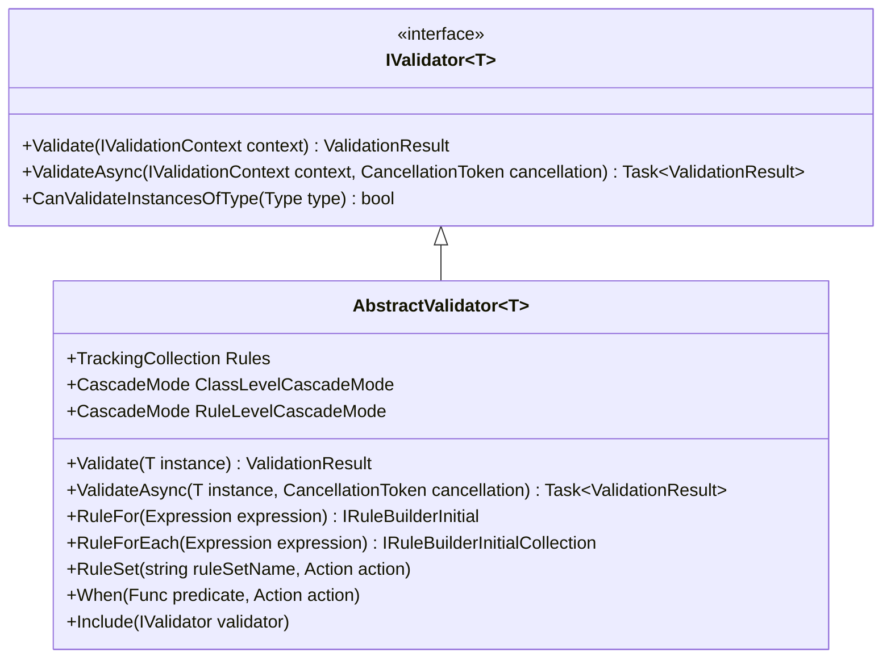
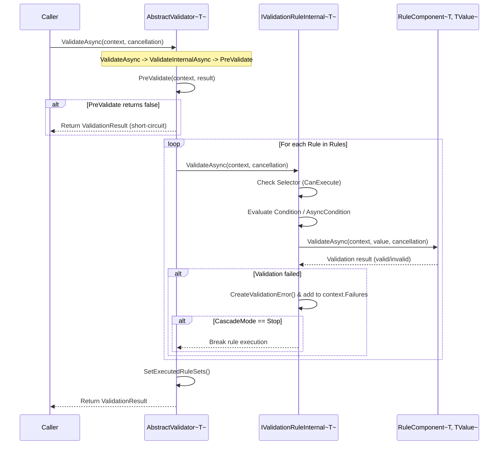

# Validator Definition

<details>
<summary>Relevant source files</summary>

The following files were used as context for generating this wiki page:

- [src/FluentValidation/Validators/ChildValidatorAdaptor.cs](https://github.com/FluentValidation/FluentValidation/blob/main/src/FluentValidation/Validators/ChildValidatorAdaptor.cs)
- [src/FluentValidation/AbstractValidator.cs](https://github.com/FluentValidation/FluentValidation/blob/main/src/FluentValidation/AbstractValidator.cs)
- [src/FluentValidation.Tests/InheritanceValidatorTest.cs](https://github.com/FluentValidation/FluentValidation/blob/main/src/FluentValidation.Tests/InheritanceValidatorTest.cs)
- [src/FluentValidation/Internal/RulesetValidatorSelector.cs](https://github.com/FluentValidation/Internal/RulesetValidatorSelector.cs)
- [src/FluentValidation.Tests/AbstractValidatorTester.cs](https://github.com/FluentValidation/Tests/AbstractValidatorTester.cs)
- [src/FluentValidation.Tests.Benchmarks/Models.cs](https://github.com/FluentValidation/Tests/Benchmarks/Models.cs)
- [src/FluentValidation/Validators/PolymorphicValidator.cs](https://github.com/FluentValidation/Validators/PolymorphicValidator.cs)
- [src/FluentValidation/Internal/RuleBase.cs](https://github.com/FluentValidation/Internal/RuleBase.cs)
- [src/FluentValidation/Internal/RuleBuilder.cs](https://github.com/FluentValidation/Internal/RuleBuilder.cs)
- [src/FluentValidation/DefaultValidatorExtensions.cs](https://github.com/FluentValidation/DefaultValidatorExtensions.cs)
- [src/FluentValidation/Internal/CollectionPropertyRule.cs](https://github.com/FluentValidation/Internal/CollectionPropertyRule.cs)
- [src/FluentValidation/Syntax.cs](https://github.com/FluentValidation/Syntax.cs)
- [src/FluentValidation/IValidationRule.cs](https://github.com/FluentValidation/IValidationRule.cs)
- [src/FluentValidation/InlineValidator.cs](https://github.com/FluentValidation/InlineValidator.cs)
- [src/FluentValidation/Internal/ChildRulesContainer.cs](https://github.com/FluentValidation/Internal/ChildRulesContainer.cs)
- [src/FluentValidation/Internal/IncludeRule.cs](https://github.com/FluentValidation/Internal/IncludeRule.cs)
- [src/FluentValidation.Tests/InlineValidatorTester.cs](https://github.com/FluentValidation/Tests/InlineValidatorTester.cs)
- [docs/start.md](https://github.com/FluentValidation/docs/start.md)
- [src/FluentValidation.Tests/TestValidator.cs](https://github.com/FluentValidation/Tests/TestValidator.cs)
- [src/FluentValidation.Tests/ComplexValidationTester.cs](https://github.com/FluentValidation/Tests/ComplexValidationTester.cs)
- [docs/including-rules.md](https://github.com/FluentValidation/docs/including-rules.md)
- [src/FluentValidation.Tests/DefaultValidatorExtensionTester.cs](https://github.com/FluentValidation/Tests/DefaultValidatorExtensionTester.cs)
- [src/FluentValidation/IValidationRuleInternal.cs](https://github.com/FluentValidation/IValidationRuleInternal.cs)
</details>

## Overview

Validator Definition forms the core domain-modeling and configuration subsystem of FluentValidation. It provides the architectural blueprint and fluent API surface for defining object validation rules without polluting model classes with validation logic. By inheriting from `AbstractValidator<T>` or utilizing lightweight containers like `InlineValidator<T>`, developers compose strongly-typed rule chains via lambda expressions (`RuleFor`, `RuleForEach`), attach property validators, manage cascading fail-fast behaviors, and partition execution scopes using rule sets and conditional clauses.

Sources: [src/FluentValidation/AbstractValidator.cs:33-216](https://github.com/FluentValidation/FluentValidation/blob/main/src/FluentValidation/AbstractValidator.cs#L33-L216)

The subsystem bridges declarative rule definitions and imperative execution runtimes. When rules are declared, `RuleBuilder` instances intercept configuration calls, constructing internal rule representations (`PropertyRule`, `CollectionPropertyRule`, `IncludeRule`) managed within a `TrackingCollection<T>`. 

Sources: [src/FluentValidation/Internal/RuleBuilder.cs:25-50](https://github.com/FluentValidation/Internal/RuleBuilder.cs#L25-L50), [src/FluentValidation/InlineValidator.cs:23-49](https://github.com/FluentValidation/InlineValidator.cs#L23-L49)

During execution, `AbstractValidator<T>` iterates these rules sequentially, evaluating context-aware selector filters, predicates, and cascade states to generate structured `ValidationResult` entities or throw `ValidationException` instances.

Sources: [src/FluentValidation/AbstractValidator.cs:33-216](https://github.com/FluentValidation/AbstractValidator.cs#L33-L216)

---

## AbstractValidator Base Architecture

`AbstractValidator<T>` serves as the foundational base class for all object validators, implementing `IValidator<T>` and `IEnumerable<IValidationRule>`. It maintains an internal `TrackingCollection<IValidationRuleInternal<T>>` containing all registered validation rules and exposes properties to configure global and rule-level cascade behaviors via `ClassLevelCascadeMode` and `RuleLevelCascadeMode`.

Sources: [src/FluentValidation/AbstractValidator.cs:36-81](https://github.com/FluentValidation/AbstractValidator.cs#L36-L81)

Execution flow diverges into synchronous and asynchronous pipelines. Synchronous validation invokes `Validate(ValidationContext<T> context)`, which traps execution inside a `try-catch` block wrapping `ValidateInternal`. If any asynchronous validator or predicate is invoked synchronously, an `AsyncValidatorInvokedSynchronouslyException` is caught and re-thrown with contextual metadata indicating whether the invocation originated from ASP.NET Core MVC integration. Asynchronous validation utilizes `ValidateAsync`, which initiates the verified call chain: `ValidateAsync` calls `ValidateInternalAsync`, which in turn executes `PreValidate`.

Sources: [src/FluentValidation/AbstractValidator.cs:115-138](https://github.com/FluentValidation/AbstractValidator.cs#L115-L138), [src/FluentValidation/AbstractValidator.cs:133-143](https://github.com/FluentValidation/AbstractValidator.cs#L133-L143)



Sources: [src/FluentValidation/AbstractValidator.cs:36-199](https://github.com/FluentValidation/AbstractValidator.cs#L36-L199)

> [!NOTE]
> Passing a `null` model directly to `Validate` or `ValidateAsync` throws an `InvalidOperationException` ("Cannot pass a null model to Validate/ValidateAsync. The root model must be non-null."). Root models must always be non-null; null checks on properties are handled by property validators like `NotNull()`.

Sources: [src/FluentValidation/AbstractValidator.cs:153-155](https://github.com/FluentValidation/AbstractValidator.cs#L153-L155)

---

## Rule Definition API and RuleBuilder

Rules are defined inside validator constructors by invoking `RuleFor` or `RuleForEach` expressions. These methods instantiate property rules, add them to the validator's rule collection, invoke `OnRuleAdded`, and return a fluent `RuleBuilder<T, TProperty>` instance.

Sources: [src/FluentValidation/AbstractValidator.cs:210-230](https://github.com/FluentValidation/AbstractValidator.cs#L210-L230)

```csharp
public class CustomerValidator : AbstractValidator<Customer> {
    public CustomerValidator() {
        RuleFor(customer => customer.Surname).NotNull().NotEqual("foo");
    }
}
```

Sources: [docs/start.md:37-44](https://github.com/FluentValidation/docs/start.md#L37-L44)

The `RuleBuilder` class implements multiple builder interfaces (`IRuleBuilderInitial`, `IRuleBuilderInitialCollection`, `IRuleBuilderOptions`, `IRuleBuilderOptionsConditions`, `IRuleBuilderInternal`) to constrain fluent chaining options at compile time.

Sources: [src/FluentValidation/Internal/RuleBuilder.cs:30-38](https://github.com/FluentValidation/Internal/RuleBuilder.cs#L30-L38)

| Interface | Purpose |
| :--- | :--- |
| `IRuleBuilderInitial<T, TProperty>` | Initial entry point for scalar property rule configuration (`RuleFor`). |
| `IRuleBuilderInitialCollection<T, TElement>` | Initial entry point for collection property rule configuration (`RuleForEach`). |
| `IRuleBuilderOptions<T, TProperty>` | Exposes validator chaining methods (`SetValidator`, `NotNull`, etc.) and dependent rule scopes. |
| `IRuleBuilderOptionsConditions<T, TProperty>` | Exposes conditional scoping (`DependentRules`) for rule builders lacking full validator options. |
| `IRuleBuilderInternal<T, TProperty>` | Internal accessor bridging rule builders to underlying rule instances and parent validators. |

Sources: [src/FluentValidation/Syntax.cs:24-123](https://github.com/FluentValidation/Syntax.cs#L24-L123)

---

## Execution Walkthrough and Control Flow

When `ValidateAsync` is invoked on an `AbstractValidator<T>`, the execution engine follows the verified call chain: `ValidateAsync` (src/FluentValidation/AbstractValidator.cs:133-137) delegates to `ValidateInternalAsync` (src/FluentValidation/AbstractValidator.cs:139-179), which immediately executes `PreValidate` (src/FluentValidation/AbstractValidator.cs:379) before rule evaluation proceeds.

Sources: [src/FluentValidation/AbstractValidator.cs:133-179](https://github.com/FluentValidation/AbstractValidator.cs#L133-L179), [src/FluentValidation/AbstractValidator.cs:379-380](https://github.com/FluentValidation/AbstractValidator.cs#L379-L380)



Sources: [src/FluentValidation/AbstractValidator.cs:134-179](https://github.com/FluentValidation/AbstractValidator.cs#L134-L179), [src/FluentValidation/Internal/CollectionPropertyRule.cs:71-199](https://github.com/FluentValidation/Internal/CollectionPropertyRule.cs#L71-L199)

The step-by-step execution path:
1. `AbstractValidator.ValidateAsync()` invokes `ValidateInternalAsync()`, which immediately executes `PreValidate(context, result)`. If `PreValidate` returns `false`, execution immediately short-circuits and returns the result.
2. The engine loops through `Rules` using an indexed `for` loop to minimize allocations.
3. Each rule verifies selector execution rights via `context.Selector.CanExecute(this, propertyName, context)`.
4. Rule-level and component-level conditions (`Condition`, `AsyncCondition`) are evaluated. If a condition returns `false`, the rule or component is skipped.
5. Property validators execute against the extracted property value. Failures generate `ValidationFailure` instances containing formatted messages, error codes, severity levels, and custom state.

Sources: [src/FluentValidation/AbstractValidator.cs:141-171](https://github.com/FluentValidation/AbstractValidator.cs#L141-L171), [src/FluentValidation/Internal/CollectionPropertyRule.cs:71-114](https://github.com/FluentValidation/Internal/CollectionPropertyRule.cs#L71-L114)

> [!IMPORTANT]
> Within rule execution loops, `ClassLevelCascadeMode == CascadeMode.Stop` evaluates `result.Errors.Count > totalFailures` after each rule completes. If the rule added one or more failures, validator execution breaks immediately. Rule-level cascade mode (`CascadeMode.Stop`) similarly halts further validators within the current property rule upon the first failure.

Sources: [src/FluentValidation/AbstractValidator.cs:166-170](https://github.com/FluentValidation/AbstractValidator.cs#L166-L170), [src/FluentValidation/Internal/CollectionPropertyRule.cs:179-184](https://github.com/FluentValidation/Internal/CollectionPropertyRule.cs#L179-L184)

---

## Rule Sets and Selectors

Rule sets allow developers to group validation rules into logical categories and execute subsets during validation requests via `RulesetValidatorSelector`.

Sources: [src/FluentValidation/Internal/RulesetValidatorSelector.cs:10-26](https://github.com/FluentValidation/Internal/RulesetValidatorSelector.cs#L10-L26)

```csharp
validator.RuleSet("Names", () => {
    validator.RuleFor(x => x.Surname).NotNull();
    validator.RuleFor(x => x.Forename).NotNull();
});

var result = validator.Validate(person, v => v.IncludeRuleSets("Names"));
```

Sources: [src/FluentValidation.Tests/AbstractValidatorTester.cs:220-229](https://github.com/FluentValidation.Tests/AbstractValidatorTester.cs#L220-L229)

The `RulesetValidatorSelector.CanExecute` algorithm determines whether a rule runs based on the requested rulesets:
- If a rule has no rulesets (`rule.RuleSets == null || rule.RuleSets.Length == 0`) and `_rulesetsToExecute` is empty, the rule executes and records `"default"`.
- If the wildcard ruleset (`"*"`) is requested, all rules execute, registering their respective rulesets into executed tracking data.
- If specific rulesets are requested, intersection matching (`rule.RuleSets.Intersect(_rulesetsToExecute, StringComparer.OrdinalIgnoreCase)`) determines execution eligibility.

Sources: [src/FluentValidation/Internal/RulesetValidatorSelector.cs:35-77](https://github.com/FluentValidation/Internal/RulesetValidatorSelector.cs#L35-L77)

---

## Complex Properties and Child Validators

Complex property validation is supported through `ChildValidatorAdaptor<T, TProperty>`, which wraps a standalone validator (`IValidator<TProperty>`) or a dynamic validator provider function.

Sources: [src/FluentValidation/Validators/ChildValidatorAdaptor.cs:18-36](https://github.com/FluentValidation/Validators/ChildValidatorAdaptor.cs#L18-L36)

```csharp
public class CustomerValidator : AbstractValidator<Customer> {
    public CustomerValidator() {
        RuleFor(customer => customer.Address).SetValidator(new AddressValidator());
    }
}
```

Sources: [docs/start.md:180-189](https://github.com/FluentValidation/docs/start.md#L180-L189)

When validating child properties:
1. If the property value is `null`, validation short-circuits and succeeds (`return true`), preventing null reference exceptions on child validators unless explicitly guarded.
2. A new validation context is cloned via `context.CloneForChildValidator(value, true, selector)`.
3. Collection indices (when invoked via `RuleForEach`) are preserved and flowed down through `RootContextData["__FV_CollectionIndex"]` so nested child rules correctly format error property paths like `Foos[0].Name`.

Sources: [src/FluentValidation/Validators/ChildValidatorAdaptor.cs:38-61](https://github.com/FluentValidation/Validators/ChildValidatorAdaptor.cs#L38-L61), [src/FluentValidation/Validators/ChildValidatorAdaptor.cs:107-125](https://github.com/FluentValidation/Validators/ChildValidatorAdaptor.cs#L107-L125)

---

## Polymorphic and Inheritance Validation

When validating properties typed as base classes or interfaces where runtime implementations require distinct validation rules, `PolymorphicValidator<T, TProperty>` handles runtime type dispatching.

Sources: [src/FluentValidation/Validators/PolymorphicValidator.cs:27-37](https://github.com/FluentValidation/Validators/PolymorphicValidator.cs#L27-L37)

```csharp
validator.RuleFor(x => x.Foo).SetInheritanceValidator(v => {
    v.Add(impl1Validator);
    v.Add(impl2Validator);
});
```

Sources: [src/FluentValidation.Tests/InheritanceValidatorTest.cs:38-41](https://github.com/FluentValidation.Tests/InheritanceValidatorTest.cs#L38-L41)

The polymorphic validator maintains a dictionary mapping runtime `Type` instances to `DerivedValidatorFactory` instances. During execution, `GetValidator` inspects `value.GetType()`, retrieves the corresponding derived validator factory, and delegates validation. Similarly, `GetSelector` extracts ruleset configurations registered specifically for that derived type.

Sources: [src/FluentValidation/Validators/PolymorphicValidator.cs:33-33](https://github.com/FluentValidation/Validators/PolymorphicValidator.cs#L33-L33), [src/FluentValidation/Validators/PolymorphicValidator.cs:99-115](https://github.com/FluentValidation/Validators/PolymorphicValidator.cs#L99-L115)

---

## Design Trade-Offs

| Design Choice | Benefit | Cost |
| :--- | :--- | :--- |
| **Expression Tree Property Accessors** | Strongly-typed refactoring safety and automatic property name inference (`Surname`). | Reflection and expression compilation overhead during validator initialization. |
| **Separated Rule Building (`RuleBuilder`)** | Clean, fluent API syntax separating rule construction from execution engine internals. | Complex generic type signatures spanning `IRuleBuilderInitial`, `IRuleBuilderOptions`, and internal interfaces. |
| **Child Validator Adaptors (`ChildValidatorAdaptor`)** | Decouples composite validator instances from property rules while supporting dynamic factory resolution. | Requires context cloning and explicit collection index propagation through root context data. |
| **Indexed For-Loop Execution** | Eliminates enumerator allocation overhead during high-performance validation runs. | Requires strict collection mutation safeguards during rule execution. |

Sources: [src/FluentValidation/AbstractValidator.cs:157-160](https://github.com/FluentValidation/AbstractValidator.cs#L157-L160), [src/FluentValidation/Internal/RuleBuilder.cs:30-38](https://github.com/FluentValidation/Internal/RuleBuilder.cs#L30-L38), [src/FluentValidation/Validators/ChildValidatorAdaptor.cs:18-61](https://github.com/FluentValidation/Validators/ChildValidatorAdaptor.cs#L18-L61)

## Related

- [[Validation Core]]

