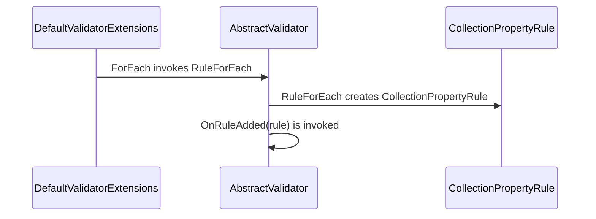
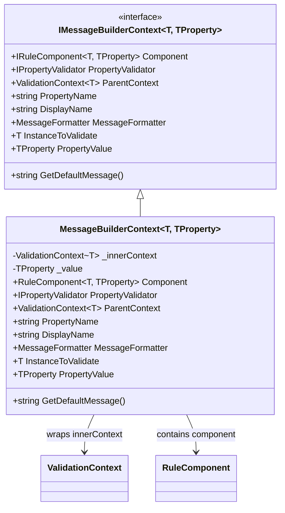

# Value Transformation

<details>
<summary>Relevant source files</summary>

The following files were used as context for generating this wiki page:

- [src/FluentValidation/Internal/RuleBase.cs](https://github.com/FluentValidation/FluentValidation/blob/main/src/FluentValidation/Internal/RuleBase.cs)
- [src/FluentValidation/DefaultValidatorOptions.cs](https://github.com/FluentValidation/FluentValidation/blob/main/src/FluentValidation/DefaultValidatorOptions.cs)
- [src/FluentValidation/Internal/PropertyRule.cs](https://github.com/FluentValidation/FluentValidation/blob/main/src/FluentValidation/Internal/PropertyRule.cs)
- [src/FluentValidation/Internal/RuleComponent.cs](https://github.com/FluentValidation/FluentValidation/blob/main/src/FluentValidation/Internal/RuleComponent.cs)
- [src/FluentValidation/IValidationRule.cs](https://github.com/FluentValidation/FluentValidation/blob/main/src/FluentValidation/IValidationRule.cs)
- [src/FluentValidation/DefaultValidatorExtensions.cs](https://github.com/FluentValidation/FluentValidation/blob/main/src/FluentValidation/DefaultValidatorExtensions.cs)
- [src/FluentValidation/Internal/MessageBuilderContext.cs](https://github.com/FluentValidation/FluentValidation/blob/main/src/FluentValidation/Internal/MessageBuilderContext.cs)
- [src/FluentValidation/Internal/RuleBuilder.cs](https://github.com/FluentValidation/FluentValidation/blob/main/src/FluentValidation/Internal/RuleBuilder.cs)
- [src/FluentValidation/Internal/CollectionPropertyRule.cs](https://github.com/FluentValidation/FluentValidation/blob/main/src/FluentValidation/Internal/CollectionPropertyRule.cs)
- [docs/transform.md](https://github.com/FluentValidation/FluentValidation/blob/main/docs/transform.md)
- [docs/upgrading-to-9.md](https://github.com/FluentValidation/FluentValidation/blob/main/docs/upgrading-to-9.md)
- [src/FluentValidation/AbstractValidator.cs](https://github.com/FluentValidation/FluentValidation/blob/main/src/FluentValidation/AbstractValidator.cs)
- [src/FluentValidation/Validators/PropertyValidator.cs](https://github.com/FluentValidation/Validators/PropertyValidator.cs)
- [docs/upgrading-to-10.md](https://github.com/FluentValidation/FluentValidation/blob/main/docs/upgrading-to-10.md)
- [src/FluentValidation/Internal/IRuleComponent.cs](https://github.com/FluentValidation/FluentValidation/blob/main/src/FluentValidation/Internal/IRuleComponent.cs)
- [docs/advanced.md](https://github.com/FluentValidation/FluentValidation/blob/main/docs/advanced.md)
</details>

## Overview

Value transformation allows developers to modify property and collection values prior to executing validation rules, enabling scenarios such as converting string inputs into numeric types before running comparison checks. Introduced as part of the validation pipeline, these transformation features facilitate complex input parsing and type mapping directly within fluent rule definitions. However, because value transformation methods are deprecated and scheduled for removal in future major versions, modern alternatives like computed properties on models are recommended.

Sources: [docs/transform.md:8-16](https://github.com/FluentValidation/FluentValidation/blob/main/docs/transform.md#L8-L16), [docs/transform.md:31-31](https://github.com/FluentValidation/FluentValidation/blob/main/docs/transform.md#L31-L31), [docs/transform.md:4-6](https://github.com/FluentValidation/FluentValidation/blob/main/docs/transform.md#L4-L6)

## Transform Fluent API and Usage

### Overview

The fluent API provides mechanisms for declaring value transformations directly within rule definitions using dedicated extension methods. The primary transformation methods allow mapping a source property of type `T` to a new type before chaining further validation rules such as comparison checks or format validations.

```csharp
Transform(from: x => x.SomeStringProperty, to: value => int.TryParse(value, out int val) ? (int?) val : null)
    .GreaterThan(10);
```

Sources: [docs/transform.md:11-14](https://github.com/FluentValidation/FluentValidation/blob/main/docs/transform.md#L11-L14)

### Method Overloads and Composition

To improve readability and separate parsing logic from rule definitions, transformation functions can be extracted into standalone methods passed directly to the `Transform` builder.

```csharp
Transform(x => x.SomeStringProperty, StringToNullableInt)
    .GreaterThan(10);

int? StringToNullableInt(string value)
  => int.TryParse(value, out int val) ? (int?) val : null;
```

Sources: [docs/transform.md:20-27](https://github.com/FluentValidation/FluentValidation/blob/main/docs/transform.md#L20-L27)

For handling collections, the API exposes `TransformForEach`, which performs the transformation logic against each individual element within an enumerable property prior to executing subsequent rules against the collection items.

Sources: [docs/transform.md:31-31](https://github.com/FluentValidation/FluentValidation/blob/main/docs/transform.md#L31-L31)

> [!WARNING]
> Value transformation methods are no longer recommended or supported and will be removed in FluentValidation 12. Developers should instead rely on computed properties on the model when transformation logic is required.

Sources: [docs/transform.md:4-6](https://github.com/FluentValidation/FluentValidation/blob/main/docs/transform.md#L4-L6)

## Internal Rule Architecture and Components

### Overview

The core architecture representing property validation rules and individual validator components relies on abstract class hierarchies and generic interfaces. At the foundational level, `RuleBase<T, TProperty, TValue>` implements `IValidationRule<T, TValue>` and manages collections of validator components, rule-level conditions, display names, and cascade modes. Specialized rule classes such as `PropertyRule<T, TProperty>` extend this base structure to implement execution methods like `ValidateAsync`.

Sources: [src/FluentValidation/Internal/RuleBase.cs:31-43](https://github.com/FluentValidation/FluentValidation/blob/main/src/FluentValidation/Internal/RuleBase.cs#L31-L43), [src/FluentValidation/Internal/PropertyRule.cs:31-35](https://github.com/FluentValidation/FluentValidation/blob/main/src/FluentValidation/Internal/PropertyRule.cs#L31-L35)

### Core Data Structures and Interfaces

Rules contain an internal list of `RuleComponent<T, TValue>` instances, which encapsulate individual property validators or asynchronous property validators along with component-specific conditions, error messages, error codes, and severity or custom state providers.

Sources: [src/FluentValidation/Internal/RuleBase.cs:32-43](https://github.com/FluentValidation/FluentValidation/blob/main/src/FluentValidation/Internal/RuleBase.cs#L32-L43), [src/FluentValidation/Internal/RuleComponent.cs:33-40](https://github.com/FluentValidation/Internal/RuleComponent.cs#L33-L40), [src/IValidationRule.cs:119-124](https://github.com/FluentValidation/FluentValidation/blob/main/src/IValidationRule.cs#L119-L124)

| Interface / Class | Type Parameter(s) | Key Properties / Members | Purpose |
| --- | --- | --- | --- |
| `IValidationRule` | None | `Components`, `RuleSets`, `PropertyName`, `Member`, `TypeToValidate`, `DependentRules` | Non-generic contract for rule metadata, rule-sets, and structural traversal. |
| `IValidationRule<T>` | `T` | `ApplyCondition`, `ApplySharedCondition`, `GetPropertyValue`, `TryGetPropertyValue` | Model-generic contract managing rule preconditions and property value access. |
| `IValidationRule<T, TProperty>` | `T, TProperty` | `CascadeMode`, `SetDisplayName`, `AddValidator`, `AddAsyncValidator`, `Current` | Fully generic rule contract supporting fluent validator addition and configuration. |
| `RuleBase<T, TProperty, TValue>` | `T, TProperty, TValue>` | `Components`, `Member`, `PropertyFunc`, `CascadeMode`, `ApplyCondition`, `CreateValidationError` | Internal abstract base class implementing shared rule behavior and error factory construction. |
| `PropertyRule<T, TProperty>` | `T, TProperty` | `Create`, `ValidateAsync`, `AddDependentRules` | Concrete property rule implementation responsible for executing rule component chains. |
| `IRuleComponent` | None | `HasCondition`, `HasAsyncCondition`, `Validator`, `ErrorCode`, `GetUnformattedErrorMessage()` | Non-generic contract for individual rule components and attached validators. |
| `IRuleComponent<T, TProperty>` | `T, TProperty` | `ErrorCode`, `CustomStateProvider`, `SeverityProvider`, `SetErrorMessage` | Generic contract for configuring component-level conditions, error messages, and metadata. |
| `RuleComponent<T, TProperty>` | `T, TProperty` | `ValidateAsync`, `Validate`, `GetErrorMessage`, `ApplyCondition` | Concrete container wrapping synchronous or asynchronous property validators within a rule. |

Sources: [src/FluentValidation/Internal/RuleBase.cs:31-147](https://github.com/FluentValidation/FluentValidation/blob/main/src/FluentValidation/Internal/RuleBase.cs#L31-L147), [src/FluentValidation/Internal/PropertyRule.cs:31-44](https://github.com/FluentValidation/Internal/PropertyRule.cs#L31-L44), [src/FluentValidation/Internal/RuleComponent.cs:33-211](https://github.com/FluentValidation/Internal/RuleComponent.cs#L33-L211), [src/IValidationRule.cs:30-177](https://github.com/FluentValidation/FluentValidation/blob/main/src/IValidationRule.cs#L30-L177), [src/FluentValidation/Internal/IRuleComponent.cs:31-101](https://github.com/FluentValidation/FluentValidation/blob/main/src/FluentValidation/Internal/IRuleComponent.cs#L31-101)

### Execution Pipeline Walkthrough

When `ValidateAsync` is invoked on a `PropertyRule`, it executes a precise sequence of validation checks before evaluating rule components:

1. **Display Name Resolution**: Retrieves the display name using `GetDisplayName(context)`. If `PropertyName` and `displayName` are both `null`, it assigns `string.Empty` assuming a model-level rule.
Sources: [src/FluentValidation/Internal/PropertyRule.cs:53-58](https://github.com/FluentValidation/FluentValidation/blob/main/src/FluentValidation/Internal/PropertyRule.cs#L53-L58)
2. **Property Path Construction**: Constructs the property path using `context.PropertyChain.BuildPropertyPath(PropertyName ?? displayName)`.
Sources: [src/FluentValidation/Internal/PropertyRule.cs:61-61](https://github.com/FluentValidation/FluentValidation/blob/main/src/FluentValidation/Internal/PropertyRule.cs#L61-L61)
3. **Selector Veto Check**: Calls `context.Selector.CanExecute(this, propertyPath, context)`. If this returns `false`, execution terminates immediately.
Sources: [src/FluentValidation/Internal/PropertyRule.cs:65-67](https://github.com/FluentValidation/FluentValidation/blob/main/src/FluentValidation/Internal/PropertyRule.cs#L65-L67)
4. **Condition Evaluation**: Evaluates rule-level synchronous `Condition(context)` and asynchronous `AsyncCondition(context, cancellation)` predicates. If any predicate fails, execution aborts.
Sources: [src/FluentValidation/Internal/PropertyRule.cs:69-83](https://github.com/FluentValidation/FluentValidation/blob/main/src/FluentValidation/Internal/PropertyRule.cs#L69-L83)
5. **Component Iteration**: Iterates through each `RuleComponent` in `Components`, evaluating per-component conditions, extracting the property value lazily on the first component execution via `PropertyFunc(context.InstanceToValidate)`, and calling `component.ValidateAsync(...)`.
Sources: [src/FluentValidation/Internal/PropertyRule.cs:94-135](https://github.com/FluentValidation/FluentValidation/blob/main/src/FluentValidation/Internal/PropertyRule.cs#L94-L135)
6. **Dependent Rule Execution**: If no new failures occurred and `DependentRules` are present, iterates and validates each dependent rule recursively.
Sources: [src/FluentValidation/Internal/PropertyRule.cs:137-142](https://github.com/FluentValidation/FluentValidation/blob/main/src/FluentValidation/Internal/PropertyRule.cs#L137-L142)

> [!NOTE]
> Property value extraction is intentionally deferred until the first valid component is reached. If all preceding component conditions evaluate to false, `PropertyFunc` is never invoked, preventing unnecessary allocations or null reference exceptions.

Sources: [src/FluentValidation/Internal/PropertyRule.cs:98-120](https://github.com/FluentValidation/FluentValidation/blob/main/src/FluentValidation/Internal/PropertyRule.cs#L98-L120)

## Value Transformation Execution Flow

### Overview

The processing and validation pipeline for transformed values governs how rules are added, initialized, filtered, and evaluated across models and collections. When rules are registered via `ForEach`, `RuleForEach`, and `OnRuleAdded`, FluentValidation orchestrates the exact call chain `ForEach` → `RuleForEach` → `OnRuleAdded` to set up rule structures and execute components against target instances.

Sources: [src/FluentValidation/AbstractValidator.cs:224-230](https://github.com/FluentValidation/AbstractValidator.cs#L224-L230), [src/FluentValidation/DefaultValidatorExtensions.cs:1164-1183](https://github.com/FluentValidation/DefaultValidatorExtensions.cs#L1164-L1183)

### Call-Chain Execution Walkthrough (`ForEach` → `RuleForEach` → `OnRuleAdded`)

1. `ForEach`: Invokes the extension method on `DefaultValidatorExtensions` which instantiates an `InlineValidator` and initiates collection rule setup.
Sources: [src/FluentValidation/DefaultValidatorExtensions.cs:1164-1166](https://github.com/FluentValidation/DefaultValidatorExtensions.cs#L1164-L1166)
2. `RuleForEach`: Calls into `AbstractValidator.RuleForEach` to create a new `CollectionPropertyRule` instance and register it with the rule collection.
Sources: [src/FluentValidation/AbstractValidator.cs:224-230](https://github.com/FluentValidation/AbstractValidator.cs#L224-L230)
3. `OnRuleAdded`: Triggers the `AbstractValidator.OnRuleAdded(rule)` lifecycle hook, allowing custom subclasses to intercept or customize all newly added rules.
Sources: [src/FluentValidation/AbstractValidator.cs:228-228](https://github.com/FluentValidation/AbstractValidator.cs#L228-L228), [src/FluentValidation/AbstractValidator.cs:393-397](https://github.com/FluentValidation/AbstractValidator.cs#L393-L397)



Sources: [src/FluentValidation/AbstractValidator.cs:224-230](https://github.com/FluentValidation/AbstractValidator.cs#L224-L230), [src/FluentValidation/Internal/CollectionPropertyRule.cs:63-67](https://github.com/FluentValidation/Internal/CollectionPropertyRule.cs#L63-L67), [src/FluentValidation/DefaultValidatorExtensions.cs:1164-1183](https://github.com/FluentValidation/DefaultValidatorExtensions.cs#L1164-L1183), [src/FluentValidation/AbstractValidator.cs:393-397](https://github.com/FluentValidation/AbstractValidator.cs#L393-L397)

> [!NOTE]
> During collection rule validation, `GetValidatorsToExecuteAsync` pre-filters rule components before enumerating collection elements, ensuring that root-level conditions can prevent unneeded collection property access and avoid `NullReferenceException`.
Sources: [src/FluentValidation/Internal/CollectionPropertyRule.cs:207-235](https://github.com/FluentValidation/Internal/CollectionPropertyRule.cs#L207-L235)

### Pipeline Stages and Processing Options

| Stage / Method | Target Type / Scope | Default Behavior / Value | Purpose |
| :--- | :--- | :--- | :--- |
| `PreValidate` | `ValidationContext<T>, ValidationResult` | Returns `true` | Determines if validation should occur and allows pre-execution context modification. |
| `ClassLevelCascadeMode` | `AbstractValidator<T>` | `ValidatorOptions.Global.DefaultClassLevelCascadeMode` | Controls whether validation stops between rules when a failure occurs. |
| `RuleLevelCascadeMode` | `AbstractValidator<T>` | `ValidatorOptions.Global.DefaultRuleLevelCascadeMode` | Controls whether validation stops within a rule's components after a failure. |
| `Filter` / `AsyncFilter` | `CollectionPropertyRule<T, TElement>` | `null` | Conditionally includes or excludes specific elements inside a collection validation loop. |

Sources: [src/FluentValidation/AbstractValidator.cs:37-60](https://github.com/FluentValidation/AbstractValidator.cs#L37-60), [src/FluentValidation/AbstractValidator.cs:374-381](https://github.com/FluentValidation/AbstractValidator.cs#L374-381), [src/FluentValidation/Internal/CollectionPropertyRule.cs:47-53](https://github.com/FluentValidation/Internal/CollectionPropertyRule.cs#L47-53)

> [!WARNING]
> If `CascadeMode.Stop` is triggered inside a `CollectionPropertyRule` element iteration, state restoration (`context.RestoreState()`) is executed before breaking out via `goto AfterValidate` to ensure property chain integrity for subsequent rules.
Sources: [src/FluentValidation/Internal/CollectionPropertyRule.cs:179-185](https://github.com/FluentValidation/Internal/CollectionPropertyRule.cs#L179-L185)

### Design Trade-Offs in Pipeline Execution

| Design Choice | Benefit | Cost |
| :--- | :--- | :--- |
| **Deferred Property Access (`PropertyFunc` invoked on first component)** | Avoids evaluating expensive property getters or triggering `NullReferenceException` when preceding conditions fail. | Slight structural complexity when managing first-run tracking flags inside validation loops. |
| **Pre-filtering Rule Components (`GetValidatorsToExecute` for collections)** | Prevents redundant condition checks per collection element when root conditions already disqualify specific components. | Allocates an intermediary filtered list via `Components.ToList()` prior to collection iteration. |
| **State Preservation via `context.RestoreState()` in Collections** | Maintains correct nested property paths and indexers for error reporting across complex object graphs. | Requires explicit state cleanup and jump targets (`goto AfterValidate`) inside loop constructs. |

Sources: [src/FluentValidation/Internal/PropertyRule.cs:98-120](https://github.com/FluentValidation/Internal/PropertyRule.cs#L98-L120), [src/FluentValidation/Internal/CollectionPropertyRule.cs:179-188](https://github.com/FluentValidation/Internal/CollectionPropertyRule.cs#L179-L188), [src/FluentValidation/Internal/CollectionPropertyRule.cs:207-235](https://github.com/FluentValidation/Internal/CollectionPropertyRule.cs#L207-L235)

## Message Context and Property Formatting

### Overview

When validation fails, error messages, state placeholders, and custom error details draw data from both the parent validation context and the property validator component. The `IMessageBuilderContext<T, TProperty>` interface and its concrete implementation `MessageBuilderContext<T, TProperty>` expose this shared state to custom message builders, property name providers, and severity or custom state callbacks. 



Sources: [src/FluentValidation/Internal/MessageBuilderContext.cs:5-50](https://github.com/FluentValidation/FluentValidation/blob/main/src/FluentValidation/Internal/MessageBuilderContext.cs#L5-L50)

### Message Context Properties and Formatting

The `MessageBuilderContext<T, TProperty>` class wraps an inner `ValidationContext<T>` and the current property value, forwarding property path lookups, display names, and message formatting through properties and helper methods. When `GetDefaultMessage()` is invoked, it delegates directly to the underlying `RuleComponent` using the stored inner context and property value.

| Member | Type | Purpose |
| :--- | :--- | :--- |
| `Component` | `RuleComponent<T, TProperty>` | The rule component currently executing validation. |
| `PropertyValidator` | `IPropertyValidator` | The underlying property validator instance extracted from the component. |
| `ParentContext` | `ValidationContext<T>` | The inner validation context wrapping the object graph and message formatter. |
| `PropertyName` | `string` | Resolved property path obtained from `_innerContext.PropertyPath`. |
| `DisplayName` | `string` | Display name of the property obtained from `_innerContext.DisplayName`. |
| `MessageFormatter` | `MessageFormatter` | Formatter managing placeholder values for error messages. |
| `InstanceToValidate` | `T` | The root model instance being validated. |
| `PropertyValue` | `TProperty` | The specific property value being evaluated by the validator. |
| `GetDefaultMessage()` | `string` | Invokes `Component.GetErrorMessage(_innerContext, _value)` to build the final message. |

Sources: [src/FluentValidation/Internal/MessageBuilderContext.cs:17-50](https://github.com/FluentValidation/FluentValidation/blob/main/src/FluentValidation/Internal/MessageBuilderContext.cs#L17-L50)

> [!NOTE]
> Custom message providers supplied via `WithMessage` methods unwrap null validation contexts safely, defaulting to `default(T)` for the instance parameter if the context reference is null when evaluated.
Sources: [src/FluentValidation/DefaultValidatorOptions.cs:131-151](https://github.com/FluentValidation/FluentValidation/blob/main/src/FluentValidation/DefaultValidatorOptions.cs#L131-L151)

### Property Validator Infrastructure

Base property validators inherit from `PropertyValidator<T, TProperty>`, implementing `IPropertyValidator<T, TProperty>`. They define abstract methods for validation execution and error message template retrieval, while providing integration with the global language manager for localized message lookup.

| Method / Property | Return Type | Purpose |
| :--- | :--- | :--- |
| `Name` | `string` | Abstract property returning the unique name of the property validator. |
| `IsValid(ValidationContext<T>, TProperty)` | `bool` | Abstract method validating the specific property value against business rules. |
| `GetDefaultMessageTemplate(string)` | `string` | Returns the fallback error message template when no custom message is specified. |
| `Localized(string, string)` | `string` | Resolves localized message templates via `ValidatorOptions.Global.LanguageManager` using error codes or fallback keys. |

Sources: [src/FluentValidation/Validators/PropertyValidator.cs:23-58](https://github.com/FluentValidation/FluentValidation/blob/main/src/FluentValidation/Validators/PropertyValidator.cs#L23-L58)

## Migration and Historical Changes

### Overview

Value transformation in FluentValidation was introduced in version 9.5 to allow property values to be converted to different types before validation checks occur. However, as the validation engine evolved across major releases, the syntax and internal representation underwent significant changes, culminating in major deprecations and removals.

Sources: [docs/transform.md:1-10](https://github.com/FluentValidation/FluentValidation/blob/main/docs/transform.md#L1-L10), [docs/upgrading-to-9.md:68-71](https://github.com/FluentValidation/FluentValidation/blob/main/docs/upgrading-to-9.md#L68-L71), [docs/upgrading-to-10.md:112-115](https://github.com/FluentValidation/FluentValidation/blob/main/docs/upgrading-to-10.md#L112-L115)

### Major Version Evolution and Breaking Changes

The `Transform` feature experienced distinct evolutionary phases across major version boundaries, shifting from initial introduction to complete removal in version 10.

| Version | Feature Status | Description |
| :--- | :--- | :--- |
| **FluentValidation 9.0** | Architectural Prep | Laid groundwork with generic property validators, rule components, and internal model restructuring. |
| **FluentValidation 9.5** | Introduction | Added `Transform` and `TransformForEach` methods to convert property types prior to running validation rules. |
| **FluentValidation 10.0** | Removal | The old `Transform` syntax was completely removed in favor of model-level computed properties. |

Sources: [docs/transform.md:1-10](https://github.com/FluentValidation/FluentValidation/blob/main/docs/transform.md#L1-L10), [docs/upgrading-to-9.md:68-71](https://github.com/FluentValidation/FluentValidation/blob/main/docs/upgrading-to-9.md#L68-L71), [docs/upgrading-to-10.md:112-115](https://github.com/FluentValidation/FluentValidation/blob/main/docs/upgrading-to-10.md#L112-L115)

> [!WARNING]
> The transform methods documented in early 9.5+ guides are deprecated and marked for removal in FluentValidation 12. Developers are strongly encouraged to use computed properties on the model instead of runtime value transformation.
Sources: [docs/transform.md:3-6](https://github.com/FluentValidation/FluentValidation/blob/main/docs/transform.md#L3-L6)

## Related

- [[Validation Core]]

