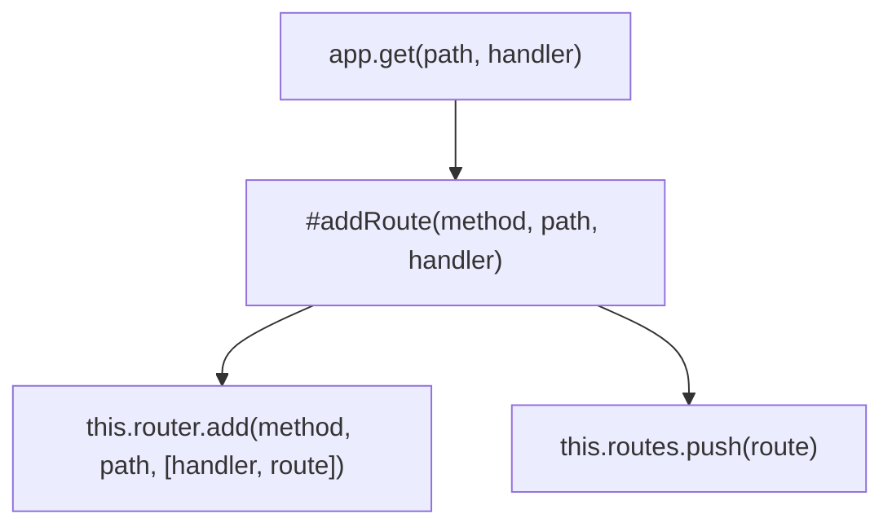

# Application Instance

<details>
<summary>Relevant source files</summary>

The following files were used as context for generating this wiki page:

- [src/adapter/aws-lambda/handler.ts](https://github.com/honojs/hono/blob/main/src/adapter/aws-lambda/handler.ts)
- [src/types.ts](https://github.com/honojs/hono/blob/main/src/types.ts)
- [src/context.ts](https://github.com/honojs/hono/blob/main/src/context.ts)
- [src/client/client.ts](https://github.com/honojs/hono/blob/main/src/client/client.ts)
- [src/hono-base.ts](https://github.com/honojs/hono/blob/main/src/hono-base.ts)
- [src/preset/quick.ts](https://github.com/honojs/hono/blob/main/src/preset/quick.ts)
- [src/hono.ts](https://github.com/honojs/hono/blob/main/src/hono.ts)
</details>

The **Application Instance** in Hono, represented by the `Hono` class, serves as the central orchestration hub for an entire web application. It encapsulates the routing table, middleware stack, error handling logic, and configuration necessary to process incoming requests. By decoupling the application definition from the execution environment, Hono allows a single application instance to be easily ported across different platforms, such as AWS Lambda, Cloudflare Workers, or standard Node.js servers, using specific adapters.

An application instance acts as a registry for routes and middleware. Developers define the application's behavior by attaching handlers to specific HTTP methods and paths. When a request hits the system, the application instance coordinates the traversal of its internal router to identify the matching route, executes the corresponding middleware chain using `compose`, and renders the result through the `Context` object.

The architecture emphasizes composition and type safety. The instance maintains a schema definition that tracks input/output types across routes, enabling developers to build robust, type-checked APIs. Through its `fetch` method, the application instance provides a unified entry point that conforms to standard Web API interfaces, ensuring consistency regardless of whether the request is local (in testing) or external (in production).

## Core Lifecycle and Execution Flow

The entry point of an application instance is the `fetch` method. This method acts as the primary orchestrator that bridges the incoming `Request` object and the application's internal dispatch mechanism.
Sources: [src/hono-base.ts:479-485](https://github.com/honojs/hono/blob/main/src/hono-base.ts#L479-L485)

The execution flow within the instance generally follows this sequence: `fetch(request)` → `getPath()` → `router.match()` → `new Context()` → `compose()` → `Response`.
Sources: [src/hono-base.ts:418-427](https://github.com/honojs/hono/blob/main/src/hono-base.ts#L418-L427)

> [!NOTE]
> The `compose` step is skipped if only a single handler matches the request, reducing overhead for simple, direct routes by invoking the handler directly without middleware wrapping.
Sources: [src/hono-base.ts:430-448](https://github.com/honojs/hono/blob/main/src/hono-base.ts#L430-L448)

## Routing and Registration Logic

The `Hono` instance maintains a list of `RouterRoute` objects in a `routes` property. Registration occurs via methods like `get`, `post`, and `on`, which internally call `#addRoute`. This mechanism maps an HTTP method and path pattern to a handler function.


Sources: [src/hono-base.ts:129-141](https://github.com/honojs/hono/blob/main/src/hono-base.ts#L129-L141)

The `#addRoute` method specifically handles standardizing the method to uppercase and merging base paths with the route path using `mergePath` to ensure consistency.
Sources: [src/hono-base.ts:385-397](https://github.com/honojs/hono/blob/main/src/hono-base.ts#L385-L397)

## Adapter Integration: AWS Lambda

Adapters translate environment-specific events (e.g., AWS Lambda events) into the standard `Request` object expected by the application instance. The `handle` function in `src/adapter/aws-lambda/handler.ts` implements this translation.
Sources: [src/adapter/aws-lambda/handler.ts:239-276](https://github.com/honojs/hono/blob/main/src/adapter/aws-lambda/handler.ts#L239-L276)

- **Processor Selection:** The system selects an `EventProcessor` based on the event structure (`isProxyEventALB`, `isProxyEventV2`, etc.).
- **Transformation:** `createRequest` extracts the method, headers, and body from the Lambda event, transforming them into a standard `Request` object, then passes it to `app.fetch()`.
Sources: [src/adapter/aws-lambda/handler.ts:138-193](https://github.com/honojs/hono/blob/main/src/adapter/aws-lambda/handler.ts#L138-L193)

## Context Management

The `Context` class manages the state of a single request. It provides an interface for reading environment variables (`env`), accessing request parameters (`req`), and generating responses.

| Method | Purpose |
| :--- | :--- |
| `c.header()` | Sets HTTP response headers |
| `c.status()` | Sets HTTP status code |
| `c.text()` | Renders response as `text/plain` |
| `c.json()` | Renders response as `application/json` |

Sources: [src/context.ts:293-361](https://github.com/honojs/hono/blob/main/src/context.ts#L293-L361)

## Architecture Trade-offs

| Design Choice | Benefit | Cost |
| :--- | :--- | :--- |
| `HonoBase` as base class | Portable across environments | Requires internal state management |
| `compose` Middleware | Highly modular handler pipeline | Adds stack depth to every request |
| `SmartRouter` choice | Dynamic router performance | Slightly higher initialization complexity |

Sources: [src/hono-base.ts:98-124](https://github.com/honojs/hono/blob/main/src/hono-base.ts#L98-L124)

The middleware engine uses `compose` to combine all matching handlers, ensuring that `next()` calls proceed correctly through the stack.
Sources: [src/hono-base.ts:450](https://github.com/honojs/hono/blob/main/src/hono-base.ts#L450)

## Lifecycle Example

This example demonstrates setting up an application and using the provided `handle` utility for AWS Lambda.

```typescript
import { Hono } from 'hono'
import { handle } from 'hono/aws-lambda'

// 1. Instantiate the application
const app = new Hono()

// 2. Define routes
app.get('/', (c) => c.text('Hello!'))

// 3. Export the handler for Lambda execution
export const handler = handle(app)
```
Sources: [src/adapter/aws-lambda/handler.ts:211-222](https://github.com/honojs/hono/blob/main/src/adapter/aws-lambda/handler.ts#L211-L222)

> [!WARNING]
> When using `c.res` directly, ensure the context is not already finalized. Writing to `c.res` after a response has been sent can lead to unexpected behavior in middleware.
Sources: [src/context.ts:414-434](https://github.com/honojs/hono/blob/main/src/context.ts#L414-L434)

## Related

- [[Request Lifecycle]]
- [[Middleware Composition]]
