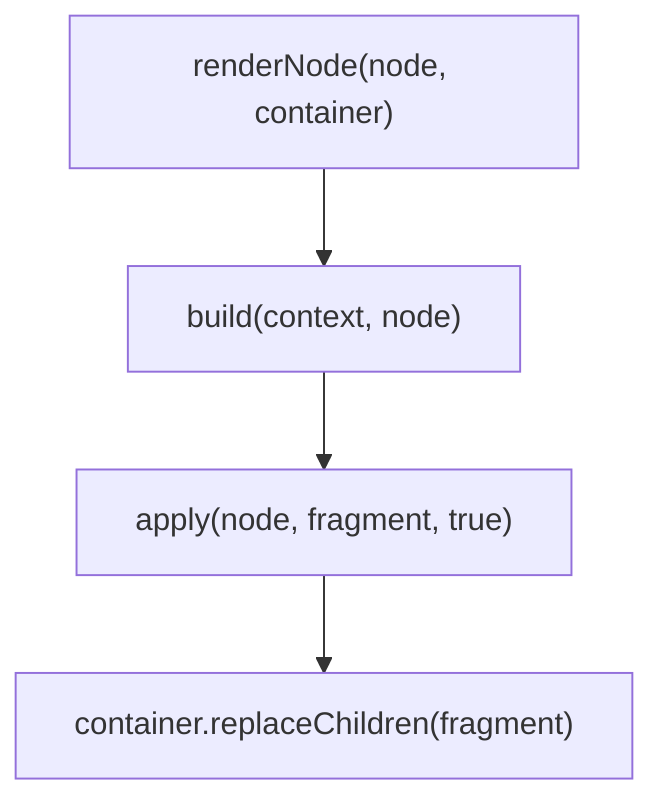
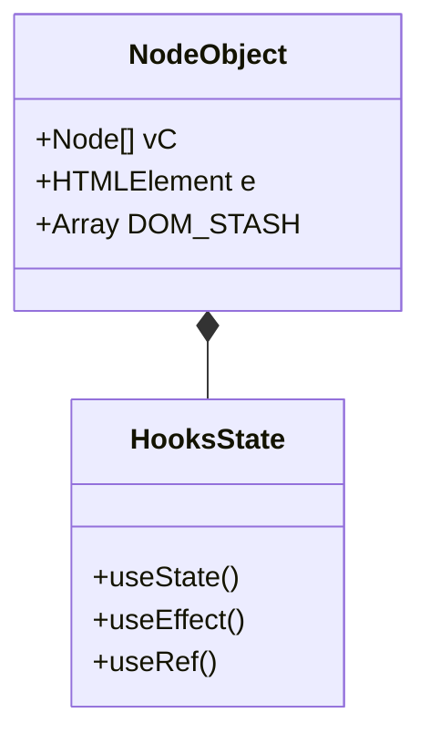

# Client Side DOM

<details>
<summary>Relevant source files</summary>

The following files were used as context for generating this wiki page:

- [src/jsx/dom/render.ts](https://github.com/honojs/hono/blob/main/src/jsx/dom/render.ts)
- [src/jsx/context.ts](https://github.com/honojs/hono/blob/main/src/jsx/context.ts)
- [src/client/client.ts](https://github.com/honojs/hono/blob/main/src/client/client.ts)
- [src/jsx/components.ts](https://github.com/honojs/hono/blob/main/src/jsx/components.ts)
- [src/jsx/hooks/index.ts](https://github.com/honojs/hono/blob/main/src/jsx/hooks/index.ts)
- [src/jsx/base.ts](https://github.com/honojs/hono/blob/main/src/jsx/base.ts)
- [src/jsx/streaming.ts](https://github.com/honojs/hono/blob/main/src/jsx/streaming.ts)
- [src/jsx/dom/client.ts](https://github.com/honojs/hono/blob/main/src/jsx/dom/client.ts)
- [src/jsx/dom/intrinsic-element/components.ts](https://github.com/honojs/hono/blob/main/src/jsx/dom/intrinsic-element/components.ts)
- [src/context.ts](https://github.com/honojs/hono/blob/main/src/context.ts)
- [src/middleware/jsx-renderer/index.ts](https://github.com/honojs/hono/blob/main/src/middleware/jsx-renderer/index.ts)
- [src/jsx/intrinsic-element/components.ts](https://github.com/honojs/hono/blob/main/src/jsx/intrinsic-element/components.ts)
- [README.md](https://github.com/honojs/hono/blob/main/README.md)
- [src/jsx/jsx-runtime.ts](https://github.com/honojs/hono/blob/main/src/jsx/jsx-runtime.ts)
- [src/jsx/dom/css.ts](https://github.com/honojs/hono/blob/main/src/jsx/dom/css.ts)
- [src/jsx/index.ts](https://github.com/honojs/hono/blob/main/src/jsx/index.ts)
- [src/jsx/dom/index.ts](https://github.com/honojs/hono/blob/main/src/jsx/dom/index.ts)
- [src/jsx/dom/server.ts](https://github.com/honojs/hono/blob/main/src/jsx/dom/server.ts)
- [src/jsx/dom/jsx-runtime.ts](https://github.com/honojs/hono/blob/main/src/jsx/dom/jsx-runtime.ts)
- [src/hono-base.ts](https://github.com/honojs/hono/blob/main/src/hono-base.ts)
- [src/jsx/dom/jsx-dev-runtime.ts](https://github.com/honojs/hono/blob/main/src/jsx/dom/jsx-dev-runtime.ts)
- [src/utils/html.ts](https://github.com/honojs/hono/blob/main/src/utils/html.ts)
- [src/jsx/jsx-dev-runtime.ts](https://github.com/honojs/hono/blob/main/src/jsx/jsx-dev-runtime.ts)
- [src/jsx/dom/components.ts](https://github.com/honojs/hono/blob/main/src/jsx/dom/components.ts)
- [src/jsx/dom/hooks/index.ts](https://github.com/honojs/hono/blob/main/src/jsx/dom/hooks/index.ts)
- [src/jsx/types.ts](https://github.com/honojs/hono/blob/main/src/jsx/types.ts)
- [src/index.ts](https://github.com/honojs/hono/blob/main/src/index.ts)
- [runtime-tests/deno-jsx/deno.react-jsx.json](https://github.com/honojs/hono/blob/main/runtime-tests/deno-jsx/deno.react-jsx.json)
- [src/jsx/intrinsic-elements.ts](https://github.com/honojs/hono/blob/main/src/jsx/intrinsic-elements.ts)
</details>

The Client Side DOM subsystem in Hono provides a high-performance, lightweight mechanism for rendering and updating JSX-defined user interfaces directly within the browser. Unlike server-side rendering, which serializes JSX to static HTML strings, this subsystem maintains a virtual structure in memory, allowing for reactive updates and efficient manipulation of actual DOM nodes without needing a full re-render of the container.

This system is designed specifically for performance-constrained environments. By leveraging `try/catch` for attribute validation rather than regex lookups and utilizing `WeakMap` for cache storage (such as ref cleanup), it minimizes overhead. It manages the full lifecycle of components, including effect handling (`useEffect`, `useLayoutEffect`), state management, and reconciliation of dynamic children, while maintaining seamless integration with standard browser DOM APIs.

The subsystem fits into the Hono architecture as a "client-side hydration/rendering engine." When utilized through `hydrateRoot` or `createRoot`, it takes a virtual representation of the component tree and maps it to the actual DOM. It serves as the counterpart to Hono's streaming server-side JSX renderer, bridging the gap between server-side HTML and client-side interactivity.

## Data Structures

The core data structure in the DOM renderer is a type union defining virtual nodes as either a `NodeString` (representing static text content) or a `NodeObject` (representing a virtual element structure with associated props, state, and life-cycle flags). These structures work together under the unified `Node` type to track changes and perform efficient DOM synchronization.

| Field | Type | Purpose |
| :--- | :--- | :--- |
| `pP` | `Props \| undefined` | Previous props of a `NodeObject` used for property-level diffing. |
| `vC` | `Node[]` | Virtual DOM children (current array). |
| `c` | `Container \| undefined` | The host browser container (`HTMLElement` or `DocumentFragment`). |
| `e` | `SupportedElement \| Text \| undefined` | The actual browser DOM element or text node rendered in the document. |
| `s` | `boolean \| undefined` | Skip build and apply flag used for performance optimization. |

Sources: [src/jsx/dom/render.ts:34-80](https://github.com/honojs/hono/blob/main/src/jsx/dom/render.ts#L34-L80)

## Rendering and Patching Mechanism

The rendering flow uses a recursive `build` process followed by an `apply` process. `build` constructs the tree, calculating what needs to change, while `apply` synchronizes this state with the browser's real DOM.


Sources: [src/jsx/dom/render.ts:782-793](https://github.com/honojs/hono/blob/main/src/jsx/dom/render.ts#L782-L793)

When updating a component, the `update` function handles re-renders efficiently. If multiple updates occur simultaneously for the same `NodeObject`, it uses an internal `updateMap` to ensure only the final state is applied, avoiding unnecessary intermediate rendering cycles.

Sources: [src/jsx/dom/render.ts:739-760](https://github.com/honojs/hono/blob/main/src/jsx/dom/render.ts#L739-L760)

> [!TIP]
> The subsystem uses `requestAnimationFrame` for `useEffect` execution to ensure browser-consistent timing for side effects, keeping them out of the synchronous render path.

Sources: [src/jsx/dom/render.ts:475-478](https://github.com/honojs/hono/blob/main/src/jsx/dom/render.ts#L475-L478)

## Lifecycle and Hook Management

The system maintains a stateful connection between components and their hooks via the `DOM_STASH` key within the `NodeObject` instances. This stash stores hook data (state, effects, refs). During the build process, index pointers are reset to ensure hooks are called in the same sequence, a standard requirement for React-like hooks APIs.

Sources: [src/jsx/dom/render.ts:55-64](https://github.com/honojs/hono/blob/main/src/jsx/dom/render.ts#L55-L64)


Sources: [src/jsx/hooks/index.ts:1-20](https://github.com/honojs/hono/blob/main/src/jsx/hooks/index.ts#L1-L20)

## Error Handling Boundaries

Hono's DOM renderer uses an error handler pattern to catch and handle component crashes. If a component throws during `build`, the system climbs the `buildDataStack` to locate the nearest `NodeObject` holding error handling configurations.

Sources: [src/jsx/dom/render.ts:610-618](https://github.com/honojs/hono/blob/main/src/jsx/dom/render.ts#L610-L618)

1. **Locate Boundary:** The renderer tracks boundaries in `context[5]` (the error handler stack).

Sources: [src/jsx/dom/render.ts:511-511](https://github.com/honojs/hono/blob/main/src/jsx/dom/render.ts#L511-L511)

2. **Fallback Rendering:** If a boundary exists, the renderer switches the node's virtual children to the fallback result provided by the boundary. If the boundary allows (or context is not low-priority), it triggers an immediate `apply` to clear the corrupted UI and show the fallback.

> [!CAUTION]
> If a boundary is found but cannot trigger an immediate synchronous update, the error may bubble up to the global scope.

Sources: [src/jsx/dom/render.ts:620-657](https://github.com/honojs/hono/blob/main/src/jsx/dom/render.ts#L620-L657)

## Call-Chain Execution: Component Update

When a component state is updated (e.g., via `useState`), the following path is triggered:

1.  `useState` update callback triggers `update(context, node)`.
2.  `update` retrieves or creates a `promise` from `updateMap`.
3.  The scheduled task in `updateMap` calls `updateSync(context, node)`.
4.  `updateSync` pushes context values and calls `build(context, node)`.
5.  `build` recursively updates the virtual tree.
6.  `apply` executes the actual `appendChild` or `insertBefore` DOM operations on the `NodeObject`.

Sources: [src/jsx/dom/render.ts:739-760](https://github.com/honojs/hono/blob/main/src/jsx/dom/render.ts#L739-L760)

## Design Trade-offs

| Choice | Benefit | Cost |
| :--- | :--- | :--- |
| `WeakMap` for Hooks/Refs | Automatic memory cleanup when elements unmount | Slight lookup overhead versus direct property access |
| `try/catch` for Attributes | Fast runtime execution for valid attributes | Small performance penalty if native DOM throws invalid character errors |
| Single-Tree Build | Simplifies reconciliation logic | More complex recursion during component updates |

Sources: [src/jsx/dom/render.ts:158-163](https://github.com/honojs/hono/blob/main/src/jsx/dom/render.ts#L158-L163)

## Worked Example: Hydration

The following example demonstrates how a developer initializes the Hono DOM renderer.

```typescript
import { createRoot } from 'hono/jsx/dom/client';
import { useState } from 'hono/jsx';

// Define a simple component
const App = () => {
  const [count, setCount] = useState(0);
  return (
    <button onClick={() => setCount(c => c + 1)}>
      Count: {count}
    </button>
  );
};

// Mount the root to the DOM
const root = createRoot(document.getElementById('app')!);
root.render(<App />);
```

Sources: [src/jsx/dom/client.ts:23-59](https://github.com/honojs/hono/blob/main/src/jsx/dom/client.ts#L23-L59)

## Related

- [[JSX Runtime]]
