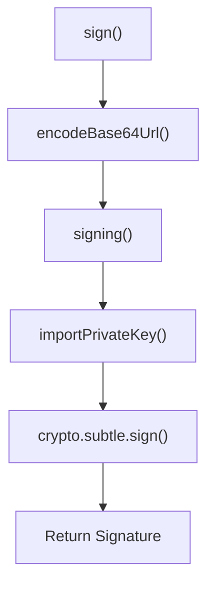

# Cryptography and JWT

<details>
<summary>Relevant source files</summary>

The following files were used as context for generating this wiki page:

- [src/utils/jwt/jwt.ts](https://github.com/honojs/hono/blob/main/src/utils/jwt/jwt.ts)
- [src/middleware/secure-headers/secure-headers.ts](https://github.com/honojs/hono/blob/main/src/middleware/secure-headers/secure-headers.ts)
- [package.json](https://github.com/honojs/hono/blob/main/package.json)
- [src/middleware/jwt/jwt.ts](https://github.com/honojs/hono/blob/main/src/middleware/jwt/jwt.ts)
- [src/middleware/jwk/jwk.ts](https://github.com/honojs/hono/blob/main/src/middleware/jwk/jwk.ts)
- [src/adapter/aws-lambda/handler.ts](https://github.com/honojs/hono/blob/main/src/adapter/aws-lambda/handler.ts)
- [src/utils/jwt/jws.ts](https://github.com/honojs/hono/blob/main/src/utils/jwt/jws.ts)
- [jsr.json](https://github.com/honojs/hono/blob/main/jsr.json)
- [src/middleware/bearer-auth/index.ts](https://github.com/honojs/hono/blob/main/src/middleware/bearer-auth/index.ts)
- [src/utils/cookie.ts](https://github.com/honojs/hono/blob/main/src/utils/cookie.ts)
- [src/middleware/jwk/keys.test.json](https://github.com/honojs/hono/blob/main/src/middleware/jwk/keys.test.json)
- [src/middleware/csrf/index.ts](https://github.com/honojs/hono/blob/main/src/middleware/csrf/index.ts)
- [src/utils/jwt/index.ts](https://github.com/honojs/hono/blob/main/src/utils/jwt/index.ts)
- [src/utils/crypto.ts](https://github.com/honojs/hono/blob/main/src/utils/crypto.ts)
- [src/middleware/jwt/index.ts](https://github.com/honojs/hono/blob/main/src/middleware/jwt/index.ts)
- [src/middleware/etag/digest.ts](https://github.com/honojs/hono/blob/main/src/middleware/etag/digest.ts)
- [src/utils/jwt/jwa.ts](https://github.com/honojs/hono/blob/main/src/utils/jwt/jwa.ts)
- [src/utils/jwt/types.ts](https://github.com/honojs/hono/blob/main/src/utils/jwt/types.ts)
- [src/middleware/jwk/index.ts](https://github.com/honojs/hono/blob/main/src/middleware/jwk/index.ts)
- [src/utils/buffer.ts](https://github.com/honojs/hono/blob/main/src/utils/buffer.ts)
- [src/utils/jwt/utf8.ts](https://github.com/honojs/hono/blob/main/src/utils/jwt/utf8.ts)
- [src/helper/cookie/index.ts](https://github.com/honojs/hono/blob/main/src/helper/cookie/index.ts)
- [src/utils/basic-auth.ts](https://github.com/honojs/hono/blob/main/src/utils/basic-auth.ts)
- [src/middleware/secure-headers/index.ts](https://github.com/honojs/hono/blob/main/src/middleware/secure-headers/index.ts)
- [src/utils/encode.ts](https://github.com/honojs/hono/blob/main/src/utils/encode.ts)
- [src/adapter/netlify/mod.ts](https://github.com/honojs/hono/blob/main/src/adapter/netlify/mod.ts)
</details>

The Cryptography and JWT subsystem in Hono provides a robust, standard-compliant implementation for handling JSON Web Tokens (JWT) and JSON Web Signatures (JWS). By leveraging the Web Crypto API, this subsystem enables secure token generation, verification, and authentication within edge-native and serverless environments. It solves the critical need for stateless authentication, ensuring that data integrity and identity claims can be validated efficiently without persistent session storage.

Beyond simple token manipulation, the subsystem includes specialized middleware for JWT-based and JWK-based (JSON Web Key) authentication, ensuring that security best practices—such as algorithm validation to prevent confusion attacks—are enforced by default. It is designed to work seamlessly with Hono’s request context, allowing developers to inject validated user payloads directly into the request pipeline.

The design emphasizes modularity, abstracting the complexities of key importation, signature verification, and standard compliance (RFC 7515, RFC 7519) from the developer. By utilizing Hono's middleware infrastructure, it integrates security checks as non-blocking, composable steps in the application lifecycle.

## Core JWT Mechanics

The JWT subsystem orchestrates token operations through a sequence that separates the header/payload encoding from the cryptographic signature calculation.

The signing flow is initialized by `sign()` (src/utils/jwt/jwt.ts:56-60), which prepares the payload and header for serialization.

Encoding is handled via `encodeJwtPart()` (src/utils/jwt/jwt.ts:31-32), which performs `JSON.stringify` followed by Base64URL encoding, ensuring the output is URL-safe by stripping padding characters.

The actual signing operation is delegated to `signing()` (src/utils/jwt/jws.ts:29-36). This function uses `importPrivateKey()` to translate the developer-provided key into a native `CryptoKey` object before executing the signature via `crypto.subtle.sign`.

Sources: [src/utils/jwt/jwt.ts:56-60](https://github.com/honojs/hono/blob/main/src/utils/jwt/jwt.ts#L56-L60)
Sources: [src/utils/jwt/jwt.ts:31-32](https://github.com/honojs/hono/blob/main/src/utils/jwt/jwt.ts#L31-L32)
Sources: [src/utils/jwt/jws.ts:29-36](https://github.com/honojs/hono/blob/main/src/utils/jwt/jws.ts#L29-L36)


Sources: [src/utils/jwt/jwt.ts:56-75](https://github.com/honojs/hono/blob/main/src/utils/jwt/jwt.ts#L56-L75), [src/utils/jwt/jws.ts:29-37](https://github.com/honojs/hono/blob/main/src/utils/jwt/jws.ts#L29-L37)

## Call Chain: Verifying a Public Key

The verification process is hardened to ensure that only legitimate, extractable, or properly typed keys are used. When verifying a token using an existing `CryptoKey`, the system ensures it can access the public key material if the key is stored as a private/secret type.

- **Step 1:** `verifying()` (src/utils/jwt/jws.ts:39-47) is called by `verify()` to start the signature verification.
- **Step 2:** `importPublicKey()` (src/utils/jwt/jws.ts:78-105) handles the key material. If the provided `key` is a `CryptoKey` that is a private key, it calls `exportPublicJwkFrom()` to generate a usable public JWK for the verification operation.
- **Step 3:** `exportPublicJwkFrom()` (src/utils/jwt/jws.ts:108-120) enforces key extractability, ensuring that the system is not attempting to extract data from an invalid or non-extractable key object.

Sources: [src/utils/jwt/jws.ts:39-47](https://github.com/honojs/hono/blob/main/src/utils/jwt/jws.ts#L39-L47)
Sources: [src/utils/jwt/jws.ts:78-105](https://github.com/honojs/hono/blob/main/src/utils/jwt/jws.ts#L78-L105)
Sources: [src/utils/jwt/jws.ts:108-120](https://github.com/honojs/hono/blob/main/src/utils/jwt/jws.ts#L108-L120)

## Security Invariants and Guards

> [!WARNING]
> During JWK verification, symmetric algorithms like `HS256`, `HS384`, and `HS512` are explicitly rejected to prevent "Algorithm Confusion" attacks (see src/utils/jwt/jwt.ts:219-221). Developers must provide an `allowedAlgorithms` list that contains only asymmetric algorithms.

> [!CAUTION]
> The `verifyWithJwks` implementation requires that the header includes a `kid` (Key ID). If the token header lacks a `kid`, `JwtHeaderRequiresKid` is thrown, preventing verification against an ambiguous key set (see src/utils/jwt/jwt.ts:214-216).

Sources: [src/utils/jwt/jwt.ts:214-221](https://github.com/honojs/hono/blob/main/src/utils/jwt/jwt.ts#L214-L221)

## Public API Usage Example

The Hono JWT middleware provides a simple way to protect routes. Here is how to use it with a secret key:

```typescript
import { Hono } from 'hono'
import { jwt } from 'hono/jwt'

const app = new Hono()

// Protect /api/* routes
app.use(
  '/api/*',
  jwt({
    secret: 'super-secret-key-123',
    alg: 'HS256',
  })
)

app.get('/api/data', (c) => {
  const payload = c.get('jwtPayload') // Access the verified payload
  return c.json({ data: 'Protected content', user: payload.sub })
})
```
Sources: [src/middleware/jwt/jwt.ts:35-51](https://github.com/honojs/hono/blob/main/src/middleware/jwt/jwt.ts#L35-L51)

## Supported Algorithms

The library supports a wide range of cryptographic algorithms for signing and verifying tokens, mapped to the Web Crypto API.

| Algorithm | Type | Description |
| :--- | :--- | :--- |
| `HS256` | Symmetric | HMAC with SHA-256 |
| `RS256` | Asymmetric | RSA-PKCS1-v1_5 with SHA-256 |
| `PS256` | Asymmetric | RSA-PSS with SHA-256 |
| `ES256` | Asymmetric | ECDSA with SHA-256 (P-256) |
| `EdDSA` | Asymmetric | Ed25519 |

Sources: [src/utils/jwt/jwa.ts:7-21](https://github.com/honojs/hono/blob/main/src/utils/jwt/jwa.ts#L7-L21)
Sources: [src/utils/jwt/jws.ts:122-224](https://github.com/honojs/hono/blob/main/src/utils/jwt/jws.ts#L122-L224)

## Design Trade-offs

| Design Choice | Benefit | Cost |
| :--- | :--- | :--- |
| Web Crypto API reliance | High performance, secure, platform-native | Depends on runtime availability of `crypto.subtle` |
| Base64URL encoding | Standard-compliant (RFC 7515) | Requires custom `encode`/`decode` logic for URL safety |
| Middleware-based verification | Composable, reduces boilerplate | Increased complexity in handling asynchronous `next()` chains |

Sources: [src/middleware/jwt/jwt.ts:76-157](https://github.com/honojs/hono/blob/main/src/middleware/jwt/jwt.ts#L76-L157)
Sources: [src/utils/encode.ts:6-11](https://github.com/honojs/hono/blob/main/src/utils/encode.ts#L6-L11)
Sources: [src/utils/jwt/jws.ts:54-105](https://github.com/honojs/hono/blob/main/src/utils/jwt/jws.ts#L54-L105)

## Related

- [[Built In Middleware]]
