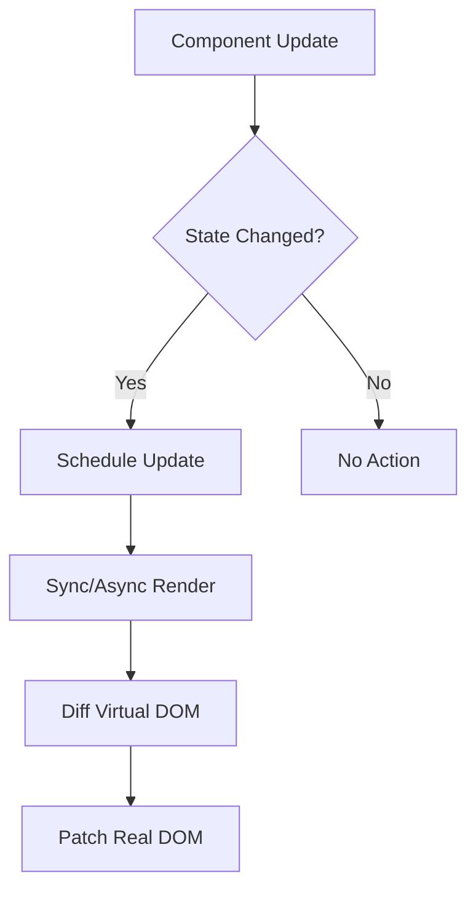
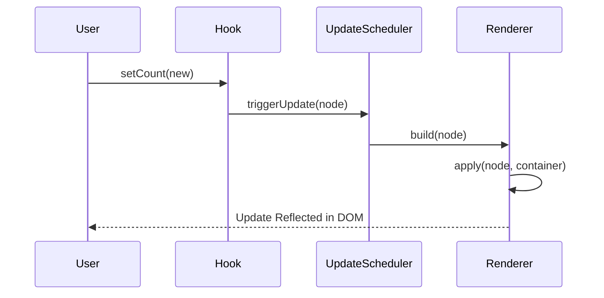

# JSX Runtime

<details>
<summary>Relevant source files</summary>

The following files were used as context for generating this wiki page:

- [src/jsx/dom/render.ts](https://github.com/honojs/hono/blob/main/src/jsx/dom/render.ts)
- [src/jsx/context.ts](https://github.com/honojs/hono/blob/main/src/jsx/context.ts)
- [src/context.ts](https://github.com/honojs/hono/blob/main/src/context.ts)
- [src/jsx/components.ts](https://github.com/honojs/hono/blob/main/src/jsx/components.ts)
- [src/jsx/base.ts](https://github.com/honojs/hono/blob/main/src/jsx/base.ts)
- [src/jsx/streaming.ts](https://github.com/honojs/hono/blob/main/src/jsx/streaming.ts)
- [src/jsx/dom/intrinsic-element/components.ts](https://github.com/honojs/hono/blob/main/src/jsx/dom/intrinsic-element/components.ts)
- [src/jsx/hooks/index.ts](https://github.com/honojs/hono/blob/main/src/jsx/hooks/index.ts)
- [src/jsx/intrinsic-element/components.ts](https://github.com/honojs/hono/blob/main/src/jsx/intrinsic-element/components.ts)
- [src/jsx/jsx-runtime.ts](https://github.com/honojs/hono/blob/main/src/jsx/jsx-runtime.ts)
- [src/middleware/jsx-renderer/index.ts](https://github.com/honojs/hono/blob/main/src/middleware/jsx-renderer/index.ts)
- [src/jsx/intrinsic-elements.ts](https://github.com/honojs/hono/blob/main/src/jsx/intrinsic-elements.ts)
- [src/jsx/dom/client.ts](https://github.com/honojs/hono/blob/main/src/jsx/dom/client.ts)
- [src/jsx/dom/jsx-dev-runtime.ts](https://github.com/honojs/hono/blob/main/src/jsx/dom/jsx-dev-runtime.ts)
- [src/jsx/jsx-dev-runtime.ts](https://github.com/honojs/hono/blob/main/src/jsx/jsx-dev-runtime.ts)
- [src/jsx/dom/css.ts](https://github.com/honojs/hono/blob/main/src/jsx/dom/css.ts)
- [src/jsx/dom/server.ts](https://github.com/honojs/hono/blob/main/src/jsx/dom/server.ts)
- [src/utils/html.ts](https://github.com/honojs/hono/blob/main/src/utils/html.ts)
- [src/jsx/index.ts](https://github.com/honojs/hono/blob/main/src/jsx/index.ts)
- [src/jsx/dom/index.ts](https://github.com/honojs/hono/blob/main/src/jsx/dom/index.ts)
- [src/jsx/dom/context.ts](https://github.com/honojs/hono/blob/main/src/jsx/dom/context.ts)
- [src/helper/css/index.ts](https://github.com/honojs/hono/blob/main/src/helper/css/index.ts)
</details>

The Hono JSX Runtime is a lightweight, performant engine designed to bridge the gap between declarative JSX syntax and imperative DOM manipulation. Unlike traditional heavy-weight virtual DOM implementations, it focuses on direct, incremental rendering and efficient state updates, making it ideal for edge-computing environments where bundle size and cold-start performance are critical.

At its core, the runtime exists to enable a unified development experience across both Server-Side Rendering (SSR) and Client-Side DOM hydration. By abstracting away the platform-specific details of element creation and attribute updates, it allows developers to write consistent code that Hono can execute as either an HTML stream on the server or an interactive component tree in the browser.

The architecture emphasizes modularity and "lazy" evaluation. It distinguishes strictly between the functional definition of a component and the actual node representation used during reconciliation. This separation ensures that the runtime can effectively manage asynchronous boundaries—such as Suspense boundaries or Error Boundaries—while maintaining a predictable lifecycle for state hooks and context providers.

## Core Node Lifecycle and Reconciliation

The DOM renderer in Hono operates on a tree of nodes representing components and intrinsic elements. When the application renders, the runtime orchestrates a sequence involving build, diffing, and application stages.

Sources: [src/jsx/dom/render.ts:41-80](https://github.com/honojs/hono/blob/main/src/jsx/dom/render.ts#L41-L80)

1. **Build Stage (`build`)**: The runtime processes the component tree, invoking functions and resolving props to build a virtual representation of the current component structure.
2. **Reconciliation**: During updates, the runtime compares the new virtual tree against existing nodes. It optimizes for performance by tracking node keys and identifying removals (`vR`) versus updates.
3. **Application (`apply`)**: Changes are reflected in the actual browser DOM. The runtime uses a set of update priorities (`PendingType`) to manage updates asynchronously, ensuring that high-priority interactions remain responsive.

Sources: [src/jsx/dom/render.ts:497-665](https://github.com/honojs/hono/blob/main/src/jsx/dom/render.ts#L497-L665)

> [!IMPORTANT]
> The build stack acts as a guard for context during component execution. If an update occurs, the runtime pushes the current context onto the stack, executes the component, and pops the context in a `finally` block to prevent memory leaks or context contamination across asynchronous boundaries.

Sources: [src/jsx/dom/render.ts:106-106](https://github.com/honojs/hono/blob/main/src/jsx/dom/render.ts#L106-L106), [src/jsx/dom/render.ts:286-290](https://github.com/honojs/hono/blob/main/src/jsx/dom/render.ts#L286-L290)

## Asynchronous Context and Render Scoping

Hono’s context system utilizes a per-render store Map to isolate values across multiple concurrent requests. This prevents cross-request data leaks, which is essential in a server-side environment where a single process might handle multiple incoming requests.

Sources: [src/jsx/context.ts:15-32](https://github.com/honojs/hono/blob/main/src/jsx/context.ts#L15-L32)

When a context is accessed, the runtime checks for a native `AsyncLocalStorage`. If present, it uses this to propagate context values seamlessly across asynchronous `await` calls. If absent (e.g., in standard browser environments), it falls back to a synchronous store.

Sources: [src/jsx/context.ts:161-189](https://github.com/honojs/hono/blob/main/src/jsx/context.ts#L161-L189)

> [!NOTE]
> When `AsyncLocalStorage` is unavailable, reading from a context *after* an `await` point in an async component will revert to the default context value, as the synchronous fallback store cannot track execution across event-loop yields.

Sources: [src/jsx/context.ts:31-31](https://github.com/honojs/hono/blob/main/src/jsx/context.ts#L31-L31), [src/jsx/context.ts:73-80](https://github.com/honojs/hono/blob/main/src/jsx/context.ts#L73-L80)

## Execution Walkthrough: Error Boundary Fallback

The `ErrorBoundary` component manages errors during rendering, providing a path to recovery. The following execution flow demonstrates how an error during child rendering triggers a fallback:

1. `ErrorBoundary` component initiates.
2. It calls `childrenToString` to evaluate the children.
3. If an error is thrown, the `catch` block executes `renderFallback(error)`.
4. `renderFallback` uses `resolveFallbackStr` to asynchronously load the user-defined `fallback` content.
5. The runtime then re-triggers the build process using the recovered fallback node.

Sources: [src/jsx/components.ts:54-126](https://github.com/honojs/hono/blob/main/src/jsx/components.ts#L54-L126)

## State Management and Hook Lifecycle

The `useState` hook maintains internal component state using the `DOM_STASH` property of a virtual DOM node. Each node holds an array of hook states.

Sources: [src/jsx/hooks/index.ts:182-195](https://github.com/honojs/hono/blob/main/src/jsx/hooks/index.ts#L182-L195)

- **Hook Indexing**: The current hook index counter tracks the hooks, ensuring that `useState` calls within a component are always matched to the same state reference during re-renders.
- **Update Scheduling**: When `setState` is invoked, it checks if the new value is different using `Object.is`. If changed, it schedules an update via the global `update()` function, which re-queues the component for a sync or async render cycle.

Sources: [src/jsx/hooks/index.ts:197-243](https://github.com/honojs/hono/blob/main/src/jsx/hooks/index.ts#L197-L243)

| Hook | Purpose | Data Location |
| :--- | :--- | :--- |
| `useState` | Persistent component state | `node[DOM_STASH][1][STASH_STATE]` |
| `useEffect` | Side effect management | `node[DOM_STASH][1][STASH_EFFECT]` |
| `useCallback` | Memoized function references | `node[DOM_STASH][1][STASH_CALLBACK]` |

Sources: [src/jsx/hooks/index.ts:8-12](https://github.com/honojs/hono/blob/main/src/jsx/hooks/index.ts#L8-L12)

## Design Trade-offs

| Design Choice | Benefit | Cost |
| :--- | :--- | :--- |
| **Try/Catch Attribute Update** | Highly performant for valid DOM attributes. | Less upfront validation compared to strict SSR models. |
| **WeakMap for Update States** | Prevents memory leaks by allowing GCs on unmounted nodes. | Requires explicit cleanup of stashes to avoid circular refs. |
| **Flattened `children` array** | Simplifies tree traversal and recursive rendering. | Can cause overhead for deeply nested structures due to array creation. |

Sources: [src/jsx/dom/render.ts:158-163](https://github.com/honojs/hono/blob/main/src/jsx/dom/render.ts#L158-L163), [src/jsx/dom/render.ts:735-738](https://github.com/honojs/hono/blob/main/src/jsx/dom/render.ts#L735-L738)

## Worked Example: Custom State Component

This example demonstrates how to implement a component using the native runtime hooks:

Sources: [src/jsx/hooks/index.ts:182-243](https://github.com/honojs/hono/blob/main/src/jsx/hooks/index.ts#L182-L243)

```typescript
import { useState, useEffect } from 'hono/jsx/dom'

const Counter = () => {
  const [count, setCount] = useState(0)

  useEffect(() => {
    console.log('Count changed:', count)
  }, [count])

  return (
    <button onClick={() => setCount(count + 1)}>
      Count: {count}
    </button>
  )
}
```

Sources: [src/jsx/hooks/index.ts:288-293](https://github.com/honojs/hono/blob/main/src/jsx/hooks/index.ts#L288-L293)

The component uses the runtime hook registry, which maps these calls to the internal `DOM_STASH` on the node.

Sources: [src/jsx/dom/render.ts:55-65](https://github.com/honojs/hono/blob/main/src/jsx/dom/render.ts#L55-L65)

This structure ensures that when `setCount` is called, the specific node is correctly re-rendered in the DOM.

Sources: [src/jsx/dom/render.ts:740-781](https://github.com/honojs/hono/blob/main/src/jsx/dom/render.ts#L740-L781)





## Related

- [[Client Side DOM]]
- [[Streaming Rendering]]
