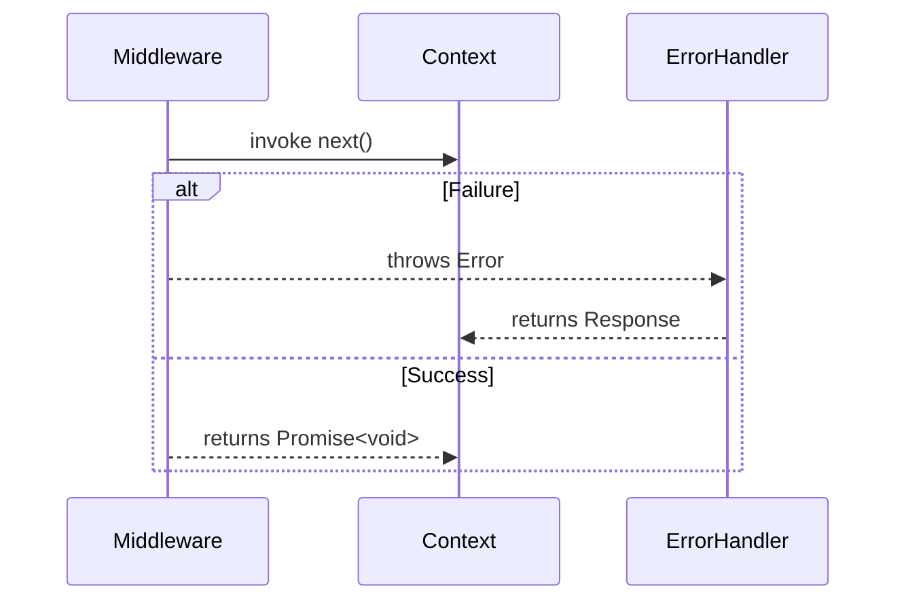

# Middleware Composition

<details>
<summary>Relevant source files</summary>

The following files were used as context for generating this wiki page:

- [src/types.ts](https://github.com/honojs/hono/blob/main/src/types.ts)
- [src/hono-base.ts](https://github.com/honojs/hono/blob/main/src/hono-base.ts)
- [src/adapter/aws-lambda/handler.ts](https://github.com/honojs/hono/blob/main/src/adapter/aws-lambda/handler.ts)
- [src/middleware/cache/index.ts](https://github.com/honojs/hono/blob/main/src/middleware/cache/index.ts)
- [src/jsx/context.ts](https://github.com/honojs/hono/blob/main/src/jsx/context.ts)
- [src/adapter/cloudflare-pages/handler.ts](https://github.com/honojs/hono/blob/main/src/adapter/cloudflare-pages/handler.ts)
- [src/context.ts](https://github.com/honojs/hono/blob/main/src/context.ts)
</details>

Middleware composition is the structural backbone of Hono, enabling the construction of sophisticated request-response pipelines through the serial execution of asynchronous handlers. By adopting a functional approach to request handling, Hono allows developers to chain multiple `MiddlewareHandler` or `Handler` functions, each capable of intercepting, modifying, or terminating the request lifecycle. This architecture solves the problem of cross-cutting concerns (such as authentication, logging, or caching) by abstracting them into discrete, reusable units that can be applied to specific routes or globally across an entire application.

The design decision to utilize a composition-based model is grounded in its simplicity and familiarity. Each handler receives a `Context` object and a `next()` function, creating a "middleware stack" where each layer determines whether to pass control to the subsequent layer. This ensures that middleware can perform actions both before and after the downstream handlers (including the final route handler) have executed. The interaction with adjacent components, such as the Router and Context, allows for a unified interface where middleware can influence the request path, the resulting Response object, or the execution environment itself.

## The Core Composition Mechanism
At the heart of the subsystem is the `compose` function (used by `Hono` dispatch). The composition logic processes an array of handlers, transforming them into a single, unified asynchronous function. This execution chain is designed to be linear and predictable: each handler must invoke `next()` to proceed to the subsequent handler in the stack. If a handler returns a `Response` directly, the chain is effectively short-circuited.

```mermaid
flowchart TD
    A["Request"] --> B["Middleware 1"]
    B -->|next()| C["Middleware 2"]
    C -->|next()| D["Route Handler"]
    D -->|Response| C
    C -->|Response| B
    B -->|Response| E["Final Response"]
```
Sources: [src/hono-base.ts:450-466](https://github.com/honojs/hono/blob/main/src/hono-base.ts#L450-L466)

## Handler Interface and Types
The subsystem distinguishes between `Handler` and `MiddlewareHandler`. While both accept a `Context` and a `Next` function, the `MiddlewareHandler` specifically returns `Promise<Response | void>`, explicitly signifying its role in the chain (either producing a terminal response or passing control).

| Type | Signature | Purpose |
| :--- | :--- | :--- |
| `Next` | `() => Promise<void>` | Invokes the next handler in the stack. |
| `Handler` | `(c, next) => R` | Core logic or final route handler. |
| `MiddlewareHandler` | `(c, next) => Promise<R \| void>` | Interceptor that can be terminal or non-terminal. |
Sources: [src/types.ts:35-88](https://github.com/honojs/hono/blob/main/src/types.ts#L35-L88)

## Dispatch and Lifecycle Management
The `Hono` class (defined in `hono-base.ts` as `Hono`) serves as the orchestrator. During dispatch, it retrieves the matching handler list from the `Router`. If only one handler is matched, the system skips the composition overhead, directly invoking the handler.
Sources: [src/hono-base.ts:418-430](https://github.com/honojs/hono/blob/main/src/hono-base.ts#L418-L430)

When a single handler is detected, it is executed directly within a `try-catch` block, allowing for immediate error propagation to the `errorHandler` without the overhead of the composition stack.
Sources: [src/hono-base.ts:430-448](https://github.com/honojs/hono/blob/main/src/hono-base.ts#L430-L448)

> [!CAUTION]
> If a handler does not call `next()` and does not finalize the context, the middleware chain may hang or terminate without a response, leading to unexpected behavior. The `finalized` flag on the context is the primary guard against this failure.
Sources: [src/hono-base.ts:455-459](https://github.com/honojs/hono/blob/main/src/hono-base.ts#L455-L459)

## Middleware Execution and Error Handling
The composition process handles errors globally via the `errorHandler` injected during `compose`. If any handler in the stack throws an error, the error is caught, and the `errorHandler` is invoked with the current context. This ensures that even complex middleware chains remain robust and provide consistent error responses.


Sources: [src/hono-base.ts:35-42](https://github.com/honojs/hono/blob/main/src/hono-base.ts#L35-L42)
Sources: [src/hono-base.ts:450-466](https://github.com/honojs/hono/blob/main/src/hono-base.ts#L450-L466)

## Context-Scoped Storage
Middleware often needs to share data or state. The `Context` object serves as the medium for this sharing. Through `c.set()` and `c.get()`, middleware can attach variables that propagate down the chain. Additionally, for asynchronous environments, `jsx/context` implements an `AsyncLocalStorage` backed store, ensuring that state shared across `await` boundaries remains isolated to a single request/render cycle.
Sources: [src/jsx/context.ts:16-19](https://github.com/honojs/hono/blob/main/src/jsx/context.ts#L16-L19)
Sources: [src/context.ts:299-316](https://github.com/honojs/hono/blob/main/src/context.ts#L299-L316)

## Practical Implementation: The Cache Middleware
The `cache` middleware is a prime example of middleware composition. It intercepts incoming GET requests, checks a storage layer (`caches.match`), and either returns a cached response or waits for the `next()` call to populate the cache with the downstream response.

```typescript
// Basic usage of cache middleware
app.get(
  '*',
  cache({
    cacheName: 'my-app',
    cacheControl: 'max-age=3600',
  })
)
```
Sources: [src/middleware/cache/index.ts:54-62](https://github.com/honojs/hono/blob/main/src/middleware/cache/index.ts#L54-L62)
Sources: [src/middleware/cache/index.ts:138-180](https://github.com/honojs/hono/blob/main/src/middleware/cache/index.ts#L138-L180)

> [!TIP]
> Use the `wait` option in the cache middleware when working in environments where execution contexts (like `waitUntil`) are not available, ensuring the `put` promise resolves before the response is finalized.
Sources: [src/middleware/cache/index.ts:44-44](https://github.com/honojs/hono/blob/main/src/middleware/cache/index.ts#L44-L44)

## Related

- [[Application Instance]]
- [[Request Context]]
