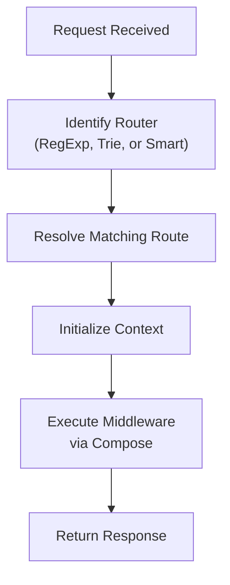
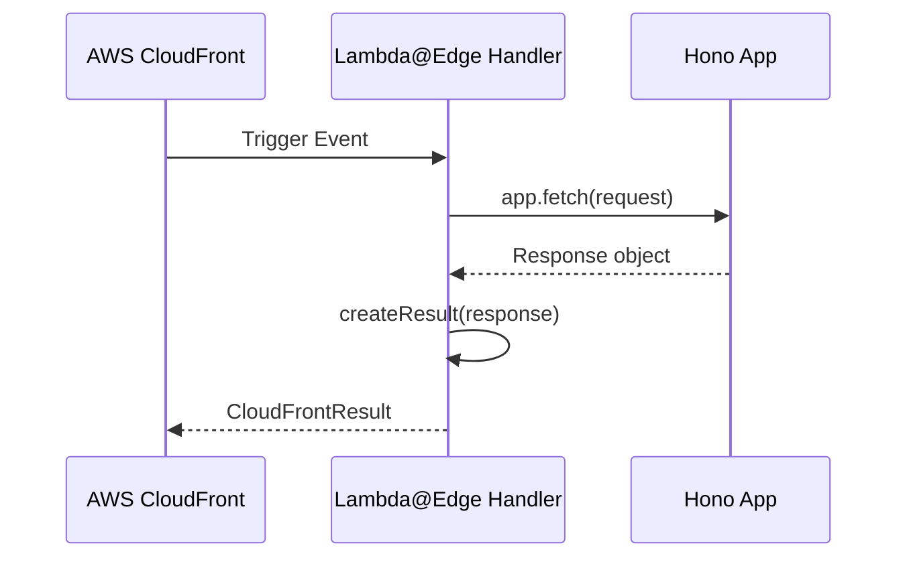

# Overview

Relevant source files

The following files were used as context for generating this wiki page:

- [src/context.ts](https://github.com/honojs/hono/blob/main/src/context.ts)
- [src/hono-base.ts](https://github.com/honojs/hono/blob/main/src/hono-base.ts)
- [src/types.ts](https://github.com/honojs/hono/blob/main/src/types.ts)
- [src/hono.ts](https://github.com/honojs/hono/blob/main/src/hono.ts)
- [src/adapter/cloudflare-pages/handler.ts](https://github.com/honojs/hono/blob/main/src/adapter/cloudflare-pages/handler.ts)
- [src/preset/quick.ts](https://github.com/honojs/hono/blob/main/src/preset/quick.ts)
- [README.md](https://github.com/honojs/hono/blob/main/README.md)
- [src/adapter/lambda-edge/handler.ts](https://github.com/honojs/hono/blob/main/src/adapter/lambda-edge/handler.ts)
- [package.json](https://github.com/honojs/hono/blob/main/package.json)

Hono is a high-performance, lightweight web framework designed to run across diverse JavaScript runtimes, including Cloudflare Workers, Node.js, Deno, Bun, and AWS Lambda. Built on standard Web APIs, it provides a consistent developer experience regardless of the hosting environment. By prioritizing zero dependencies and leveraging modern standards like the `Request` and `Response` objects, Hono offers a minimal footprint while maintaining robust performance.

The system is architected around a flexible, modular core encapsulated in the base `Hono` class representation. This core handles request routing and middleware composition, allowing developers to switch between different routing engines based on performance needs. Because the framework abstracts the underlying platform into standard interfaces, Hono applications are highly portable, enabling developers to write once and deploy across edge, serverless, and traditional server environments without modification.

Central to Hono's design is the `Context` object, which acts as the unified interface for interacting with incoming requests and building outgoing responses. This component manages state, environment variables, rendering, and header manipulation. By decoupling the routing and dispatch logic from the specific request-handling lifecycle, Hono maintains a clean, extensible API that supports complex middleware chains and typed application schemas.

## The Core Request Lifecycle
The execution flow within Hono is centered on the `fetch` method, which acts as the entry point for all incoming requests. When a request hits a Hono instance, the framework processes it through a deterministic series of stages: extracting the request path, matching it against registered routes, and dispatching to a middleware pipeline.

Sources: [src/hono-base.ts:406-411](https://github.com/honojs/hono/blob/main/src/hono-base.ts#L406-L411)

Sources: [src/hono-base.ts:418-427](https://github.com/honojs/hono/blob/main/src/hono-base.ts#L418-L427)

The framework employs a `compose` utility to orchestrate middleware. If multiple handlers match, `compose` chains them together, ensuring each subsequent execution step proceeds through the pipeline, eventually leading to a finalized response. If only a single handler exists, Hono avoids the overhead of composition, directly executing the handler for optimal performance.
Sources: [src/hono-base.ts:429-448](https://github.com/honojs/hono/blob/main/src/hono-base.ts#L429-L448)

## Routing Mechanism and Selection
Hono allows pluggable routing engines, enabling developers to trade memory or initialization speed for raw lookup speed. The `Hono` class defaults to the `SmartRouter`, which dynamically selects the best routing algorithm among available strategies.

Sources: [src/hono.ts:28-32](https://github.com/honojs/hono/blob/main/src/hono.ts#L28-L32)

- **RegExpRouter**: Efficient for complex patterns by compiling routes into a regular expression.
- **TrieRouter**: Ideal for fast lookups in large route trees.
- **LinearRouter**: Provides simple, predictable matching.

Sources: [src/hono.ts:3-5](https://github.com/honojs/hono/blob/main/src/hono.ts#L3-L5)

When routes are registered, they are stored as `RouterRoute` objects in the internal `routes` array. The selection of the winning route is handled by the specific router implementation chosen at instantiation, with registration order determining priority in cases of ambiguity.
Sources: [src/hono-base.ts:385-397](https://github.com/honojs/hono/blob/main/src/hono-base.ts#L385-L397)

## The Context Object
`Context` encapsulates the entire state of a single request/response cycle. It provides helper methods to interact with the environment (`env`), set headers, status codes, and return various response types.

Sources: [src/context.ts:293-301](https://github.com/honojs/hono/blob/main/src/context.ts#L293-L301)

| Method | Purpose |
| :--- | :--- |
| `c.json()` | Serializes an object to JSON and sets `Content-Type`. |
| `c.text()` | Renders plain text content. |
| `c.html()` | Renders HTML strings or templates. |
| `c.header()` | Sets or appends custom response headers. |
| `c.set/get` | Manages request-scoped variables. |
Sources: [src/context.ts:671-780](https://github.com/honojs/hono/blob/main/src/context.ts#L671-L780)

> [!NOTE]
> The `Context` object maintains a `finalized` property. Once a response is finalized (e.g., after calling a return method like `c.json`), attempting to modify the response body or headers may trigger re-initialization of the response instance.
Sources: [src/context.ts:317-317](https://github.com/honojs/hono/blob/main/src/context.ts#L317-L317)

## Middleware and Composition
Middleware in Hono are essentially handlers that intercept the request/response flow. They adhere to a signature that accepts the `Context` and a dispatch function to yield control to the next handler. The execution chain follows an onion-model:

1. A middleware receives `Context` and an execution handler.
2. It executes logic before dispatching control to the next step.
3. It performs cleanup or post-processing logic after the downstream handlers resolve.
Sources: [src/hono-base.ts:450-450](https://github.com/honojs/hono/blob/main/src/hono-base.ts#L450-L450)

## Adapter Architecture
Hono's cross-runtime compatibility is achieved through thin adapter layers. For example, the `Lambda@Edge` adapter transforms AWS-specific event objects into standard `Request` objects, executes the Hono application, and then converts the resulting `Response` back into the required `CloudFrontResult` format.

Sources: [src/adapter/lambda-edge/handler.ts:116-147](https://github.com/honojs/hono/blob/main/src/adapter/lambda-edge/handler.ts#L116-L147)

## Portability Design Choices
Hono's architecture makes specific design decisions to remain lightweight and platform-agnostic:

| Design Choice | Benefit | Cost |
| :--- | :--- | :--- |
| **Zero Dependencies** | Tiny bundle size, no supply chain risk | Higher maintenance of internal utilities |
| **Web Standards API** | Seamless portability across all JS runtimes | May require shims for older Node.js versions |
| **Typed Schemas** | Strong IDE support and type-safe APIs | Increased complexity in type definitions |
Sources: [package.json:1-348](https://github.com/honojs/hono/blob/main/package.json#L1-L348)

## Related

- [[Quick Start]]
- [[Project Structure]]
- [[Application Instance]]
