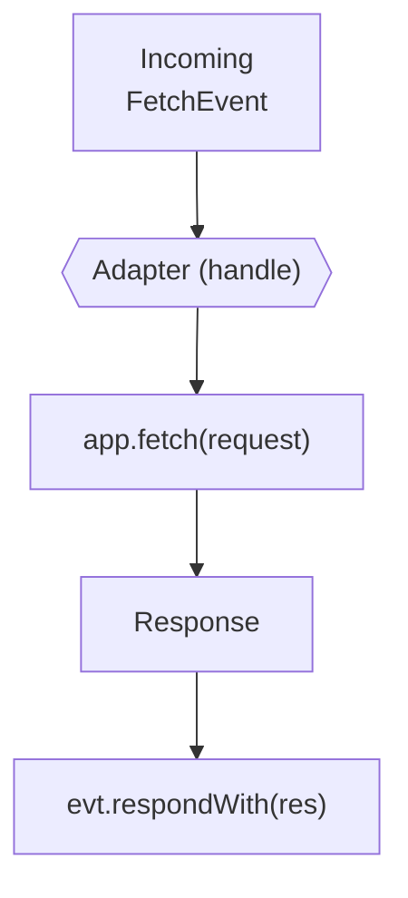
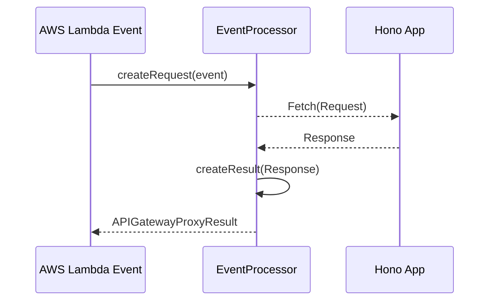

# Platform Adapters

<details>
<summary>Relevant source files</summary>

The following files were used as context for generating this wiki page:

- [src/adapter/aws-lambda/handler.ts](https://github.com/honojs/hono/blob/main/src/adapter/aws-lambda/handler.ts)
- [package.json](https://github.com/honojs/hono/blob/main/package.json)
- [src/adapter/cloudflare-pages/handler.ts](https://github.com/honojs/hono/blob/main/src/adapter/cloudflare-pages/handler.ts)
- [docs/MIGRATION.md](https://github.com/honojs/hono/blob/main/docs/MIGRATION.md)
- [src/adapter/lambda-edge/handler.ts](https://github.com/honojs/hono/blob/main/src/adapter/lambda-edge/handler.ts)
- [README.md](https://github.com/honojs/hono/blob/main/README.md)
- [src/hono-base.ts](https://github.com/honojs/hono/blob/main/src/hono-base.ts)
- [src/hono.ts](https://github.com/honojs/hono/blob/main/src/hono.ts)
- [src/preset/quick.ts](https://github.com/honojs/hono/blob/main/src/preset/quick.ts)
- [src/helper/proxy/index.ts](https://github.com/honojs/hono/blob/main/src/helper/proxy/index.ts)
- [src/adapter/bun/websocket.ts](https://github.com/honojs/hono/blob/main/src/adapter/bun/websocket.ts)
- [src/adapter/cloudflare-pages/index.ts](https://github.com/honojs/hono/blob/main/src/adapter/cloudflare-pages/index.ts)
- [src/adapter/cloudflare-workers/index.ts](https://github.com/honojs/hono/blob/main/src/adapter/cloudflare-workers/index.ts)
- [src/adapter/netlify/handler.ts](https://github.com/honojs/hono/blob/main/src/adapter/netlify/handler.ts)
- [src/helper/adapter/index.ts](https://github.com/honojs/hono/blob/main/src/helper/adapter/index.ts)
- [src/adapter/vercel/handler.ts](https://github.com/honojs/hono/blob/main/src/adapter/vercel/handler.ts)
- [src/adapter/lambda-edge/index.ts](https://github.com/honojs/hono/blob/main/src/adapter/lambda-edge/index.ts)
- [src/adapter/service-worker/index.ts](https://github.com/honojs/hono/blob/main/src/adapter/service-worker/index.ts)
- [src/adapter/deno/index.ts](https://github.com/honojs/hono/blob/main/src/adapter/deno/index.ts)
- [src/adapter/vercel/index.ts](https://github.com/honojs/hono/blob/main/src/adapter/vercel/index.ts)
- [runtime-tests/workerd/index.ts](https://github.com/honojs/hono/blob/main/runtime-tests/workerd/index.ts)
- [src/adapter/service-worker/handler.ts](https://github.com/honojs/hono/blob/main/src/adapter/service-worker/handler.ts)
- [src/adapter/netlify/index.ts](https://github.com/honojs/hono/blob/main/src/adapter/netlify/index.ts)
- [src/adapter/aws-lambda/index.ts](https://github.com/honojs/hono/blob/main/src/adapter/aws-lambda/index.ts)
- [src/adapter/cloudflare-workers/websocket.ts](https://github.com/honojs/hono/blob/main/src/adapter/cloudflare-workers/websocket.ts)
- [src/adapter/bun/index.ts](https://github.com/honojs/hono/blob/main/src/adapter/bun/index.ts)
- [src/adapter/cloudflare-pages/conninfo.ts](https://github.com/honojs/hono/blob/main/src/adapter/cloudflare-pages/conninfo.ts)
- [src/adapter/netlify/mod.ts](https://github.com/honojs/hono/blob/main/src/adapter/netlify/mod.ts)
- [src/index.ts](https://github.com/honojs/hono/blob/main/src/index.ts)
- [src/adapter/cloudflare-workers/serve-static.ts](https://github.com/honojs/hono/blob/main/src/adapter/cloudflare-workers/serve-static.ts)
</details>

Hono is built on the fundamental premise of adherence to Web Standards, specifically the `Request` and `Response` interfaces. Platform Adapters serve as the bridge between this standardized Hono core and the idiosyncratic execution environments of various cloud providers and runtimes. Because each platform (e.g., AWS Lambda, Cloudflare Workers, Vercel) triggers Hono with different event signatures and expects specific return structures, the adapter layer abstracts these differences, normalizing incoming platform-specific events into a standard `Request` and converting Hono’s `Response` into the format the platform requires.

By decoupling the framework from the runtime, Platform Adapters enable Hono’s "write once, run anywhere" philosophy. This architecture prevents core Hono logic from needing platform-specific awareness, which would otherwise lead to tightly coupled and unmaintainable code. Instead, Hono simply invokes its `app.fetch()` method, and the adapters handle the lifecycle—translation of headers, binary content encoding, streaming support, and context injection—ensuring that a Hono instance remains agnostic to whether it is running on a serverless function or a global edge worker.

## Edge Worker Adapters

Edge worker platforms like Cloudflare Workers, Pages, and Fastly Compute frequently rely on the standard `FetchEvent` or module worker exports. The Hono adapters for these environments map these natively to Hono's `app.fetch` entry point.

Sources: [src/adapter/cloudflare-workers/index.ts:1-9](https://github.com/honojs/hono/blob/main/src/adapter/cloudflare-workers/index.ts#L1-L9)

The Cloudflare Pages adapter maps `EventContext` (which provides `request`, `env`, and `waitUntil`) into Hono’s `app.fetch()` calls. It handles `MiddlewareHandler` via `handleMiddleware`, which manually constructs a `Context` instance to support `executionCtx` and environment bindings.

Sources: [src/adapter/cloudflare-pages/handler.ts:32-46](https://github.com/honojs/hono/blob/main/src/adapter/cloudflare-pages/handler.ts#L32-L46)

The Service Worker adapter utilizes `addEventListener('fetch', ...)` to intercept standard fetch events. The `handle` function wraps the application and uses `evt.respondWith()` to pass the `Response` back to the browser's service worker lifecycle.

Sources: [src/adapter/service-worker/handler.ts:18-37](https://github.com/honojs/hono/blob/main/src/adapter/service-worker/handler.ts#L18-L37)

> [!TIP]
> Always prefer "Module Worker" mode with `export default app` over legacy `fire()`/Service Worker mode. The module-based entry point is the standard and provides better type safety and integration with modern tooling.

Sources: [src/adapter/service-worker/index.ts:12-27](https://github.com/honojs/hono/blob/main/src/adapter/service-worker/index.ts#L12-L27)



Sources: [src/adapter/service-worker/handler.ts:25-36](https://github.com/honojs/hono/blob/main/src/adapter/service-worker/handler.ts#L25-L36)

## Local Runtime Adapters

Local runtimes like Bun and Deno aim for high-performance, developer-friendly interfaces. Unlike serverless platforms, these typically expose a server object directly.

Sources: [src/adapter/bun/server.ts:1-1](https://github.com/honojs/hono/blob/main/src/adapter/bun/server.ts#L1-L1), [src/adapter/deno/index.ts:1-9](https://github.com/honojs/hono/blob/main/src/adapter/deno/index.ts#L1-L9)

The Bun adapter provides a server-agnostic interface (`getBunServer`) and specialized WebSocket handling. It defines `upgradeWebSocket` to bridge Bun's `server.upgrade` API with Hono's unified `WSContext`, enabling consistent WebSocket patterns.

Sources: [src/adapter/bun/websocket.ts:48-74](https://github.com/honojs/hono/blob/main/src/adapter/bun/websocket.ts#L48-L74)

The Deno adapter provides utilities like `serveStatic` and specialized connectors. It is designed to work with Deno’s standard runtime while adhering to Hono’s shared architecture, allowing developers to import adapters via `jsr:@hono/hono` or direct imports.

Sources: [src/adapter/deno/index.ts:6-9](https://github.com/honojs/hono/blob/main/src/adapter/deno/index.ts#L6-L9)

## Serverless Adapters

Serverless environments like AWS Lambda and Vercel are characterized by complex, non-standard event objects (e.g., API Gateway Proxy V1/V2, ALB events). These adapters implement "Event Processors."

Sources: [src/adapter/aws-lambda/handler.ts:278-289](https://github.com/honojs/hono/blob/main/src/adapter/aws-lambda/handler.ts#L278-L289)

### AWS Lambda Adapter
The AWS Lambda adapter handles disparate event shapes by delegating to specific `EventProcessor` classes. The `handle` function identifies the processor (e.g., `ALBProcessor`, `EventV2Processor`) using guards. The processor then performs a multi-step transformation:

1.  **Request Construction:** Extracts paths, headers, and query parameters to create a native `Request`.
2.  **Execution:** Invokes `app.fetch()`.
3.  **Result Formatting:** Converts the Hono `Response` into an `APIGatewayProxyResult`, including conditional base64 encoding if the content type is binary.

Sources: [src/adapter/aws-lambda/handler.ts:239-276](https://github.com/honojs/hono/blob/main/src/adapter/aws-lambda/handler.ts#L239-L276)

> [!IMPORTANT]
> The `isProxyEventV2` guard is critical: because V1 REST APIs behind custom domains can also carry `rawPath`, it performs a dual-check: `Object.hasOwn(event, 'rawPath') && Object.hasOwn(event.requestContext ?? {}, 'http')` to distinguish V2 (HTTP API / Function URLs) reliably.

Sources: [src/adapter/aws-lambda/handler.ts:646-651](https://github.com/honojs/hono/blob/main/src/adapter/aws-lambda/handler.ts#L646-L651)

| Processor | Trigger Event | Mechanism |
| :--- | :--- | :--- |
| `ALBProcessor` | ELB/ALB | Detects `requestContext.elb` |
| `EventV2Processor` | HTTP API/Func URL | Detects `rawPath` & `requestContext.http` |
| `EventV1Processor` | REST API | Default fallback |

Sources: [src/adapter/aws-lambda/handler.ts:625-637](https://github.com/honojs/hono/blob/main/src/adapter/aws-lambda/handler.ts#L625-L637)



Sources: [src/adapter/aws-lambda/handler.ts:318-386](https://github.com/honojs/hono/blob/main/src/adapter/aws-lambda/handler.ts#L318-L386)

### Lambda@Edge
Similar to Lambda, Lambda@Edge events (`CloudFrontEdgeEvent`) are processed via `convertHeaders`, mapping between `Headers` and `CloudFrontHeaders` (structured as `[{key: string, value: string}]`). The `handle` method in the Lambda@Edge adapter is distinctive because it provides a `callback` and supports a signature compatible with older CloudFront invocation styles.

Sources: [src/adapter/lambda-edge/handler.ts:105-146](https://github.com/honojs/hono/blob/main/src/adapter/lambda-edge/handler.ts#L105-L146)

> [!CAUTION]
> In Lambda@Edge, headers are lowercased and transformed into arrays. If your code expects exact case sensitivity in headers, ensure you use `res.headers.forEach` or similar standard getters, as the adapter maps these into the required CloudFront schema.

Sources: [src/adapter/lambda-edge/handler.ts:105-113](https://github.com/honojs/hono/blob/main/src/adapter/lambda-edge/handler.ts#L105-L113)

### Full Example: AWS Lambda
This example demonstrates how an application is converted into a standard Lambda-compatible function.

```typescript
import { Hono } from 'hono'
import { handle } from 'hono/aws-lambda'

const app = new Hono()

app.get('/api', (c) => c.json({ status: 'ok' }))

export const handler = handle(app)
```

Sources: [src/adapter/aws-lambda/handler.ts:211-222](https://github.com/honojs/hono/blob/main/src/adapter/aws-lambda/handler.ts#L211-L222)

### Call-chain: Handle -> GetHeaderValue
When a Lambda request is received, the processing chain is:
1. `handle()` receives the `event`.
2. `getProcessor()` selects the correct class (e.g., `EventV1Processor`).
3. `createRequest()` is invoked on the processor.
4. `getDomainName()` is called to reconstruct the full URL.
5. `getHeaderValue()` extracts the specific header (e.g., `host`) from the event’s header dictionary.

Sources: [src/adapter/aws-lambda/handler.ts:238-341](https://github.com/honojs/hono/blob/main/src/adapter/aws-lambda/handler.ts#L238-L341)