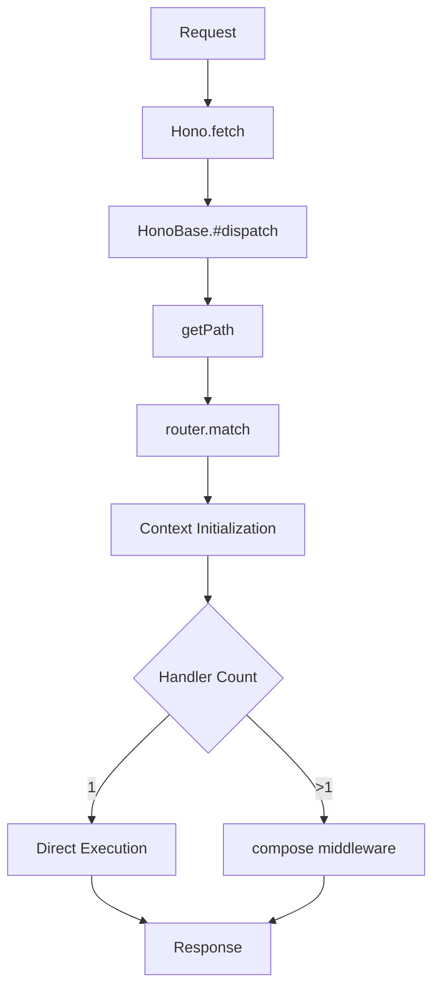
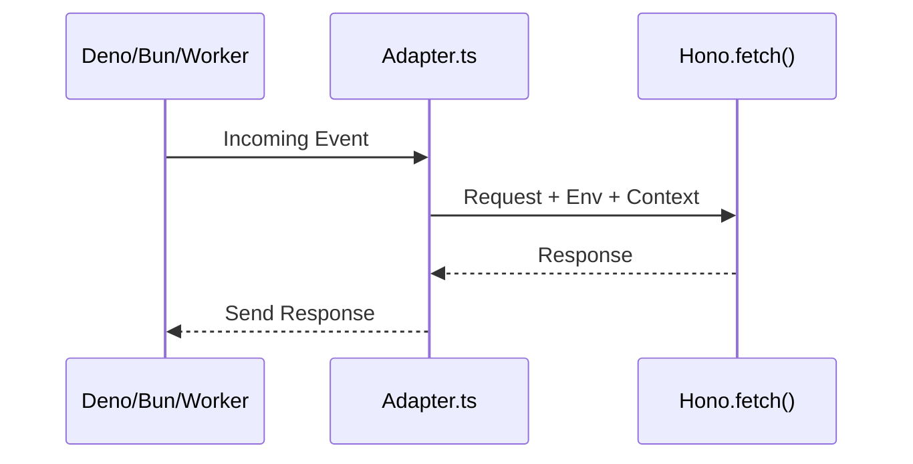

# Project Structure

<details>
<summary>Relevant source files</summary>

The following files were used as context for generating this wiki page:

- [package.json](https://github.com/honojs/hono/blob/main/package.json)
- [jsr.json](https://github.com/honojs/hono/blob/main/jsr.json)
- [src/hono.ts](https://github.com/honojs/hono/blob/main/src/hono.ts)
- [src/hono-base.ts](https://github.com/honojs/hono/blob/main/src/hono-base.ts)
- [src/preset/quick.ts](https://github.com/honojs/hono/blob/main/src/preset/quick.ts)
- [README.md](https://github.com/honojs/hono/blob/main/README.md)
- [src/router/smart-router/index.ts](https://github.com/honojs/hono/blob/main/src/router/smart-router/index.ts)
- [src/index.ts](https://github.com/honojs/hono/blob/main/src/index.ts)
- [docs/CONTRIBUTING.md](https://github.com/honojs/hono/blob/main/docs/CONTRIBUTING.md)
- [src/adapter/deno/index.ts](https://github.com/honojs/hono/blob/main/src/adapter/deno/index.ts)
- [src/router/trie-router/index.ts](https://github.com/honojs/hono/blob/main/src/router/trie-router/index.ts)
- [src/adapter/cloudflare-pages/index.ts](https://github.com/honojs/hono/blob/main/src/adapter/cloudflare-pages/index.ts)
- [src/router/pattern-router/index.ts](https://github.com/honojs/hono/blob/main/src/router/pattern-router/index.ts)
- [src/router/linear-router/index.ts](https://github.com/honojs/hono/blob/main/src/router/linear-router/index.ts)
- [src/middleware/jwk/keys.test.json](https://github.com/honojs/hono/blob/main/src/middleware/jwk/keys.test.json)
- [src/adapter/bun/index.ts](https://github.com/honojs/hono/blob/main/src/adapter/bun/index.ts)
- [src/jsx/index.ts](https://github.com/honojs/hono/blob/main/src/jsx/index.ts)
- [src/router/reg-exp-router/index.ts](https://github.com/honojs/hono/blob/main/src/router/reg-exp-router/index.ts)
- [src/adapter/netlify/index.ts](https://github.com/honojs/hono/blob/main/src/adapter/netlify/index.ts)
- [src/adapter/cloudflare-workers/index.ts](https://github.com/honojs/hono/blob/main/src/adapter/cloudflare-workers/index.ts)
- [src/helper/ssg/index.ts](https://github.com/honojs/hono/blob/main/src/helper/ssg/index.ts)
</details>

Hono is architected as a modular, runtime-agnostic web framework that prioritizes strict adherence to Web Standards while maintaining a lightweight footprint. The project structure is intentionally designed to separate core routing and request-handling logic from runtime-specific adaptations, allowing the framework to execute across heterogeneous environments like Cloudflare Workers, Bun, Deno, and Node.js without platform-specific code leaking into the core library.

The "Project Structure" defines how Hono orchestrates request lifecycle management, routing strategies, and middleware composition. At its heart, `src/hono-base.ts` serves as the abstract blueprint, providing the essential machinery for request routing and lifecycle events, while `src/hono.ts` provides the concrete implementation. This separation allows Hono to provide specialized router presets—such as `src/preset/quick.ts`—that optimize performance based on the routing density of the target application.
Sources: [src/hono.ts:1-20](https://github.com/honojs/hono/blob/main/src/hono.ts#L1-L20)

The framework further decomposes complex subsystems into distinct directories: `src/router/` contains the routing engine implementations, `src/adapter/` houses the platform-specific glue code, and `src/jsx/` provides a runtime-independent JSX rendering engine. This modularity ensures that Hono remains small, as users only bundle the components (adapters, routers, or helpers) necessary for their specific production deployment.
Sources: [jsr.json:58-81](https://github.com/honojs/hono/blob/main/jsr.json#L58-L81)

## The Core Lifecycle: Hono Class and Request Dispatching

The framework's operation centers on the base implementation of the `Hono` class declared in `src/hono-base.ts`, which manages the application state, routes, and error handlers. The dispatching process is a synchronous-to-asynchronous transition: upon receiving a `Request`, Hono determines the matching route using the injected `Router` instance and wraps the execution in a `Context` object.
Sources: [src/hono-base.ts:98-124](https://github.com/honojs/hono/blob/main/src/hono-base.ts#L98-L124)


Sources: [src/hono-base.ts:406-466](https://github.com/honojs/hono/blob/main/src/hono-base.ts#L406-L466)

The dispatch mechanism provides a critical performance optimization: if `matchResult[0].length === 1`, the framework bypasses the middleware `compose` pipeline entirely, invoking the single handler directly to minimize call-stack depth.
Sources: [src/hono-base.ts:429-448](https://github.com/honojs/hono/blob/main/src/hono-base.ts#L429-L448)

> [!IMPORTANT]
> The `compose` function is only invoked for routes with multiple handlers. For single-handler routes, Hono executes the handler directly and uses a simplified error-handling chain to maintain performance.
Sources: [src/hono-base.ts:430-448](https://github.com/honojs/hono/blob/main/src/hono-base.ts#L430-L448)

## Routing Strategies and SmartRouter

Hono abstracts the routing engine, allowing it to swap implementation algorithms at instantiation. The `SmartRouter` is a delegator that acts as a container for multiple routing implementations, such as `RegExpRouter`, `TrieRouter`, and `LinearRouter`. This design allows Hono to leverage different data structures depending on the performance characteristics of the route tree.
Sources: [src/router/smart-router/index.ts:1-7](https://github.com/honojs/hono/blob/main/src/router/smart-router/index.ts#L1-L7)

The concrete `Hono` class in `src/hono.ts` defaults to the `SmartRouter`, which is configured by default with both `RegExpRouter` and `TrieRouter` instances, providing a balance of speed and feature support.
Sources: [src/hono.ts:25-33](https://github.com/honojs/hono/blob/main/src/hono.ts#L25-L33)

| Router Implementation | Primary Data Structure | Best Use Case |
| :--- | :--- | :--- |
| `RegExpRouter` | Compiled Regular Expression | Large, complex route trees |
| `TrieRouter` | Prefix Tree (Trie) | Nested paths and hierarchical routes |
| `LinearRouter` | Flat Array | Small apps or performance-critical simple routes |
| `SmartRouter` | Delegator (Array) | Automatic optimization by choosing the best router |
Sources: [src/preset/quick.ts:18-24](https://github.com/honojs/hono/blob/main/src/preset/quick.ts#L18-L24)

## Adapter Subsystem

Hono separates platform-specific runtime details (such as WebSockets, File System access, or Event contexts) into the `src/adapter/` directory. Each adapter exposes a standardized interface to Hono's core, ensuring that the same code can run on Cloudflare Workers, Deno, or Bun.
Sources: [src/adapter/deno/index.ts:1-10](https://github.com/honojs/hono/blob/main/src/adapter/deno/index.ts#L1-L10)

The dispatch flow between an adapter and the core follows a delegation pattern where the platform events are translated into standard `Request` objects.
Sources: [src/adapter/bun/index.ts:1-12](https://github.com/honojs/hono/blob/main/src/adapter/bun/index.ts#L1-L12)


Sources: [src/adapter/cloudflare-workers/index.ts:1-9](https://github.com/honojs/hono/blob/main/src/adapter/cloudflare-workers/index.ts#L1-L9)

## Middleware Composition Architecture

Middleware is implemented as a pipeline of asynchronous handlers. The `compose` function processes these handlers, ensuring that `next()` calls are respected. If the context is not properly finalized, the framework enforces invariant safety checks to prevent common bugs in request handling.

> [!CAUTION]
> Hono mandates that every request must result in a finalized response state. If the context has not finalized after all handlers in the `compose` pipeline are executed, an error is thrown to alert the developer of a hanging request lifecycle.
Sources: [src/hono-base.ts:452-465](https://github.com/honojs/hono/blob/main/src/hono-base.ts#L452-L465)

## Design Trade-offs

The Hono project architecture is built on specific trade-offs designed to keep the framework "ultrafast" while supporting a vast range of runtimes.

| Design Choice | Benefit | Cost |
| :--- | :--- | :--- |
| Web Standards API | Maximum portability across runtimes | High dependency on browser-like globals |
| `SmartRouter` | High performance via algorithm selection | Increased object allocation overhead during startup |
| Middleware `compose` | Flexible, predictable control flow | Slightly slower for single-handler requests |
| No Dependencies | Tiny footprint, easy to audit | Manual implementation of utility logic |
Sources: [package.json:4](https://github.com/honojs/hono/blob/main/package.json#L4)

## Full Lifecycle Example

The following example shows how a typical application is initialized with the standard Hono constructor, uses a sub-app via `.route()`, and handles a custom error using the configured error handler.

```typescript
import { Hono } from 'hono'

// Initialize the primary application
const app = new Hono()

// Define a custom error handler
app.errorHandler = (err, c) => {
  console.error("Caught error:", err)
  return c.text('Custom Error Message', 500)
}

// Add a sub-app via .route()
const api = new Hono()
api.get('/users', (c) => c.json({ users: [] }))
app.route('/api', api)
```
Sources: [src/hono.ts:16-34](https://github.com/honojs/hono/blob/main/src/hono.ts#L16-L34), [src/hono-base.ts:208-232](https://github.com/honojs/hono/blob/main/src/hono-base.ts#L208-L232), [src/hono-base.ts:186-188](https://github.com/honojs/hono/blob/main/src/hono-base.ts#L186-L188)

## Related

- [[Overview]]
