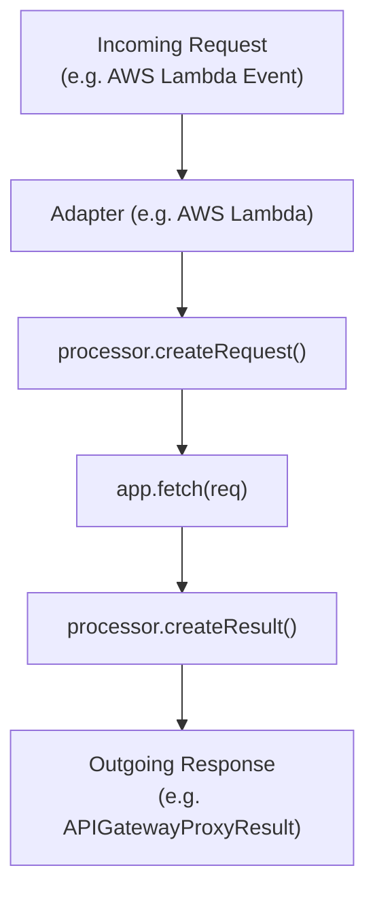

# Quick Start

<details>
<summary>Relevant source files</summary>

The following files were used as context for generating this wiki page:

- [package.json](https://github.com/honojs/hono/blob/main/package.json)
- [src/client/client.ts](https://github.com/honojs/hono/blob/main/src/client/client.ts)
- [src/hono-base.ts](https://github.com/honojs/hono/blob/main/src/hono-base.ts)
- [src/context.ts](https://github.com/honojs/hono/blob/main/src/context.ts)
- [src/preset/quick.ts](https://github.com/honojs/hono/blob/main/src/preset/quick.ts)
- [src/adapter/aws-lambda/handler.ts](https://github.com/honojs/hono/blob/main/src/adapter/aws-lambda/handler.ts)
- [README.md](https://github.com/honojs/hono/blob/main/README.md)
- [src/hono.ts](https://github.com/honojs/hono/blob/main/src/hono.ts)
- [src/adapter/cloudflare-pages/handler.ts](https://github.com/honojs/hono/blob/main/src/adapter/cloudflare-pages/handler.ts)
- [src/adapter/lambda-edge/handler.ts](https://github.com/honojs/hono/blob/main/src/adapter/lambda-edge/handler.ts)
- [src/preset/tiny.ts](https://github.com/honojs/hono/blob/main/src/preset/tiny.ts)
- [src/index.ts](https://github.com/honojs/hono/blob/main/src/index.ts)
- [src/helper/dev/index.ts](https://github.com/honojs/hono/blob/main/src/helper/dev/index.ts)
- [runtime-tests/workerd/index.ts](https://github.com/honojs/hono/blob/main/runtime-tests/workerd/index.ts)
- [src/adapter/netlify/handler.ts](https://github.com/honojs/hono/blob/main/src/adapter/netlify/handler.ts)
- [src/adapter/vercel/handler.ts](https://github.com/honojs/hono/blob/main/src/adapter/vercel/handler.ts)
- [src/router/linear-router/index.ts](https://github.com/honojs/hono/blob/main/src/router/linear-router/index.ts)
- [jsr.json](https://github.com/honojs/hono/blob/main/jsr.json)
- [src/router/smart-router/index.ts](https://github.com/honojs/hono/blob/main/src/router/smart-router/index.ts)
- [docs/CONTRIBUTING.md](https://github.com/honojs/hono/blob/main/docs/CONTRIBUTING.md)
- [src/adapter/cloudflare-pages/index.ts](https://github.com/honojs/hono/blob/main/src/adapter/cloudflare-pages/index.ts)
- [src/adapter/service-worker/index.ts](https://github.com/honojs/hono/blob/main/src/adapter/service-worker/index.ts)
- [src/adapter/deno/index.ts](https://github.com/honojs/hono/blob/main/src/adapter/deno/index.ts)
- [src/router/pattern-router/index.ts](https://github.com/honojs/hono/blob/main/src/router/pattern-router/index.ts)
- [src/adapter/vercel/index.ts](https://github.com/honojs/hono/blob/main/src/adapter/vercel/index.ts)
- [src/adapter/service-worker/handler.ts](https://github.com/honojs/hono/blob/main/src/adapter/service-worker/handler.ts)
- [perf-measures/type-check/scripts/generate-app.ts](https://github.com/honojs/hono/blob/main/perf-measures/type-check/scripts/generate-app.ts)
- [src/router/trie-router/index.ts](https://github.com/honojs/hono/blob/main/src/router/trie-router/index.ts)
- [src/adapter/netlify/index.ts](https://github.com/honojs/hono/blob/main/src/adapter/netlify/index.ts)
- [src/adapter/aws-lambda/index.ts](https://github.com/honojs/hono/blob/main/src/adapter/aws-lambda/index.ts)
</details>

Hono is a web framework built on Web Standards designed to be small, simple, and ultrafast across all JavaScript runtimes. The "Quick Start" approach to Hono begins with initializing a new application using the official project generator. This utility provides the standard project scaffolding required to run a Hono application on any environment, including Cloudflare Workers, Deno, Bun, and Node.js.

The design philosophy behind Hono emphasizes compatibility with the Fetch API. By leveraging standardized request and response objects, Hono applications remain portable across disparate execution environments. The `Hono` class serves as the central entry point for defining routes, applying middleware, and dispatching incoming requests.

A Hono project typically involves instantiating the `Hono` class and registering handlers. The routing mechanism is abstracted to allow different router implementations (such as `RegExpRouter`, `TrieRouter`, or `PatternRouter`) depending on the specific performance or complexity requirements of the application. The system ensures consistent behavior by maintaining a unified `Context` object that manages the lifecycle of the request, environment variables, and response state.

## Initializing a Project

The entry point for most users is the Hono CLI, which bootstraps a minimal, type-safe project structure. Running `npm create hono@latest` sets up the environment with necessary dependencies and configurations.
Sources: [README.md:35-39](https://github.com/honojs/hono/blob/main/README.md#L35-L39)

This command automatically configures `package.json`, which acts as the source of truth for runtime compatibility and dependency management.
Sources: [package.json:1-699](https://github.com/honojs/hono/blob/main/package.json#L1-L699)

## The Core Application Class

The `Hono` class is the primary interface for developers. It is initialized with a `SmartRouter` by default, which orchestrates between different routing strategies to optimize performance based on route complexity. The `constructor` accepts an optional configuration object that allows fine-grained control over routing behavior, path parsing, and strict mode.
Sources: [src/hono.ts:16-34](https://github.com/honojs/hono/blob/main/src/hono.ts#L16-L34)

```typescript
import { Hono } from 'hono'
const app = new Hono()

app.get('/', (c) => c.text('Hono!'))
```
Sources: [README.md:26-33](https://github.com/honojs/hono/blob/main/README.md#L26-L33)

This snippet demonstrates the fundamental usage of the `Hono` constructor and route registration. Hono’s design allows the `app` object to be exported as a module default, enabling seamless integration with platform-specific adapters like Cloudflare Workers or AWS Lambda.
Sources: [src/hono.ts:16-34](https://github.com/honojs/hono/blob/main/src/hono.ts#L16-L34)

## Request Routing Architecture

Hono implements a highly modular routing architecture. The class exposes methods for adding routes and configuring middleware. Concrete implementations assign specific routers:
Sources: [src/hono-base.ts:98-173](https://github.com/honojs/hono/blob/main/src/hono-base.ts#L98-L173)

| Router | Implementation File | Characteristics |
| :--- | :--- | :--- |
| `SmartRouter` | `src/router/smart-router` | Dynamically selects between routers for optimal speed. |
| `RegExpRouter` | `src/router/reg-exp-router` | Uses regular expressions for high-performance matching. |
| `TrieRouter` | `src/router/trie-router` | Standard tree-based lookup for simple route matching. |
| `PatternRouter` | `src/router/pattern-router` | Optimized for specific patterns in the `tiny` preset. |
| `LinearRouter` | `src/router/linear-router` | Basic list traversal, useful for constrained environments. |
Sources: [src/router/smart-router/index.ts:6](https://github.com/honojs/hono/blob/main/src/router/smart-router/index.ts#L6), [src/router/reg-exp-router/index.ts:289](https://github.com/honojs/hono/blob/main/package.json#L289), [src/router/trie-router/index.ts:6](https://github.com/honojs/hono/blob/main/src/router/trie-router/index.ts#L6), [src/router/pattern-router/index.ts:6](https://github.com/honojs/hono/blob/main/src/router/pattern-router/index.ts#L6), [src/router/linear-router/index.ts:6](https://github.com/honojs/hono/blob/main/src/router/linear-router/index.ts#L6)

The `Hono` class defaults to `SmartRouter` in its standard export, combining `RegExpRouter` and `TrieRouter` to handle both complex dynamic parameters and static routes efficiently.
Sources: [src/hono.ts:28-32](https://github.com/honojs/hono/blob/main/src/hono.ts#L28-L32)

## Execution Flow and Context

The request lifecycle is managed by the `Context` object. When a request hits the `app.fetch` entry point, the system performs the sequence: `getPath()` extraction, `router.match()` lookups, and `Context` instantiation with the `Request`, `MatchResult`, environment variables, and execution context.
Sources: [src/hono-base.ts:406-427](https://github.com/honojs/hono/blob/main/src/hono-base.ts#L406-L427)

> [!NOTE]
> The `Context` object is not just a container; it provides the API for responses. Methods like `c.text()`, `c.json()`, and `c.html()` generate responses by managing headers, status codes, and the body initialization process.
Sources: [src/context.ts:156-230](https://github.com/honojs/hono/blob/main/src/context.ts#L156-L230)

`compose()` aggregates handlers into a single chain, applying error handling and middleware execution order.
Sources: [src/hono-base.ts:450-466](https://github.com/honojs/hono/blob/main/src/hono-base.ts#L450-L466)

## Adapter Integration

Hono's cross-runtime compatibility is achieved through adapters. These adapters normalize platform-specific request/response formats into the Web Standards that Hono expects.
Sources: [src/adapter/aws-lambda/handler.ts:200-209](https://github.com/honojs/hono/blob/main/src/adapter/aws-lambda/handler.ts#L200-L209)


Sources: [src/adapter/aws-lambda/handler.ts:239-276](https://github.com/honojs/hono/blob/main/src/adapter/aws-lambda/handler.ts#L239-L276)

Each adapter exports a `handle` function that wraps the `app.fetch` method, ensuring that regardless of the environment, the `Hono` instance interacts with a standardized `Request` object.
Sources: [src/adapter/vercel/handler.ts:4-8](https://github.com/honojs/hono/blob/main/src/adapter/vercel/handler.ts#L4-L8)

## Development and Debugging

To facilitate development, Hono includes a built-in inspector in the `dev` helper package. `showRoutes` and `inspectRoutes` allow developers to verify the internal registration state of their routes.
Sources: [src/helper/dev/index.ts:2-4](https://github.com/honojs/hono/blob/main/src/helper/dev/index.ts#L2-L4)

*   `inspectRoutes`: Returns an array of route definitions, including the path, method, and the handler name.
*   `showRoutes`: Prints a formatted route table to the console, useful for identifying overlapping routes.
Sources: [src/helper/dev/index.ts:27-37](https://github.com/honojs/hono/blob/main/src/helper/dev/index.ts#L27-L37), [src/helper/dev/index.ts:39-74](https://github.com/honojs/hono/blob/main/src/helper/dev/index.ts#L39-L74)

These tools verify that application configuration is correctly applied and help visualize the internal route tree constructed by the `SmartRouter`.
Sources: [src/helper/dev/index.ts:76-79](https://github.com/honojs/hono/blob/main/src/helper/dev/index.ts#L76-L79)

## Related

- [[Overview]]
- [[Application Instance]]
