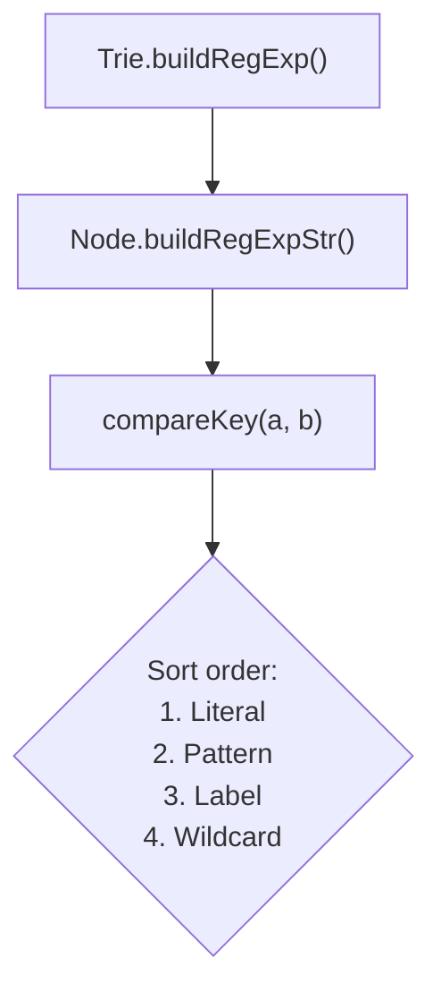

# RegExp Router

<details>
<summary>Relevant source files</summary>

The following files were used as context for generating this wiki page:

- [package.json](https://github.com/honojs/hono/blob/main/package.json)
- [src/types.ts](https://github.com/honojs/hono/blob/main/src/types.ts)
- [src/utils/url.ts](https://github.com/honojs/hono/blob/main/src/utils/url.ts)
- [src/router/reg-exp-router/router.ts](https://github.com/honojs/hono/blob/main/src/router/reg-exp-router/router.ts)
- [src/preset/quick.ts](https://github.com/honojs/hono/blob/main/src/preset/quick.ts)
- [src/router/reg-exp-router/prepared-router.ts](https://github.com/honojs/hono/blob/main/src/router/reg-exp-router/prepared-router.ts)
- [jsr.json](https://github.com/honojs/hono/blob/main/jsr.json)
- [src/hono.ts](https://github.com/honojs/hono/blob/main/src/hono.ts)
- [src/router/pattern-router/router.ts](https://github.com/honojs/hono/blob/main/src/router/pattern-router/router.ts)
- [src/router/linear-router/router.ts](https://github.com/honojs/hono/blob/main/src/router/linear-router/router.ts)
- [src/router/reg-exp-router/node.ts](https://github.com/honojs/hono/blob/main/src/router/reg-exp-router/node.ts)
- [src/router/trie-router/router.ts](https://github.com/honojs/hono/blob/main/src/router/trie-router/router.ts)
- [src/router/reg-exp-router/trie.ts](https://github.com/honojs/hono/blob/main/src/router/reg-exp-router/trie.ts)
</details>

The `RegExpRouter` is a high-performance routing engine designed for Hono that compiles route patterns into a single, optimized Regular Expression. By collapsing the entire routing tree into a single regex match operation, it achieves constant-time or near-constant-time complexity for route lookups, bypassing the need to traverse a tree or iterate through a flat list of patterns at runtime.

The router is fundamentally architectural in nature, intended for environments where runtime efficiency and overhead minimization are critical. It acts as a compiled lookup mechanism: during the application's boot or initialization phase, the `RegExpRouter` preprocesses defined routes, builds a Trie, converts the Trie structure into a comprehensive Regex string, and maps path parameter segments to capture groups.

This component is typically invoked via `Hono` instances (often as part of the `SmartRouter` strategy). Its design ensures that as the number of defined routes grows, the cost of routing remains relatively stable. It specifically avoids the "linear search" problem of simpler routers by delegating the path matching work to the highly optimized native regex engine present in modern JavaScript runtimes.

## Registration and Trie Construction

When routes are added via `add(method, path, handler)`, the router does not immediately create the regex. Instead, it builds a `Trie` structure. The `Trie` node (`src/router/reg-exp-router/node.ts`) acts as the organizational backbone, where path tokens are inserted.

1.  **Tokenization**: The path is split into segments.
2.  **Insertion**: The `Trie.insert()` method traverses the tree of `Node` instances.
3.  **Pattern Handling**: It distinguishes between literal strings, parameterized segments (`:id`), and wildcards (`*`).

Sources: [src/router/reg-exp-router/router.ts:132-204](https://github.com/honojs/hono/blob/main/src/router/reg-exp-router/router.ts#L132-L204)

The router also enforces path structure integrity using an internal `PATH_ERROR` symbol, which is thrown when an insertion conflicts with existing logic, effectively preventing path ambiguity during the build phase.

Sources: [src/router/reg-exp-router/node.ts:4-67](https://github.com/honojs/hono/blob/main/src/router/reg-exp-router/node.ts#L4-L67)

> [!IMPORTANT]
> The `insert` method includes an invariant check: `Object.keys(this.#children).some(...)`. This line prevents the ambiguity of mixing incompatible route patterns (like literal paths and variable segments in the same depth) that would break the regex structure. It throws the internal path error symbol (mapped to `UnsupportedPathError`) if an ambiguous path structure is detected.

Sources: [src/router/reg-exp-router/node.ts:50-133](https://github.com/honojs/hono/blob/main/src/router/reg-exp-router/node.ts#L50-L133)

## Compilation: The Regex Generation Mechanism

Once all routes are registered, the `RegExpRouter` compiles the `Trie` into a regex. The `buildRegExp()` process is the core transformation where the data-structure-based routing is converted into a regex string.

The `Node.buildRegExpStr()` method recursively generates the regex:
-   It sorts children nodes using `compareKey` to ensure that specific patterns (like literal paths) take precedence over general ones (like wildcards).
-   It uses non-capturing groups `(?:...)` and anchors to stitch the tree into a single expression.

Sources: [src/router/reg-exp-router/router.ts:82-102](https://github.com/honojs/hono/blob/main/src/router/reg-exp-router/router.ts#L82-L102)



Sources: [src/router/reg-exp-router/node.ts:135-161](https://github.com/honojs/hono/blob/main/src/router/reg-exp-router/node.ts#L135-L161)

The output of the compiler includes the compiled regex pattern, an `indexReplacementMap` for handler lookups, and a `paramReplacementMap` to align captured regex groups with the expected parameter keys.

Sources: [src/router/reg-exp-router/router.ts:82-94](https://github.com/honojs/hono/blob/main/src/router/reg-exp-router/router.ts#L82-L94)

## Call Chain: Routing a Request

When a request arrives, the `match` method executes the pre-compiled regex. The primary execution flow follows this sequence:

1.  **Call Chain**: `RegExpRouter.match(method, path)` invokes the static `match` handler mapping lookup.
2.  **Result Retrieval**: The compiled regex is executed against the request path.
3.  **Data Extraction**: Handlers and params are extracted by resolving the capture groups against the replacement indexes.

Sources: [src/router/reg-exp-router/router.ts:206](https://github.com/honojs/hono/blob/main/src/router/reg-exp-router/router.ts#L206)

The `match` implementation also handles the tie-breaking logic by utilizing a `staticMap` for O(1) lookups of static paths, allowing the system to verify literals before resorting to full regex execution.

Sources: [src/router/reg-exp-router/matcher.ts:1-24](https://github.com/honojs/hono/blob/main/src/router/reg-exp-router/matcher.ts#L1-L24)

> [!NOTE]
> `findMiddleware` is called during route registration to attach relevant middleware to specific routes. The `wildcardRegExpCache` is used to optimize the creation of regex objects for `/*` paths.

Sources: [src/router/reg-exp-router/router.ts:104-120](https://github.com/honojs/hono/blob/main/src/router/reg-exp-router/router.ts#L104-L120)

## Precedence and Sorting

The tie-breaking logic is centralized in the `compareKey` function within `src/router/reg-exp-router/node.ts`. When the Trie nodes are converted to a regex, children are sorted to ensure correct priority.

| Match Type | Priority | Reason |
| :--- | :--- | :--- |
| Literal | 1 | Exact match is always preferred over variable matches. |
| Special Pattern | 2 | Patterns like `:id{[0-9]+}` are more specific than general labels. |
| Common Label | 3 | `:label` matches any single segment. |
| Wildcard | 4 | `*` matches the remainder, lowest specificity. |

Sources: [src/router/reg-exp-router/node.ts:20-43](https://github.com/honojs/hono/blob/main/src/router/reg-exp-router/node.ts#L20-L43)

## Design Trade-offs

The design of `RegExpRouter` optimizes for read-heavy workloads (request routing) at the expense of write-heavy workloads (route registration).

| Design Choice | Benefit | Cost |
| :--- | :--- | :--- |
| Regex Compilation | O(1) matching time after init. | Expensive compilation phase. |
| Trie-based structure | Efficiently handles shared prefixes. | Requires recursive builds. |
| Strict sorting | Predictable route matching. | Limits path flexibility (cannot overlap). |

Sources: [src/router/reg-exp-router/node.ts:135-161](https://github.com/honojs/hono/blob/main/src/router/reg-exp-router/node.ts#L135-L161)

## Usage Example

The router is typically accessed through the `Hono` instance constructor, though it can be used directly for custom implementations.

```typescript
import { RegExpRouter } from 'hono/router/reg-exp-router';

const router = new RegExpRouter<string>();
router.add('GET', '/api/users/:id', 'get_user');
router.add('GET', '/api/users', 'list_users');

// Match returns a match result: [handlers, params]
const match = router.match('GET', '/api/users/123');
console.log(match);
```

Sources: [src/router/reg-exp-router/router.ts:122-252](https://github.com/honojs/hono/blob/main/src/router/reg-exp-router/router.ts#L122-L252)

> [!CAUTION]
> Once `buildAllMatchers()` is called, the internal route storage (`#routes` and `#middleware`) is cleared to release memory. After this point, you cannot add new routes to the instance. The `PreparedRegExpRouter` class is used for read-only, pre-built route scenarios.

Sources: [src/router/reg-exp-router/router.ts:208-222](https://github.com/honojs/hono/blob/main/src/router/reg-exp-router/router.ts#L208-L222)

## Related

- [[Router Architecture]]
