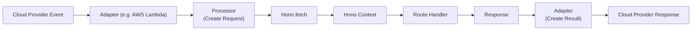

# Request Context

<details>
<summary>Relevant source files</summary>

The following files were used as context for generating this wiki page:

- [src/context.ts](https://github.com/honojs/hono/blob/main/src/context.ts)
- [src/adapter/aws-lambda/handler.ts](https://github.com/honojs/hono/blob/main/src/adapter/aws-lambda/handler.ts)
- [src/client/client.ts](https://github.com/honojs/hono/blob/main/src/client/client.ts)
- [src/hono-base.ts](https://github.com/honojs/hono/blob/main/src/hono-base.ts)
- [src/request.ts](https://github.com/honojs/hono/blob/main/src/request.ts)
- [src/adapter/cloudflare-pages/handler.ts](https://github.com/honojs/hono/blob/main/src/adapter/cloudflare-pages/handler.ts)
- [src/hono.ts](https://github.com/honojs/hono/blob/main/src/hono.ts)
- [README.md](https://github.com/honojs/hono/blob/main/README.md)
- [src/helper/proxy/index.ts](https://github.com/honojs/hono/blob/main/src/helper/proxy/index.ts)
- [src/adapter/lambda-edge/handler.ts](https://github.com/honojs/hono/blob/main/src/adapter/lambda-edge/handler.ts)
- [src/types.ts](https://github.com/honojs/hono/blob/main/src/types.ts)
</details>

The "Request Context" is a central architectural abstraction in Hono that encapsulates the entire state and lifecycle of a single incoming HTTP request. Unlike frameworks that rely on global mutable state or complex request-scoped injection containers, Hono uses the `Context` class as a lightweight container passed into every route handler and middleware. This object acts as the primary API surface for interacting with the request, constructing the response, accessing environment variables, and sharing state across a middleware chain.

The primary design goal is "Web Standard Alignment." By basing its operations on the native `Request` and `Response` objects, the Hono Context provides a type-safe and consistent interface that functions identically across different serverless runtimes (Cloudflare Workers, AWS Lambda, Node.js). This design ensures that the same application logic remains portable, as the platform-specific nuances (like how a Lambda event is transformed) are abstracted away by adapters that translate these events into the `Context` format.

When a request enters the application, the `Hono` router generates a `Context` instance. This object carries the environment bindings, the matched routing parameters, and helper methods for common operations like JSON serialization, text rendering, and cookie management. Because each request creates its own `Context` instance, it safely provides a clean slate for handling concurrent requests without risk of cross-talk or state leakage.

## Core API Surface: Input and Output

The `Context` object serves as the developer's primary toolkit. It is structured to expose data in a way that respects the underlying request lifecycle while providing high-level convenience.

*   **`req`**: Returns an instance of `HonoRequest`, which wraps the native `Request` and exposes methods like `param()`, `query()`, `header()`, and body parsers (`json()`, `text()`, `parseBody()`).
Sources: [src/context.ts:366-369](https://github.com/honojs/hono/blob/main/src/context.ts#L366-L369), [src/request.ts:36-51](https://github.com/honojs/hono/blob/main/src/request.ts#L36-L51)

*   **`env`**: Provides access to environment-specific bindings (e.g., KV namespaces, secrets, or database handles) defined during application startup.
Sources: [src/context.ts:303-315](https://github.com/honojs/hono/blob/main/src/context.ts#L303-L315)

*   **`res`**: Exposes the response state. The context uses a lazy-initialization strategy for the response object, meaning a default response instance is created only when it is accessed.
```typescript
// Example usage in a route handler
app.get('/user/:id', async (c) => {
  const userId = c.req.param('id')
  const secret = c.env.API_KEY
  return c.json({ userId, status: 'ok' })
})
```
Sources: [src/context.ts:403-407](https://github.com/honojs/hono/blob/main/src/context.ts#L403-L407)

## Request Lifecycle and Finalization

The `Context` manages the lifecycle of the response through a `finalized` flag. When a developer returns a response, the framework updates the state of the context. If a user sets a header after a response is already "finalized," Hono intelligently handles the merge or transformation to ensure the resulting `Response` object is correctly updated.
Sources: [src/context.ts:317-317](https://github.com/honojs/hono/blob/main/src/context.ts#L317-L317)

> [!NOTE]
> The `finalized` boolean prevents accidental double-modification of responses once they have entered the terminal state, ensuring stability in the middleware stack.
Sources: [src/context.ts:433-433](https://github.com/honojs/hono/blob/main/src/context.ts#L433-L433)

When `c.header()` is called on a finalized response, Hono does not simply mutate the existing object. Instead, it re-creates the `Response` instance to ensure headers are correctly propagated, accounting for the immutable nature of the Web Standard `Response` object.
Sources: [src/context.ts:414-434](https://github.com/honojs/hono/blob/main/src/context.ts#L414-L434), [src/context.ts:516-518](https://github.com/honojs/hono/blob/main/src/context.ts#L516-L518)

## Middleware State Management

The `set` and `get` methods provide a scoped mechanism to share state across multiple middleware functions. This state is stored in an internal `Map` (`#var`), ensuring that developers can pass data (like user authentication objects or transaction IDs) through the request chain without polluting global scopes.
Sources: [src/context.ts:534-556](https://github.com/honojs/hono/blob/main/src/context.ts#L534-L556)

The `#var` map is lazily initialized on the first call to `set`. Accessing variables via `c.var` retrieves an object representation of the underlying map.
Sources: [src/context.ts:554-555](https://github.com/honojs/hono/blob/main/src/context.ts#L554-L555), [src/context.ts:593-602](https://github.com/honojs/hono/blob/main/src/context.ts#L593-L602)

## Adapter Integration: Transforming Events

The architecture relies on adapter-specific code to bridge platform events into the `Context`. The `handle` function in `src/adapter/aws-lambda/handler.ts` performs the heavy lifting by identifying the event type, creating a standard `Request`, and mapping the result.
Sources: [src/adapter/aws-lambda/handler.ts:239-252](https://github.com/honojs/hono/blob/main/src/adapter/aws-lambda/handler.ts#L239-L252)


Sources: [src/adapter/aws-lambda/handler.ts:253-276](https://github.com/honojs/hono/blob/main/src/adapter/aws-lambda/handler.ts#L253-L276)

Adapters normalize incoming triggers (API Gateway, ALB) into the `Request` format, then wrap the execution in a `try-catch` block that generates the correct `APIGatewayProxyResult` or native provider return object based on the resulting `Response`.
Sources: [src/adapter/aws-lambda/handler.ts:256-274](https://github.com/honojs/hono/blob/main/src/adapter/aws-lambda/handler.ts#L256-L274)

## Response Construction Logic

The `Context` provides helper methods (`json`, `text`, `html`, `redirect`) that internalize the creation of `Response` objects. These methods call the internal `newResponse` signature which ensures consistent header and status code merging across operations.
Sources: [src/context.ts:604-639](https://github.com/honojs/hono/blob/main/src/context.ts#L604-L639)

| Method | Purpose | Typical Default |
| :--- | :--- | :--- |
| `json` | Serializes object to JSON | `application/json` |
| `text` | Returns plain text | `text/plain; charset=UTF-8` |
| `html` | Returns HTML | `text/html; charset=UTF-8` |
| `redirect` | Returns a Redirect response | 302 |
Sources: [src/context.ts:708-761](https://github.com/honojs/hono/blob/main/src/context.ts#L708-L761)

> [!CAUTION]
> When returning a body, Hono checks type specifications to determine which status codes allow for returning payload contents versus metadata only.
Sources: [src/context.ts:121-141](https://github.com/honojs/hono/blob/main/src/context.ts#L121-L141)

## Design Trade-offs

| Design Choice | Benefit | Cost |
| :--- | :--- | :--- |
| Lazy `Response` creation | Reduces object allocation overhead for short circuits | Slight complexity in header management |
| `Context` as an argument | Eliminates global state; improves testability | Slightly more verbose in middleware signatures |
| `HonoRequest` wrapping | Adds utility methods like `param` and `json` to native `Request` | Adds an abstraction layer over the standard object |
Sources: [src/context.ts:403-407](https://github.com/honojs/hono/blob/main/src/context.ts#L403-L407), [src/context.ts:366-369](https://github.com/honojs/hono/blob/main/src/context.ts#L366-L369)

## Related

- [[Request Lifecycle]]
- [[Middleware Composition]]
