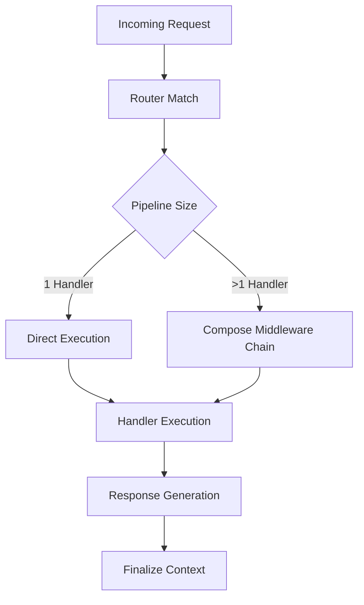

# Request Lifecycle

Relevant source files

The following files were used as context for generating this wiki page:

- [src/types.ts](https://github.com/honojs/hono/blob/main/src/types.ts)
- [src/client/client.ts](https://github.com/honojs/hono/blob/main/src/client/client.ts)
- [src/hono-base.ts](https://github.com/honojs/hono/blob/main/src/hono-base.ts)
- [src/context.ts](https://github.com/honojs/hono/blob/main/src/context.ts)
- [src/request.ts](https://github.com/honojs/hono/blob/main/src/request.ts)
- [src/adapter/aws-lambda/handler.ts](https://github.com/honojs/hono/blob/main/src/adapter/aws-lambda/handler.ts)

The Request Lifecycle in Hono defines the journey from the arrival of a raw incoming `Request` to the final generation of a `Response`. Hono is designed as a minimalist, high-performance web framework where the lifecycle is optimized for edge-computing environments like Cloudflare Workers or serverless platforms such as AWS Lambda. The central design philosophy is that every request should be processed by a lightweight, predictable pipeline.

At the core of this process is the transformation of the platform-specific event (the raw `Request`) into a Hono `Context` object. This `Context` acts as the single source of truth for the duration of the request, housing the request metadata, response builders, and environment-specific bindings. By decoupling the incoming event from the application logic through the `Context` and `HonoRequest` interfaces, Hono provides a unified API regardless of the underlying infrastructure.

The lifecycle is inherently synchronous until a handler performs an asynchronous task. Hono utilizes a `compose` mechanism to chain handlers (middleware and route handlers), allowing for modular request processing. Each step in the pipeline can either terminate the lifecycle by returning a `Response` or delegate control to the next handler using the `next` function. This mechanism ensures that errors are bubbled up, handled, and translated into standardized HTTP responses without manual orchestration in every route.

## Initiation and Dispatch

When a request enters the Hono application (e.g., via `fetch()`), it initiates the dispatch process. The `Hono` class uses an internal `router` instance to match the `Request` path and HTTP method against registered routes. The dispatch mechanism is split into two paths: a fast-path optimization for requests with only a single handler and a standard path for requests involving middleware chains.

The dispatch flow proceeds as follows:
1. `fetch(request, ...)`: Entry point for the framework.
2. `this.#dispatch()`: Internal private method that resolves the URL path, queries the `router` for match results, and spawns the context.
3. `new Context()`: Creates the request-scoped context that holds `env`, `executionCtx`, and match results.
4. `compose(matchResult)`: If multiple handlers exist, this merges them into a single executable pipeline.

Sources: [src/hono-base.ts:406-466](https://github.com/honojs/hono/blob/main/src/hono-base.ts#L406-L466), [src/hono-base.ts:479-485](https://github.com/honojs/hono/blob/main/src/hono-base.ts#L479-L485)

> [!NOTE]
> For requests with exactly one handler, Hono avoids the overhead of the `compose` pipeline. The dispatcher directly invokes the handler, effectively bypassing the middleware queue creation.

Sources: [src/hono-base.ts:430-448](https://github.com/honojs/hono/blob/main/src/hono-base.ts#L430-L448)

## Context Initialization

The `Context` class is the primary object provided to every handler. It encapsulates the raw request and provides convenience methods for interacting with the environment (`env`), variables (`var`), and constructing responses. It acts as the bridge between the framework's internal routing state and the user's business logic.

When a request arrives, the `Context` stores a reference to the `matchResult` returned by the router. When `c.req` is accessed for the first time, it lazily instantiates a `HonoRequest` object. This design decision ensures that if a handler does not inspect the request body or path parameters, the overhead of creating those objects is never incurred.

Sources: [src/context.ts:347-361](https://github.com/honojs/hono/blob/main/src/context.ts#L347-L361), [src/context.ts:366-369](https://github.com/honojs/hono/blob/main/src/context.ts#L366-L369)

## The HonoRequest Interface

`HonoRequest` provides a high-level API over the standard Web `Request` object. It handles path parameter decoding, query string parsing, and buffered body reading. The `bodyCache` mechanism allows the framework to read the request body once and cache the result (as `json`, `text`, or `formData`), preventing errors related to consuming a body stream multiple times.

The mechanism uses a lazy-loading pattern within `HonoRequest`:
- `this.#cachedBody`: A private helper that checks `bodyCache` before consuming the raw request stream.
- If a body is already consumed in a different format (e.g., `text`), it attempts to re-parse that cached content into the requested type without re-reading the network stream.

Sources: [src/request.ts:220-239](https://github.com/honojs/hono/blob/main/src/request.ts#L220-L239)

## Middleware and Handler Execution

Hono uses a `compose` function to manage middleware pipelines. Every handler has the signature `(c: Context, next: () => Promise<void>) => R`. The `next` function is an asynchronous closure that, when called, executes the next handler in the sequence.

A typical request pipeline:
1. Entry point triggers the internal `#dispatch` mechanism.
2. Pipeline chain is formed by `compose`.
3. Middleware handlers perform pre-processing or modification.
4. Route handler executes (the final step).
5. Responses flow back up the stack through the `await next()` returns.

Sources: [src/types.ts:35](https://github.com/honojs/hono/blob/main/src/types.ts#L35), [src/types.ts:81](https://github.com/honojs/hono/blob/main/src/types.ts#L81), [src/hono-base.ts:450](https://github.com/honojs/hono/blob/main/src/hono-base.ts#L450)

Sources: [src/hono-base.ts:419-450](https://github.com/honojs/hono/blob/main/src/hono-base.ts#L419-L450)

## Error Handling

Errors within the request lifecycle are handled via an internal `errorHandler`. By default, Hono includes a handler that logs the stack trace and returns a `500 Internal Server Error`. Within the dispatch cycle, the `composed` pipeline is wrapped in a `try...catch` block. If an error is thrown, the dispatcher passes the error object along with the `Context` to the custom error handler. If the error is an `HTTPException`, Hono specifically checks for a `getResponse()` method on the exception, allowing users to return controlled error responses.

Sources: [src/hono-base.ts:35-42](https://github.com/honojs/hono/blob/main/src/hono-base.ts#L35-L42), [src/hono-base.ts:462-464](https://github.com/honojs/hono/blob/main/src/hono-base.ts#L462-L464)

> [!WARNING]
> If a handler does not return a response or call `next()`, the lifecycle will hang. The dispatcher explicitly checks `!context.finalized` and throws an error if the context was not properly resolved into a response.

Sources: [src/hono-base.ts:455-459](https://github.com/honojs/hono/blob/main/src/hono-base.ts#L455-L459)

## Adapter Logic (AWS Lambda)

Adapters bridge platform-specific events to the unified `Request` object expected by the application. In the case of AWS Lambda, the adapter (`aws-lambda/handler.ts`) detects the event type (e.g., APIGateway v1, v2, ALB) and transforms its data into a standard Fetch API `Request`.

The logic in `streamHandle` for Lambda:
1. `getProcessor(event)`: Determines the schema of the incoming event.
2. `processor.createRequest(event)`: Constructs the standardized `Request`.
3. `app.fetch(req, ...)`: Feeds the `Request` into the Hono pipeline.
4. `responseStream`: Manages response transmission, supporting streaming content back to the client as the application generates it.

Sources: [src/adapter/aws-lambda/handler.ts:148-181](https://github.com/honojs/hono/blob/main/src/adapter/aws-lambda/handler.ts#L148-L181)

## Performance Considerations

Hono’s design emphasizes efficiency in several ways:
- **Lazy evaluation:** Headers and request bodies are only parsed when accessed.
- **`Context` reuse:** The same `Context` object is passed through the entire chain, minimizing allocation.
- **Router selection:** The `Router` implementation is swappable, allowing developers to select the matching algorithm that best fits their route density.

| Design Choice | Benefit | Cost |
| :--- | :--- | :--- |
| Lazy Body Parsing | Reduced initial memory footprint | Async requirement for body access |
| Context Object | Unified API for all handlers | Slightly more complex object structure |
| Compose Middleware | Composable, modular logic | Stack trace overhead in deep chains |

Sources: [src/hono-base.ts:126](https://github.com/honojs/hono/blob/main/src/hono-base.ts#L126)

## Related

- [[Application Instance]]
- [[Request Context]]
