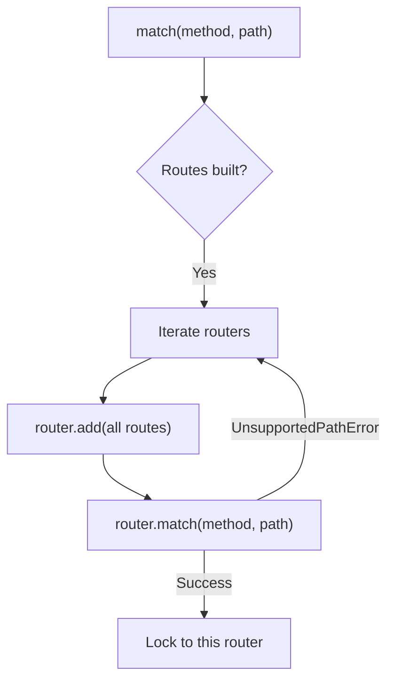
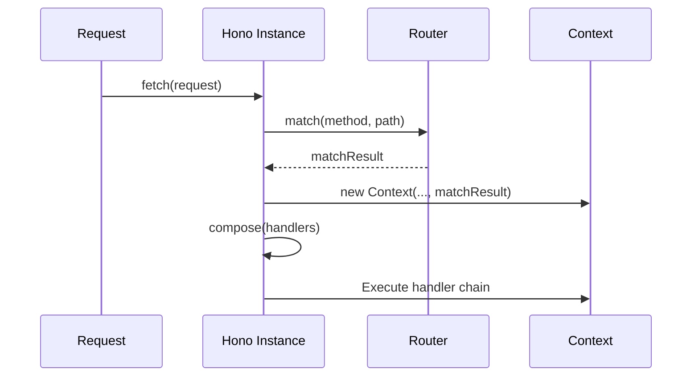

# Router Architecture

<details>
<summary>Relevant source files</summary>

The following files were used as context for generating this wiki page:

- [src/types.ts](https://github.com/honojs/hono/blob/main/src/types.ts)
- [src/hono-base.ts](https://github.com/honojs/hono/blob/main/src/hono-base.ts)
- [src/hono.ts](https://github.com/honojs/hono/blob/main/src/hono.ts)
- [src/preset/quick.ts](https://github.com/honojs/hono/blob/main/src/preset/quick.ts)
- [src/router/smart-router/index.ts](https://github.com/honojs/hono/blob/main/src/router/smart-router/index.ts)
- [src/router/smart-router/router.ts](https://github.com/honojs/hono/blob/main/src/router/smart-router/router.ts)
- [src/router/reg-exp-router/prepared-router.ts](https://github.com/honojs/hono/blob/main/src/router/reg-exp-router/prepared-router.ts)
- [src/helper/route/index.ts](https://github.com/honojs/hono/blob/main/src/helper/route/index.ts)
- [src/router/reg-exp-router/router.ts](https://github.com/honojs/hono/blob/main/src/router/reg-exp-router/router.ts)
- [README.md](https://github.com/honojs/hono/blob/main/README.md)
- [package.json](https://github.com/honojs/hono/blob/main/package.json)
- [src/utils/url.ts](https://github.com/honojs/hono/blob/main/src/utils/url.ts)
</details>

The Router Architecture is a foundational subsystem in Hono that maps incoming HTTP requests to specific handler functions. Its design emphasizes performance and flexibility across various JavaScript runtimes, supporting different routing strategies through a common `Router` interface.

At its core, the architecture decouples route registration from execution. Developers register routes and middleware on the `Hono` instance, which in turn orchestrates the underlying `Router` implementation to store these mappings. During a request, the Hono instance uses the `Router` to match the incoming URL path and HTTP method, resulting in an ordered list of handlers that are then processed via a composed execution pipeline.

By supporting multiple router implementations (e.g., `RegExpRouter`, `TrieRouter`, `LinearRouter`) via a `SmartRouter`, the architecture allows users to choose the performance characteristics best suited for their application complexity. The system manages the complexities of path parameter extraction, wildcard matching, and base path composition, ensuring that developers receive a consistent interface regardless of the specific routing algorithm deployed.

## Core Router Interface

The system defines a generic `Router<T>` interface that all routing engines must implement to be compatible with the Hono core. This interface enforces the basic contract required for registration and dispatch.

| Method | Signature | Responsibility |
| :--- | :--- | :--- |
| `add` | `(method: string, path: string, handler: T) => void` | Registers a handler for a specific method/path combination. |
| `match` | `(method: string, path: string) => Result<T>` | Returns the matching handlers and path parameters for a request. |

Sources: [src/router.ts:1-26](https://github.com/honojs/hono/blob/main/src/router.ts#L1-L26)

## SmartRouter Strategy

The `SmartRouter` acts as an orchestrator that dynamically selects the most performant or appropriate routing algorithm based on the routes registered. Upon the first `match` call, it attempts to use the provided list of routers in sequence until one succeeds.

When `match` is invoked, it iteratively feeds the registered routes into each candidate router. If a router successfully matches without throwing an `UnsupportedPathError`, the `SmartRouter` migrates its operational state to that successful router, effectively performing "just-in-time" optimization.



Sources: [src/router/smart-router/router.ts:21-38](https://github.com/honojs/hono/blob/main/src/router/smart-router/router.ts#L21-L38)

Sources: [src/router/smart-router/router.ts:39-50](https://github.com/honojs/hono/blob/main/src/router/smart-router/router.ts#L39-L50)

## Registration and Route Storage

When a developer calls methods like `app.get` or `app.use`, the Hono instance translates these into calls to `#addRoute`. This method normalizes the HTTP method, merges the global base path with the specific route path, and updates both the active `Router` and the internal `routes` array.

1. `method.toUpperCase()` is called to ensure consistency.
2. `mergePath` combines the global base path with the input route path.
3. A `RouterRoute` object is constructed containing the path, method, and handler.
4. `this.router.add` registers the route with the chosen engine.

> [!IMPORTANT]
> The `basePath` used for internal route metadata is derived from the Hono instance's configuration, ensuring that nested routes maintain correct relative path visibility.

Sources: [src/hono-base.ts:385-394](https://github.com/honojs/hono/blob/main/src/hono-base.ts#L385-L394)

Sources: [src/hono-base.ts:395-397](https://github.com/honojs/hono/blob/main/src/hono-base.ts#L395-L397)

## Execution and Request Dispatch

The `#dispatch` method is the heart of the request lifecycle. It processes the incoming `Request` object, performs the lookup, and generates a composed handler chain.

- **Lookups**: `this.router.match(method, path)` extracts the handlers associated with the request.
- **Compose**: If multiple handlers are found, the `compose` helper creates an asynchronous chain. If only one handler exists, the system avoids the overhead of the compose pipeline.
- **Finalization**: Hono guards against unfinalized contexts; if a response is not generated by the handler chain, it triggers the `notFoundHandler`.



Sources: [src/hono-base.ts:418-427](https://github.com/honojs/hono/blob/main/src/hono-base.ts#L418-L427)

Sources: [src/hono-base.ts:430-448](https://github.com/honojs/hono/blob/main/src/hono-base.ts#L430-L448)

Sources: [src/hono-base.ts:450-466](https://github.com/honojs/hono/blob/main/src/hono-base.ts#L450-L466)

## Handler Selection and Tie-Breaking

While individual routers handle their own lookup logic, the `RegExpRouter` manages candidate selection by building a `Trie` of paths. When multiple matches are possible (e.g., wildcards vs. static paths), the router sorts routes by their static path property and length.

Specifically, in `buildMatcherFromPreprocessedRoutes`, routes are sorted: static routes come first (priority 1), followed by dynamic paths sorted by their string length. This ensures that the most specific static matches are evaluated before broader wildcard patterns.

> [!NOTE]
> The `isStatic` flag, determined via regex `!/\*|\/:/.test(route[0])`, is the critical guard that partitions static routes from complex dynamic paths.

Sources: [src/router/reg-exp-router/router.ts:43-46](https://github.com/honojs/hono/blob/main/src/router/reg-exp-router/router.ts#L43-L46)

Sources: [src/router/reg-exp-router/router.ts:47-49](https://github.com/honojs/hono/blob/main/src/router/reg-exp-router/router.ts#L47-L49)

## Usage Example

The following code demonstrates configuring a Hono app with a specific router and registering various types of routes:

```typescript
import { Hono } from 'hono'
import { RegExpRouter } from 'hono/router/reg-exp-router'

// Initialize with a specific router for optimized matching
const app = new Hono({ router: new RegExpRouter() })

// Static route
app.get('/api/users', (c) => c.json({ users: [] }))

// Dynamic route with path parameter
app.get('/api/users/:id', (c) => {
  const id = c.req.param('id')
  return c.text(`User ID: ${id}`)
})

// Wildcard route
app.get('/files/*', (c) => c.text('File access'))

export default app
```

Sources: [src/hono.ts:16-34](https://github.com/honojs/hono/blob/main/src/hono.ts#L16-L34)

## Related

- [[Trie Router]]
- [[RegExp Router]]
- [[Specialized Routers]]
