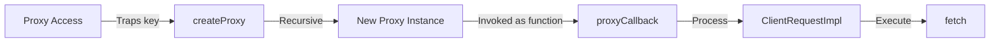

# RPC Client

<details>
<summary>Relevant source files</summary>

The following files were used as context for generating this wiki page:

- [src/types.ts](https://github.com/honojs/hono/blob/main/src/types.ts)
- [src/client/client.ts](https://github.com/honojs/hono/blob/main/src/client/client.ts)
- [src/hono-base.ts](https://github.com/honojs/hono/blob/main/src/hono-base.ts)
- [src/client/types.ts](https://github.com/honojs/hono/blob/main/src/client/types.ts)
- [src/preset/quick.ts](https://github.com/honojs/hono/blob/main/src/preset/quick.ts)
- [src/hono.ts](https://github.com/honojs/hono/blob/main/src/hono.ts)
- [src/helper/ssg/ssg.ts](https://github.com/honojs/hono/blob/main/src/helper/ssg/ssg.ts)
- [src/adapter/lambda-edge/handler.ts](https://github.com/honojs/hono/blob/main/src/adapter/lambda-edge/handler.ts)
- [README.md](https://github.com/honojs/hono/blob/main/README.md)
- [package.json](https://github.com/honojs/hono/blob/main/package.json)
</details>

The "RPC Client" (typically invoked via the `hc` function) is a type-safe client that enables end-to-end type safety between a Hono server and its frontend consumers. By leveraging Hono's schema definitions, the client provides a full-featured, proxy-based interface that mirrors the structure of the API routes defined on the server without requiring manual creation of fetch wrappers.

The client operates by using a `Proxy` object that captures method chains. When a developer calls a method like `client.api.users.$get()`, the proxy records the path components and the HTTP method, transforming these into standard fetch requests. This architecture allows the client to dynamically adapt to API changes; if the server schema is updated, the TypeScript compiler automatically reflects these changes in the client, eliminating the common synchronization gap between backend and frontend.

Unlike traditional REST clients that require explicit endpoint definitions, the Hono RPC client is "schema-first." It inspects the `Hono` app's schema and generates a corresponding client structure. This design decision prioritizes developer experience and maintenance, as the API contract is derived directly from the code implementation itself, reducing boilerplate and minimizing runtime errors caused by mismatched parameters or response shapes.

## The Proxy Mechanism
The core of the RPC client is built around a `createProxy` factory function. This function creates a recursive `Proxy` that traps property access and function calls. When accessed (e.g., `client.users`), it returns a new proxy instance that pushes the accessed key into a path array. When invoked as a function (e.g., `client.users.$get()`), it executes a callback that processes the collected path and the triggered HTTP method.


Sources: [src/client/client.ts:15-31](https://github.com/honojs/hono/blob/main/src/client/client.ts#L15-L31)

## Client Lifecycle and Request Execution
The lifecycle begins when `hc<T>(url)` is called. The `proxyCallback` identifies the target method by checking if the last path part starts with a `$` character (e.g., `$get`, `$post`). It then constructs a `ClientRequestImpl` instance, which encapsulates the URL, method, and query parameters. Finally, calling `.fetch()` on this request object triggers the actual `fetch` call.

> [!TIP]
> The RPC client can interact with both standard HTTP endpoints and WebSockets. The proxy callback automatically detects `$ws` calls to initiate WebSocket connections, providing a unified API for different communication patterns.

Sources: [src/client/client.ts:133-212](https://github.com/honojs/hono/blob/main/src/client/client.ts#L133-L212)

## Handling Path Parameters and Queries
Path parameters are handled via `replaceUrlParam`, which finds placeholders like `:id` in the URL string and substitutes them with provided arguments. Query parameters are serialized using `URLSearchParams` via a configurable `buildSearchParams` function, allowing developers to define how complex structures like nested objects or arrays are serialized into the query string.

Sources: [src/client/client.ts:60-62](https://github.com/honojs/hono/blob/main/src/client/client.ts#L60-L62), [src/client/client.ts:114-114](https://github.com/honojs/hono/blob/main/src/client/client.ts#L114-L114), [src/client/client.ts:175-175](https://github.com/honojs/hono/blob/main/src/client/client.ts#L175-L175)

## Request Options and Configuration
The client supports custom configuration options through its third-party hooks for custom `fetch` implementations (useful for testing or SSR) and `headers`. If a request defines its own headers and the client is also configured with global headers, the `deepMerge` function is used to combine them, ensuring that request-specific overrides are respected.

Sources: [src/client/client.ts:218-228](https://github.com/honojs/hono/blob/main/src/client/client.ts#L218-L228)

## Usage Example
To use the RPC client, simply pass the Hono app type to the `hc` function and provide the base URL.

```typescript
import { hc } from 'hono/client'
import type { AppType } from '../server/app' // The Hono app exported as a type

const client = hc<AppType>('http://api.example.com')

// Type-safe GET request
const res = await client.users[':id'].$get({
  param: { id: '123' },
  query: { include: 'profile' }
})

if (res.ok) {
  const data = await res.json()
  console.log(data)
}
```
Sources: [src/client/client.ts:133-133](https://github.com/honojs/hono/blob/main/src/client/client.ts#L133-L133)

## Notable Invariants and Constraints
- The `Proxy` traps `then` and `typeof key !== 'string'` to prevent potential conflicts with promise resolution or non-string property access, ensuring compatibility with standard JavaScript idioms.
- The `method` regex `/^\$/` is a strict requirement for identifying action-oriented methods on the proxy chain.
- The `lastParts` analysis in `hc` ensures that methods like `toString` and `valueOf` are preserved, allowing the proxy to be used in contexts where an object might be coerced into a string.

Sources: [src/client/client.ts:18-18](https://github.com/honojs/hono/blob/main/src/client/client.ts#L18-L18), [src/client/client.ts:143-159](https://github.com/honojs/hono/blob/main/src/client/client.ts#L143-L159), [src/client/client.ts:162-162](https://github.com/honojs/hono/blob/main/src/client/client.ts#L162-L162)

## Related

- [[Application Instance]]
