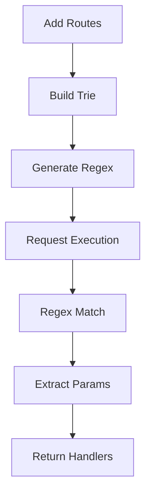
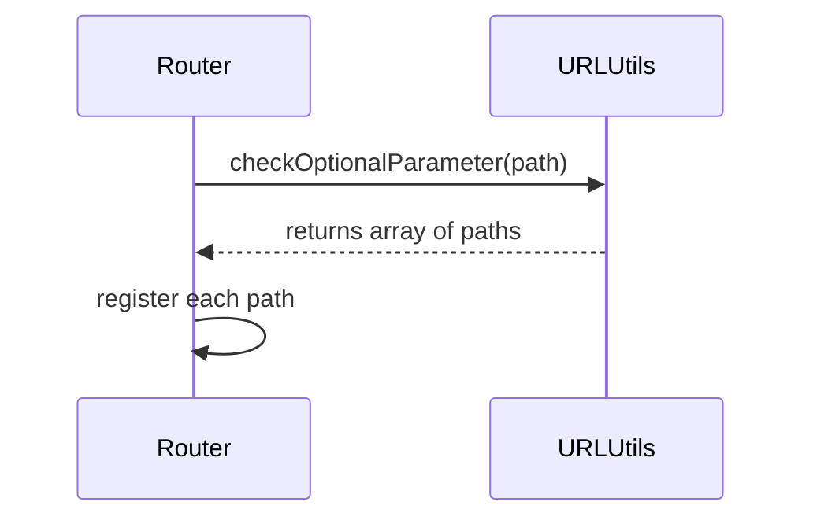

# Specialized Routers

<details>
<summary>Relevant source files</summary>

The following files were used as context for generating this wiki page:

- [package.json](https://github.com/honojs/hono/blob/main/package.json)
- [src/types.ts](https://github.com/honojs/hono/blob/main/src/types.ts)
- [src/preset/quick.ts](https://github.com/honojs/hono/blob/main/src/preset/quick.ts)
- [src/router/linear-router/router.ts](https://github.com/honojs/hono/blob/main/src/router/linear-router/router.ts)
- [src/utils/url.ts](https://github.com/honojs/hono/blob/main/src/utils/url.ts)
- [src/router/reg-exp-router/prepared-router.ts](https://github.com/honojs/hono/blob/main/src/router/reg-exp-router/prepared-router.ts)
- [src/preset/tiny.ts](https://github.com/honojs/hono/blob/main/src/preset/tiny.ts)
- [src/router/reg-exp-router/router.ts](https://github.com/honojs/hono/blob/main/src/router/reg-exp-router/router.ts)
- [src/router/pattern-router/router.ts](https://github.com/honojs/hono/blob/main/src/router/pattern-router/router.ts)
- [src/helper/route/index.ts](https://github.com/honojs/hono/blob/main/src/helper/route/index.ts)
- [jsr.json](https://github.com/honojs/hono/blob/main/jsr.json)
- [src/router/trie-router/router.ts](https://github.com/honojs/hono/blob/main/src/router/trie-router/router.ts)
- [src/router/linear-router/index.ts](https://github.com/honojs/hono/blob/main/src/router/linear-router/index.ts)
- [src/router/pattern-router/index.ts](https://github.com/honojs/hono/blob/main/src/router/pattern-router/index.ts)
- [src/router/trie-router/node.ts](https://github.com/honojs/hono/blob/main/src/router/trie-router/node.ts)
</details>

Specialized Routers provide the infrastructure for mapping HTTP requests to their respective handlers within the Hono framework. Because different execution environments (like edge workers, browsers, or standard Node.js) and different use cases (like minimal size vs. maximum performance) impose conflicting requirements, Hono does not force a "one-size-fits-all" routing strategy. Instead, it offers a suite of router implementations optimized for various trade-offs.

These routers are designed to handle complex routing requirements, including static paths, parameters with regex-based constraints, and wildcards. By abstracting the routing logic into pluggable components, Hono allows developers to pick the implementation that best fits their deployment context. Whether it is the highly optimized `RegExpRouter` used in high-performance settings or the `PatternRouter` used for tiny bundle sizes, all routers adhere to a common interface that ensures consistent handler execution and parameter extraction.

The routing subsystem integrates deeply with Hono's middleware and context systems, allowing for path-based execution. When a request enters the system, the chosen router processes the URL path and HTTP method, yielding a result that contains the appropriate handlers and any extracted route parameters. This process is fully transparent to the application code, which interacts with a unified API regardless of the underlying routing mechanism.

## Router Strategy and Selection

Hono utilizes a modular architecture where specific router implementations can be selected based on the desired performance profile or constraints. The `SmartRouter` acts as a facade, often coordinating multiple strategies to determine the most effective match during initialization.

| Router | Strategy | Primary Benefit |
| :--- | :--- | :--- |
| `LinearRouter` | Iterative scan | Simple to implement, low memory footprint |
| `TrieRouter` | Tree-based traversal | Fast lookups for complex route trees |
| `RegExpRouter` | Compilation to regex | High performance through regex engine optimization |
| `PatternRouter` | Regex-based pattern matching | Extremely small binary/bundle size |

Sources: [src/preset/quick.ts:20-22](https://github.com/honojs/hono/blob/main/src/preset/quick.ts#L20-L22)

Sources: [src/preset/tiny.ts:18-18](https://github.com/honojs/hono/blob/main/src/preset/tiny.ts#L18-L18)

## The Router Interface

Every router must satisfy a common contract. The core mechanism involves two primary operations: `add` for registering route-to-handler mappings, and `match` for resolving an incoming request to its handlers and parameters.

Sources: [src/router.ts:1-2](https://github.com/honojs/hono/blob/main/src/router.ts#L1-L2)

```typescript
export interface Router<T> {
  name: string
  add(method: string, path: string, handler: T): void
  match(method: string, path: string): Result<T>
}
```

Sources: [src/router.ts:1-2](https://github.com/honojs/hono/blob/main/src/router.ts#L1-L2)

The `match` function returns a `Result<T>`, which encapsulates the successful path resolution. If a path matches multiple rules (e.g., specific paths and middleware wildcards), the router is responsible for ordering these to ensure middleware execution order follows expected precedence.

Sources: [src/router/linear-router/router.ts:11-143](https://github.com/honojs/hono/blob/main/src/router/linear-router/router.ts#L11-L143)

## RegExpRouter Mechanism

The `RegExpRouter` is designed for performance by consolidating all routes into a single regular expression. During initialization, the router uses a `Trie` structure to build this expression.

Sources: [src/router/reg-exp-router/router.ts:34-103](https://github.com/honojs/hono/blob/main/src/router/reg-exp-router/router.ts#L34-L103)

1. **Preprocessing:** Routes are registered and analyzed for parameters, wildcards, and static components.
2. **Trie Construction:** A `Trie` is built to represent the path structure.
3. **Regex Compilation:** `buildRegExp()` transforms the trie into a unified regular expression capable of matching multiple paths and capturing parameters in a single pass.
4. **Execution:** Upon `match()`, the router executes the regex against the path. The resulting indices are mapped back to handlers and parameter values.

Sources: [src/router/reg-exp-router/trie.ts:1-120](https://github.com/honojs/hono/blob/main/src/router/reg-exp-router/trie.ts#L1-L120)

> [!IMPORTANT]
> The `RegExpRouter` requires that routes are fully registered before the first request, as the matcher is built upon the first call or via an explicit `buildAllMatchers` step. This prevents runtime route modification while enabling optimized regex execution.

Sources: [src/router/reg-exp-router/router.ts:136-138](https://github.com/honojs/hono/blob/main/src/router/reg-exp-router/router.ts#L136-L138)



Sources: [src/router/reg-exp-router/router.ts:82-94](https://github.com/honojs/hono/blob/main/src/router/reg-exp-router/router.ts#L82-L94)

## LinearRouter Execution Flow

The `LinearRouter` implements a straightforward iterative approach, which is ideal for small route counts where the overhead of trie construction would be unnecessary. It stores routes in an internal list and performs linear scanning.

Sources: [src/router/linear-router/router.ts:11-13](https://github.com/honojs/hono/blob/main/src/router/linear-router/router.ts#L11-L13)

- **`add()`**: Appends the method, path, and handler triplet to the `#routes` array.
- **`match()`**: Iterates through the entire array. For each entry, it checks if the method matches (`routeMethod === method || routeMethod === METHOD_NAME_ALL`).
- **Path Matching**: It checks static paths directly, performs regex-based label extraction for dynamic parts (e.g., `/:label`), and handles wildcards via character code checks (`endsWithStar` / 42).

Sources: [src/router/linear-router/router.ts:15-23](https://github.com/honojs/hono/blob/main/src/router/linear-router/router.ts#L15-L23)

> [!WARNING]
> Because `LinearRouter` performs an O(N) scan, it is not recommended for applications with thousands of dynamic routes.

Sources: [src/router/linear-router/router.ts:27-140](https://github.com/honojs/hono/blob/main/src/router/linear-router/router.ts#L27-L140)

## Parameter Extraction and Decoding

Routers must handle complex path parameters, including optional parameters and custom patterns. The `src/utils/url.ts` module provides the foundational tools for this. When a router encounters a parameter like `:label{pattern}`, it delegates the pattern extraction logic to `getPattern()`.

Sources: [src/utils/url.ts:51-78](https://github.com/honojs/hono/blob/main/src/utils/url.ts#L51-L78)

- **Encoding:** Paths often contain URL-encoded characters. Routers use `tryDecodeURI` to normalize paths before matching, ensuring that `%20` or other sequences don't break matching invariants.
- **Optional Params:** The `checkOptionalParameter` function transforms a path like `/api/:type?` into two distinct registered routes: `/api` and `/api/:type`. This allows the router to remain agnostic of optional syntax by treating it as two concrete paths.

Sources: [src/utils/url.ts:104-127](https://github.com/honojs/hono/blob/main/src/utils/url.ts#L104-L127)



Sources: [src/utils/url.ts:171-206](https://github.com/honojs/hono/blob/main/src/utils/url.ts#L171-L206)

## Worked Example: Router Configuration

The following example demonstrates how to initialize the `Quick` preset, which uses `SmartRouter` to select between `LinearRouter` and `TrieRouter` automatically.

Sources: [src/preset/quick.ts:13-24](https://github.com/honojs/hono/blob/main/src/preset/quick.ts#L13-L24)

```typescript
import { Hono } from '@hono/quick'

const app = new Hono()

// Simple route registration
app.get('/users/:id', (c) => {
  const id = c.req.param('id')
  return c.json({ id })
})

// Registration for optional parameters
app.get('/files/:name?', (c) => {
  const name = c.req.param('name')
  return c.text(`File: ${name || 'unknown'}`)
})
```

Sources: [src/preset/quick.ts:13-24](https://github.com/honojs/hono/blob/main/src/preset/quick.ts#L13-L24)

When `app.get` is called, the router delegates to its internal `add()` method. If a user visits `/users/123`, the internal matcher (e.g., `TrieRouter.match`) is invoked, traversing nodes to collect handlers and map `:id` to `123`.

Sources: [src/router/trie-router/router.ts:13-23](https://github.com/honojs/hono/blob/main/src/router/trie-router/router.ts#L13-L23)

## Related

- [[Router Architecture]]
