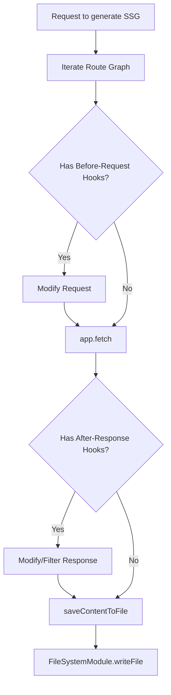
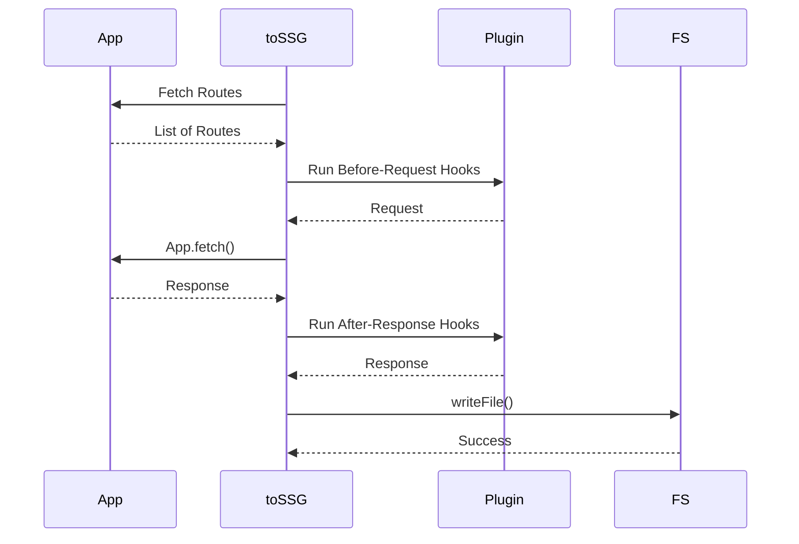

# Static Assets

<details>
<summary>Relevant source files</summary>

The following files were used as context for generating this wiki page:

- [package.json](https://github.com/honojs/hono/blob/main/package.json)
- [src/helper/ssg/ssg.ts](https://github.com/honojs/hono/blob/main/src/helper/ssg/ssg.ts)
- [src/adapter/cloudflare-pages/handler.ts](https://github.com/honojs/hono/blob/main/src/adapter/cloudflare-pages/handler.ts)
- [src/preset/quick.ts](https://github.com/honojs/hono/blob/main/src/preset/quick.ts)
- [README.md](https://github.com/honojs/hono/blob/main/README.md)
- [jsr.json](https://github.com/honojs/hono/blob/main/jsr.json)
- [src/adapter/lambda-edge/handler.ts](https://github.com/honojs/hono/blob/main/src/adapter/lambda-edge/handler.ts)
- [src/helper/ssg/utils.ts](https://github.com/honojs/hono/blob/main/src/helper/ssg/utils.ts)
- [src/helper/ssg/plugins.ts](https://github.com/honojs/hono/blob/main/src/helper/ssg/plugins.ts)
- [src/adapter/deno/serve-static.ts](https://github.com/honojs/hono/blob/main/src/adapter/deno/serve-static.ts)
- [src/helper/ssg/index.ts](https://github.com/honojs/hono/blob/main/src/helper/ssg/index.ts)
- [src/adapter/deno/index.ts](https://github.com/honojs/hono/blob/main/src/adapter/deno/index.ts)
- [src/middleware/serve-static/index.ts](https://github.com/honojs/hono/blob/main/src/middleware/serve-static/index.ts)
- [src/jsx/jsx-runtime.ts](https://github.com/honojs/hono/blob/main/src/jsx/jsx-runtime.ts)
- [src/adapter/deno/ssg.ts](https://github.com/honojs/hono/blob/main/src/adapter/deno/ssg.ts)
- [src/helper/ssg/middleware.ts](https://github.com/honojs/hono/blob/main/src/helper/ssg/middleware.ts)
- [src/adapter/bun/ssg.ts](https://github.com/honojs/hono/blob/main/src/adapter/bun/ssg.ts)
- [src/adapter/cloudflare-workers/serve-static.ts](https://github.com/honojs/hono/blob/main/src/adapter/cloudflare-workers/serve-static.ts)
- [src/adapter/bun/serve-static.ts](https://github.com/honojs/hono/blob/main/src/adapter/bun/serve-static.ts)
- [src/adapter/bun/index.ts](https://github.com/honojs/hono/blob/main/src/adapter/bun/index.ts)
- [src/adapter/cloudflare-pages/index.ts](https://github.com/honojs/hono/blob/main/src/adapter/cloudflare-pages/index.ts)
- [src/adapter/netlify/handler.ts](https://github.com/honojs/hono/blob/main/src/adapter/netlify/handler.ts)
- [src/adapter/cloudflare-workers/index.ts](https://github.com/honojs/hono/blob/main/src/adapter/cloudflare-workers/index.ts)
- [runtime-tests/deno/deno.json](https://github.com/honojs/hono/blob/main/runtime-tests/deno/deno.json)
- [src/adapter/vercel/handler.ts](https://github.com/honojs/hono/blob/main/src/adapter/vercel/handler.ts)
- [src/router/smart-router/index.ts](https://github.com/honojs/hono/blob/main/src/router/smart-router/index.ts)
- [src/index.ts](https://github.com/honojs/hono/blob/main/src/index.ts)
</details>

Static assets handling in Hono is a dual-purpose subsystem designed to accommodate both dynamic, runtime-based file serving and static site generation (SSG). Because Hono is runtime-agnostic, the challenge of serving files—which are traditionally filesystem-bound—is abstracted through a middleware layer that delegates actual I/O to platform-specific adapters (e.g., Bun, Deno, or KV stores). This architecture allows the developer to write uniform code while the framework handles the low-level retrieval of blobs or streams across heterogeneous environments.

For static site generation, Hono provides an experimental framework that traverses an application's route graph, triggers handlers to generate content, and persists the result to a specified directory. This pipeline is highly customizable via hooks and plugins, bridging the gap between a live Hono application and a build-time static generator. This unified approach ensures that a Hono app can function as a dynamic web server or serve as the engine for generating a completely static site.

## Runtime-Agnostic Static File Serving
The `serveStatic` middleware provides a standard interface for serving static files, acting as an abstraction over environment-specific file I/O operations. It is designed to be environment-agnostic, accepting a `getContent` callback function that each runtime must implement.

- **Path Normalization:** The middleware sanitizes file paths using a regex check `/(?:^|[\/\\])\.{1,2}(?:$|[\/\\])|[\/\\]{2,}|\\/` to prevent directory traversal attacks before attempting to serve a file.
- **Content Retrieval:** It delegates fetching to the runtime-specific `getContent` function. If the result is a `Response` object, it forwards it directly. Otherwise, it detects the MIME type and returns the content via `c.body()`.
- **Precompressed Support:** If `precompressed` is enabled, the middleware inspects the `Accept-Encoding` header of the incoming request and attempts to serve `.br`, `.zst`, or `.gz` files if found, automatically setting the `Content-Encoding` and `Vary` headers.

Sources: [src/middleware/serve-static/index.ts:60-126](https://github.com/honojs/hono/blob/main/src/middleware/serve-static/index.ts#L60-L126)

## Static Site Generation (SSG) Lifecycle
The SSG system transforms a Hono route map into a set of files on disk. The process follows a clear lifecycle of fetching routes, executing hooks, and persisting the resulting content.

### Execution Walkthrough: `toSSG`
1. **Route Discovery:** The SSG generator traverses routes filtered via `filterStaticGenerateRoutes`.
Sources: [src/helper/ssg/ssg.ts:225-231](https://github.com/honojs/hono/blob/main/src/helper/ssg/ssg.ts#L225-L231)
2. **Hook Execution:** For each route, the system executes registered hooks. If a hook returns `false`, that route is skipped.
Sources: [src/helper/ssg/ssg.ts:234-241](https://github.com/honojs/hono/blob/main/src/helper/ssg/ssg.ts#L234-L241)
3. **Execution:** The application runs the route handler using the `app.fetch` or `app.request` method, injecting `SSG_CONTEXT` to flag the runtime environment.
Sources: [src/helper/ssg/ssg.ts:243-269](https://github.com/honojs/hono/blob/main/src/helper/ssg/ssg.ts#L243-L269)
4. **Data Processing:** The middleware collects response headers and content, defaulting to `text/plain` if the `Content-Type` is absent, and invokes registered hooks.
Sources: [src/helper/ssg/ssg.ts:274-289](https://github.com/honojs/hono/blob/main/src/helper/ssg/ssg.ts#L274-L289)
5. **Persistence:** `saveContentToFile` determines the appropriate file extension using `determineExtension` (or the default MIME map) and invokes the `FileSystemModule` to write the content.
Sources: [src/helper/ssg/ssg.ts:310-334](https://github.com/honojs/hono/blob/main/src/helper/ssg/ssg.ts#L310-L334)

## Environment-Specific Adapters
Since Hono supports multiple runtimes, it delegates filesystem operations to dedicated adapters. Each adapter exports a version of `toSSG` and a `FileSystemModule` implementation appropriate for that environment.

| Adapter | Filesystem Operations | Characteristics |
| :--- | :--- | :--- |
| Bun | Built-in File I/O | Uses `Bun.write` for high-performance I/O. |
| Deno | Built-in File I/O | Uses `Deno.writeFile` and `Deno.mkdir`. |

Sources: [src/adapter/bun/ssg.ts:13-18](https://github.com/honojs/hono/blob/main/src/adapter/bun/ssg.ts#L13-L18)
Sources: [src/adapter/deno/ssg.ts:9-18](https://github.com/honojs/hono/blob/main/src/adapter/deno/ssg.ts#L9-L18)

## SSG Plugin and Hook Architecture
The SSG process allows for extension through a plugin-based architecture. Plugins are objects containing hook functions that allow manipulation of the request and response lifecycle during generation.

- **Hooks:**
  - `beforeRequestHook`: Allows modification of the `Request` before the app processes it.
  - `afterResponseHook`: Allows modification or replacement of the `Response` object after the handler finishes.
  - `afterGenerateHook`: Triggered after the entire generation process completes.
Sources: [src/helper/ssg/ssg.ts:110-179](https://github.com/honojs/hono/blob/main/src/helper/ssg/ssg.ts#L110-L179)

The plugin system allows developers to register multiple hooks, which are aggregated and executed sequentially during the lifecycle.
Sources: [src/helper/ssg/ssg.ts:397-419](https://github.com/honojs/hono/blob/main/src/helper/ssg/ssg.ts#L397-L419)

> [!CAUTION]
> When using multiple plugins, the execution order matters. For example, `redirectPlugin()` should generally be placed before the `defaultPlugin()` if you wish to process redirect responses as HTML files, because `defaultPlugin` contains logic that strictly skips non-200 responses.
Sources: [src/helper/ssg/plugins.ts:41-49](https://github.com/honojs/hono/blob/main/src/helper/ssg/plugins.ts#L41-L49)

## SSG Configuration and Guarding
The SSG system includes built-in middleware for controlling how specific routes behave during the generation process.

- `ssgParams`: Defines parameters for dynamic routes. If used, it effectively stops subsequent handler execution for that route to prevent unnecessary processing.
- `disableSSG`: Injects a header `x-hono-disable-ssg` into the response if the context is detected as an SSG operation, which the `toSSG` process subsequently respects by skipping that file.
- `onlySSG`: Middleware that rejects requests that are not part of an SSG generation context.

Sources: [src/helper/ssg/middleware.ts:43-83](https://github.com/honojs/hono/blob/main/src/helper/ssg/middleware.ts#L43-L83)

## Worked Example: Custom SSG Implementation
To generate a static site using Hono in a Node-like or Deno environment, implement the `FileSystemModule` and invoke `toSSG`.

Sources: [src/helper/ssg/ssg.ts:34-37](https://github.com/honojs/hono/blob/main/src/helper/ssg/ssg.ts#L34-L37)

The following snippet demonstrates defining a basic filesystem interface for Hono.
Sources: [src/adapter/deno/ssg.ts:9-18](https://github.com/honojs/hono/blob/main/src/adapter/deno/ssg.ts#L9-L18)

The core logic to execute the generation task is handled via the `toSSG` function.
Sources: [src/helper/ssg/ssg.ts:368-470](https://github.com/honojs/hono/blob/main/src/helper/ssg/ssg.ts#L368-L470)

```typescript
import { Hono } from 'hono'
import { toSSG } from 'hono/ssg'
import * as fs from 'node:fs/promises'

const app = new Hono()
app.get('/', (c) => c.text('Hello Hono SSG!'))

// Define a file system module for the environment
const fsModule = {
  writeFile: (path, data) => fs.writeFile(path, data),
  mkdir: (path, options) => fs.mkdir(path, options),
}

// Generate the site
const result = await toSSG(app, fsModule, { dir: './dist' })
console.log(`Generated ${result.files.length} files.`)
```
Sources: [src/helper/ssg/ssg.ts:368-470](https://github.com/honojs/hono/blob/main/src/helper/ssg/ssg.ts#L368-L470)





## Related

- [[Platform Adapters]]
