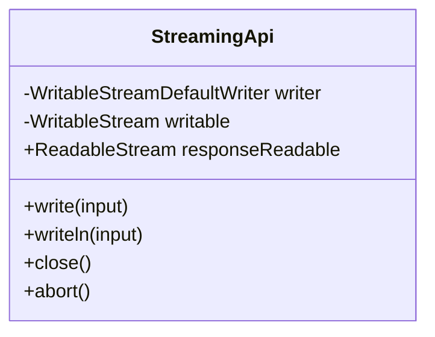
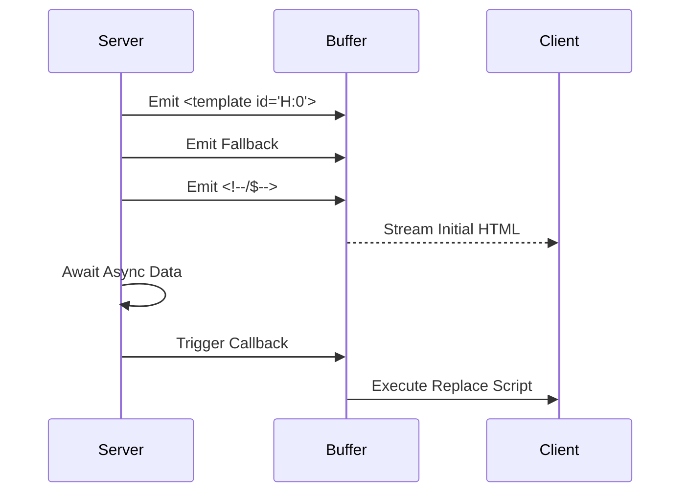

# Streaming Rendering

<details>
<summary>Relevant source files</summary>

The following files were used as context for generating this wiki page:

- [src/jsx/dom/render.ts](https://github.com/honojs/hono/blob/main/src/jsx/dom/render.ts)
- [src/jsx/context.ts](https://github.com/honojs/hono/blob/main/src/jsx/context.ts)
- [src/jsx/components.ts](https://github.com/honojs/hono/blob/main/src/jsx/components.ts)
- [src/jsx/streaming.ts](https://github.com/honojs/hono/blob/main/src/jsx/streaming.ts)
- [src/helper/streaming/sse.ts](https://github.com/honojs/hono/blob/main/src/helper/streaming/sse.ts)
- [src/jsx/base.ts](https://github.com/honojs/hono/blob/main/src/jsx/base.ts)
- [src/jsx/hooks/index.ts](https://github.com/honojs/hono/blob/main/src/jsx/hooks/index.ts)
- [src/helper/streaming/stream.ts](https://github.com/honojs/hono/blob/main/src/helper/streaming/stream.ts)
- [src/jsx/dom/intrinsic-element/components.ts](https://github.com/honojs/hono/blob/main/src/jsx/dom/intrinsic-element/components.ts)
- [src/helper/ssg/ssg.ts](https://github.com/honojs/hono/blob/main/src/helper/ssg/ssg.ts)
- [src/jsx/intrinsic-element/components.ts](https://github.com/honojs/hono/blob/main/src/jsx/intrinsic-element/components.ts)
- [src/middleware/etag/digest.ts](https://github.com/honojs/hono/blob/main/src/middleware/etag/digest.ts)
- [src/middleware/jsx-renderer/index.ts](https://github.com/honojs/hono/blob/main/src/middleware/jsx-renderer/index.ts)
- [src/jsx/dom/server.ts](https://github.com/honojs/hono/blob/main/src/jsx/dom/server.ts)
- [src/utils/html.ts](https://github.com/honojs/hono/blob/main/src/utils/html.ts)
- [src/utils/stream.ts](https://github.com/honojs/hono/blob/main/src/utils/stream.ts)
- [src/jsx/jsx-runtime.ts](https://github.com/honojs/hono/blob/main/src/jsx/jsx-runtime.ts)
- [src/jsx/dom/client.ts](https://github.com/honojs/hono/blob/main/src/jsx/dom/client.ts)
- [src/helper/streaming/text.ts](https://github.com/honojs/hono/blob/main/src/helper/streaming/text.ts)
- [src/helper/streaming/index.ts](https://github.com/honojs/hono/blob/main/src/helper/streaming/index.ts)
- [src/jsx/intrinsic-elements.ts](https://github.com/honojs/hono/blob/main/src/jsx/intrinsic-elements.ts)
- [src/jsx/index.ts](https://github.com/honojs/hono/blob/main/src/jsx/index.ts)
- [src/jsx/intrinsic-element/common.ts](https://github.com/honojs/hono/blob/main/src/jsx/intrinsic-element/common.ts)
- [src/jsx/dom/components.ts](https://github.com/honojs/hono/blob/main/src/jsx/dom/components.ts)
- [runtime-tests/lambda/stream-mock.ts](https://github.com/honojs/hono/blob/main/runtime-tests/lambda/stream-mock.ts)
- [src/jsx/jsx-dev-runtime.ts](https://github.com/honojs/hono/blob/main/src/jsx/jsx-dev-runtime.ts)
- [src/jsx/dom/jsx-dev-runtime.ts](https://github.com/honojs/hono/blob/main/src/jsx/dom/jsx-dev-runtime.ts)
- [src/jsx/dom/jsx-runtime.ts](https://github.com/honojs/hono/blob/main/src/jsx/dom/jsx-runtime.ts)
- [src/jsx/dom/index.ts](https://github.com/honojs/hono/blob/main/src/jsx/dom/index.ts)
- [package.json](https://github.com/honojs/hono/blob/main/package.json)
</details>

Streaming Rendering in Hono is a high-performance architectural strategy designed to send HTML to the client incrementally as it is generated, rather than waiting for an entire component tree to resolve. This approach significantly improves the Time to First Byte (TTFB) and perceived performance for complex or asynchronous UIs, as parts of the document can be flushed to the network before others have finished rendering.

At its core, streaming relies on asynchronous primitives and HTML template injection. When Hono’s JSX engine encounters a deferred operation—such as a component waiting on data or a `Suspense` boundary—it does not block the entire response process. Instead, it emits placeholders or empty tags into the buffer, attaches callback handlers, and continues flushing the rest of the stream. Once the asynchronous work completes, these callbacks execute to patch the emitted HTML with the actual content.

This subsystem integrates tightly with the request lifecycle, utilizing request-scoped storage to preserve context isolation across asynchronous boundaries. By carefully managing these streams, Hono provides a seamless bridge between server-rendered content and dynamic, reactive UI components, effectively balancing the benefits of static HTML delivery with the interactivity requirements of modern web applications.

## Streaming API Architecture
The streaming subsystem in Hono is built upon the standard `ReadableStream` and `WritableStream` interfaces, providing a robust wrapper via the `StreamingApi` class. This class abstracts the complexities of direct writer interaction, offering helper methods like `write()` and `writeln()` for low-level data transmission.
Sources: [src/utils/stream.ts:6-12](https://github.com/honojs/hono/blob/main/src/utils/stream.ts#L6-L12)

The architecture centers on the `StreamingApi`, which manages a pair of writable and readable streams. The `WritableStreamDefaultWriter` is used to push data, while the readable stream exposes the final output to the Hono response system.
Sources: [src/utils/stream.ts:21-26](https://github.com/honojs/hono/blob/main/src/utils/stream.ts#L21-L26)

A critical mechanism in this architecture is the `abortSubscribers` list; because streams are long-lived, the API provides an `onAbort()` hook allowing developers to clean up resources—such as closing database connections or cancelling data fetches—if the client disconnects or the request is aborted prematurely.
Sources: [src/utils/stream.ts:10-10](https://github.com/honojs/hono/blob/main/src/utils/stream.ts#L10-L10)


Sources: [src/utils/stream.ts:6-98](https://github.com/honojs/hono/blob/main/src/utils/stream.ts#L6-L98)

## Suspense and Async Rendering
`Suspense` in Hono acts as a boundary for asynchronous rendering. When a component hierarchy contains a `Suspense` component with an asynchronous child, the render process triggers a transition that allows the parent stream to continue while the child component waits for its promise to resolve.
Sources: [src/jsx/streaming.ts:42-49](https://github.com/honojs/hono/blob/main/src/jsx/streaming.ts#L42-L49)

The mechanism uses a `template` tag with a unique ID as a placeholder. During initial stream generation, the `Suspense` boundary emits this template. It then attaches a callback of type `HtmlEscapedCallback` to the response buffer. Once the child promises settle, the callback is invoked to replace the placeholder in the DOM via a small, injected script.
Sources: [src/jsx/streaming.ts:87-133](https://github.com/honojs/hono/blob/main/src/jsx/streaming.ts#L87-L133)

This ensures that even when data fetching is delayed, the user receives an initial HTML skeleton immediately.
Sources: [src/jsx/streaming.ts:90-117](https://github.com/honojs/hono/blob/main/src/jsx/streaming.ts#L90-L117)


Sources: [src/jsx/streaming.ts:42-137](https://github.com/honojs/hono/blob/main/src/jsx/streaming.ts#L42-L137)

## SSE Streaming API
Server-Sent Events (SSE) streaming extends the base `StreamingApi` to handle event-driven communication. The `SSEStreamingApi` adds a specific `writeSSE()` method that formats messages according to the standard `data:`, `event:`, `id:`, and `retry:` format.
Sources: [src/helper/streaming/sse.ts:13-16](https://github.com/honojs/hono/blob/main/src/helper/streaming/sse.ts#L13-L16)

The `streamSSE` helper provides a clean interface for Hono developers to implement SSE. It configures the necessary HTTP headers, including `Content-Type: text/event-stream` and `Cache-Control: no-cache`. 
Sources: [src/helper/streaming/sse.ts:92-95](https://github.com/honojs/hono/blob/main/src/helper/streaming/sse.ts#L92-L95)

A critical structural detail is the use of a `WeakMap` named `contextStash` to hold the Hono `Context` reference against the `ReadableStream` throughout the stream's lifetime, ensuring that the request context survives until the response stream closes.
Sources: [src/helper/streaming/sse.ts:70-90](https://github.com/honojs/hono/blob/main/src/helper/streaming/sse.ts#L70-L90)

| Field | Purpose |
| :--- | :--- |
| `event` | Optional event name for the browser's `addEventListener`. |
| `data` | The stringified payload to be streamed to the client. |
| `id` | Optional unique identifier for the event message. |
| `retry` | Time in milliseconds the browser should wait before reconnecting. |
Sources: [src/helper/streaming/sse.ts:6-11](https://github.com/honojs/hono/blob/main/src/helper/streaming/sse.ts#L6-L11)

## Context Preservation Across Await
A significant challenge in streaming is maintaining the correct `Context` values (e.g., themes, user info) after an `await` statement. Hono resolves this using a per-render store typed as `WeakMap<Context<unknown>, unknown[]>` which is isolated per request.
Sources: [src/jsx/context.ts:16-16](https://github.com/honojs/hono/blob/main/src/jsx/context.ts#L16-L16)

The `runWithRenderContext` function ensures this store is correctly propagated. When available, it leverages `AsyncLocalStorage` to maintain request isolation. On platforms lacking this, it uses a fallback mechanism that provides a request-scoped store for synchronous rendering phases.
Sources: [src/jsx/context.ts:161-172](https://github.com/honojs/hono/blob/main/src/jsx/context.ts#L161-L172)

> [!WARNING]
> In environments without `AsyncLocalStorage`, accessing context values after an `await` boundary will fall back to the default value defined in `createContext`. This is a trade-off made to prevent cross-request context leakage.
Sources: [src/jsx/context.ts:153-160](https://github.com/honojs/hono/blob/main/src/jsx/context.ts#L153-L160)

## Call-Chain Walkthrough: Sending SSE
When `streamSSE` is called, it initializes the streaming subsystem and begins the response flow.

First, `streamSSE()` is invoked to create a `TransformStream`, initialize the `SSEStreamingApi`, and set the necessary HTTP headers for server-sent events.
Sources: [src/helper/streaming/sse.ts:72-88](https://github.com/honojs/hono/blob/main/src/helper/streaming/sse.ts#L72-L88)

Next, the `run()` function manages the execution of the callback `cb`, wrapping it in a `try...catch` block to ensure `stream.close()` is called in the `finally` block, regardless of outcome.
Sources: [src/helper/streaming/sse.ts:47-68](https://github.com/honojs/hono/blob/main/src/helper/streaming/sse.ts#L47-L68)

Finally, `writeSSE()` formats the message according to SSE specs and triggers the actual transmission via `this.write()`, which encodes the message into a `Uint8Array` before pushing to the internal writer.
Sources: [src/helper/streaming/sse.ts:18-44](https://github.com/honojs/hono/blob/main/src/helper/streaming/sse.ts#L18-L44)

## Worked Example: Basic SSE Implementation
This example demonstrates setting up an SSE stream that periodically sends server time to the client.

```typescript
import { streamSSE } from 'hono/streaming'

app.get('/sse', (c) => {
  return streamSSE(c, async (stream) => {
    while (true) {
      await stream.writeSSE({
        data: new Date().toISOString(),
        event: 'time-update',
        id: String(Date.now())
      })
      await stream.sleep(1000)
    }
  })
})
```
Sources: [src/helper/streaming/sse.ts:72-100](https://github.com/honojs/hono/blob/main/src/helper/streaming/sse.ts#L72-L100)

## Related

- [[JSX Runtime]]
