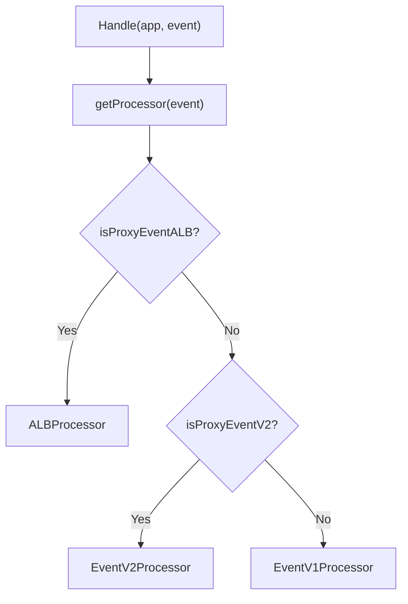

# Testing and Diagnostics

<details>
<summary>Relevant source files</summary>

The following files were used as context for generating this wiki page:

- [src/context.ts](https://github.com/honojs/hono/blob/main/src/context.ts)
- [package.json](https://github.com/honojs/hono/blob/main/package.json)
- [src/client/client.ts](https://github.com/honojs/hono/blob/main/src/client/client.ts)
- [src/adapter/aws-lambda/handler.ts](https://github.com/honojs/hono/blob/main/src/adapter/aws-lambda/handler.ts)
- [src/types.ts](https://github.com/honojs/hono/blob/main/src/types.ts)
</details>

The architecture of testing and diagnostics in Hono is fundamentally integrated into the system's design rather than treated as an afterthought. Because Hono is built to run on various edge runtimes, its diagnostics rely on high-fidelity request context objects and platform-specific adapters. These components provide the hooks necessary to inspect state, trace request flows, and mock environmental dependencies without needing a full-stack deployment.

The architecture solves the problem of "platform drift" by abstracting the `Context` and `Request` objects, which decouple the framework's logic from the specific runtime event format. By utilizing these abstractions, developers can write unit tests that simulate diverse environment bindings, HTTP headers, and multipart form bodies in a controlled manner, essentially using the framework’s internal types to perform type-safe diagnostics during development.

Key design decisions revolve around the `Context` object, which aggregates headers, status codes, and environment variables into a single, mutable container. This design allows developers to set values (`c.set`) and inspect state throughout the middleware chain, providing a clear path for diagnostics. When issues occur, this structure enables precise inspection of how request objects are processed and how outgoing responses are constructed by the underlying adapters.

## Contextual State and Variables
The `Context` class acts as the central hub for request-time diagnostics. By providing methods like `.get()`, `.set()`, and `.var`, it allows developers to track the lifecycle of variables through middleware. The internal state, managed via a private `Map`, ensures that state modification is restricted and traceable.

The `finalized` flag (line 317 in `src/context.ts`) is a critical diagnostic guard. When `finalized` becomes `true` (often via `c.res = ...`), the system prevents further modifications to the response body unless explicitly handled by the internal `newResponse` method. This invariant prevents "phantom" headers or duplicate status code writes that are notoriously difficult to debug in asynchronous environments.

Sources: [src/context.ts:293-317](https://github.com/honojs/hono/blob/main/src/context.ts#L293-L317)

## Adaptive Request Transformation
Diagnostics on AWS Lambda require transforming platform-specific events (APIGateway, ALB, Lattice) into standardized `Request` objects. The system handles this through a polymorphic `EventProcessor` hierarchy. The `getProcessor` function acts as the factory, selecting the correct processor based on the input event structure.


Sources: [src/adapter/aws-lambda/handler.ts:625-637](https://github.com/honojs/hono/blob/main/src/adapter/aws-lambda/handler.ts#L625-L637)

The `ALBProcessor` and `EventV1Processor` maintain explicit logic for handling `multiValueHeaders` versus standard headers. This distinction is vital for diagnostics because AWS often toggles these formats based on configuration, causing header name collisions or misformatted cookie data.

Sources: [src/adapter/aws-lambda/handler.ts:443-623](https://github.com/honojs/hono/blob/main/src/adapter/aws-lambda/handler.ts#L443-L623)

## Binary Detection Diagnostics
A recurring diagnostic issue in Lambda environments is the incorrect base64 encoding of binary data. The framework provides a `defaultIsContentTypeBinary` function to determine this at runtime based on the `Content-Type` header.

| Diagnostic Rule | Logic |
| :--- | :--- |
| Text detection | `!/^text\/(?:plain\|html\|css\|javascript\|csv)...` |
| Binary encoding | `isContentEncodingBinary(contentEncoding)` |

Sources: [src/adapter/aws-lambda/handler.ts:666-670](https://github.com/honojs/hono/blob/main/src/adapter/aws-lambda/handler.ts#L666-L670)

This logic prevents binary corruption by ensuring non-text types are correctly identified and processed through `encodeBase64`. 

Sources: [src/adapter/aws-lambda/handler.ts:349-359](https://github.com/honojs/hono/blob/main/src/adapter/aws-lambda/handler.ts#L349-L359)

Users can override this by providing their own `isContentTypeBinary` function in the `handle` options, enabling easier debugging for custom file types.

Sources: [src/adapter/aws-lambda/handler.ts:195-210](https://github.com/honojs/hono/blob/main/src/adapter/aws-lambda/handler.ts#L195-L210)

> [!TIP]
> Use `isContentTypeBinary` override when debugging binary responses. If your images are returning as broken strings, the system has likely identified them as text; inspect the header passed to the application to see if the MIME type matches the regex.

Sources: [src/adapter/aws-lambda/handler.ts:661-674](https://github.com/honojs/hono/blob/main/src/adapter/aws-lambda/handler.ts#L661-L674)

## Client-Side Proxy Mocking
The `hc` (Hono Client) uses `Proxy` objects to simulate endpoints for testing. This design allows developers to write code as if calling remote API functions (`hc().api.endpoint.$post({ json: ... })`). Because these calls are intercepted by the proxy's `apply` handler, it becomes trivial to unit-test the path structure without actually making network requests.

Sources: [src/client/client.ts:133-137](https://github.com/honojs/hono/blob/main/src/client/client.ts#L133-L137)

```typescript
// Example: Creating a testable client structure
import { hc } from 'hono/client';
const client = hc('http://localhost:8787');

// Diagnostic inspection of the path resolution
console.log(client.api.users.name.toString()); // returns "api/users"
```
Sources: [src/client/client.ts:137-150](https://github.com/honojs/hono/blob/main/src/client/client.ts#L137-L150)

The diagnostic mechanism here is the ability to call `.name.toString()` on any segment of the client chain. This returns the accumulated path string, allowing you to debug complex routing logic without a live instance.

Sources: [src/client/client.ts:143-150](https://github.com/honojs/hono/blob/main/src/client/client.ts#L143-L150)

## Execution Context Invariants
The `Context` class enforces invariants on the execution environment. If you access `c.event` in an environment lacking a `FetchEvent` (e.g., standard Node.js), it throws a hard error.

> [!CAUTION]
> Do not assume `c.executionCtx` is always available. Check your environment (Cloudflare vs Lambda) before relying on `waitUntil`. Accessing it outside an supported event loop triggers: `throw Error('This context has no ExecutionContext')`.

Sources: [src/context.ts:391-397](https://github.com/honojs/hono/blob/main/src/context.ts#L391-L397)

## Execution Flow: Request Handling
The request lifecycle follows a strict sequence, enabling clear breakpoints:
1. `handle()`: Receives the platform event (e.g., Lambda event).
2. `getProcessor()`: Selects the strategy for the incoming event type.
3. `processor.createRequest()`: Translates the raw platform object into a `Request`.
4. `app.fetch()`: The entry point for standard Hono middleware/routing logic.
5. `processor.createResult()`: Translates the Hono `Response` back into a platform-specific object.

This separation ensures that diagnostic errors (like 400 Bad Request) are trapped before they enter the application logic.

Sources: [src/adapter/aws-lambda/handler.ts:252-276](https://github.com/honojs/hono/blob/main/src/adapter/aws-lambda/handler.ts#L252-L276)

## Development Environment Configuration
The system relies on `vitest` for the test suite, allowing developers to target specific runtimes. This is evidenced in `package.json` where projects are split by environment.

Sources: [package.json:14-23](https://github.com/honojs/hono/blob/main/package.json#L14-L23)

| Test Project | Rationale |
| :--- | :--- |
| `workerd` | Tests compliance with Cloudflare Workers' runtime. |
| `lambda` | Tests adapter compatibility with AWS Lambda events. |
| `bun` | Tests Hono against Bun's native implementation. |

Sources: [package.json:17-22](https://github.com/honojs/hono/blob/main/package.json#L17-L22)

By separating these, you can isolate if a bug is systemic or isolated to a specific runtime adapter's event transformation.

Sources: [package.json:14-23](https://github.com/honojs/hono/blob/main/package.json#L14-L23)

## Related

- [[Quick Start]]
