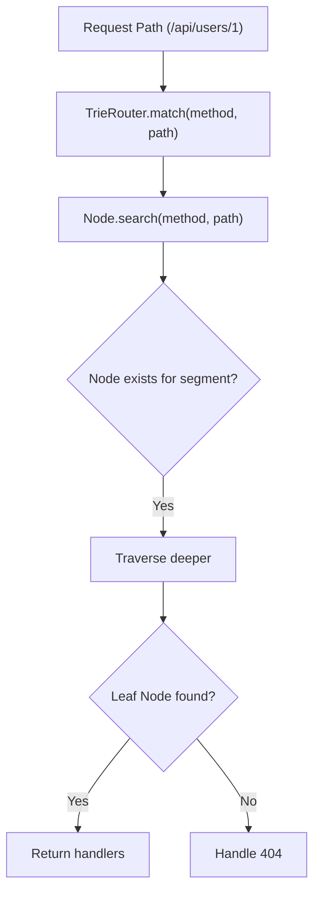

# Trie Router

<details>
<summary>Relevant source files</summary>

The following files were used as context for generating this wiki page:

- [src/types.ts](https://github.com/honojs/hono/blob/main/src/types.ts)
- [src/jsx/dom/render.ts](https://github.com/honojs/hono/blob/main/src/jsx/dom/render.ts)
- [src/client/client.ts](https://github.com/honojs/hono/blob/main/src/client/client.ts)
- [src/hono-base.ts](https://github.com/honojs/hono/blob/main/src/hono-base.ts)
- [src/preset/quick.ts](https://github.com/honojs/hono/blob/main/src/preset/quick.ts)
- [src/router/trie-router/router.ts](https://github.com/honojs/hono/blob/main/src/router/trie-router/router.ts)
- [package.json](https://github.com/honojs/hono/blob/main/package.json)
</details>

The **Trie Router** is a high-performance routing mechanism implemented as a specialized tree data structure (Trie). Unlike simple linear iteration routers, the Trie Router organizes route paths into a hierarchical tree where each segment of the URI path corresponds to a node in the tree. This allows the router to perform constant-time or sub-linear lookups by traversing the tree based on path segments, making it exceptionally efficient for applications with a large number of routes.

The primary problem the Trie Router solves is routing complexity. In traditional linear routers, checking a request path against registered routes requires iterating through every registered pattern (O(N) complexity). By contrast, the Trie Router isolates shared path prefixes within the tree structure, reducing the lookup operation to the depth of the path (the number of segments in the URL), which is significantly more scalable as the number of application routes grows.

In the Hono ecosystem, the `TrieRouter` is a core routing implementation. It is used alongside others in the `SmartRouter`, which manages multiple routing strategies to balance performance and functionality. The Trie Router interacts directly with path segments processed by utility functions, ensuring that dynamic URL segments and optional parameters are handled correctly within the hierarchy.

Sources: [src/router/trie-router/router.ts:1-28](https://github.com/honojs/hono/blob/main/src/router/trie-router/router.ts#L1-L28)

## Core Data Structure: The Node

The Trie Router is built upon a recursive `Node` structure. Each `Node` represents a path segment. When a route is registered, the router traverses the tree, splitting the path by `/`. If a corresponding segment node does not exist, a new one is created.

Sources: [src/router/trie-router/router.ts:3-10](https://github.com/honojs/hono/blob/main/src/router/trie-router/router.ts#L3-L10)

The hierarchy functions by splitting the input path into segments and descending into the tree node-by-node.

Sources: [src/router/trie-router/router.ts:17-22](https://github.com/honojs/hono/blob/main/src/router/trie-router/router.ts#L17-L22)

The router stores the handler at the terminating node for the specific HTTP method. This ensures that lookups only visit the branches relevant to the request path, effectively pruning the search space for any incoming HTTP request.

Sources: [src/router/trie-router/router.ts:13-22](https://github.com/honojs/hono/blob/main/src/router/trie-router/router.ts#L13-L22)

## Registration and Optional Parameters

The `TrieRouter.add` method is the entry point for route registration. Before the segment-based insertion, the router checks for optional path parameters using `checkOptionalParameter` from `src/utils/url.ts`.

Sources: [src/router/trie-router/router.ts:13-14](https://github.com/honojs/hono/blob/main/src/router/trie-router/router.ts#L13-L14)

> [!NOTE]
> Optional parameters in paths (e.g., `/api/:id?`) are expanded by `checkOptionalParameter` into multiple concrete paths. The Trie Router treats these as multiple registration attempts on the same tree, ensuring that all variations are reachable by the lookup mechanism.

Sources: [src/router/trie-router/router.ts:15-18](https://github.com/honojs/hono/blob/main/src/router/trie-router/router.ts#L15-L18)

```typescript
add(method: string, path: string, handler: T) {
  const results = checkOptionalParameter(path)
  if (results) {
    for (let i = 0, len = results.length; i < len; i++) {
      this.#node.insert(method, results[i], handler)
    }
    return
  }
  this.#node.insert(method, path, handler)
}
```
Sources: [src/router/trie-router/router.ts:13-23](https://github.com/honojs/hono/blob/main/src/router/trie-router/router.ts#L13-L23)

## Routing Lookup Flow

The lookup flow happens when a request hits the `match` method. The router uses the `search` method on the root `#node`.


Sources: [src/router/trie-router/router.ts:25-27](https://github.com/honojs/hono/blob/main/src/router/trie-router/router.ts#L25-L27)

## Integration with SmartRouter

The Trie Router is one of several routing engines available in Hono. It is typically combined with a `LinearRouter` within the `SmartRouter` class. This combination leverages the `LinearRouter` for very small route sets (where overhead is minimal) and the `TrieRouter` for larger sets, providing an optimal balance.

```typescript
this.router = new SmartRouter({
  routers: [new LinearRouter(), new TrieRouter()],
})
```
Sources: [src/preset/quick.ts:20-22](https://github.com/honojs/hono/blob/main/src/preset/quick.ts#L20-L22)

## Performance Considerations

The Trie Router optimizes for read-heavy operations (request matching). The trade-offs in its architecture can be summarized as follows:

| Design Choice | Benefit | Cost |
| :--- | :--- | :--- |
| Segmented Tree | O(Depth) lookup speed | More memory for node objects |
| Explicit Method Nodes | Fast method-specific dispatch | Potentially deep trees |
| Optional Param Expansion | Robust support for URL patterns | Increased registration complexity |

Sources: [src/router/trie-router/router.ts:1-28](https://github.com/honojs/hono/blob/main/src/router/trie-router/router.ts#L1-L28)

## Example Usage

The `TrieRouter` is used implicitly when you instantiate a `Hono` application that uses the `SmartRouter` (like the `quick` preset). You do not typically interact with the `TrieRouter` class directly; rather, it performs the heavy lifting of routing once you define your endpoints.

```typescript
import { Hono } from 'hono/quick';

const app = new Hono();

// Routes registered here are inserted into the Trie structure
app.get('/users/:id', (c) => c.text('User: ' + c.req.param('id')));
app.get('/posts/:slug', (c) => c.text('Post: ' + c.req.param('slug')));
```
Sources: [src/preset/quick.ts:1-24](https://github.com/honojs/hono/blob/main/src/preset/quick.ts#L1-L24)

## Related

- [[Router Architecture]]
