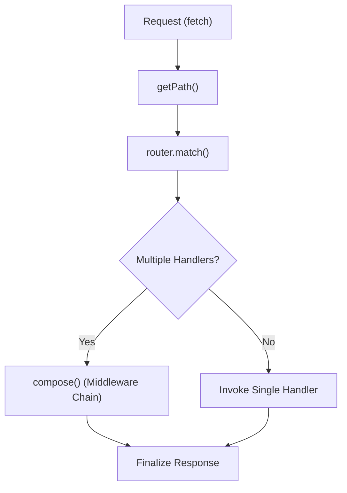

# Application Routing

<details>
<summary>Relevant source files</summary>

The following files were used as context for generating this wiki page:

- [src/types.ts](https://github.com/honojs/hono/blob/main/src/types.ts)
- [src/hono-base.ts](https://github.com/honojs/hono/blob/main/src/hono-base.ts)
- [src/adapter/cloudflare-pages/handler.ts](https://github.com/honojs/hono/blob/main/src/adapter/cloudflare-pages/handler.ts)
- [src/hono.ts](https://github.com/honojs/hono/blob/main/src/hono.ts)
- [src/router/reg-exp-router/router.ts](https://github.com/honojs/hono/blob/main/src/router/reg-exp-router/router.ts)
- [src/utils/url.ts](https://github.com/honojs/hono/blob/main/src/utils/url.ts)
- [src/preset/quick.ts](https://github.com/honojs/hono/blob/main/src/preset/quick.ts)
- [src/helper/route/index.ts](https://github.com/honojs/hono/blob/main/src/helper/route/index.ts)
- [src/router/reg-exp-router/prepared-router.ts](https://github.com/honojs/hono/blob/main/src/router/reg-exp-router/prepared-router.ts)
- [src/router/linear-router/router.ts](https://github.com/honojs/hono/blob/main/src/router/linear-router/router.ts)
- [src/router/pattern-router/router.ts](https://github.com/honojs/hono/blob/main/src/router/pattern-router/router.ts)
- [src/router/trie-router/router.ts](https://github.com/honojs/hono/blob/main/src/router/trie-router/router.ts)
- [src/router/trie-router/node.ts](https://github.com/honojs/hono/blob/main/src/router/trie-router/node.ts)
- [src/helper/ssg/utils.ts](https://github.com/honojs/hono/blob/main/src/helper/ssg/utils.ts)
</details>

Application Routing is the foundational subsystem in Hono responsible for mapping incoming HTTP requests to their corresponding handler functions. By decoupling the request path, method, and headers from the application's business logic, the routing system provides a structured mechanism to define API surfaces, manage middleware execution chains, and handle dynamic route parameters.

The system is designed with a plugin-based architecture, allowing for multiple routing strategies—such as Trie-based, RegExp-based, or Linear-based matching—to accommodate different performance and complexity requirements. At its core, the router acts as a high-speed dispatcher: when a request hits `fetch()`, the router performs a lookup to retrieve an ordered set of handlers, which are then composed into a single execution flow using middleware-aware logic.

This design supports complex routing requirements including base-path prefixing, optional path parameters, and hierarchical sub-app nesting. By maintaining strict control over the execution order—ensuring that path-specific handlers and middleware are triggered in the correct sequence—the system guarantees predictable behavior even in heavily composed applications.

## Registration Mechanism
Registration is the process of binding a path (or pattern) and an HTTP method to a handler function. When methods like `app.get()` or `app.on()` are called, the Hono instance builds an internal list of `RouterRoute` objects and delegates the actual indexing to the underlying router engine.

The registration mechanism preserves metadata about the registration order and base paths, which is critical for the later resolution phase. Specifically, when calling `app.get(path, handler)`, the router adds the route to its structure with the current `_basePath` applied, effectively creating a hierarchical route definition that persists for the lifetime of the Hono instance.

Sources: [src/hono-base.ts:385-397](https://github.com/honojs/hono/blob/main/src/hono-base.ts#L385-L397), [src/types.ts:57-62](https://github.com/honojs/hono/blob/main/src/types.ts#L57-L62)

## The Dispatch Flow
The `fetch()` method serves as the entry point for all incoming requests. The dispatch process transforms a raw `Request` into a `Response` through a multi-step sequence:

1. **Path Normalization**: The `getPath()` function extracts the pathname from the request, normalizing it based on the strict mode configuration.
2. **Lookup**: The router instance (e.g., `TrieRouter` or `RegExpRouter`) performs a `match()` call, returning all candidate handlers associated with the request.
3. **Execution Chain Building**: If multiple matches occur (including wildcards and parameter matches), the library uses the `compose` helper to create an execution chain.
4. **Finalization**: Each handler is invoked. The system enforces that the `Context` must be finalized; if the end of the handler chain is reached without a response, the system triggers the default or user-provided `notFoundHandler`.


Sources: [src/hono-base.ts:406-466](https://github.com/honojs/hono/blob/main/src/hono-base.ts#L406-L466)

## Handler Selection and Scoring
When multiple routes match a path—for instance, a static route `/user` and a dynamic route `/user/:id`—the router must determine the execution priority. The `TrieRouter` manages this by assigning a `score` to each registered handler based on its registration order.

Within `src/router/trie-router/node.ts`, the `search()` method collects all matching `HandlerSet` entries and explicitly sorts them by their `score` attribute:

```typescript
if (handlerSets.length > 1) {
  handlerSets.sort((a, b) => {
    return a.score - b.score
  })
}
```

This ensures that routes registered first take precedence in ties, or according to the specific implementation constraints of the selected router. This sorting happens inside `search()`, preventing redundant re-ordering during the request lifecycle.

Sources: [src/router/trie-router/node.ts:237-241](https://github.com/honojs/hono/blob/main/src/router/trie-router/node.ts#L237-L241)

## Router Engines
Hono supports different router implementations depending on the performance characteristics of the application. The `SmartRouter` is the default and acts as a facade, attempting to pick the most optimal router based on the registered route density.

| Router Class | Strategy | Best For |
| :--- | :--- | :--- |
| `TrieRouter` | Prefix Tree | Complex apps with many overlapping paths |
| `RegExpRouter` | Pre-compiled Regex | High-performance routing with many dynamic segments |
| `LinearRouter` | Linear Scan | Simple applications with few routes |

Sources: [src/hono.ts:28-32](https://github.com/honojs/hono/blob/main/src/hono.ts#L28-L32), [src/preset/quick.ts:20-22](https://github.com/honojs/hono/blob/main/src/preset/quick.ts#L20-L22)

## Routing Invariants and Edge Cases
The routing system relies on several non-obvious invariants to function correctly. 

> [!CAUTION]
> **Handler Finalization**: In the `dispatch` logic, if a handler completes without calling `c.res` or `c.text()`, it is NOT automatically considered finalized. Developers MUST ensure they return a response object or call `await next()` to pass control to subsequent middleware. The system explicitly throws an error if the context remains unfinalized after the compose chain.

> [!NOTE]
> **Optional Parameters**: The `checkOptionalParameter` utility splits a single optional path like `/users/:id?` into two distinct registration entries: `/users` and `/users/:id`. This ensures the underlying trie nodes are correctly created for both potential match scenarios.

Sources: [src/hono-base.ts:455-459](https://github.com/honojs/hono/blob/main/src/hono-base.ts#L455-L459), [src/utils/url.ts:172-206](https://github.com/honojs/hono/blob/main/src/utils/url.ts#L172-L206)

## Example: Advanced Route Grouping
Routing can be modularized using `.route()`, which mounts one Hono instance onto another. This effectively re-prefixes all routes in the child application and merges them into the parent's routing table.

```typescript
import { Hono } from 'hono'

const app = new Hono()
const subApp = new Hono()

// Mount subApp at /api/v1
subApp.get('/users', (c) => c.json({ users: [] }))
app.route('/api/v1', subApp)

// The request GET /api/v1/users will now match subApp's /users handler
```

This mechanism uses `compose()` to wrap existing child handlers, ensuring that any error handling logic defined in the child application is correctly preserved during execution.

Sources: [src/hono-base.ts:208-232](https://github.com/honojs/hono/blob/main/src/hono-base.ts#L208-L232)

## Related

- [[Request Context]]
- [[Middleware Composition]]
- [[Routing Algorithms]]

