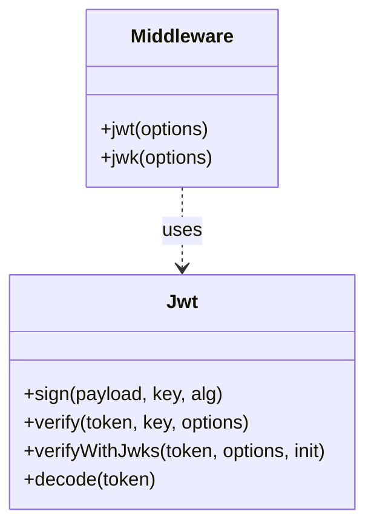
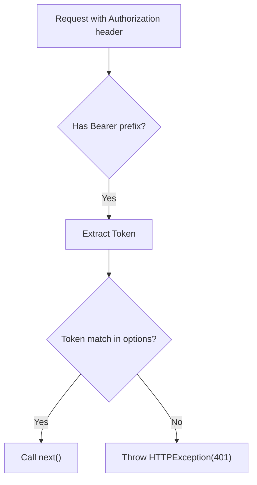

# Authentication

<details>
<summary>Relevant source files</summary>

The following files were used as context for generating this wiki page:

- [src/utils/jwt/jwt.ts](https://github.com/honojs/hono/blob/main/src/utils/jwt/jwt.ts)
- [src/middleware/secure-headers/secure-headers.ts](https://github.com/honojs/hono/blob/main/src/middleware/secure-headers/secure-headers.ts)
- [src/adapter/aws-lambda/handler.ts](https://github.com/honojs/hono/blob/main/src/adapter/aws-lambda/handler.ts)
- [src/middleware/jwk/jwk.ts](https://github.com/honojs/hono/blob/main/src/middleware/jwk/jwk.ts)
- [src/middleware/jwt/jwt.ts](https://github.com/honojs/hono/blob/main/src/middleware/jwt/jwt.ts)
- [src/middleware/bearer-auth/index.ts](https://github.com/honojs/hono/blob/main/src/middleware/bearer-auth/index.ts)
- [package.json](https://github.com/honojs/hono/blob/main/package.json)
- [src/middleware/jwk/keys.test.json](https://github.com/honojs/hono/blob/main/src/middleware/jwk/keys.test.json)
- [src/utils/jwt/jws.ts](https://github.com/honojs/hono/blob/main/src/utils/jwt/jws.ts)
- [src/middleware/basic-auth/index.ts](https://github.com/honojs/hono/blob/main/src/middleware/basic-auth/index.ts)
- [src/utils/cookie.ts](https://github.com/honojs/hono/blob/main/src/utils/cookie.ts)
- [src/utils/basic-auth.ts](https://github.com/honojs/hono/blob/main/src/utils/basic-auth.ts)
- [src/utils/url.ts](https://github.com/honojs/hono/blob/main/src/utils/url.ts)
- [src/helper/proxy/index.ts](https://github.com/honojs/hono/blob/main/src/helper/proxy/index.ts)
- [src/utils/jwt/index.ts](https://github.com/honojs/hono/blob/main/src/utils/jwt/index.ts)
- [src/utils/jwt/types.ts](https://github.com/honojs/hono/blob/main/src/utils/jwt/types.ts)
- [src/middleware/jwk/index.ts](https://github.com/honojs/hono/blob/main/src/middleware/jwk/index.ts)
- [src/utils/jwt/jwa.ts](https://github.com/honojs/hono/blob/main/src/utils/jwt/jwa.ts)
- [src/utils/crypto.ts](https://github.com/honojs/hono/blob/main/src/utils/crypto.ts)
- [src/utils/headers.ts](https://github.com/honojs/hono/blob/main/src/utils/headers.ts)
- [src/middleware/jwt/index.ts](https://github.com/honojs/hono/blob/main/src/middleware/jwt/index.ts)
- [src/client/fetch-result-please.ts](https://github.com/honojs/hono/blob/main/src/client/fetch-result-please.ts)
- [src/utils/jwt/utf8.ts](https://github.com/honojs/hono/blob/main/src/utils/jwt/utf8.ts)
- [src/utils/buffer.ts](https://github.com/honojs/hono/blob/main/src/utils/buffer.ts)
- [src/utils/accept.ts](https://github.com/honojs/hono/blob/main/src/utils/accept.ts)
- [src/utils/encode.ts](https://github.com/honojs/hono/blob/main/src/utils/encode.ts)
- [src/request.ts](https://github.com/honojs/hono/blob/main/src/request.ts)
- [src/types.ts](https://github.com/honojs/hono/blob/main/src/types.ts)
</details>

Authentication in Hono is designed around a modular, middleware-driven architecture that leverages Web Standard APIs. It provides a robust set of tools for identifying and validating requests, primarily through JWT (JSON Web Token), Bearer, and Basic authentication strategies. The system emphasizes security by requiring explicit configuration for secrets, algorithms, and key retrieval, and it integrates seamlessly with Hono’s `Context` to share verified payloads across the application.

At its core, the authentication subsystem addresses the critical task of verifying request origin and integrity before execution reaches application handlers. By providing specific middleware for different standards (JWT, JWK, Bearer, Basic), Hono allows developers to implement security layers declaratively. These middlewares are built on common utilities for token parsing, cryptographic signature verification (using `crypto.subtle`), and secure string comparison to prevent timing attacks.

Design decisions prioritize portability and runtime independence, favoring standard browser-compatible APIs (`crypto.subtle`) over proprietary Node.js modules. This allows the same authentication logic to run efficiently across diverse environments such as Cloudflare Workers, Node.js, Deno, and Bun. The system is designed for extensibility, where users can define custom verification callbacks (e.g., in `basicAuth`) or utilize dynamic JWKS URI fetching to rotate public keys without application deployment.

## JWT Authentication Architecture

The JWT system is composed of high-level middleware and lower-level utilities. The `jwt` middleware provides a standard interface to verify tokens using a static secret or key, while `jwk` middleware supports dynamic key sets retrieved via `jwks_uri`.


Sources: [src/utils/jwt/jwt.ts](https://github.com/honojs/hono/blob/main/src/utils/jwt/jwt.ts#L56-L262), [src/middleware/jwt/jwt.ts](https://github.com/honojs/hono/blob/main/src/middleware/jwt/jwt.ts#L53-L158), [src/middleware/jwk/jwk.ts](https://github.com/honojs/hono/blob/main/src/middleware/jwk/jwk.ts#L48-L168)

## Cryptographic Operations

Cryptographic operations are abstracted through the `signing` and `verifying` functions in `src/utils/jwt/jws.ts`. These functions handle the conversion of various key formats (PEM, JWK, Raw) into `CryptoKey` objects supported by the Web Crypto API.

The `verifying` chain is as follows:
`verifying()` → `getKeyAlgorithm()` → `importPublicKey()` → `crypto.subtle.verify()`.

A load-bearing mechanism in this flow is the key import process, which guards against invalid key formats. For instance, when importing a public key, the code checks if the key is already a `CryptoKey` and, if it is a private key, exports it to a JWK public key to proceed with verification, ensuring that only appropriate usage (signing vs. verification) is applied.

> [!CAUTION]
> Symmetric algorithms (HS256/384/512) are strictly prohibited in `verifyWithJwks` to prevent algorithm confusion attacks where a server might mistake an asymmetric public key for an HMAC secret.

Sources: [src/utils/jwt/jws.ts](https://github.com/honojs/hono/blob/main/src/utils/jwt/jws.ts#L39-L48), [src/utils/jwt/jwt.ts](https://github.com/honojs/hono/blob/main/src/utils/jwt/jwt.ts#L219-L221)

## Bearer Authentication

The `bearerAuth` middleware validates tokens extracted from the `Authorization` header. It implements a timing-safe comparison to prevent side-channel attacks when comparing tokens.

The comparison logic is:
`bearerAuth()` → `timingSafeEqual()` → `constantTimeEqualString()`.

This ensures that the time taken to compare the token does not reveal information about the secret, a critical security invariant for authentication tokens.


Sources: [src/middleware/bearer-auth/index.ts](https://github.com/honojs/hono/blob/main/src/middleware/bearer-auth/index.ts#L104-L221), [src/utils/buffer.ts](https://github.com/honojs/hono/blob/main/src/utils/buffer.ts#L29-L40)

## Basic Authentication

`basicAuth` authenticates requests using the `Authorization: Basic <base64>` header. It automatically parses the header into username and password, then performs a secure verification.

| Strategy | Validation Mechanism |
| :--- | :--- |
| `username`/`password` | `timingSafeEqual` comparison against stored credentials |
| `verifyUser` | Invokes custom user-provided callback for verification |

Sources: [src/middleware/basic-auth/index.ts](https://github.com/honojs/hono/blob/main/src/middleware/basic-auth/index.ts#L80-L153), [src/utils/basic-auth.ts](https://github.com/honojs/hono/blob/main/src/utils/basic-auth.ts#L9-L26)

## Configuration and Usage Example

Developers typically initialize authentication via middleware. Below is an example of setting up JWT authentication with a secret key.

```typescript
import { Hono } from 'hono'
import { jwt } from 'hono/jwt'

const app = new Hono()

app.use(
  '/api/*',
  jwt({
    secret: 'super-secret-key',
    alg: 'HS256',
  })
)

app.get('/api/resource', (c) => {
  const payload = c.get('jwtPayload')
  return c.json({ user: payload })
})
```
Sources: [src/middleware/jwt/jwt.ts](https://github.com/honojs/hono/blob/main/src/middleware/jwt/jwt.ts#L53-L158)

## Error Handling

The authentication subsystem standardizes error handling through `HTTPException`. When authentication fails, the middlewares return an `Unauthorized` status with a `WWW-Authenticate` header, which informs the client about the required authentication scheme or the specific nature of the failure (e.g., `invalid_token` vs `invalid_request`).

> [!NOTE]
> `HTTPException` is a centralized mechanism used across all auth middlewares to ensure consistent status code usage (401 for unauthorized, 400 for bad structure).

Sources: [src/middleware/jwk/jwk.ts](https://github.com/honojs/hono/blob/main/src/middleware/jwk/jwk.ts#L170-L183), [src/http-exception.ts](https://github.com/honojs/hono/blob/main/src/http-exception.ts)

## Related

- [[Security Protection]]
- [[Cryptography and Tokens]]

