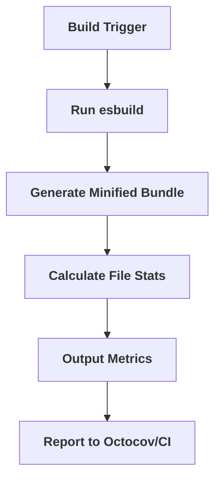

# Bundle Management

Relevant source files

The following files were used as context for generating this wiki page:

- [package.json](https://github.com/honojs/hono/blob/main/package.json)
- [jsr.json](https://github.com/honojs/hono/blob/main/jsr.json)
- [src/helper/ssg/ssg.ts](https://github.com/honojs/hono/blob/main/src/helper/ssg/ssg.ts)
- [perf-measures/bundle-check/scripts/check-bundle-size.ts](https://github.com/honojs/hono/blob/main/perf-measures/bundle-check/scripts/check-bundle-size.ts)
- [package.cjs.json](https://github.com/honojs/hono/blob/main/package.cjs.json)
- [perf-measures/.octocov.consolidated.perf-measures.yml](https://github.com/honojs/hono/blob/main/perf-measures/.octocov.consolidated.perf-measures.yml)
- [perf-measures/.octocov.consolidated.perf-measures.main.yml](https://github.com/honojs/hono/blob/main/perf-measures/.octocov.consolidated.perf-measures.main.yml)
- [tsconfig.base.json](https://github.com/honojs/hono/blob/main/tsconfig.base.json)
- [bunfig.toml](https://github.com/honojs/hono/blob/main/bunfig.toml)
- [src/middleware/jwk/index.ts](https://github.com/honojs/hono/blob/main/src/middleware/jwk/index.ts)
- [runtime-tests/bun/tsconfig.json](https://github.com/honojs/hono/blob/main/runtime-tests/bun/tsconfig.json)
- [runtime-tests/deno/deno.json](https://github.com/honojs/hono/blob/main/runtime-tests/deno/deno.json)
- [runtime-tests/deno-jsx/deno.precompile.json](https://github.com/honojs/hono/blob/main/runtime-tests/deno-jsx/deno.precompile.json)
- [README.md](https://github.com/honojs/hono/blob/main/README.md)
- [runtime-tests/workerd/vitest.config.ts](https://github.com/honojs/hono/blob/main/runtime-tests/workerd/vitest.config.ts)
- [src/router/smart-router/index.ts](https://github.com/honojs/hono/blob/main/src/router/smart-router/index.ts)
- [vitest.config.ts](https://github.com/honojs/hono/blob/main/vitest.config.ts)
- [runtime-tests/deno-jsx/deno.react-jsx.json](https://github.com/honojs/hono/blob/main/runtime-tests/deno-jsx/deno.react-jsx.json)
- [tsconfig.json](https://github.com/honojs/hono/blob/main/tsconfig.json)
- [runtime-tests/fastly/vitest.config.ts](https://github.com/honojs/hono/blob/main/runtime-tests/fastly/vitest.config.ts)
- [tsconfig.build.json](https://github.com/honojs/hono/blob/main/tsconfig.build.json)
- [tsconfig.spec.json](https://github.com/honojs/hono/blob/main/tsconfig.spec.json)

Bundle Management in Hono is architected to ensure the framework remains extremely lightweight while maintaining high performance across diverse JavaScript runtimes. By employing a modular distribution strategy and rigorous performance monitoring, Hono ensures that its "tiny" preset stays under 12kB, a critical factor for edge deployment scenarios like Cloudflare Workers or Fastly Compute. The management system balances the need for a comprehensive "batteries included" feature set with the practical requirement for minimal footprint.

The system relies on a multi-tiered approach: code-level structural organization that supports granular imports via `exports`, build-time transformations to generate specialized bundles (like `cjs` for Node.js compatibility), and automated size-check tooling that treats bundle size as a first-class metric in the CI pipeline. By isolating dependencies and avoiding common heavy libraries, Hono keeps its core dependency-free, ensuring that it remains performant and predictable regardless of the target runtime environment.

## Bundle Structure and Distribution
Hono uses an `exports` map in `package.json` to define entry points, enabling fine-grained control over what consumers load. This structural choice prevents "bundler-bloat," where a user might accidentally pull in the entire library when only a single utility or middleware is needed. The `exports` map defines explicit paths for `import` (ESM) and `require` (CJS) for every major module, ensuring maximum compatibility with Node.js while keeping the ESM core as the primary, optimized entry point.

| Target | Entry Point Pattern | Purpose |
| :--- | :--- | :--- |
| `.` | `dist/index.js` | Core framework entry |
| `./tiny` | `dist/preset/tiny.js` | Minimalist Hono build |
| `./jsx` | `dist/jsx/index.js` | JSX support modules |
| `./middleware/*` | `dist/middleware/*/index.js` | Modular middleware |

Sources: [package.json:38-414](https://github.com/honojs/hono/blob/main/package.json#L38-L414)

## Automated Performance Monitoring
Bundle size is actively tracked through a specialized script, `perf-measures/bundle-check/scripts/check-bundle-size.ts`. This script leverages `esbuild` to generate a production-ready, minified bundle of the framework, calculates its size in bytes/KB, and outputs these metrics to standard output. This data is then consumed by the project's CI (via `octocov` configurations) to maintain a regression-free environment for bundle size.

Sources: [perf-measures/bundle-check/scripts/check-bundle-size.ts:1-53](https://github.com/honojs/hono/blob/main/perf-measures/bundle-check/scripts/check-bundle-size.ts#L1-L53), [perf-measures/.octocov.consolidated.perf-measures.main.yml:1-23](https://github.com/honojs/hono/blob/main/perf-measures/.octocov.consolidated.perf-measures.main.yml#L1-L23)

## SSG Content Flow
The `ssg` helper is a distinct component of bundle management, focusing on generating files from routes. Its flow manages concurrent processing via `createPool`, ensuring that even complex applications with many generated pages do not overwhelm the host environment. The mechanism performs internal dispatching and file saving, using a `generateFilePath` function that handles directory traversal and ensures paths are constrained within the designated output directory.

Sources: [src/helper/ssg/ssg.ts:50-72](https://github.com/honojs/hono/blob/main/src/helper/ssg/ssg.ts#L50-L72), [src/helper/ssg/ssg.ts:310-334](https://github.com/honojs/hono/blob/main/src/helper/ssg/ssg.ts#L310-L334)

## Build Pipeline and Lifecycle
The Hono build lifecycle is managed via `bun` and a dedicated `build.ts` script. The process includes removing the previous `dist` directory, executing the core compilation, and performing auxiliary tasks like copying specific CJS `package.json` files into the distribution artifacts to ensure `require()` works correctly in the Node.js ecosystem.

1. `remove-dist`: Wipes `./dist` to ensure a clean slate.
2. `build.ts`: Executes compilation logic (typically via `esbuild` or similar).
3. `copy:package.cjs.json`: Ensures the CJS distribution folder correctly identifies itself as `commonjs` for Node.js modules.

Sources: [package.json:29-36](https://github.com/honojs/hono/blob/main/package.json#L29-L36), [package.cjs.json:1-3](https://github.com/honojs/hono/blob/main/package.cjs.json#L1-L3)

## Plugin Architecture
The SSG subsystem uses a plugin model for extending the generation process. Plugins define hooks that are combined using specialized utility functions. These utilities, such as `combineBeforeRequestHooks`, consolidate multiple hook definitions into a single async execution path, facilitating the sequential processing of data through the generation pipeline without tightly coupling the core `toSSG` implementation to specific middleware features.

Sources: [src/helper/ssg/ssg.ts:118-173](https://github.com/honojs/hono/blob/main/src/helper/ssg/ssg.ts#L118-L173), [src/helper/ssg/ssg.ts:368-470](https://github.com/honojs/hono/blob/main/src/helper/ssg/ssg.ts#L368-L470)

## Design Trade-offs
| Design Choice | Benefit | Cost |
| :--- | :--- | :--- |
| Zero Dependencies | Minimal bundle size, runtime portability | Increased maintenance of core utilities |
| Modular `exports` | Prevents unnecessary bundle inclusion | Complex `package.json` structure |
| SSG Concurrent Pool | Prevents overloading memory/IO | Adds internal complexity to the SSG helper |
| CJS/ESM hybrid | High compatibility | Need for sync `package.json` artifacts |

Sources: [package.json:38-414](https://github.com/honojs/hono/blob/main/package.json#L38-L414), [src/helper/ssg/ssg.ts:223](https://github.com/honojs/hono/blob/main/src/helper/ssg/ssg.ts#L223)

> [!NOTE]
> The build system maintains explicit `tsconfig` separation (`base`, `build`, and `spec`) to ensure that production bundles and testing artifacts do not leak into one another, preserving the integrity of the published library.

Sources: [tsconfig.base.json:1-15](https://github.com/honojs/hono/blob/main/tsconfig.base.json#L1-L15), [tsconfig.build.json:1-18](https://github.com/honojs/hono/blob/main/tsconfig.build.json#L1-L18)

## Related

- [[Quick Start]]

