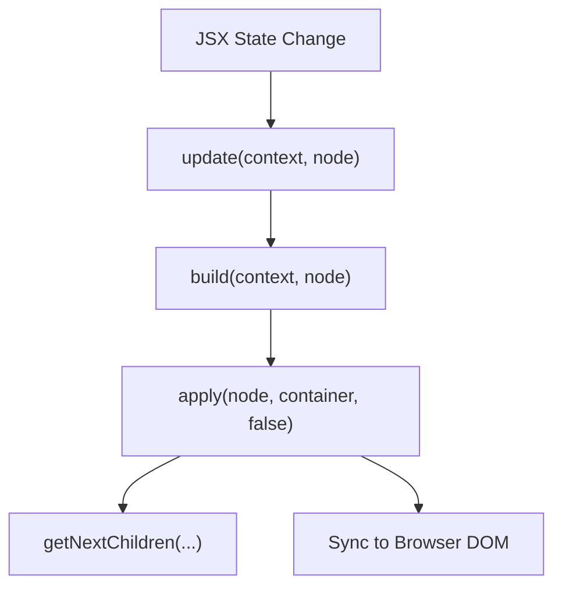

# Client DOM

<details>
<summary>Relevant source files</summary>

The following files were used as context for generating this wiki page:

- [src/jsx/dom/render.ts](https://github.com/honojs/hono/blob/main/src/jsx/dom/render.ts)
- [src/jsx/context.ts](https://github.com/honojs/hono/blob/main/src/jsx/context.ts)
- [src/client/client.ts](https://github.com/honojs/hono/blob/main/src/client/client.ts)
- [src/jsx/components.ts](https://github.com/honojs/hono/blob/main/src/jsx/components.ts)
- [src/jsx/hooks/index.ts](https://github.com/honojs/hono/blob/main/src/jsx/hooks/index.ts)
- [src/jsx/base.ts](https://github.com/honojs/hono/blob/main/src/jsx/base.ts)
- [src/jsx/intrinsic-elements.ts](https://github.com/honojs/hono/blob/main/src/jsx/intrinsic-elements.ts)
- [src/jsx/streaming.ts](https://github.com/honojs/hono/blob/main/src/jsx/streaming.ts)
- [src/jsx/dom/intrinsic-element/components.ts](https://github.com/honojs/hono/blob/main/src/jsx/dom/intrinsic-element/components.ts)
- [src/jsx/dom/client.ts](https://github.com/honojs/hono/blob/main/src/jsx/dom/client.ts)
- [src/jsx/intrinsic-element/components.ts](https://github.com/honojs/hono/blob/main/src/jsx/intrinsic-element/components.ts)
- [src/jsx/utils.ts](https://github.com/honojs/hono/blob/main/src/jsx/utils.ts)
- [src/jsx/dom/index.ts](https://github.com/honojs/hono/blob/main/src/jsx/dom/index.ts)
- [src/middleware/jsx-renderer/index.ts](https://github.com/honojs/hono/blob/main/src/middleware/jsx-renderer/index.ts)
- [src/jsx/dom/css.ts](https://github.com/honojs/hono/blob/main/src/jsx/dom/css.ts)
- [src/jsx/jsx-runtime.ts](https://github.com/honojs/hono/blob/main/src/jsx/jsx-runtime.ts)
- [src/utils/html.ts](https://github.com/honojs/hono/blob/main/src/utils/html.ts)
- [src/jsx/dom/components.ts](https://github.com/honojs/hono/blob/main/src/jsx/dom/components.ts)
- [src/jsx/index.ts](https://github.com/honojs/hono/blob/main/src/jsx/index.ts)
- [src/jsx/dom/server.ts](https://github.com/honojs/hono/blob/main/src/jsx/dom/server.ts)
- [src/jsx/dom/hooks/index.ts](https://github.com/honojs/hono/blob/main/src/jsx/dom/hooks/index.ts)
- [src/jsx/dom/jsx-dev-runtime.ts](https://github.com/honojs/hono/blob/main/src/jsx/dom/jsx-dev-runtime.ts)
- [src/jsx/dom/jsx-runtime.ts](https://github.com/honojs/hono/blob/main/src/jsx/dom/jsx-runtime.ts)
- [src/jsx/constants.ts](https://github.com/honojs/hono/blob/main/src/jsx/constants.ts)
- [src/jsx/dom/context.ts](https://github.com/honojs/hono/blob/main/src/jsx/dom/context.ts)
- [src/jsx/types.ts](https://github.com/honojs/hono/blob/main/src/jsx/types.ts)
- [src/jsx/intrinsic-element/common.ts](https://github.com/honojs/hono/blob/main/src/jsx/intrinsic-element/common.ts)
- [src/jsx/jsx-dev-runtime.ts](https://github.com/honojs/hono/blob/main/src/jsx/jsx-dev-runtime.ts)
- [src/jsx/dom/utils.ts](https://github.com/honojs/hono/blob/main/src/jsx/dom/utils.ts)
</details>

Client DOM is a lightweight, high-performance virtual rendering engine for Hono, specifically designed for client-side reconciliation and hydration. Unlike server-side JSX which produces strings, Client DOM transforms JSX declarations into real browser DOM nodes (`HTMLElement`, `SVGElement`, `Text`) and provides a reactive system to patch these nodes efficiently when state changes.

The engine operates by maintaining an internal tree of `Node` representations (as defined by the `Node` type) that map directly to browser nodes. It is responsible for building this virtual tree, computing differences, and applying updates using standard DOM APIs like `appendChild` and `insertBefore`. The system is designed for speed: for example, it avoids expensive regex checks for attribute names during runtime, opting instead to catch `InvalidCharacterError` exceptions when attributes are set, which is faster for the common case where attributes are valid.

Crucially, Client DOM integrates seamlessly with Hono’s JSX hooks (like `useState` and `useEffect`), enabling declarative UI development in the browser. It implements a reconciliation algorithm that tracks previous and next children, and provides advanced features such as portals, `ErrorBoundary` components for fault tolerance, and deferred rendering via `useDeferredValue` and transitions. By prioritizing performance and interoperability with existing browser APIs, Client DOM serves as the bridge between Hono’s functional, component-based JSX and the imperative Browser DOM.

## Core Reconciliation Loop
The heart of Client DOM is a `build` and `apply` loop. `build` generates the next version of the virtual tree, while `apply` synchronizes the actual browser DOM to match this new state.


Sources: [src/jsx/dom/render.ts:740-780](https://github.com/honojs/hono/blob/main/src/jsx/dom/render.ts#L740-L780), [src/jsx/dom/render.ts:497-665](https://github.com/honojs/hono/blob/main/src/jsx/dom/render.ts#L497-L665), [src/jsx/dom/render.ts:387-481](https://github.com/honojs/hono/blob/main/src/jsx/dom/render.ts#L387-L481)

## Node Lifecycle and State Management
Nodes in the Client DOM system, identified by the `Node` type, may store state and metadata using the `DOM_STASH` symbol.

| Property | Type | Description |
| :--- | :--- | :--- |
| `pP` | `Props` | Previous props for diffing |
| `vC` | `Node[]` | Virtual DOM children |
| `c` | `Container` | The browser container/parent node |
| `e` | `HTMLElement` | The actual browser element |
| `[DOM_STASH]` | `Array` | Internal store for hooks, context, and error boundaries |

Sources: [src/jsx/dom/render.ts:41-65](https://github.com/honojs/hono/blob/main/src/jsx/dom/render.ts#L41-L65), [src/jsx/dom/render.ts:80](https://github.com/honojs/hono/blob/main/src/jsx/dom/render.ts#L80)

## Call Chain: Executing an Update
When state is modified via `useState`, the system triggers an update. The following chain demonstrates how a state change leads to DOM synchronization:

1. `update()`: Initiates the update process, ensuring only the latest call executes if multiple updates are queued.
2. `updateSync()`: Synchronizes the internal context values and calls `build()`.
3. `build()`: Re-renders the component and calculates the new virtual child nodes.
4. `apply()`: The reconcile phase; it compares the previous children against the new ones and applies necessary DOM mutations.
5. `getNextChildren()`: Traverses the new virtual tree to identify elements that must be added, updated, or removed.

Sources: [src/jsx/dom/render.ts:739-780](https://github.com/honojs/hono/blob/main/src/jsx/dom/render.ts#L739-L780), [src/jsx/dom/render.ts:712-731](https://github.com/honojs/hono/blob/main/src/jsx/dom/render.ts#L712-L731), [src/jsx/dom/render.ts:497-665](https://github.com/honojs/hono/blob/main/src/jsx/dom/render.ts#L497-L665), [src/jsx/dom/render.ts:363-366](https://github.com/honojs/hono/blob/main/src/jsx/dom/render.ts#L363-L366), [src/jsx/dom/render.ts:292-331](https://github.com/honojs/hono/blob/main/src/jsx/dom/render.ts#L292-L331)

## Fault Tolerance: Error Boundaries
Client DOM handles runtime errors via `ErrorBoundary` components. If a component tree fails to build, the `try/catch` block in `build()` intercepts the error and attempts to recover using an `ErrorHandler` defined in the closest boundary.

> [!IMPORTANT]
> The error boundary recovery process uses `fallbackUpdateFnArrayMap` to ensure that if a fallback UI is triggered, the engine can track the error handler node. The `throw cancelBuild` mechanism is used internally to stop the current tree walk once a fallback has been scheduled.

Sources: [src/jsx/dom/render.ts:610-659](https://github.com/honojs/hono/blob/main/src/jsx/dom/render.ts#L610-L659)

## Client Initialization
Initialization of a Hono application in the browser is handled by `hydrateRoot`, which attaches to an existing DOM structure to add interactivity.

```typescript
import { hydrateRoot } from 'hono/jsx/dom/client'

const container = document.getElementById('root')
hydrateRoot(container, <App />)
```

Sources: [src/jsx/dom/client.ts:76-84](https://github.com/honojs/hono/blob/main/src/jsx/dom/client.ts#L76-L84)

## Performance Design Trade-offs

| Design Choice | Benefit | Cost |
| :--- | :--- | :--- |
| `try/catch` for attributes | Faster path for valid attributes | Small overhead on rare `InvalidCharacterError` |
| Internal `DOM_STASH` | Memory-efficient state storage | Requires manual management of object keys |
| Asynchronous queueing | Better UI responsiveness, prevents layout thrashing | Complex logic to handle race conditions during transitions |

Sources: [src/jsx/dom/render.ts:158-160](https://github.com/honojs/hono/blob/main/src/jsx/dom/render.ts#L158-L160), [src/jsx/dom/render.ts:55-64](https://github.com/honojs/hono/blob/main/src/jsx/dom/render.ts#L55-L64)

## Related

- [[JSX Components]]

